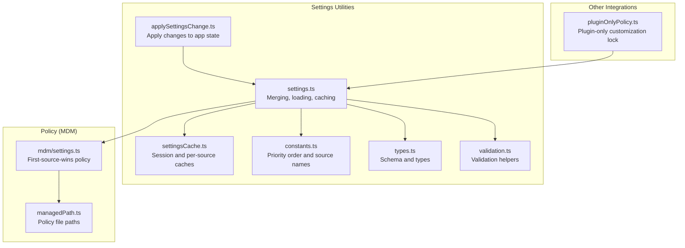
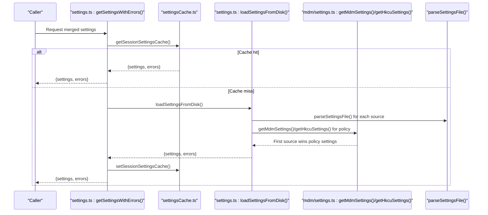
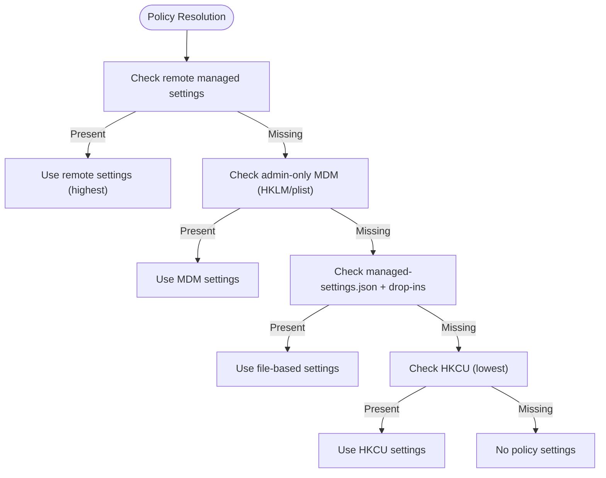
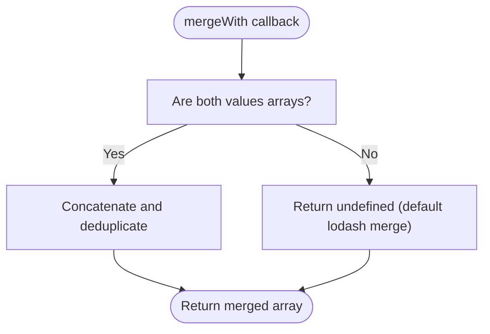
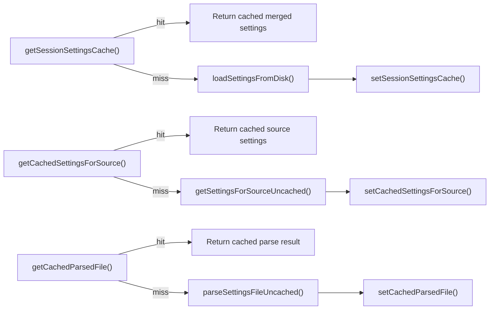
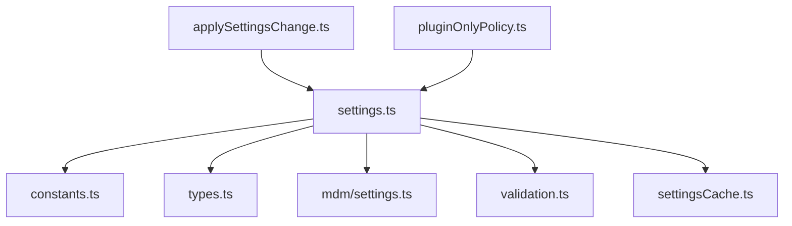

# Settings Merging and Priority Resolution

<cite>
**Referenced Files in This Document**
- [settings.ts](file://claude_code_src/restored-src/src/utils/settings/settings.ts)
- [settingsCache.ts](file://claude_code_src/restored-src/src/utils/settings/settingsCache.ts)
- [constants.ts](file://claude_code_src/restored-src/src/utils/settings/constants.ts)
- [types.ts](file://claude_code_src/restored-src/src/utils/settings/types.ts)
- [mdm/settings.ts](file://claude_code_src/restored-src/src/utils/settings/mdm/settings.ts)
- [managedPath.ts](file://claude_code_src/restored-src/src/utils/settings/managedPath.ts)
- [validation.ts](file://claude_code_src/restored-src/src/utils/settings/validation.ts)
- [applySettingsChange.ts](file://claude_code_src/restored-src/src/utils/settings/applySettingsChange.ts)
- [pluginOnlyPolicy.ts](file://claude_code_src/restored-src/src/utils/settings/pluginOnlyPolicy.ts)
</cite>

## Table of Contents
1. [Introduction](#introduction)
2. [Project Structure](#project-structure)
3. [Core Components](#core-components)
4. [Architecture Overview](#architecture-overview)
5. [Detailed Component Analysis](#detailed-component-analysis)
6. [Dependency Analysis](#dependency-analysis)
7. [Performance Considerations](#performance-considerations)
8. [Troubleshooting Guide](#troubleshooting-guide)
9. [Conclusion](#conclusion)

## Introduction
This document explains the settings merging and priority resolution system used by the Claude Code Python IDE. It covers:
- Hierarchical priority order for settings sources
- The custom merge function that treats arrays distinctly from objects
- The "first source wins" principle for policy settings
- Practical merge scenarios, array handling, and nested object merging
- Performance optimizations and caching strategies

## Project Structure
The settings system is implemented primarily in the settings utilities and integrates with MDM (policy) sources, caching, and validation.

**Diagram sources**
- [settings.ts:655-868](file://claude_code_src/restored-src/src/utils/settings/settings.ts#L655-L868)
- [settingsCache.ts:1-81](file://claude_code_src/restored-src/src/utils/settings/settingsCache.ts#L1-L81)
- [constants.ts:7-22](file://claude_code_src/restored-src/src/utils/settings/constants.ts#L7-L22)
- [types.ts:255-256](file://claude_code_src/restored-src/src/utils/settings/types.ts#L255-L256)
- [validation.ts:97-173](file://claude_code_src/restored-src/src/utils/settings/validation.ts#L97-L173)
- [applySettingsChange.ts:33-92](file://claude_code_src/restored-src/src/utils/settings/applySettingsChange.ts#L33-L92)
- [mdm/settings.ts:114-155](file://claude_code_src/restored-src/src/utils/settings/mdm/settings.ts#L114-L155)
- [managedPath.ts:8-34](file://claude_code_src/restored-src/src/utils/settings/managedPath.ts#L8-L34)
- [pluginOnlyPolicy.ts:19-27](file://claude_code_src/restored-src/src/utils/settings/pluginOnlyPolicy.ts#L19-L27)

**Section sources**
- [settings.ts:655-868](file://claude_code_src/restored-src/src/utils/settings/settings.ts#L655-L868)
- [settingsCache.ts:1-81](file://claude_code_src/restored-src/src/utils/settings/settingsCache.ts#L1-L81)
- [constants.ts:7-22](file://claude_code_src/restored-src/src/utils/settings/constants.ts#L7-L22)
- [mdm/settings.ts:114-155](file://claude_code_src/restored-src/src/utils/settings/mdm/settings.ts#L114-L155)

## Core Components
- Settings merging and priority:
  - Sources in ascending priority order: plugin settings (lowest), user settings, project settings, local settings, flag settings, policy settings (highest).
  - Policy settings use "first source wins" across remote, admin-only MDM, file-based managed settings, and HKCU.
- Custom merge function:
  - Arrays are concatenated and deduplicated; objects are deeply merged with default behavior.
- Caching:
  - Session-level cache for merged settings, per-source cache, and path-keyed cache for parsed files.
- Validation and diagnostics:
  - Zod-based schema validation with error formatting and warnings for invalid permission rules.

**Section sources**
- [constants.ts:7-22](file://claude_code_src/restored-src/src/utils/settings/constants.ts#L7-L22)
- [settings.ts:538-547](file://claude_code_src/restored-src/src/utils/settings/settings.ts#L538-L547)
- [settings.ts:655-868](file://claude_code_src/restored-src/src/utils/settings/settings.ts#L655-L868)
- [mdm/settings.ts:11-13](file://claude_code_src/restored-src/src/utils/settings/mdm/settings.ts#L11-L13)
- [validation.ts:224-265](file://claude_code_src/restored-src/src/utils/settings/validation.ts#L224-L265)

## Architecture Overview
The system loads settings from disk, validates them, merges them according to priority, and caches the result for the session. Policy settings are resolved via "first source wins".

**Diagram sources**
- [settings.ts:856-868](file://claude_code_src/restored-src/src/utils/settings/settings.ts#L856-L868)
- [settings.ts:645-796](file://claude_code_src/restored-src/src/utils/settings/settings.ts#L645-L796)
- [settingsCache.ts:7-13](file://claude_code_src/restored-src/src/utils/settings/settingsCache.ts#L7-L13)
- [mdm/settings.ts:124-134](file://claude_code_src/restored-src/src/utils/settings/mdm/settings.ts#L124-L134)

## Detailed Component Analysis

### Priority Order and "First Source Wins" for Policy
- Priority order for regular sources (ascending to descending):
  - plugin settings, user settings, project settings, local settings, flag settings, policy settings.
- Policy settings use "first source wins":
  - Highest priority: remote managed settings (if present)
  - Next: admin-only MDM (HKLM/plist)
  - Then: file-based managed settings (managed-settings.json + drop-ins)
  - Lowest: HKCU (Windows user-writable)
- The origin of the active policy is determined by the first non-empty source.

**Diagram sources**
- [settings.ts:375-407](file://claude_code_src/restored-src/src/utils/settings/settings.ts#L375-L407)
- [settings.ts:677-739](file://claude_code_src/restored-src/src/utils/settings/settings.ts#L677-L739)
- [mdm/settings.ts:11-13](file://claude_code_src/restored-src/src/utils/settings/mdm/settings.ts#L11-L13)
- [mdm/settings.ts:228-273](file://claude_code_src/restored-src/src/utils/settings/mdm/settings.ts#L228-L273)

**Section sources**
- [constants.ts:7-22](file://claude_code_src/restored-src/src/utils/settings/constants.ts#L7-L22)
- [settings.ts:375-407](file://claude_code_src/restored-src/src/utils/settings/settings.ts#L375-L407)
- [settings.ts:677-739](file://claude_code_src/restored-src/src/utils/settings/settings.ts#L677-L739)
- [mdm/settings.ts:11-13](file://claude_code_src/restored-src/src/utils/settings/mdm/settings.ts#L11-L13)

### Custom Merge Function: Arrays vs Objects
- Arrays:
  - Concatenate and deduplicate using a dedicated merge function.
- Objects:
  - Deep merge using the default behavior.
- This ensures predictable ordering and uniqueness for arrays while preserving nested object structures.

**Diagram sources**
- [settings.ts:529-547](file://claude_code_src/restored-src/src/utils/settings/settings.ts#L529-L547)

**Section sources**
- [settings.ts:529-547](file://claude_code_src/restored-src/src/utils/settings/settings.ts#L529-L547)

### Practical Merge Scenarios
- Nested object merging:
  - Fields like permissions, sandbox, hooks are merged deeply; unknown fields are preserved where allowed by the schema.
- Arrays:
  - Examples include allowlists/denylists for MCP servers, environment variables, and marketplace configurations. These are concatenated and deduplicated.
- Deletion:
  - Explicitly deleting a key is supported by setting it to undefined in targeted updates.

**Section sources**
- [settings.ts:473-495](file://claude_code_src/restored-src/src/utils/settings/settings.ts#L473-L495)
- [types.ts:42-84](file://claude_code_src/restored-src/src/utils/settings/types.ts#L42-L84)
- [types.ts:417-434](file://claude_code_src/restored-src/src/utils/settings/types.ts#L417-L434)

### Caching and Performance Optimizations
- Session-level cache:
  - getSettingsWithErrors() caches merged results for the session to avoid repeated disk I/O.
- Per-source cache:
  - getSettingsForSource() caches individual source results; invalidated alongside session cache.
- Path-keyed cache:
  - parseSettingsFile() caches parsed results for the same path to avoid redundant parsing.
- Plugin base cache:
  - Plugin-provided settings are cached as the base layer for merging.
- Reset on changes:
  - resetSettingsCache() clears all caches when settings change, ensuring freshness.

**Diagram sources**
- [settings.ts:856-868](file://claude_code_src/restored-src/src/utils/settings/settings.ts#L856-L868)
- [settings.ts:309-368](file://claude_code_src/restored-src/src/utils/settings/settings.ts#L309-L368)
- [settings.ts:178-231](file://claude_code_src/restored-src/src/utils/settings/settings.ts#L178-L231)
- [settingsCache.ts:7-59](file://claude_code_src/restored-src/src/utils/settings/settingsCache.ts#L7-L59)

**Section sources**
- [settings.ts:856-868](file://claude_code_src/restored-src/src/utils/settings/settings.ts#L856-L868)
- [settings.ts:309-368](file://claude_code_src/restored-src/src/utils/settings/settings.ts#L309-L368)
- [settings.ts:178-231](file://claude_code_src/restored-src/src/utils/settings/settings.ts#L178-L231)
- [settingsCache.ts:1-81](file://claude_code_src/restored-src/src/utils/settings/settingsCache.ts#L1-L81)

### Validation and Error Handling
- Schema validation:
  - Zod-based schema validates settings; invalid fields are reported with human-readable messages.
- Permission rule filtering:
  - Invalid permission rules are filtered out with warnings to avoid rejecting the entire settings file.
- Error deduplication:
  - During merging, errors are deduplicated by combining file, path, and message into a composite key.

**Section sources**
- [validation.ts:97-173](file://claude_code_src/restored-src/src/utils/settings/validation.ts#L97-L173)
- [validation.ts:224-265](file://claude_code_src/restored-src/src/utils/settings/validation.ts#L224-L265)
- [settings.ts:749-784](file://claude_code_src/restored-src/src/utils/settings/settings.ts#L749-L784)

### Applying Changes to Application State
- When settings change, the system re-reads settings, reloads permissions and hooks, and updates the app state accordingly.
- The change detector resets caches before listeners run to ensure a consistent, fresh state.

**Section sources**
- [applySettingsChange.ts:33-92](file://claude_code_src/restored-src/src/utils/settings/applySettingsChange.ts#L33-L92)
- [settings.ts:836-848](file://claude_code_src/restored-src/src/utils/settings/settings.ts#L836-L848)

### Policy Lockdown for Plugin-Only Customization
- The managed setting strictPluginOnlyCustomization can restrict certain customization surfaces to plugin-only sources.
- Admin-trusted sources (plugin, policySettings, built-in/builtin/bundled) are exempt from this restriction.

**Section sources**
- [pluginOnlyPolicy.ts:19-27](file://claude_code_src/restored-src/src/utils/settings/pluginOnlyPolicy.ts#L19-L27)
- [pluginOnlyPolicy.ts:58-60](file://claude_code_src/restored-src/src/utils/settings/pluginOnlyPolicy.ts#L58-L60)
- [types.ts:248-253](file://claude_code_src/restored-src/src/utils/settings/types.ts#L248-L253)

## Dependency Analysis
The settings system depends on:
- Constants for source ordering and display
- Schema types for validation
- MDM utilities for policy resolution
- Validation helpers for error formatting
- Caching utilities for performance

**Diagram sources**
- [settings.ts:1-60](file://claude_code_src/restored-src/src/utils/settings/settings.ts#L1-L60)
- [constants.ts:1-20](file://claude_code_src/restored-src/src/utils/settings/constants.ts#L1-L20)
- [types.ts:1-20](file://claude_code_src/restored-src/src/utils/settings/types.ts#L1-L20)
- [mdm/settings.ts:1-47](file://claude_code_src/restored-src/src/utils/settings/mdm/settings.ts#L1-L47)
- [validation.ts:1-10](file://claude_code_src/restored-src/src/utils/settings/validation.ts#L1-L10)
- [settingsCache.ts:1-10](file://claude_code_src/restored-src/src/utils/settings/settingsCache.ts#L1-L10)
- [applySettingsChange.ts:1-15](file://claude_code_src/restored-src/src/utils/settings/applySettingsChange.ts#L1-L15)
- [pluginOnlyPolicy.ts:1-5](file://claude_code_src/restored-src/src/utils/settings/pluginOnlyPolicy.ts#L1-L5)

**Section sources**
- [settings.ts:1-60](file://claude_code_src/restored-src/src/utils/settings/settings.ts#L1-L60)
- [constants.ts:1-20](file://claude_code_src/restored-src/src/utils/settings/constants.ts#L1-L20)
- [types.ts:1-20](file://claude_code_src/restored-src/src/utils/settings/types.ts#L1-L20)
- [mdm/settings.ts:1-47](file://claude_code_src/restored-src/src/utils/settings/mdm/settings.ts#L1-L47)
- [validation.ts:1-10](file://claude_code_src/restored-src/src/utils/settings/validation.ts#L1-L10)
- [settingsCache.ts:1-10](file://claude_code_src/restored-src/src/utils/settings/settingsCache.ts#L1-L10)
- [applySettingsChange.ts:1-15](file://claude_code_src/restored-src/src/utils/settings/applySettingsChange.ts#L1-L15)
- [pluginOnlyPolicy.ts:1-5](file://claude_code_src/restored-src/src/utils/settings/pluginOnlyPolicy.ts#L1-L5)

## Performance Considerations
- Single-session caching:
  - Merged settings are cached for the lifetime of the session to minimize disk I/O.
- Deduped file parsing:
  - Path-keyed cache avoids reparsing the same file multiple times during startup.
- Per-source caching:
  - Individual source reads are cached and invalidated together with the session cache.
- Early MDM load:
  - On platforms with MDM, the system starts reading policy sources early and awaits them before first settings read to overlap I/O with module loading.

**Section sources**
- [settings.ts:856-868](file://claude_code_src/restored-src/src/utils/settings/settings.ts#L856-L868)
- [settings.ts:178-231](file://claude_code_src/restored-src/src/utils/settings/settings.ts#L178-L231)
- [settingsCache.ts:41-59](file://claude_code_src/restored-src/src/utils/settings/settingsCache.ts#L41-L59)
- [mdm/settings.ts:67-109](file://claude_code_src/restored-src/src/utils/settings/mdm/settings.ts#L67-L109)

## Troubleshooting Guide
- Settings not taking effect:
  - Verify the correct source is enabled and not overridden by a higher-priority source (especially policy).
  - Confirm that the settings file is valid JSON and passes schema validation.
- Conflicts between sources:
  - Policy settings use "first source wins"; if multiple sources define the same setting, the first non-empty source determines the value.
  - Arrays are concatenated and deduplicated; verify the final order and uniqueness.
- Errors and warnings:
  - Review formatted validation errors and warnings for invalid permission rules.
  - Use getSettingsWithSources() to inspect which sources contributed to the effective settings.
- Applying changes:
  - After editing settings, ensure caches are reset and the app state is updated by the change detection mechanism.

**Section sources**
- [settings.ts:836-848](file://claude_code_src/restored-src/src/utils/settings/settings.ts#L836-L848)
- [validation.ts:97-173](file://claude_code_src/restored-src/src/utils/settings/validation.ts#L97-L173)
- [applySettingsChange.ts:33-92](file://claude_code_src/restored-src/src/utils/settings/applySettingsChange.ts#L33-L92)

## Conclusion
The settings system in Claude Code Python IDE provides a robust, prioritized, and validated configuration pipeline. Regular sources merge with custom array handling and deep object merging, while policy settings adhere to a "first source wins" rule. Comprehensive caching and early MDM loading optimize performance, and strong validation/error handling ensures reliability.