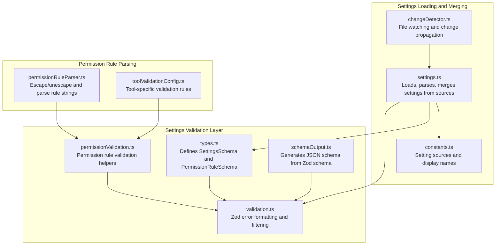
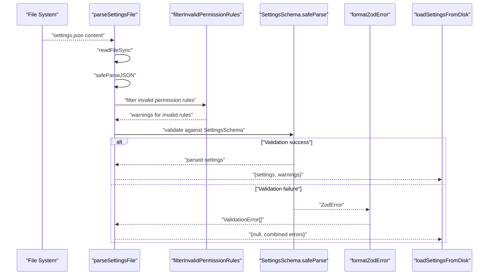
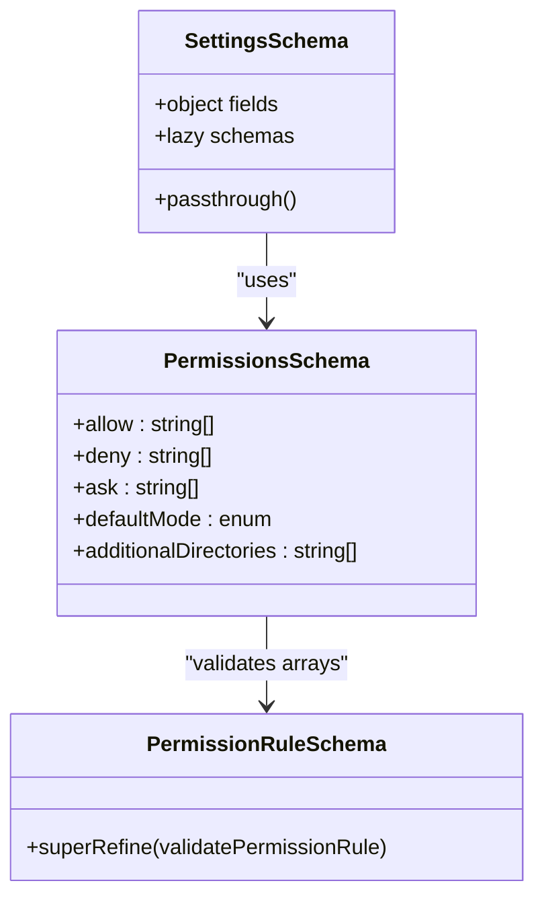
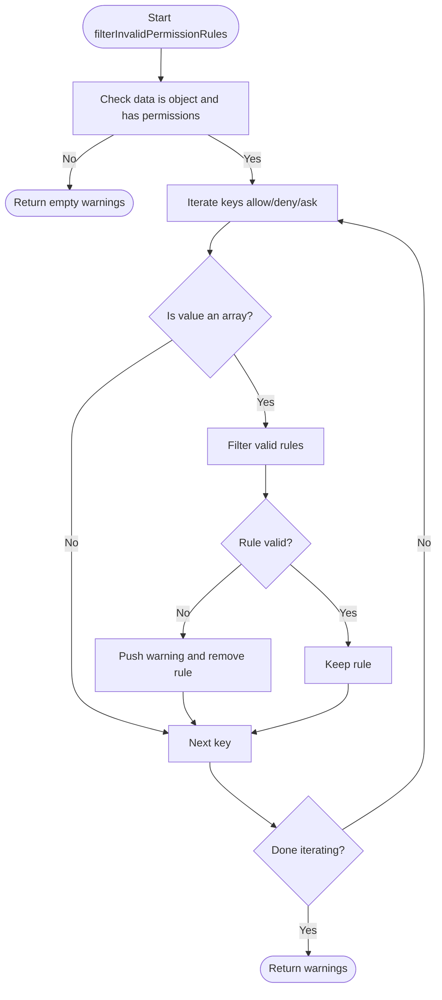
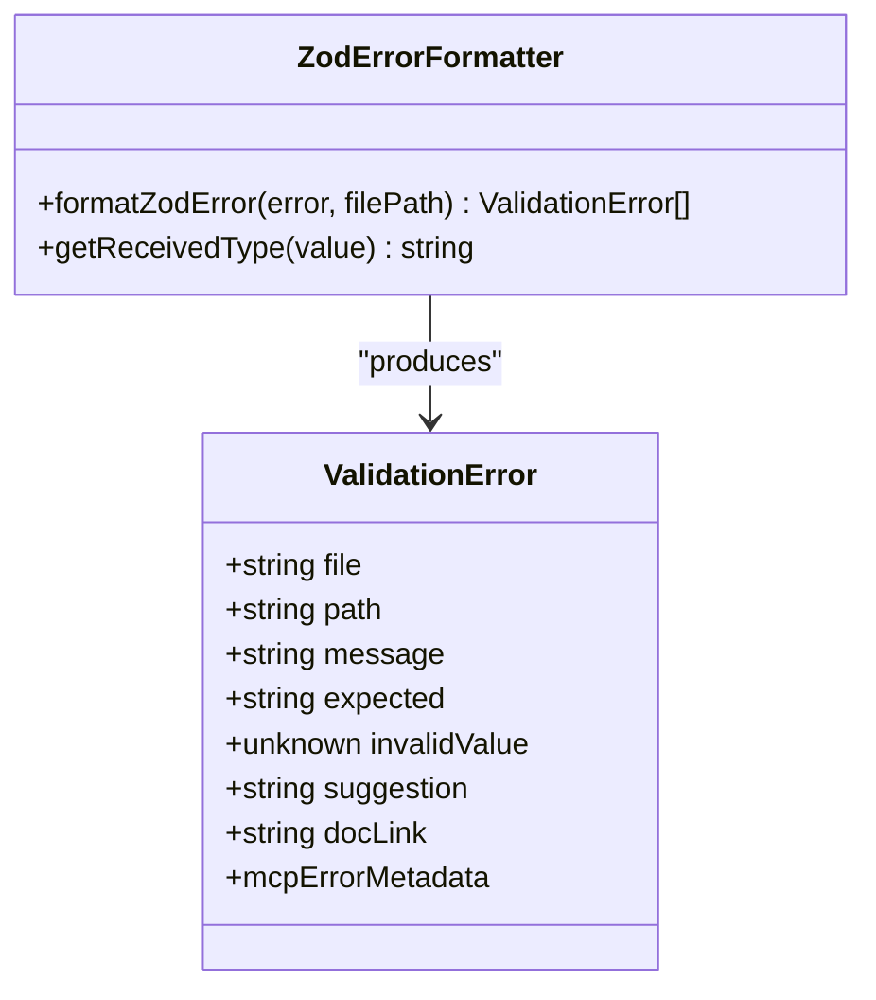
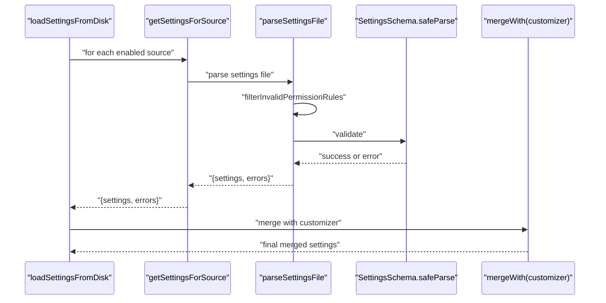
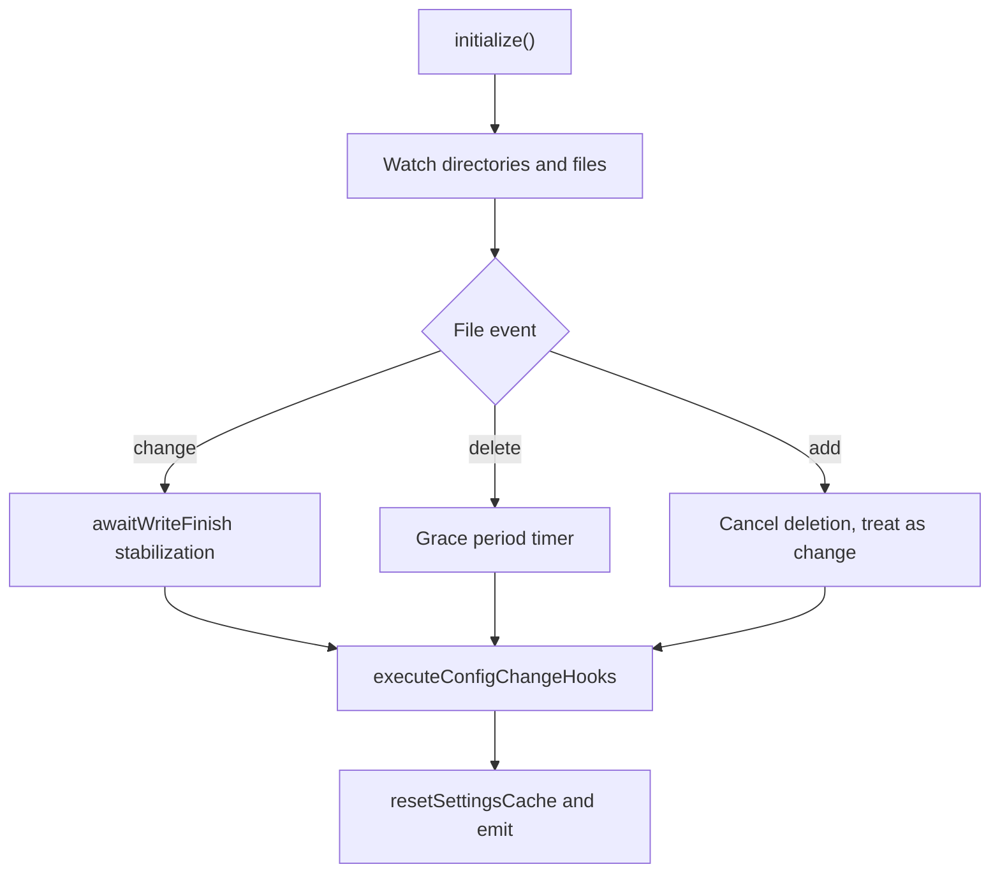
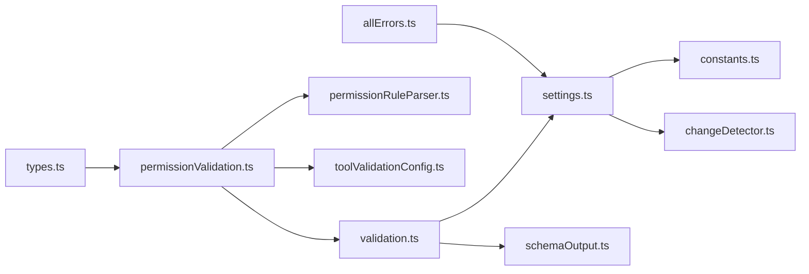

# Settings Validation and Schema System

<cite>
**Referenced Files in This Document**
- [types.ts](file://claude_code_src/restored-src/src/utils/settings/types.ts)
- [permissionValidation.ts](file://claude_code_src/restored-src/src/utils/settings/permissionValidation.ts)
- [validation.ts](file://claude_code_src/restored-src/src/utils/settings/validation.ts)
- [settings.ts](file://claude_code_src/restored-src/src/utils/settings/settings.ts)
- [schemaOutput.ts](file://claude_code_src/restored-src/src/utils/settings/schemaOutput.ts)
- [constants.ts](file://claude_code_src/restored-src/src/utils/settings/constants.ts)
- [permissionRuleParser.ts](file://claude_code_src/restored-src/src/utils/permissions/permissionRuleParser.ts)
- [toolValidationConfig.ts](file://claude_code_src/restored-src/src/utils/settings/toolValidationConfig.ts)
- [changeDetector.ts](file://claude_code_src/restored-src/src/utils/settings/changeDetector.ts)
- [allErrors.ts](file://claude_code_src/restored-src/src/utils/settings/allErrors.ts)
</cite>

## Table of Contents
1. [Introduction](#introduction)
2. [Project Structure](#project-structure)
3. [Core Components](#core-components)
4. [Architecture Overview](#architecture-overview)
5. [Detailed Component Analysis](#detailed-component-analysis)
6. [Dependency Analysis](#dependency-analysis)
7. [Performance Considerations](#performance-considerations)
8. [Troubleshooting Guide](#troubleshooting-guide)
9. [Conclusion](#conclusion)

## Introduction
This document explains the settings validation and schema system used by the Claude Code Python IDE. It focuses on the Zod-based validation architecture, schema definitions, error handling mechanisms, and how validation integrates with the settings merging pipeline. It covers the validation pipeline (JSON parsing, schema validation, and error formatting), validation error types, error message formatting, handling of validation failures during settings loading, examples of common validation errors and resolutions, and how invalid permission rules are filtered and integrated into the settings merging process.

## Project Structure
The settings validation system is primarily implemented in the settings utilities and related modules:
- Schema definitions and types: settings schema, permission rule schema, and related typed records
- Validation pipeline: JSON parsing, permission rule filtering, schema validation, and error formatting
- Integration with settings merging and file watching
- Tool-specific validation configuration and permission rule parsing

**Diagram sources**
- [types.ts](file://claude_code_src/restored-src/src/utils/settings/types.ts)
- [permissionValidation.ts](file://claude_code_src/restored-src/src/utils/settings/permissionValidation.ts)
- [validation.ts](file://claude_code_src/restored-src/src/utils/settings/validation.ts)
- [schemaOutput.ts](file://claude_code_src/restored-src/src/utils/settings/schemaOutput.ts)
- [settings.ts](file://claude_code_src/restored-src/src/utils/settings/settings.ts)
- [constants.ts](file://claude_code_src/restored-src/src/utils/settings/constants.ts)
- [changeDetector.ts](file://claude_code_src/restored-src/src/utils/settings/changeDetector.ts)
- [permissionRuleParser.ts](file://claude_code_src/restored-src/src/utils/permissions/permissionRuleParser.ts)
- [toolValidationConfig.ts](file://claude_code_src/restored-src/src/utils/settings/toolValidationConfig.ts)

**Section sources**
- [types.ts](file://claude_code_src/restored-src/src/utils/settings/types.ts)
- [validation.ts](file://claude_code_src/restored-src/src/utils/settings/validation.ts)
- [settings.ts](file://claude_code_src/restored-src/src/utils/settings/settings.ts)
- [constants.ts](file://claude_code_src/restored-src/src/utils/settings/constants.ts)
- [schemaOutput.ts](file://claude_code_src/restored-src/src/utils/settings/schemaOutput.ts)
- [permissionRuleParser.ts](file://claude_code_src/restored-src/src/utils/permissions/permissionRuleParser.ts)
- [toolValidationConfig.ts](file://claude_code_src/restored-src/src/utils/settings/toolValidationConfig.ts)
- [changeDetector.ts](file://claude_code_src/restored-src/src/utils/settings/changeDetector.ts)

## Core Components
- SettingsSchema: Central Zod schema that defines the shape of user and managed settings, including permissions, MCP server allowlists/denylists, hooks, environment variables, and more. It uses lazy schemas for recursive structures and passthrough to preserve unknown fields.
- PermissionRuleSchema: A Zod schema that validates individual permission rule strings using custom validation logic and produces detailed error messages.
- Validation pipeline: Includes JSON parsing, permission rule filtering, Zod schema validation, and error formatting.
- Error types and formatting: ValidationError captures file path, field path, message, expected/invalid values, suggestions, and documentation links. Formatting adapts to Zod v4 issue types.
- Permission rule filtering: Removes invalid permission rules before schema validation to avoid rejecting entire files due to a single malformed rule.
- Integration with settings merging: Validation errors are aggregated and surfaced alongside MCP configuration errors; settings merging respects arrays and records with custom merge logic.

**Section sources**
- [types.ts](file://claude_code_src/restored-src/src/utils/settings/types.ts)
- [permissionValidation.ts](file://claude_code_src/restored-src/src/utils/settings/permissionValidation.ts)
- [validation.ts](file://claude_code_src/restored-src/src/utils/settings/validation.ts)
- [settings.ts](file://claude_code_src/restored-src/src/utils/settings/settings.ts)

## Architecture Overview
The validation architecture is layered:
- Schema layer: Zod schemas define structure and types.
- Validation layer: Permission rule validation and Zod error formatting.
- Integration layer: Settings loading, merging, and file watching.
- Tool-specific layer: Specialized validation rules for tools and MCP configurations.

**Diagram sources**
- [settings.ts](file://claude_code_src/restored-src/src/utils/settings/settings.ts)
- [validation.ts](file://claude_code_src/restored-src/src/utils/settings/validation.ts)
- [permissionValidation.ts](file://claude_code_src/restored-src/src/utils/settings/permissionValidation.ts)

## Detailed Component Analysis

### Zod-based Schema Definitions
- SettingsSchema: Defines top-level settings including optional fields, environment variables, permissions, MCP server allowlists/denylists, hooks, worktree configuration, plugin settings, and more. It leverages lazy schemas for recursive structures and passthrough to preserve unknown fields.
- PermissionsSchema: Defines allow/deny/ask arrays and default modes, with additional directories and enterprise controls.
- PermissionRuleSchema: Uses superRefine to validate rule strings and produce custom Zod issues with detailed messages.

**Diagram sources**
- [types.ts](file://claude_code_src/restored-src/src/utils/settings/types.ts)
- [permissionValidation.ts](file://claude_code_src/restored-src/src/utils/settings/permissionValidation.ts)

**Section sources**
- [types.ts](file://claude_code_src/restored-src/src/utils/settings/types.ts)
- [permissionValidation.ts](file://claude_code_src/restored-src/src/utils/settings/permissionValidation.ts)

### Permission Rule Validation and Filtering
- validatePermissionRule: Performs format checks (matching parentheses, empty parentheses, MCP rules), tool name validation, and tool-specific validations (Bash prefix patterns, file patterns, custom validations).
- filterInvalidPermissionRules: Scans the parsed settings object, filters invalid permission rules from allow/deny/ask arrays, and emits warnings for each filtered item. This ensures a single bad rule does not invalidate the entire file.

**Diagram sources**
- [validation.ts](file://claude_code_src/restored-src/src/utils/settings/validation.ts)
- [permissionValidation.ts](file://claude_code_src/restored-src/src/utils/settings/permissionValidation.ts)

**Section sources**
- [validation.ts](file://claude_code_src/restored-src/src/utils/settings/validation.ts)
- [permissionValidation.ts](file://claude_code_src/restored-src/src/utils/settings/permissionValidation.ts)
- [toolValidationConfig.ts](file://claude_code_src/restored-src/src/utils/settings/toolValidationConfig.ts)
- [permissionRuleParser.ts](file://claude_code_src/restored-src/src/utils/permissions/permissionRuleParser.ts)

### Zod Error Formatting and Validation Error Types
- ValidationError: Captures file path, field path, message, expected/invalid values, suggestions, and documentation links. It also supports MCP-specific metadata.
- formatZodError: Adapts Zod v4 issues to human-readable messages, handling invalid types, invalid values (enums), unrecognized keys, and too-small numbers. It enriches messages with contextual tips.

**Diagram sources**
- [validation.ts](file://claude_code_src/restored-src/src/utils/settings/validation.ts)

**Section sources**
- [validation.ts](file://claude_code_src/restored-src/src/utils/settings/validation.ts)

### Settings Loading Pipeline and Integration with Merging
- parseSettingsFile: Reads and parses a settings file, filters invalid permission rules, validates against SettingsSchema, and returns settings plus validation errors.
- loadSettingsFromDisk: Loads settings from all sources in priority order, aggregates errors, and merges them using a custom merge strategy.
- settingsMergeCustomizer: Concatenates arrays and deduplicates, while letting lodash handle other merges.

**Diagram sources**
- [settings.ts](file://claude_code_src/restored-src/src/utils/settings/settings.ts)
- [validation.ts](file://claude_code_src/restored-src/src/utils/settings/validation.ts)

**Section sources**
- [settings.ts](file://claude_code_src/restored-src/src/utils/settings/settings.ts)
- [validation.ts](file://claude_code_src/restored-src/src/utils/settings/validation.ts)

### File Watching and Change Propagation
- changeDetector: Watches settings files and managed-settings.d drop-in directory, filters out non-settings files, and handles delete-and-recreate patterns. It triggers cache resets and notifies listeners, integrating with the settings change hooks.

**Diagram sources**
- [changeDetector.ts](file://claude_code_src/restored-src/src/utils/settings/changeDetector.ts)
- [settings.ts](file://claude_code_src/restored-src/src/utils/settings/settings.ts)

**Section sources**
- [changeDetector.ts](file://claude_code_src/restored-src/src/utils/settings/changeDetector.ts)
- [settings.ts](file://claude_code_src/restored-src/src/utils/settings/settings.ts)

### Aggregation of Settings and MCP Errors
- allErrors: Combines settings validation errors with MCP configuration errors to provide a complete error set without circular dependencies.

**Section sources**
- [allErrors.ts](file://claude_code_src/restored-src/src/utils/settings/allErrors.ts)

## Dependency Analysis
- Schema dependencies: SettingsSchema depends on PermissionRuleSchema and other lazy schemas for recursive structures.
- Validation dependencies: Permission rule validation depends on tool-specific configuration and permission rule parsing utilities.
- Integration dependencies: Settings loading depends on file reading, JSON parsing, and merging utilities; change detection depends on file watching and MDM polling.

**Diagram sources**
- [types.ts](file://claude_code_src/restored-src/src/utils/settings/types.ts)
- [permissionValidation.ts](file://claude_code_src/restored-src/src/utils/settings/permissionValidation.ts)
- [validation.ts](file://claude_code_src/restored-src/src/utils/settings/validation.ts)
- [settings.ts](file://claude_code_src/restored-src/src/utils/settings/settings.ts)
- [constants.ts](file://claude_code_src/restored-src/src/utils/settings/constants.ts)
- [changeDetector.ts](file://claude_code_src/restored-src/src/utils/settings/changeDetector.ts)
- [permissionRuleParser.ts](file://claude_code_src/restored-src/src/utils/permissions/permissionRuleParser.ts)
- [toolValidationConfig.ts](file://claude_code_src/restored-src/src/utils/settings/toolValidationConfig.ts)
- [schemaOutput.ts](file://claude_code_src/restored-src/src/utils/settings/schemaOutput.ts)
- [allErrors.ts](file://claude_code_src/restored-src/src/utils/settings/allErrors.ts)

**Section sources**
- [types.ts](file://claude_code_src/restored-src/src/utils/settings/types.ts)
- [permissionValidation.ts](file://claude_code_src/restored-src/src/utils/settings/permissionValidation.ts)
- [validation.ts](file://claude_code_src/restored-src/src/utils/settings/validation.ts)
- [settings.ts](file://claude_code_src/restored-src/src/utils/settings/settings.ts)
- [constants.ts](file://claude_code_src/restored-src/src/utils/settings/constants.ts)
- [changeDetector.ts](file://claude_code_src/restored-src/src/utils/settings/changeDetector.ts)
- [permissionRuleParser.ts](file://claude_code_src/restored-src/src/utils/permissions/permissionRuleParser.ts)
- [toolValidationConfig.ts](file://claude_code_src/restored-src/src/utils/settings/toolValidationConfig.ts)
- [schemaOutput.ts](file://claude_code_src/restored-src/src/utils/settings/schemaOutput.ts)
- [allErrors.ts](file://claude_code_src/restored-src/src/utils/settings/allErrors.ts)

## Performance Considerations
- Lazy schemas: Recursive and complex schemas are wrapped in lazy constructors to avoid initialization overhead.
- Passthrough: Unknown fields are preserved to maintain backward compatibility and reduce rewrites.
- Caching: Settings are cached per-file and per-source to avoid repeated disk reads and parsing.
- Array merging: Custom merge logic concatenates and deduplicates arrays to minimize redundant operations.
- File watching stability: awaitWriteFinish thresholds and grace periods prevent excessive reloads during atomic writes.

[No sources needed since this section provides general guidance]

## Troubleshooting Guide
Common validation errors and resolutions:
- Invalid value (enum): Occurs when a field has an unexpected value. Resolution: Use one of the allowed values documented by the schema.
- Invalid type: Occurs when a field has the wrong type (e.g., string instead of number). Resolution: Correct the type to match the schema.
- Unrecognized field: Occurs when an unknown property is present. Resolution: Remove the field or ensure it is part of the schema.
- Number too small: Occurs when a numeric field is below the minimum. Resolution: Increase the value to meet the minimum requirement.
- Malformed JSON: Occurs when the file contains invalid JSON. Resolution: Fix syntax errors or remove the file.
- Permission rule errors: Invalid parentheses, empty parentheses, unsupported patterns, or incorrect tool name. Resolution: Follow the suggested examples and patterns; ensure MCP rules do not include parentheses; ensure Bash and file patterns conform to the documented formats.

How validation failures are handled during settings loading:
- parseSettingsFile returns both settings and errors; if schema validation fails, settings is null and errors contain formatted messages.
- loadSettingsFromDisk aggregates errors from all sources and merges valid settings, ensuring partial successes are still usable.
- filterInvalidPermissionRules removes invalid permission rules before schema validation to avoid total rejection of the file.

Examples of common validation errors:
- Mismatched parentheses in a permission rule: Fix by ensuring balanced parentheses or remove parentheses for tool-wide rules.
- Empty parentheses with no tool name: Provide a tool name before parentheses or remove parentheses for tool-wide rules.
- MCP rules with parentheses: Remove parentheses; use server-level or wildcard forms without content.
- Bash rules with misplaced :*: Move :* to the end or use wildcard matching instead.
- File patterns with :*: Replace with glob patterns like * or ** as appropriate.

Resolution strategies:
- Use the suggestions embedded in validation errors to correct rule formats.
- Consult the generated JSON schema for precise field types and constraints.
- Review the settings file incrementally, fixing one error at a time.
- For permission rules, refer to the tool-specific validation rules and examples.

**Section sources**
- [validation.ts](file://claude_code_src/restored-src/src/utils/settings/validation.ts)
- [permissionValidation.ts](file://claude_code_src/restored-src/src/utils/settings/permissionValidation.ts)
- [settings.ts](file://claude_code_src/restored-src/src/utils/settings/settings.ts)
- [schemaOutput.ts](file://claude_code_src/restored-src/src/utils/settings/schemaOutput.ts)

## Conclusion
The settings validation and schema system in Claude Code Python IDE is built around Zod schemas with robust error formatting and targeted filtering of invalid permission rules. The pipeline parses JSON, filters problematic permission rules, validates against the central SettingsSchema, and aggregates errors for user feedback. Integration with settings merging and file watching ensures that partial successes are honored, while invalid entries are reported clearly. Tool-specific validations and permission rule parsing further refine correctness, enabling a reliable and user-friendly configuration experience.