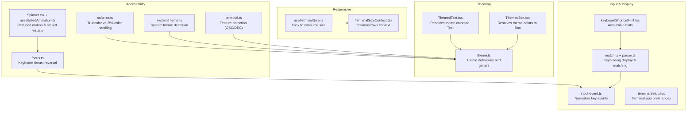
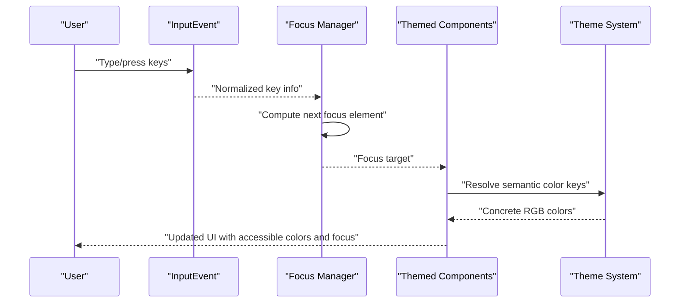
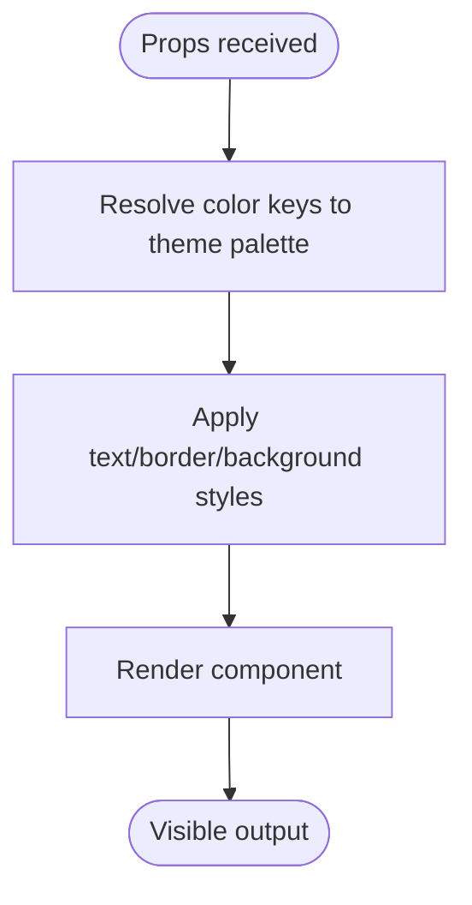
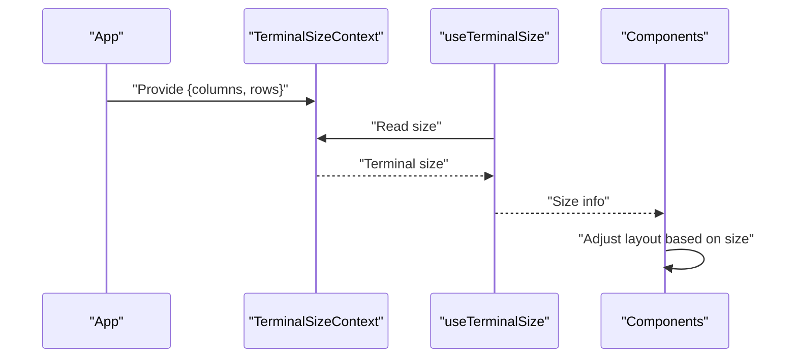
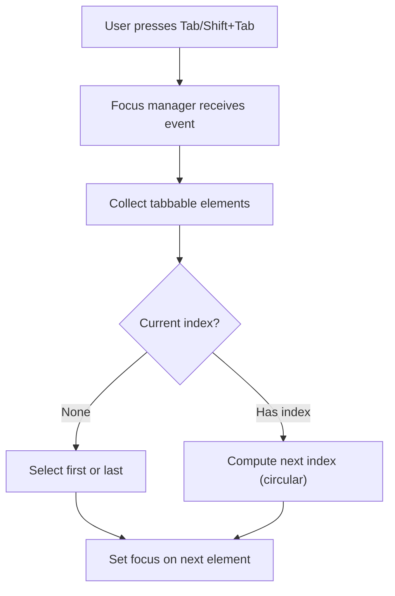
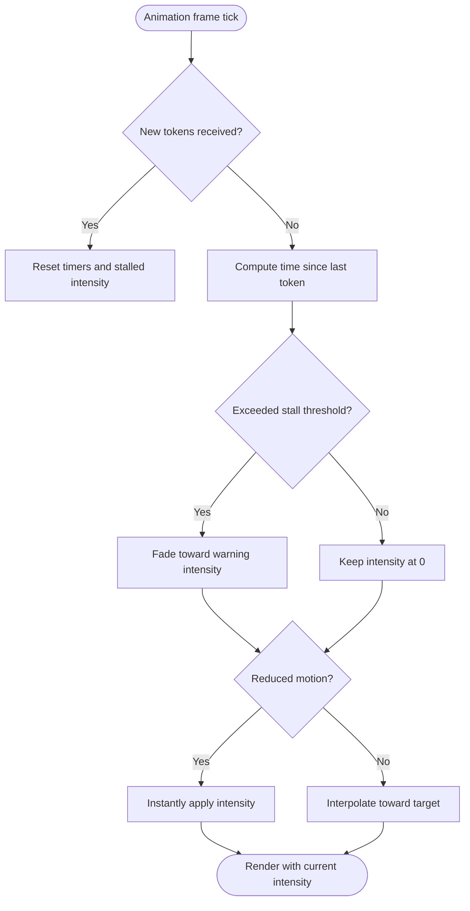
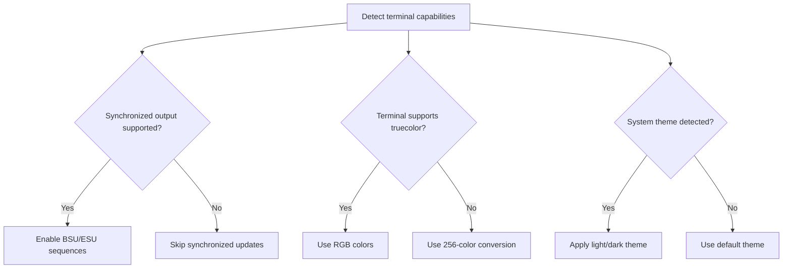
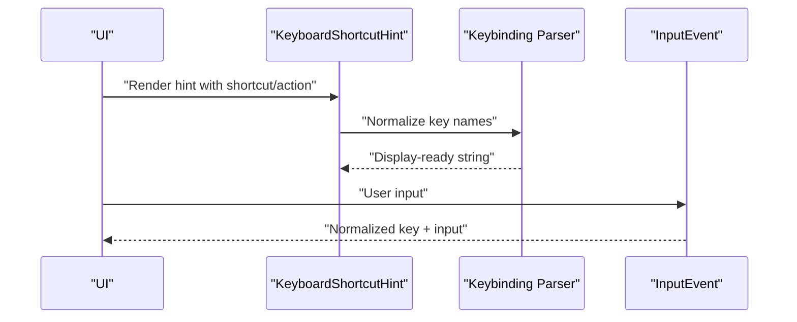
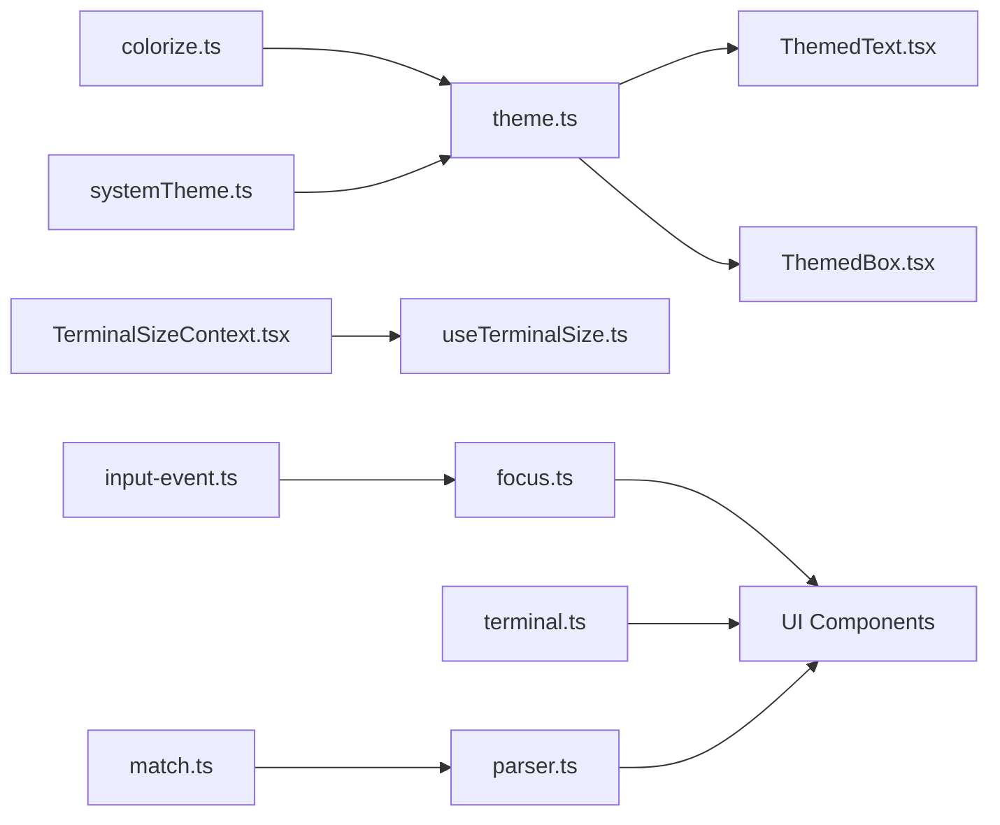

# Accessibility and Responsive Design

<cite>
**Referenced Files in This Document**
- [theme.ts](file://src/utils/theme.ts)
- [ThemedText.tsx](file://src/components/design-system/ThemedText.tsx)
- [ThemedBox.tsx](file://src/components/design-system/ThemedBox.tsx)
- [focus.ts](file://src/ink/focus.ts)
- [TerminalSizeContext.tsx](file://src/ink/components/TerminalSizeContext.tsx)
- [useTerminalSize.ts](file://src/hooks/useTerminalSize.ts)
- [systemTheme.ts](file://src/utils/systemTheme.ts)
- [colorize.ts](file://src/ink/colorize.ts)
- [terminal.ts](file://src/ink/terminal.ts)
- [Spinner.tsx](file://src/components/Spinner.tsx)
- [useStalledAnimation.ts](file://src/components/Spinner/useStalledAnimation.ts)
- [keyboardShortcutHint.tsx](file://src/components/design-system/KeyboardShortcutHint.tsx)
- [input-event.ts](file://src/ink/events/input-event.ts)
- [match.ts](file://src/keybindings/match.ts)
- [parser.ts](file://src/keybindings/parser.ts)
- [terminalSetup.tsx](file://src/commands/terminalSetup/terminalSetup.tsx)
</cite>

## Table of Contents
1. [Introduction](#introduction)
2. [Project Structure](#project-structure)
3. [Core Components](#core-components)
4. [Architecture Overview](#architecture-overview)
5. [Detailed Component Analysis](#detailed-component-analysis)
6. [Dependency Analysis](#dependency-analysis)
7. [Performance Considerations](#performance-considerations)
8. [Troubleshooting Guide](#troubleshooting-guide)
9. [Conclusion](#conclusion)

## Introduction
This document explains how the styling and rendering system integrates accessibility and responsive design for terminal-based applications. It covers WCAG-aligned contrast and color accessibility, keyboard navigation, screen reader compatibility, dynamic font sizing, responsive layouts for varying terminal sizes, high-DPI considerations, and user accessibility preferences. It also documents color blindness accommodations, motion sensitivity controls, and alternative input method support, and shows how the theming system automatically adapts to user preferences.

## Project Structure
The accessibility and responsive design features span several subsystems:
- Theming and color palettes with explicit RGB values and daltonized variants
- Theme-aware UI components that resolve semantic color keys to concrete colors
- Terminal size context and hooks for responsive layouts
- Focus management for keyboard navigation
- Reduced motion and motion sensitivity accommodations
- Terminal capability detection for advanced features and fallbacks
- Keyboard input normalization and keybinding display helpers



**Diagram sources**
- [theme.ts:115-613](file://src/utils/theme.ts#L115-L613)
- [ThemedText.tsx:80-123](file://src/components/design-system/ThemedText.tsx#L80-L123)
- [ThemedBox.tsx:52-106](file://src/components/design-system/ThemedBox.tsx#L52-L106)
- [TerminalSizeContext.tsx:1-7](file://src/ink/components/TerminalSizeContext.tsx#L1-L7)
- [useTerminalSize.ts:1-16](file://src/hooks/useTerminalSize.ts#L1-L16)
- [focus.ts:84-144](file://src/ink/focus.ts#L84-L144)
- [Spinner.tsx:335-386](file://src/components/Spinner.tsx#L335-L386)
- [useStalledAnimation.ts:1-75](file://src/components/Spinner/useStalledAnimation.ts#L1-L75)
- [colorize.ts:1-26](file://src/ink/colorize.ts#L1-L26)
- [systemTheme.ts:102-119](file://src/utils/systemTheme.ts#L102-L119)
- [terminal.ts:46-90](file://src/ink/terminal.ts#L46-L90)
- [input-event.ts:167-205](file://src/ink/events/input-event.ts#L167-L205)
- [match.ts:24-65](file://src/keybindings/match.ts#L24-L65)
- [parser.ts:102-151](file://src/keybindings/parser.ts#L102-L151)
- [keyboardShortcutHint.tsx:15-60](file://src/components/design-system/KeyboardShortcutHint.tsx#L15-L60)
- [terminalSetup.tsx:309-340](file://src/commands/terminalSetup/terminalSetup.tsx#L309-L340)

**Section sources**
- [theme.ts:115-613](file://src/utils/theme.ts#L115-L613)
- [ThemedText.tsx:80-123](file://src/components/design-system/ThemedText.tsx#L80-L123)
- [ThemedBox.tsx:52-106](file://src/components/design-system/ThemedBox.tsx#L52-L106)
- [TerminalSizeContext.tsx:1-7](file://src/ink/components/TerminalSizeContext.tsx#L1-L7)
- [useTerminalSize.ts:1-16](file://src/hooks/useTerminalSize.ts#L1-L16)
- [focus.ts:84-144](file://src/ink/focus.ts#L84-L144)
- [Spinner.tsx:335-386](file://src/components/Spinner.tsx#L335-L386)
- [useStalledAnimation.ts:1-75](file://src/components/Spinner/useStalledAnimation.ts#L1-L75)
- [colorize.ts:1-26](file://src/ink/colorize.ts#L1-L26)
- [systemTheme.ts:102-119](file://src/utils/systemTheme.ts#L102-L119)
- [terminal.ts:46-90](file://src/ink/terminal.ts#L46-L90)
- [input-event.ts:167-205](file://src/ink/events/input-event.ts#L167-L205)
- [match.ts:24-65](file://src/keybindings/match.ts#L24-L65)
- [parser.ts:102-151](file://src/keybindings/parser.ts#L102-L151)
- [keyboardShortcutHint.tsx:15-60](file://src/components/design-system/KeyboardShortcutHint.tsx#L15-L60)
- [terminalSetup.tsx:309-340](file://src/commands/terminalSetup/terminalSetup.tsx#L309-L340)

## Core Components
- Theme system with explicit RGB palettes and daltonized variants for color-blind users
- Theme-aware components that resolve semantic color keys to concrete colors
- Terminal size context and hook enabling responsive layouts
- Keyboard focus manager for tab order and focus traversal
- Reduced motion and stalled animation controls for motion sensitivity
- Terminal capability detection for synchronized output and OSC/DEC support
- Input normalization and keybinding display helpers for accessibility

**Section sources**
- [theme.ts:115-613](file://src/utils/theme.ts#L115-L613)
- [ThemedText.tsx:80-123](file://src/components/design-system/ThemedText.tsx#L80-L123)
- [ThemedBox.tsx:52-106](file://src/components/design-system/ThemedBox.tsx#L52-L106)
- [TerminalSizeContext.tsx:1-7](file://src/ink/components/TerminalSizeContext.tsx#L1-L7)
- [useTerminalSize.ts:1-16](file://src/hooks/useTerminalSize.ts#L1-L16)
- [focus.ts:84-144](file://src/ink/focus.ts#L84-L144)
- [Spinner.tsx:335-386](file://src/components/Spinner.tsx#L335-L386)
- [useStalledAnimation.ts:1-75](file://src/components/Spinner/useStalledAnimation.ts#L1-L75)
- [terminal.ts:46-90](file://src/ink/terminal.ts#L46-L90)
- [input-event.ts:167-205](file://src/ink/events/input-event.ts#L167-L205)
- [parser.ts:102-151](file://src/keybindings/parser.ts#L102-L151)

## Architecture Overview
The accessibility and responsive design architecture centers on:
- Explicit color palettes and daltonized themes to satisfy contrast and color accessibility requirements
- Theme-aware UI components that enforce consistent semantics and color resolution
- Terminal size awareness to adapt layouts and spacing
- Keyboard focus management for predictable navigation
- Reduced motion controls to accommodate motion sensitivity
- Terminal capability detection to enable advanced features when available



**Diagram sources**
- [input-event.ts:167-205](file://src/ink/events/input-event.ts#L167-L205)
- [focus.ts:84-144](file://src/ink/focus.ts#L84-L144)
- [ThemedText.tsx:80-123](file://src/components/design-system/ThemedText.tsx#L80-L123)
- [theme.ts:115-613](file://src/utils/theme.ts#L115-L613)

## Detailed Component Analysis

### Theming System and Color Accessibility
- Explicit RGB palettes ensure consistent rendering across terminals with varying ANSI color support.
- Daltonsized themes adjust hues and saturations for color-blind users (e.g., deuteranopia).
- ANSI fallback themes provide 16-color compatibility for terminals without true color support.
- Theme getters select appropriate palettes based on theme setting and system preference.

```mermaid
classDiagram
class Theme {
+string autoAccept
+string bashBorder
+string claude
+string text
+string background
+string success
+string error
+string warning
+...
}
class ThemeName {
<<enumeration>>
"light"
"dark"
"light-daltonized"
"dark-daltonized"
"light-ansi"
"dark-ansi"
}
class ThemeSystem {
+getTheme(name) Theme
+themeColorToAnsi(color) string
}
ThemeSystem --> Theme : "returns"
ThemeSystem --> ThemeName : "selects"
```

**Diagram sources**
- [theme.ts:4-89](file://src/utils/theme.ts#L4-L89)
- [theme.ts:91-109](file://src/utils/theme.ts#L91-L109)
- [theme.ts:598-613](file://src/utils/theme.ts#L598-L613)
- [theme.ts:615-640](file://src/utils/theme.ts#L615-L640)

**Section sources**
- [theme.ts:115-613](file://src/utils/theme.ts#L115-L613)
- [theme.ts:615-640](file://src/utils/theme.ts#L615-L640)

### Theme-Aware UI Components
- ThemedText resolves semantic color keys to concrete colors and supports text styling attributes.
- ThemedBox resolves border/background colors from theme keys for bordered containers.



**Diagram sources**
- [ThemedText.tsx:80-123](file://src/components/design-system/ThemedText.tsx#L80-L123)
- [ThemedBox.tsx:52-106](file://src/components/design-system/ThemedBox.tsx#L52-L106)

**Section sources**
- [ThemedText.tsx:80-123](file://src/components/design-system/ThemedText.tsx#L80-L123)
- [ThemedBox.tsx:52-106](file://src/components/design-system/ThemedBox.tsx#L52-L106)

### Terminal Size Awareness and Responsive Layouts
- TerminalSizeContext exposes columns and rows to the app.
- useTerminalSize provides a typed hook to access terminal dimensions.
- Components can adapt layout, wrapping, and spacing based on terminal size.



**Diagram sources**
- [TerminalSizeContext.tsx:1-7](file://src/ink/components/TerminalSizeContext.tsx#L1-L7)
- [useTerminalSize.ts:1-16](file://src/hooks/useTerminalSize.ts#L1-L16)

**Section sources**
- [TerminalSizeContext.tsx:1-7](file://src/ink/components/TerminalSizeContext.tsx#L1-L7)
- [useTerminalSize.ts:1-16](file://src/hooks/useTerminalSize.ts#L1-L16)

### Keyboard Navigation and Focus Management
- Focus manager computes tab order and moves focus forward/backward within a root element.
- Handles click-to-focus for nodes with a valid tabIndex.
- Integrates with input normalization to ensure predictable navigation.



**Diagram sources**
- [focus.ts:84-144](file://src/ink/focus.ts#L84-L144)

**Section sources**
- [focus.ts:84-144](file://src/ink/focus.ts#L84-L144)
- [input-event.ts:167-205](file://src/ink/events/input-event.ts#L167-L205)

### Reduced Motion and Motion Sensitivity Accommodations
- Spinner components and animations adapt to reduced motion preferences.
- Stalled animation hook transitions to a warning color when token flow stops, with smoothness controlled by reduced motion.
- Animation timing is driven by an animation frame clock and slowed when the terminal is blurred.



**Diagram sources**
- [useStalledAnimation.ts:1-75](file://src/components/Spinner/useStalledAnimation.ts#L1-L75)
- [Spinner.tsx:335-386](file://src/components/Spinner.tsx#L335-L386)

**Section sources**
- [useStalledAnimation.ts:1-75](file://src/components/Spinner/useStalledAnimation.ts#L1-L75)
- [Spinner.tsx:335-386](file://src/components/Spinner.tsx#L335-L386)

### Terminal Capability Detection and High-DPI Support
- Feature detection determines whether synchronized output and advanced OSC/DEC modes are supported.
- Truecolor vs 256-color handling ensures accurate color rendering across terminals.
- System theme detection provides an initial guess for light/dark preference.



**Diagram sources**
- [terminal.ts:46-90](file://src/ink/terminal.ts#L46-L90)
- [colorize.ts:1-26](file://src/ink/colorize.ts#L1-L26)
- [systemTheme.ts:102-119](file://src/utils/systemTheme.ts#L102-L119)

**Section sources**
- [terminal.ts:46-90](file://src/ink/terminal.ts#L46-L90)
- [colorize.ts:1-26](file://src/ink/colorize.ts#L1-L26)
- [systemTheme.ts:102-119](file://src/utils/systemTheme.ts#L102-L119)

### Keyboard Shortcuts and Input Normalization
- KeyboardShortcutHint renders accessible hints for actions with optional parentheses and bolding.
- Keybinding display helpers normalize key names and platform differences.
- InputEvent normalizes key events and handles shift states for uppercase letters.



**Diagram sources**
- [keyboardShortcutHint.tsx:15-60](file://src/components/design-system/KeyboardShortcutHint.tsx#L15-L60)
- [parser.ts:102-151](file://src/keybindings/parser.ts#L102-L151)
- [input-event.ts:167-205](file://src/ink/events/input-event.ts#L167-L205)

**Section sources**
- [keyboardShortcutHint.tsx:15-60](file://src/components/design-system/KeyboardShortcutHint.tsx#L15-L60)
- [parser.ts:102-151](file://src/keybindings/parser.ts#L102-L151)
- [input-event.ts:167-205](file://src/ink/events/input-event.ts#L167-L205)

### Terminal Preferences and Alternative Input Methods
- Terminal setup utilities can configure Terminal.app preferences (e.g., Option as Meta) to improve input ergonomics.
- Voice integration and rapid key detection demonstrate alternative input pathways and safeguards against auto-repeat.

**Section sources**
- [terminalSetup.tsx:309-340](file://src/commands/terminalSetup/terminalSetup.tsx#L309-L340)
- [input-event.ts:167-205](file://src/ink/events/input-event.ts#L167-L205)

## Dependency Analysis
The accessibility and responsive design features depend on:
- Theme system for color semantics and daltonized palettes
- Terminal size context for responsive behavior
- Focus manager for keyboard navigation
- Terminal capability detection for feature gating
- Input normalization for consistent key handling



**Diagram sources**
- [theme.ts:115-613](file://src/utils/theme.ts#L115-L613)
- [ThemedText.tsx:80-123](file://src/components/design-system/ThemedText.tsx#L80-L123)
- [ThemedBox.tsx:52-106](file://src/components/design-system/ThemedBox.tsx#L52-L106)
- [TerminalSizeContext.tsx:1-7](file://src/ink/components/TerminalSizeContext.tsx#L1-L7)
- [useTerminalSize.ts:1-16](file://src/hooks/useTerminalSize.ts#L1-L16)
- [focus.ts:84-144](file://src/ink/focus.ts#L84-L144)
- [terminal.ts:46-90](file://src/ink/terminal.ts#L46-L90)
- [colorize.ts:1-26](file://src/ink/colorize.ts#L1-L26)
- [systemTheme.ts:102-119](file://src/utils/systemTheme.ts#L102-L119)
- [input-event.ts:167-205](file://src/ink/events/input-event.ts#L167-L205)
- [parser.ts:102-151](file://src/keybindings/parser.ts#L102-L151)
- [match.ts:24-65](file://src/keybindings/match.ts#L24-L65)

**Section sources**
- [theme.ts:115-613](file://src/utils/theme.ts#L115-L613)
- [focus.ts:84-144](file://src/ink/focus.ts#L84-L144)
- [terminal.ts:46-90](file://src/ink/terminal.ts#L46-L90)
- [colorize.ts:1-26](file://src/ink/colorize.ts#L1-L26)
- [systemTheme.ts:102-119](file://src/utils/systemTheme.ts#L102-L119)
- [input-event.ts:167-205](file://src/ink/events/input-event.ts#L167-L205)
- [parser.ts:102-151](file://src/keybindings/parser.ts#L102-L151)
- [match.ts:24-65](file://src/keybindings/match.ts#L24-L65)

## Performance Considerations
- Prefer daltonized themes for color-blind users to reduce cognitive load and improve readability.
- Use reduced motion to minimize unnecessary animations and maintain responsiveness under load.
- Leverage terminal capability detection to avoid expensive operations when unsupported.
- Keep theme resolutions memoized in components to avoid repeated computations.

## Troubleshooting Guide
- If colors appear washed out in certain terminals, verify truecolor support and adjust to ANSI fallback themes.
- If focus traversal feels inconsistent, ensure tabIndex values are set correctly and nodes are included in the tab order.
- If animations cause motion discomfort, enable reduced motion and confirm that stalled animations respect the preference.
- If terminal size-dependent layouts behave unexpectedly, confirm that TerminalSizeContext is properly provided and useTerminalSize is used within the app.

**Section sources**
- [colorize.ts:1-26](file://src/ink/colorize.ts#L1-L26)
- [focus.ts:84-144](file://src/ink/focus.ts#L84-L144)
- [useStalledAnimation.ts:1-75](file://src/components/Spinner/useStalledAnimation.ts#L1-L75)
- [TerminalSizeContext.tsx:1-7](file://src/ink/components/TerminalSizeContext.tsx#L1-L7)
- [useTerminalSize.ts:1-16](file://src/hooks/useTerminalSize.ts#L1-L16)

## Conclusion
The styling and rendering system integrates accessibility and responsive design through explicit color palettes, daltonized themes, theme-aware components, terminal size awareness, keyboard focus management, reduced motion accommodations, and terminal capability detection. Together, these features ensure consistent, accessible experiences across diverse terminal environments and user needs.