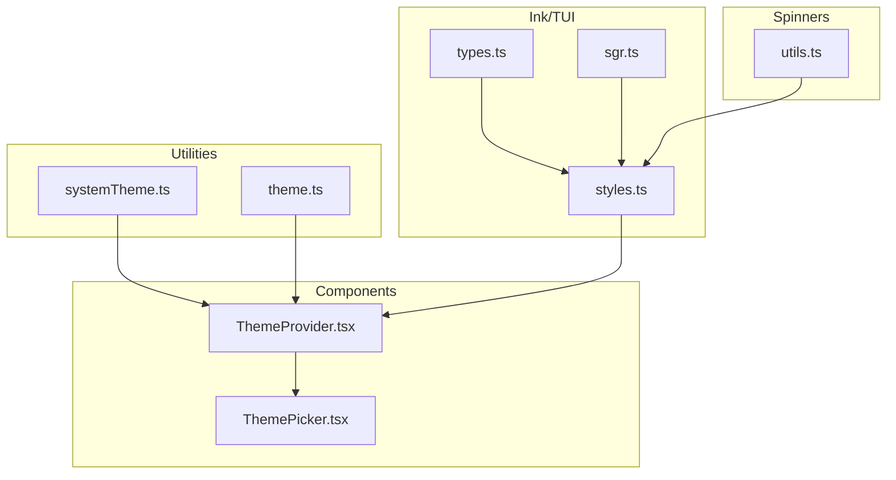
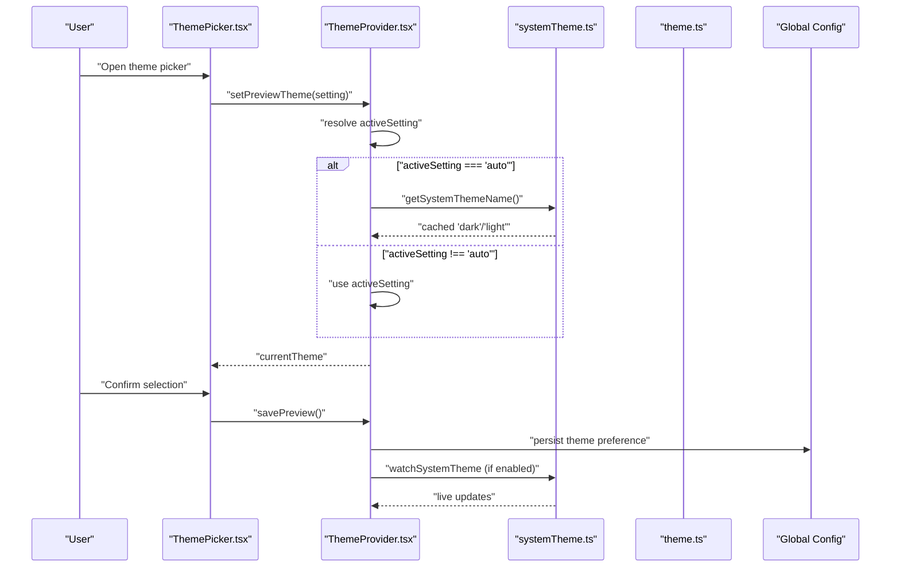
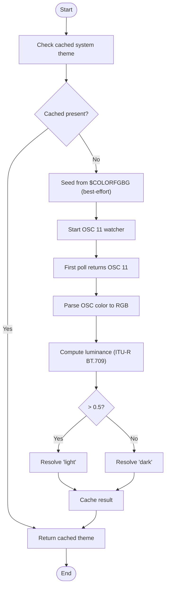
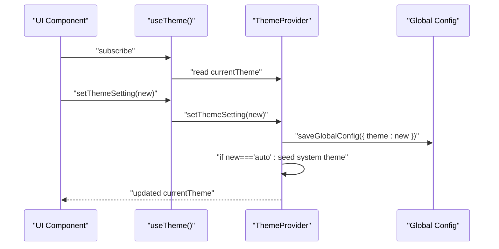
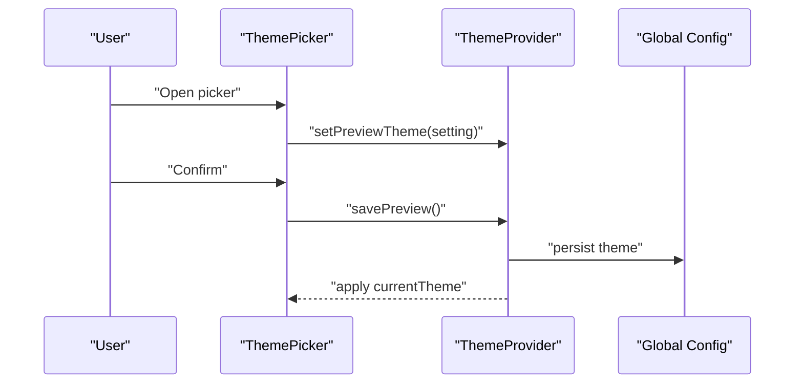
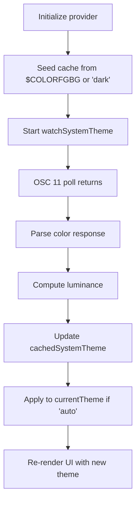
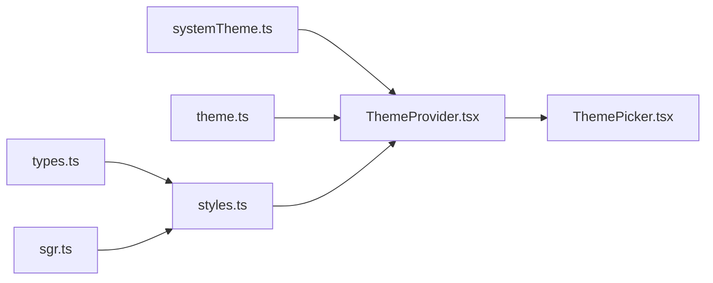

# Color System and Themes

<cite>
**Referenced Files in This Document**
- [systemTheme.ts](file://claude_code_src/restored-src/src/utils/systemTheme.ts)
- [theme.ts](file://claude_code_src/restored-src/src/utils/theme.ts)
- [ThemeProvider.tsx](file://claude_code_src/restored-src/src/components/design-system/ThemeProvider.tsx)
- [ThemePicker.tsx](file://claude_code_src/restored-src/src/components/ThemePicker.tsx)
- [styles.ts](file://claude_code_src/restored-src/src/ink/styles.ts)
- [types.ts](file://claude_code_src/restored-src/src/ink/termio/types.ts)
- [sgr.ts](file://claude_code_src/restored-src/src/ink/termio/sgr.ts)
- [utils.ts](file://claude_code_src/restored-src/src/components/Spinner/utils.ts)
</cite>

## Table of Contents
1. [Introduction](#introduction)
2. [Project Structure](#project-structure)
3. [Core Components](#core-components)
4. [Architecture Overview](#architecture-overview)
5. [Detailed Component Analysis](#detailed-component-analysis)
6. [Dependency Analysis](#dependency-analysis)
7. [Performance Considerations](#performance-considerations)
8. [Troubleshooting Guide](#troubleshooting-guide)
9. [Conclusion](#conclusion)

## Introduction
This document explains the color system and theming implementation in Claude Code Python IDE. It covers the color palette architecture, theme variants (dark, light, auto), system theme detection, color token semantics, semantic color mapping, accessibility-compliant contrasts, automatic theme switching, manual selection, persistence, and practical customization patterns. It also documents the relationship between system themes and application themes, including fallback mechanisms and user preference handling.

## Project Structure
The color and theme system spans several modules:
- Utilities for system theme detection and theme resolution
- Theme definition and variant palettes
- Provider and consumer hooks for theme state and UI
- Ink/TUI styling primitives for color application
- Terminal color parsing and conversion utilities



**Diagram sources**
- [systemTheme.ts:1-120](file://claude_code_src/restored-src/src/utils/systemTheme.ts#L1-L120)
- [theme.ts:1-640](file://claude_code_src/restored-src/src/utils/theme.ts#L1-L640)
- [ThemeProvider.tsx:1-170](file://claude_code_src/restored-src/src/components/design-system/ThemeProvider.tsx#L1-L170)
- [ThemePicker.tsx:1-333](file://claude_code_src/restored-src/src/components/ThemePicker.tsx#L1-L333)
- [styles.ts:1-772](file://claude_code_src/restored-src/src/ink/styles.ts#L1-L772)
- [types.ts:1-49](file://claude_code_src/restored-src/src/ink/termio/types.ts#L1-L49)
- [sgr.ts:100-134](file://claude_code_src/restored-src/src/ink/termio/sgr.ts#L100-L134)
- [utils.ts:1-29](file://claude_code_src/restored-src/src/components/Spinner/utils.ts#L1-L29)

**Section sources**
- [systemTheme.ts:1-120](file://claude_code_src/restored-src/src/utils/systemTheme.ts#L1-L120)
- [theme.ts:1-640](file://claude_code_src/restored-src/src/utils/theme.ts#L1-L640)
- [ThemeProvider.tsx:1-170](file://claude_code_src/restored-src/src/components/design-system/ThemeProvider.tsx#L1-L170)
- [ThemePicker.tsx:1-333](file://claude_code_src/restored-src/src/components/ThemePicker.tsx#L1-L333)
- [styles.ts:1-772](file://claude_code_src/restored-src/src/ink/styles.ts#L1-L772)
- [types.ts:1-49](file://claude_code_src/restored-src/src/ink/termio/types.ts#L1-L49)
- [sgr.ts:100-134](file://claude_code_src/restored-src/src/ink/termio/sgr.ts#L100-L134)
- [utils.ts:1-29](file://claude_code_src/restored-src/src/components/Spinner/utils.ts#L1-L29)

## Core Components
- System theme detection and caching: resolves terminal background to dark/light and caches the result for immediate use.
- Theme variants: explicit palettes for dark, light, ANSI-only, and daltonized variants, plus shimmer variants for highlights.
- Theme provider: manages user preferences, previews, persistence, and live updates for auto mode.
- Theme picker: presents available options and previews selections.
- Ink/TUI color primitives: raw color types and styling for text/background/dim/bold/italic/underline/strikethrough/inverse.
- Terminal color parsing: converts OSC color responses to theme decisions and ANSI escape sequences.

**Section sources**
- [systemTheme.ts:1-120](file://claude_code_src/restored-src/src/utils/systemTheme.ts#L1-L120)
- [theme.ts:1-640](file://claude_code_src/restored-src/src/utils/theme.ts#L1-L640)
- [ThemeProvider.tsx:1-170](file://claude_code_src/restored-src/src/components/design-system/ThemeProvider.tsx#L1-L170)
- [ThemePicker.tsx:1-333](file://claude_code_src/restored-src/src/components/ThemePicker.tsx#L1-L333)
- [styles.ts:1-772](file://claude_code_src/restored-src/src/ink/styles.ts#L1-L772)
- [types.ts:1-49](file://claude_code_src/restored-src/src/ink/termio/types.ts#L1-L49)
- [sgr.ts:100-134](file://claude_code_src/restored-src/src/ink/termio/sgr.ts#L100-L134)

## Architecture Overview
The system separates concerns across detection, resolution, storage, and presentation:
- Detection: reads terminal background via OSC queries and a fallback environment variable.
- Resolution: maps user preference to a concrete theme name.
- Storage: persists theme preference to global configuration.
- Presentation: exposes theme tokens to UI and Ink components.



**Diagram sources**
- [ThemeProvider.tsx:43-116](file://claude_code_src/restored-src/src/components/design-system/ThemeProvider.tsx#L43-L116)
- [systemTheme.ts:24-47](file://claude_code_src/restored-src/src/utils/systemTheme.ts#L24-L47)
- [ThemePicker.tsx:113-134](file://claude_code_src/restored-src/src/components/ThemePicker.tsx#L113-L134)
- [theme.ts:598-613](file://claude_code_src/restored-src/src/utils/theme.ts#L598-L613)

## Detailed Component Analysis

### System Theme Detection and Resolution
- Terminal background detection uses OSC 11 responses and falls back to $COLORFGBG for an initial guess.
- Luminance calculation uses ITU-R BT.709 weights to decide dark vs light.
- Caching ensures immediate resolution without waiting for asynchronous queries.
- Live watcher updates the cache when terminal background changes.



**Diagram sources**
- [systemTheme.ts:24-66](file://claude_code_src/restored-src/src/utils/systemTheme.ts#L24-L66)
- [systemTheme.ts:109-119](file://claude_code_src/restored-src/src/utils/systemTheme.ts#L109-L119)

**Section sources**
- [systemTheme.ts:1-120](file://claude_code_src/restored-src/src/utils/systemTheme.ts#L1-L120)

### Theme Variants and Tokens
- Theme variants include dark, light, ANSI-only, and daltonized (color-blind friendly) variants.
- Each variant defines a comprehensive token set covering text, backgrounds, semantic statuses, diffs, agent colors, UI accents, and spinner colors.
- Tokens include base colors and shimmer variants for highlights.
- ANSI-only variants map tokens to named ANSI colors for terminals without true color support.
- Daltons variants adjust hues and saturations for deuteranopia and other forms of color vision deficiency.

```mermaid
classDiagram
class Theme {
+string autoAccept
+string bashBorder
+string claude
+string claudeShimmer
+string permission
+string permissionShimmer
+string planMode
+string ide
+string promptBorder
+string promptBorderShimmer
+string text
+string inverseText
+string inactive
+string inactiveShimmer
+string subtle
+string suggestion
+string remember
+string background
+string success
+string error
+string warning
+string merged
+string warningShimmer
+string diffAdded
+string diffRemoved
+string diffAddedDimmed
+string diffRemovedDimmed
+string diffAddedWord
+string diffRemovedWord
+string red_FOR_SUBAGENTS_ONLY
+string blue_FOR_SUBAGENTS_ONLY
+string green_FOR_SUBAGENTS_ONLY
+string yellow_FOR_SUBAGENTS_ONLY
+string purple_FOR_SUBAGENTS_ONLY
+string orange_FOR_SUBAGENTS_ONLY
+string pink_FOR_SUBAGENTS_ONLY
+string cyan_FOR_SUBAGENTS_ONLY
+string professionalBlue
+string chromeYellow
+string clawd_body
+string clawd_background
+string userMessageBackground
+string userMessageBackgroundHover
+string messageActionsBackground
+string selectionBg
+string bashMessageBackgroundColor
+string memoryBackgroundColor
+string rate_limit_fill
+string rate_limit_empty
+string fastMode
+string fastModeShimmer
+string briefLabelYou
+string briefLabelClaude
+string rainbow_red
+string rainbow_orange
+string rainbow_yellow
+string rainbow_green
+string rainbow_blue
+string rainbow_indigo
+string rainbow_violet
+string rainbow_red_shimmer
+string rainbow_orange_shimmer
+string rainbow_yellow_shimmer
+string rainbow_green_shimmer
+string rainbow_blue_shimmer
+string rainbow_indigo_shimmer
+string rainbow_violet_shimmer
}
class ThemeName {
<<enumeration>>
"dark"
"light"
"light-daltonized"
"dark-daltonized"
"light-ansi"
"dark-ansi"
}
class ThemeSetting {
<<enumeration>>
"'auto'"
"ThemeName"
}
ThemeName --> Theme : "resolved by"
ThemeSetting --> ThemeName : "resolved by"
```

**Diagram sources**
- [theme.ts:4-89](file://claude_code_src/restored-src/src/utils/theme.ts#L4-L89)
- [theme.ts:91-109](file://claude_code_src/restored-src/src/utils/theme.ts#L91-L109)
- [theme.ts:598-613](file://claude_code_src/restored-src/src/utils/theme.ts#L598-L613)

**Section sources**
- [theme.ts:1-640](file://claude_code_src/restored-src/src/utils/theme.ts#L1-L640)

### Theme Provider and Persistence
- Maintains themeSetting, previewTheme, and currentTheme.
- Seeds system theme for auto mode and updates on watcher callbacks.
- Persists changes to global configuration.
- Exposes hooks for consumers to read and update theme settings.



**Diagram sources**
- [ThemeProvider.tsx:43-116](file://claude_code_src/restored-src/src/components/design-system/ThemeProvider.tsx#L43-L116)

**Section sources**
- [ThemeProvider.tsx:1-170](file://claude_code_src/restored-src/src/components/design-system/ThemeProvider.tsx#L1-L170)

### Theme Picker and Manual Selection
- Presents options including auto, dark, light, daltonized, and ANSI variants.
- Supports previewing selections and saving confirmed choices.
- Integrates with keybindings and exit handling.



**Diagram sources**
- [ThemePicker.tsx:113-134](file://claude_code_src/restored-src/src/components/ThemePicker.tsx#L113-L134)
- [ThemeProvider.tsx:95-114](file://claude_code_src/restored-src/src/components/design-system/ThemeProvider.tsx#L95-L114)

**Section sources**
- [ThemePicker.tsx:1-333](file://claude_code_src/restored-src/src/components/ThemePicker.tsx#L1-L333)
- [ThemeProvider.tsx:1-170](file://claude_code_src/restored-src/src/components/design-system/ThemeProvider.tsx#L1-L170)

### Ink/TUI Color Primitives and Terminal Parsing
- Defines raw color types (RGB, hex, ANSI256, ANSI named) and text styles.
- Supports dim, bold, italic, underline, strikethrough, inverse, and color application.
- Parses SGR color parameters and converts RGB to ANSI for terminals with limited capabilities.

```mermaid
classDiagram
class Color {
<<union>>
"RGBColor"
"HexColor"
"Ansi256Color"
"AnsiColor"
}
class TextStyles {
+Color? color
+Color? backgroundColor
+boolean? dim
+boolean? bold
+boolean? italic
+boolean? underline
+boolean? strikethrough
+boolean? inverse
}
class NamedColor {
<<enumeration>>
"black","red","green","yellow","blue","magenta","cyan","white"
"brightBlack","brightRed","brightGreen","brightYellow","brightBlue","brightMagenta","brightCyan","brightWhite"
}
Color <|.. RGBColor
Color <|.. HexColor
Color <|.. Ansi256Color
Color <|.. AnsiColor
AnsiColor <|.. NamedColor
```

**Diagram sources**
- [styles.ts:15-37](file://claude_code_src/restored-src/src/ink/styles.ts#L15-L37)
- [types.ts:12-29](file://claude_code_src/restored-src/src/ink/termio/types.ts#L12-L29)

**Section sources**
- [styles.ts:1-772](file://claude_code_src/restored-src/src/ink/styles.ts#L1-L772)
- [types.ts:1-49](file://claude_code_src/restored-src/src/ink/termio/types.ts#L1-L49)
- [sgr.ts:100-134](file://claude_code_src/restored-src/src/ink/termio/sgr.ts#L100-L134)

### Automatic Theme Switching and Terminal Background Detection
- Uses OSC 11 queries to detect terminal background luminance.
- Falls back to $COLORFGBG for initial guess.
- Updates cached theme on live changes via watcher.



**Diagram sources**
- [systemTheme.ts:24-47](file://claude_code_src/restored-src/src/utils/systemTheme.ts#L24-L47)
- [systemTheme.ts:60-66](file://claude_code_src/restored-src/src/utils/systemTheme.ts#L60-L66)
- [ThemeProvider.tsx:64-80](file://claude_code_src/restored-src/src/components/design-system/ThemeProvider.tsx#L64-L80)

**Section sources**
- [systemTheme.ts:1-120](file://claude_code_src/restored-src/src/utils/systemTheme.ts#L1-L120)
- [ThemeProvider.tsx:1-170](file://claude_code_src/restored-src/src/components/design-system/ThemeProvider.tsx#L1-L170)

### Practical Customization Patterns
- Creating a new theme variant:
  - Define a new ThemeName and add a case in getTheme returning a new Theme object with desired tokens.
  - Ensure semantic tokens are present for consistent UI behavior.
- Customizing existing tokens:
  - Modify values in the appropriate variant (e.g., light, dark, light-ansi, dark-ansi, light-daltonized, dark-daltonized).
  - Keep luminance and contrast ratios balanced for readability.
- Implementing theme-aware components:
  - Consume useTheme() to get [currentTheme, setThemeSetting].
  - Use tokens from the resolved theme object for consistent rendering.
- Ensuring accessibility:
  - Verify sufficient contrast ratios against background for text and UI elements.
  - Prefer daltonized variants for color-blind inclusivity.
  - Avoid conveying meaning solely by color; pair with icons or text labels.

**Section sources**
- [theme.ts:598-613](file://claude_code_src/restored-src/src/utils/theme.ts#L598-L613)
- [ThemeProvider.tsx:122-146](file://claude_code_src/restored-src/src/components/design-system/ThemeProvider.tsx#L122-L146)

## Dependency Analysis
- ThemeProvider depends on:
  - systemTheme.ts for system theme detection and caching
  - theme.ts for theme definitions and resolution
  - Global config persistence for saving user preferences
- ThemePicker depends on:
  - ThemeProvider for preview/save/cancel operations
  - Theme tokens for live previews
- Ink/TUI styling depends on:
  - styles.ts for raw color types and text styles
  - types.ts for terminal color semantics
  - sgr.ts for parsing color parameters



**Diagram sources**
- [systemTheme.ts:1-120](file://claude_code_src/restored-src/src/utils/systemTheme.ts#L1-L120)
- [theme.ts:1-640](file://claude_code_src/restored-src/src/utils/theme.ts#L1-L640)
- [ThemeProvider.tsx:1-170](file://claude_code_src/restored-src/src/components/design-system/ThemeProvider.tsx#L1-L170)
- [ThemePicker.tsx:1-333](file://claude_code_src/restored-src/src/components/ThemePicker.tsx#L1-L333)
- [styles.ts:1-772](file://claude_code_src/restored-src/src/ink/styles.ts#L1-L772)
- [types.ts:1-49](file://claude_code_src/restored-src/src/ink/termio/types.ts#L1-L49)
- [sgr.ts:100-134](file://claude_code_src/restored-src/src/ink/termio/sgr.ts#L100-L134)

**Section sources**
- [systemTheme.ts:1-120](file://claude_code_src/restored-src/src/utils/systemTheme.ts#L1-L120)
- [theme.ts:1-640](file://claude_code_src/restored-src/src/utils/theme.ts#L1-L640)
- [ThemeProvider.tsx:1-170](file://claude_code_src/restored-src/src/components/design-system/ThemeProvider.tsx#L1-L170)
- [ThemePicker.tsx:1-333](file://claude_code_src/restored-src/src/components/ThemePicker.tsx#L1-L333)
- [styles.ts:1-772](file://claude_code_src/restored-src/src/ink/styles.ts#L1-L772)
- [types.ts:1-49](file://claude_code_src/restored-src/src/ink/termio/types.ts#L1-L49)
- [sgr.ts:100-134](file://claude_code_src/restored-src/src/ink/termio/sgr.ts#L100-L134)

## Performance Considerations
- Caching: system theme is cached to avoid repeated OSC queries and provide instant resolution for 'auto'.
- Lazy watcher: the OSC watcher is imported only when AUTO_THEME feature flag is enabled, reducing bundle size for external builds.
- Minimal re-renders: ThemeProvider memoizes context value and updates only when relevant state changes.

[No sources needed since this section provides general guidance]

## Troubleshooting Guide
- Theme does not switch automatically:
  - Verify AUTO_THEME feature flag is enabled.
  - Confirm terminal supports OSC 11 queries and responses are received.
  - Check $COLORFGBG environment variable presence for initial seeding.
- Incorrect theme on startup:
  - The system seeds from $COLORFGBG; ensure terminal sets it correctly.
  - Wait for the first OSC 11 poll to finalize the theme.
- ANSI terminals appear washed out:
  - Use ANSI-only variants (light-ansi, dark-ansi) to map tokens to named ANSI colors.
- Color contrast issues:
  - Prefer daltonized variants for color-blind accessibility.
  - Review semantic tokens for adequate contrast against background.
- Persisted theme not applied:
  - Confirm global config saves theme preference and ThemeProvider reads it on initialization.

**Section sources**
- [systemTheme.ts:1-120](file://claude_code_src/restored-src/src/utils/systemTheme.ts#L1-L120)
- [ThemeProvider.tsx:1-170](file://claude_code_src/restored-src/src/components/design-system/ThemeProvider.tsx#L1-L170)
- [ThemePicker.tsx:1-333](file://claude_code_src/restored-src/src/components/ThemePicker.tsx#L1-L333)

## Conclusion
The Claude Code Python IDE employs a robust, extensible color and theming system. It detects terminal background automatically, resolves user preferences to concrete themes, persists settings, and exposes rich token-based palettes for UI components. The system includes accessibility-focused daltonized variants, ANSI-only modes for legacy terminals, and comprehensive semantic tokens for consistent, maintainable theming. Developers can extend the system by adding new variants, adjusting tokens, and building theme-aware components that respect user preferences and system constraints.