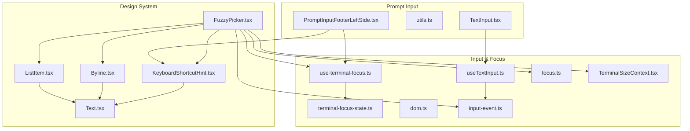
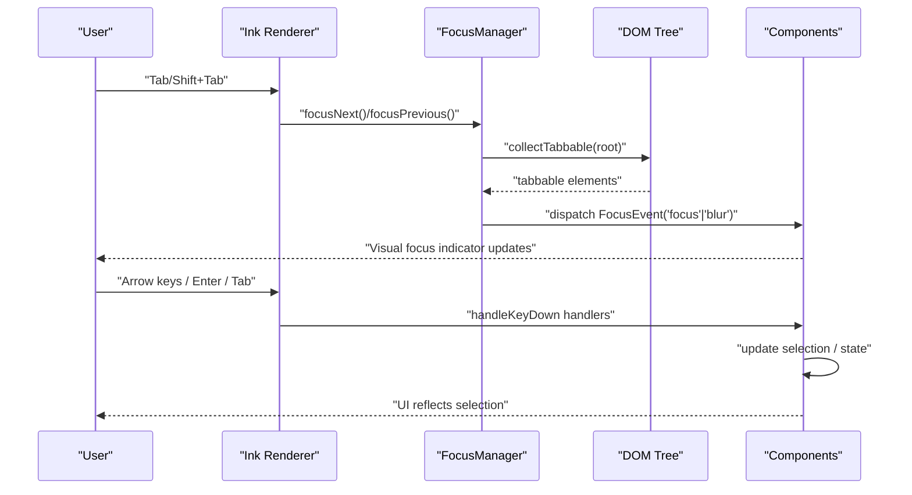
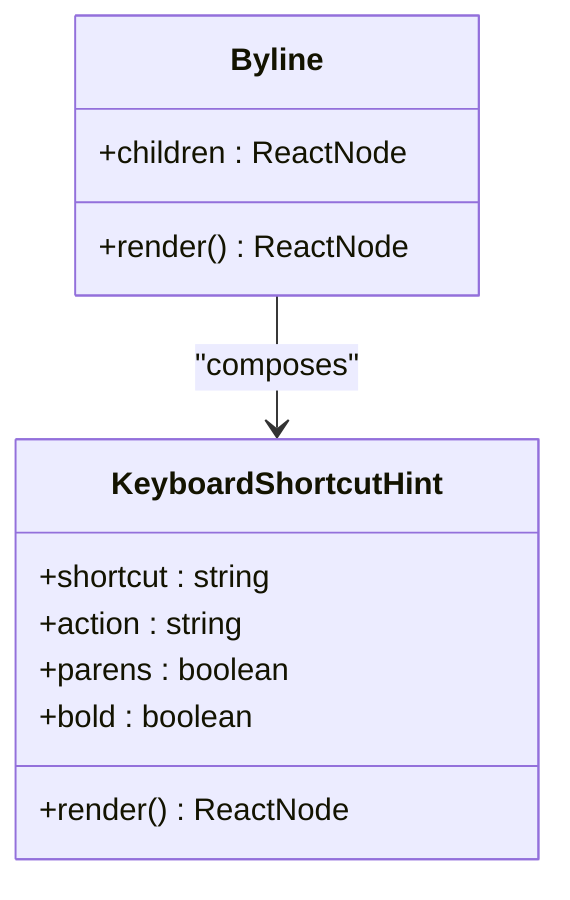
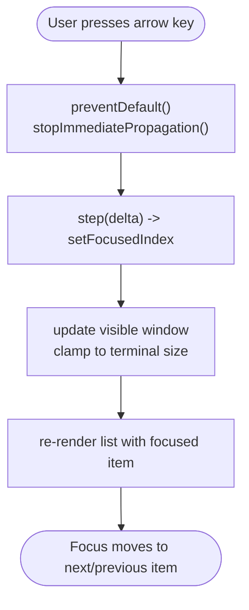
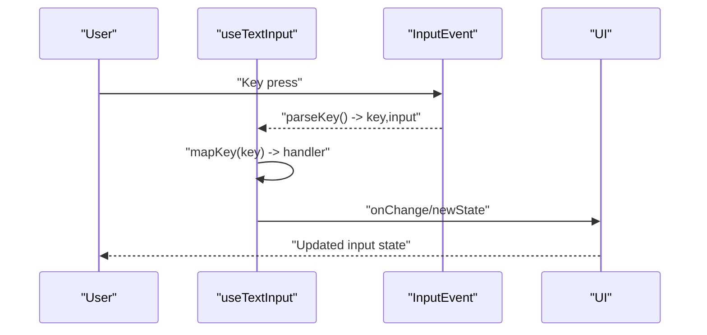
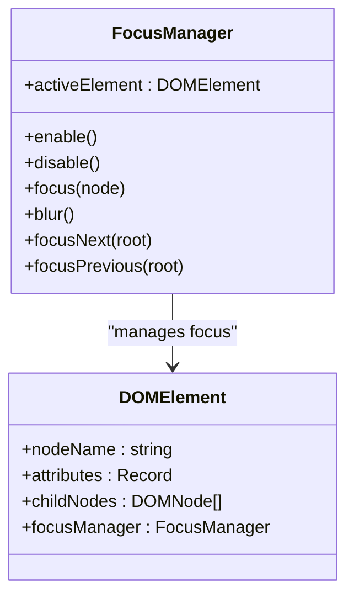
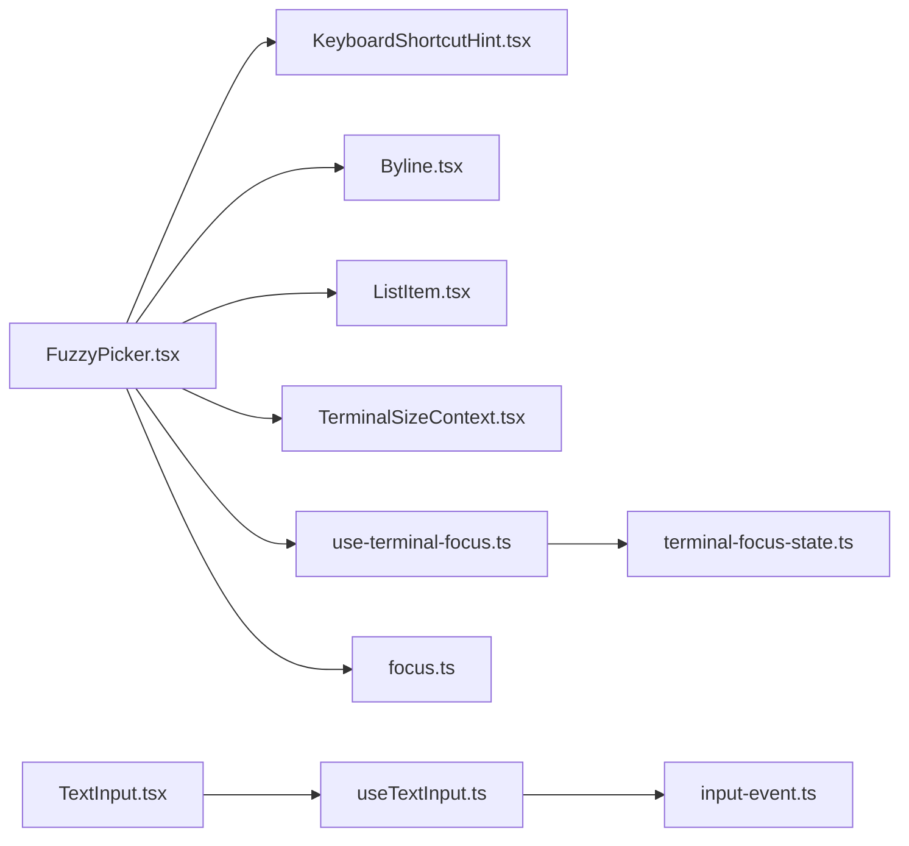

# Accessibility Patterns

<cite>
**Referenced Files in This Document**
- [KeyboardShortcutHint.tsx](file://src/components/design-system/KeyboardShortcutHint.tsx)
- [FuzzyPicker.tsx](file://src/components/design-system/FuzzyPicker.tsx)
- [Byline.tsx](file://src/components/design-system/Byline.tsx)
- [ListItem.tsx](file://src/components/design-system/ListItem.tsx)
- [TextInput.tsx](file://src/components/TextInput.tsx)
- [useTextInput.ts](file://src/hooks/useTextInput.ts)
- [focus.ts](file://src/ink/focus.ts)
- [dom.ts](file://src/ink/dom.ts)
- [Text.tsx](file://src/ink/components/Text.tsx)
- [use-terminal-focus.ts](file://src/ink/hooks/use-terminal-focus.ts)
- [terminal-focus-state.ts](file://src/ink/terminal-focus-state.ts)
- [input-event.ts](file://src/ink/events/input-event.ts)
- [TerminalSizeContext.tsx](file://src/ink/components/TerminalSizeContext.tsx)
- [PromptInputFooterLeftSide.tsx](file://src/components/PromptInput/PromptInputFooterLeftSide.tsx)
- [utils.ts](file://src/components/PromptInput/utils.ts)
</cite>

## Table of Contents
1. [Introduction](#introduction)
2. [Project Structure](#project-structure)
3. [Core Components](#core-components)
4. [Architecture Overview](#architecture-overview)
5. [Detailed Component Analysis](#detailed-component-analysis)
6. [Dependency Analysis](#dependency-analysis)
7. [Performance Considerations](#performance-considerations)
8. [Troubleshooting Guide](#troubleshooting-guide)
9. [Conclusion](#conclusion)
10. [Appendices](#appendices)

## Introduction
This document defines accessibility patterns for the terminal-based design system. It focuses on keyboard navigation, screen reader compatibility, focus management, and inclusive input methods across terminal UI components. It also covers color contrast, text scaling, and alternative input strategies, with practical examples and guidance for testing and common pitfalls in terminal-based UI development.

## Project Structure
The accessibility patterns are implemented across:
- Design system components (keyboard hints, fuzzy picker, list items, byline)
- Terminal-focused input handling (text input hook, terminal focus state)
- Ink renderer internals (DOM, focus manager, events)
- Prompt input helpers (footer hints, platform-specific instructions)

**Diagram sources**
- [FuzzyPicker.tsx:1-312](file://src/components/design-system/FuzzyPicker.tsx#L1-L312)
- [KeyboardShortcutHint.tsx:1-81](file://src/components/design-system/KeyboardShortcutHint.tsx#L1-L81)
- [Byline.tsx:1-77](file://src/components/design-system/Byline.tsx#L1-L77)
- [ListItem.tsx:1-244](file://src/components/design-system/ListItem.tsx#L1-L244)
- [Text.tsx:1-254](file://src/ink/components/Text.tsx#L1-L254)
- [useTextInput.ts:1-530](file://src/hooks/useTextInput.ts#L1-L530)
- [use-terminal-focus.ts:1-16](file://src/ink/hooks/use-terminal-focus.ts#L1-L16)
- [terminal-focus-state.ts:1-47](file://src/ink/terminal-focus-state.ts#L1-L47)
- [focus.ts:1-182](file://src/ink/focus.ts#L1-L182)
- [dom.ts:1-485](file://src/ink/dom.ts#L1-L485)
- [input-event.ts:167-205](file://src/ink/events/input-event.ts#L167-L205)
- [TerminalSizeContext.tsx:1-7](file://src/ink/components/TerminalSizeContext.tsx#L1-L7)
- [PromptInputFooterLeftSide.tsx:440-466](file://src/components/PromptInput/PromptInputFooterLeftSide.tsx#L440-L466)
- [utils.ts:1-60](file://src/components/PromptInput/utils.ts#L1-L60)
- [TextInput.tsx:60-93](file://src/components/TextInput.tsx#L60-L93)

**Section sources**
- [FuzzyPicker.tsx:1-312](file://src/components/design-system/FuzzyPicker.tsx#L1-L312)
- [KeyboardShortcutHint.tsx:1-81](file://src/components/design-system/KeyboardShortcutHint.tsx#L1-L81)
- [Byline.tsx:1-77](file://src/components/design-system/Byline.tsx#L1-L77)
- [ListItem.tsx:1-244](file://src/components/design-system/ListItem.tsx#L1-L244)
- [Text.tsx:1-254](file://src/ink/components/Text.tsx#L1-L254)
- [useTextInput.ts:1-530](file://src/hooks/useTextInput.ts#L1-L530)
- [use-terminal-focus.ts:1-16](file://src/ink/hooks/use-terminal-focus.ts#L1-L16)
- [terminal-focus-state.ts:1-47](file://src/ink/terminal-focus-state.ts#L1-L47)
- [focus.ts:1-182](file://src/ink/focus.ts#L1-L182)
- [dom.ts:1-485](file://src/ink/dom.ts#L1-L485)
- [input-event.ts:167-205](file://src/ink/events/input-event.ts#L167-L205)
- [TerminalSizeContext.tsx:1-7](file://src/ink/components/TerminalSizeContext.tsx#L1-L7)
- [PromptInputFooterLeftSide.tsx:440-466](file://src/components/PromptInput/PromptInputFooterLeftSide.tsx#L440-L466)
- [utils.ts:1-60](file://src/components/PromptInput/utils.ts#L1-L60)
- [TextInput.tsx:60-93](file://src/components/TextInput.tsx#L60-L93)

## Core Components
- KeyboardShortcutHint: Renders accessible hints for keyboard actions with optional bolding and parentheses wrapping.
- FuzzyPicker: Implements keyboard-driven selection with arrow navigation, Enter to select, Tab/Shift+Tab for specialized actions, and dynamic hints.
- Byline: Composes multiple hints with a middot separator for inline metadata display.
- ListItem: Provides focus/selection indicators and scroll hints with optional custom styling.
- useTextInput: Centralizes text input handling, including key mappings, history navigation, and cursor movement.
- Focus Manager and DOM: Manages focus traversal, blur/focus events, and tabbable collection in the terminal DOM.
- Terminal Focus Utilities: Expose terminal focus state and provide hooks for consumers.

**Section sources**
- [KeyboardShortcutHint.tsx:1-81](file://src/components/design-system/KeyboardShortcutHint.tsx#L1-L81)
- [FuzzyPicker.tsx:1-312](file://src/components/design-system/FuzzyPicker.tsx#L1-L312)
- [Byline.tsx:1-77](file://src/components/design-system/Byline.tsx#L1-L77)
- [ListItem.tsx:1-244](file://src/components/design-system/ListItem.tsx#L1-L244)
- [useTextInput.ts:1-530](file://src/hooks/useTextInput.ts#L1-L530)
- [focus.ts:1-182](file://src/ink/focus.ts#L1-L182)
- [dom.ts:1-485](file://src/ink/dom.ts#L1-L485)
- [use-terminal-focus.ts:1-16](file://src/ink/hooks/use-terminal-focus.ts#L1-L16)
- [terminal-focus-state.ts:1-47](file://src/ink/terminal-focus-state.ts#L1-L47)

## Architecture Overview
The accessibility architecture integrates terminal-aware focus management, keyboard event parsing, and design system components that expose actionable hints and state.

**Diagram sources**
- [focus.ts:102-131](file://src/ink/focus.ts#L102-L131)
- [dom.ts:134-151](file://src/ink/dom.ts#L134-L151)
- [FuzzyPicker.tsx:123-155](file://src/components/design-system/FuzzyPicker.tsx#L123-L155)

**Section sources**
- [focus.ts:1-182](file://src/ink/focus.ts#L1-L182)
- [dom.ts:134-151](file://src/ink/dom.ts#L134-L151)
- [FuzzyPicker.tsx:123-155](file://src/components/design-system/FuzzyPicker.tsx#L123-L155)

## Detailed Component Analysis

### KeyboardShortcutHint
- Purpose: Render accessible hints for keyboard actions with optional bolding and parentheses.
- Accessibility: Wraps content in a semantic Text node; consumers can dim hints for reduced prominence.
- Usage: Combine multiple hints inside a Byline for inline metadata display.

**Diagram sources**
- [KeyboardShortcutHint.tsx:1-81](file://src/components/design-system/KeyboardShortcutHint.tsx#L1-L81)
- [Byline.tsx:1-77](file://src/components/design-system/Byline.tsx#L1-L77)

**Section sources**
- [KeyboardShortcutHint.tsx:1-81](file://src/components/design-system/KeyboardShortcutHint.tsx#L1-L81)
- [Byline.tsx:1-77](file://src/components/design-system/Byline.tsx#L1-L77)

### FuzzyPicker
- Keyboard navigation: Arrow keys move focus; Enter selects; Tab/Shift+Tab trigger specialized actions if provided.
- Dynamic hints: Displays navigation, selection, and cancellation hints; adjusts for narrow terminals.
- Focus management: Uses FocusManager to cycle focus and maintain state.

**Diagram sources**
- [FuzzyPicker.tsx:123-155](file://src/components/design-system/FuzzyPicker.tsx#L123-L155)
- [focus.ts:110-131](file://src/ink/focus.ts#L110-L131)

**Section sources**
- [FuzzyPicker.tsx:68-216](file://src/components/design-system/FuzzyPicker.tsx#L68-L216)
- [focus.ts:102-131](file://src/ink/focus.ts#L102-L131)

### Byline
- Purpose: Join multiple hints with a middot separator and filter out null/undefined children.
- Accessibility: Ensures only valid elements are rendered, preventing aria-invalid markup.

**Section sources**
- [Byline.tsx:1-77](file://src/components/design-system/Byline.tsx#L1-L77)

### ListItem
- Purpose: Selection UI with focus/selection indicators and scroll hints.
- Accessibility: Applies color states for focus/selection; disables indicators for disabled items; optional custom styling.

**Section sources**
- [ListItem.tsx:1-244](file://src/components/design-system/ListItem.tsx#L1-L244)

### useTextInput
- Purpose: Centralizes text input handling, including key mappings, history navigation, and cursor movement.
- Accessibility: Supports platform-specific newline instructions and modifier-aware behavior.

**Diagram sources**
- [input-event.ts:167-205](file://src/ink/events/input-event.ts#L167-L205)
- [useTextInput.ts:318-413](file://src/hooks/useTextInput.ts#L318-L413)

**Section sources**
- [useTextInput.ts:1-530](file://src/hooks/useTextInput.ts#L1-L530)
- [input-event.ts:167-205](file://src/ink/events/input-event.ts#L167-L205)

### Terminal Focus Management
- FocusManager: Tracks activeElement, maintains focus stack, and cycles focus across tabbable elements.
- DOM Integration: collectTabbable traverses DOM to find elements with tabIndex >= 0.
- Terminal Focus State: Provides hooks to detect terminal focus and blur events.

**Diagram sources**
- [focus.ts:15-131](file://src/ink/focus.ts#L15-L131)
- [dom.ts:31-91](file://src/ink/dom.ts#L31-L91)

**Section sources**
- [focus.ts:1-182](file://src/ink/focus.ts#L1-L182)
- [dom.ts:1-485](file://src/ink/dom.ts#L1-L485)
- [use-terminal-focus.ts:1-16](file://src/ink/hooks/use-terminal-focus.ts#L1-L16)
- [terminal-focus-state.ts:1-47](file://src/ink/terminal-focus-state.ts#L1-L47)

### Prompt Input Accessibility Helpers
- Footer hints: Display keyboard shortcuts for copy, native selection, and task management.
- Platform-specific instructions: Dynamically adjust newline instructions based on terminal and keybindings.

**Section sources**
- [PromptInputFooterLeftSide.tsx:440-466](file://src/components/PromptInput/PromptInputFooterLeftSide.tsx#L440-L466)
- [utils.ts:17-32](file://src/components/PromptInput/utils.ts#L17-L32)

## Dependency Analysis
- FuzzyPicker depends on KeyboardShortcutHint, Byline, ListItem, TerminalSizeContext, terminal focus hooks, and the focus manager.
- useTextInput integrates with Ink’s input-event parsing and provides state for text rendering.
- Terminal focus utilities integrate with Ink’s terminal-focus-state to inform components about focus.

**Diagram sources**
- [FuzzyPicker.tsx:1-312](file://src/components/design-system/FuzzyPicker.tsx#L1-L312)
- [KeyboardShortcutHint.tsx:1-81](file://src/components/design-system/KeyboardShortcutHint.tsx#L1-L81)
- [Byline.tsx:1-77](file://src/components/design-system/Byline.tsx#L1-L77)
- [ListItem.tsx:1-244](file://src/components/design-system/ListItem.tsx#L1-L244)
- [TerminalSizeContext.tsx:1-7](file://src/ink/components/TerminalSizeContext.tsx#L1-L7)
- [use-terminal-focus.ts:1-16](file://src/ink/hooks/use-terminal-focus.ts#L1-L16)
- [focus.ts:1-182](file://src/ink/focus.ts#L1-L182)
- [useTextInput.ts:1-530](file://src/hooks/useTextInput.ts#L1-L530)
- [input-event.ts:167-205](file://src/ink/events/input-event.ts#L167-L205)
- [terminal-focus-state.ts:1-47](file://src/ink/terminal-focus-state.ts#L1-L47)
- [TextInput.tsx:60-93](file://src/components/TextInput.tsx#L60-L93)

**Section sources**
- [FuzzyPicker.tsx:1-312](file://src/components/design-system/FuzzyPicker.tsx#L1-L312)
- [useTextInput.ts:1-530](file://src/hooks/useTextInput.ts#L1-L530)
- [input-event.ts:167-205](file://src/ink/events/input-event.ts#L167-L205)
- [use-terminal-focus.ts:1-16](file://src/ink/hooks/use-terminal-focus.ts#L1-L16)
- [terminal-focus-state.ts:1-47](file://src/ink/terminal-focus-state.ts#L1-L47)
- [TextInput.tsx:60-93](file://src/components/TextInput.tsx#L60-L93)

## Performance Considerations
- Minimize re-renders by leveraging memoization and stable prop references in design system components.
- Clamp visible counts in list-like components to avoid layout thrashing during keyboard navigation.
- Use early exits and preventDefault to reduce unnecessary event handling.

[No sources needed since this section provides general guidance]

## Troubleshooting Guide
Common accessibility pitfalls and solutions in terminal-based UI:
- Missing focus indicators: Ensure focusable elements declare tabIndex and components update focus visuals.
- Non-descriptive hints: Always pair keyboard shortcuts with meaningful actions in hints.
- Overly small touch targets: Increase spacing and ensure sufficient terminal width for interaction.
- Inconsistent focus cycling: Verify FocusManager collects tabbable elements correctly and respects disabled states.
- Ignoring terminal focus: Use terminal focus hooks to adapt behavior when the terminal is blurred.

**Section sources**
- [focus.ts:134-151](file://src/ink/focus.ts#L134-L151)
- [use-terminal-focus.ts:1-16](file://src/ink/hooks/use-terminal-focus.ts#L1-L16)
- [terminal-focus-state.ts:1-47](file://src/ink/terminal-focus-state.ts#L1-L47)

## Conclusion
The design system provides robust building blocks for accessible terminal UIs. By combining explicit keyboard hints, disciplined focus management, and platform-aware input handling, developers can create inclusive experiences that work well for keyboard-only users, screen readers, and assistive technologies.

[No sources needed since this section summarizes without analyzing specific files]

## Appendices

### Practical Examples
- Adding keyboard hints: Wrap hints in a Byline and use dim styling for secondary hints.
- Making a picker accessible: Provide Enter to select, Tab/Shift+Tab for specialized actions, and ensure hints reflect current state.
- Handling terminal focus: Use terminal focus hooks to conditionally render cursors and animations.

**Section sources**
- [Byline.tsx:1-77](file://src/components/design-system/Byline.tsx#L1-L77)
- [FuzzyPicker.tsx:196-216](file://src/components/design-system/FuzzyPicker.tsx#L196-L216)
- [TextInput.tsx:60-93](file://src/components/TextInput.tsx#L60-L93)

### Testing Accessibility Compliance
- Keyboard-only testing: Navigate using Tab/Shift+Tab, arrows, Enter, and Escape; verify focus order and state changes.
- Screen reader testing: Confirm hints and labels are announced in logical order.
- Contrast and scaling: Verify readability at various terminal sizes and with high contrast themes.

[No sources needed since this section provides general guidance]