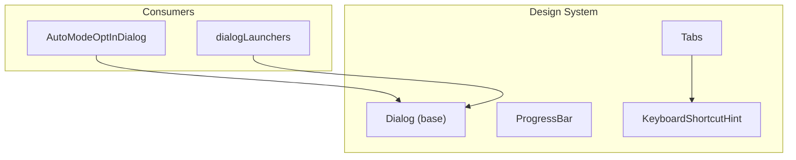
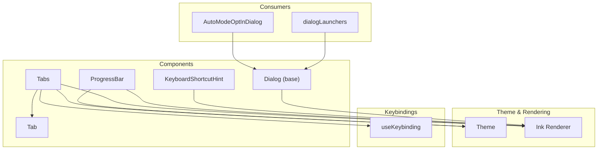
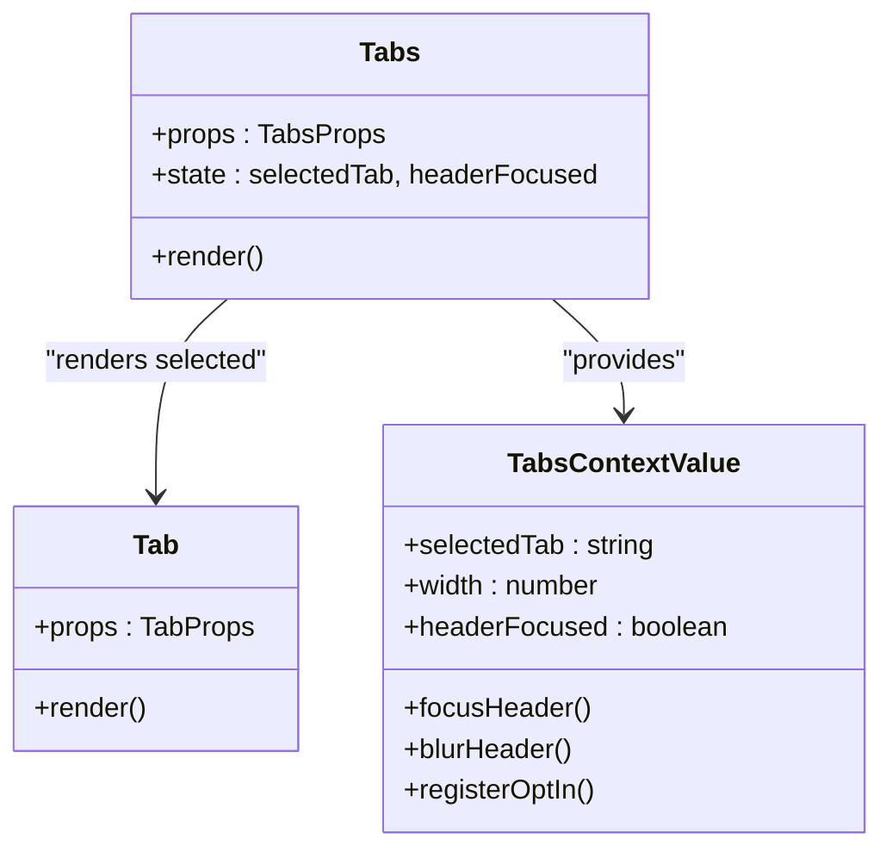
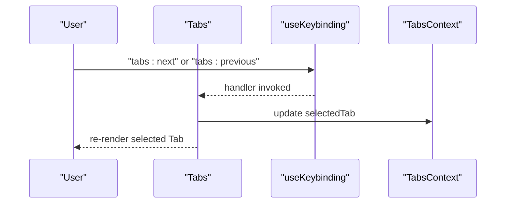
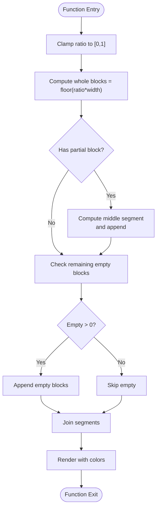
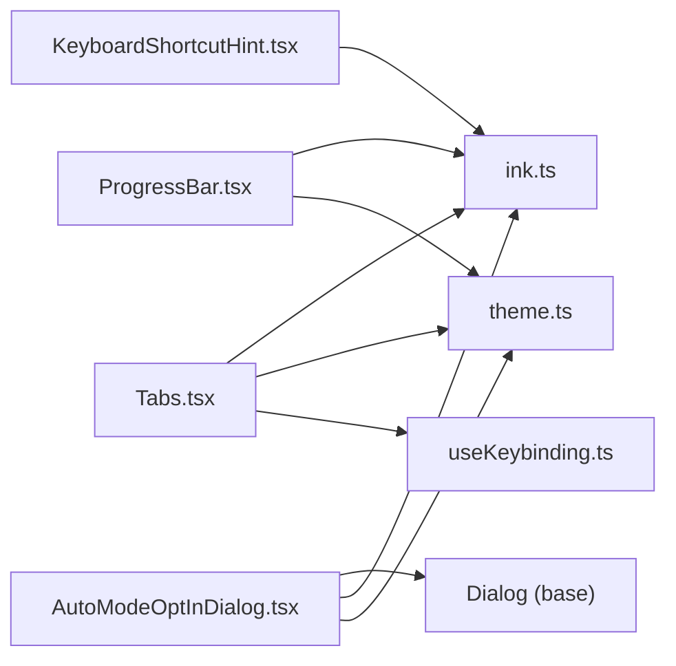

# Component Library

<cite>
**Referenced Files in This Document**
- [Tabs.tsx](file://src/components/design-system/Tabs.tsx)
- [ProgressBar.tsx](file://src/components/design-system/ProgressBar.tsx)
- [KeyboardShortcutHint.tsx](file://src/components/design-system/KeyboardShortcutHint.tsx)
- [AutoModeOptInDialog.tsx](file://src/components/AutoModeOptInDialog.tsx)
- [dialogLaunchers.tsx](file://src/dialogLaunchers.tsx)
- [useKeybinding.ts](file://src/keybindings/useKeybinding.ts)
- [theme.ts](file://src/utils/theme.ts)
- [ink.ts](file://src/ink.ts)
</cite>

## Table of Contents
1. [Introduction](#introduction)
2. [Project Structure](#project-structure)
3. [Core Components](#core-components)
4. [Architecture Overview](#architecture-overview)
5. [Detailed Component Analysis](#detailed-component-analysis)
6. [Dependency Analysis](#dependency-analysis)
7. [Performance Considerations](#performance-considerations)
8. [Troubleshooting Guide](#troubleshooting-guide)
9. [Conclusion](#conclusion)

## Introduction
This document describes the design system component library used in the application. It focuses on four components: Dialog (modal interactions), Tabs (navigation), ProgressBar (loading states), and KeyboardShortcutHint (accessibility). For each component, we explain purpose, props, usage patterns, implementation details, composition patterns, styling approaches, and integration with other design system elements. We also cover lifecycle considerations, performance characteristics, and best practices for extending the library.

## Project Structure
The design system components live under the design-system folder and are consumed by higher-level components and dialogs. The Tabs component integrates with terminal sizing, keybindings, and scroll containers. The ProgressBar renders character-based progress bars. The KeyboardShortcutHint renders accessible hints for keyboard interactions. Dialogs are implemented as specialized compositions using the base Dialog component.

**Diagram sources**
- [Tabs.tsx:1-340](file://src/components/design-system/Tabs.tsx#L1-L340)
- [ProgressBar.tsx:1-86](file://src/components/design-system/ProgressBar.tsx#L1-L86)
- [KeyboardShortcutHint.tsx:1-81](file://src/components/design-system/KeyboardShortcutHint.tsx#L1-L81)
- [AutoModeOptInDialog.tsx:1-142](file://src/components/AutoModeOptInDialog.tsx#L1-L142)
- [dialogLaunchers.tsx](file://src/dialogLaunchers.tsx)

**Section sources**
- [Tabs.tsx:1-340](file://src/components/design-system/Tabs.tsx#L1-L340)
- [ProgressBar.tsx:1-86](file://src/components/design-system/ProgressBar.tsx#L1-L86)
- [KeyboardShortcutHint.tsx:1-81](file://src/components/design-system/KeyboardShortcutHint.tsx#L1-L81)
- [AutoModeOptInDialog.tsx:1-142](file://src/components/AutoModeOptInDialog.tsx#L1-L142)

## Core Components
- Dialog: Modal container used by multiple dialogs to present content with standardized behavior and styling.
- Tabs: Tabbed interface with keyboard navigation, optional full-width layout, and controlled/uncontrolled modes.
- ProgressBar: Character-based progress indicator supporting configurable fill and empty colors.
- KeyboardShortcutHint: Accessible hint for displaying keyboard shortcuts and actions.

**Section sources**
- [Tabs.tsx:11-47](file://src/components/design-system/Tabs.tsx#L11-L47)
- [ProgressBar.tsx:5-25](file://src/components/design-system/ProgressBar.tsx#L5-L25)
- [KeyboardShortcutHint.tsx:4-13](file://src/components/design-system/KeyboardShortcutHint.tsx#L4-L13)

## Architecture Overview
The design system components integrate with the terminal rendering engine (Ink), keybindings system, and theme utilities. Consumers (dialogs and pages) compose these components to build cohesive UI experiences.

**Diagram sources**
- [Tabs.tsx:1-340](file://src/components/design-system/Tabs.tsx#L1-L340)
- [ProgressBar.tsx:1-86](file://src/components/design-system/ProgressBar.tsx#L1-L86)
- [KeyboardShortcutHint.tsx:1-81](file://src/components/design-system/KeyboardShortcutHint.tsx#L1-L81)
- [AutoModeOptInDialog.tsx:1-142](file://src/components/AutoModeOptInDialog.tsx#L1-L142)
- [useKeybinding.ts](file://src/keybindings/useKeybinding.ts)
- [theme.ts](file://src/utils/theme.ts)
- [ink.ts](file://src/ink.ts)

## Detailed Component Analysis

### Dialog (Modal Interactions)
Purpose
- Provides a reusable modal container for dialogs, handling layout, focus, and presentation.

Props
- title: Modal title text.
- color: Theme color for emphasis.
- onCancel: Callback invoked when the user cancels or dismisses the dialog.
- children: Modal content.

Usage patterns
- Dialogs compose content and actions (e.g., selects, links, text) and wire cancel behavior to application state.
- Example consumer: AutoModeOptInDialog composes a description, link, and a Select with options for acceptance or decline.

Implementation details
- Dialog is imported by consumers and wraps content with standardized styling and behavior.
- Consumers manage state transitions and analytics logging around user actions.

Integration
- Integrated with Select for option selection and with Link for external resources.
- Uses theme colors for emphasis and Ink for rendering.

Lifecycle
- Lifecycle is managed by the consumer; Dialog acts as a passive container.

Accessibility
- Consumers should ensure focus management and keyboard handling via Select and other controls.

Examples
- Enabling auto mode with options and cancellation flow.

**Section sources**
- [AutoModeOptInDialog.tsx:17-138](file://src/components/AutoModeOptInDialog.tsx#L17-L138)

### Tabs (Navigation)
Purpose
- Provides a tabbed navigation interface with keyboard support, optional full-width layout, and controlled/uncontrolled modes.

Props
- children: Array of Tab children.
- title?: Title text displayed above tabs.
- color?: Theme color for active tab highlight.
- defaultTab?: Default tab id/title.
- hidden?: Hide the tab header.
- useFullWidth?: Stretch tabs to fill terminal width.
- selectedTab?: Controlled mode: current selected tab id/title.
- onTabChange?: Controlled mode callback when tab changes.
- banner?: Optional banner below the tab header.
- disableNavigation?: Disable keyboard navigation (e.g., when child handles arrows).
- initialHeaderFocused?: Initial focus state for the tab header row.
- contentHeight?: Fixed height for content area to avoid layout shifts.
- navFromContent?: Allow switching tabs from focused content using ←/→.

Composition pattern
- Tabs renders a header row and a content area. Only the selected Tab child is rendered.
- TabsContext exposes selectedTab, width, and focus helpers to children.

Keyboard handling
- Uses useKeybinding to bind "tabs:next" and "tabs:previous".
- Supports switching tabs from content when enabled.

Rendering
- Uses Ink Box and Text for layout and theming.
- Uses ScrollBox for modal contexts to maintain consistent heights.

Styling
- Active tab uses inverse colors or a background color from theme depending on focus state.

Examples
- Multi-tab content with controlled selection and banner.

**Section sources**
- [Tabs.tsx:11-47](file://src/components/design-system/Tabs.tsx#L11-L47)
- [Tabs.tsx:66-242](file://src/components/design-system/Tabs.tsx#L66-L242)
- [Tabs.tsx:256-288](file://src/components/design-system/Tabs.tsx#L256-L288)
- [Tabs.tsx:289-340](file://src/components/design-system/Tabs.tsx#L289-L340)

#### Class Diagram: Tabs and Tab Composition

**Diagram sources**
- [Tabs.tsx:11-47](file://src/components/design-system/Tabs.tsx#L11-L47)
- [Tabs.tsx:48-65](file://src/components/design-system/Tabs.tsx#L48-L65)
- [Tabs.tsx:256-288](file://src/components/design-system/Tabs.tsx#L256-L288)

#### Sequence Diagram: Tab Navigation Flow

**Diagram sources**
- [Tabs.tsx:147-150](file://src/components/design-system/Tabs.tsx#L147-L150)
- [Tabs.tsx:182-191](file://src/components/design-system/Tabs.tsx#L182-L191)
- [Tabs.tsx:234-241](file://src/components/design-system/Tabs.tsx#L234-L241)

### ProgressBar (Loading States)
Purpose
- Renders a character-based progress bar with configurable width and colors.

Props
- ratio: Progress fraction [0, 1].
- width: Number of characters wide.
- fillColor?: Theme color for filled portion.
- emptyColor?: Theme color for empty portion.

Rendering algorithm
- Computes whole blocks and a partial block for fractional progress.
- Joins segments and applies colors via Ink Text.

Styling
- Uses theme keys for colors.

Examples
- Showing progress during long operations with consistent width.

**Section sources**
- [ProgressBar.tsx:5-25](file://src/components/design-system/ProgressBar.tsx#L5-L25)
- [ProgressBar.tsx:27-85](file://src/components/design-system/ProgressBar.tsx#L27-L85)

#### Flowchart: ProgressBar Rendering

**Diagram sources**
- [ProgressBar.tsx:27-85](file://src/components/design-system/ProgressBar.tsx#L27-L85)

### KeyboardShortcutHint (Accessibility)
Purpose
- Displays keyboard shortcuts and associated actions in a consistent, accessible way.

Props
- shortcut: Key or chord (e.g., "ctrl+o", "Enter", "↑/↓").
- action: Action description (e.g., "expand", "select", "navigate").
- parens?: Wrap in parentheses.
- bold?: Bold the shortcut text.

Styling
- Uses Ink Text with optional bold and dim colors.

Integration
- Often wrapped in dim-colored Text for subtle presentation.
- Can be composed with Byline for multiple hints.

Examples
- "ctrl+o to expand" with optional parentheses and bold shortcut.

**Section sources**
- [KeyboardShortcutHint.tsx:4-13](file://src/components/design-system/KeyboardShortcutHint.tsx#L4-L13)
- [KeyboardShortcutHint.tsx:38-80](file://src/components/design-system/KeyboardShortcutHint.tsx#L38-L80)

## Dependency Analysis
- Tabs depends on:
  - Ink Box/Text for rendering.
  - useKeybinding for keyboard handling.
  - Terminal size for responsive layouts.
  - Theme for colors.
- ProgressBar depends on:
  - Ink Text for rendering.
  - Theme for colors.
- KeyboardShortcutHint depends on:
  - Ink Text for rendering.
- Dialog consumers depend on:
  - Dialog base component.
  - Ink for rendering.
  - Theme for colors.
  - Other components (e.g., Select, Link) for content.

**Diagram sources**
- [Tabs.tsx:1-340](file://src/components/design-system/Tabs.tsx#L1-L340)
- [ProgressBar.tsx:1-86](file://src/components/design-system/ProgressBar.tsx#L1-L86)
- [KeyboardShortcutHint.tsx:1-81](file://src/components/design-system/KeyboardShortcutHint.tsx#L1-L81)
- [AutoModeOptInDialog.tsx:1-142](file://src/components/AutoModeOptInDialog.tsx#L1-L142)
- [ink.ts](file://src/ink.ts)
- [theme.ts](file://src/utils/theme.ts)
- [useKeybinding.ts](file://src/keybindings/useKeybinding.ts)

**Section sources**
- [Tabs.tsx:1-340](file://src/components/design-system/Tabs.tsx#L1-L340)
- [ProgressBar.tsx:1-86](file://src/components/design-system/ProgressBar.tsx#L1-L86)
- [KeyboardShortcutHint.tsx:1-81](file://src/components/design-system/KeyboardShortcutHint.tsx#L1-L81)
- [AutoModeOptInDialog.tsx:1-142](file://src/components/AutoModeOptInDialog.tsx#L1-L142)

## Performance Considerations
- Tabs
  - Memoization cache is used to avoid unnecessary renders of header and content areas.
  - Fixed contentHeight prevents layout shifts and reduces reflow when switching tabs.
  - Keyboard handling is gated by focus and visibility to minimize event overhead.
- ProgressBar
  - Efficient computation of whole/partial blocks and memoized segment joins.
  - Clamp ensures minimal recomputation when ratio is out of bounds.
- KeyboardShortcutHint
  - Lightweight memoization for shortcut text and paren-wrapped variants.
- Dialog
  - Consumers manage lifecycle; Dialog remains a passive container.

[No sources needed since this section provides general guidance]

## Troubleshooting Guide
- Tabs not responding to keyboard
  - Ensure header is focused and navigation is not disabled.
  - Verify keybindings context activation.
- Content jumps when switching tabs
  - Set contentHeight to lock the content area height.
- Shortcut hint not styled
  - Wrap in dim-colored Text for consistent appearance.
- Dialog not appearing
  - Confirm Dialog is imported and rendered by the consumer.

**Section sources**
- [Tabs.tsx:135-150](file://src/components/design-system/Tabs.tsx#L135-L150)
- [Tabs.tsx:170-191](file://src/components/design-system/Tabs.tsx#L170-L191)
- [Tabs.tsx:40-46](file://src/components/design-system/Tabs.tsx#L40-L46)
- [KeyboardShortcutHint.tsx:15-37](file://src/components/design-system/KeyboardShortcutHint.tsx#L15-L37)

## Conclusion
The design system provides modular, accessible, and performant UI primitives. Tabs offers robust keyboard navigation and composition, ProgressBar delivers efficient progress rendering, KeyboardShortcutHint standardizes accessibility messaging, and Dialog enables consistent modal experiences. Following the composition patterns and best practices outlined here will help extend the library reliably.