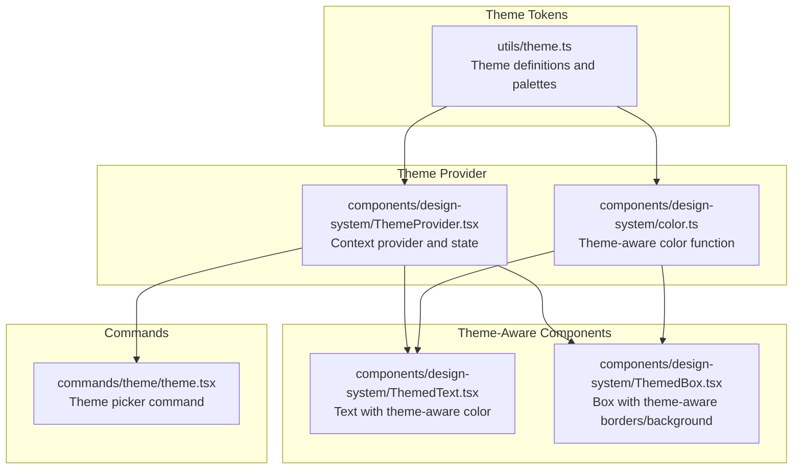
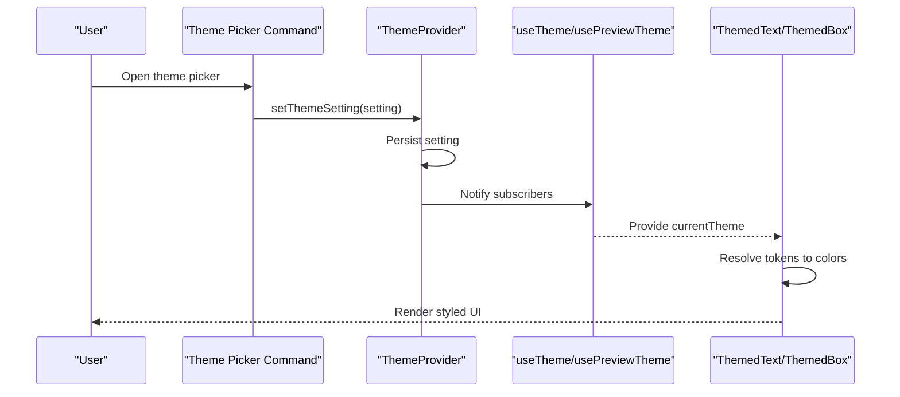
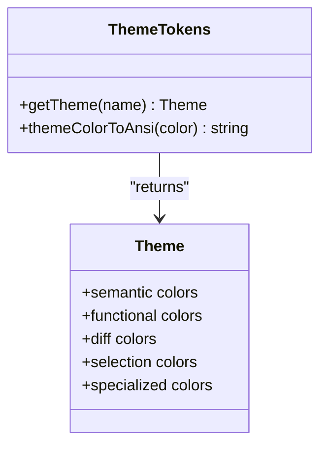
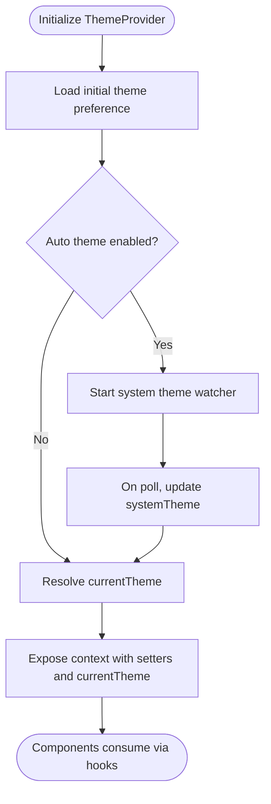
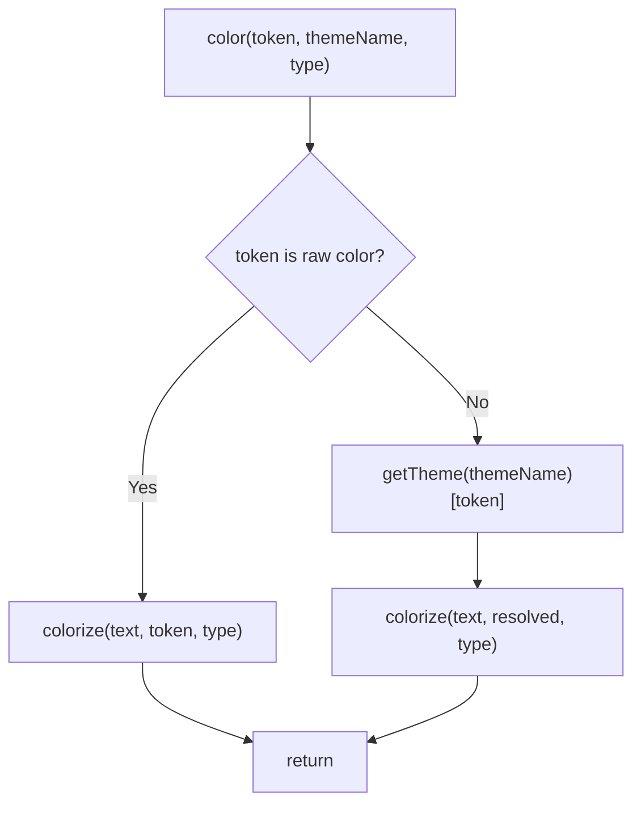
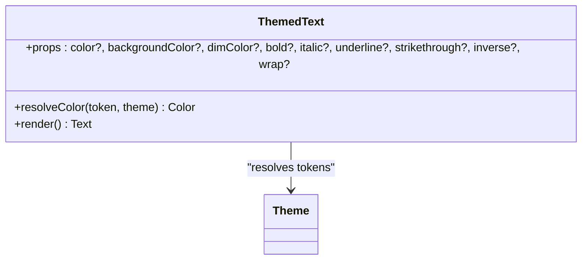
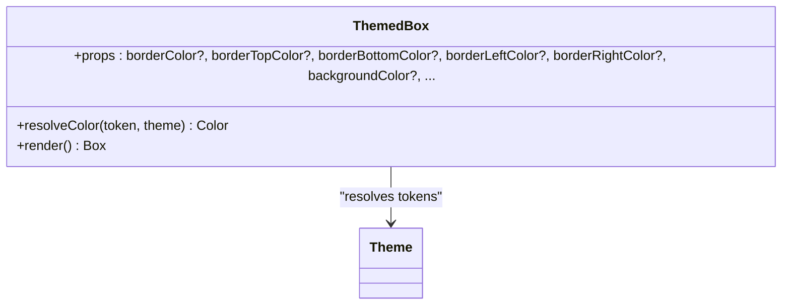
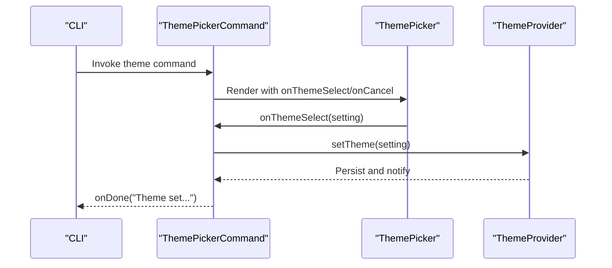
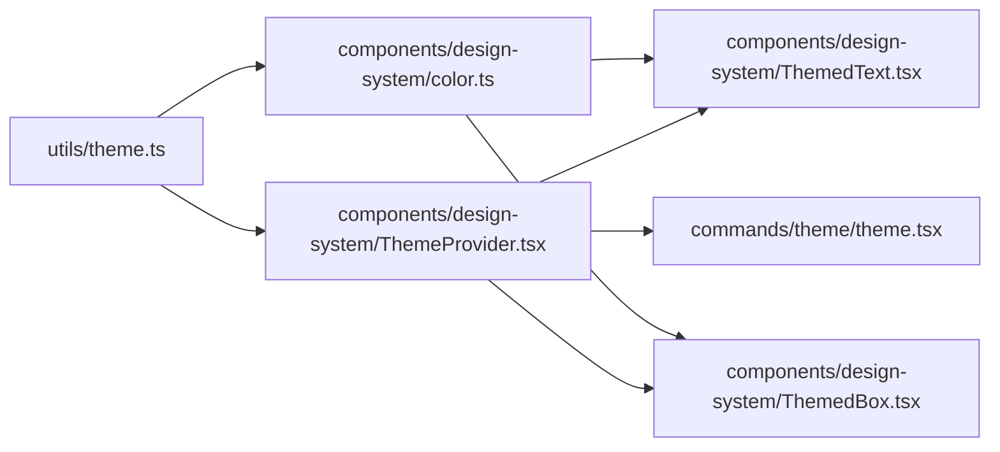

# Design System Architecture

<cite>
**Referenced Files in This Document**
- [theme.ts](file://claude_code_src/restored-src/src/utils/theme.ts)
- [color.ts](file://claude_code_src/restored-src/src/components/design-system/color.ts)
- [ThemeProvider.tsx](file://claude_code_src/restored-src/src/components/design-system/ThemeProvider.tsx)
- [ThemedText.tsx](file://claude_code_src/restored-src/src/components/design-system/ThemedText.tsx)
- [ThemedBox.tsx](file://claude_code_src/restored-src/src/components/design-system/ThemedBox.tsx)
- [theme.tsx](file://claude_code_src/restored-src/src/commands/theme/theme.tsx)
</cite>

## Table of Contents
1. [Introduction](#introduction)
2. [Project Structure](#project-structure)
3. [Core Components](#core-components)
4. [Architecture Overview](#architecture-overview)
5. [Detailed Component Analysis](#detailed-component-analysis)
6. [Dependency Analysis](#dependency-analysis)
7. [Performance Considerations](#performance-considerations)
8. [Troubleshooting Guide](#troubleshooting-guide)
9. [Conclusion](#conclusion)
10. [Appendices](#appendices)

## Introduction
This document describes the design system architecture used by the Claude Code Python IDE terminal-based UI. It explains the foundational design principles, the component library structure, and the design token system. It also covers the theme provider implementation, color scheme management, and component composition patterns. Practical guidance is included for using design system components, creating new components following design guidelines, and extending the design system for custom requirements. Accessibility considerations, responsive design patterns, and performance optimization for terminal UI components are addressed.

## Project Structure
The design system is centered around a theme abstraction and a set of theme-aware UI components built on top of the terminal UI framework. The core pieces are:
- A theme token system that defines semantic and functional colors for light/dark/daltonized/ANSI variants
- A theme provider that manages user preferences, live system theme detection, and previews
- Theme-aware components that resolve tokens to terminal-safe colors and apply styling consistently

**Diagram sources**
- [theme.ts:1-640](file://claude_code_src/restored-src/src/utils/theme.ts#L1-L640)
- [ThemeProvider.tsx:1-170](file://claude_code_src/restored-src/src/components/design-system/ThemeProvider.tsx#L1-L170)
- [color.ts:1-31](file://claude_code_src/restored-src/src/components/design-system/color.ts#L1-L31)
- [ThemedText.tsx:1-124](file://claude_code_src/restored-src/src/components/design-system/ThemedText.tsx#L1-L124)
- [ThemedBox.tsx:1-156](file://claude_code_src/restored-src/src/components/design-system/ThemedBox.tsx#L1-L156)
- [theme.tsx:1-57](file://claude_code_src/restored-src/src/commands/theme/theme.tsx#L1-L57)

**Section sources**
- [theme.ts:1-640](file://claude_code_src/restored-src/src/utils/theme.ts#L1-L640)
- [ThemeProvider.tsx:1-170](file://claude_code_src/restored-src/src/components/design-system/ThemeProvider.tsx#L1-L170)
- [color.ts:1-31](file://claude_code_src/restored-src/src/components/design-system/color.ts#L1-L31)
- [ThemedText.tsx:1-124](file://claude_code_src/restored-src/src/components/design-system/ThemedText.tsx#L1-L124)
- [ThemedBox.tsx:1-156](file://claude_code_src/restored-src/src/components/design-system/ThemedBox.tsx#L1-L156)
- [theme.tsx:1-57](file://claude_code_src/restored-src/src/commands/theme/theme.tsx#L1-L57)

## Core Components
- Theme tokens: A comprehensive set of semantic and functional color tokens covering text, backgrounds, statuses, diffs, selections, and specialized UI areas. Multiple palettes are provided for light/dark/daltonized modes and ANSI fallbacks.
- Theme provider: Manages user preferences, live system theme detection, and theme previews. Exposes hooks to consume and update the current theme.
- Theme-aware components: ThemedText and ThemedBox resolve theme keys to terminal-safe colors and apply styles consistently across the terminal UI.

**Section sources**
- [theme.ts:1-640](file://claude_code_src/restored-src/src/utils/theme.ts#L1-L640)
- [ThemeProvider.tsx:1-170](file://claude_code_src/restored-src/src/components/design-system/ThemeProvider.tsx#L1-L170)
- [ThemedText.tsx:1-124](file://claude_code_src/restored-src/src/components/design-system/ThemedText.tsx#L1-L124)
- [ThemedBox.tsx:1-156](file://claude_code_src/restored-src/src/components/design-system/ThemedBox.tsx#L1-L156)

## Architecture Overview
The design system separates concerns between token definition, theme resolution, and component rendering. Tokens are defined centrally and consumed by the provider and components. The provider exposes a stable API via React context and hooks, ensuring consistent theme application across the app.

**Diagram sources**
- [ThemeProvider.tsx:43-116](file://claude_code_src/restored-src/src/components/design-system/ThemeProvider.tsx#L43-L116)
- [ThemedText.tsx:80-123](file://claude_code_src/restored-src/src/components/design-system/ThemedText.tsx#L80-L123)
- [ThemedBox.tsx:56-155](file://claude_code_src/restored-src/src/components/design-system/ThemedBox.tsx#L56-L155)
- [theme.tsx:13-56](file://claude_code_src/restored-src/src/commands/theme/theme.tsx#L13-L56)

## Detailed Component Analysis

### Theme Token System
- Defines a Theme interface with semantic and functional tokens for text, backgrounds, statuses, diffs, selections, and specialized UI regions.
- Provides multiple palettes: light, dark, light-daltonized, dark-daltonized, light-ansi, dark-ansi.
- Includes helpers to convert theme colors to ANSI escape sequences for charting and compatibility.

**Diagram sources**
- [theme.ts:4-89](file://claude_code_src/restored-src/src/utils/theme.ts#L4-L89)
- [theme.ts:598-640](file://claude_code_src/restored-src/src/utils/theme.ts#L598-L640)

**Section sources**
- [theme.ts:1-640](file://claude_code_src/restored-src/src/utils/theme.ts#L1-L640)

### Theme Provider
- Stores user theme preference and preview state.
- Supports live system theme detection when enabled.
- Exposes hooks to read the resolved theme and update preferences.
- Persists theme changes to global configuration.

**Diagram sources**
- [ThemeProvider.tsx:43-116](file://claude_code_src/restored-src/src/components/design-system/ThemeProvider.tsx#L43-L116)

**Section sources**
- [ThemeProvider.tsx:1-170](file://claude_code_src/restored-src/src/components/design-system/ThemeProvider.tsx#L1-L170)

### Theme-Aware Color Function
- Curried function that resolves theme keys to raw color values before delegating to the terminal renderer.
- Accepts theme keys or raw color values (rgb, hex, ansi256, ansi).
- Used by components to ensure consistent color application.

**Diagram sources**
- [color.ts:9-30](file://claude_code_src/restored-src/src/components/design-system/color.ts#L9-L30)

**Section sources**
- [color.ts:1-31](file://claude_code_src/restored-src/src/components/design-system/color.ts#L1-L31)

### ThemedText Component
- Theme-aware text component that resolves color tokens to terminal-safe colors.
- Supports bold, italic, underline, strikethrough, inverse, and wrapping behavior.
- Integrates with hover color context for dynamic overrides.

**Diagram sources**
- [ThemedText.tsx:12-123](file://claude_code_src/restored-src/src/components/design-system/ThemedText.tsx#L12-L123)

**Section sources**
- [ThemedText.tsx:1-124](file://claude_code_src/restored-src/src/components/design-system/ThemedText.tsx#L1-L124)

### ThemedBox Component
- Theme-aware box component that resolves border and background color tokens.
- Preserves all base box props and event handlers.

**Diagram sources**
- [ThemedBox.tsx:24-155](file://claude_code_src/restored-src/src/components/design-system/ThemedBox.tsx#L24-L155)

**Section sources**
- [ThemedBox.tsx:1-156](file://claude_code_src/restored-src/src/components/design-system/ThemedBox.tsx#L1-L156)

### Theme Picker Command
- Presents a themed picker backed by the design system components.
- Updates the theme via the theme provider hook and reports completion.

**Diagram sources**
- [theme.tsx:13-56](file://claude_code_src/restored-src/src/commands/theme/theme.tsx#L13-L56)

**Section sources**
- [theme.tsx:1-57](file://claude_code_src/restored-src/src/commands/theme/theme.tsx#L1-L57)

## Dependency Analysis
- Theme tokens are consumed by the theme provider and color utilities.
- Theme-aware components depend on the theme provider and color utilities.
- Commands depend on the theme provider to change themes.

**Diagram sources**
- [theme.ts:1-640](file://claude_code_src/restored-src/src/utils/theme.ts#L1-L640)
- [ThemeProvider.tsx:1-170](file://claude_code_src/restored-src/src/components/design-system/ThemeProvider.tsx#L1-L170)
- [color.ts:1-31](file://claude_code_src/restored-src/src/components/design-system/color.ts#L1-L31)
- [ThemedText.tsx:1-124](file://claude_code_src/restored-src/src/components/design-system/ThemedText.tsx#L1-L124)
- [ThemedBox.tsx:1-156](file://claude_code_src/restored-src/src/components/design-system/ThemedBox.tsx#L1-L156)
- [theme.tsx:1-57](file://claude_code_src/restored-src/src/commands/theme/theme.tsx#L1-L57)

**Section sources**
- [theme.ts:1-640](file://claude_code_src/restored-src/src/utils/theme.ts#L1-L640)
- [ThemeProvider.tsx:1-170](file://claude_code_src/restored-src/src/components/design-system/ThemeProvider.tsx#L1-L170)
- [color.ts:1-31](file://claude_code_src/restored-src/src/components/design-system/color.ts#L1-L31)
- [ThemedText.tsx:1-124](file://claude_code_src/restored-src/src/components/design-system/ThemedText.tsx#L1-L124)
- [ThemedBox.tsx:1-156](file://claude_code_src/restored-src/src/components/design-system/ThemedBox.tsx#L1-L156)
- [theme.tsx:1-57](file://claude_code_src/restored-src/src/commands/theme/theme.tsx#L1-L57)

## Performance Considerations
- Minimize re-renders by using memoization patterns in components (observed in ThemedText and ThemedBox).
- Prefer raw color values for static styling to avoid repeated theme lookups.
- Use ANSI palettes on terminals without true color support to maintain performance and readability.
- Keep theme switching lightweight by updating context and avoiding heavy computations during transitions.

## Troubleshooting Guide
- Theme not applying: Verify the component consumes the theme via the provider hooks and resolves tokens correctly.
- Live theme detection not working: Ensure the AUTO_THEME feature flag is enabled and the terminal querier is available.
- ANSI color mismatch: Confirm the terminal supports the chosen palette; ANSI variants fall back to 16-color sets.
- Chart rendering issues: Use the provided ANSI conversion helper for charting contexts.

**Section sources**
- [ThemeProvider.tsx:64-80](file://claude_code_src/restored-src/src/components/design-system/ThemeProvider.tsx#L64-L80)
- [theme.ts:626-640](file://claude_code_src/restored-src/src/utils/theme.ts#L626-L640)

## Conclusion
The Claude Code Python IDE’s design system centers on a robust theme token system, a flexible theme provider, and theme-aware components. This architecture ensures consistent, accessible, and performant terminal UIs across varied environments, including live system theme detection and ANSI fallbacks. By following the provided patterns and guidelines, developers can reliably compose UIs and extend the design system for custom needs.

## Appendices

### Practical Examples
- Using ThemedText: Wrap text with ThemedText and pass a theme key or raw color for consistent styling.
- Using ThemedBox: Apply themed borders and backgrounds using theme keys for border and background props.
- Creating a new component: Build a theme-aware component by resolving tokens via the theme provider and color utilities, mirroring the patterns in ThemedText and ThemedBox.
- Extending the design system: Add new tokens to the Theme interface and palettes, then expose them through the provider and components.

[No sources needed since this section provides general guidance]