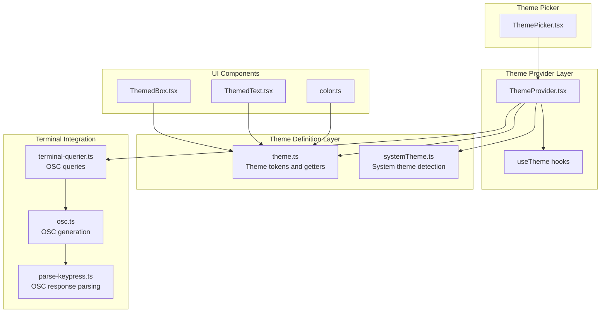
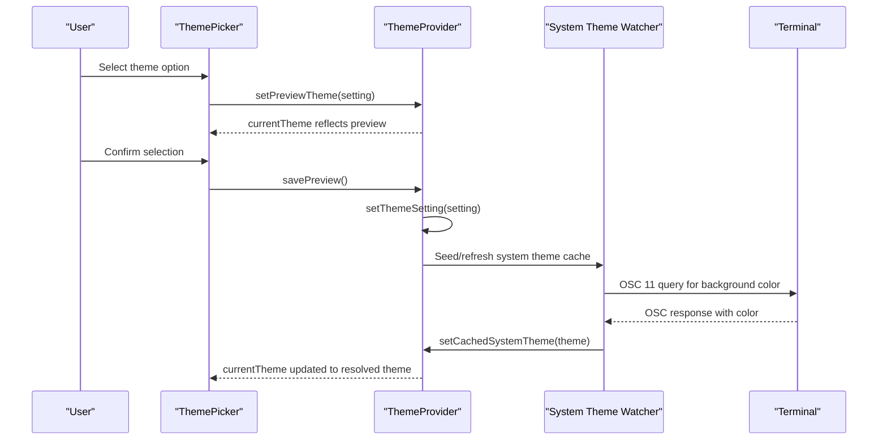
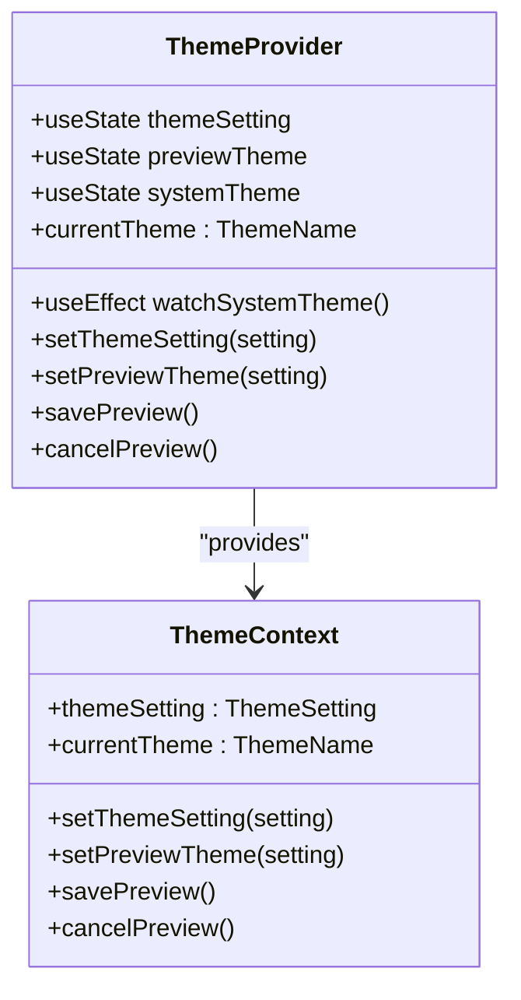
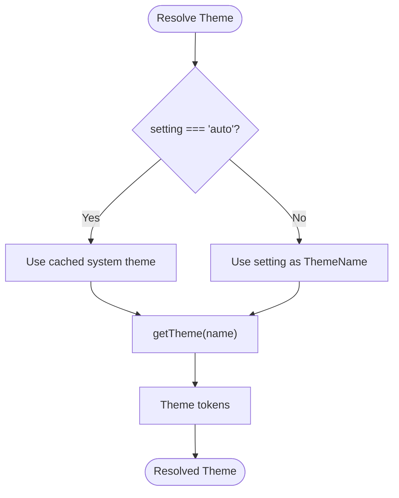
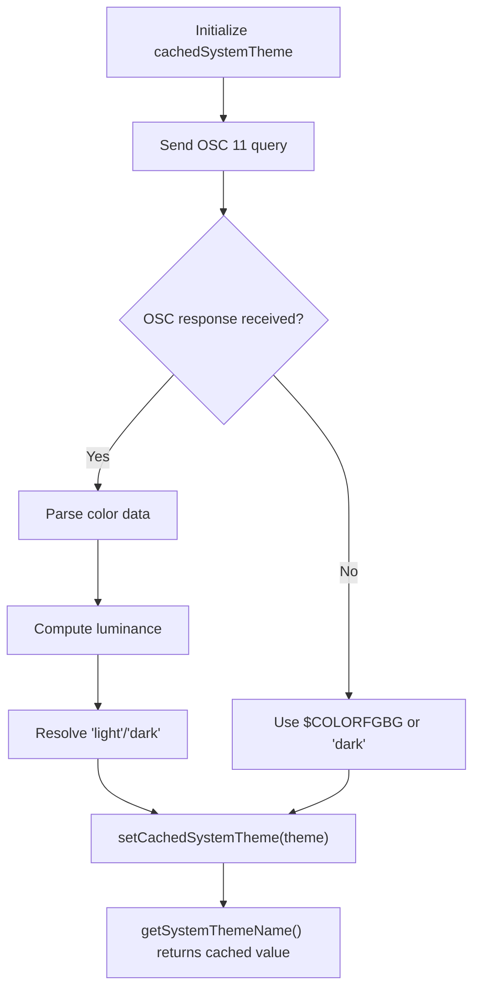
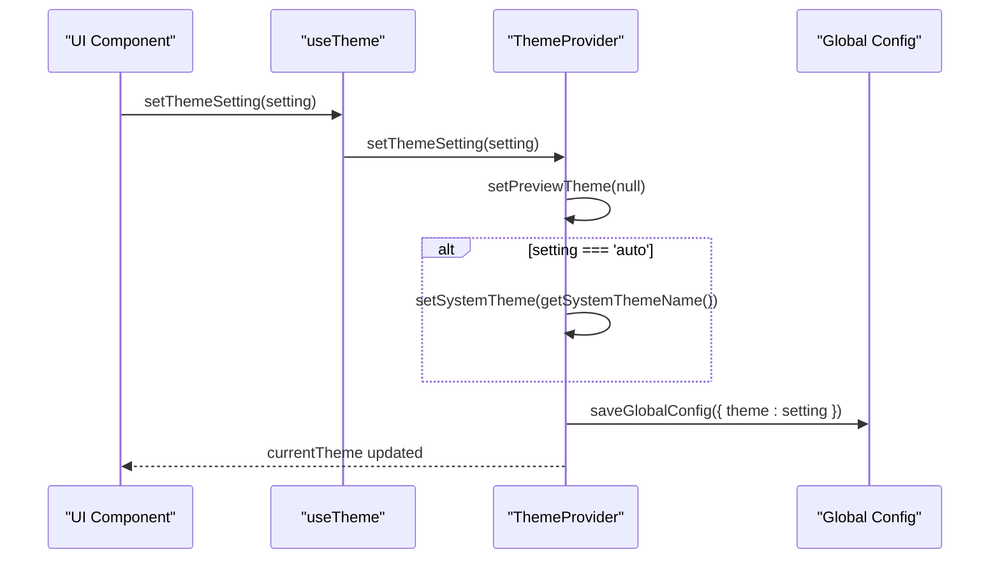
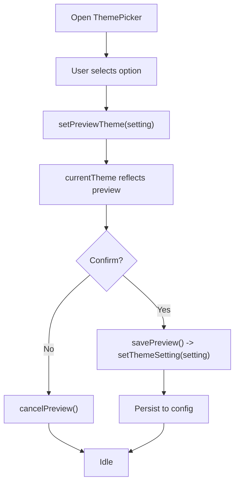
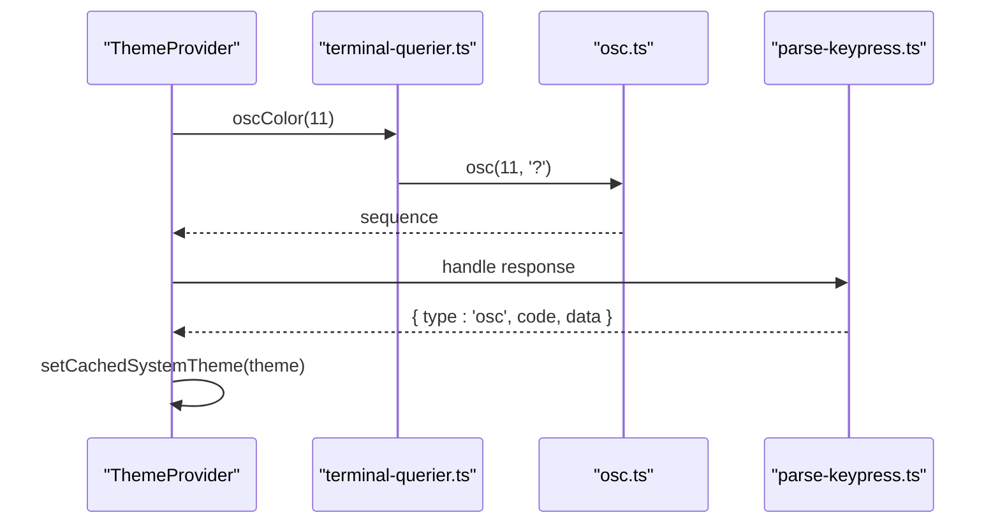
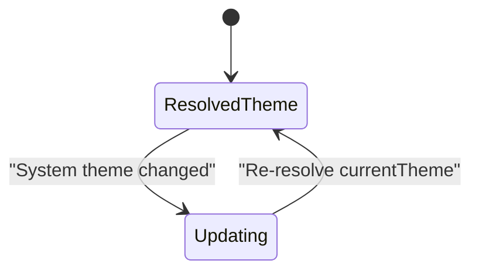
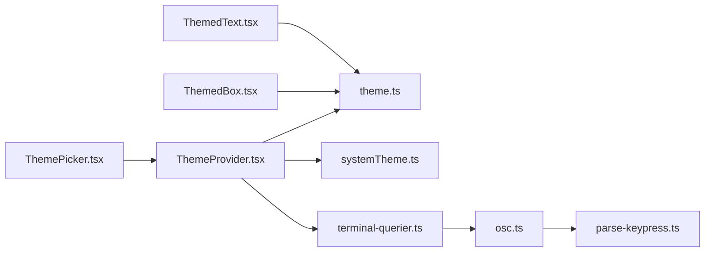

# Theme System

<cite>
**Referenced Files in This Document**
- [ThemeProvider.tsx](file://src/components/design-system/ThemeProvider.tsx)
- [theme.ts](file://src/utils/theme.ts)
- [systemTheme.ts](file://src/utils/systemTheme.ts)
- [ThemePicker.tsx](file://src/components/ThemePicker.tsx)
- [ThemedBox.tsx](file://src/components/design-system/ThemedBox.tsx)
- [ThemedText.tsx](file://src/components/design-system/ThemedText.tsx)
- [color.ts](file://src/components/design-system/color.ts)
- [theme.tsx](file://src/commands/theme/theme.tsx)
- [index.ts](file://src/commands/theme/index.ts)
- [terminal-querier.ts](file://src/ink/terminal-querier.ts)
- [osc.ts](file://src/ink/termio/osc.ts)
- [parse-keypress.ts](file://src/ink/parse-keypress.ts)
</cite>

## Table of Contents
1. [Introduction](#introduction)
2. [Project Structure](#project-structure)
3. [Core Components](#core-components)
4. [Architecture Overview](#architecture-overview)
5. [Detailed Component Analysis](#detailed-component-analysis)
6. [Dependency Analysis](#dependency-analysis)
7. [Performance Considerations](#performance-considerations)
8. [Troubleshooting Guide](#troubleshooting-guide)
9. [Conclusion](#conclusion)

## Introduction
This document explains the theme system architecture used in the Python IDE. It covers the ThemeProvider implementation, theme resolution logic, automatic theme detection from system preferences, the color token system, theme switching mechanisms, and preview functionality. It also documents integration with terminal themes, system theme watching, dynamic theme updates, and practical guidance for implementing themed components, creating custom themes, and optimizing performance during theme switching.

## Project Structure
The theme system spans several modules:
- Theme provider and context: ThemeProvider and useTheme hooks
- Theme definitions and resolution: Theme tokens and theme getters
- System theme detection: Terminal background color detection and caching
- UI components: ThemedBox and ThemedText for rendering with theme colors
- Theme picker: Interactive UI for selecting and previewing themes
- Terminal integration: OSC queries and response parsing for live theme updates
- CLI command: Theme command for programmatic theme changes

**Diagram sources**
- [ThemeProvider.tsx:1-170](file://src/components/design-system/ThemeProvider.tsx#L1-L170)
- [theme.ts:1-640](file://src/utils/theme.ts#L1-L640)
- [systemTheme.ts:1-120](file://src/utils/systemTheme.ts#L1-L120)
- [ThemedBox.tsx:1-156](file://src/components/design-system/ThemedBox.tsx#L1-L156)
- [ThemedText.tsx:1-124](file://src/components/design-system/ThemedText.tsx#L1-L124)
- [color.ts:1-30](file://src/components/design-system/color.ts#L1-L30)
- [ThemePicker.tsx:1-333](file://src/components/ThemePicker.tsx#L1-L333)
- [terminal-querier.ts:74-101](file://src/ink/terminal-querier.ts#L74-L101)
- [osc.ts:1-493](file://src/ink/termio/osc.ts#L1-L493)
- [parse-keypress.ts:113-164](file://src/ink/parse-keypress.ts#L113-L164)

**Section sources**
- [ThemeProvider.tsx:1-170](file://src/components/design-system/ThemeProvider.tsx#L1-L170)
- [theme.ts:1-640](file://src/utils/theme.ts#L1-L640)
- [systemTheme.ts:1-120](file://src/utils/systemTheme.ts#L1-L120)
- [ThemedBox.tsx:1-156](file://src/components/design-system/ThemedBox.tsx#L1-L156)
- [ThemedText.tsx:1-124](file://src/components/design-system/ThemedText.tsx#L1-L124)
- [color.ts:1-30](file://src/components/design-system/color.ts#L1-L30)
- [ThemePicker.tsx:1-333](file://src/components/ThemePicker.tsx#L1-L333)
- [terminal-querier.ts:74-101](file://src/ink/terminal-querier.ts#L74-L101)
- [osc.ts:1-493](file://src/ink/termio/osc.ts#L1-L493)
- [parse-keypress.ts:113-164](file://src/ink/parse-keypress.ts#L113-L164)

## Core Components
- ThemeProvider: Manages theme state, persists changes, and exposes theme context for consumers. Supports preview mode and integrates with system theme watching.
- Theme tokens: Centralized color definitions for semantic, diff, agent, and UI-specific colors across multiple palettes (dark, light, ANSI variants, daltonized variants).
- System theme detection: Detects terminal background color via OSC queries and caches the result for immediate resolution.
- Themed components: ThemedBox and ThemedText resolve theme keys to raw colors at render time.
- ThemePicker: Interactive UI for selecting themes, including preview and cancellation.
- Terminal integration: OSC queries for background color, response parsing, and DCS passthrough for multiplexers.

**Section sources**
- [ThemeProvider.tsx:1-170](file://src/components/design-system/ThemeProvider.tsx#L1-L170)
- [theme.ts:1-640](file://src/utils/theme.ts#L1-L640)
- [systemTheme.ts:1-120](file://src/utils/systemTheme.ts#L1-L120)
- [ThemedBox.tsx:1-156](file://src/components/design-system/ThemedBox.tsx#L1-L156)
- [ThemedText.tsx:1-124](file://src/components/design-system/ThemedText.tsx#L1-L124)
- [ThemePicker.tsx:1-333](file://src/components/ThemePicker.tsx#L1-L333)

## Architecture Overview
The theme system follows a layered architecture:
- Provider layer: ThemeProvider manages state and exposes context.
- Resolution layer: Theme tokens are resolved to concrete colors based on the active theme.
- UI layer: Themed components consume the active theme and apply colors.
- System integration: System theme detection queries the terminal and updates the provider state.
- Preview and persistence: ThemePicker allows previewing changes and persists selections.

**Diagram sources**
- [ThemePicker.tsx:1-333](file://src/components/ThemePicker.tsx#L1-L333)
- [ThemeProvider.tsx:1-170](file://src/components/design-system/ThemeProvider.tsx#L1-L170)
- [systemTheme.ts:1-120](file://src/utils/systemTheme.ts#L1-L120)
- [terminal-querier.ts:74-101](file://src/ink/terminal-querier.ts#L74-L101)
- [osc.ts:1-493](file://src/ink/termio/osc.ts#L1-L493)
- [parse-keypress.ts:113-164](file://src/ink/parse-keypress.ts#L113-L164)

## Detailed Component Analysis

### ThemeProvider Implementation
The ThemeProvider manages:
- Theme setting storage and persistence
- Preview mode for ThemePicker
- Automatic theme resolution when set to 'auto'
- Live system theme watching via terminal queries
- Context exposure for useTheme hooks

Key behaviors:
- Initializes from global config and seeds system theme cache for 'auto'
- Watches system theme when active setting is 'auto' and internal querier is available
- Exposes setters for theme setting, preview, and save/cancel actions
- Resolves currentTheme to a concrete ThemeName (never 'auto')

**Diagram sources**
- [ThemeProvider.tsx:1-170](file://src/components/design-system/ThemeProvider.tsx#L1-L170)

**Section sources**
- [ThemeProvider.tsx:1-170](file://src/components/design-system/ThemeProvider.tsx#L1-L170)

### Theme Resolution Logic
Theme resolution converts ThemeSetting to ThemeName and ThemeName to concrete color tokens:
- ThemeSetting: 'auto' or a specific theme name
- ThemeName: one of the supported palettes
- Tokens: semantic and UI color names mapped to raw color values

Resolution flow:
- If setting is 'auto', resolve to cached system theme
- Otherwise, use the setting directly
- Retrieve theme tokens via getTheme(name)

**Diagram sources**
- [systemTheme.ts:42-47](file://src/utils/systemTheme.ts#L42-L47)
- [theme.ts:598-613](file://src/utils/theme.ts#L598-L613)

**Section sources**
- [systemTheme.ts:1-120](file://src/utils/systemTheme.ts#L1-L120)
- [theme.ts:1-640](file://src/utils/theme.ts#L1-L640)

### Automatic Theme Detection from System Preferences
System theme detection:
- Uses OSC 11 to query terminal background color
- Parses responses to compute luminance and determine 'light' or 'dark'
- Caches the result for immediate resolution
- Provides fallback detection from $COLORFGBG environment variable

**Diagram sources**
- [systemTheme.ts:1-120](file://src/utils/systemTheme.ts#L1-L120)
- [terminal-querier.ts:96-101](file://src/ink/terminal-querier.ts#L96-L101)
- [osc.ts:1-493](file://src/ink/termio/osc.ts#L1-L493)
- [parse-keypress.ts:158-164](file://src/ink/parse-keypress.ts#L158-L164)

**Section sources**
- [systemTheme.ts:1-120](file://src/utils/systemTheme.ts#L1-L120)
- [terminal-querier.ts:74-101](file://src/ink/terminal-querier.ts#L74-L101)
- [osc.ts:1-493](file://src/ink/termio/osc.ts#L1-L493)
- [parse-keypress.ts:113-164](file://src/ink/parse-keypress.ts#L113-L164)

### Color Token System
The color token system defines:
- Theme interface with semantic, diff, agent, and UI-specific colors
- Multiple theme palettes: dark, light, ANSI variants, and daltonized variants
- Helper to convert theme colors to ANSI for charts

Key aspects:
- Tokens accept either theme keys or raw color values
- Themed components resolve tokens to raw colors at render time
- ANSI-only themes use 'ansi:' prefixed tokens

**Section sources**
- [theme.ts:1-640](file://src/utils/theme.ts#L1-L640)
- [ThemedBox.tsx:1-156](file://src/components/design-system/ThemedBox.tsx#L1-L156)
- [ThemedText.tsx:1-124](file://src/components/design-system/ThemedText.tsx#L1-L124)
- [color.ts:1-30](file://src/components/design-system/color.ts#L1-L30)

### Theme Switching Mechanisms
Switching mechanisms:
- Programmatic: useTheme hook setter updates ThemeProvider state
- Preview: ThemePicker sets preview theme until confirmed or canceled
- Persistence: ThemeProvider saves changes to global config

**Diagram sources**
- [ThemeProvider.tsx:82-114](file://src/components/design-system/ThemeProvider.tsx#L82-L114)
- [ThemePicker.tsx:173-202](file://src/components/ThemePicker.tsx#L173-L202)

**Section sources**
- [ThemeProvider.tsx:1-170](file://src/components/design-system/ThemeProvider.tsx#L1-L170)
- [ThemePicker.tsx:1-333](file://src/components/ThemePicker.tsx#L1-L333)

### Preview Functionality
ThemePicker provides:
- Preview mode: setPreviewTheme updates currentTheme until saved
- Save: savePreview commits the preview to the active setting
- Cancel: cancelPreview discards the preview
- Live options: includes 'auto' when AUTO_THEME feature is enabled

**Diagram sources**
- [ThemePicker.tsx:173-220](file://src/components/ThemePicker.tsx#L173-L220)
- [ThemeProvider.tsx:95-112](file://src/components/design-system/ThemeProvider.tsx#L95-L112)

**Section sources**
- [ThemePicker.tsx:1-333](file://src/components/ThemePicker.tsx#L1-L333)
- [ThemeProvider.tsx:1-170](file://src/components/design-system/ThemeProvider.tsx#L1-L170)

### Integration with Terminal Themes
Terminal integration enables:
- OSC 11 queries to detect background color
- Response parsing to determine theme
- DCS passthrough for tmux/screen compatibility
- Immediate theme resolution without blocking UI

**Diagram sources**
- [terminal-querier.ts:96-101](file://src/ink/terminal-querier.ts#L96-L101)
- [osc.ts:1-493](file://src/ink/termio/osc.ts#L1-L493)
- [parse-keypress.ts:158-164](file://src/ink/parse-keypress.ts#L158-L164)
- [systemTheme.ts:35-37](file://src/utils/systemTheme.ts#L35-L37)

**Section sources**
- [terminal-querier.ts:74-101](file://src/ink/terminal-querier.ts#L74-L101)
- [osc.ts:1-493](file://src/ink/termio/osc.ts#L1-L493)
- [parse-keypress.ts:113-164](file://src/ink/parse-keypress.ts#L113-L164)
- [systemTheme.ts:1-120](file://src/utils/systemTheme.ts#L1-L120)

### Dynamic Theme Updates
Dynamic updates occur when:
- System theme watcher detects a change and updates the cache
- ThemeProvider re-resolves currentTheme based on active setting
- Themed components re-render with new colors

**Diagram sources**
- [ThemeProvider.tsx:64-80](file://src/components/design-system/ThemeProvider.tsx#L64-L80)
- [systemTheme.ts:35-37](file://src/utils/systemTheme.ts#L35-L37)

**Section sources**
- [ThemeProvider.tsx:1-170](file://src/components/design-system/ThemeProvider.tsx#L1-L170)
- [systemTheme.ts:1-120](file://src/utils/systemTheme.ts#L1-L120)

### Practical Examples

#### Implementing Themed Components
- Use ThemedText for text with theme-aware color resolution
- Use ThemedBox for bordered containers with theme-aware border/background colors
- Both components resolve theme keys to raw colors at render time

References:
- [ThemedText.tsx:76-123](file://src/components/design-system/ThemedText.tsx#L76-L123)
- [ThemedBox.tsx:52-156](file://src/components/design-system/ThemedBox.tsx#L52-L156)

#### Creating Custom Themes
- Define a new Theme object with required color tokens
- Add a new ThemeName to THEME_NAMES and THEME_SETTINGS
- Extend getTheme to return the new theme for the new ThemeName
- Optionally add an ANSI variant for terminals without true color support

References:
- [theme.ts:4-89](file://src/utils/theme.ts#L4-L89)
- [theme.ts:91-109](file://src/utils/theme.ts#L91-L109)
- [theme.ts:598-613](file://src/utils/theme.ts#L598-L613)

#### Extending the Theme System
- Add new semantic tokens to the Theme interface
- Implement theme-specific values across palettes
- Update Themed components to use new tokens
- Consider ANSI-only fallbacks for accessibility

References:
- [theme.ts:1-640](file://src/utils/theme.ts#L1-L640)
- [ThemedText.tsx:66-74](file://src/components/design-system/ThemedText.tsx#L66-L74)
- [ThemedBox.tsx:42-50](file://src/components/design-system/ThemedBox.tsx#L42-L50)

#### Theme Persistence and Configuration
- ThemeProvider persists changes via saveGlobalConfig
- ThemePicker integrates with ThemeProvider for preview/save/cancel
- CLI command 'theme' provides programmatic access

References:
- [ThemeProvider.tsx:37-42](file://src/components/design-system/ThemeProvider.tsx#L37-L42)
- [ThemePicker.tsx:173-202](file://src/components/ThemePicker.tsx#L173-L202)
- [index.ts:1-11](file://src/commands/theme/index.ts#L1-L11)
- [theme.tsx:1-57](file://src/commands/theme/theme.tsx#L1-L57)

## Dependency Analysis
The theme system exhibits clear separation of concerns:
- Provider depends on theme definitions and system theme utilities
- UI components depend on theme definitions and provider context
- Terminal integration is isolated and optional (feature-flagged)
- CLI command depends on ThemePicker and ThemeProvider

**Diagram sources**
- [ThemeProvider.tsx:1-170](file://src/components/design-system/ThemeProvider.tsx#L1-L170)
- [theme.ts:1-640](file://src/utils/theme.ts#L1-L640)
- [systemTheme.ts:1-120](file://src/utils/systemTheme.ts#L1-L120)
- [ThemedBox.tsx:1-156](file://src/components/design-system/ThemedBox.tsx#L1-L156)
- [ThemedText.tsx:1-124](file://src/components/design-system/ThemedText.tsx#L1-L124)
- [ThemePicker.tsx:1-333](file://src/components/ThemePicker.tsx#L1-L333)
- [terminal-querier.ts:74-101](file://src/ink/terminal-querier.ts#L74-L101)
- [osc.ts:1-493](file://src/ink/termio/osc.ts#L1-L493)
- [parse-keypress.ts:113-164](file://src/ink/parse-keypress.ts#L113-L164)

**Section sources**
- [ThemeProvider.tsx:1-170](file://src/components/design-system/ThemeProvider.tsx#L1-L170)
- [theme.ts:1-640](file://src/utils/theme.ts#L1-L640)
- [systemTheme.ts:1-120](file://src/utils/systemTheme.ts#L1-L120)
- [ThemedBox.tsx:1-156](file://src/components/design-system/ThemedBox.tsx#L1-L156)
- [ThemedText.tsx:1-124](file://src/components/design-system/ThemedText.tsx#L1-L124)
- [ThemePicker.tsx:1-333](file://src/components/ThemePicker.tsx#L1-L333)
- [terminal-querier.ts:74-101](file://src/ink/terminal-querier.ts#L74-L101)
- [osc.ts:1-493](file://src/ink/termio/osc.ts#L1-L493)
- [parse-keypress.ts:113-164](file://src/ink/parse-keypress.ts#L113-L164)

## Performance Considerations
- Memoization: Themed components use memoization to avoid unnecessary re-renders when theme tokens remain unchanged
- Caching: System theme detection caches results to eliminate blocking queries on subsequent resolutions
- Conditional imports: System theme watcher is conditionally imported based on feature flags to reduce bundle size in external builds
- Minimal reflows: Theme resolution occurs at render time with stable props to minimize layout thrashing

[No sources needed since this section provides general guidance]

## Troubleshooting Guide
Common issues and resolutions:
- Theme does not update when switching to 'auto': Ensure internal querier is available and AUTO_THEME feature is enabled
- OSC queries fail: Verify terminal supports OSC 11 and DCS passthrough; check tmux/screen configuration
- Preview not working: Confirm ThemePicker is using setPreviewTheme and savePreview/cancelPreview are wired correctly
- ANSI-only terminals: Use 'dark-ansi' or 'light-ansi' themes for reliable color support

**Section sources**
- [ThemeProvider.tsx:64-80](file://src/components/design-system/ThemeProvider.tsx#L64-L80)
- [ThemePicker.tsx:173-220](file://src/components/ThemePicker.tsx#L173-L220)
- [systemTheme.ts:1-120](file://src/utils/systemTheme.ts#L1-L120)
- [osc.ts:35-44](file://src/ink/termio/osc.ts#L35-L44)

## Conclusion
The theme system provides a robust, extensible foundation for managing UI themes across diverse terminals and environments. It balances flexibility with performance, offers seamless system theme integration, and supplies intuitive APIs for building themed components and interactive theme selection experiences.