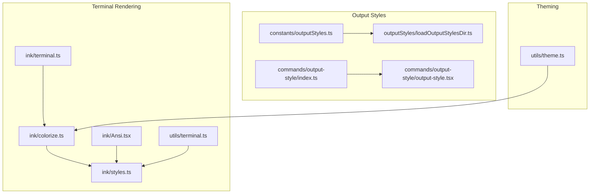
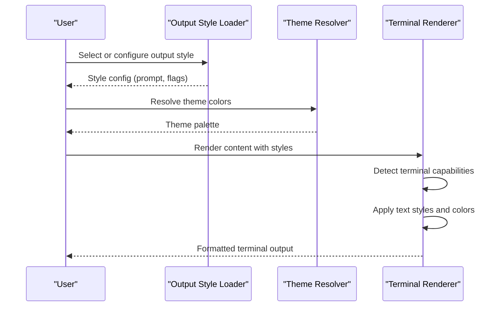
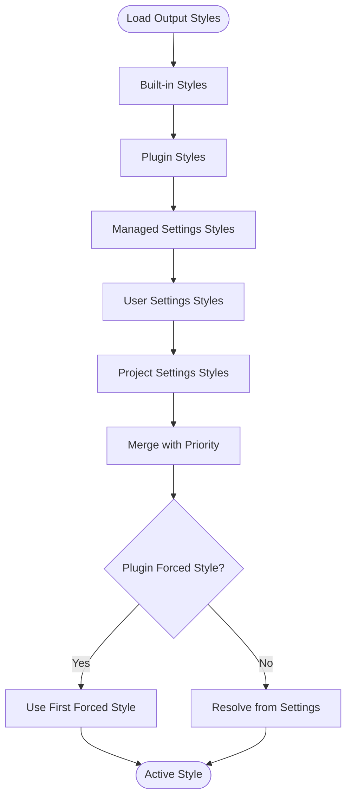
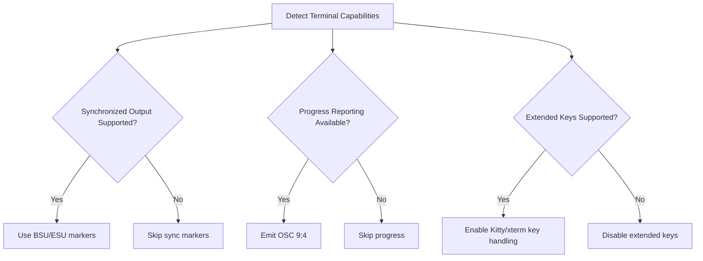
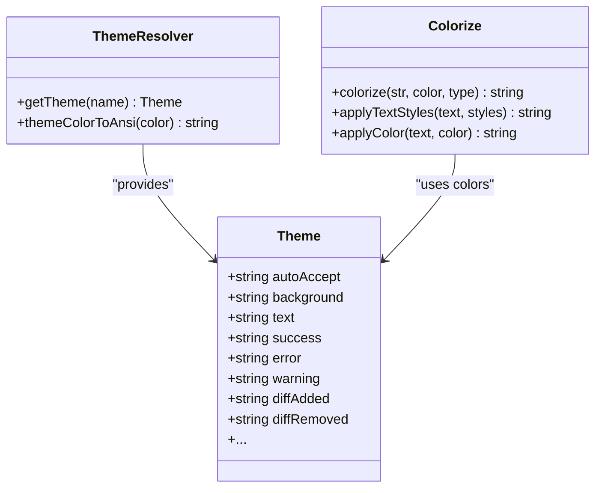
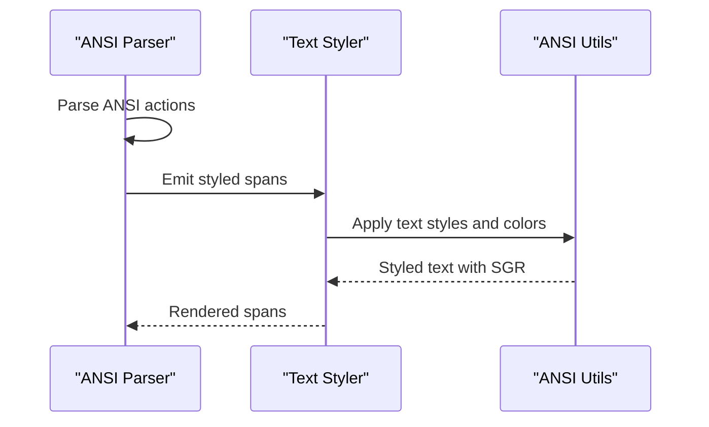
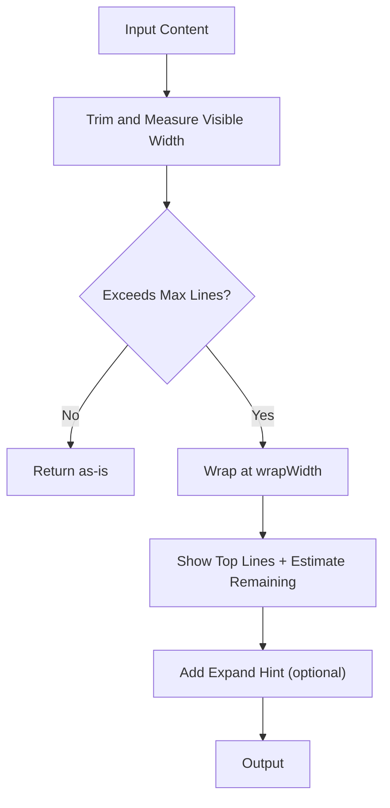
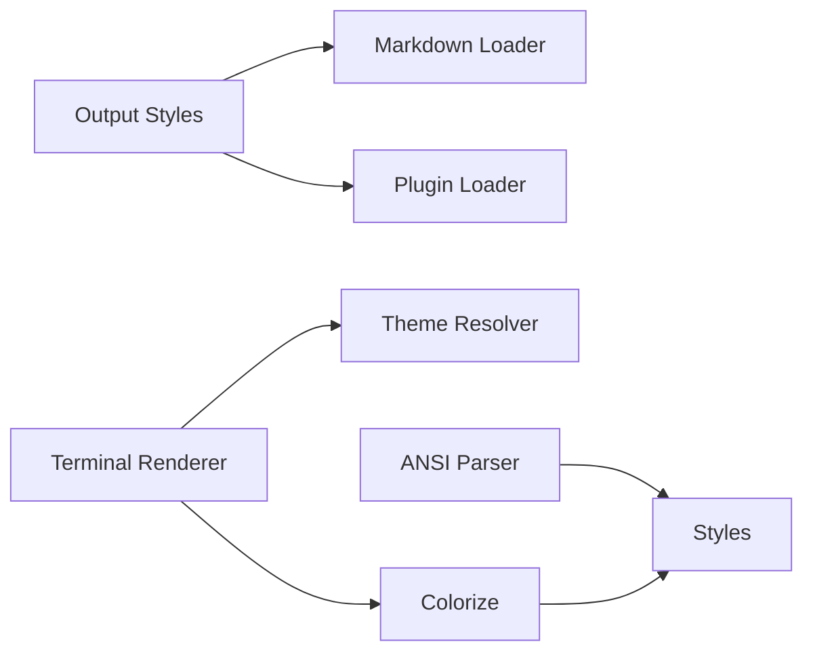

# Terminal Output Formatting

<cite>
**Referenced Files in This Document**
- [outputStyles.ts](file://claude_code_src/restored-src/src/constants/outputStyles.ts)
- [loadOutputStylesDir.ts](file://claude_code_src/restored-src/src/outputStyles/loadOutputStylesDir.ts)
- [index.ts](file://claude_code_src/restored-src/src/commands/output-style/index.ts)
- [output-style.tsx](file://claude_code_src/restored-src/src/commands/output-style/output-style.tsx)
- [theme.ts](file://claude_code_src/restored-src/src/utils/theme.ts)
- [terminal.ts](file://claude_code_src/restored-src/src/ink/terminal.ts)
- [colorize.ts](file://claude_code_src/restored-src/src/ink/colorize.ts)
- [styles.ts](file://claude_code_src/restored-src/src/ink/styles.ts)
- [Ansi.tsx](file://claude_code_src/restored-src/src/ink/Ansi.tsx)
- [terminal.ts](file://claude_code_src/restored-src/src/utils/terminal.ts)
</cite>

## Table of Contents
1. [Introduction](#introduction)
2. [Project Structure](#project-structure)
3. [Core Components](#core-components)
4. [Architecture Overview](#architecture-overview)
5. [Detailed Component Analysis](#detailed-component-analysis)
6. [Dependency Analysis](#dependency-analysis)
7. [Performance Considerations](#performance-considerations)
8. [Accessibility and Compatibility](#accessibility-and-compatibility)
9. [Troubleshooting Guide](#troubleshooting-guide)
10. [Conclusion](#conclusion)

## Introduction
This document explains the terminal output formatting system in Claude Code Python IDE. It covers how content is styled and rendered in the terminal, including ANSI escape sequences, color formatting, text styling, and terminal-specific features. It also documents the output style architecture, syntax highlighting themes, and how terminal width adaptation is handled. Practical guidance is provided for creating custom output styles, formatting code blocks, building structured diffs, and optimizing rendering performance.

## Project Structure
The terminal formatting system spans several subsystems:
- Output style management and loading
- Theming and color palettes
- Terminal capability detection and rendering
- Text styling and ANSI-aware utilities
- Rendering helpers for terminal width and truncation

**Diagram sources**
- [outputStyles.ts:1-217](file://claude_code_src/restored-src/src/constants/outputStyles.ts#L1-L217)
- [loadOutputStylesDir.ts:1-99](file://claude_code_src/restored-src/src/outputStyles/loadOutputStylesDir.ts#L1-L99)
- [index.ts:1-12](file://claude_code_src/restored-src/src/commands/output-style/index.ts#L1-L12)
- [output-style.tsx:1-7](file://claude_code_src/restored-src/src/commands/output-style/output-style.tsx#L1-L7)
- [theme.ts:1-640](file://claude_code_src/restored-src/src/utils/theme.ts#L1-L640)
- [terminal.ts:1-249](file://claude_code_src/restored-src/src/ink/terminal.ts#L1-L249)
- [colorize.ts:1-232](file://claude_code_src/restored-src/src/ink/colorize.ts#L1-L232)
- [styles.ts:1-772](file://claude_code_src/restored-src/src/ink/styles.ts#L1-L772)
- [Ansi.tsx:1-292](file://claude_code_src/restored-src/src/ink/Ansi.tsx#L1-L292)
- [terminal.ts:1-132](file://claude_code_src/restored-src/src/utils/terminal.ts#L1-L132)

**Section sources**
- [outputStyles.ts:1-217](file://claude_code_src/restored-src/src/constants/outputStyles.ts#L1-L217)
- [loadOutputStylesDir.ts:1-99](file://claude_code_src/restored-src/src/outputStyles/loadOutputStylesDir.ts#L1-L99)
- [theme.ts:1-640](file://claude_code_src/restored-src/src/utils/theme.ts#L1-L640)
- [terminal.ts:1-249](file://claude_code_src/restored-src/src/ink/terminal.ts#L1-L249)
- [colorize.ts:1-232](file://claude_code_src/restored-src/src/ink/colorize.ts#L1-L232)
- [styles.ts:1-772](file://claude_code_src/restored-src/src/ink/styles.ts#L1-L772)
- [Ansi.tsx:1-292](file://claude_code_src/restored-src/src/ink/Ansi.tsx#L1-L292)
- [terminal.ts:1-132](file://claude_code_src/restored-src/src/utils/terminal.ts#L1-L132)

## Core Components
- Output style configuration and loading: manages built-in, plugin, and user-defined output styles, including prompts and flags like keep-coding-instructions.
- Terminal capability detection: identifies supported features like synchronized output and progress reporting to optimize rendering.
- Color and theme system: provides multiple themes (light, dark, ANSI variants, daltonization) and converts theme colors to ANSI sequences.
- Text styling and ANSI-aware utilities: applies structured text styles (bold, italic, underline, colors) and wraps text respecting ANSI escape sequences.
- Rendering helpers: adapt content to terminal width, truncate long outputs, and provide expand hints.

**Section sources**
- [outputStyles.ts:11-217](file://claude_code_src/restored-src/src/constants/outputStyles.ts#L11-L217)
- [loadOutputStylesDir.ts:13-99](file://claude_code_src/restored-src/src/outputStyles/loadOutputStylesDir.ts#L13-L99)
- [terminal.ts:16-118](file://claude_code_src/restored-src/src/ink/terminal.ts#L16-L118)
- [theme.ts:4-640](file://claude_code_src/restored-src/src/utils/theme.ts#L4-L640)
- [colorize.ts:64-232](file://claude_code_src/restored-src/src/ink/colorize.ts#L64-L232)
- [styles.ts:15-772](file://claude_code_src/restored-src/src/ink/styles.ts#L15-L772)
- [terminal.ts:12-132](file://claude_code_src/restored-src/src/utils/terminal.ts#L12-L132)

## Architecture Overview
The system separates concerns across layers:
- Output style layer: defines and loads styles from multiple sources (built-in, plugin, user/project).
- Theming layer: resolves theme palettes and exposes color utilities for terminal rendering.
- Rendering layer: detects terminal capabilities, applies text styles, and writes optimized output.

**Diagram sources**
- [outputStyles.ts:137-217](file://claude_code_src/restored-src/src/constants/outputStyles.ts#L137-L217)
- [loadOutputStylesDir.ts:26-99](file://claude_code_src/restored-src/src/outputStyles/loadOutputStylesDir.ts#L26-L99)
- [theme.ts:598-640](file://claude_code_src/restored-src/src/utils/theme.ts#L598-L640)
- [terminal.ts:185-249](file://claude_code_src/restored-src/src/ink/terminal.ts#L185-L249)

## Detailed Component Analysis

### Output Style Architecture
- Built-in styles: Explanatory and Learning modes define prompts and flags for educational and collaborative interactions.
- Plugin styles: Loaded dynamically and can force themselves when enabled.
- User/project styles: Loaded from .claude/output-styles directories and merged with priorities (plugin, managed, user, project).
- Resolution: Forced plugin styles take precedence; otherwise settings choose the active style.

**Diagram sources**
- [outputStyles.ts:41-217](file://claude_code_src/restored-src/src/constants/outputStyles.ts#L41-L217)
- [loadOutputStylesDir.ts:26-99](file://claude_code_src/restored-src/src/outputStyles/loadOutputStylesDir.ts#L26-L99)

**Section sources**
- [outputStyles.ts:11-217](file://claude_code_src/restored-src/src/constants/outputStyles.ts#L11-L217)
- [loadOutputStylesDir.ts:13-99](file://claude_code_src/restored-src/src/outputStyles/loadOutputStylesDir.ts#L13-L99)
- [index.ts:1-12](file://claude_code_src/restored-src/src/commands/output-style/index.ts#L1-L12)
- [output-style.tsx:1-7](file://claude_code_src/restored-src/src/commands/output-style/output-style.tsx#L1-L7)

### Terminal Capability Detection and Rendering
- Synchronized output: Uses DEC mode 2026 (BSU/ESU) when supported to reduce flicker during redraws.
- Progress reporting: Supports OSC 9;4 for progress in compatible terminals (excluding Windows Terminal).
- Extended key handling: Recognizes terminals that properly implement Kitty keyboard protocol and xterm modifyOtherKeys.
- Cursor behavior: Accounts for platform-specific quirks (e.g., Windows conhost).

**Diagram sources**
- [terminal.ts:66-183](file://claude_code_src/restored-src/src/ink/terminal.ts#L66-L183)

**Section sources**
- [terminal.ts:16-183](file://claude_code_src/restored-src/src/ink/terminal.ts#L16-L183)

### Color and Theme System
- Themes: Multiple palettes (light, dark, ANSI variants, daltonized) with semantic color names for diffs, backgrounds, and UI elements.
- Theme color to ANSI: Converts theme colors to ANSI sequences using chalk, with special handling for Apple Terminal and tmux environments.
- Color application: Applies foreground/background colors and text styles (bold, italic, underline, strikethrough, inverse) using structured styles.

**Diagram sources**
- [theme.ts:4-640](file://claude_code_src/restored-src/src/utils/theme.ts#L4-L640)
- [colorize.ts:64-232](file://claude_code_src/restored-src/src/ink/colorize.ts#L64-L232)

**Section sources**
- [theme.ts:100-640](file://claude_code_src/restored-src/src/utils/theme.ts#L100-L640)
- [colorize.ts:64-232](file://claude_code_src/restored-src/src/ink/colorize.ts#L64-L232)
- [styles.ts:15-53](file://claude_code_src/restored-src/src/ink/styles.ts#L15-L53)

### Text Styling and ANSI-Aware Utilities
- Structured styles: Define color, background, and text modifiers without embedding raw ANSI.
- ANSI parsing: Parses incoming ANSI strings and converts them to styled components for Ink rendering.
- Wrapping and truncation: Ensures long content respects terminal width and ANSI escape sequences.

**Diagram sources**
- [Ansi.tsx:118-153](file://claude_code_src/restored-src/src/ink/Ansi.tsx#L118-L153)
- [colorize.ts:176-232](file://claude_code_src/restored-src/src/ink/colorize.ts#L176-L232)
- [styles.ts:39-53](file://claude_code_src/restored-src/src/ink/styles.ts#L39-L53)

**Section sources**
- [Ansi.tsx:1-292](file://claude_code_src/restored-src/src/ink/Ansi.tsx#L1-L292)
- [colorize.ts:176-232](file://claude_code_src/restored-src/src/ink/colorize.ts#L176-L232)
- [styles.ts:15-772](file://claude_code_src/restored-src/src/ink/styles.ts#L15-L772)

### Terminal Width Adaptation and Rendering Helpers
- Line wrapping: Splits content at visible width boundaries, preserving ANSI sequences.
- Truncation: Limits visible lines and adds expand hints; estimates remaining lines for very large outputs.
- Expand behavior: Integrates with user hints (e.g., Ctrl+O) to reveal hidden content.

**Diagram sources**
- [terminal.ts:12-132](file://claude_code_src/restored-src/src/utils/terminal.ts#L12-L132)

**Section sources**
- [terminal.ts:12-132](file://claude_code_src/restored-src/src/utils/terminal.ts#L12-L132)

## Dependency Analysis
- Output styles depend on markdown configuration loaders and plugin systems to assemble a unified style registry.
- Terminal rendering depends on theme resolution and chalk for color conversion.
- ANSI parsing and styling are decoupled from terminal capabilities, enabling reuse across contexts.

**Diagram sources**
- [outputStyles.ts:1-10](file://claude_code_src/restored-src/src/constants/outputStyles.ts#L1-L10)
- [loadOutputStylesDir.ts:1-11](file://claude_code_src/restored-src/src/outputStyles/loadOutputStylesDir.ts#L1-L11)
- [terminal.ts:1-10](file://claude_code_src/restored-src/src/ink/terminal.ts#L1-L10)
- [theme.ts:1-2](file://claude_code_src/restored-src/src/utils/theme.ts#L1-L2)
- [colorize.ts:1-2](file://claude_code_src/restored-src/src/ink/colorize.ts#L1-L2)
- [Ansi.tsx:1-6](file://claude_code_src/restored-src/src/ink/Ansi.tsx#L1-L6)
- [styles.ts:1-12](file://claude_code_src/restored-src/src/ink/styles.ts#L1-L12)

**Section sources**
- [outputStyles.ts:1-10](file://claude_code_src/restored-src/src/constants/outputStyles.ts#L1-L10)
- [loadOutputStylesDir.ts:1-11](file://claude_code_src/restored-src/src/outputStyles/loadOutputStylesDir.ts#L1-L11)
- [terminal.ts:1-10](file://claude_code_src/restored-src/src/ink/terminal.ts#L1-L10)
- [theme.ts:1-2](file://claude_code_src/restored-src/src/utils/theme.ts#L1-L2)
- [colorize.ts:1-2](file://claude_code_src/restored-src/src/ink/colorize.ts#L1-L2)
- [Ansi.tsx:1-6](file://claude_code_src/restored-src/src/ink/Ansi.tsx#L1-L6)
- [styles.ts:1-12](file://claude_code_src/restored-src/src/ink/styles.ts#L1-L12)

## Performance Considerations
- Minimize repeated ANSI parsing: Memoize output style loading and theme resolution to avoid recomputation.
- Limit wrapping scope: Pre-truncate content for extremely large outputs to avoid O(n) wrapping costs.
- Prefer synchronized output: Use DEC 2026 (BSU/ESU) when supported to reduce flicker and improve perceived performance.
- Clamp color depth: Downgrade to 256-color mode under tmux to ensure reliable rendering without sacrificing visual fidelity.

[No sources needed since this section provides general guidance]

## Accessibility and Compatibility
- Screen reader friendliness: Keep content readable by avoiding reliance on color alone; pair colors with textual cues where possible.
- Color-blind friendly themes: Use daltonized themes to improve contrast and distinguishability for color-blind users.
- Terminal compatibility: Detect capabilities and gracefully fall back when advanced features are unavailable (e.g., progress reporting, synchronized output).
- Hyperlinks: Respect terminal hyperlink support when rendering links to improve navigation.

[No sources needed since this section provides general guidance]

## Troubleshooting Guide
- Output style not applying: Verify the style exists in the merged registry and is not overridden by a forced plugin style.
- Colors look wrong in tmux: Confirm tmux terminal-overrides configuration or rely on the automatic 256-color clamp.
- Long outputs lag: Reduce content size or rely on truncation and expand hints to limit rendering overhead.
- ANSI parsing issues: Ensure content is properly formatted and that ANSI sequences are not malformed.

**Section sources**
- [outputStyles.ts:181-217](file://claude_code_src/restored-src/src/constants/outputStyles.ts#L181-L217)
- [loadOutputStylesDir.ts:26-99](file://claude_code_src/restored-src/src/outputStyles/loadOutputStylesDir.ts#L26-L99)
- [colorize.ts:47-62](file://claude_code_src/restored-src/src/ink/colorize.ts#L47-L62)
- [terminal.ts:83-113](file://claude_code_src/restored-src/src/utils/terminal.ts#L83-L113)

## Conclusion
The terminal output formatting system combines configurable output styles, robust theming, and terminal-aware rendering to deliver a consistent, performant, and accessible terminal experience. By leveraging capability detection, structured styling, and ANSI-aware utilities, the system adapts to diverse terminal environments while maintaining readability and usability.