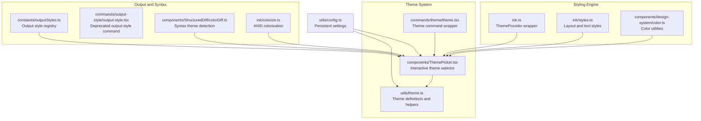
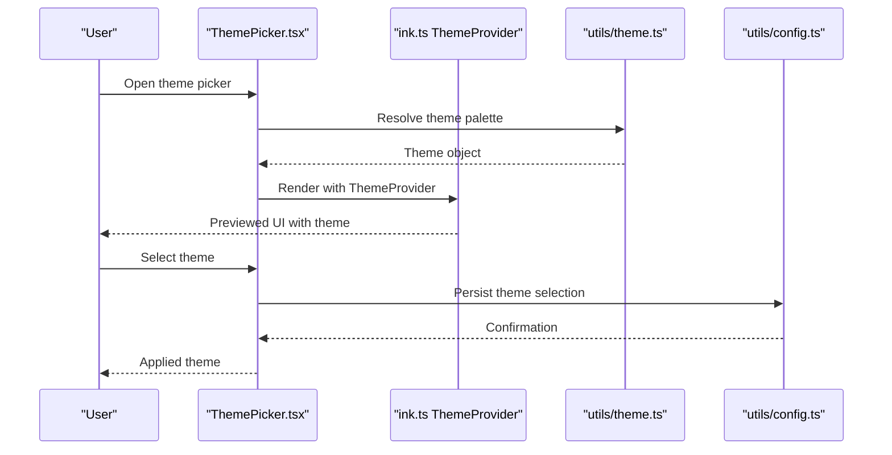
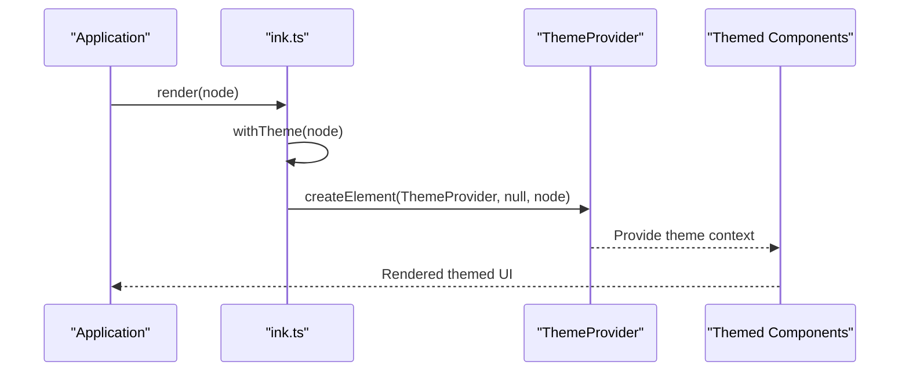
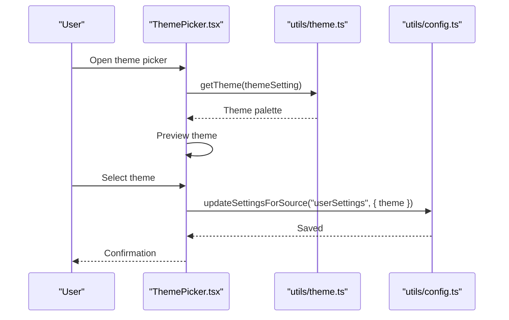
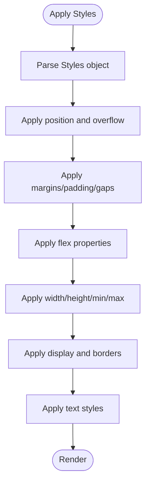
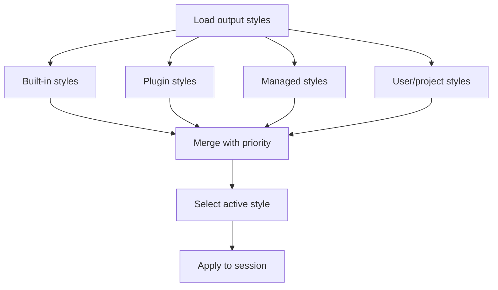
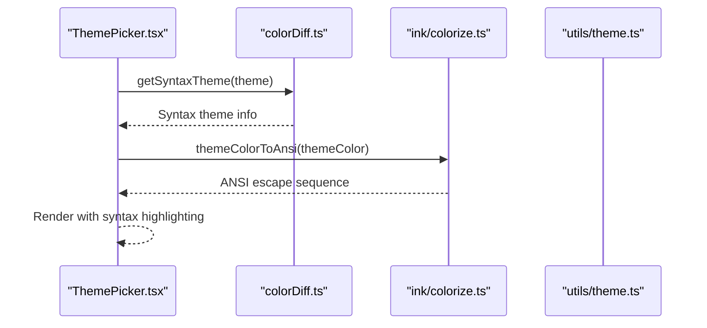
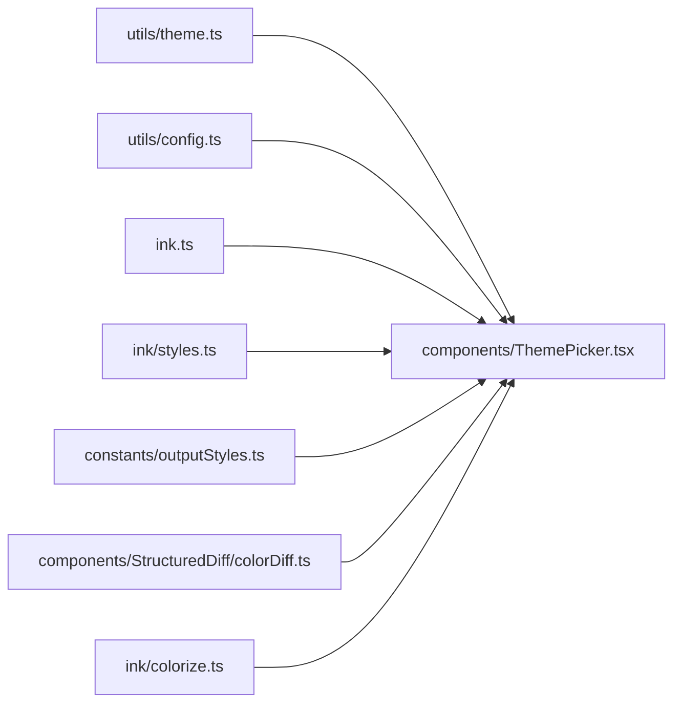

# Theming and Styling System

<cite>
**Referenced Files in This Document**
- [theme.ts](file://claude_code_src/restored-src/src/utils/theme.ts)
- [theme.tsx](file://claude_code_src/restored-src/src/commands/theme/theme.tsx)
- [ThemePicker.tsx](file://claude_code_src/restored-src/src/components/ThemePicker.tsx)
- [styles.ts](file://claude_code_src/restored-src/src/ink/styles.ts)
- [outputStyles.ts](file://claude_code_src/restored-src/src/constants/outputStyles.ts)
- [output-style.tsx](file://claude_code_src/restored-src/src/commands/output-style/output-style.tsx)
- [ink.ts](file://claude_code_src/restored-src/src/ink.ts)
- [config.ts](file://claude_code_src/restored-src/src/utils/config.ts)
- [color.ts](file://claude_code_src/restored-src/src/components/design-system/color.ts)
- [colorDiff.ts](file://claude_code_src/restored-src/src/components/StructuredDiff/colorDiff.ts)
- [colorize.ts](file://claude_code_src/restored-src/src/ink/colorize.ts)
</cite>

## Table of Contents
1. [Introduction](#introduction)
2. [Project Structure](#project-structure)
3. [Core Components](#core-components)
4. [Architecture Overview](#architecture-overview)
5. [Detailed Component Analysis](#detailed-component-analysis)
6. [Dependency Analysis](#dependency-analysis)
7. [Performance Considerations](#performance-considerations)
8. [Troubleshooting Guide](#troubleshooting-guide)
9. [Conclusion](#conclusion)

## Introduction
This document describes the theming and styling system in Claude Code Python IDE. It explains the design system architecture, color schemes, typography, spacing, and component styling. It covers the theme provider implementation, custom styling options, accessibility features, and the output style system for terminal formatting, syntax highlighting themes, and visual customization. Practical examples demonstrate creating custom themes, modifying existing styles, and implementing responsive design patterns. Performance considerations and best practices for theme development are included.

## Project Structure
The theming system spans several modules:
- Theme definition and resolution: centralized in theme utilities
- Theme picker UI and command: interactive selection and preview
- Ink-based styling primitives: layout, text, and box styling
- Output styles: terminal presentation modes and syntax highlighting
- Configuration: persistent theme and output style settings



**Diagram sources**
- [theme.ts:1-640](file://claude_code_src/restored-src/src/utils/theme.ts#L1-L640)
- [ThemePicker.tsx:1-333](file://claude_code_src/restored-src/src/components/ThemePicker.tsx#L1-L333)
- [theme.tsx:1-57](file://claude_code_src/restored-src/src/commands/theme/theme.tsx#L1-L57)
- [ink.ts:1-86](file://claude_code_src/restored-src/src/ink.ts#L1-L86)
- [styles.ts:1-772](file://claude_code_src/restored-src/src/ink/styles.ts#L1-L772)
- [outputStyles.ts:1-217](file://claude_code_src/restored-src/src/constants/outputStyles.ts#L1-L217)
- [output-style.tsx:1-7](file://claude_code_src/restored-src/src/commands/output-style/output-style.tsx#L1-L7)
- [colorDiff.ts](file://claude_code_src/restored-src/src/components/StructuredDiff/colorDiff.ts)
- [colorize.ts](file://claude_code_src/restored-src/src/ink/colorize.ts)

**Section sources**
- [theme.ts:1-640](file://claude_code_src/restored-src/src/utils/theme.ts#L1-L640)
- [ThemePicker.tsx:1-333](file://claude_code_src/restored-src/src/components/ThemePicker.tsx#L1-L333)
- [ink.ts:1-86](file://claude_code_src/restored-src/src/ink.ts#L1-L86)
- [styles.ts:1-772](file://claude_code_src/restored-src/src/ink/styles.ts#L1-L772)
- [outputStyles.ts:1-217](file://claude_code_src/restored-src/src/constants/outputStyles.ts#L1-L217)
- [output-style.tsx:1-7](file://claude_code_src/restored-src/src/commands/output-style/output-style.tsx#L1-L7)
- [config.ts:183-258](file://claude_code_src/restored-src/src/utils/config.ts#L183-L258)

## Core Components
- Theme definitions: A comprehensive palette of semantic and functional colors, with multiple variants (light/dark, ANSI-only, daltonized).
- Theme provider: A React wrapper that injects a theme provider around all renders, enabling themed components.
- Theme picker: An interactive UI to preview and apply themes, with syntax highlighting toggles and live previews.
- Ink styling engine: A declarative style system for layout, spacing, borders, and text attributes.
- Output styles: Built-in and plugin-provided presentation modes with prompts and optional instruction retention.
- Configuration: Persistent storage of theme and output style selections.

**Section sources**
- [theme.ts:4-89](file://claude_code_src/restored-src/src/utils/theme.ts#L4-L89)
- [ink.ts:12-16](file://claude_code_src/restored-src/src/ink.ts#L12-L16)
- [ThemePicker.tsx:113-134](file://claude_code_src/restored-src/src/components/ThemePicker.tsx#L113-L134)
- [styles.ts:39-53](file://claude_code_src/restored-src/src/ink/styles.ts#L39-L53)
- [outputStyles.ts:41-135](file://claude_code_src/restored-src/src/constants/outputStyles.ts#L41-L135)
- [config.ts:197-197](file://claude_code_src/restored-src/src/utils/config.ts#L197-L197)

## Architecture Overview
The theming system integrates theme resolution, UI selection, and terminal rendering:
- Theme resolution selects a concrete palette based on user preference and terminal capabilities.
- The theme picker previews changes and persists selections to configuration.
- Ink’s ThemeProvider wraps all renders to ensure themed components receive the selected theme.
- Output styles define terminal presentation modes and can influence syntax highlighting behavior.



**Diagram sources**
- [ThemePicker.tsx:174-186](file://claude_code_src/restored-src/src/components/ThemePicker.tsx#L174-L186)
- [ink.ts:14-22](file://claude_code_src/restored-src/src/ink.ts#L14-L22)
- [theme.ts:598-613](file://claude_code_src/restored-src/src/utils/theme.ts#L598-L613)
- [config.ts:197-197](file://claude_code_src/restored-src/src/utils/config.ts#L197-L197)

## Detailed Component Analysis

### Theme System and Palette
The theme system defines a rich palette of colors categorized by semantic meaning and functional use:
- Semantic colors: success, error, warning, merged
- Diff colors: added/removed and word-level highlighting
- Agent colors: named hues for subagents
- Special UI colors: selection backgrounds, message actions, rate limit indicators
- Terminal-specific colors: bash border, spinner accents, TUI V2 messaging backgrounds

Palettes are provided in multiple variants:
- Light and dark themes with explicit RGB values
- ANSI-only variants for terminals without true color support
- Daltonized variants for color-blind accessibility

```mermaid
classDiagram
class Theme {
+string autoAccept
+string bashBorder
+string claude
+string claudeShimmer
+string permission
+string planMode
+string ide
+string promptBorder
+string text
+string inverseText
+string inactive
+string subtle
+string suggestion
+string remember
+string background
+string success
+string error
+string warning
+string merged
+string warningShimmer
+string diffAdded
+string diffRemoved
+string diffAddedDimmed
+string diffRemovedDimmed
+string diffAddedWord
+string diffRemovedWord
+string[] red_FOR_SUBAGENTS_ONLY
+string[] blue_FOR_SUBAGENTS_ONLY
+string[] green_FOR_SUBAGENTS_ONLY
+string[] yellow_FOR_SUBAGENTS_ONLY
+string[] purple_FOR_SUBAGENTS_ONLY
+string[] orange_FOR_SUBAGENTS_ONLY
+string[] pink_FOR_SUBAGENTS_ONLY
+string[] cyan_FOR_SUBAGENTS_ONLY
+string professionalBlue
+string chromeYellow
+string clawd_body
+string clawd_background
+string userMessageBackground
+string userMessageBackgroundHover
+string messageActionsBackground
+string selectionBg
+string bashMessageBackgroundColor
+string memoryBackgroundColor
+string rate_limit_fill
+string rate_limit_empty
+string fastMode
+string fastModeShimmer
+string briefLabelYou
+string briefLabelClaude
+string rainbow_red
+string rainbow_orange
+string rainbow_yellow
+string rainbow_green
+string rainbow_blue
+string rainbow_indigo
+string rainbow_violet
+string rainbow_red_shimmer
+string rainbow_orange_shimmer
+string rainbow_yellow_shimmer
+string rainbow_green_shimmer
+string rainbow_blue_shimmer
+string rainbow_indigo_shimmer
+string rainbow_violet_shimmer
}
class ThemeName {
<<enumeration>>
"dark"
"light"
"light-daltonized"
"dark-daltonized"
"light-ansi"
"dark-ansi"
}
ThemeName --> Theme : "resolved by getTheme()"
```

**Diagram sources**
- [theme.ts:4-89](file://claude_code_src/restored-src/src/utils/theme.ts#L4-L89)
- [theme.ts:91-98](file://claude_code_src/restored-src/src/utils/theme.ts#L91-L98)
- [theme.ts:598-613](file://claude_code_src/restored-src/src/utils/theme.ts#L598-L613)

**Section sources**
- [theme.ts:4-89](file://claude_code_src/restored-src/src/utils/theme.ts#L4-L89)
- [theme.ts:91-98](file://claude_code_src/restored-src/src/utils/theme.ts#L91-L98)
- [theme.ts:598-613](file://claude_code_src/restored-src/src/utils/theme.ts#L598-L613)

### Theme Provider and Rendering
The theme provider wraps all renders to ensure themed components receive the selected theme. The render wrapper injects a ThemeProvider around the root node, and createRoot augments render to consistently apply the provider.



**Diagram sources**
- [ink.ts:14-31](file://claude_code_src/restored-src/src/ink.ts#L14-L31)

**Section sources**
- [ink.ts:12-31](file://claude_code_src/restored-src/src/ink.ts#L12-L31)

### Theme Picker and Interactive Selection
The theme picker presents selectable themes, previews changes, and toggles syntax highlighting. It integrates with configuration to persist selections and uses a syntax theme detector for live previews.



**Diagram sources**
- [ThemePicker.tsx:174-186](file://claude_code_src/restored-src/src/components/ThemePicker.tsx#L174-L186)
- [theme.ts:598-613](file://claude_code_src/restored-src/src/utils/theme.ts#L598-L613)
- [config.ts:197-197](file://claude_code_src/restored-src/src/utils/config.ts#L197-L197)

**Section sources**
- [ThemePicker.tsx:113-134](file://claude_code_src/restored-src/src/components/ThemePicker.tsx#L113-L134)
- [ThemePicker.tsx:174-186](file://claude_code_src/restored-src/src/components/ThemePicker.tsx#L174-L186)
- [ThemePicker.tsx:252-252](file://claude_code_src/restored-src/src/components/ThemePicker.tsx#L252-L252)

### Ink Styling Engine
The Ink styling engine provides a structured way to style text and layout without relying on ANSI string transforms. It supports:
- Text styles: color, background color, bold, italic, underline, strikethrough, inverse
- Layout styles: position, margins, padding, gaps, flex properties, dimensions, overflow, borders
- Border styling: per-side visibility, colors, dimming, and text overlays
- Background fill options: opaque fills for overlays



**Diagram sources**
- [styles.ts:406-772](file://claude_code_src/restored-src/src/ink/styles.ts#L406-L772)

**Section sources**
- [styles.ts:39-53](file://claude_code_src/restored-src/src/ink/styles.ts#L39-L53)
- [styles.ts:406-772](file://claude_code_src/restored-src/src/ink/styles.ts#L406-L772)

### Output Style System
Output styles define presentation modes for terminal output. The system includes:
- Built-in modes: default, explanatory, learning
- Plugin-provided modes
- Policy-managed modes
- Automatic application of plugin modes when enabled
- Persistence via settings and retrieval with caching



**Diagram sources**
- [outputStyles.ts:137-175](file://claude_code_src/restored-src/src/constants/outputStyles.ts#L137-L175)
- [outputStyles.ts:181-211](file://claude_code_src/restored-src/src/constants/outputStyles.ts#L181-L211)

**Section sources**
- [outputStyles.ts:41-135](file://claude_code_src/restored-src/src/constants/outputStyles.ts#L41-L135)
- [outputStyles.ts:137-175](file://claude_code_src/restored-src/src/constants/outputStyles.ts#L137-L175)
- [outputStyles.ts:181-211](file://claude_code_src/restored-src/src/constants/outputStyles.ts#L181-L211)
- [output-style.tsx:1-7](file://claude_code_src/restored-src/src/commands/output-style/output-style.tsx#L1-L7)

### Syntax Highlighting and Terminal Formatting
Syntax highlighting is integrated into the theme picker and can be toggled. The system detects available syntax themes and provides colorization for terminal output. ANSI colorization is handled with environment-aware color depth.



**Diagram sources**
- [ThemePicker.tsx:59-67](file://claude_code_src/restored-src/src/components/ThemePicker.tsx#L59-L67)
- [colorDiff.ts](file://claude_code_src/restored-src/src/components/StructuredDiff/colorDiff.ts)
- [colorize.ts](file://claude_code_src/restored-src/src/ink/colorize.ts)
- [theme.ts:626-640](file://claude_code_src/restored-src/src/utils/theme.ts#L626-L640)

**Section sources**
- [ThemePicker.tsx:59-67](file://claude_code_src/restored-src/src/components/ThemePicker.tsx#L59-L67)
- [ThemePicker.tsx:252-252](file://claude_code_src/restored-src/src/components/ThemePicker.tsx#L252-L252)
- [colorDiff.ts](file://claude_code_src/restored-src/src/components/StructuredDiff/colorDiff.ts)
- [colorize.ts](file://claude_code_src/restored-src/src/ink/colorize.ts)
- [theme.ts:615-640](file://claude_code_src/restored-src/src/utils/theme.ts#L615-L640)

### Accessibility Features
The system includes color-blind-friendly palettes and ANSI-only variants for terminals without true color support:
- Daltonized themes adjust color saturation and hue for readability
- ANSI-only themes constrain colors to the 16-standard palette
- Selection backgrounds and contrast-aware colors improve readability

**Section sources**
- [theme.ts:355-434](file://claude_code_src/restored-src/src/utils/theme.ts#L355-L434)
- [theme.ts:193-272](file://claude_code_src/restored-src/src/utils/theme.ts#L193-L272)

### Practical Examples

#### Creating a Custom Theme
- Define a new theme variant by extending the palette in theme utilities with explicit RGB values or ANSI references.
- Add a new ThemeName option and a case in the theme resolution function.
- Integrate the new variant into the theme picker options.

**Section sources**
- [theme.ts:91-98](file://claude_code_src/restored-src/src/utils/theme.ts#L91-L98)
- [theme.ts:598-613](file://claude_code_src/restored-src/src/utils/theme.ts#L598-L613)
- [ThemePicker.tsx:113-134](file://claude_code_src/restored-src/src/components/ThemePicker.tsx#L113-L134)

#### Modifying Existing Styles
- Update semantic or functional colors in the theme palette.
- Use Ink styles to adjust layout, spacing, and borders for components.
- Persist changes via configuration updates.

**Section sources**
- [styles.ts:55-404](file://claude_code_src/restored-src/src/ink/styles.ts#L55-L404)
- [config.ts:197-197](file://claude_code_src/restored-src/src/utils/config.ts#L197-L197)

#### Implementing Responsive Design Patterns
- Use Ink’s flex and gap properties to adapt layouts to terminal width.
- Apply percentage-based dimensions and responsive breakpoints via terminal size hooks.
- Use overflow and scroll behavior to manage content density.

**Section sources**
- [styles.ts:514-628](file://claude_code_src/restored-src/src/ink/styles.ts#L514-L628)
- [styles.ts:630-682](file://claude_code_src/restored-src/src/ink/styles.ts#L630-L682)
- [styles.ts:434-452](file://claude_code_src/restored-src/src/ink/styles.ts#L434-L452)

## Dependency Analysis
The theming system exhibits clear separation of concerns:
- Theme utilities depend on environment detection for color depth.
- Theme picker depends on theme utilities and configuration.
- Ink styling engine is independent and reusable across components.
- Output styles depend on configuration and plugin loading.



**Diagram sources**
- [theme.ts:1-640](file://claude_code_src/restored-src/src/utils/theme.ts#L1-L640)
- [ThemePicker.tsx:1-333](file://claude_code_src/restored-src/src/components/ThemePicker.tsx#L1-L333)
- [ink.ts:1-86](file://claude_code_src/restored-src/src/ink.ts#L1-L86)
- [styles.ts:1-772](file://claude_code_src/restored-src/src/ink/styles.ts#L1-L772)
- [outputStyles.ts:1-217](file://claude_code_src/restored-src/src/constants/outputStyles.ts#L1-L217)
- [colorDiff.ts](file://claude_code_src/restored-src/src/components/StructuredDiff/colorDiff.ts)
- [colorize.ts](file://claude_code_src/restored-src/src/ink/colorize.ts)

**Section sources**
- [theme.ts:1-640](file://claude_code_src/restored-src/src/utils/theme.ts#L1-L640)
- [ThemePicker.tsx:1-333](file://claude_code_src/restored-src/src/components/ThemePicker.tsx#L1-L333)
- [ink.ts:1-86](file://claude_code_src/restored-src/src/ink.ts#L1-L86)
- [styles.ts:1-772](file://claude_code_src/restored-src/src/ink/styles.ts#L1-L772)
- [outputStyles.ts:1-217](file://claude_code_src/restored-src/src/constants/outputStyles.ts#L1-L217)
- [colorDiff.ts](file://claude_code_src/restored-src/src/components/StructuredDiff/colorDiff.ts)
- [colorize.ts](file://claude_code_src/restored-src/src/ink/colorize.ts)

## Performance Considerations
- Theme resolution: Use memoization for expensive computations and environment checks.
- Rendering: Minimize re-renders by leveraging stable theme objects and avoiding unnecessary prop updates.
- Styling: Prefer declarative styles to reduce inline string manipulations and escape sequences.
- Output styles: Cache computed style sets and invalidate caches when settings change.
- Syntax highlighting: Defer heavy operations until needed and use environment-aware color depth to avoid unnecessary conversions.

## Troubleshooting Guide
- Theme not applying: Verify the theme provider is wrapping the root node and that the theme setting is persisted in configuration.
- ANSI color issues: Confirm terminal supports true color or switch to ANSI-only theme variants.
- Syntax highlighting disabled: Check environment variables and toggle the syntax highlighting option in the theme picker.
- Output style not changing: Ensure the output style is set via configuration and that the session restarts to apply changes.

**Section sources**
- [ThemePicker.tsx:196-202](file://claude_code_src/restored-src/src/components/ThemePicker.tsx#L196-L202)
- [ThemePicker.tsx:252-252](file://claude_code_src/restored-src/src/components/ThemePicker.tsx#L252-L252)
- [output-style.tsx:1-7](file://claude_code_src/restored-src/src/commands/output-style/output-style.tsx#L1-L7)
- [config.ts:197-197](file://claude_code_src/restored-src/src/utils/config.ts#L197-L197)

## Conclusion
Claude Code’s theming and styling system combines a robust theme palette, an interactive theme picker, and a flexible Ink-based styling engine. It supports accessibility through daltonized and ANSI-only themes, integrates syntax highlighting, and manages terminal output presentation via configurable output styles. The architecture emphasizes modularity, performance, and user control, enabling both quick adjustments and deep customization.