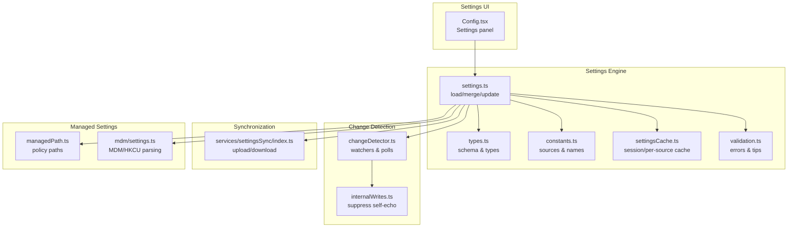
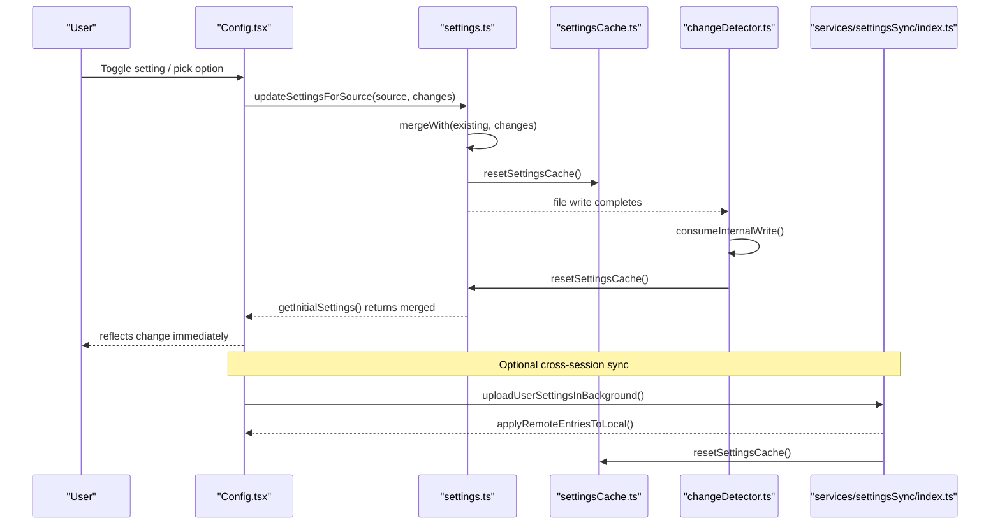
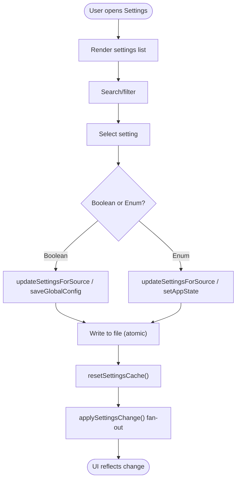
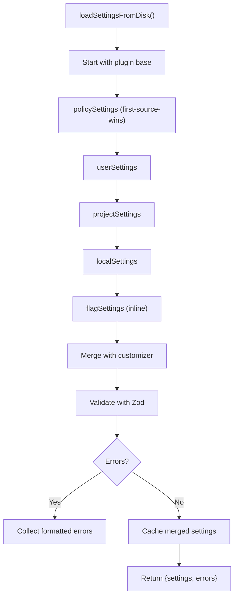
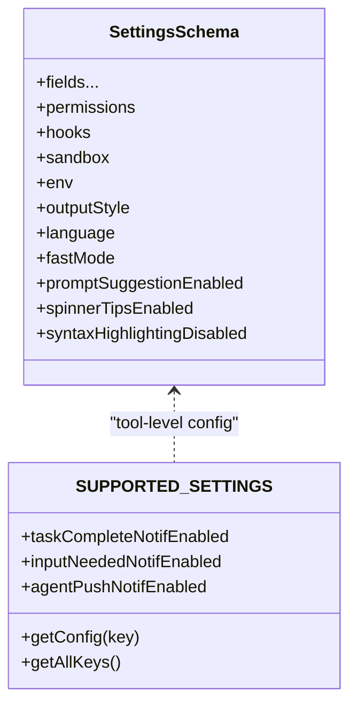
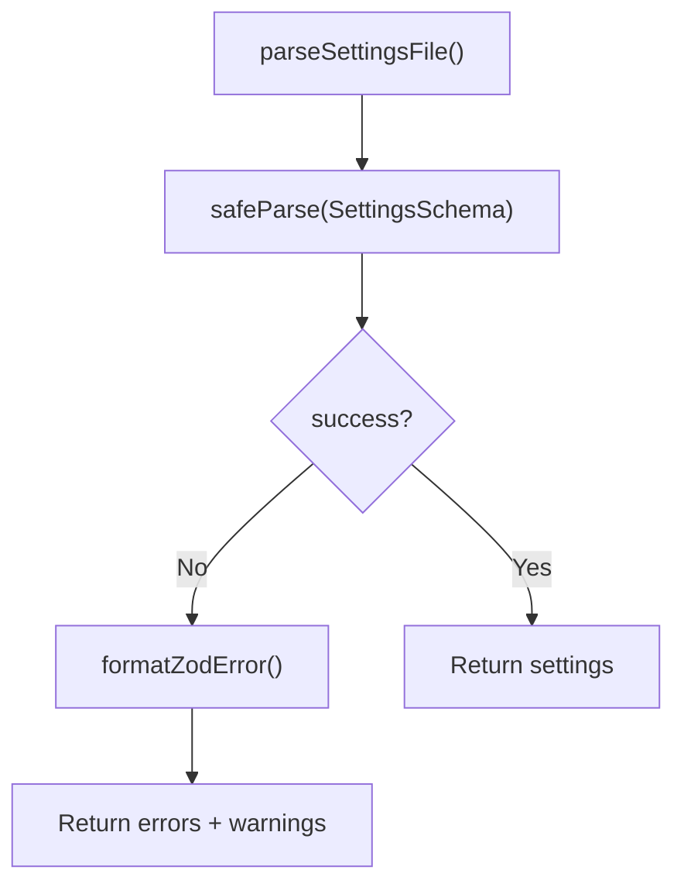
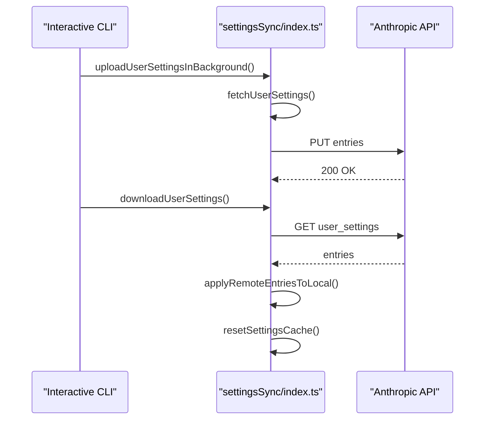
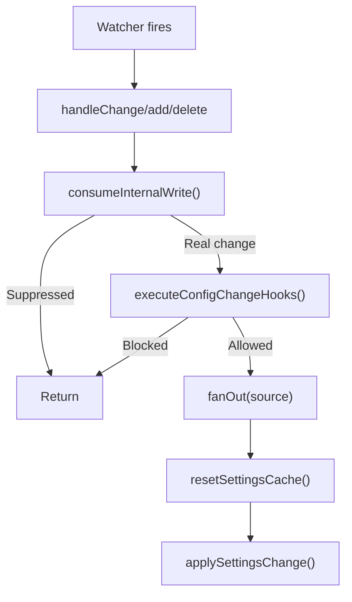
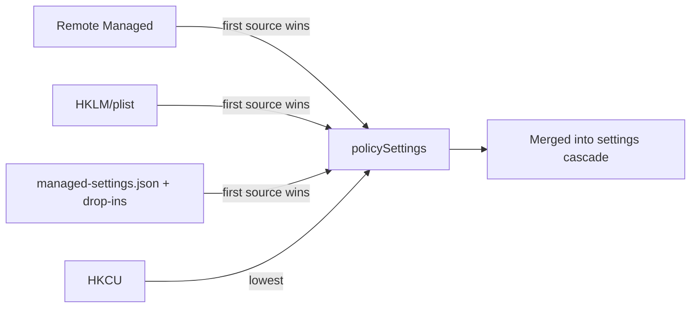
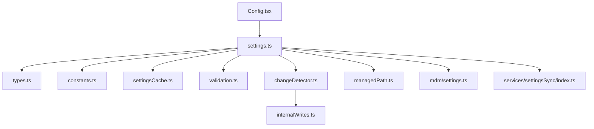

# User Preferences and Personalization

<cite>
**Referenced Files in This Document**
- [Config.tsx](file://claude_code_src/restored-src/src/components/Settings/Config.tsx)
- [settings.ts](file://claude_code_src/restored-src/src/utils/settings/settings.ts)
- [types.ts](file://claude_code_src/restored-src/src/utils/settings/types.ts)
- [constants.ts](file://claude_code_src/restored-src/src/utils/settings/constants.ts)
- [settingsCache.ts](file://claude_code_src/restored-src/src/utils/settings/settingsCache.ts)
- [validation.ts](file://claude_code_src/restored-src/src/utils/settings/validation.ts)
- [applySettingsChange.ts](file://claude_code_src/restored-src/src/utils/settings/applySettingsChange.ts)
- [changeDetector.ts](file://claude_code_src/restored-src/src/utils/settings/changeDetector.ts)
- [internalWrites.ts](file://claude_code_src/restored-src/src/utils/settings/internalWrites.ts)
- [managedPath.ts](file://claude_code_src/restored-src/src/utils/settings/managedPath.ts)
- [mdm/settings.ts](file://claude_code_src/restored-src/src/utils/settings/mdm/settings.ts)
- [index.ts](file://claude_code_src/restored-src/src/services/settingsSync/index.ts)
- [supportedSettings.ts](file://claude_code_src/restored-src/src/tools/ConfigTool/supportedSettings.ts)
- [pluginOnlyPolicy.ts](file://claude_code_src/restored-src/src/utils/settings/pluginOnlyPolicy.ts)
- [growthbook.ts](file://claude_code_src/restored-src/src/services/analytics/growthbook.ts)
</cite>

## Table of Contents
1. [Introduction](#introduction)
2. [Project Structure](#project-structure)
3. [Core Components](#core-components)
4. [Architecture Overview](#architecture-overview)
5. [Detailed Component Analysis](#detailed-component-analysis)
6. [Dependency Analysis](#dependency-analysis)
7. [Performance Considerations](#performance-considerations)
8. [Troubleshooting Guide](#troubleshooting-guide)
9. [Conclusion](#conclusion)
10. [Appendices](#appendices)

## Introduction
This document explains the user preferences and personalization system in Claude Code Python IDE. It covers how preferences are modeled, persisted, synchronized, and applied across sessions. It documents the settings UI, validation and persistence mechanisms, cross-session synchronization, and best practices for extending the system with custom preference categories.

## Project Structure
The preferences system spans several layers:
- Settings UI: a terminal-based settings panel that exposes toggles and pickers for user-configurable behavior.
- Settings engine: loads, merges, validates, and persists settings from multiple sources.
- Change detection: watches for file changes and MDM updates to apply changes reactively.
- Synchronization service: uploads and downloads user settings and memory across environments.
- Managed settings: enterprise-grade policy enforcement via OS-level MDM and managed files.

**Diagram sources**
- [Config.tsx:1-1822](file://claude_code_src/restored-src/src/components/Settings/Config.tsx#L1-L1822)
- [settings.ts:1-1016](file://claude_code_src/restored-src/src/utils/settings/settings.ts#L1-L1016)
- [types.ts:1-1149](file://claude_code_src/restored-src/src/utils/settings/types.ts#L1-L1149)
- [constants.ts:1-203](file://claude_code_src/restored-src/src/utils/settings/constants.ts#L1-L203)
- [settingsCache.ts:1-81](file://claude_code_src/restored-src/src/utils/settings/settingsCache.ts#L1-L81)
- [validation.ts:1-266](file://claude_code_src/restored-src/src/utils/settings/validation.ts#L1-L266)
- [changeDetector.ts:1-489](file://claude_code_src/restored-src/src/utils/settings/changeDetector.ts#L1-L489)
- [internalWrites.ts:1-38](file://claude_code_src/restored-src/src/utils/settings/internalWrites.ts#L1-L38)
- [managedPath.ts:1-35](file://claude_code_src/restored-src/src/utils/settings/managedPath.ts#L1-L35)
- [mdm/settings.ts:1-317](file://claude_code_src/restored-src/src/utils/settings/mdm/settings.ts#L1-L317)
- [index.ts:1-582](file://claude_code_src/restored-src/src/services/settingsSync/index.ts#L1-L582)

**Section sources**
- [Config.tsx:1-1822](file://claude_code_src/restored-src/src/components/Settings/Config.tsx#L1-L1822)
- [settings.ts:1-1016](file://claude_code_src/restored-src/src/utils/settings/settings.ts#L1-L1016)
- [constants.ts:1-203](file://claude_code_src/restored-src/src/utils/settings/constants.ts#L1-L203)

## Core Components
- Settings sources and priorities: user, project, local, flag, and policy. Policy uses “first source wins” among remote, HKLM/plist, managed-settings.json, and HKCU.
- Settings schema and validation: strict schema with helpful error messages and tips; invalid permission rules are filtered to avoid poisoning entire files.
- Persistence and merging: writes are atomic, cache invalidated, and arrays merged with deduplication.
- Reactive application: watchers and polls trigger a single cache reset and fan-out to listeners.
- Synchronization: selective upload/download of user settings and memory with size limits and internal-write suppression.

**Section sources**
- [constants.ts:1-203](file://claude_code_src/restored-src/src/utils/settings/constants.ts#L1-L203)
- [settings.ts:645-826](file://claude_code_src/restored-src/src/utils/settings/settings.ts#L645-L826)
- [validation.ts:1-266](file://claude_code_src/restored-src/src/utils/settings/validation.ts#L1-L266)
- [applySettingsChange.ts:1-93](file://claude_code_src/restored-src/src/utils/settings/applySettingsChange.ts#L1-L93)
- [index.ts:1-582](file://claude_code_src/restored-src/src/services/settingsSync/index.ts#L1-L582)

## Architecture Overview
The settings architecture integrates UI, persistence, validation, change detection, and synchronization.

**Diagram sources**
- [Config.tsx:263-800](file://claude_code_src/restored-src/src/components/Settings/Config.tsx#L263-L800)
- [settings.ts:416-524](file://claude_code_src/restored-src/src/utils/settings/settings.ts#L416-L524)
- [settingsCache.ts:55-59](file://claude_code_src/restored-src/src/utils/settings/settingsCache.ts#L55-L59)
- [changeDetector.ts:437-440](file://claude_code_src/restored-src/src/utils/settings/changeDetector.ts#L437-L440)
- [index.ts:60-111](file://claude_code_src/restored-src/src/services/settingsSync/index.ts#L60-L111)

## Detailed Component Analysis

### Settings UI and Preference Categories
The settings panel organizes preferences into categories and exposes controls for:
- Global behavior: auto-compact, verbose output, terminal progress bar, turn duration, file checkpointing, editor mode, notification channel, etc.
- Permission defaults and plan behavior: default permission mode, auto mode during plan, and related toggles.
- Personalization: tips visibility, reduced motion, output style, language, default view, etc.
- Feature flags and experiments: fast mode, prompt suggestions, speculation, etc.

Each setting item declares an id, label, value, type, and onChange handler. The onChange path updates either AppState (for immediate UI effects) or persists to settings files via updateSettingsForSource.

**Diagram sources**
- [Config.tsx:263-800](file://claude_code_src/restored-src/src/components/Settings/Config.tsx#L263-L800)
- [settings.ts:416-524](file://claude_code_src/restored-src/src/utils/settings/settings.ts#L416-L524)
- [applySettingsChange.ts:33-92](file://claude_code_src/restored-src/src/utils/settings/applySettingsChange.ts#L33-L92)

**Section sources**
- [Config.tsx:263-800](file://claude_code_src/restored-src/src/components/Settings/Config.tsx#L263-L800)
- [Config.tsx:1404-1680](file://claude_code_src/restored-src/src/components/Settings/Config.tsx#L1404-L1680)

### Settings Engine: Loading, Merging, and Persistence
- Sources and paths: user (global), project, local (gitignored), flag, and policy. Paths are resolved per-platform and per-source.
- Load order: plugin base layer (lowest), then policy (first-source-wins), then user, project, local, flag.
- Merging: arrays are concatenated and deduplicated; nested objects merged recursively; undefined deletes keys.
- Validation: strict schema with helpful error messages; invalid permission rules filtered to avoid total rejection.
- Persistence: atomic writes with flush; caches invalidated; gitignore rules added for local settings.

**Diagram sources**
- [settings.ts:645-796](file://claude_code_src/restored-src/src/utils/settings/settings.ts#L645-L796)
- [validation.ts:97-173](file://claude_code_src/restored-src/src/utils/settings/validation.ts#L97-L173)
- [settings.ts:538-547](file://claude_code_src/restored-src/src/utils/settings/settings.ts#L538-L547)

**Section sources**
- [settings.ts:239-307](file://claude_code_src/restored-src/src/utils/settings/settings.ts#L239-L307)
- [settings.ts:416-524](file://claude_code_src/restored-src/src/utils/settings/settings.ts#L416-L524)
- [settings.ts:645-796](file://claude_code_src/restored-src/src/utils/settings/settings.ts#L645-L796)
- [validation.ts:175-217](file://claude_code_src/restored-src/src/utils/settings/validation.ts#L175-L217)

### Settings Schema and Supported Settings
- The SettingsSchema defines the canonical structure for preferences, including permissions, MCP server allowlists/denylists, hooks, sandbox, environment variables, and UI/personalization fields.
- The ConfigTool maintains a separate SUPPORTED_SETTINGS registry for tool-level configuration, including mobile push notifications and other features gated by feature flags.

**Diagram sources**
- [types.ts:255-800](file://claude_code_src/restored-src/src/utils/settings/types.ts#L255-L800)
- [supportedSettings.ts:161-211](file://claude_code_src/restored-src/src/tools/ConfigTool/supportedSettings.ts#L161-L211)

**Section sources**
- [types.ts:255-800](file://claude_code_src/restored-src/src/utils/settings/types.ts#L255-L800)
- [supportedSettings.ts:161-211](file://claude_code_src/restored-src/src/tools/ConfigTool/supportedSettings.ts#L161-L211)

### Preference Validation and Error Handling
- Zod-based validation produces human-readable errors with suggestions and documentation links.
- Invalid permission rules are filtered and warned rather than rejecting the entire file.
- Validation tips guide users to fix common mistakes.

**Diagram sources**
- [validation.ts:97-173](file://claude_code_src/restored-src/src/utils/settings/validation.ts#L97-L173)
- [validation.ts:224-265](file://claude_code_src/restored-src/src/utils/settings/validation.ts#L224-L265)

**Section sources**
- [validation.ts:97-173](file://claude_code_src/restored-src/src/utils/settings/validation.ts#L97-L173)
- [validation.ts:224-265](file://claude_code_src/restored-src/src/utils/settings/validation.ts#L224-L265)

### Cross-Session Synchronization
- Upload: background upload of user settings and memory when interactive and OAuth is available.
- Download: CCR mode fetches and applies remote settings before plugin operations.
- Size limits and internal-write suppression prevent noisy change detection.
- Memory caches are cleared after applying remote entries.

**Diagram sources**
- [index.ts:60-111](file://claude_code_src/restored-src/src/services/settingsSync/index.ts#L60-L111)
- [index.ts:129-202](file://claude_code_src/restored-src/src/services/settingsSync/index.ts#L129-L202)
- [index.ts:488-582](file://claude_code_src/restored-src/src/services/settingsSync/index.ts#L488-L582)

**Section sources**
- [index.ts:509-536](file://claude_code_src/restored-src/src/services/settingsSync/index.ts#L509-L536)
- [index.ts:418-478](file://claude_code_src/restored-src/src/services/settingsSync/index.ts#L418-L478)

### Change Detection and Reactive Application
- File watching: chokidar monitors settings directories and managed-settings.d; ignores non-settings files and special device nodes.
- Stability and grace windows: waits for writes to finish and absorbs delete-and-recreate patterns.
- MDM polling: every 30 minutes, polls registry/plist for changes; snapshots compare to detect differences.
- Internal write suppression: marks in-process writes to avoid self-echo from watchers.
- Fan-out: single cache reset followed by emitting to all subscribers.

**Diagram sources**
- [changeDetector.ts:268-302](file://claude_code_src/restored-src/src/utils/settings/changeDetector.ts#L268-L302)
- [changeDetector.ts:330-360](file://claude_code_src/restored-src/src/utils/settings/changeDetector.ts#L330-L360)
- [changeDetector.ts:437-440](file://claude_code_src/restored-src/src/utils/settings/changeDetector.ts#L437-L440)
- [internalWrites.ts:26-33](file://claude_code_src/restored-src/src/utils/settings/internalWrites.ts#L26-L33)
- [applySettingsChange.ts:33-92](file://claude_code_src/restored-src/src/utils/settings/applySettingsChange.ts#L33-L92)

**Section sources**
- [changeDetector.ts:84-146](file://claude_code_src/restored-src/src/utils/settings/changeDetector.ts#L84-L146)
- [changeDetector.ts:381-418](file://claude_code_src/restored-src/src/utils/settings/changeDetector.ts#L381-L418)
- [internalWrites.ts:17-33](file://claude_code_src/restored-src/src/utils/settings/internalWrites.ts#L17-L33)

### Managed Settings and Enterprise Policy
- Policy sources: remote managed settings, HKLM/plist (admin), managed-settings.json + drop-ins, HKCU (lowest).
- First-source-wins: the first source with content supplies all policy settings.
- MDM parsing: platform-specific subprocess reads; HKCU on Windows; managed-settings.d drop-ins; file-based managed-settings.json.
- Strict customization policy: admin can restrict customization surfaces to plugin-only.

**Diagram sources**
- [mdm/settings.ts:114-134](file://claude_code_src/restored-src/src/utils/settings/mdm/settings.ts#L114-L134)
- [mdm/settings.ts:228-273](file://claude_code_src/restored-src/src/utils/settings/mdm/settings.ts#L228-L273)
- [settings.ts:674-739](file://claude_code_src/restored-src/src/utils/settings/settings.ts#L674-L739)
- [pluginOnlyPolicy.ts:1-27](file://claude_code_src/restored-src/src/utils/settings/pluginOnlyPolicy.ts#L1-L27)

**Section sources**
- [mdm/settings.ts:114-134](file://claude_code_src/restored-src/src/utils/settings/mdm/settings.ts#L114-L134)
- [mdm/settings.ts:228-273](file://claude_code_src/restored-src/src/utils/settings/mdm/settings.ts#L228-L273)
- [pluginOnlyPolicy.ts:1-27](file://claude_code_src/restored-src/src/utils/settings/pluginOnlyPolicy.ts#L1-L27)

### Practical Examples

- Configure UI preferences
  - Enable tips and reduced motion: use the settings panel to toggle “Show tips” and “Reduce motion”.
  - Set theme and output style: open the Theme and OutputStyle submenus to choose values.
  - Set default view and language: use the “What you see by default” and “Language” pickers.

- Manage permission defaults
  - Adjust default permission mode and plan behavior: use the “Default permission mode” and “Use auto mode during plan” settings.

- Workspace customization
  - Respect .gitignore in file picker: toggle “Respect .gitignore in file picker”.
  - Project-local settings: edit .claude/settings.local.json; it is gitignored and merges with project settings.

- Implement custom preference categories
  - Extend SettingsSchema with new optional fields; ensure backward compatibility and add tests.
  - Add UI items in the settings panel; use updateSettingsForSource for persistence and setAppState for immediate UI updates.

- Cross-session synchronization
  - Upload settings: run the interactive CLI; settings are uploaded in the background.
  - Download settings: in CCR mode, settings are downloaded before plugin operations; re-download if mid-session changes are needed.

**Section sources**
- [Config.tsx:263-800](file://claude_code_src/restored-src/src/components/Settings/Config.tsx#L263-L800)
- [types.ts:255-800](file://claude_code_src/restored-src/src/utils/settings/types.ts#L255-L800)
- [settings.ts:416-524](file://claude_code_src/restored-src/src/utils/settings/settings.ts#L416-L524)
- [index.ts:60-111](file://claude_code_src/restored-src/src/services/settingsSync/index.ts#L60-L111)

## Dependency Analysis
The settings system exhibits layered dependencies:
- UI depends on settings engine for reading and writing.
- Settings engine depends on schema, constants, cache, validation, and managed settings.
- Change detection depends on file system and MDM subsystems.
- Synchronization depends on authentication and network utilities.

**Diagram sources**
- [Config.tsx:1-1822](file://claude_code_src/restored-src/src/components/Settings/Config.tsx#L1-L1822)
- [settings.ts:1-1016](file://claude_code_src/restored-src/src/utils/settings/settings.ts#L1-L1016)
- [constants.ts:1-203](file://claude_code_src/restored-src/src/utils/settings/constants.ts#L1-L203)
- [settingsCache.ts:1-81](file://claude_code_src/restored-src/src/utils/settings/settingsCache.ts#L1-L81)
- [validation.ts:1-266](file://claude_code_src/restored-src/src/utils/settings/validation.ts#L1-L266)
- [changeDetector.ts:1-489](file://claude_code_src/restored-src/src/utils/settings/changeDetector.ts#L1-L489)
- [internalWrites.ts:1-38](file://claude_code_src/restored-src/src/utils/settings/internalWrites.ts#L1-L38)
- [managedPath.ts:1-35](file://claude_code_src/restored-src/src/utils/settings/managedPath.ts#L1-L35)
- [mdm/settings.ts:1-317](file://claude_code_src/restored-src/src/utils/settings/mdm/settings.ts#L1-L317)
- [index.ts:1-582](file://claude_code_src/restored-src/src/services/settingsSync/index.ts#L1-L582)

**Section sources**
- [settings.ts:645-826](file://claude_code_src/restored-src/src/utils/settings/settings.ts#L645-L826)
- [changeDetector.ts:437-440](file://claude_code_src/restored-src/src/utils/settings/changeDetector.ts#L437-L440)

## Performance Considerations
- Session-level caching: merged settings and per-source caches minimize repeated disk I/O.
- Single cache reset per notification: prevents N-way disk reloads when multiple listeners subscribe.
- Atomic writes and flush: reduce partial-write overhead and ensure durability.
- File watching stability thresholds and grace windows: avoid thrashing on rapid changes.
- MDM polling cadence: reduces OS overhead for registry/plist reads.
- Size limits for sync: protect against oversized settings/memory files.

[No sources needed since this section provides general guidance]

## Troubleshooting Guide
- Settings not applying after change
  - Verify file watcher is initialized and not in remote mode.
  - Check for internal write suppression around recent writes.
  - Confirm change detection emitted and caches reset.

- Validation errors in settings files
  - Review formatted error messages and suggestions.
  - Fix enum values, types, or unrecognized keys.
  - Invalid permission rules are filtered—inspect warnings.

- Synchronization failures
  - Ensure OAuth token with proper scope is available.
  - Check network connectivity and timeouts.
  - Inspect retry logs and error messages.

- Managed settings not taking effect
  - Confirm “first source wins” policy and presence of higher-priority sources.
  - Validate MDM parsing and drop-in directory contents.

**Section sources**
- [changeDetector.ts:84-146](file://claude_code_src/restored-src/src/utils/settings/changeDetector.ts#L84-L146)
- [internalWrites.ts:26-33](file://claude_code_src/restored-src/src/utils/settings/internalWrites.ts#L26-L33)
- [validation.ts:97-173](file://claude_code_src/restored-src/src/utils/settings/validation.ts#L97-L173)
- [index.ts:247-345](file://claude_code_src/restored-src/src/services/settingsSync/index.ts#L247-L345)
- [mdm/settings.ts:228-273](file://claude_code_src/restored-src/src/utils/settings/mdm/settings.ts#L228-L273)

## Conclusion
Claude Code’s preferences system combines a robust schema-driven engine, reactive change detection, and optional cross-session synchronization. It balances user customization with enterprise policy enforcement, ensuring reliable persistence and responsive UI updates.

[No sources needed since this section summarizes without analyzing specific files]

## Appendices

### Appendix A: Preference Sources and Display Names
- userSettings: user-level settings.json
- projectSettings: .claude/settings.json
- localSettings: .claude/settings.local.json (gitignored)
- flagSettings: CLI-provided inline settings
- policySettings: managed-settings.json, drop-ins, HKLM/plist, HKCU

**Section sources**
- [constants.ts:26-121](file://claude_code_src/restored-src/src/utils/settings/constants.ts#L26-L121)

### Appendix B: Backward Compatibility and Schema Evolution
- New optional fields and enum additions are supported.
- Unknown fields are preserved to allow gradual migration.
- Tests validate backward compatibility across versions.

**Section sources**
- [types.ts:210-241](file://claude_code_src/restored-src/src/utils/settings/types.ts#L210-L241)

### Appendix C: GrowthBook Feature Caching
- Remote feature flags are cached to disk and synced to global config for performance and offline availability.

**Section sources**
- [growthbook.ts:396-425](file://claude_code_src/restored-src/src/services/analytics/growthbook.ts#L396-L425)