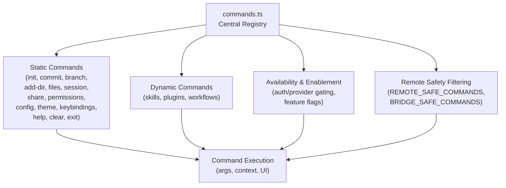
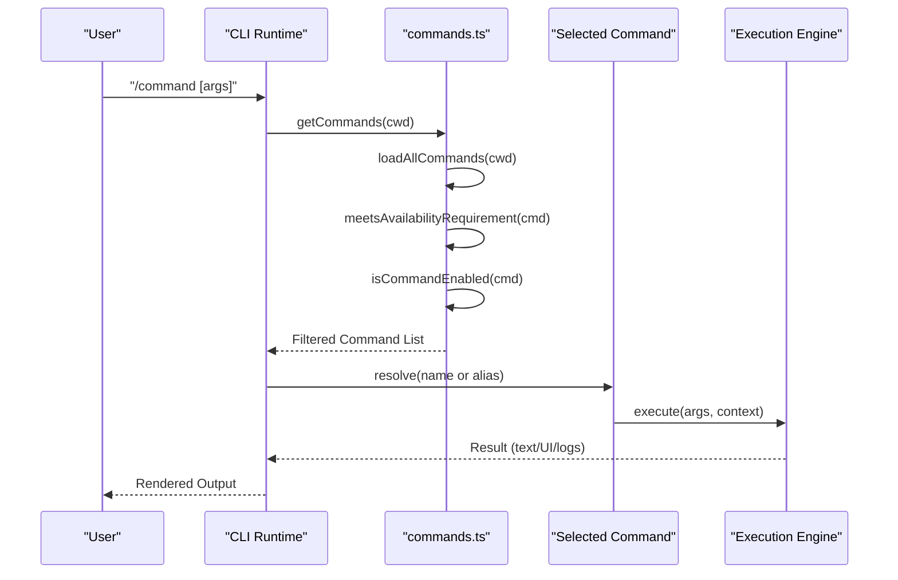
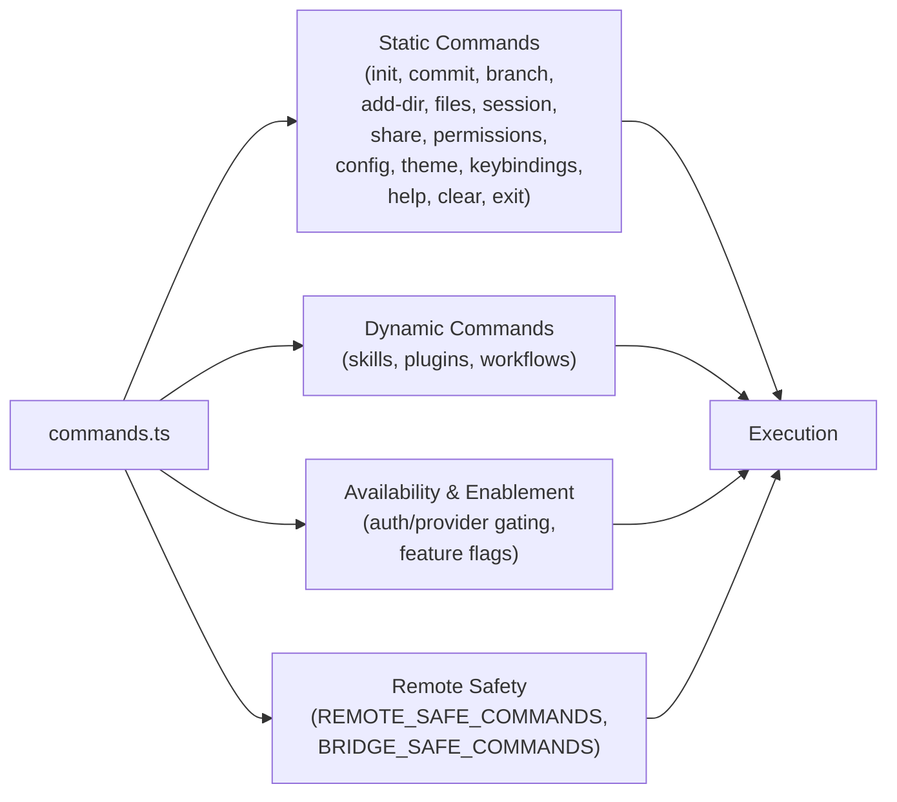

# Built-in Commands

<cite>
**Referenced Files in This Document**
- [commands.ts](file://claude_code_src/restored-src/src/commands.ts)
- [init.ts](file://claude_code_src/restored-src/src/commands/init.ts)
- [commit.ts](file://claude_code_src/restored-src/src/commands/commit.ts)
- [branch/index.ts](file://claude_code_src/restored-src/src/commands/branch/index.ts)
- [add-dir/index.ts](file://claude_code_src/restored-src/src/commands/add-dir/index.ts)
- [files/index.ts](file://claude_code_src/restored-src/src/commands/files/index.ts)
- [session/index.ts](file://claude_code_src/restored-src/src/commands/session/index.ts)
- [share/index.ts](file://claude_code_src/restored-src/src/commands/share/index.ts)
- [permissions/index.ts](file://claude_code_src/restored-src/src/commands/permissions/index.ts)
- [config/index.ts](file://claude_code_src/restored-src/src/commands/config/index.ts)
- [theme/index.ts](file://claude_code_src/restored-src/src/commands/theme/index.ts)
- [keybindings/index.ts](file://claude_code_src/restored-src/src/commands/keybindings/index.ts)
- [help/index.ts](file://claude_code_src/restored-src/src/commands/help/index.ts)
- [clear/index.ts](file://claude_code_src/restored-src/src/commands/clear/index.ts)
- [exit/index.ts](file://claude_code_src/restored-src/src/commands/exit/index.ts)
</cite>

## Table of Contents
1. [Introduction](#introduction)
2. [Project Structure](#project-structure)
3. [Core Components](#core-components)
4. [Architecture Overview](#architecture-overview)
5. [Detailed Component Analysis](#detailed-component-analysis)
6. [Dependency Analysis](#dependency-analysis)
7. [Performance Considerations](#performance-considerations)
8. [Troubleshooting Guide](#troubleshooting-guide)
9. [Conclusion](#conclusion)

## Introduction
This document describes the built-in commands system, focusing on the categories requested: development workflow commands (init, commit, branch), project management commands (add-dir, files, branch), collaboration commands (session, share, permissions), configuration commands (config, theme, keybindings), and utility commands (help, clear, exit). It explains command structure, parameters, usage patterns, and integration with the broader system, and provides practical examples for developers at different skill levels.

## Project Structure
Built-in commands are aggregated and exposed through a central registry that loads, filters, and exposes commands to the runtime. The registry integrates:
- Static command modules under the commands directory
- Dynamic commands from skills, plugins, and workflows
- Availability gating based on authentication and provider requirements
- Remote/bridge safety filtering for remote execution contexts

**Diagram sources**
- [commands.ts:258-346](file://claude_code_src/restored-src/src/commands.ts#L258-L346)
- [commands.ts:417-443](file://claude_code_src/restored-src/src/commands.ts#L417-L443)
- [commands.ts:619-686](file://claude_code_src/restored-src/src/commands.ts#L619-L686)

**Section sources**
- [commands.ts:258-346](file://claude_code_src/restored-src/src/commands.ts#L258-L346)
- [commands.ts:417-443](file://claude_code_src/restored-src/src/commands.ts#L417-L443)
- [commands.ts:619-686](file://claude_code_src/restored-src/src/commands.ts#L619-L686)

## Core Components
- Central registry and loader: aggregates static and dynamic commands, applies availability and enablement checks, and exposes filtered sets for UI and execution.
- Command interface: unified shape enabling prompt-type, local-type, and JSX-rendering commands, with optional aliases and metadata.
- Remote/bridge safety: explicit allowlists for commands that can safely execute remotely or over the bridge.

Key responsibilities:
- Load and deduplicate commands from multiple sources
- Gate commands by provider/auth requirements
- Provide helpers to find, format, and display commands
- Support remote-mode filtering and bridge-safe execution

**Section sources**
- [commands.ts:207-222](file://claude_code_src/restored-src/src/commands.ts#L207-L222)
- [commands.ts:476-517](file://claude_code_src/restored-src/src/commands.ts#L476-L517)
- [commands.ts:619-686](file://claude_code_src/restored-src/src/commands.ts#L619-L686)

## Architecture Overview
The commands system composes:
- Static commands imported from the commands directory
- Dynamic commands from skills, plugins, and workflows
- Availability gating and enablement checks
- Remote/bridge safety filtering

**Diagram sources**
- [commands.ts:449-469](file://claude_code_src/restored-src/src/commands.ts#L449-L469)
- [commands.ts:476-517](file://claude_code_src/restored-src/src/commands.ts#L476-L517)
- [commands.ts:688-719](file://claude_code_src/restored-src/src/commands.ts#L688-L719)

## Detailed Component Analysis

### Development Workflow Commands
- init: Initializes a new project/workspace context for development.
- commit: Commits staged changes with a message and optional metadata.
- branch: Manages branches (create, switch, list, delete) within the project.

Usage patterns:
- Initialize a new project and establish baseline context before development.
- Commit incremental changes with descriptive messages to maintain a clean history.
- Switch between feature branches to isolate work and collaborate effectively.

Common examples:
- Initialize a new repository and configure initial settings.
- Commit staged changes with a concise, meaningful message.
- Create a feature branch, develop changes, and merge back to main.

Integration:
- These commands integrate with the broader system through the central registry and rely on availability gating and enablement checks.

**Section sources**
- [commands.ts:283](file://claude_code_src/restored-src/src/commands.ts#L283)
- [commands.ts:11](file://claude_code_src/restored-src/src/commands.ts#L11)
- [commands.ts:133](file://claude_code_src/restored-src/src/commands.ts#L133)

### Project Management Commands
- add-dir: Adds a directory to the project’s tracked scope.
- files: Lists tracked files in the project.
- branch: Branch management (create, switch, list, delete).

Usage patterns:
- Add directories containing source code or assets to the project scope.
- Enumerate tracked files to audit or troubleshoot indexing issues.
- Manage branches to organize feature work and releases.

Common examples:
- Add a new src directory to include application code.
- List files to confirm inclusion of new files.
- Create and switch to a feature branch for a new feature.

Integration:
- These commands are part of the static command set and participate in the availability and enablement pipeline.

**Section sources**
- [commands.ts:259](file://claude_code_src/restored-src/src/commands.ts#L259)
- [commands.ts:132](file://claude_code_src/restored-src/src/commands.ts#L132)
- [commands.ts:133](file://claude_code_src/restored-src/src/commands.ts#L133)

### Collaboration Commands
- session: Starts or manages a collaborative session, potentially generating a remote access link or QR code.
- share: Shares project context or selections with collaborators.
- permissions: Manages access permissions for collaborators.

Usage patterns:
- Start a session to invite teammates for pair programming or review.
- Share selected files or diffs to align on changes.
- Configure permissions to control who can view or edit project context.

Common examples:
- Launch a session and share the generated link for a quick pairing session.
- Share a specific file or diff with a reviewer.
- Adjust permissions to restrict editing while allowing read access.

Integration:
- Session and share commands are included in remote-safe command sets for remote execution contexts.

**Section sources**
- [commands.ts:41](file://claude_code_src/restored-src/src/commands.ts#L41)
- [commands.ts:42](file://claude_code_src/restored-src/src/commands.ts#L42)
- [commands.ts:126](file://claude_code_src/restored-src/src/commands.ts#L126)
- [commands.ts:619-637](file://claude_code_src/restored-src/src/commands.ts#L619-L637)
- [commands.ts:651-660](file://claude_code_src/restored-src/src/commands.ts#L651-L660)

### Configuration Commands
- config: Manages global or project-specific configuration settings.
- theme: Switches terminal theme for the interface.
- keybindings: Manages keyboard shortcuts for actions.

Usage patterns:
- Adjust configuration to tailor behavior to your workflow.
- Switch themes to improve readability or accessibility.
- Customize keybindings to streamline frequent actions.

Common examples:
- Set a default model or output style via config.
- Choose a dark or light theme for extended coding sessions.
- Bind frequently used actions to convenient key combinations.

Integration:
- These commands are part of the static command set and are generally available for local execution.

**Section sources**
- [commands.ts:16](file://claude_code_src/restored-src/src/commands.ts#L16)
- [commands.ts:57](file://claude_code_src/restored-src/src/commands.ts#L57)
- [commands.ts:27](file://claude_code_src/restored-src/src/commands.ts#L27)

### Utility Commands
- help: Displays available commands and their descriptions.
- clear: Clears the terminal screen or current view.
- exit: Terminates the current session or application.

Usage patterns:
- Use help to discover commands and understand their purpose.
- Clear the screen to reduce visual clutter during long sessions.
- Exit cleanly to close the session or application.

Common examples:
- Open help to browse available commands and their aliases.
- Clear the screen before starting a focused coding session.
- Exit to shut down the application or session.

Integration:
- These commands are included in remote-safe command sets for remote execution contexts.

**Section sources**
- [commands.ts:23](file://claude_code_src/restored-src/src/commands.ts#L23)
- [commands.ts:9](file://claude_code_src/restored-src/src/commands.ts#L9)
- [commands.ts:173](file://claude_code_src/restored-src/src/commands.ts#L173)
- [commands.ts:619-637](file://claude_code_src/restored-src/src/commands.ts#L619-L637)

## Dependency Analysis
The central registry composes commands from multiple sources and applies filtering:

**Diagram sources**
- [commands.ts:258-346](file://claude_code_src/restored-src/src/commands.ts#L258-L346)
- [commands.ts:417-443](file://claude_code_src/restored-src/src/commands.ts#L417-L443)
- [commands.ts:619-686](file://claude_code_src/restored-src/src/commands.ts#L619-L686)

**Section sources**
- [commands.ts:449-469](file://claude_code_src/restored-src/src/commands.ts#L449-L469)
- [commands.ts:476-517](file://claude_code_src/restored-src/src/commands.ts#L476-L517)
- [commands.ts:619-686](file://claude_code_src/restored-src/src/commands.ts#L619-L686)

## Performance Considerations
- Memoization: Command loading and skill discovery are memoized to avoid repeated disk I/O and dynamic imports.
- Asynchronous loading: Dynamic command sources are loaded concurrently to minimize latency.
- Remote filtering: Pre-filtering reduces UI flicker and avoids exposing local-only commands before remote initialization.

Best practices:
- Keep command descriptions concise for faster UI rendering.
- Prefer lazy-loading heavy modules behind feature flags.
- Use remote-safe command allowlists to avoid unnecessary computation in remote contexts.

**Section sources**
- [commands.ts:449-469](file://claude_code_src/restored-src/src/commands.ts#L449-L469)
- [commands.ts:523-539](file://claude_code_src/restored-src/src/commands.ts#L523-L539)
- [commands.ts:684-686](file://claude_code_src/restored-src/src/commands.ts#L684-L686)

## Troubleshooting Guide
- Command not found: The system throws a descriptive error when a command or alias is not available. Use help to discover available commands and their aliases.
- Provider/auth gating: Some commands are hidden or disabled based on provider requirements. Logging in or switching providers may expose additional commands.
- Remote execution issues: Only remote-safe commands are allowed in remote mode. If a command fails remotely, check whether it is included in the remote or bridge safety allowlists.

Common scenarios:
- After logging in, commands gated by provider become available.
- In remote mode, only commands in the remote-safe set execute successfully.
- If a command appears in suggestions but is not executable, verify availability and enablement.

**Section sources**
- [commands.ts:704-719](file://claude_code_src/restored-src/src/commands.ts#L704-L719)
- [commands.ts:417-443](file://claude_code_src/restored-src/src/commands.ts#L417-L443)
- [commands.ts:619-686](file://claude_code_src/restored-src/src/commands.ts#L619-L686)

## Conclusion
The built-in commands system provides a robust, extensible foundation for development workflows, project management, collaboration, configuration, and utilities. By centralizing command loading, applying availability and enablement checks, and enforcing remote safety, the system ensures predictable behavior across local and remote contexts. Developers can leverage these commands to streamline daily tasks, maintain consistent configurations, and collaborate effectively.