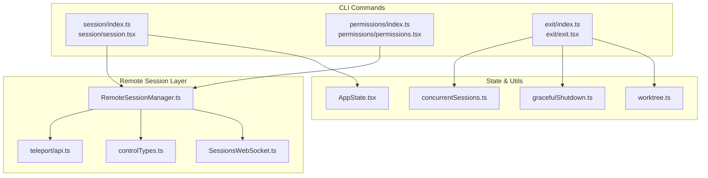
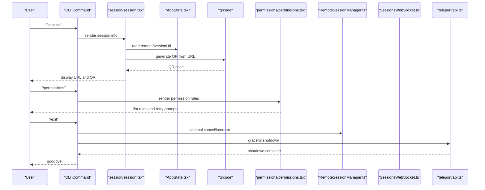
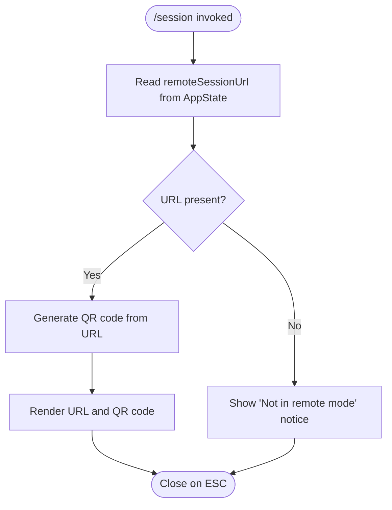
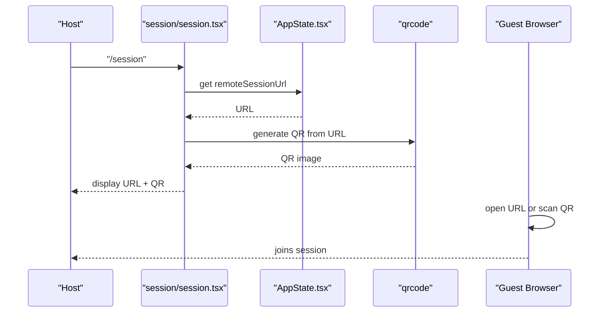
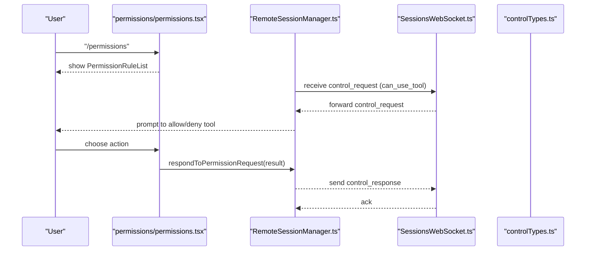
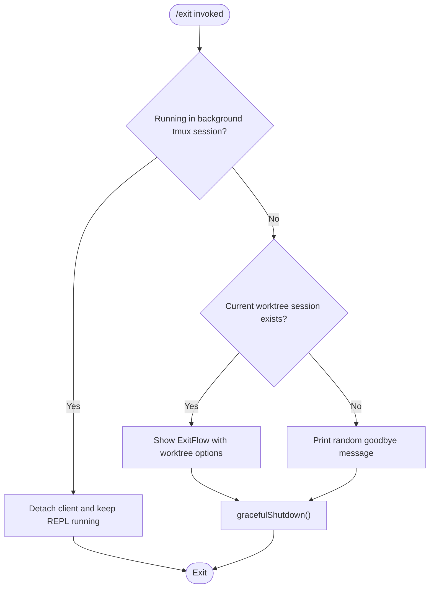
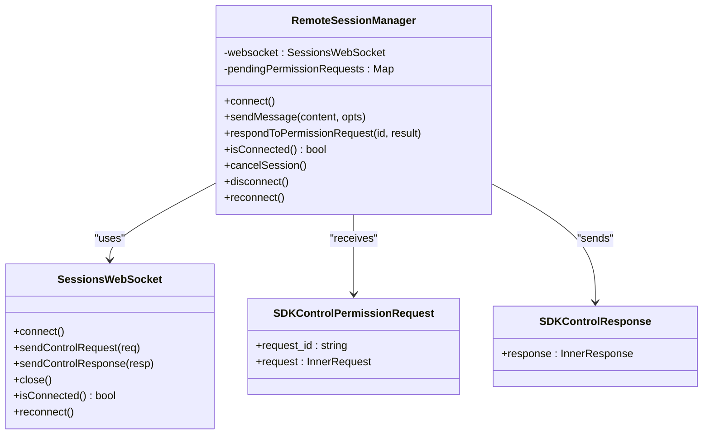
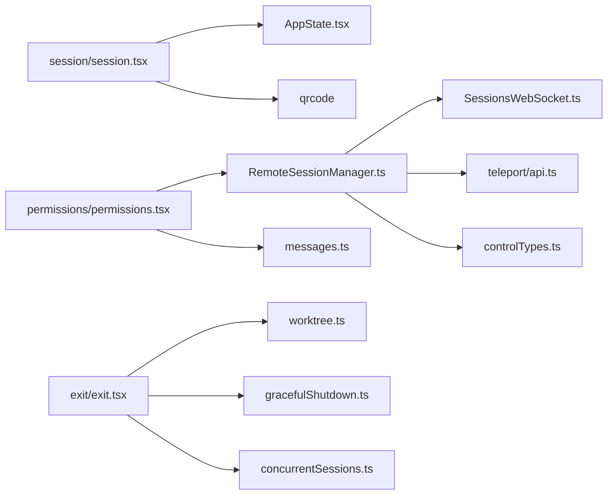

# Collaboration Commands

<cite>
**Referenced Files in This Document**
- [session/index.ts](file://claude_code_src/restored-src/src/commands/session/index.ts)
- [session/session.tsx](file://claude_code_src/restored-src/src/commands/session/session.tsx)
- [permissions/index.ts](file://claude_code_src/restored-src/src/commands/permissions/index.ts)
- [permissions/permissions.tsx](file://claude_code_src/restored-src/src/commands/permissions/permissions.tsx)
- [exit/index.ts](file://claude_code_src/restored-src/src/commands/exit/index.ts)
- [exit/exit.tsx](file://claude_code_src/restored-src/src/commands/exit/exit.tsx)
- [RemoteSessionManager.ts](file://claude_code_src/restored-src/src/remote/RemoteSessionManager.ts)
- [sessionsWebSocket.ts](file://claude_code_src/restored-src/src/remote/SessionsWebSocket.ts)
- [sdk/controlTypes.ts](file://claude_code_src/restored-src/src/entrypoints/sdk/controlTypes.ts)
- [teleport/api.ts](file://claude_code_src/restored-src/src/utils/teleport/api.ts)
- [worktree.ts](file://claude_code_src/restored-src/src/utils/worktree.ts)
- [gracefulShutdown.ts](file://claude_code_src/restored-src/src/utils/gracefulShutdown.ts)
- [concurrentSessions.ts](file://claude_code_src/restored-src/src/utils/concurrentSessions.ts)
- [AppState.tsx](file://claude_code_src/restored-src/src/state/AppState.tsx)
- [messages.ts](file://claude_code_src/restored-src/src/utils/messages.ts)
</cite>

## Table of Contents
1. [Introduction](#introduction)
2. [Project Structure](#project-structure)
3. [Core Components](#core-components)
4. [Architecture Overview](#architecture-overview)
5. [Detailed Component Analysis](#detailed-component-analysis)
6. [Dependency Analysis](#dependency-analysis)
7. [Performance Considerations](#performance-considerations)
8. [Troubleshooting Guide](#troubleshooting-guide)
9. [Conclusion](#conclusion)

## Introduction
This document explains collaboration-focused commands and workflows for managing shared, remote sessions, permission controls, and safe exits. It covers how to create and manage collaborative sessions, share conversations securely, configure permission levels, and properly terminate sessions. It also includes examples of multi-user scenarios, permission escalation, and session recovery procedures, along with the security model and best practices for collaborative development environments.

## Project Structure
The collaboration features are implemented as CLI commands backed by React components and remote session infrastructure:
- Commands: session, permissions, exit
- Remote session manager and WebSocket transport
- State and messaging utilities for secure session lifecycle and permission handling

**Diagram sources**
- [session/index.ts:1-17](file://claude_code_src/restored-src/src/commands/session/index.ts#L1-L17)
- [session/session.tsx:1-140](file://claude_code_src/restored-src/src/commands/session/session.tsx#L1-L140)
- [permissions/index.ts:1-12](file://claude_code_src/restored-src/src/commands/permissions/index.ts#L1-L12)
- [permissions/permissions.tsx:1-10](file://claude_code_src/restored-src/src/commands/permissions/permissions.tsx#L1-L10)
- [exit/index.ts:1-13](file://claude_code_src/restored-src/src/commands/exit/index.ts#L1-L13)
- [exit/exit.tsx:1-33](file://claude_code_src/restored-src/src/commands/exit/exit.tsx#L1-L33)
- [RemoteSessionManager.ts:1-344](file://claude_code_src/restored-src/src/remote/RemoteSessionManager.ts#L1-L344)
- [sessionsWebSocket.ts](file://claude_code_src/restored-src/src/remote/SessionsWebSocket.ts)
- [sdk/controlTypes.ts](file://claude_code_src/restored-src/src/entrypoints/sdk/controlTypes.ts)
- [teleport/api.ts](file://claude_code_src/restored-src/src/utils/teleport/api.ts)
- [worktree.ts](file://claude_code_src/restored-src/src/utils/worktree.ts)
- [gracefulShutdown.ts](file://claude_code_src/restored-src/src/utils/gracefulShutdown.ts)
- [concurrentSessions.ts](file://claude_code_src/restored-src/src/utils/concurrentSessions.ts)
- [AppState.tsx](file://claude_code_src/restored-src/src/state/AppState.tsx)

**Section sources**
- [session/index.ts:1-17](file://claude_code_src/restored-src/src/commands/session/index.ts#L1-L17)
- [permissions/index.ts:1-12](file://claude_code_src/restored-src/src/commands/permissions/index.ts#L1-L12)
- [exit/index.ts:1-13](file://claude_code_src/restored-src/src/commands/exit/index.ts#L1-L13)

## Core Components
- Session command: displays remote session URL and QR code for collaborators to join.
- Permissions command: manages allow/deny tool permission rules and surfaces retry prompts for denied actions.
- Exit command: handles graceful termination, background session detachment, and optional worktree confirmation.

**Section sources**
- [session/session.tsx:1-140](file://claude_code_src/restored-src/src/commands/session/session.tsx#L1-L140)
- [permissions/permissions.tsx:1-10](file://claude_code_src/restored-src/src/commands/permissions/permissions.tsx#L1-L10)
- [exit/exit.tsx:1-33](file://claude_code_src/restored-src/src/commands/exit/exit.tsx#L1-L33)

## Architecture Overview
The collaboration architecture integrates local CLI commands with a remote session manager that communicates over WebSocket and HTTP. Permission requests are surfaced locally for approval or denial, and messages are sent securely to the remote session.

**Diagram sources**
- [session/session.tsx:1-140](file://claude_code_src/restored-src/src/commands/session/session.tsx#L1-L140)
- [AppState.tsx](file://claude_code_src/restored-src/src/state/AppState.tsx)
- [permissions/permissions.tsx:1-10](file://claude_code_src/restored-src/src/commands/permissions/permissions.tsx#L1-L10)
- [RemoteSessionManager.ts:1-344](file://claude_code_src/restored-src/src/remote/RemoteSessionManager.ts#L1-L344)
- [sessionsWebSocket.ts](file://claude_code_src/restored-src/src/remote/SessionsWebSocket.ts)
- [teleport/api.ts](file://claude_code_src/restored-src/src/utils/teleport/api.ts)
- [exit/exit.tsx:1-33](file://claude_code_src/restored-src/src/commands/exit/exit.tsx#L1-L33)

## Detailed Component Analysis

### Session Management
The session command enables remote collaboration by rendering the session URL and a QR code for easy joining. It reads the current remote session URL from application state and generates a QR representation for collaborators.

**Diagram sources**
- [session/session.tsx:1-140](file://claude_code_src/restored-src/src/commands/session/session.tsx#L1-L140)
- [AppState.tsx](file://claude_code_src/restored-src/src/state/AppState.tsx)

**Section sources**
- [session/index.ts:1-17](file://claude_code_src/restored-src/src/commands/session/index.ts#L1-L17)
- [session/session.tsx:1-140](file://claude_code_src/restored-src/src/commands/session/session.tsx#L1-L140)

### Sharing Functionality
Sharing is achieved by displaying the remote session URL and QR code. Collaborators scan the QR or open the URL to join the session. The command is only enabled when remote mode is active.

**Diagram sources**
- [session/session.tsx:1-140](file://claude_code_src/restored-src/src/commands/session/session.tsx#L1-L140)
- [AppState.tsx](file://claude_code_src/restored-src/src/state/AppState.tsx)

**Section sources**
- [session/session.tsx:1-140](file://claude_code_src/restored-src/src/commands/session/session.tsx#L1-L140)

### Permission Controls
The permissions command lists current allow/deny rules and surfaces retry prompts when tools are denied. It integrates with the remote session manager’s permission request flow to approve or deny tool usage.

**Diagram sources**
- [permissions/permissions.tsx:1-10](file://claude_code_src/restored-src/src/commands/permissions/permissions.tsx#L1-L10)
- [RemoteSessionManager.ts:1-344](file://claude_code_src/restored-src/src/remote/RemoteSessionManager.ts#L1-L344)
- [sessionsWebSocket.ts](file://claude_code_src/restored-src/src/remote/SessionsWebSocket.ts)
- [sdk/controlTypes.ts](file://claude_code_src/restored-src/src/entrypoints/sdk/controlTypes.ts)

**Section sources**
- [permissions/index.ts:1-12](file://claude_code_src/restored-src/src/commands/permissions/index.ts#L1-L12)
- [permissions/permissions.tsx:1-10](file://claude_code_src/restored-src/src/commands/permissions/permissions.tsx#L1-L10)
- [RemoteSessionManager.ts:1-344](file://claude_code_src/restored-src/src/remote/RemoteSessionManager.ts#L1-L344)

### Exit Procedures
The exit command supports:
- Graceful shutdown with optional worktree confirmation
- Background session detachment in tmux-backed sessions
- Propagation of cancellation/interrupt signals to the remote session when applicable

**Diagram sources**
- [exit/exit.tsx:1-33](file://claude_code_src/restored-src/src/commands/exit/exit.tsx#L1-L33)
- [worktree.ts](file://claude_code_src/restored-src/src/utils/worktree.ts)
- [gracefulShutdown.ts](file://claude_code_src/restored-src/src/utils/gracefulShutdown.ts)
- [concurrentSessions.ts](file://claude_code_src/restored-src/src/utils/concurrentSessions.ts)

**Section sources**
- [exit/index.ts:1-13](file://claude_code_src/restored-src/src/commands/exit/index.ts#L1-L13)
- [exit/exit.tsx:1-33](file://claude_code_src/restored-src/src/commands/exit/exit.tsx#L1-L33)

### Remote Session Lifecycle and Security Model
Remote sessions are managed via a WebSocket connection with HTTP-based message transport. Control messages handle permission requests and cancellations. The system enforces:
- Permission gating for tool usage
- Controlled cancellation/interrupt signaling
- Secure token-based access and organization scoping
- Optional viewer-only mode for passive observation

**Diagram sources**
- [RemoteSessionManager.ts:1-344](file://claude_code_src/restored-src/src/remote/RemoteSessionManager.ts#L1-L344)
- [sessionsWebSocket.ts](file://claude_code_src/restored-src/src/remote/SessionsWebSocket.ts)
- [sdk/controlTypes.ts](file://claude_code_src/restored-src/src/entrypoints/sdk/controlTypes.ts)

**Section sources**
- [RemoteSessionManager.ts:1-344](file://claude_code_src/restored-src/src/remote/RemoteSessionManager.ts#L1-L344)

## Dependency Analysis
The collaboration commands depend on:
- Application state for session URL retrieval
- Remote session manager for control and messaging
- WebSocket transport for real-time control and permission flows
- Utilities for graceful shutdown, concurrent sessions, and worktree detection

**Diagram sources**
- [session/session.tsx:1-140](file://claude_code_src/restored-src/src/commands/session/session.tsx#L1-L140)
- [permissions/permissions.tsx:1-10](file://claude_code_src/restored-src/src/commands/permissions/permissions.tsx#L1-L10)
- [exit/exit.tsx:1-33](file://claude_code_src/restored-src/src/commands/exit/exit.tsx#L1-L33)
- [AppState.tsx](file://claude_code_src/restored-src/src/state/AppState.tsx)
- [RemoteSessionManager.ts:1-344](file://claude_code_src/restored-src/src/remote/RemoteSessionManager.ts#L1-L344)
- [sessionsWebSocket.ts](file://claude_code_src/restored-src/src/remote/SessionsWebSocket.ts)
- [teleport/api.ts](file://claude_code_src/restored-src/src/utils/teleport/api.ts)
- [sdk/controlTypes.ts](file://claude_code_src/restored-src/src/entrypoints/sdk/controlTypes.ts)
- [worktree.ts](file://claude_code_src/restored-src/src/utils/worktree.ts)
- [gracefulShutdown.ts](file://claude_code_src/restored-src/src/utils/gracefulShutdown.ts)
- [concurrentSessions.ts](file://claude_code_src/restored-src/src/utils/concurrentSessions.ts)
- [messages.ts](file://claude_code_src/restored-src/src/utils/messages.ts)

**Section sources**
- [session/session.tsx:1-140](file://claude_code_src/restored-src/src/commands/session/session.tsx#L1-L140)
- [permissions/permissions.tsx:1-10](file://claude_code_src/restored-src/src/commands/permissions/permissions.tsx#L1-L10)
- [exit/exit.tsx:1-33](file://claude_code_src/restored-src/src/commands/exit/exit.tsx#L1-L33)
- [RemoteSessionManager.ts:1-344](file://claude_code_src/restored-src/src/remote/RemoteSessionManager.ts#L1-L344)

## Performance Considerations
- QR generation is lightweight but deferred until the URL is available; avoid repeated re-renders by memoizing state updates.
- Remote session WebSocket connections should be reused; reconnect only when necessary to minimize overhead.
- Permission request handling is asynchronous; batch responses to reduce round trips.
- Graceful shutdown defers to a controlled teardown to avoid resource leaks.

## Troubleshooting Guide
Common issues and resolutions:
- Session URL missing: Ensure remote mode is active and the session URL is populated in application state before invoking the session command.
- Permission prompts not appearing: Verify the remote session manager is connected and receiving control requests; confirm the WebSocket is healthy.
- Exit hangs: Confirm graceful shutdown completes; background sessions detach instead of terminating the process.
- Viewer-only behavior: In viewer-only mode, keyboard interrupts do not propagate to the remote agent; reconnect as a controller to regain control.

Operational checks:
- Use the remote session manager’s connection state and logging to diagnose connectivity issues.
- Inspect control request/response flows for misrouted or unsupported subtypes.
- Validate token and organization context for secure access.

**Section sources**
- [RemoteSessionManager.ts:1-344](file://claude_code_src/restored-src/src/remote/RemoteSessionManager.ts#L1-L344)
- [exit/exit.tsx:1-33](file://claude_code_src/restored-src/src/commands/exit/exit.tsx#L1-L33)

## Conclusion
The collaboration commands provide a cohesive workflow for creating, sharing, and managing remote sessions, controlling permissions, and exiting gracefully. By leveraging the remote session manager and WebSocket transport, the system ensures secure, auditable, and recoverable collaboration. Follow the best practices outlined to maintain security and reliability in multi-user environments.