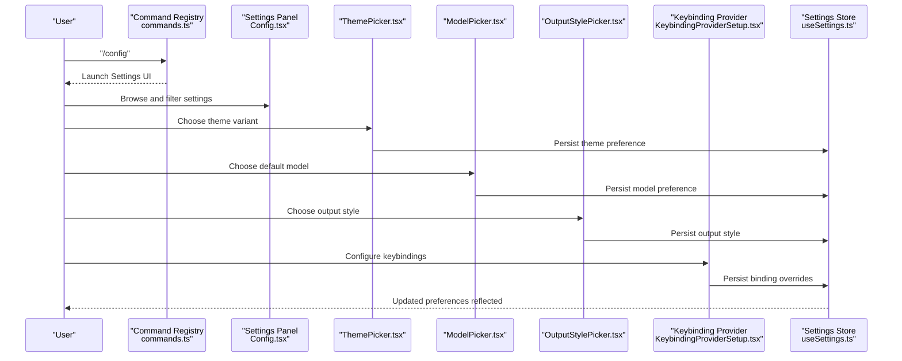
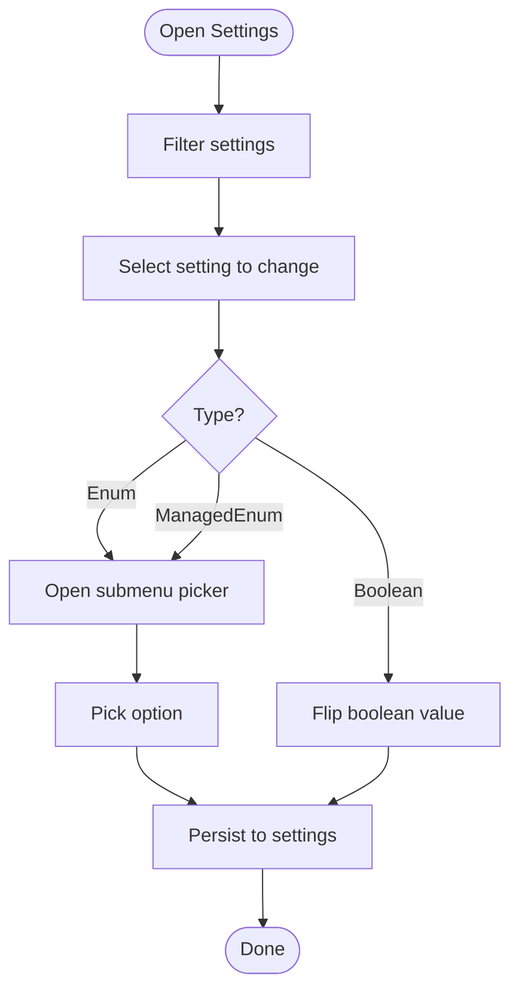
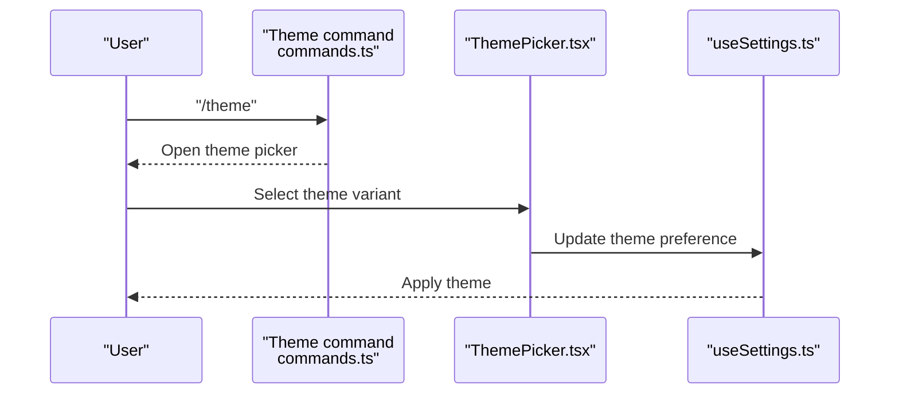
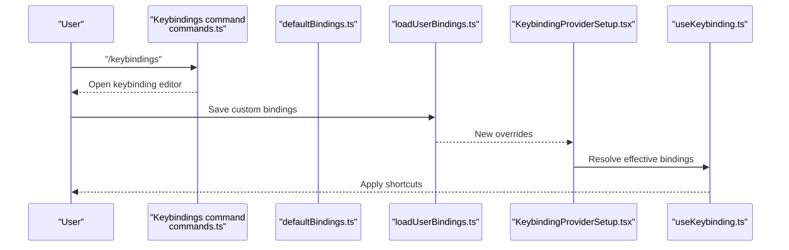
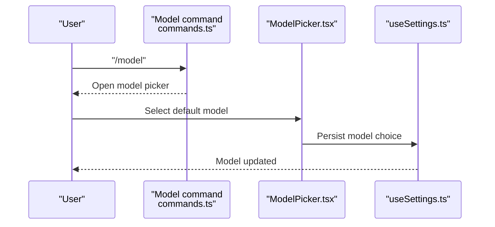
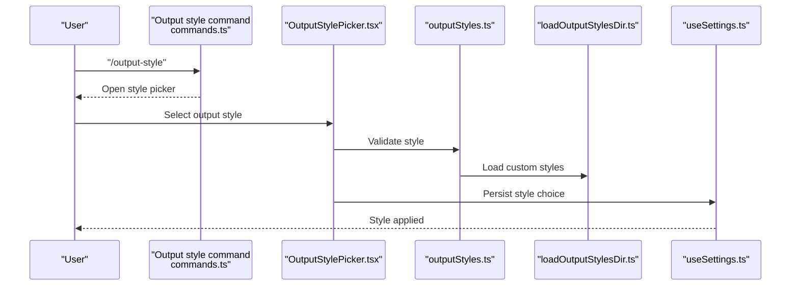
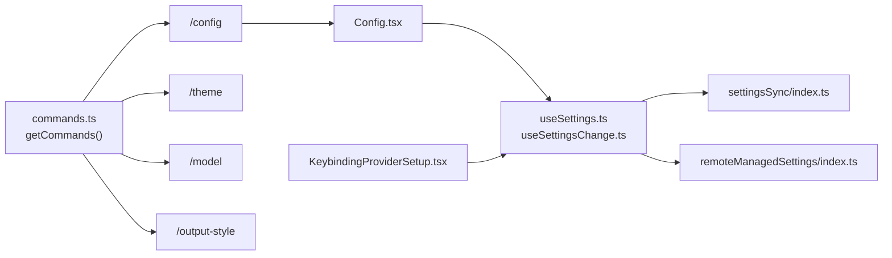

# Configuration Commands

<cite>
**Referenced Files in This Document**
- [commands.ts](file://claude_code_src/restored-src/src/commands.ts)
- [Config.tsx](file://claude_code_src/restored-src/src/components/Settings/Config.tsx)
- [ThemePicker.tsx](file://claude_code_src/restored-src/src/components/ThemePicker.tsx)
- [ModelPicker.tsx](file://claude_code_src/restored-src/src/components/ModelPicker.tsx)
- [OutputStylePicker.tsx](file://claude_code_src/restored-src/src/components/OutputStylePicker.tsx)
- [KeybindingProviderSetup.tsx](file://claude_code_src/restored-src/src/keybindings/KeybindingProviderSetup.tsx)
- [defaultBindings.ts](file://claude_code_src/restored-src/src/keybindings/defaultBindings.ts)
- [loadUserBindings.ts](file://claude_code_src/restored-src/src/keybindings/loadUserBindings.ts)
- [useKeybinding.ts](file://claude_code_src/restored-src/src/hooks/useKeybinding.tsx)
- [useSettings.ts](file://claude_code_src/restored-src/src/hooks/useSettings.ts)
- [useSettingsChange.ts](file://claude_code_src/restored-src/src/hooks/useSettingsChange.ts)
- [settingsSync](file://claude_code_src/restored-src/src/services/settingsSync/index.ts)
- [remoteManagedSettings](file://claude_code_src/restored-src/src/services/remoteManagedSettings/index.ts)
- [constants.ts](file://claude_code_src/restored-src/src/utils/settings/constants.ts)
- [outputStyles.ts](file://claude_code_src/restored-src/src/constants/outputStyles.ts)
- [loadOutputStylesDir.ts](file://claude_code_src/restored-src/src/outputStyles/loadOutputStylesDir.ts)
- [getCommands.ts](file://claude_code_src/restored-src/src/commands/getCommands.ts)
</cite>

## Table of Contents
1. [Introduction](#introduction)
2. [Project Structure](#project-structure)
3. [Core Components](#core-components)
4. [Architecture Overview](#architecture-overview)
5. [Detailed Component Analysis](#detailed-component-analysis)
6. [Dependency Analysis](#dependency-analysis)
7. [Performance Considerations](#performance-considerations)
8. [Troubleshooting Guide](#troubleshooting-guide)
9. [Conclusion](#conclusion)

## Introduction
This document explains how to manage configuration in the application through commands and UI components. It covers:
- Modifying application settings
- Customizing the terminal interface (theme)
- Configuring keyboard shortcuts
- Selecting AI models
- Adjusting output presentation (styles)

It also provides practical scenarios, troubleshooting guidance, and best practices for consistent settings across environments.

## Project Structure
Configuration is exposed via a central command registry and rendered through a Settings UI. Key areas:
- Command registry aggregates built-in commands including config, theme, model, and output-style.
- Settings UI provides interactive controls for themes, models, output styles, and other toggles.
- Keybindings are defined centrally and applied via a provider and hooks.
- Settings persistence integrates with local storage and optional synchronization services.

```mermaid
graph TB
CMD["commands.ts<br/>Registers built-in commands"] --> CFG_CMD["Config command<br/>(invoked via '/config')"]
CMD --> THEME_CMD["Theme command<br/>(invoked via '/theme')"]
CMD --> MODEL_CMD["Model command<br/>(invoked via '/model')"]
CMD --> OUTPUT_CMD["Output style command<br/>(invoked via '/output-style')"]
CFG_UI["Config.tsx<br/>Settings panel UI"] --> THEME_PICKER["ThemePicker.tsx"]
CFG_UI --> MODEL_PICKER["ModelPicker.tsx"]
CFG_UI --> OUTPUT_PICKER["OutputStylePicker.tsx"]
KB_PROVIDER["KeybindingProviderSetup.tsx"] --> KB_DEFAULTS["defaultBindings.ts"]
KB_PROVIDER --> KB_LOAD["loadUserBindings.ts"]
KB_PROVIDER --> KB_HOOK["useKeybinding.ts"]
SETTINGS_HOOKS["useSettings.ts<br/>useSettingsChange.ts"] --> SYNC["settingsSync/index.ts"]
SETTINGS_HOOKS --> REMOTE_MANAGED["remoteManagedSettings/index.ts"]
```

**Diagram sources**
- [commands.ts:258-346](file://claude_code_src/restored-src/src/commands.ts#L258-L346)
- [Config.tsx:85-1737](file://claude_code_src/restored-src/src/components/Settings/Config.tsx#L85-L1737)
- [ThemePicker.tsx](file://claude_code_src/restored-src/src/components/ThemePicker.tsx)
- [ModelPicker.tsx](file://claude_code_src/restored-src/src/components/ModelPicker.tsx)
- [OutputStylePicker.tsx](file://claude_code_src/restored-src/src/components/OutputStylePicker.tsx)
- [KeybindingProviderSetup.tsx](file://claude_code_src/restored-src/src/keybindings/KeybindingProviderSetup.tsx)
- [defaultBindings.ts](file://claude_code_src/restored-src/src/keybindings/defaultBindings.ts)
- [loadUserBindings.ts](file://claude_code_src/restored-src/src/keybindings/loadUserBindings.ts)
- [useKeybinding.ts](file://claude_code_src/restored-src/src/hooks/useKeybinding.tsx)
- [useSettings.ts](file://claude_code_src/restored-src/src/hooks/useSettings.ts)
- [useSettingsChange.ts](file://claude_code_src/restored-src/src/hooks/useSettingsChange.ts)
- [settingsSync](file://claude_code_src/restored-src/src/services/settingsSync/index.ts)
- [remoteManagedSettings](file://claude_code_src/restored-src/src/services/remoteManagedSettings/index.ts)

**Section sources**
- [commands.ts:258-346](file://claude_code_src/restored-src/src/commands.ts#L258-L346)

## Core Components
- Configuration command: Presents a searchable, filterable settings panel with categorized options. Supports toggling booleans, selecting from enums, and opening managed submenus for theme, model, output style, language, and more.
- Theme picker: Allows choosing between auto, dark, light, and colorblind-friendly variants.
- Model picker: Lets users pick a default model and optionally a teammate model.
- Output style picker: Lets users choose a presentation style for output.
- Keyboard bindings: Centralized defaults plus user overrides, applied via a provider and consumed by hooks.
- Settings persistence: Uses local settings with optional sync and remote-managed settings.

**Section sources**
- [Config.tsx:85-1737](file://claude_code_src/restored-src/src/components/Settings/Config.tsx#L85-L1737)
- [ThemePicker.tsx](file://claude_code_src/restored-src/src/components/ThemePicker.tsx)
- [ModelPicker.tsx](file://claude_code_src/restored-src/src/components/ModelPicker.tsx)
- [OutputStylePicker.tsx](file://claude_code_src/restored-src/src/components/OutputStylePicker.tsx)
- [KeybindingProviderSetup.tsx](file://claude_code_src/restored-src/src/keybindings/KeybindingProviderSetup.tsx)
- [useSettings.ts](file://claude_code_src/restored-src/src/hooks/useSettings.ts)
- [useSettingsChange.ts](file://claude_code_src/restored-src/src/hooks/useSettingsChange.ts)

## Architecture Overview
The configuration system combines:
- Command-driven entry points for settings, theme, model, and output style
- A declarative settings UI that reads and writes to a settings store
- A keybinding subsystem that merges defaults and user preferences
- Optional synchronization and remote management of settings

**Diagram sources**
- [commands.ts:258-346](file://claude_code_src/restored-src/src/commands.ts#L258-L346)
- [Config.tsx:85-1737](file://claude_code_src/restored-src/src/components/Settings/Config.tsx#L85-L1737)
- [ThemePicker.tsx](file://claude_code_src/restored-src/src/components/ThemePicker.tsx)
- [ModelPicker.tsx](file://claude_code_src/restored-src/src/components/ModelPicker.tsx)
- [OutputStylePicker.tsx](file://claude_code_src/restored-src/src/components/OutputStylePicker.tsx)
- [KeybindingProviderSetup.tsx](file://claude_code_src/restored-src/src/keybindings/KeybindingProviderSetup.tsx)
- [useSettings.ts](file://claude_code_src/restored-src/src/hooks/useSettings.ts)

## Detailed Component Analysis

### Settings Management (via /config)
- Purpose: Central hub for toggling features, selecting themes/models, and adjusting output styles.
- Key behaviors:
  - Boolean toggles update immediately and mark the settings panel as "dirty".
  - Enum and managed enum settings open submenus (theme, model, output style, language).
  - Filtering and keyboard navigation support quick access.
  - Confirmation and cancellation flows guided by configurable shortcuts.

**Diagram sources**
- [Config.tsx:1279-1311](file://claude_code_src/restored-src/src/components/Settings/Config.tsx#L1279-L1311)
- [Config.tsx:1539-1551](file://claude_code_src/restored-src/src/components/Settings/Config.tsx#L1539-L1551)

**Section sources**
- [Config.tsx:85-1737](file://claude_code_src/restored-src/src/components/Settings/Config.tsx#L85-L1737)

### Theme Customization (/theme)
- Purpose: Choose terminal theme variant (auto, dark, light, colorblind-friendly).
- Implementation highlights:
  - ThemePicker component integrates with the settings store.
  - Changes are persisted locally and reflected immediately in the UI.

**Diagram sources**
- [commands.ts:258-346](file://claude_code_src/restored-src/src/commands.ts#L258-L346)
- [ThemePicker.tsx](file://claude_code_src/restored-src/src/components/ThemePicker.tsx)
- [useSettings.ts](file://claude_code_src/restored-src/src/hooks/useSettings.ts)

**Section sources**
- [ThemePicker.tsx](file://claude_code_src/restored-src/src/components/ThemePicker.tsx)
- [Config.tsx:1745-1749](file://claude_code_src/restored-src/src/components/Settings/Config.tsx#L1745-L1749)

### Keyboard Shortcuts (/keybindings)
- Purpose: Manage keybindings globally and per-context.
- Implementation highlights:
  - Defaults are defined centrally and merged with user overrides.
  - Provider applies bindings at runtime.
  - Hooks expose binding resolution for components.

**Diagram sources**
- [commands.ts:258-346](file://claude_code_src/restored-src/src/commands.ts#L258-L346)
- [defaultBindings.ts](file://claude_code_src/restored-src/src/keybindings/defaultBindings.ts)
- [loadUserBindings.ts](file://claude_code_src/restored-src/src/keybindings/loadUserBindings.ts)
- [KeybindingProviderSetup.tsx](file://claude_code_src/restored-src/src/keybindings/KeybindingProviderSetup.tsx)
- [useKeybinding.ts](file://claude_code_src/restored-src/src/hooks/useKeybinding.tsx)

**Section sources**
- [KeybindingProviderSetup.tsx](file://claude_code_src/restored-src/src/keybindings/KeybindingProviderSetup.tsx)
- [defaultBindings.ts](file://claude_code_src/restored-src/src/keybindings/defaultBindings.ts)
- [loadUserBindings.ts](file://claude_code_src/restored-src/src/keybindings/loadUserBindings.ts)
- [useKeybinding.ts](file://claude_code_src/restored-src/src/hooks/useKeybinding.tsx)

### Model Selection (/model)
- Purpose: Choose the default model and teammate model.
- Implementation highlights:
  - ModelPicker component updates the settings store.
  - Managed enum behavior opens a dedicated submenu from the settings panel.

**Diagram sources**
- [commands.ts:258-346](file://claude_code_src/restored-src/src/commands.ts#L258-L346)
- [ModelPicker.tsx](file://claude_code_src/restored-src/src/components/ModelPicker.tsx)
- [useSettings.ts](file://claude_code_src/restored-src/src/hooks/useSettings.ts)

**Section sources**
- [ModelPicker.tsx](file://claude_code_src/restored-src/src/components/ModelPicker.tsx)
- [Config.tsx:1308-1311](file://claude_code_src/restored-src/src/components/Settings/Config.tsx#L1308-L1311)

### Output Formatting (/output-style)
- Purpose: Choose how output is presented (e.g., compact, expanded).
- Implementation highlights:
  - OutputStylePicker updates the settings store.
  - Constants and loader define available styles and load custom styles from disk.

**Diagram sources**
- [commands.ts:258-346](file://claude_code_src/restored-src/src/commands.ts#L258-L346)
- [OutputStylePicker.tsx](file://claude_code_src/restored-src/src/components/OutputStylePicker.tsx)
- [outputStyles.ts](file://claude_code_src/restored-src/src/constants/outputStyles.ts)
- [loadOutputStylesDir.ts](file://claude_code_src/restored-src/src/outputStyles/loadOutputStylesDir.ts)
- [useSettings.ts](file://claude_code_src/restored-src/src/hooks/useSettings.ts)

**Section sources**
- [OutputStylePicker.tsx](file://claude_code_src/restored-src/src/components/OutputStylePicker.tsx)
- [outputStyles.ts](file://claude_code_src/restored-src/src/constants/outputStyles.ts)
- [loadOutputStylesDir.ts](file://claude_code_src/restored-src/src/outputStyles/loadOutputStylesDir.ts)
- [Config.tsx:1539-1551](file://claude_code_src/restored-src/src/components/Settings/Config.tsx#L1539-L1551)

## Dependency Analysis
Configuration commands rely on:
- Central command registry for discovery and availability gating
- Settings hooks for reading/writing preferences
- Optional services for synchronization and remote management
- Keybinding subsystem for shortcut handling

**Diagram sources**
- [commands.ts:476-517](file://claude_code_src/restored-src/src/commands.ts#L476-L517)
- [Config.tsx:85-1737](file://claude_code_src/restored-src/src/components/Settings/Config.tsx#L85-L1737)
- [useSettings.ts](file://claude_code_src/restored-src/src/hooks/useSettings.ts)
- [useSettingsChange.ts](file://claude_code_src/restored-src/src/hooks/useSettingsChange.ts)
- [KeybindingProviderSetup.tsx](file://claude_code_src/restored-src/src/keybindings/KeybindingProviderSetup.tsx)

**Section sources**
- [commands.ts:476-517](file://claude_code_src/restored-src/src/commands.ts#L476-L517)
- [getCommands.ts](file://claude_code_src/restored-src/src/commands/getCommands.ts)

## Performance Considerations
- Command loading is memoized to avoid repeated disk I/O and dynamic imports.
- Settings updates are batched and debounced where appropriate to reduce re-renders.
- Keybinding resolution is computed per hook invocation; keep custom bindings minimal to avoid overhead.
- Output style loading defers custom style discovery to optimize startup.

[No sources needed since this section provides general guidance]

## Troubleshooting Guide
Common issues and resolutions:
- Settings not persisting
  - Verify local settings store is writable and not blocked by permissions.
  - If using remote-managed settings, confirm synchronization service is reachable.
  - Check for conflicting settings sources and resolve precedence.
- Theme changes not applying
  - Ensure the selected theme variant is supported by the terminal.
  - Restart the UI to refresh theme caches.
- Keybindings not working
  - Confirm custom bindings do not conflict with reserved shortcuts.
  - Reset to defaults and re-apply customizations incrementally.
- Output style not changing
  - Validate the chosen style exists in constants or custom styles directory.
  - Clear cached styles if a new style was recently added.

**Section sources**
- [useSettings.ts](file://claude_code_src/restored-src/src/hooks/useSettings.ts)
- [remoteManagedSettings](file://claude_code_src/restored-src/src/services/remoteManagedSettings/index.ts)
- [constants.ts](file://claude_code_src/restored-src/src/utils/settings/constants.ts)

## Best Practices
- Keep environment-specific overrides minimal; prefer shared defaults.
- Use the settings panel’s filtering to quickly locate and validate changes.
- Back up settings regularly if relying on local-only persistence.
- When collaborating, coordinate keybinding changes to avoid conflicts.
- Prefer managed enums for complex selections (theme, model, output style) to maintain consistency.

[No sources needed since this section provides general guidance]

## Conclusion
The configuration system offers a cohesive, extensible way to manage application behavior. Through commands and a rich settings UI, users can tailor themes, models, output styles, and keyboard shortcuts while leveraging optional synchronization and remote management for consistent experiences across environments.

[No sources needed since this section summarizes without analyzing specific files]