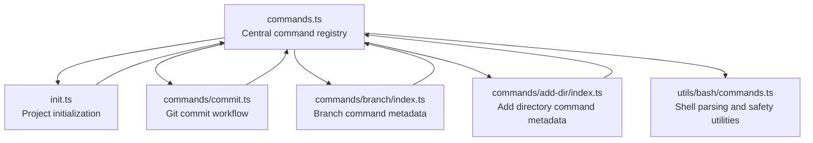
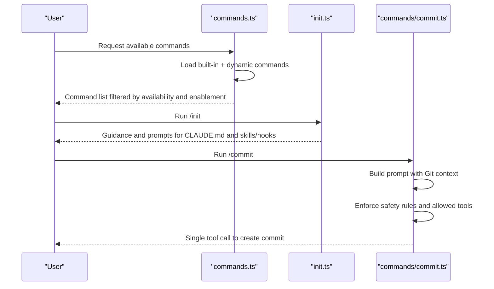
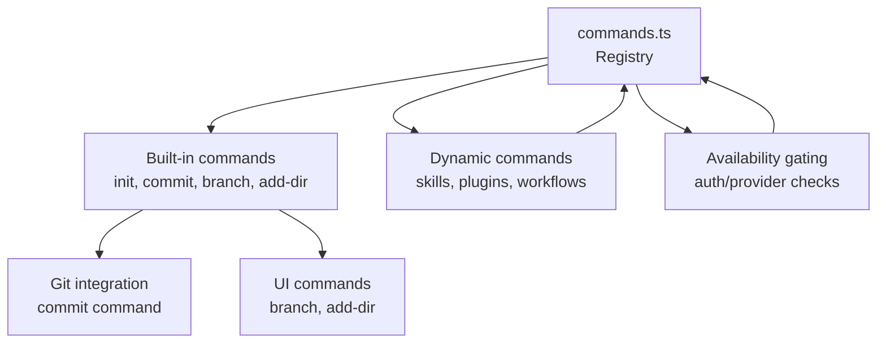

# Development Workflow Commands

<cite>
**Referenced Files in This Document**
- [commands.ts](file://claude_code_src/restored-src/src/commands.ts)
- [init.ts](file://claude_code_src/restored-src/src/commands/init.ts)
- [commit.ts](file://claude_code_src/restored-src/src/commands/commit.ts)
- [branch/index.ts](file://claude_code_src/restored-src/src/commands/branch/index.ts)
- [add-dir/index.ts](file://claude_code_src/restored-src/src/commands/add-dir/index.ts)
- [commands.ts](file://claude_code_src/restored-src/src/utils/bash/commands.ts)
</cite>

## Table of Contents
1. [Introduction](#introduction)
2. [Project Structure](#project-structure)
3. [Core Components](#core-components)
4. [Architecture Overview](#architecture-overview)
5. [Detailed Component Analysis](#detailed-component-analysis)
6. [Dependency Analysis](#dependency-analysis)
7. [Performance Considerations](#performance-considerations)
8. [Troubleshooting Guide](#troubleshooting-guide)
9. [Conclusion](#conclusion)

## Introduction
This document explains the development workflow commands that integrate with Git and project management within the system. It covers how to initialize a project guide, create commits, manage branches, and add working directories. It also documents the command syntax, parameters, and usage patterns, and explains how these commands integrate with Git workflows and project management. Practical examples, parameter combinations, and troubleshooting guidance are included to support both new and experienced users.

## Project Structure
The commands are centrally defined and exported from a single registry. The registry aggregates built-in commands, dynamic skills, plugin commands, and workflow commands. Feature flags and availability gating influence which commands are exposed to users.

**Diagram sources**
- [commands.ts:258-346](file://claude_code_src/restored-src/src/commands.ts#L258-L346)
- [init.ts:226-257](file://claude_code_src/restored-src/src/commands/init.ts#L226-L257)
- [commit.ts:57-93](file://claude_code_src/restored-src/src/commands/commit.ts#L57-L93)
- [branch/index.ts:4-12](file://claude_code_src/restored-src/src/commands/branch/index.ts#L4-L12)
- [add-dir/index.ts:3-11](file://claude_code_src/restored-src/src/commands/add-dir/index.ts#L3-L11)
- [commands.ts:85-249](file://claude_code_src/restored-src/src/utils/bash/commands.ts#L85-L249)

**Section sources**
- [commands.ts:258-346](file://claude_code_src/restored-src/src/commands.ts#L258-L346)
- [commands.ts:476-517](file://claude_code_src/restored-src/src/commands.ts#L476-L517)

## Core Components
- Central command registry: Aggregates built-in commands, dynamic skills, plugin commands, and workflow commands. It exposes filtering by availability and enablement, and supports dynamic discovery of skills and plugins.
- Initialization command: Guides creation of a project-level and/or personal-level guidance file and optionally sets up skills and hooks.
- Commit command: Provides a guided, safe workflow to stage and commit changes using Git, with strict safety rules and tool allowances.
- Branch command: Creates a branch of the current conversation at the current point.
- Add directory command: Adds a new working directory to the environment.

**Section sources**
- [commands.ts:258-346](file://claude_code_src/restored-src/src/commands.ts#L258-L346)
- [init.ts:226-257](file://claude_code_src/restored-src/src/commands/init.ts#L226-L257)
- [commit.ts:57-93](file://claude_code_src/restored-src/src/commands/commit.ts#L57-L93)
- [branch/index.ts:4-12](file://claude_code_src/restored-src/src/commands/branch/index.ts#L4-L12)
- [add-dir/index.ts:3-11](file://claude_code_src/restored-src/src/commands/add-dir/index.ts#L3-L11)

## Architecture Overview
The command system is organized around a central registry that lazily loads commands and dynamically discovers skills and plugins. Availability and enablement checks ensure only appropriate commands are presented. The commit command enforces a strict safety protocol and uses allowed tool rules to constrain Git operations.

**Diagram sources**
- [commands.ts:476-517](file://claude_code_src/restored-src/src/commands.ts#L476-L517)
- [init.ts:226-257](file://claude_code_src/restored-src/src/commands/init.ts#L226-L257)
- [commit.ts:57-93](file://claude_code_src/restored-src/src/commands/commit.ts#L57-L93)

## Detailed Component Analysis

### Initialization Command (/init)
Purpose:
- Create or update a project-level guidance file and optionally a personal-level guidance file.
- Optionally scaffold skills and hooks to automate common workflows.

Syntax and parameters:
- Command name: init
- Aliases: None
- Optional behavior controlled by feature flags and environment variables.

Usage patterns:
- Typical: Run /init to generate project-level guidance and optionally personal-level guidance, skills, and hooks.
- Advanced: Use feature flags and environment variables to toggle new vs. legacy behavior.

Safety and integration:
- Uses a guided interview flow to collect preferences and project specifics.
- Integrates with project onboarding state to mark completion.

Practical examples:
- Initialize a new project with both project and personal guidance files.
- Generate skills for verification and formatting hooks.

Common troubleshooting:
- If the guidance file already exists, the command proposes targeted changes rather than overwriting.
- Ensure the environment allows the desired behavior via feature flags or environment variables.

**Section sources**
- [init.ts:226-257](file://claude_code_src/restored-src/src/commands/init.ts#L226-L257)
- [init.ts:28-224](file://claude_code_src/restored-src/src/commands/init.ts#L28-L224)

### Commit Command (/commit)
Purpose:
- Create a Git commit by analyzing staged and unstaged changes, drafting a commit message, and executing a single commit operation.

Syntax and parameters:
- Command name: commit
- Aliases: None

Usage patterns:
- Typical: Run /commit to stage relevant files and create a commit with a well-formed message.
- Combined with other commands: Use in conjunction with status and diff to review changes before committing.

Safety and integration:
- Allowed tools are constrained to safe Git operations.
- Enforces strict safety rules (e.g., no amend, no secret files, no interactive commands).
- Automatically injects attribution text and undercover instructions when applicable.

Practical examples:
- Commit a small set of changes with a concise, purpose-focused message.
- Combine with staged changes to ensure only intended files are committed.

Common troubleshooting:
- If there are no changes to commit, the command avoids creating an empty commit.
- Avoid using interactive flags with Git; the command does not support interactive input.

**Section sources**
- [commit.ts:57-93](file://claude_code_src/restored-src/src/commands/commit.ts#L57-L93)
- [commit.ts:6-11](file://claude_code_src/restored-src/src/commands/commit.ts#L6-L11)
- [commit.ts:12-54](file://claude_code_src/restored-src/src/commands/commit.ts#L12-L54)

### Branch Command (/branch)
Purpose:
- Create a branch of the current conversation at the current point.

Syntax and parameters:
- Command name: branch
- Aliases: fork (conditional, depending on feature flags)
- Argument hint: [name]

Usage patterns:
- Typical: Run /branch to create a new conversation branch with an optional name.
- Alternative: Use fork when the dedicated fork command is not available.

Practical examples:
- Create a branch to explore a potential solution without affecting the main conversation.
- Name branches descriptively for clarity.

Common troubleshooting:
- If the fork command is present, the alias is not used to avoid duplication.
- Ensure the branch name follows your project’s naming conventions.

**Section sources**
- [branch/index.ts:4-12](file://claude_code_src/restored-src/src/commands/branch/index.ts#L4-L12)

### Add Directory Command (/add-dir)
Purpose:
- Add a new working directory to the environment.

Syntax and parameters:
- Command name: add-dir
- Aliases: None
- Argument hint: <path>

Usage patterns:
- Typical: Run /add-dir with a path to include a new working directory.
- Path resolution: The path is resolved relative to the current working directory.

Practical examples:
- Add a subdirectory as a new working area for development.
- Include external repositories or linked directories.

Common troubleshooting:
- Ensure the path exists and is accessible.
- Verify permissions to read and write in the target directory.

**Section sources**
- [add-dir/index.ts:3-11](file://claude_code_src/restored-src/src/commands/add-dir/index.ts#L3-L11)

### Shell Parsing and Safety Utilities
Purpose:
- Provide robust parsing and safety checks for shell commands, including command splitting, redirection extraction, and help-command detection.

Integration with commands:
- Supports command prefix extraction and safety validation for Bash commands.
- Ensures that commands are safe and properly sanitized before execution.

Practical examples:
- Detecting help commands to bypass prefix extraction.
- Extracting output redirections for validation.

Common troubleshooting:
- Malformed commands are handled gracefully with fail-closed behavior.
- Heredoc handling ensures accurate parsing and validation.

**Section sources**
- [commands.ts:85-249](file://claude_code_src/restored-src/src/utils/bash/commands.ts#L85-L249)
- [commands.ts:634-790](file://claude_code_src/restored-src/src/utils/bash/commands.ts#L634-L790)
- [commands.ts:388-436](file://claude_code_src/restored-src/src/utils/bash/commands.ts#L388-L436)

## Dependency Analysis
The command registry orchestrates command availability and discovery. It integrates with:
- Built-in commands (init, commit, branch, add-dir)
- Dynamic skills and plugin commands
- Workflow commands (feature-dependent)
- Availability gating based on authentication and provider requirements

**Diagram sources**
- [commands.ts:417-443](file://claude_code_src/restored-src/src/commands.ts#L417-L443)
- [commands.ts:476-517](file://claude_code_src/restored-src/src/commands.ts#L476-L517)
- [commit.ts:57-93](file://claude_code_src/restored-src/src/commands/commit.ts#L57-L93)
- [branch/index.ts:4-12](file://claude_code_src/restored-src/src/commands/branch/index.ts#L4-L12)
- [add-dir/index.ts:3-11](file://claude_code_src/restored-src/src/commands/add-dir/index.ts#L3-L11)

**Section sources**
- [commands.ts:417-443](file://claude_code_src/restored-src/src/commands.ts#L417-L443)
- [commands.ts:476-517](file://claude_code_src/restored-src/src/commands.ts#L476-L517)

## Performance Considerations
- Command loading is memoized to reduce repeated disk I/O and dynamic imports.
- Availability and enablement checks are performed fresh on each request to reflect current auth state.
- Dynamic skills and plugin commands are loaded concurrently to minimize latency.

[No sources needed since this section provides general guidance]

## Troubleshooting Guide
Common issues and resolutions:
- Empty commit prevention: The commit command avoids creating empty commits when there are no changes.
- Interactive commands: Avoid interactive flags with Git; the commit command does not support interactive input.
- Help commands: Simple help commands are allowed without prefix extraction for performance and usability.
- Safety validation: Malformed commands are handled with fail-closed behavior to prevent unintended execution.

**Section sources**
- [commit.ts:30-35](file://claude_code_src/restored-src/src/commands/commit.ts#L30-L35)
- [commands.ts:388-436](file://claude_code_src/restored-src/src/utils/bash/commands.ts#L388-L436)
- [commands.ts:693-699](file://claude_code_src/restored-src/src/utils/bash/commands.ts#L693-L699)

## Conclusion
The development workflow commands provide a structured, safe, and integrated approach to initializing projects, committing changes, branching conversations, and managing working directories. By leveraging the central command registry, safety protocols, and dynamic discovery, developers can streamline their Git-centric workflows while maintaining control and visibility over automated actions.