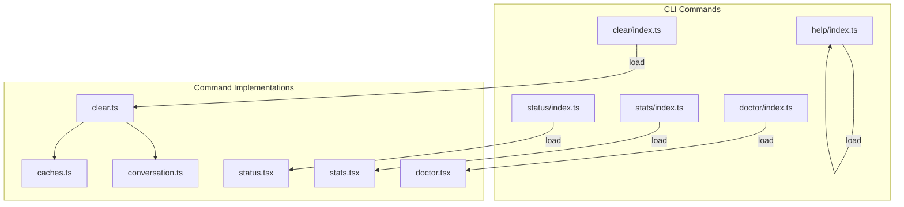
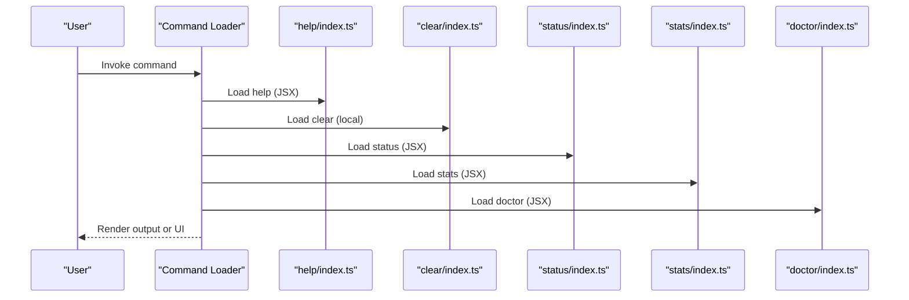
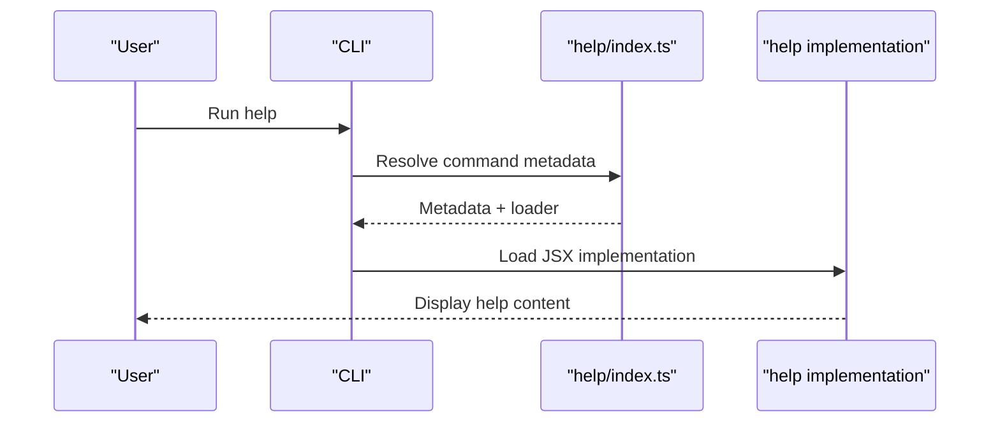
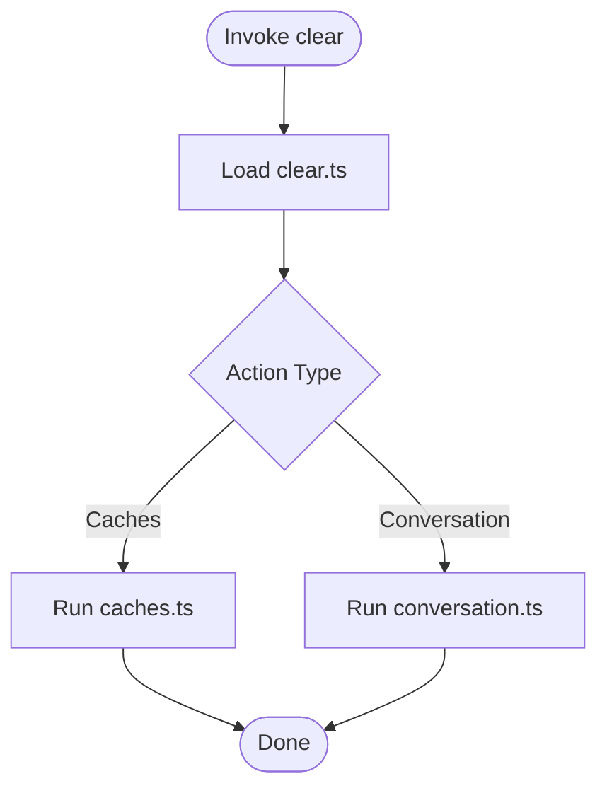
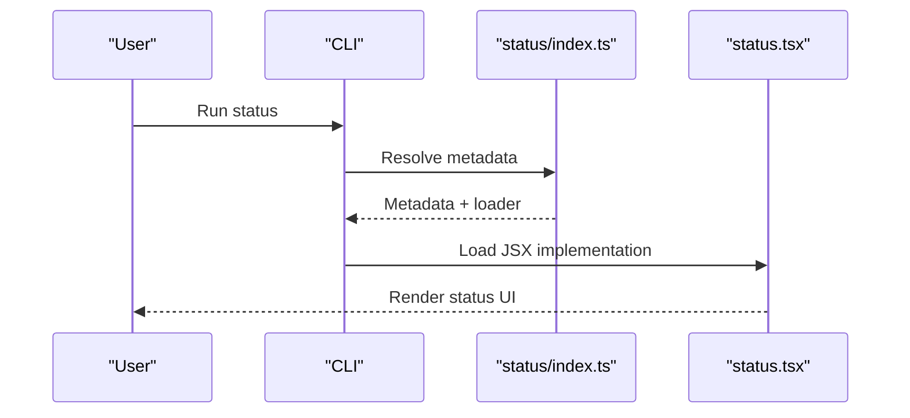
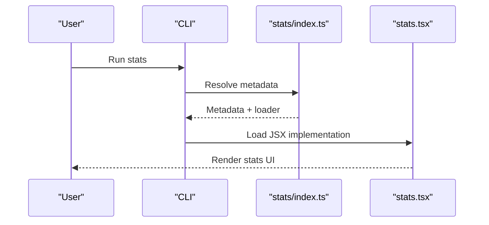
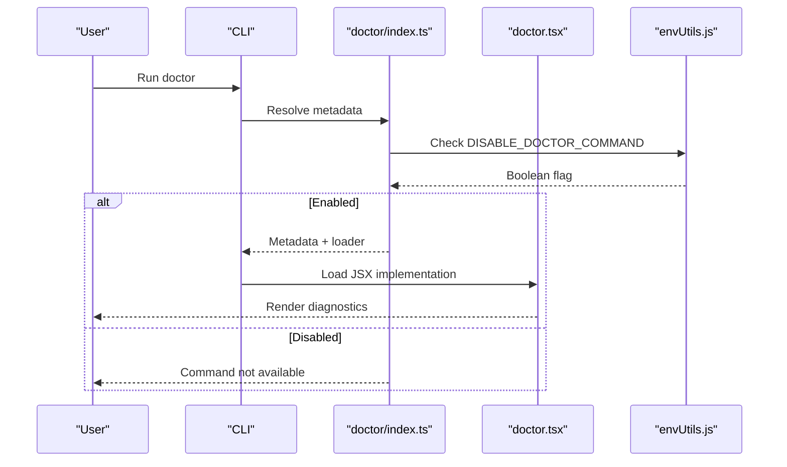
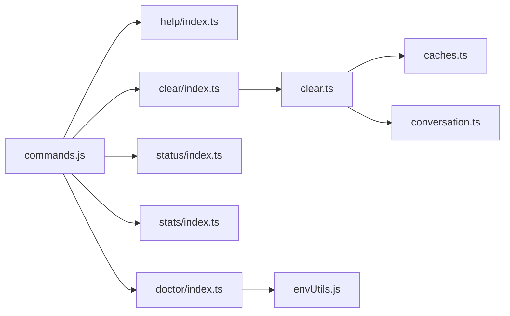

# Utility and Support Commands

<cite>
**Referenced Files in This Document**
- [help/index.ts](file://restored-src/src/commands/help/index.ts)
- [clear/index.ts](file://restored-src/src/commands/clear/index.ts)
- [status/index.ts](file://restored-src/src/commands/status/index.ts)
- [stats/index.ts](file://restored-src/src/commands/stats/index.ts)
- [doctor/index.ts](file://restored-src/src/commands/doctor/index.ts)
- [clear.ts](file://restored-src/src/commands/clear/clear.ts)
- [caches.ts](file://restored-src/src/commands/clear/caches.ts)
- [conversation.ts](file://restored-src/src/commands/clear/conversation.ts)
- [status.tsx](file://restored-src/src/commands/status/status.tsx)
- [stats.tsx](file://restored-src/src/commands/stats/stats.tsx)
- [doctor.tsx](file://restored-src/src/commands/doctor/doctor.tsx)
- [envUtils.js](file://restored-src/src/utils/envUtils.js)
</cite>

## Table of Contents
1. [Introduction](#introduction)
2. [Project Structure](#project-structure)
3. [Core Components](#core-components)
4. [Architecture Overview](#architecture-overview)
5. [Detailed Component Analysis](#detailed-component-analysis)
6. [Dependency Analysis](#dependency-analysis)
7. [Performance Considerations](#performance-considerations)
8. [Troubleshooting Guide](#troubleshooting-guide)
9. [Conclusion](#conclusion)

## Introduction
This document explains the utility and support commands that enable users to access help, clear application state, monitor system status, view usage statistics, and run diagnostic checks. It covers how to access command help, clear conversation history and caches, monitor system status, view usage statistics, and run diagnostics. It also includes examples of troubleshooting scenarios, performance monitoring, and system maintenance procedures, along with command-specific flags and their impact on system behavior.

## Project Structure
The utility and support commands are implemented as modular command entries under the commands directory. Each command defines metadata (type, name, description, aliases, and loading behavior) and lazily loads its implementation to minimize startup overhead. The relevant commands covered here are:
- help: displays help and available commands
- clear: clears conversation history and frees up context
- status: shows system status including version, model, account, API connectivity, and tool statuses
- stats: shows usage statistics and activity
- doctor: diagnoses and verifies installation and settings

**Diagram sources**
- [help/index.ts:1-11](file://restored-src/src/commands/help/index.ts#L1-L11)
- [clear/index.ts:1-20](file://restored-src/src/commands/clear/index.ts#L1-L20)
- [status/index.ts:1-13](file://restored-src/src/commands/status/index.ts#L1-L13)
- [stats/index.ts:1-11](file://restored-src/src/commands/stats/index.ts#L1-L11)
- [doctor/index.ts:1-13](file://restored-src/src/commands/doctor/index.ts#L1-L13)
- [clear.ts](file://restored-src/src/commands/clear/clear.ts)
- [caches.ts](file://restored-src/src/commands/clear/caches.ts)
- [conversation.ts](file://restored-src/src/commands/clear/conversation.ts)
- [status.tsx](file://restored-src/src/commands/status/status.tsx)
- [stats.tsx](file://restored-src/src/commands/stats/stats.tsx)
- [doctor.tsx](file://restored-src/src/commands/doctor/doctor.tsx)

**Section sources**
- [help/index.ts:1-11](file://restored-src/src/commands/help/index.ts#L1-L11)
- [clear/index.ts:1-20](file://restored-src/src/commands/clear/index.ts#L1-L20)
- [status/index.ts:1-13](file://restored-src/src/commands/status/index.ts#L1-L13)
- [stats/index.ts:1-11](file://restored-src/src/commands/stats/index.ts#L1-L11)
- [doctor/index.ts:1-13](file://restored-src/src/commands/doctor/index.ts#L1-L13)

## Core Components
- Help command: Provides access to help and lists available commands. It is marked as a local JSX command and lazily loaded.
- Clear command: Clears conversation history and frees up context. It supports aliases and is configured as a non-interactive command that creates a new session.
- Status command: Displays system status including version, model, account, API connectivity, and tool statuses. It is marked as immediate to show results quickly.
- Stats command: Shows usage statistics and activity. It is implemented as a local JSX command.
- Doctor command: Diagnoses and verifies installation and settings. It is conditionally enabled via an environment variable check.

**Section sources**
- [help/index.ts:1-11](file://restored-src/src/commands/help/index.ts#L1-L11)
- [clear/index.ts:1-20](file://restored-src/src/commands/clear/index.ts#L1-L20)
- [status/index.ts:1-13](file://restored-src/src/commands/status/index.ts#L1-L13)
- [stats/index.ts:1-11](file://restored-src/src/commands/stats/index.ts#L1-L11)
- [doctor/index.ts:1-13](file://restored-src/src/commands/doctor/index.ts#L1-L13)

## Architecture Overview
The commands are registered as typed entries and lazily loaded to optimize startup performance. The clear command orchestrates multiple cleanup utilities, while status, stats, and doctor present UI-driven views.

**Diagram sources**
- [help/index.ts:1-11](file://restored-src/src/commands/help/index.ts#L1-L11)
- [clear/index.ts:1-20](file://restored-src/src/commands/clear/index.ts#L1-L20)
- [status/index.ts:1-13](file://restored-src/src/commands/status/index.ts#L1-L13)
- [stats/index.ts:1-11](file://restored-src/src/commands/stats/index.ts#L1-L11)
- [doctor/index.ts:1-13](file://restored-src/src/commands/doctor/index.ts#L1-L13)

## Detailed Component Analysis

### Help Command
- Purpose: Show help and available commands.
- Behavior: Registered as a local JSX command with lazy loading.
- Access: Invoked via the help command entry; renders help content.

**Diagram sources**
- [help/index.ts:1-11](file://restored-src/src/commands/help/index.ts#L1-L11)

**Section sources**
- [help/index.ts:1-11](file://restored-src/src/commands/help/index.ts#L1-L11)

### Clear Command
- Purpose: Clear conversation history and free up context.
- Aliases: reset, new.
- Non-interactive: Designed to create a new session without interactive prompts.
- Implementation: Lazily loaded; orchestrates cache clearing and conversation reset.

**Diagram sources**
- [clear/index.ts:1-20](file://restored-src/src/commands/clear/index.ts#L1-L20)
- [clear.ts](file://restored-src/src/commands/clear/clear.ts)
- [caches.ts](file://restored-src/src/commands/clear/caches.ts)
- [conversation.ts](file://restored-src/src/commands/clear/conversation.ts)

**Section sources**
- [clear/index.ts:1-20](file://restored-src/src/commands/clear/index.ts#L1-L20)
- [clear.ts](file://restored-src/src/commands/clear/clear.ts)
- [caches.ts](file://restored-src/src/commands/clear/caches.ts)
- [conversation.ts](file://restored-src/src/commands/clear/conversation.ts)

### Status Command
- Purpose: Show system status including version, model, account, API connectivity, and tool statuses.
- Immediate: Marked as immediate to display results quickly.
- Implementation: JSX-based status view.

**Diagram sources**
- [status/index.ts:1-13](file://restored-src/src/commands/status/index.ts#L1-L13)
- [status.tsx](file://restored-src/src/commands/status/status.tsx)

**Section sources**
- [status/index.ts:1-13](file://restored-src/src/commands/status/index.ts#L1-L13)
- [status.tsx](file://restored-src/src/commands/status/status.tsx)

### Stats Command
- Purpose: Show usage statistics and activity.
- Implementation: JSX-based statistics view.

**Diagram sources**
- [stats/index.ts:1-11](file://restored-src/src/commands/stats/index.ts#L1-L11)
- [stats.tsx](file://restored-src/src/commands/stats/stats.tsx)

**Section sources**
- [stats/index.ts:1-11](file://restored-src/src/commands/stats/index.ts#L1-L11)
- [stats.tsx](file://restored-src/src/commands/stats/stats.tsx)

### Doctor Command
- Purpose: Diagnose and verify installation and settings.
- Enablement: Conditionally enabled based on an environment variable.
- Implementation: JSX-based diagnostic view.

**Diagram sources**
- [doctor/index.ts:1-13](file://restored-src/src/commands/doctor/index.ts#L1-L13)
- [doctor.tsx](file://restored-src/src/commands/doctor/doctor.tsx)
- [envUtils.js](file://restored-src/src/utils/envUtils.js)

**Section sources**
- [doctor/index.ts:1-13](file://restored-src/src/commands/doctor/index.ts#L1-L13)
- [doctor.tsx](file://restored-src/src/commands/doctor/doctor.tsx)
- [envUtils.js](file://restored-src/src/utils/envUtils.js)

## Dependency Analysis
- Command registration: Each command exports a typed entry with metadata and a loader function.
- Lazy loading: Commands defer heavy initialization until invoked, improving startup performance.
- Conditional enablement: The doctor command depends on an environment variable to decide availability.
- Clear orchestration: The clear command delegates to dedicated utilities for cache and conversation cleanup.

**Diagram sources**
- [clear/index.ts:1-20](file://restored-src/src/commands/clear/index.ts#L1-L20)
- [clear.ts](file://restored-src/src/commands/clear/clear.ts)
- [caches.ts](file://restored-src/src/commands/clear/caches.ts)
- [conversation.ts](file://restored-src/src/commands/clear/conversation.ts)
- [doctor/index.ts:1-13](file://restored-src/src/commands/doctor/index.ts#L1-L13)
- [envUtils.js](file://restored-src/src/utils/envUtils.js)

**Section sources**
- [clear/index.ts:1-20](file://restored-src/src/commands/clear/index.ts#L1-L20)
- [clear.ts](file://restored-src/src/commands/clear/clear.ts)
- [caches.ts](file://restored-src/src/commands/clear/caches.ts)
- [conversation.ts](file://restored-src/src/commands/clear/conversation.ts)
- [doctor/index.ts:1-13](file://restored-src/src/commands/doctor/index.ts#L1-L13)
- [envUtils.js](file://restored-src/src/utils/envUtils.js)

## Performance Considerations
- Lazy loading: Commands are loaded on demand to reduce startup time.
- Immediate rendering: The status command is marked immediate to provide quick feedback.
- Minimal metadata: Clear command metadata is minimal to keep overhead low.

## Troubleshooting Guide
- Accessing help: Use the help command to discover available commands and their descriptions.
- Clearing state:
  - Use the clear command to reset conversation history and free up context.
  - The clear command delegates to cache and conversation utilities; ensure caches and conversations are cleared as needed.
- Monitoring status:
  - Use the status command to check version, model, account, API connectivity, and tool statuses.
- Viewing statistics:
  - Use the stats command to review usage statistics and activity.
- Running diagnostics:
  - Use the doctor command to diagnose installation and settings issues.
  - The doctor command is disabled when the DISABLE_DOCTOR_COMMAND environment variable is truthy.

Examples of scenarios:
- Troubleshooting connectivity: Run the status command to verify API connectivity and tool statuses, then use the doctor command to diagnose deeper issues.
- Performance monitoring: Use the stats command to review usage trends and identify potential bottlenecks.
- System maintenance: Periodically run the clear command to reset context and clear caches, ensuring optimal performance.

**Section sources**
- [help/index.ts:1-11](file://restored-src/src/commands/help/index.ts#L1-L11)
- [clear/index.ts:1-20](file://restored-src/src/commands/clear/index.ts#L1-L20)
- [status/index.ts:1-13](file://restored-src/src/commands/status/index.ts#L1-L13)
- [stats/index.ts:1-11](file://restored-src/src/commands/stats/index.ts#L1-L11)
- [doctor/index.ts:1-13](file://restored-src/src/commands/doctor/index.ts#L1-L13)
- [envUtils.js](file://restored-src/src/utils/envUtils.js)

## Conclusion
The utility and support commands provide essential capabilities for discovering help, clearing application state, monitoring system status, viewing usage statistics, and diagnosing issues. Their lazy-loading design ensures efficient startup, while their modular structure enables targeted maintenance and troubleshooting. Use the help command to learn more, the clear command to reset state, the status command to monitor health, the stats command to review usage, and the doctor command to diagnose problems.