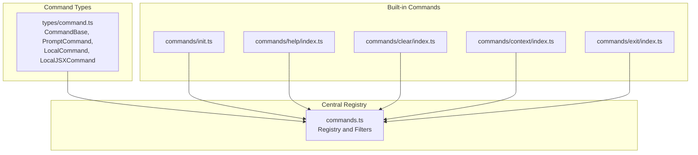
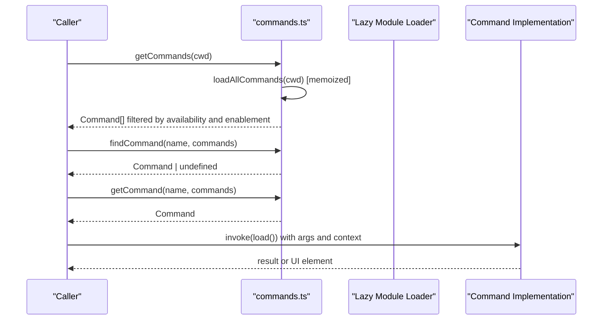
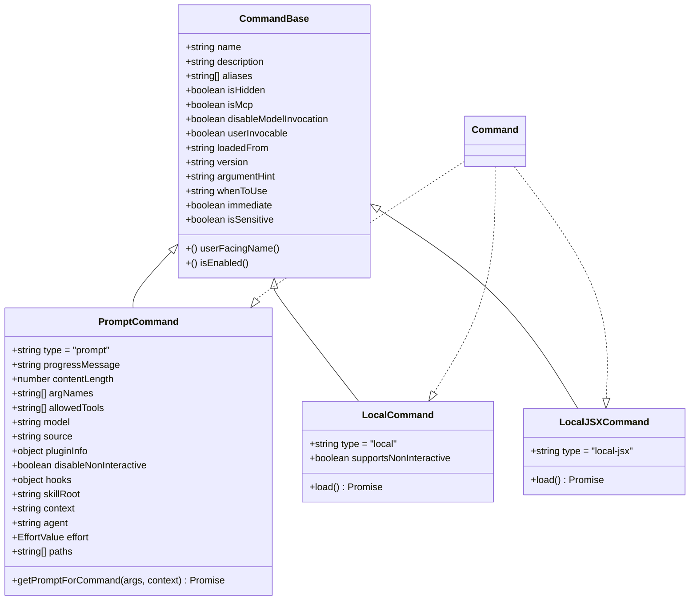
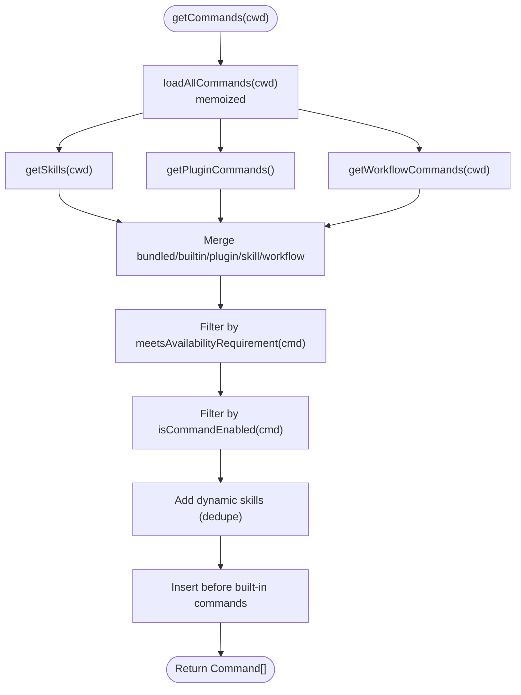
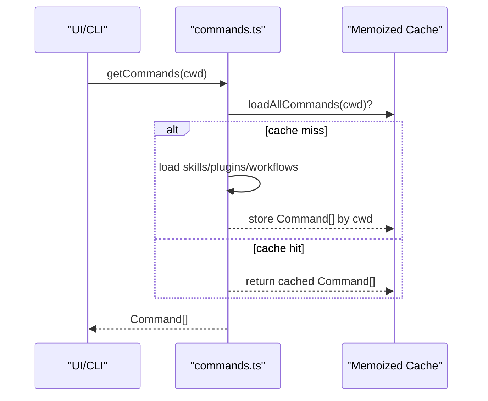
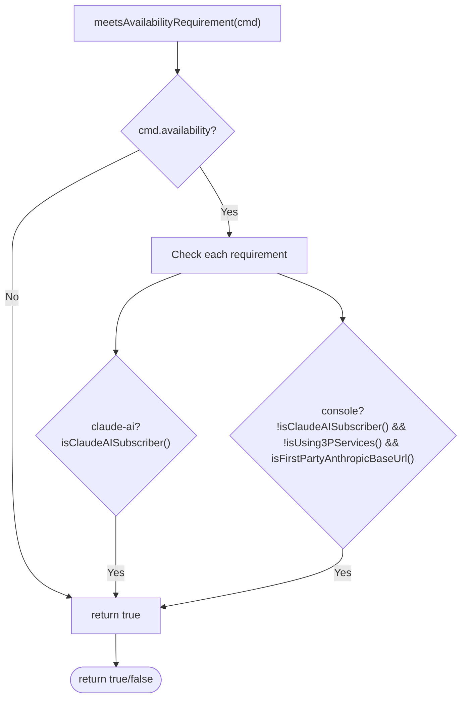
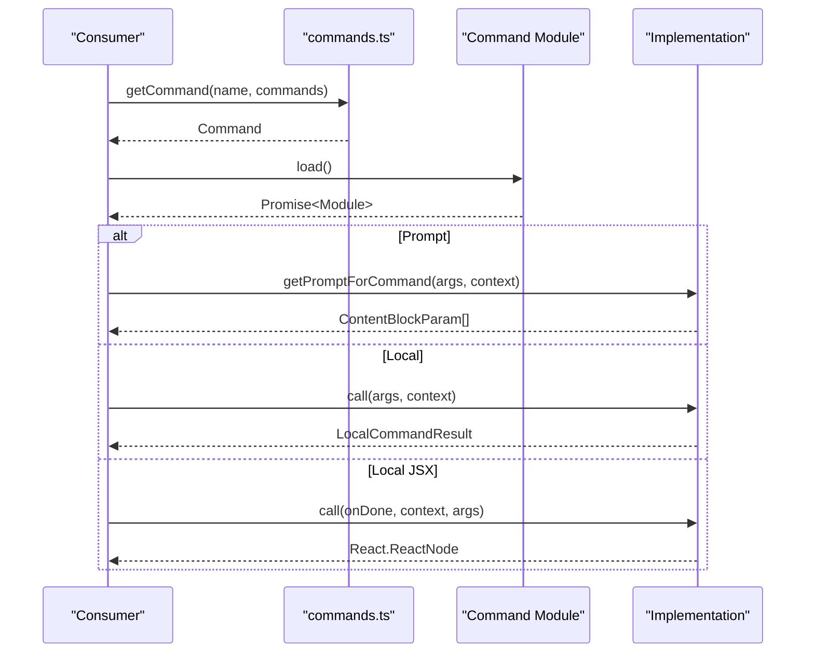
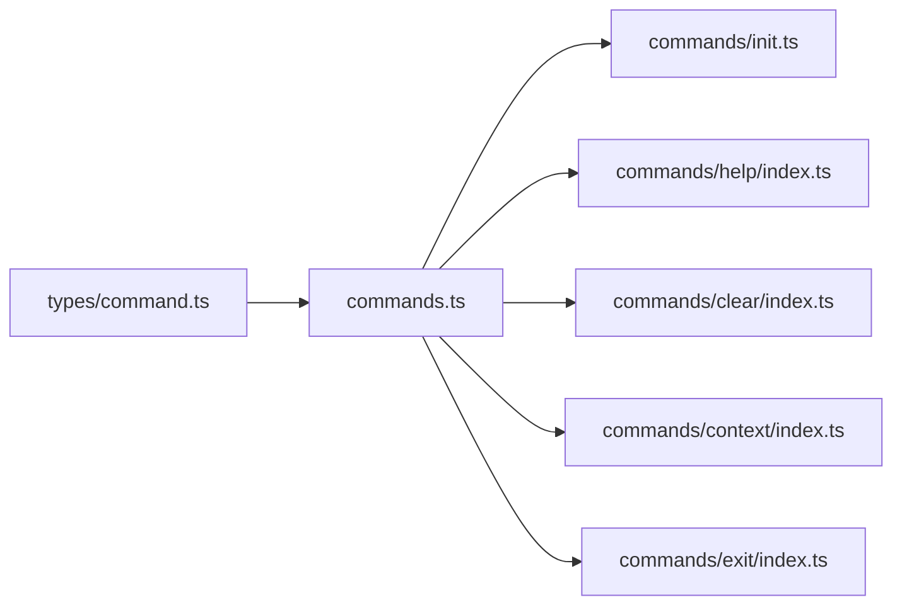

# Command Architecture

<cite>
**Referenced Files in This Document**
- [types/command.ts](file://claude_code_src/restored-src/src/types/command.ts)
- [commands.ts](file://claude_code_src/restored-src/src/commands.ts)
- [commands/init.ts](file://claude_code_src/restored-src/src/commands/init.ts)
- [commands/help/index.ts](file://claude_code_src/restored-src/src/commands/help/index.ts)
- [commands/clear/index.ts](file://claude_code_src/restored-src/src/commands/clear/index.ts)
- [commands/context/index.ts](file://claude_code_src/restored-src/src/commands/context/index.ts)
- [commands/exit/index.ts](file://claude_code_src/restored-src/src/commands/exit/index.ts)
</cite>

## Table of Contents
1. [Introduction](#introduction)
2. [Project Structure](#project-structure)
3. [Core Components](#core-components)
4. [Architecture Overview](#architecture-overview)
5. [Detailed Component Analysis](#detailed-component-analysis)
6. [Dependency Analysis](#dependency-analysis)
7. [Performance Considerations](#performance-considerations)
8. [Troubleshooting Guide](#troubleshooting-guide)
9. [Conclusion](#conclusion)

## Introduction
This document explains the command architecture used by the application. It covers the Command interface, the three command types (prompt, local, local-jsx), the centralized command registry, the command loading mechanism, memoization strategies, availability filtering, and the command lifecycle from registration to execution. It also documents parameter handling, error management, performance optimizations, and practical examples of registration patterns and type definitions.

## Project Structure
The command system is defined centrally and composed from multiple sources:
- Type definitions for commands and command metadata live in a dedicated types file.
- A central registry aggregates built-in commands, skills, plugins, workflows, and MCP sources.
- Individual command modules define metadata and lazy-loading behavior.
- Some commands are conditionally included based on feature flags and environment.

**Diagram sources**
- [commands.ts:207-222](file://claude_code_src/restored-src/src/commands.ts#L207-L222)
- [types/command.ts:175-206](file://claude_code_src/restored-src/src/types/command.ts#L175-L206)
- [commands/init.ts:226-254](file://claude_code_src/restored-src/src/commands/init.ts#L226-L254)
- [commands/help/index.ts:3-8](file://claude_code_src/restored-src/src/commands/help/index.ts#L3-L8)
- [commands/clear/index.ts:10-17](file://claude_code_src/restored-src/src/commands/clear/index.ts#L10-L17)
- [commands/context/index.ts:4-24](file://claude_code_src/restored-src/src/commands/context/index.ts#L4-L24)
- [commands/exit/index.ts:3-10](file://claude_code_src/restored-src/src/commands/exit/index.ts#L3-L10)

**Section sources**
- [commands.ts:1-222](file://claude_code_src/restored-src/src/commands.ts#L1-L222)
- [types/command.ts:1-217](file://claude_code_src/restored-src/src/types/command.ts#L1-L217)

## Core Components
- Command interface and types:
  - CommandBase defines shared metadata (name, description, aliases, availability, enablement flags, etc.).
  - PromptCommand describes commands that expand into model prompts.
  - LocalCommand describes commands executed locally with synchronous call semantics.
  - LocalJSXCommand describes commands that render UI and are lazy-loaded.
  - Helper functions resolve user-facing names and enablement status.

- Centralized registry:
  - Aggregates built-in commands, skills, plugins, workflows, and MCP sources.
  - Provides memoized loaders and filters for availability, enablement, and remote safety.
  - Exposes helpers to find, format, and filter commands.

- Command modules:
  - Each command module exports a metadata object with type and lazy loader.
  - Some commands expose multiple variants (e.g., interactive vs non-interactive).

**Section sources**
- [types/command.ts:175-217](file://claude_code_src/restored-src/src/types/command.ts#L175-L217)
- [commands.ts:207-222](file://claude_code_src/restored-src/src/commands.ts#L207-L222)
- [commands/init.ts:226-254](file://claude_code_src/restored-src/src/commands/init.ts#L226-L254)
- [commands/help/index.ts:3-8](file://claude_code_src/restored-src/src/commands/help/index.ts#L3-L8)
- [commands/clear/index.ts:10-17](file://claude_code_src/restored-src/src/commands/clear/index.ts#L10-L17)
- [commands/context/index.ts:4-24](file://claude_code_src/restored-src/src/commands/context/index.ts#L4-L24)
- [commands/exit/index.ts:3-10](file://claude_code_src/restored-src/src/commands/exit/index.ts#L3-L10)

## Architecture Overview
The command architecture follows a layered design:
- Types layer defines the contract for all commands.
- Registry layer composes sources, applies filters, and exposes memoized views.
- Command modules provide metadata and lazy-loaded implementations.
- Consumers (CLI/UI) resolve commands by name and invoke them with appropriate contexts.

**Diagram sources**
- [commands.ts:476-517](file://claude_code_src/restored-src/src/commands.ts#L476-L517)
- [commands.ts:688-719](file://claude_code_src/restored-src/src/commands.ts#L688-L719)

## Detailed Component Analysis

### Command Types and Interfaces
- CommandBase: Shared metadata and flags (availability, enablement, visibility, aliases, etc.).
- PromptCommand: Model-invocable commands that produce prompt content blocks.
- LocalCommand: Synchronous local commands with a load() returning a callable module.
- LocalJSXCommand: UI-rendering commands with a load() returning a React component factory.
- Helpers: getCommandName, isCommandEnabled.

**Diagram sources**
- [types/command.ts:175-206](file://claude_code_src/restored-src/src/types/command.ts#L175-L206)

**Section sources**
- [types/command.ts:16-217](file://claude_code_src/restored-src/src/types/command.ts#L16-L217)

### Centralized Command Registry
- Built-in commands are aggregated in a memoized list and filtered by availability and enablement.
- Skills, plugins, workflows, and MCP sources are loaded asynchronously and merged.
- Dynamic skills discovered during file operations are inserted between plugin skills and built-ins.
- Availability filtering considers auth/provider requirements and is evaluated fresh on each request.
- Enablement filtering respects feature flags and environment checks.
- Remote-safe and bridge-safe sets pre-filter commands for remote and cross-client execution.

**Diagram sources**
- [commands.ts:449-517](file://claude_code_src/restored-src/src/commands.ts#L449-L517)
- [commands.ts:417-443](file://claude_code_src/restored-src/src/commands.ts#L417-L443)

**Section sources**
- [commands.ts:256-346](file://claude_code_src/restored-src/src/commands.ts#L256-L346)
- [commands.ts:417-443](file://claude_code_src/restored-src/src/commands.ts#L417-L443)
- [commands.ts:449-517](file://claude_code_src/restored-src/src/commands.ts#L449-L517)

### Command Loading Mechanism and Memoization
- Built-in commands list is memoized to avoid repeated composition.
- Skills and plugin commands are loaded concurrently and memoized by cwd.
- Skill tool and slash-command skill caches are memoized for performance.
- Command memoization caches can be cleared independently to refresh dynamic skills.

**Diagram sources**
- [commands.ts:449-469](file://claude_code_src/restored-src/src/commands.ts#L449-L469)
- [commands.ts:523-539](file://claude_code_src/restored-src/src/commands.ts#L523-L539)

**Section sources**
- [commands.ts:169-169](file://claude_code_src/restored-src/src/commands.ts#L169-L169)
- [commands.ts:258-346](file://claude_code_src/restored-src/src/commands.ts#L258-L346)
- [commands.ts:449-469](file://claude_code_src/restored-src/src/commands.ts#L449-L469)
- [commands.ts:523-539](file://claude_code_src/restored-src/src/commands.ts#L523-L539)

### Availability Filtering and Provider Gating
- Availability is evaluated per command against auth/provider requirements.
- Universal commands (without availability) are always shown.
- Auth checks are performed fresh on each call to reflect login state changes.

**Diagram sources**
- [commands.ts:417-443](file://claude_code_src/restored-src/src/commands.ts#L417-L443)

**Section sources**
- [commands.ts:417-443](file://claude_code_src/restored-src/src/commands.ts#L417-L443)

### Command Lifecycle: Registration to Execution
- Registration: Each command module exports a metadata object with type, name, description, and a load() function.
- Discovery: Central registry imports all command modules and merges sources.
- Resolution: Consumers call findCommand/getCommand to locate a command by name or alias.
- Execution:
  - Prompt commands: getPromptForCommand(args, context) returns prompt content blocks.
  - Local commands: load() returns a module with a call(args, context) method.
  - Local JSX commands: load() returns a module with a call(onDone, context, args) that renders UI.

**Diagram sources**
- [commands.ts:688-719](file://claude_code_src/restored-src/src/commands.ts#L688-L719)
- [types/command.ts:53-56](file://claude_code_src/restored-src/src/types/command.ts#L53-L56)
- [types/command.ts:62-65](file://claude_code_src/restored-src/src/types/command.ts#L62-L65)
- [types/command.ts:131-135](file://claude_code_src/restored-src/src/types/command.ts#L131-L135)

**Section sources**
- [commands.ts:688-719](file://claude_code_src/restored-src/src/commands.ts#L688-L719)
- [types/command.ts:53-56](file://claude_code_src/restored-src/src/types/command.ts#L53-L56)
- [types/command.ts:62-65](file://claude_code_src/restored-src/src/types/command.ts#L62-L65)
- [types/command.ts:131-135](file://claude_code_src/restored-src/src/types/command.ts#L131-L135)

### Parameter Handling and Error Management
- Parameter handling:
  - Prompt commands receive args and context; they return prompt content blocks.
  - Local commands receive args and a context object suitable for local execution.
  - Local JSX commands receive onDone callback, context, and args; they render UI and communicate results via onDone.
- Error management:
  - Skill and plugin loading failures are caught and logged; the system continues with available commands.
  - getCommands/getSkillToolCommands/getSlashCommandToolSkills return empty arrays on failure to avoid breaking the UI.

**Section sources**
- [commands.ts:353-398](file://claude_code_src/restored-src/src/commands.ts#L353-L398)
- [commands.ts:587-608](file://claude_code_src/restored-src/src/commands.ts#L587-L608)

### Examples of Command Registration Patterns
- Prompt command registration pattern:
  - Define a metadata object with type "prompt", name, description, contentLength, progressMessage, source, and getPromptForCommand().
  - Example reference: [commands/init.ts:226-254](file://claude_code_src/restored-src/src/commands/init.ts#L226-L254)

- Local command registration pattern:
  - Define a metadata object with type "local", name, description, supportsNonInteractive, and load() returning a module with call().
  - Example reference: [commands/clear/index.ts:10-17](file://claude_code_src/restored-src/src/commands/clear/index.ts#L10-L17)

- Local JSX command registration pattern:
  - Define a metadata object with type "local-jsx", name, description, and load() returning a module with call().
  - Example reference: [commands/help/index.ts:3-8](file://claude_code_src/restored-src/src/commands/help/index.ts#L3-L8), [commands/exit/index.ts:3-10](file://claude_code_src/restored-src/src/commands/exit/index.ts#L3-L10)

- Dual-mode command pattern:
  - Provide both interactive and non-interactive variants with isEnabled/isHidden toggles.
  - Example reference: [commands/context/index.ts:4-24](file://claude_code_src/restored-src/src/commands/context/index.ts#L4-L24)

**Section sources**
- [commands/init.ts:226-254](file://claude_code_src/restored-src/src/commands/init.ts#L226-L254)
- [commands/clear/index.ts:10-17](file://claude_code_src/restored-src/src/commands/clear/index.ts#L10-L17)
- [commands/help/index.ts:3-8](file://claude_code_src/restored-src/src/commands/help/index.ts#L3-L8)
- [commands/exit/index.ts:3-10](file://claude_code_src/restored-src/src/commands/exit/index.ts#L3-L10)
- [commands/context/index.ts:4-24](file://claude_code_src/restored-src/src/commands/context/index.ts#L4-L24)

### Relationship Between Commands and Broader System Architecture
- Commands integrate with:
  - Skills and workflows for model-invocable capabilities.
  - Plugins and MCP for extensibility and third-party integrations.
  - UI layer via Local JSX commands for interactive experiences.
  - Remote and bridge contexts via safety filters and allowlists.
- Consumers:
  - CLI and REPL use getCommands/findCommand/getCommand to resolve and execute commands.
  - UI components rely on Local JSX commands for rendering.

**Section sources**
- [commands.ts:547-559](file://claude_code_src/restored-src/src/commands.ts#L547-L559)
- [commands.ts:619-686](file://claude_code_src/restored-src/src/commands.ts#L619-L686)

## Dependency Analysis
- Internal dependencies:
  - types/command.ts defines the canonical Command type used across the registry and command modules.
  - commands.ts depends on skills, plugins, workflows, and MCP sources to assemble the final command list.
- External dependencies:
  - Memoization library is used for caching command lists and derived views.
  - Feature flags and environment variables gate conditional inclusion of commands.

**Diagram sources**
- [types/command.ts:207-221](file://claude_code_src/restored-src/src/types/command.ts#L207-L221)
- [commands.ts:207-222](file://claude_code_src/restored-src/src/commands.ts#L207-L222)
- [commands/init.ts:226-254](file://claude_code_src/restored-src/src/commands/init.ts#L226-L254)
- [commands/help/index.ts:3-8](file://claude_code_src/restored-src/src/commands/help/index.ts#L3-L8)
- [commands/clear/index.ts:10-17](file://claude_code_src/restored-src/src/commands/clear/index.ts#L10-L17)
- [commands/context/index.ts:4-24](file://claude_code_src/restored-src/src/commands/context/index.ts#L4-L24)
- [commands/exit/index.ts:3-10](file://claude_code_src/restored-src/src/commands/exit/index.ts#L3-L10)

**Section sources**
- [commands.ts:1-222](file://claude_code_src/restored-src/src/commands.ts#L1-L222)

## Performance Considerations
- Memoization:
  - Built-in commands list is memoized to avoid recomposition.
  - Skills and plugin loading is memoized by cwd to reduce disk I/O and dynamic import overhead.
  - Derived caches (skill tool commands, slash-command skills) are memoized for repeated queries.
- Asynchronous loading:
  - Heavy modules are lazy-loaded via load() to improve startup time.
  - Parallel loading of skills, plugins, and workflows reduces total latency.
- Safety filtering:
  - Availability and enablement checks are performed fresh to reflect runtime state without recomputing expensive sources.
- Remote and bridge safety:
  - Allowlists prevent unsafe commands from executing remotely, avoiding unnecessary work.

[No sources needed since this section provides general guidance]

## Troubleshooting Guide
- Command not found:
  - Use getCommand to retrieve a command by name or alias; it throws if not found with a descriptive message listing available commands.
  - Reference: [commands.ts:704-719](file://claude_code_src/restored-src/src/commands.ts#L704-L719)
- Command not visible:
  - Check availability requirements and enablement flags; availability is evaluated fresh and may depend on auth state.
  - Reference: [commands.ts:417-443](file://claude_code_src/restored-src/src/commands.ts#L417-L443), [commands.ts:213-216](file://claude_code_src/restored-src/src/commands.ts#L213-L216)
- Remote execution issues:
  - Verify isBridgeSafeCommand and REMOTE_SAFE_COMMANDS; only prompt and explicitly allowed local commands are permitted.
  - Reference: [commands.ts:619-686](file://claude_code_src/restored-src/src/commands.ts#L619-L686), [commands.ts:672-676](file://claude_code_src/restored-src/src/commands.ts#L672-L676)
- Performance problems:
  - Clear memoization caches when dynamic skills change; use clearCommandMemoizationCaches to invalidate caches.
  - Reference: [commands.ts:523-539](file://claude_code_src/restored-src/src/commands.ts#L523-L539)

**Section sources**
- [commands.ts:704-719](file://claude_code_src/restored-src/src/commands.ts#L704-L719)
- [commands.ts:417-443](file://claude_code_src/restored-src/src/commands.ts#L417-L443)
- [commands.ts:619-686](file://claude_code_src/restored-src/src/commands.ts#L619-L686)
- [commands.ts:672-676](file://claude_code_src/restored-src/src/commands.ts#L672-L676)
- [commands.ts:523-539](file://claude_code_src/restored-src/src/commands.ts#L523-L539)

## Conclusion
The command architecture provides a robust, extensible, and performant foundation for composing, discovering, and executing commands across the system. Its type-driven design, centralized registry, memoization strategy, and safety filters ensure predictable behavior, efficient resource usage, and seamless integration with UI, CLI, and remote environments.