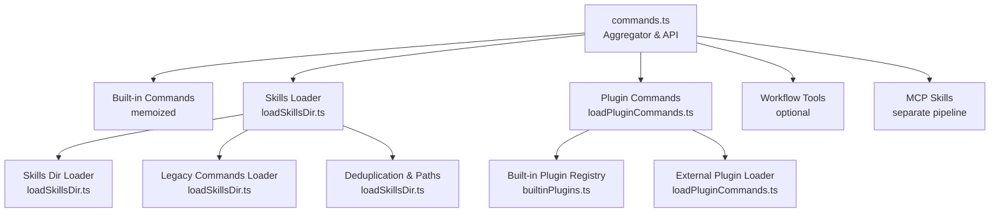
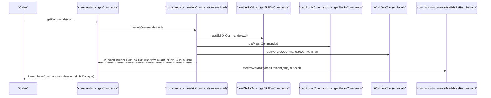
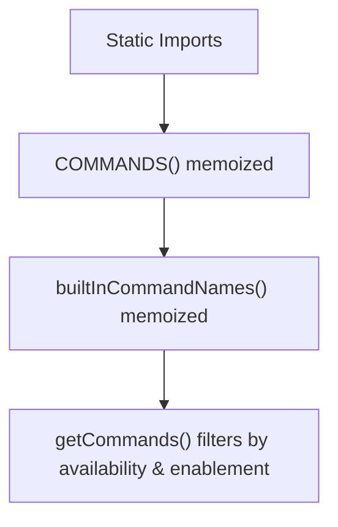
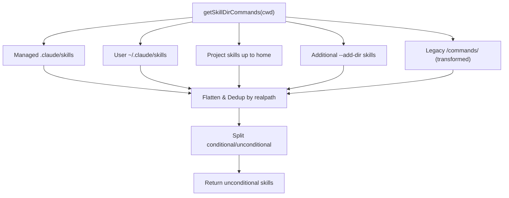
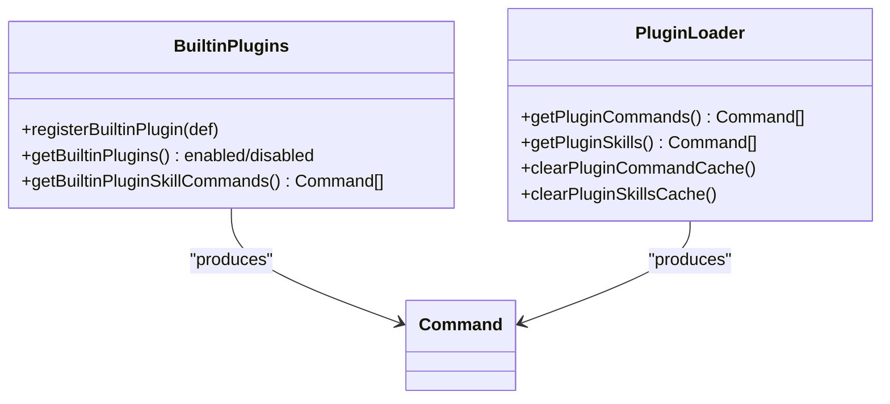
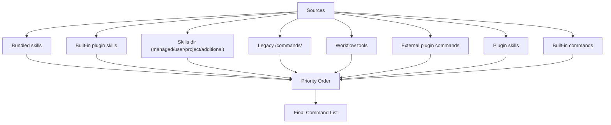
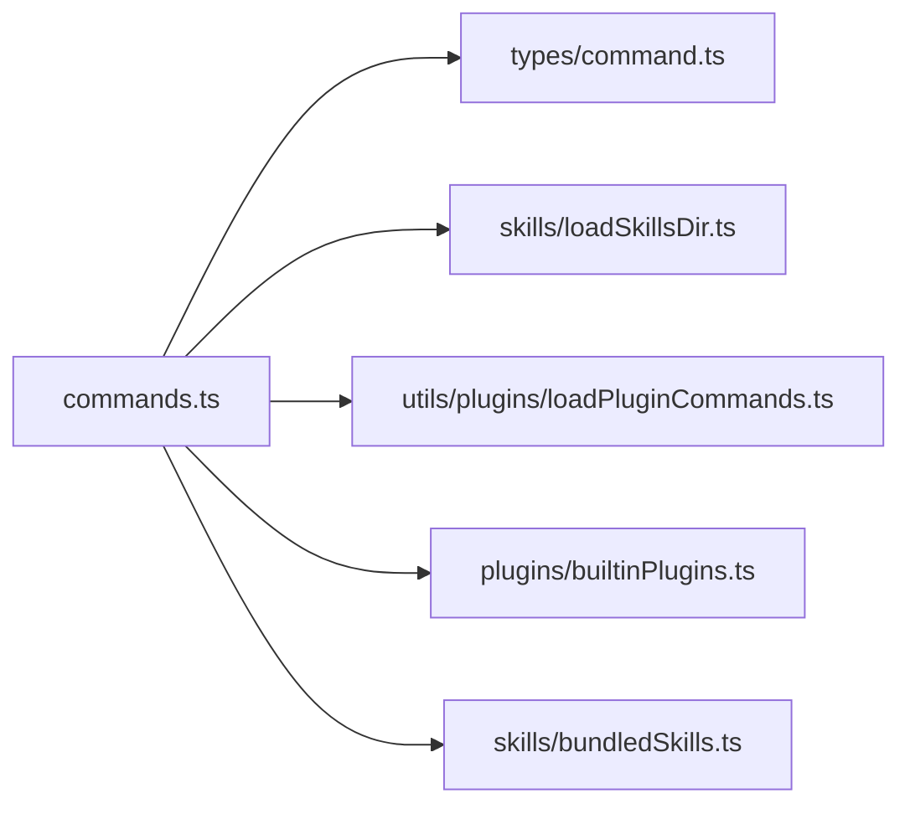

# Command Discovery and Loading

<cite>
**Referenced Files in This Document**
- [commands.ts](file://claude_code_src/restored-src/src/commands.ts)
- [loadSkillsDir.ts](file://claude_code_src/restored-src/src/skills/loadSkillsDir.ts)
- [builtinPlugins.ts](file://claude_code_src/restored-src/src/plugins/builtinPlugins.ts)
- [bundledSkills.ts](file://claude_code_src/restored-src/src/skills/bundledSkills.ts)
- [loadPluginCommands.ts](file://claude_code_src/restored-src/src/utils/plugins/loadPluginCommands.ts)
- [command.ts](file://claude_code_src/restored-src/src/types/command.ts)
</cite>

## Table of Contents
1. [Introduction](#introduction)
2. [Project Structure](#project-structure)
3. [Core Components](#core-components)
4. [Architecture Overview](#architecture-overview)
5. [Detailed Component Analysis](#detailed-component-analysis)
6. [Dependency Analysis](#dependency-analysis)
7. [Performance Considerations](#performance-considerations)
8. [Troubleshooting Guide](#troubleshooting-guide)
9. [Conclusion](#conclusion)

## Introduction
This document explains the command discovery and loading system that aggregates built-in commands, skills from user/project directories, plugin-provided commands, and workflow tools. It covers how commands are dynamically loaded, memoized, cached, and integrated across sources. It also documents conflict resolution, priority ordering, and patterns for dynamic command registration, skill-based command creation, and plugin command integration.

## Project Structure
The command system is centered around a single aggregation module that imports and merges commands from multiple sources:
- Built-in commands: statically imported and memoized
- Skills: loaded from user/project/plugin-managed directories and legacy locations
- Plugins: commands from enabled built-in plugins and external plugin packages
- Workflows: optional workflow tools created from scripts
- MCP skills: model-invocable skills loaded from MCP servers

**Diagram sources**
- [commands.ts:258-469](file://claude_code_src/restored-src/src/commands.ts#L258-L469)
- [loadSkillsDir.ts:638-800](file://claude_code_src/restored-src/src/skills/loadSkillsDir.ts#L638-L800)
- [builtinPlugins.ts:108-121](file://claude_code_src/restored-src/src/plugins/builtinPlugins.ts#L108-L121)
- [loadPluginCommands.ts](file://claude_code_src/restored-src/src/utils/plugins/loadPluginCommands.ts)

**Section sources**
- [commands.ts:1-755](file://claude_code_src/restored-src/src/commands.ts#L1-L755)

## Core Components
- Aggregation and memoization:
  - Built-in commands are collected and memoized to avoid repeated computation.
  - The full command list is memoized by working directory to cache expensive I/O and dynamic imports.
- Availability gating:
  - A per-call filter enforces provider/auth availability before enabling commands.
- Dynamic skills insertion:
  - Dynamic skills discovered during file operations are inserted between plugin skills and built-in commands.
- Filtering APIs:
  - Dedicated memoized functions expose filtered views for model-facing skill listings and slash-command skill sets.

Key exports and functions:
- getCommands(cwd): returns the final command list for a given working directory
- getSkillToolCommands(cwd): returns prompt-type commands suitable for model invocation
- getSlashCommandToolSkills(cwd): returns prompt-type commands exposed as slash commands
- getMcpSkillCommands(mcpCommands): returns MCP-provided skills meeting criteria
- clearCommandsCache(): clears memoization and related caches

**Section sources**
- [commands.ts:258-581](file://claude_code_src/restored-src/src/commands.ts#L258-L581)

## Architecture Overview
The system orchestrates multiple sources of commands and skills, applying availability checks, filtering, and prioritization.

**Diagram sources**
- [commands.ts:449-517](file://claude_code_src/restored-src/src/commands.ts#L449-L517)
- [loadSkillsDir.ts:638-714](file://claude_code_src/restored-src/src/skills/loadSkillsDir.ts#L638-L714)
- [loadPluginCommands.ts](file://claude_code_src/restored-src/src/utils/plugins/loadPluginCommands.ts)

## Detailed Component Analysis

### Built-in Commands Aggregation
- Static imports define the baseline command set.
- Memoization ensures the base list is computed once and reused.
- Availability gating and enablement checks are applied per-call to reflect runtime conditions.

**Diagram sources**
- [commands.ts:258-351](file://claude_code_src/restored-src/src/commands.ts#L258-L351)

**Section sources**
- [commands.ts:258-351](file://claude_code_src/restored-src/src/commands.ts#L258-L351)

### Skills Directory Loader
- Loads skills from:
  - Managed policies directory (.claude/skills)
  - User settings directory (~/.claude/skills)
  - Project directories up to home
  - Additional directories configured by the user
  - Legacy /commands/ directory (single-file or directory format)
- Supports conditional skills via frontmatter paths; stores them for later activation.
- Deduplicates by canonical file identity to handle symlinks and overlapping parents.
- Converts frontmatter into a rich command definition with optional arguments, allowed tools, effort, and shell execution hints.

**Diagram sources**
- [loadSkillsDir.ts:638-800](file://claude_code_src/restored-src/src/skills/loadSkillsDir.ts#L638-L800)

**Section sources**
- [loadSkillsDir.ts:638-800](file://claude_code_src/restored-src/src/skills/loadSkillsDir.ts#L638-L800)

### Plugin Command Integration
- External plugin commands are loaded via a dedicated loader.
- Built-in plugin skills are provided by a registry of built-in plugins; only enabled plugins contribute skills.
- Both sources are merged into the command list alongside skills from directories.

**Diagram sources**
- [builtinPlugins.ts:108-121](file://claude_code_src/restored-src/src/plugins/builtinPlugins.ts#L108-L121)
- [loadPluginCommands.ts](file://claude_code_src/restored-src/src/utils/plugins/loadPluginCommands.ts)

**Section sources**
- [builtinPlugins.ts:108-121](file://claude_code_src/restored-src/src/plugins/builtinPlugins.ts#L108-L121)
- [loadPluginCommands.ts](file://claude_code_src/restored-src/src/utils/plugins/loadPluginCommands.ts)

### Workflow Tools
- Optional workflow tools are created from scripts when a feature flag is enabled.
- They integrate seamlessly into the command list alongside other sources.

**Section sources**
- [commands.ts:400-406](file://claude_code_src/restored-src/src/commands.ts#L400-L406)

### Command Priority and Conflict Resolution
- Priority order (top to bottom):
  1) Bundled skills
  2) Built-in plugin skills
  3) Skills from /skills/ directories and legacy /commands/
  4) Workflow tools (optional)
  5) External plugin commands
  6) Built-in commands
- Dynamic skills discovered during file operations are inserted between plugin skills and built-in commands, avoiding duplicates by name.
- Deduplication is performed by canonical file identity to prevent loading the same skill from multiple paths.

**Diagram sources**
- [commands.ts:460-468](file://claude_code_src/restored-src/src/commands.ts#L460-L468)
- [loadSkillsDir.ts:742-763](file://claude_code_src/restored-src/src/skills/loadSkillsDir.ts#L742-L763)

**Section sources**
- [commands.ts:460-517](file://claude_code_src/restored-src/src/commands.ts#L460-L517)
- [loadSkillsDir.ts:742-790](file://claude_code_src/restored-src/src/skills/loadSkillsDir.ts#L742-L790)

### Dynamic Command Registration Patterns
- Dynamic skills discovered during file operations are appended after plugin skills and before built-in commands, only if not already present by name.
- This pattern allows on-the-fly exposure of skills tied to recently edited files while preserving deterministic ordering.

**Section sources**
- [commands.ts:479-517](file://claude_code_src/restored-src/src/commands.ts#L479-L517)

### Skill-Based Command Creation
- Skills are parsed from markdown frontmatter and transformed into prompt-type commands with optional arguments, allowed tools, effort, and shell execution directives.
- Conditional skills (with paths frontmatter) are stored for later activation when matching files are touched.

**Section sources**
- [loadSkillsDir.ts:185-265](file://claude_code_src/restored-src/src/skills/loadSkillsDir.ts#L185-L265)
- [loadSkillsDir.ts:270-401](file://claude_code_src/restored-src/src/skills/loadSkillsDir.ts#L270-L401)
- [loadSkillsDir.ts:771-790](file://claude_code_src/restored-src/src/skills/loadSkillsDir.ts#L771-L790)

### Plugin Command Integration Patterns
- Built-in plugins expose skills that are converted into commands and included in the command list.
- External plugins contribute commands and skills via a loader that is memoized and can be cleared independently.

**Section sources**
- [builtinPlugins.ts:108-121](file://claude_code_src/restored-src/src/plugins/builtinPlugins.ts#L108-L121)
- [loadPluginCommands.ts](file://claude_code_src/restored-src/src/utils/plugins/loadPluginCommands.ts)

## Dependency Analysis
- Centralized command type definitions are imported to ensure consistent typing across loaders.
- The aggregator depends on:
  - Skills loader for directory-based and legacy commands
  - Plugin loader for external and built-in plugin commands
  - Optional workflow tool creator
  - Utility functions for availability gating and enablement checks

**Diagram sources**
- [commands.ts:210-168](file://claude_code_src/restored-src/src/commands.ts#L210-L168)
- [command.ts](file://claude_code_src/restored-src/src/types/command.ts)

**Section sources**
- [commands.ts:210-168](file://claude_code_src/restored-src/src/commands.ts#L210-L168)

## Performance Considerations
- Memoization:
  - Built-in commands list is memoized.
  - The full command list is memoized by working directory to avoid repeated I/O and dynamic imports.
  - Skill tool and slash-command skill views are memoized to accelerate repeated queries.
- Parallel loading:
  - Multiple sources (skills, plugins, workflows) are loaded concurrently.
- Lazy loading:
  - Some heavy modules are dynamically imported only when needed.
- Deduplication:
  - Canonical file identity is used to avoid redundant processing of symlinked or duplicated files.
- Caching invalidation:
  - Dedicated cache-clearing functions allow refreshing command lists when dynamic skills or plugin states change.

**Section sources**
- [commands.ts:258-581](file://claude_code_src/restored-src/src/commands.ts#L258-L581)
- [loadSkillsDir.ts:725-763](file://claude_code_src/restored-src/src/skills/loadSkillsDir.ts#L725-L763)

## Troubleshooting Guide
- Symptom: Commands not appearing
  - Verify availability gating: commands gated by provider/auth may be hidden until conditions are met.
  - Confirm enablement: commands must pass the enablement check to appear in the final list.
  - Check dynamic skills: ensure dynamic skills are not shadowed by existing built-in or plugin commands with the same name.
- Symptom: Duplicate skills
  - Deduplication uses canonical file identity; ensure paths are not overlapping or symlinked unexpectedly.
- Symptom: Slow command list retrieval
  - The command list is memoized by cwd; clear caches only when dynamic skills or plugin states change.
  - Use cache-clearing functions to refresh after adding/removing skills or toggling plugins.
- Symptom: MCP skills missing
  - Ensure the feature flag for MCP skills is enabled and that MCP-provided commands meet the criteria for inclusion.

**Section sources**
- [commands.ts:417-443](file://claude_code_src/restored-src/src/commands.ts#L417-L443)
- [commands.ts:523-539](file://claude_code_src/restored-src/src/commands.ts#L523-L539)
- [loadSkillsDir.ts:742-763](file://claude_code_src/restored-src/src/skills/loadSkillsDir.ts#L742-L763)

## Conclusion
The command discovery and loading system integrates multiple sources—built-in commands, skills from user/project directories, plugin-provided commands, optional workflow tools, and MCP skills—into a single, prioritized, and filtered command list. It leverages memoization, parallel loading, and robust deduplication to balance correctness, performance, and flexibility. Availability gating and enablement checks ensure commands are appropriate for the current runtime context, while dynamic skill insertion supports on-demand exposure of skills tied to file operations.