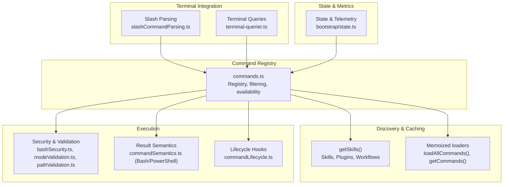
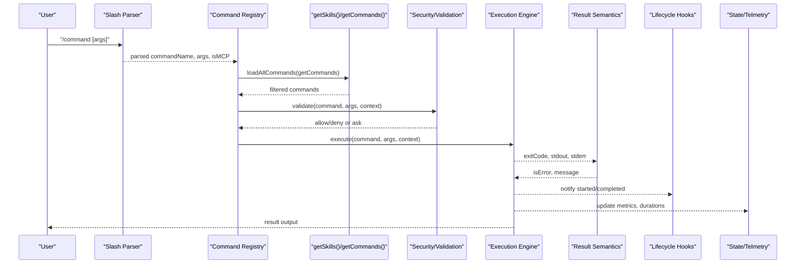
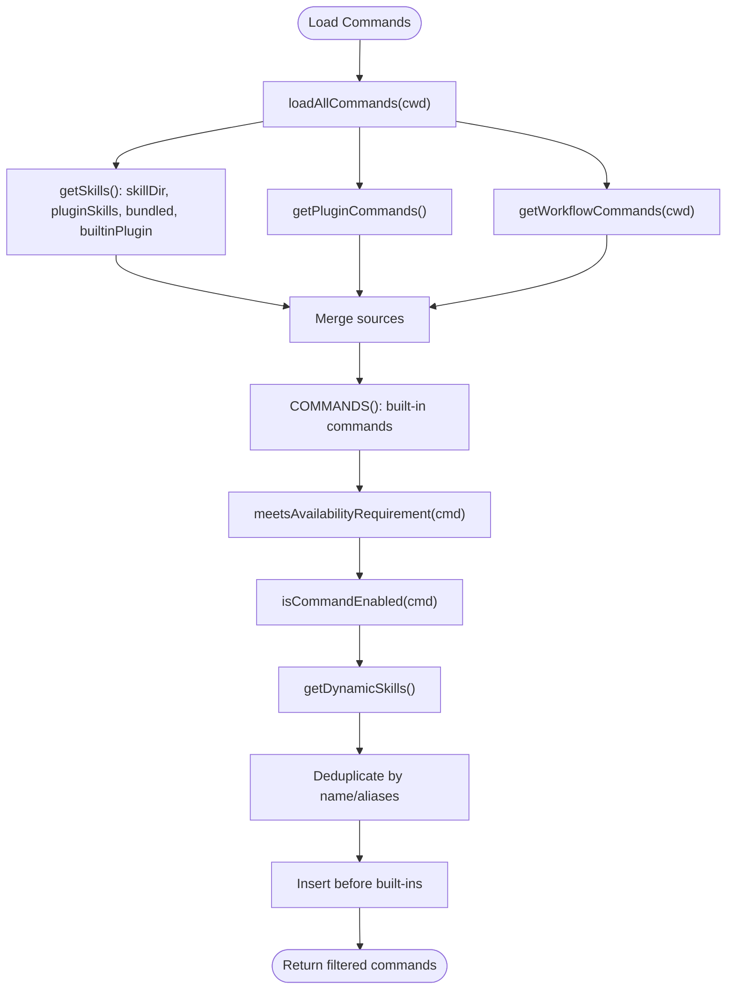
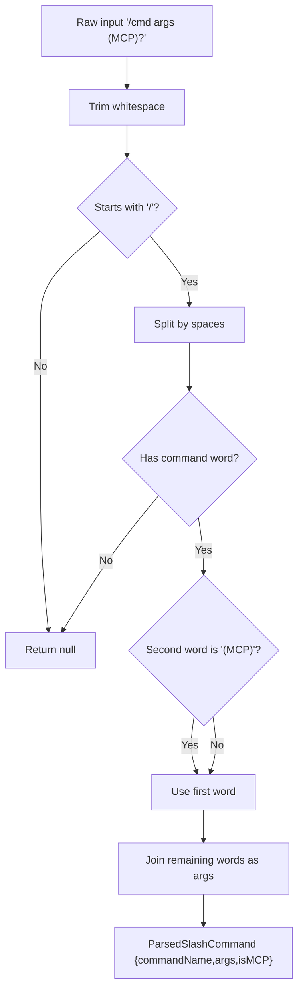
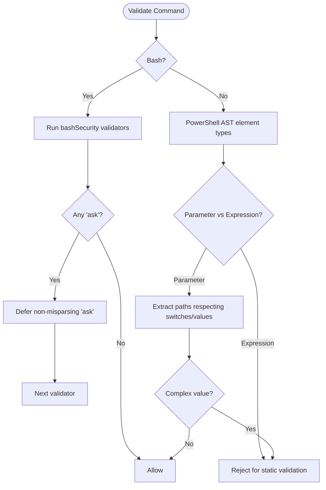
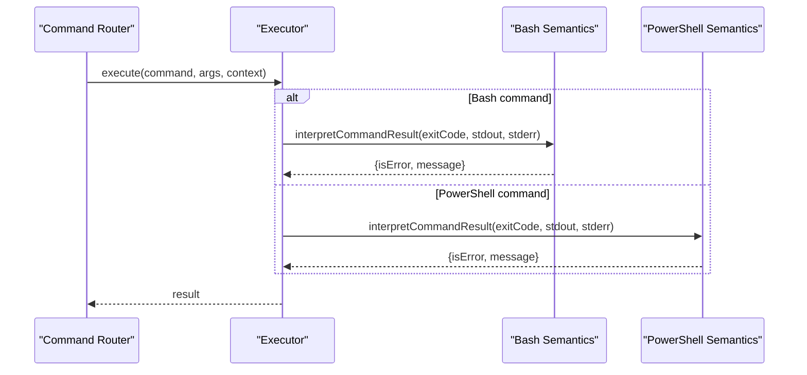
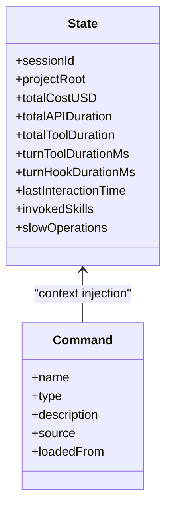
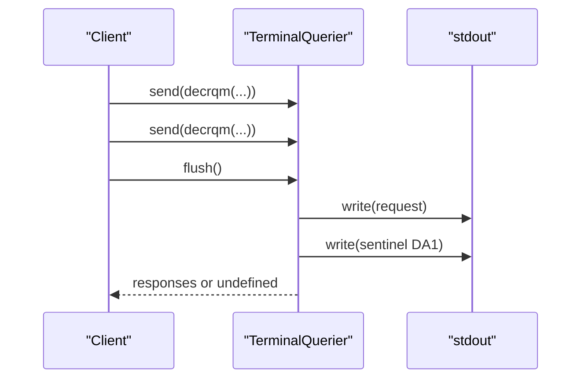
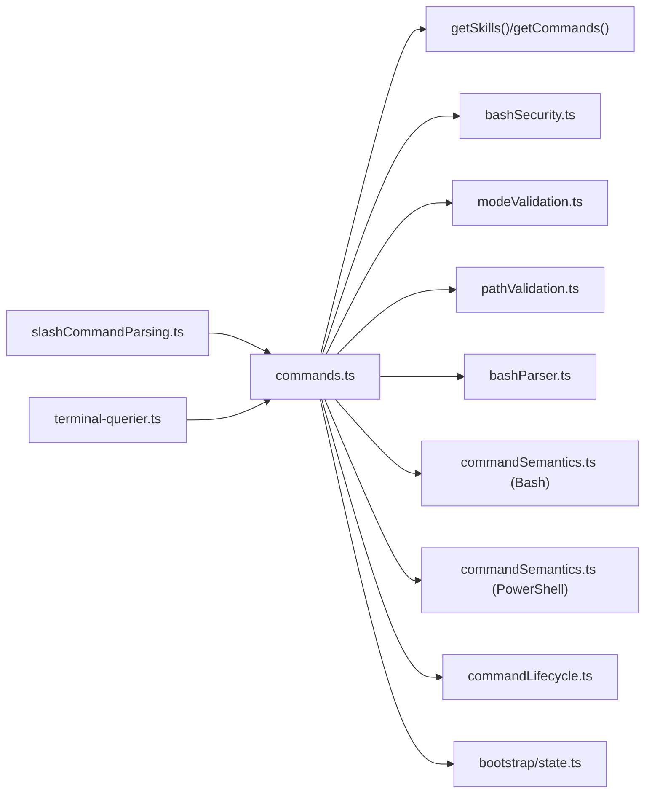

# Command Execution Pipeline

<cite>
**Referenced Files in This Document**
- [commands.ts](file://claude_code_src/restored-src/src/commands.ts)
- [state.ts](file://claude_code_src/restored-src/src/bootstrap/state.ts)
- [slashCommandParsing.ts](file://claude_code_src/restored-src/src/utils/slashCommandParsing.ts)
- [commandLifecycle.ts](file://claude_code_src/restored-src/src/utils/commandLifecycle.ts)
- [terminal-querier.ts](file://claude_code_src/restored-src/src/ink/terminal-querier.ts)
- [bashParser.ts](file://claude_code_src/restored-src/src/utils/bash/bashParser.ts)
- [parser.ts](file://claude_code_src/restored-src/src/utils/powershell/parser.ts)
- [modeValidation.ts](file://claude_code_src/restored-src/src/tools/PowerShellTool/modeValidation.ts)
- [pathValidation.ts](file://claude_code_src/restored-src/src/tools/PowerShellTool/pathValidation.ts)
- [bashSecurity.ts](file://claude_code_src/restored-src/src/tools/BashTool/bashSecurity.ts)
- [commandSemantics.ts (Bash)](file://claude_code_src/restored-src/src/tools/BashTool/commandSemantics.ts)
- [commandSemantics.ts (PowerShell)](file://claude_code_src/restored-src/src/tools/PowerShellTool/commandSemantics.ts)
</cite>

## Table of Contents
1. [Introduction](#introduction)
2. [Project Structure](#project-structure)
3. [Core Components](#core-components)
4. [Architecture Overview](#architecture-overview)
5. [Detailed Component Analysis](#detailed-component-analysis)
6. [Dependency Analysis](#dependency-analysis)
7. [Performance Considerations](#performance-considerations)
8. [Troubleshooting Guide](#troubleshooting-guide)
9. [Conclusion](#conclusion)

## Introduction
This document explains the command execution pipeline and processing system. It covers command discovery, validation, routing, parameter parsing, context injection, execution, and result handling. It also documents error handling strategies, performance monitoring, debugging techniques, asynchronous processing, and integration with the terminal interface. Finally, it addresses command lifecycle management and state preservation during execution.

## Project Structure
The command system centers around a registry of commands, dynamic discovery of skills and plugins, and a consistent execution model. Supporting utilities parse and validate command inputs, enforce security policies, and interpret results. Terminal integration is handled via a query interface that safely interacts with the terminal without blocking input.

**Diagram sources**
- [commands.ts:256-517](file://claude_code_src/restored-src/src/commands.ts#L256-L517)
- [slashCommandParsing.ts:25-60](file://claude_code_src/restored-src/src/utils/slashCommandParsing.ts#L25-L60)
- [bashSecurity.ts:2571-2592](file://claude_code_src/restored-src/src/tools/BashTool/bashSecurity.ts#L2571-L2592)
- [modeValidation.ts:244-268](file://claude_code_src/restored-src/src/tools/PowerShellTool/modeValidation.ts#L244-L268)
- [pathValidation.ts:767-1449](file://claude_code_src/restored-src/src/tools/PowerShellTool/pathValidation.ts#L767-L1449)
- [commandSemantics.ts (Bash):124-140](file://claude_code_src/restored-src/src/tools/BashTool/commandSemantics.ts#L124-L140)
- [commandSemantics.ts (PowerShell):130-142](file://claude_code_src/restored-src/src/tools/PowerShellTool/commandSemantics.ts#L130-L142)
- [commandLifecycle.ts:16-21](file://claude_code_src/restored-src/src/utils/commandLifecycle.ts#L16-L21)
- [terminal-querier.ts:128-175](file://claude_code_src/restored-src/src/ink/terminal-querier.ts#L128-L175)
- [state.ts:45-257](file://claude_code_src/restored-src/src/bootstrap/state.ts#L45-L257)

**Section sources**
- [commands.ts:256-517](file://claude_code_src/restored-src/src/commands.ts#L256-L517)
- [slashCommandParsing.ts:25-60](file://claude_code_src/restored-src/src/utils/slashCommandParsing.ts#L25-L60)
- [terminal-querier.ts:128-175](file://claude_code_src/restored-src/src/ink/terminal-querier.ts#L128-L175)

## Core Components
- Command registry and discovery: central registry aggregates built-in, plugin, workflow, and skill commands; filters by availability and enablement; deduplicates dynamic skills; memoizes expensive loads.
- Slash command parsing: extracts command name, arguments, and MCP flag from user input.
- Security and validation: Bash and PowerShell validators apply static analysis and security checks; PowerShell-specific AST-aware parsing and path extraction; Bash AST-like parsing for pipelines and redirections.
- Result semantics: interprets exit codes and output to determine success/error for reporting.
- Lifecycle hooks: notifies listeners when a command starts and completes.
- Terminal integration: safe query interface for terminal capabilities without blocking input.
- State and telemetry: global state tracks session metrics, durations, and operational flags.

**Section sources**
- [commands.ts:449-517](file://claude_code_src/restored-src/src/commands.ts#L449-L517)
- [slashCommandParsing.ts:25-60](file://claude_code_src/restored-src/src/utils/slashCommandParsing.ts#L25-L60)
- [bashSecurity.ts:2571-2592](file://claude_code_src/restored-src/src/tools/BashTool/bashSecurity.ts#L2571-L2592)
- [modeValidation.ts:244-268](file://claude_code_src/restored-src/src/tools/PowerShellTool/modeValidation.ts#L244-L268)
- [pathValidation.ts:767-1449](file://claude_code_src/restored-src/src/tools/PowerShellTool/pathValidation.ts#L767-L1449)
- [commandSemantics.ts (Bash):124-140](file://claude_code_src/restored-src/src/tools/BashTool/commandSemantics.ts#L124-L140)
- [commandSemantics.ts (PowerShell):130-142](file://claude_code_src/restored-src/src/tools/PowerShellTool/commandSemantics.ts#L130-L142)
- [commandLifecycle.ts:16-21](file://claude_code_src/restored-src/src/utils/commandLifecycle.ts#L16-L21)
- [terminal-querier.ts:128-175](file://claude_code_src/restored-src/src/ink/terminal-querier.ts#L128-L175)
- [state.ts:45-257](file://claude_code_src/restored-src/src/bootstrap/state.ts#L45-L257)

## Architecture Overview
The pipeline begins with input parsing, followed by command discovery and filtering. Commands are routed to appropriate execution contexts (local, prompt, JSX), validated for safety, executed, and results interpreted. Telemetry and lifecycle hooks track execution, while terminal queries integrate with the TUI.

**Diagram sources**
- [slashCommandParsing.ts:25-60](file://claude_code_src/restored-src/src/utils/slashCommandParsing.ts#L25-L60)
- [commands.ts:449-517](file://claude_code_src/restored-src/src/commands.ts#L449-L517)
- [bashSecurity.ts:2571-2592](file://claude_code_src/restored-src/src/tools/BashTool/bashSecurity.ts#L2571-L2592)
- [modeValidation.ts:244-268](file://claude_code_src/restored-src/src/tools/PowerShellTool/modeValidation.ts#L244-L268)
- [pathValidation.ts:767-1449](file://claude_code_src/restored-src/src/tools/PowerShellTool/pathValidation.ts#L767-L1449)
- [commandSemantics.ts (Bash):124-140](file://claude_code_src/restored-src/src/tools/BashTool/commandSemantics.ts#L124-L140)
- [commandSemantics.ts (PowerShell):130-142](file://claude_code_src/restored-src/src/tools/PowerShellTool/commandSemantics.ts#L130-L142)
- [commandLifecycle.ts:16-21](file://claude_code_src/restored-src/src/utils/commandLifecycle.ts#L16-L21)
- [state.ts:45-257](file://claude_code_src/restored-src/src/bootstrap/state.ts#L45-L257)

## Detailed Component Analysis

### Command Discovery and Filtering
- Central registry aggregates commands from multiple sources: built-ins, skills, plugins, workflows, and MCP-provided skills. It deduplicates dynamic skills and inserts them at the correct position relative to built-in commands.
- Availability filtering respects provider requirements (e.g., console vs. claude.ai) and feature flags. Enablement checks ensure commands are active.
- Memoization avoids repeated disk I/O and dynamic imports; caches can be cleared when dynamic skills change.

**Diagram sources**
- [commands.ts:449-517](file://claude_code_src/restored-src/src/commands.ts#L449-L517)

**Section sources**
- [commands.ts:449-517](file://claude_code_src/restored-src/src/commands.ts#L449-L517)

### Parameter Parsing and Routing
- Slash command parsing splits the input into command name, optional MCP marker, and arguments. It supports MCP commands with a special token to route to MCP-provided tools.
- Routing is implicit: the registry resolves the command by name or alias, and the executor selects the appropriate handler based on command type (local, prompt, JSX).

**Diagram sources**
- [slashCommandParsing.ts:25-60](file://claude_code_src/restored-src/src/utils/slashCommandParsing.ts#L25-L60)

**Section sources**
- [slashCommandParsing.ts:25-60](file://claude_code_src/restored-src/src/utils/slashCommandParsing.ts#L25-L60)

### Validation and Security
- Bash validation applies a series of validators, deferring “ask” decisions to later if they are not misparsing-related; otherwise, it returns immediately to prompt the user. This ensures correctness for ambiguous cases.
- PowerShell validation:
  - AST element type is used to distinguish parameters from expressions, preventing accidental allowance of unsafe constructs.
  - Path extraction considers parameter forms (dash and colon), switch parameters, and complex values (arrays, subexpressions, variables) to avoid validating unresolvable paths.
  - Pipeline segments that contain expression sources or non-PipelineAst redirections are rejected for static validation.
- Bash AST-like parsing:
  - Pipelines and redirections are parsed with careful handling of hoisted redirections and operator associativity.
  - And/or chains are parsed left-associatively, preserving redirections across chained statements.

**Diagram sources**
- [bashSecurity.ts:2571-2592](file://claude_code_src/restored-src/src/tools/BashTool/bashSecurity.ts#L2571-L2592)
- [modeValidation.ts:244-268](file://claude_code_src/restored-src/src/tools/PowerShellTool/modeValidation.ts#L244-L268)
- [pathValidation.ts:767-1449](file://claude_code_src/restored-src/src/tools/PowerShellTool/pathValidation.ts#L767-L1449)
- [bashParser.ts:873-973](file://claude_code_src/restored-src/src/utils/bash/bashParser.ts#L873-L973)

**Section sources**
- [bashSecurity.ts:2571-2592](file://claude_code_src/restored-src/src/tools/BashTool/bashSecurity.ts#L2571-L2592)
- [modeValidation.ts:244-268](file://claude_code_src/restored-src/src/tools/PowerShellTool/modeValidation.ts#L244-L268)
- [pathValidation.ts:767-1449](file://claude_code_src/restored-src/src/tools/PowerShellTool/pathValidation.ts#L767-L1449)
- [bashParser.ts:873-973](file://claude_code_src/restored-src/src/utils/bash/bashParser.ts#L873-L973)

### Execution Flow and Result Handling
- Execution routes to the selected command handler based on type. Results are interpreted using command-specific semantics:
  - Bash: heuristic base command extraction and semantic mapping.
  - PowerShell: base command extraction and semantic mapping.
- Result semantics return an isError flag and optional message for user-facing reporting.

**Diagram sources**
- [commandSemantics.ts (Bash):124-140](file://claude_code_src/restored-src/src/tools/BashTool/commandSemantics.ts#L124-L140)
- [commandSemantics.ts (PowerShell):130-142](file://claude_code_src/restored-src/src/tools/PowerShellTool/commandSemantics.ts#L130-L142)

**Section sources**
- [commandSemantics.ts (Bash):124-140](file://claude_code_src/restored-src/src/tools/BashTool/commandSemantics.ts#L124-L140)
- [commandSemantics.ts (PowerShell):130-142](file://claude_code_src/restored-src/src/tools/PowerShellTool/commandSemantics.ts#L130-L142)

### Context Injection and State Preservation
- Context injection occurs during prompt-based commands and tool invocations; the context includes session identifiers, project roots, and telemetry metadata.
- State preserves session identity, metrics, and operational flags across command lifecycles. It tracks durations, costs, and interaction timestamps to support performance monitoring and debugging.

**Diagram sources**
- [state.ts:45-257](file://claude_code_src/restored-src/src/bootstrap/state.ts#L45-L257)
- [commands.ts:207-222](file://claude_code_src/restored-src/src/commands.ts#L207-L222)

**Section sources**
- [state.ts:45-257](file://claude_code_src/restored-src/src/bootstrap/state.ts#L45-L257)
- [commands.ts:207-222](file://claude_code_src/restored-src/src/commands.ts#L207-L222)

### Terminal Integration
- Terminal queries use escape sequences to probe terminal capabilities without blocking input. A sentinel (DA1) ensures isolation of query batches and prevents timeouts.
- This enables safe, non-blocking terminal feature detection and capability reporting.

**Diagram sources**
- [terminal-querier.ts:128-175](file://claude_code_src/restored-src/src/ink/terminal-querier.ts#L128-L175)

**Section sources**
- [terminal-querier.ts:128-175](file://claude_code_src/restored-src/src/ink/terminal-querier.ts#L128-L175)

## Dependency Analysis
- The command registry depends on discovery utilities and memoization to minimize I/O and dynamic imports.
- Security and validation depend on platform-specific parsers and AST helpers.
- Execution depends on semantics and lifecycle hooks; state provides metrics and session context.

**Diagram sources**
- [commands.ts:449-517](file://claude_code_src/restored-src/src/commands.ts#L449-L517)
- [bashSecurity.ts:2571-2592](file://claude_code_src/restored-src/src/tools/BashTool/bashSecurity.ts#L2571-L2592)
- [modeValidation.ts:244-268](file://claude_code_src/restored-src/src/tools/PowerShellTool/modeValidation.ts#L244-L268)
- [pathValidation.ts:767-1449](file://claude_code_src/restored-src/src/tools/PowerShellTool/pathValidation.ts#L767-L1449)
- [bashParser.ts:873-973](file://claude_code_src/restored-src/src/utils/bash/bashParser.ts#L873-L973)
- [commandSemantics.ts (Bash):124-140](file://claude_code_src/restored-src/src/tools/BashTool/commandSemantics.ts#L124-L140)
- [commandSemantics.ts (PowerShell):130-142](file://claude_code_src/restored-src/src/tools/PowerShellTool/commandSemantics.ts#L130-L142)
- [commandLifecycle.ts:16-21](file://claude_code_src/restored-src/src/utils/commandLifecycle.ts#L16-L21)
- [state.ts:45-257](file://claude_code_src/restored-src/src/bootstrap/state.ts#L45-L257)
- [slashCommandParsing.ts:25-60](file://claude_code_src/restored-src/src/utils/slashCommandParsing.ts#L25-L60)
- [terminal-querier.ts:128-175](file://claude_code_src/restored-src/src/ink/terminal-querier.ts#L128-L175)

**Section sources**
- [commands.ts:449-517](file://claude_code_src/restored-src/src/commands.ts#L449-L517)

## Performance Considerations
- Memoization: expensive operations (loading skills, plugins, workflows, and command lists) are memoized to reduce repeated I/O and dynamic imports.
- Deferred timestamp updates: interaction timestamps are batched to avoid frequent Date.now() calls during rapid input.
- Metrics aggregation: cumulative counters and per-turn timers provide insight into tool and hook performance without per-event overhead.
- Terminal queries: non-blocking, batched queries prevent UI stalls and timeouts.

[No sources needed since this section provides general guidance]

## Troubleshooting Guide
- Command not found: the registry throws a descriptive error listing available commands, including aliases.
- Validation failures:
  - Bash: if a validator requests user confirmation, the system defers execution until consent is obtained.
  - PowerShell: AST element types and path extraction rules reject unsafe constructs; complex values are flagged.
- Result interpretation: use command semantics to determine whether an execution indicates an error and to surface actionable messages.
- Lifecycle hooks: attach a listener to monitor command start and completion for debugging execution timing.
- Terminal queries: use the terminal querier to probe capabilities without blocking; unresolved queries return undefined, indicating lack of support.

**Section sources**
- [commands.ts:704-719](file://claude_code_src/restored-src/src/commands.ts#L704-L719)
- [bashSecurity.ts:2571-2592](file://claude_code_src/restored-src/src/tools/BashTool/bashSecurity.ts#L2571-L2592)
- [modeValidation.ts:244-268](file://claude_code_src/restored-src/src/tools/PowerShellTool/modeValidation.ts#L244-L268)
- [pathValidation.ts:767-1449](file://claude_code_src/restored-src/src/tools/PowerShellTool/pathValidation.ts#L767-L1449)
- [commandSemantics.ts (Bash):124-140](file://claude_code_src/restored-src/src/tools/BashTool/commandSemantics.ts#L124-L140)
- [commandSemantics.ts (PowerShell):130-142](file://claude_code_src/restored-src/src/tools/PowerShellTool/commandSemantics.ts#L130-L142)
- [commandLifecycle.ts:16-21](file://claude_code_src/restored-src/src/utils/commandLifecycle.ts#L16-L21)
- [terminal-querier.ts:128-175](file://claude_code_src/restored-src/src/ink/terminal-querier.ts#L128-L175)

## Conclusion
The command execution pipeline integrates discovery, validation, routing, execution, and result interpretation with robust security and performance safeguards. Memoization, lifecycle hooks, and terminal queries provide efficient and observable execution, while state and telemetry preserve context and enable debugging. The system balances flexibility (built-in, plugin, workflow, MCP commands) with safety (AST-aware parsing, parameter validation, and semantics-driven result interpretation).