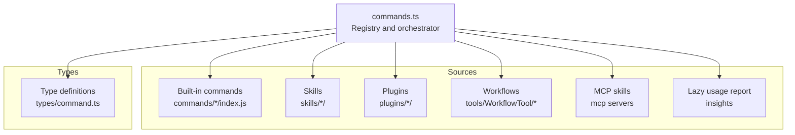
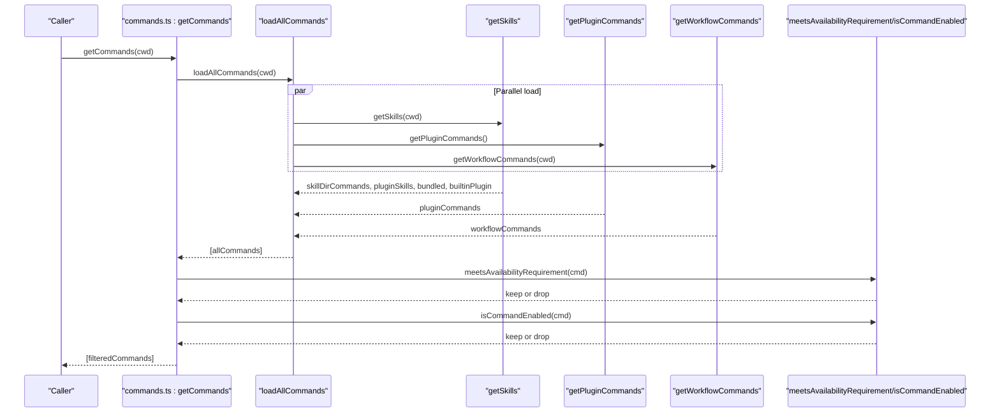
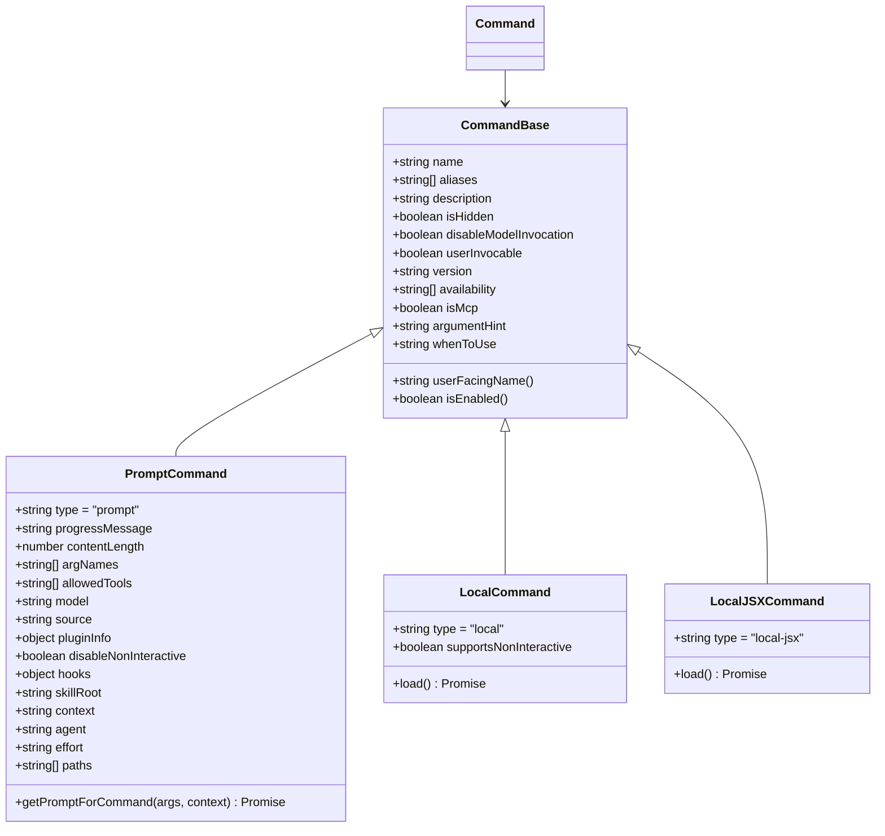
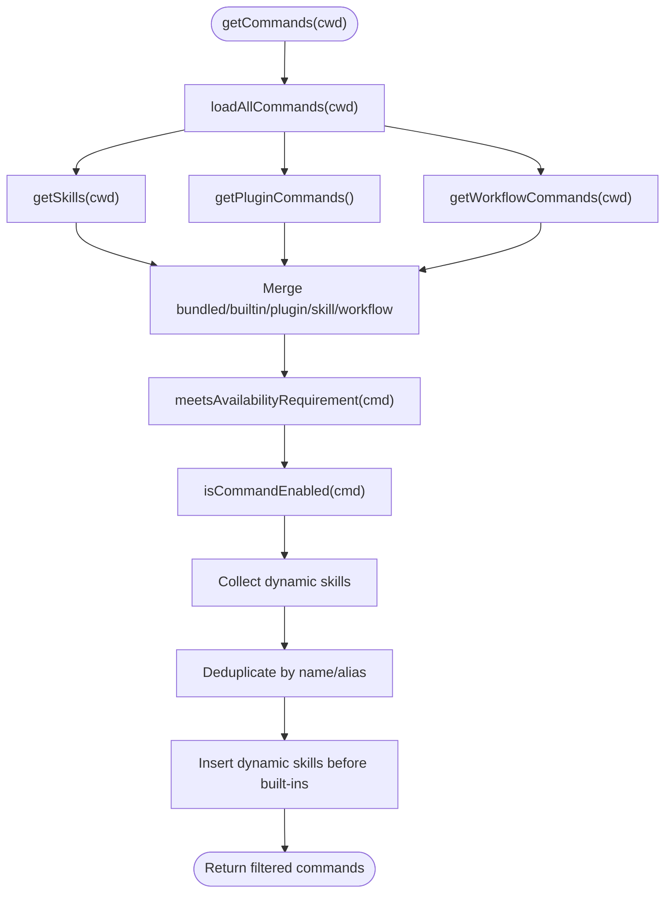
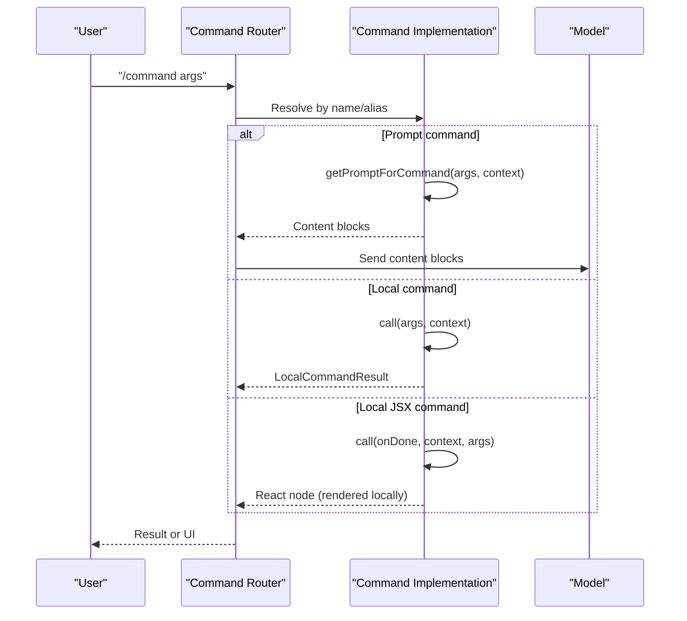
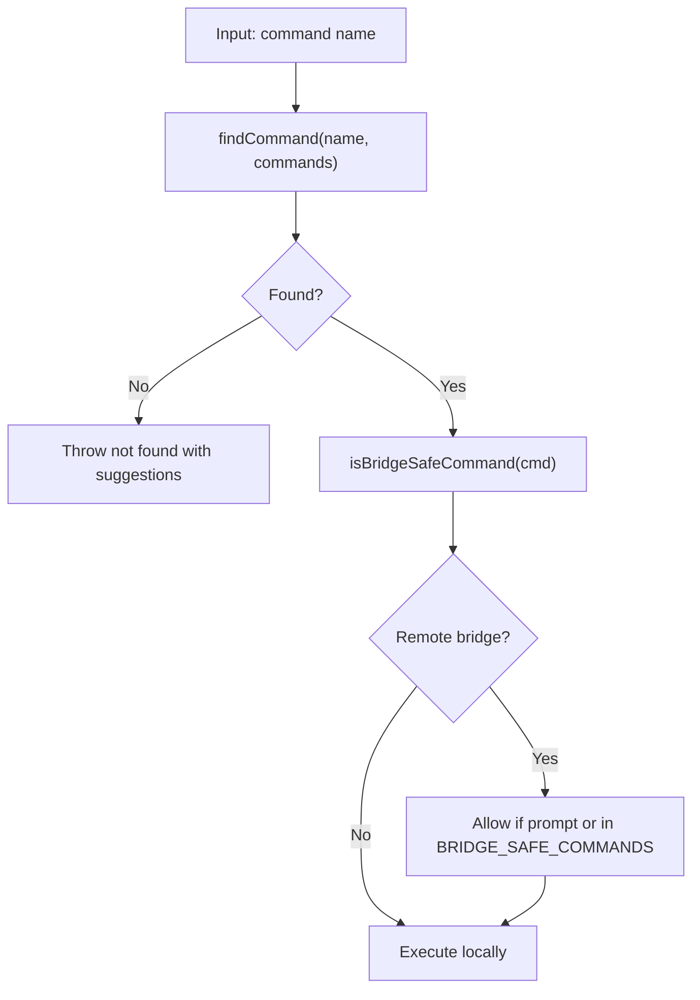
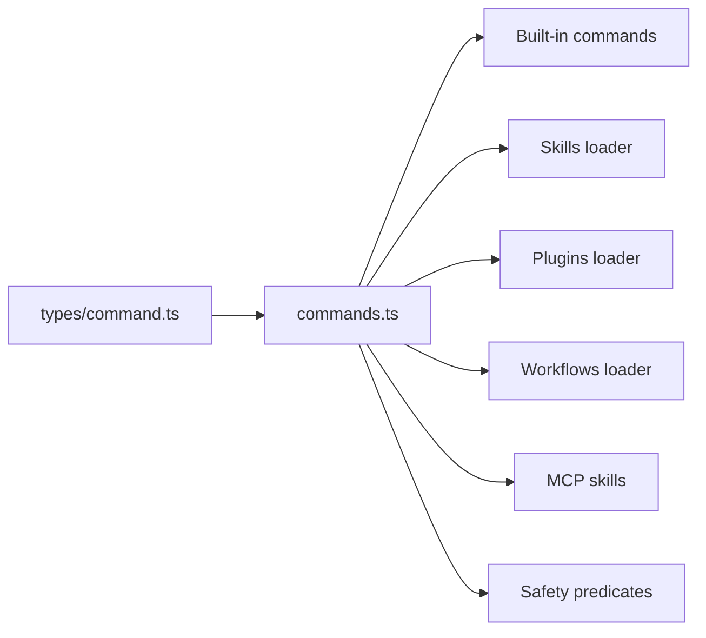

# Command System

<cite>
**Referenced Files in This Document**
- [commands.ts](file://claude_code_src/restored-src/src/commands.ts)
- [command.ts](file://claude_code_src/restored-src/src/types/command.ts)
</cite>

## Table of Contents
1. [Introduction](#introduction)
2. [Project Structure](#project-structure)
3. [Core Components](#core-components)
4. [Architecture Overview](#architecture-overview)
5. [Detailed Component Analysis](#detailed-component-analysis)
6. [Dependency Analysis](#dependency-analysis)
7. [Performance Considerations](#performance-considerations)
8. [Troubleshooting Guide](#troubleshooting-guide)
9. [Conclusion](#conclusion)
10. [Appendices](#appendices)

## Introduction
This document explains the command system architecture used to discover, register, and execute commands across the application. It covers the command interface design, parameter handling, execution pipeline, routing, filtering, and safety controls. It also provides practical usage examples, guidance for creating custom commands, and extension patterns for developers.

The system supports:
- Over forty built-in commands spanning development workflows, project management, collaboration, and configuration
- Dynamic discovery of skills, plugins, and workflows
- Conditional availability based on authentication and provider contexts
- Remote-safe command filtering for mobile/web clients
- Memoized loading for performance
- Rich metadata for UX and model invocation

## Project Structure
The command system is centered around a single registry that aggregates commands from multiple sources and exposes a unified API for discovery, filtering, and execution.

**Diagram sources**
- [commands.ts:258-346](file://claude_code_src/restored-src/src/commands.ts#L258-L346)
- [command.ts:16-217](file://claude_code_src/restored-src/src/types/command.ts#L16-L217)

**Section sources**
- [commands.ts:258-346](file://claude_code_src/restored-src/src/commands.ts#L258-L346)
- [command.ts:16-217](file://claude_code_src/restored-src/src/types/command.ts#L16-L217)

## Core Components
- Command registry and loader
  - Aggregates built-in, skills, plugins, workflows, and MCP commands
  - Applies availability and enablement filters
  - Provides helpers for finding, formatting, and filtering commands
- Command type system
  - Defines three command types: prompt, local, and local-jsx
  - Standardizes metadata, optional tooling hooks, and execution contexts
- Safety and remote-mode controls
  - Explicit allowlists for remote and bridge-safe commands
  - Prevents unsafe UI-rendering or local-only commands from executing remotely

Key exports and utilities:
- getCommands(cwd): returns filtered, ready-to-execute commands
- findCommand(name, commands): resolves by name or alias
- formatDescriptionWithSource(cmd): annotates descriptions for UI
- isBridgeSafeCommand(cmd): determines remote-safety
- REMOTE_SAFE_COMMANDS and BRIDGE_SAFE_COMMANDS sets
- getSkillToolCommands(cwd) and getSlashCommandToolSkills(cwd): model-facing command lists

**Section sources**
- [commands.ts:476-517](file://claude_code_src/restored-src/src/commands.ts#L476-L517)
- [commands.ts:688-719](file://claude_code_src/restored-src/src/commands.ts#L688-L719)
- [commands.ts:728-754](file://claude_code_src/restored-src/src/commands.ts#L728-L754)
- [commands.ts:619-676](file://claude_code_src/restored-src/src/commands.ts#L619-L676)
- [commands.ts:563-608](file://claude_code_src/restored-src/src/commands.ts#L563-L608)
- [command.ts:16-217](file://claude_code_src/restored-src/src/types/command.ts#L16-L217)

## Architecture Overview
The command system follows a layered architecture:
- Discovery layer: loads commands from disk and external providers
- Filtering layer: applies availability, enablement, and deduplication
- Presentation layer: formats descriptions and annotates sources
- Execution layer: routes to appropriate handler based on type

**Diagram sources**
- [commands.ts:449-469](file://claude_code_src/restored-src/src/commands.ts#L449-L469)
- [commands.ts:476-517](file://claude_code_src/restored-src/src/commands.ts#L476-L517)
- [commands.ts:417-443](file://claude_code_src/restored-src/src/commands.ts#L417-L443)
- [commands.ts:213-222](file://claude_code_src/restored-src/src/commands.ts#L213-L222)

## Detailed Component Analysis

### Command Types and Interfaces
The system defines three primary command types:
- Prompt commands: expand to model prompts; often represent skills or workflows
- Local commands: pure text output, no UI rendering
- Local JSX commands: render interactive UI via Ink; not allowed over bridge

Command metadata includes:
- Availability gating (auth/provider)
- Enablement checks (feature flags, environment)
- Aliases, descriptions, and user-facing names
- Tool hooks, context modes, and visibility toggles
- Source attribution (builtin, plugin, bundled, MCP)

**Diagram sources**
- [command.ts:16-217](file://claude_code_src/restored-src/src/types/command.ts#L16-L217)

**Section sources**
- [command.ts:16-217](file://claude_code_src/restored-src/src/types/command.ts#L16-L217)

### Command Registration and Discovery
Registration is centralized in the commands registry:
- Built-in commands are imported and included in a memoized list
- Skills, plugins, and workflows are dynamically loaded with error resilience
- MCP-provided skills are filtered separately for model invocation
- Dynamic skills discovered during file operations are inserted between plugin and built-in commands

**Diagram sources**
- [commands.ts:449-469](file://claude_code_src/restored-src/src/commands.ts#L449-L469)
- [commands.ts:476-517](file://claude_code_src/restored-src/src/commands.ts#L476-L517)
- [commands.ts:483-516](file://claude_code_src/restored-src/src/commands.ts#L483-L516)

**Section sources**
- [commands.ts:449-469](file://claude_code_src/restored-src/src/commands.ts#L449-L469)
- [commands.ts:476-517](file://claude_code_src/restored-src/src/commands.ts#L476-L517)

### Parameter Handling and Execution Pipeline
- Prompt commands receive raw args and a tool-use context; they return content blocks for model consumption
- Local commands accept args and a JSX context; they return text or compact results
- Local JSX commands render UI and return React nodes; they are not executed remotely
- Non-interactive support is gated per command type
- Optional hooks and context modes allow specialized execution (e.g., forking into sub-agents)

**Diagram sources**
- [command.ts:53-56](file://claude_code_src/restored-src/src/types/command.ts#L53-L56)
- [command.ts:62-65](file://claude_code_src/restored-src/src/types/command.ts#L62-L65)
- [command.ts:131-135](file://claude_code_src/restored-src/src/types/command.ts#L131-L135)

**Section sources**
- [command.ts:53-56](file://claude_code_src/restored-src/src/types/command.ts#L53-L56)
- [command.ts:62-65](file://claude_code_src/restored-src/src/types/command.ts#L62-L65)
- [command.ts:131-135](file://claude_code_src/restored-src/src/types/command.ts#L131-L135)

### Routing, Filtering, and Safety Controls
- Name resolution supports exact name, user-facing name, and aliases
- Availability filtering restricts commands by auth/provider context
- Enablement checks gate commands behind feature flags and environment conditions
- Remote and bridge safety sets define which commands can execute remotely
- Dynamic skills are inserted while avoiding duplicates and preserving ordering

**Diagram sources**
- [commands.ts:688-719](file://claude_code_src/restored-src/src/commands.ts#L688-L719)
- [commands.ts:672-676](file://claude_code_src/restored-src/src/commands.ts#L672-L676)
- [commands.ts:619-676](file://claude_code_src/restored-src/src/commands.ts#L619-L676)

**Section sources**
- [commands.ts:688-719](file://claude_code_src/restored-src/src/commands.ts#L688-L719)
- [commands.ts:672-676](file://claude_code_src/restored-src/src/commands.ts#L672-L676)
- [commands.ts:619-676](file://claude_code_src/restored-src/src/commands.ts#L619-L676)

### Practical Examples and Usage Patterns
- Listing commands
  - Use the command registry to fetch available commands for the current working directory
  - Inspect descriptions and sources for context-aware choices
- Executing a command
  - Resolve by name or alias
  - Route to the appropriate handler based on type
  - For prompt commands, expand to content blocks and send to the model
  - For local commands, render text results
  - For local JSX commands, render UI locally
- Remote execution
  - Only prompt and selected local commands are allowed
  - Use the bridge safety predicate to validate commands before dispatch

**Section sources**
- [commands.ts:476-517](file://claude_code_src/restored-src/src/commands.ts#L476-L517)
- [commands.ts:688-719](file://claude_code_src/restored-src/src/commands.ts#L688-L719)
- [commands.ts:672-676](file://claude_code_src/restored-src/src/commands.ts#L672-L676)

### Custom Command Creation and Extension Patterns
- Define a command module exporting either:
  - A prompt command with a getPromptForCommand method
  - A local command with a call method
  - A local JSX command with a load-returning call method
- Register the command in the central registry or expose it via skills/plugins/workflows
- Annotate metadata such as availability, enablement, aliases, and descriptions
- For model invocation, ensure disableModelInvocation is not set and provide a meaningful description or whenToUse

Best practices:
- Keep descriptions concise and user-focused
- Use argumentHint to guide users
- Prefer prompt commands for reusable skills
- Use local JSX commands sparingly and only for local-only UI needs
- Gate commands behind availability and enablement checks

**Section sources**
- [command.ts:16-217](file://claude_code_src/restored-src/src/types/command.ts#L16-L217)
- [commands.ts:258-346](file://claude_code_src/restored-src/src/commands.ts#L258-L346)

## Dependency Analysis
The command system exhibits low coupling and high cohesion:
- Central registry depends on type definitions and utility modules
- Command implementations are isolated and discovered dynamically
- Safety predicates are independent and reusable
- Memoization decouples performance from runtime logic

**Diagram sources**
- [command.ts:16-217](file://claude_code_src/restored-src/src/types/command.ts#L16-L217)
- [commands.ts:258-346](file://claude_code_src/restored-src/src/commands.ts#L258-L346)
- [commands.ts:619-676](file://claude_code_src/restored-src/src/commands.ts#L619-L676)

**Section sources**
- [command.ts:16-217](file://claude_code_src/restored-src/src/types/command.ts#L16-L217)
- [commands.ts:258-346](file://claude_code_src/restored-src/src/commands.ts#L258-L346)
- [commands.ts:619-676](file://claude_code_src/restored-src/src/commands.ts#L619-L676)

## Performance Considerations
- Memoization
  - loadAllCommands caches results by cwd to avoid repeated disk I/O and dynamic imports
  - getSkillToolCommands and getSlashCommandToolSkills cache computed skill lists
  - clearCommandMemoizationCaches invalidates caches when dynamic skills change
- Lazy loading
  - Heavy modules (e.g., usage report) are loaded on demand
- Parallel loading
  - Skills, plugins, and workflows are fetched concurrently
- Minimal recomputation
  - Availability and enablement checks run fresh per call to reflect auth changes

Recommendations:
- Avoid unnecessary rebuilds by using clearCommandMemoizationCaches only when dynamic content changes
- Keep command descriptions and metadata lightweight
- Prefer prompt commands for frequently used skills to reduce UI overhead

**Section sources**
- [commands.ts:449-469](file://claude_code_src/restored-src/src/commands.ts#L449-L469)
- [commands.ts:523-539](file://claude_code_src/restored-src/src/commands.ts#L523-L539)
- [commands.ts:563-608](file://claude_code_src/restored-src/src/commands.ts#L563-L608)

## Troubleshooting Guide
Common issues and resolutions:
- Command not found
  - Verify spelling and aliases; use getCommand to surface available suggestions
- Command not visible
  - Check availability gating and enablement flags; re-run after login or feature flag updates
- Remote execution fails
  - Confirm the command is prompt or in the bridge-safe set; block otherwise
- Performance regressions
  - Clear memoization caches when adding/removing dynamic skills; monitor cache sizes

Diagnostic utilities:
- formatDescriptionWithSource for source-aware descriptions
- getCommandName for user-facing names
- isBridgeSafeCommand for remote safety checks

**Section sources**
- [commands.ts:704-719](file://claude_code_src/restored-src/src/commands.ts#L704-L719)
- [commands.ts:728-754](file://claude_code_src/restored-src/src/commands.ts#L728-L754)
- [commands.ts:672-676](file://claude_code_src/restored-src/src/commands.ts#L672-L676)
- [commands.ts:523-539](file://claude_code_src/restored-src/src/commands.ts#L523-L539)

## Conclusion
The command system provides a robust, extensible foundation for discovering, filtering, and executing commands across diverse sources. Its type system, safety controls, and performance optimizations enable both beginner-friendly usage and advanced customization for developers.

## Appendices

### Built-in Commands Overview
The registry includes numerous built-in commands spanning:
- Development workflows: add-dir, branch, commit, diff, files, rename, rewrite, etc.
- Project management: init, status, tasks, usage, stats, cost, etc.
- Collaboration: context, session, share, feedback, plan, etc.
- Configuration: config, keybindings, model, theme, output-style, etc.
- Utilities: clear, help, exit, upgrade, version, etc.

These are aggregated from multiple sources and filtered by availability and enablement before exposure.

**Section sources**
- [commands.ts:258-346](file://claude_code_src/restored-src/src/commands.ts#L258-L346)