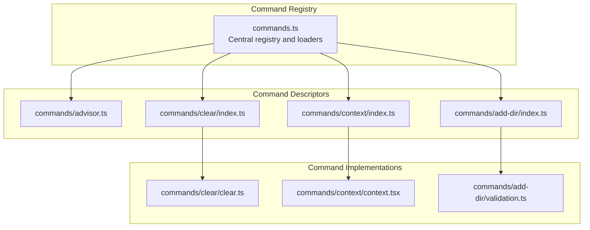
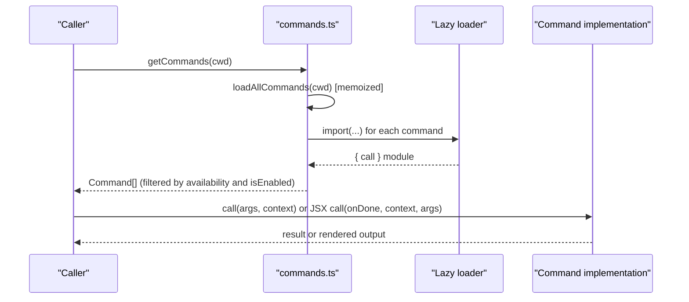
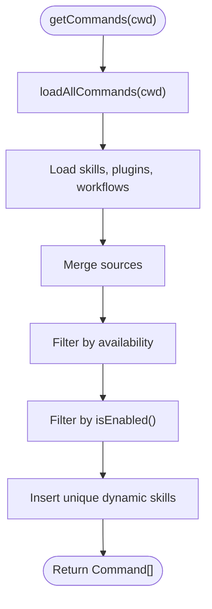
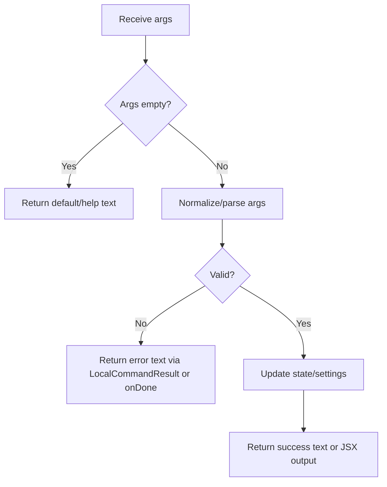
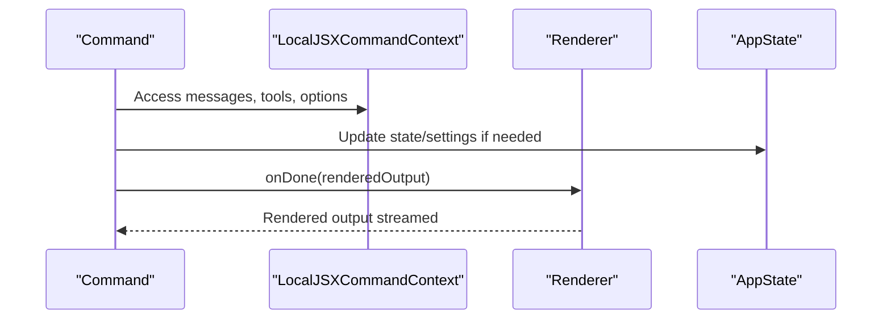
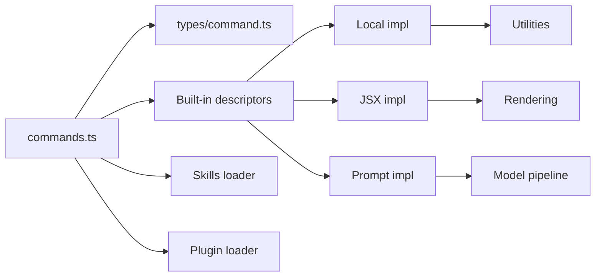

# Custom Command Development

<cite>
**Referenced Files in This Document**
- [types/command.ts](file://claude_code_src/restored-src/src/types/command.ts)
- [commands.ts](file://claude_code_src/restored-src/src/commands.ts)
- [commands/advisor.ts](file://claude_code_src/restored-src/src/commands/advisor.ts)
- [commands/clear/index.ts](file://claude_code_src/restored-src/src/commands/clear/index.ts)
- [commands/clear/clear.ts](file://claude_code_src/restored-src/src/commands/clear/clear.ts)
- [commands/context/index.ts](file://claude_code_src/restored-src/src/commands/context/index.ts)
- [commands/context/context.tsx](file://claude_code_src/restored-src/src/commands/context/context.tsx)
- [commands/add-dir/index.ts](file://claude_code_src/restored-src/src/commands/add-dir/index.ts)
- [commands/add-dir/validation.ts](file://claude_code_src/restored-src/src/commands/add-dir/validation.ts)
</cite>

## Table of Contents
1. [Introduction](#introduction)
2. [Project Structure](#project-structure)
3. [Core Components](#core-components)
4. [Architecture Overview](#architecture-overview)
5. [Detailed Component Analysis](#detailed-component-analysis)
6. [Dependency Analysis](#dependency-analysis)
7. [Performance Considerations](#performance-considerations)
8. [Troubleshooting Guide](#troubleshooting-guide)
9. [Conclusion](#conclusion)
10. [Appendices](#appendices)

## Introduction
This document explains how to develop custom commands in the system. It covers the Command interface, required and optional properties, command types (local, JSX, prompt), parameter handling, integration with system components, registration, testing strategies, validation, error handling, and performance considerations. It also includes step-by-step tutorials for building custom commands, integrating with tools, and extending functionality.

## Project Structure
Commands are organized under a dedicated commands directory. Each command is typically a small descriptor file that declares metadata and lazy-loads its implementation. The central registry aggregates built-in commands, skills, plugins, and dynamic commands.



**Diagram sources**
- [commands.ts](file://claude_code_src/restored-src/src/commands.ts)
- [commands/advisor.ts](file://claude_code_src/restored-src/src/commands/advisor.ts)
- [commands/clear/index.ts](file://claude_code_src/restored-src/src/commands/clear/index.ts)
- [commands/clear/clear.ts](file://claude_code_src/restored-src/src/commands/clear/clear.ts)
- [commands/context/index.ts](file://claude_code_src/restored-src/src/commands/context/index.ts)
- [commands/context/context.tsx](file://claude_code_src/restored-src/src/commands/context/context.tsx)
- [commands/add-dir/index.ts](file://claude_code_src/restored-src/src/commands/add-dir/index.ts)
- [commands/add-dir/validation.ts](file://claude_code_src/restored-src/src/commands/add-dir/validation.ts)

**Section sources**
- [commands.ts](file://claude_code_src/restored-src/src/commands.ts)
- [commands/advisor.ts](file://claude_code_src/restored-src/src/commands/advisor.ts)
- [commands/clear/index.ts](file://claude_code_src/restored-src/src/commands/clear/index.ts)
- [commands/context/index.ts](file://claude_code_src/restored-src/src/commands/context/index.ts)
- [commands/add-dir/index.ts](file://claude_code_src/restored-src/src/commands/add-dir/index.ts)

## Core Components
- Command interface and types define three command kinds:
  - Local command: returns text or compact results; suitable for non-interactive or terminal-only actions.
  - JSX command: renders UI and streams rendered output via onDone; suitable for interactive TUI experiences.
  - Prompt command: expands into model-visible prompts; suitable for skills and workflows.
- Central registry exports helpers to discover, filter, and format commands, and to manage availability and enablement.

Key responsibilities:
- Define command metadata (name, description, aliases, visibility, availability, etc.).
- Choose a command type and implement the appropriate call signature.
- Integrate with context (messages, settings, tools, state).
- Handle parameters and validation.
- Manage performance via lazy loading and memoization.

**Section sources**
- [types/command.ts](file://claude_code_src/restored-src/src/types/command.ts)
- [commands.ts](file://claude_code_src/restored-src/src/commands.ts)

## Architecture Overview
The system loads commands from multiple sources, merges them, and exposes filtered sets for different contexts (e.g., remote-safe, bridge-safe, MCP skills). Commands can be lazy-loaded to reduce startup costs.



**Diagram sources**
- [commands.ts](file://claude_code_src/restored-src/src/commands.ts)
- [types/command.ts](file://claude_code_src/restored-src/src/types/command.ts)

## Detailed Component Analysis

### Command Types and Interfaces
- Local command:
  - Signature: accepts args and a context with state and options; returns a LocalCommandResult.
  - Use cases: non-interactive actions, text responses, compacting context.
- JSX command:
  - Signature: accepts onDone callback, ToolUseContext, and args; returns a React node.
  - Use case: interactive TUI rendering; onDone streams rendered output.
- Prompt command:
  - Signature: getPromptForCommand(args, context) produces model-visible content blocks.
  - Use case: skills and workflows that extend conversation context.

```mermaid
classDiagram
class CommandBase {
+string name
+string description
+string[] aliases
+boolean isHidden
+boolean isMcp
+string argumentHint
+string whenToUse
+string version
+boolean disableModelInvocation
+boolean userInvocable
+string loadedFrom
+string kind
+boolean immediate
+boolean isSensitive
+string userFacingName()
+boolean isEnabled()
}
class PromptCommand {
+string progressMessage
+number contentLength
+string[] argNames
+string[] allowedTools
+string model
+string source
+object pluginInfo
+boolean disableNonInteractive
+object hooks
+string skillRoot
+string context
+string agent
+EffortValue effort
+string[] paths
+getPromptForCommand(args, context) Promise<ContentBlockParam[]>
}
class LocalCommand {
+boolean supportsNonInteractive
+load() Promise<{call}>
}
class LocalJSXCommand {
+load() Promise<{call}>
}
class Command {
}
CommandBase <|-- Command
PromptCommand <.. Command
LocalCommand <.. Command
LocalJSXCommand <.. Command
```

**Diagram sources**
- [types/command.ts](file://claude_code_src/restored-src/src/types/command.ts)

**Section sources**
- [types/command.ts](file://claude_code_src/restored-src/src/types/command.ts)

### Registration and Discovery
- Central registry aggregates built-in commands, skills, plugins, and dynamic commands.
- Availability filtering occurs before enablement checks to hide provider-gated commands.
- Memoization ensures efficient repeated discovery across sessions.



**Diagram sources**
- [commands.ts](file://claude_code_src/restored-src/src/commands.ts)

**Section sources**
- [commands.ts](file://claude_code_src/restored-src/src/commands.ts)

### Parameter Handling and Validation Patterns
- Local commands receive a single args string; parse and validate inside the call function.
- JSX commands can validate early and stream errors via onDone.
- Prompt commands can compute prompt content based on args and context.

Examples:
- Advisor command parses and validates a model argument, updates state, and returns a text result.
- Add directory command validates a path against filesystem and permissions, returning a structured result and a human-readable message.



**Diagram sources**
- [commands/advisor.ts](file://claude_code_src/restored-src/src/commands/advisor.ts)
- [commands/add-dir/validation.ts](file://claude_code_src/restored-src/src/commands/add-dir/validation.ts)

**Section sources**
- [commands/advisor.ts](file://claude_code_src/restored-src/src/commands/advisor.ts)
- [commands/add-dir/validation.ts](file://claude_code_src/restored-src/src/commands/add-dir/validation.ts)

### Integration with System Components
- Context provides access to messages, settings, tools, agent definitions, and state.
- Local commands can update messages and settings; JSX commands render UI and stream output.
- Prompt commands integrate with the model pipeline by generating content blocks.



**Diagram sources**
- [types/command.ts](file://claude_code_src/restored-src/src/types/command.ts)
- [commands/context/context.tsx](file://claude_code_src/restored-src/src/commands/context/context.tsx)

**Section sources**
- [types/command.ts](file://claude_code_src/restored-src/src/types/command.ts)
- [commands/context/context.tsx](file://claude_code_src/restored-src/src/commands/context/context.tsx)

### Step-by-Step Tutorial: Building a Local Command
Goal: Create a command that clears conversation history.

Steps:
1. Create a descriptor file exporting a Command with type "local".
2. Set metadata: name, description, aliases, supportsNonInteractive flag.
3. Implement load() to lazily import the call function.
4. Implement the call function to perform the action and return a LocalCommandResult.
5. Register the command in the central registry if needed.

Reference implementations:
- Descriptor: [commands/clear/index.ts](file://claude_code_src/restored-src/src/commands/clear/index.ts)
- Implementation: [commands/clear/clear.ts](file://claude_code_src/restored-src/src/commands/clear/clear.ts)

**Section sources**
- [commands/clear/index.ts](file://claude_code_src/restored-src/src/commands/clear/index.ts)
- [commands/clear/clear.ts](file://claude_code_src/restored-src/src/commands/clear/clear.ts)

### Step-by-Step Tutorial: Building a JSX Command
Goal: Create a command that renders a visualization of context usage.

Steps:
1. Create a descriptor file exporting a Command with type "local-jsx".
2. Implement load() to lazily import the JSX call function.
3. Implement the JSX call function to compute data, render to ANSI string, and call onDone with the output.
4. Integrate with context to access messages, tools, and state.

Reference implementations:
- Descriptor: [commands/context/index.ts](file://claude_code_src/restored-src/src/commands/context/index.ts)
- Implementation: [commands/context/context.tsx](file://claude_code_src/restored-src/src/commands/context/context.tsx)

**Section sources**
- [commands/context/index.ts](file://claude_code_src/restored-src/src/commands/context/index.ts)
- [commands/context/context.tsx](file://claude_code_src/restored-src/src/commands/context/context.tsx)

### Step-by-Step Tutorial: Adding Validation and Error Handling
Goal: Add robust validation for a command that manipulates the filesystem.

Steps:
1. Define a validation function that returns a discriminated union of outcomes.
2. Map outcomes to user-friendly messages.
3. In the command call, short-circuit on invalid inputs and return error text.
4. For JSX commands, surface validation errors via onDone.

Reference implementations:
- Validation: [commands/add-dir/validation.ts](file://claude_code_src/restored-src/src/commands/add-dir/validation.ts)
- Descriptor: [commands/add-dir/index.ts](file://claude_code_src/restored-src/src/commands/add-dir/index.ts)

**Section sources**
- [commands/add-dir/validation.ts](file://claude_code_src/restored-src/src/commands/add-dir/validation.ts)
- [commands/add-dir/index.ts](file://claude_code_src/restored-src/src/commands/add-dir/index.ts)

### Step-by-Step Tutorial: Extending Functionality with Prompt Commands
Goal: Create a skill-like command that generates model-visible prompts.

Steps:
1. Define a Command with type "prompt".
2. Implement getPromptForCommand(args, context) to produce content blocks.
3. Optionally set context, agent, effort, and other prompt-related options.
4. Register the command in the registry.

Note: Prompt commands integrate with the model pipeline and are suitable for skills and workflows.

**Section sources**
- [types/command.ts](file://claude_code_src/restored-src/src/types/command.ts)

## Dependency Analysis
- Central registry depends on:
  - Built-in command descriptors.
  - Skills discovery and plugin loaders.
  - Feature flags and environment checks.
- Command descriptors depend on:
  - Lazy-loaded implementation modules.
  - Validation utilities where applicable.
- Command implementations depend on:
  - Context for messages, tools, and state.
  - Utilities for rendering (JSX commands).
  - Validation and filesystem operations (when needed).



**Diagram sources**
- [commands.ts](file://claude_code_src/restored-src/src/commands.ts)
- [types/command.ts](file://claude_code_src/restored-src/src/types/command.ts)

**Section sources**
- [commands.ts](file://claude_code_src/restored-src/src/commands.ts)
- [types/command.ts](file://claude_code_src/restored-src/src/types/command.ts)

## Performance Considerations
- Lazy loading: Use load() to defer heavy imports until a command is invoked.
- Memoization: The registry memoizes expensive loads; avoid unnecessary recomputation.
- Non-interactive vs interactive: Prefer local commands for non-interactive tasks; JSX commands render UI and incur rendering overhead.
- Rendering: JSX commands should render to a string and stream via onDone to minimize TUI blocking.
- Filtering: Availability and enablement checks run per call; keep them lightweight.

**Section sources**
- [commands.ts](file://claude_code_src/restored-src/src/commands.ts)
- [commands/context/context.tsx](file://claude_code_src/restored-src/src/commands/context/context.tsx)

## Troubleshooting Guide
Common issues and resolutions:
- Command not found: Verify name, aliases, and registration. Use findCommand/getCommand helpers to locate commands.
- Hidden or unavailable: Check availability and isEnabled flags; provider gating may hide commands.
- Validation errors: Ensure validation returns a clear outcome and maps to a helpful message.
- Rendering failures (JSX): Confirm onDone is called with rendered output and that context is properly supplied.
- Performance regressions: Confirm lazy loading and memoization are used; avoid synchronous heavy work in constructors.

**Section sources**
- [commands.ts](file://claude_code_src/restored-src/src/commands.ts)
- [commands/add-dir/validation.ts](file://claude_code_src/restored-src/src/commands/add-dir/validation.ts)
- [commands/context/context.tsx](file://claude_code_src/restored-src/src/commands/context/context.tsx)

## Conclusion
Custom commands are declared via concise descriptors and implemented through three primary types: local, JSX, and prompt. The central registry manages discovery, availability, and enablement, while lazy loading and memoization optimize performance. Robust validation and clear error messaging improve reliability. By following the patterns demonstrated in built-in commands, you can extend the system effectively.

## Appendices

### Best Practices Checklist
- Keep descriptors minimal; move logic to lazy-loaded implementations.
- Validate inputs early; return clear error messages.
- Use LocalCommandResult for text/compact responses; use onDone for JSX output.
- Respect availability and enablement flags.
- Avoid heavy synchronous work in module initialization.
- Test across interactive and non-interactive modes.

### Example References
- Local command descriptor: [commands/clear/index.ts](file://claude_code_src/restored-src/src/commands/clear/index.ts)
- Local command implementation: [commands/clear/clear.ts](file://claude_code_src/restored-src/src/commands/clear/clear.ts)
- JSX command descriptor: [commands/context/index.ts](file://claude_code_src/restored-src/src/commands/context/index.ts)
- JSX command implementation: [commands/context/context.tsx](file://claude_code_src/restored-src/src/commands/context/context.tsx)
- Validation utilities: [commands/add-dir/validation.ts](file://claude_code_src/restored-src/src/commands/add-dir/validation.ts)