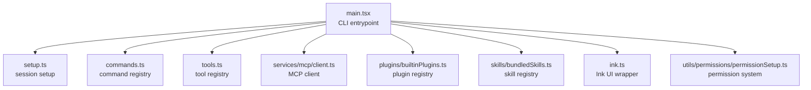
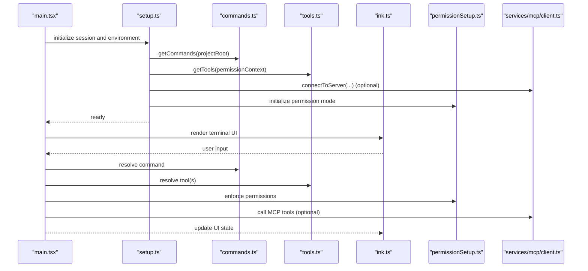
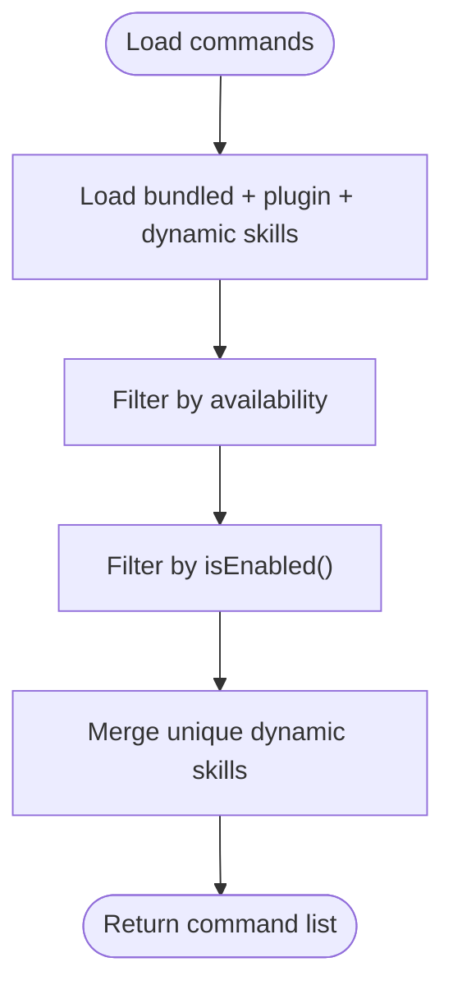
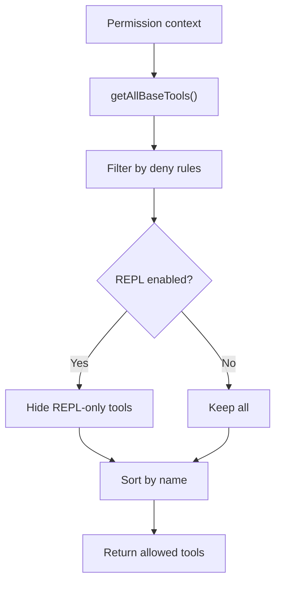
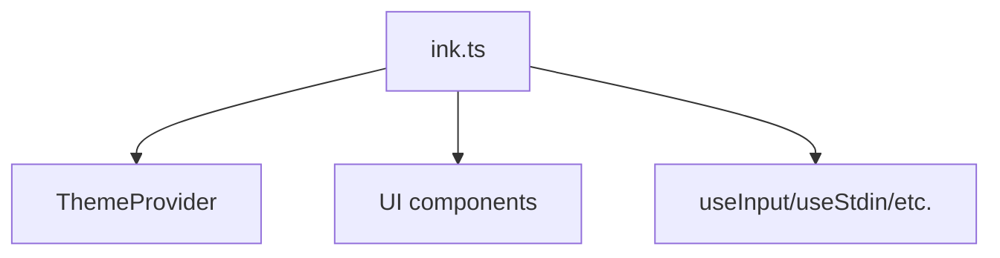
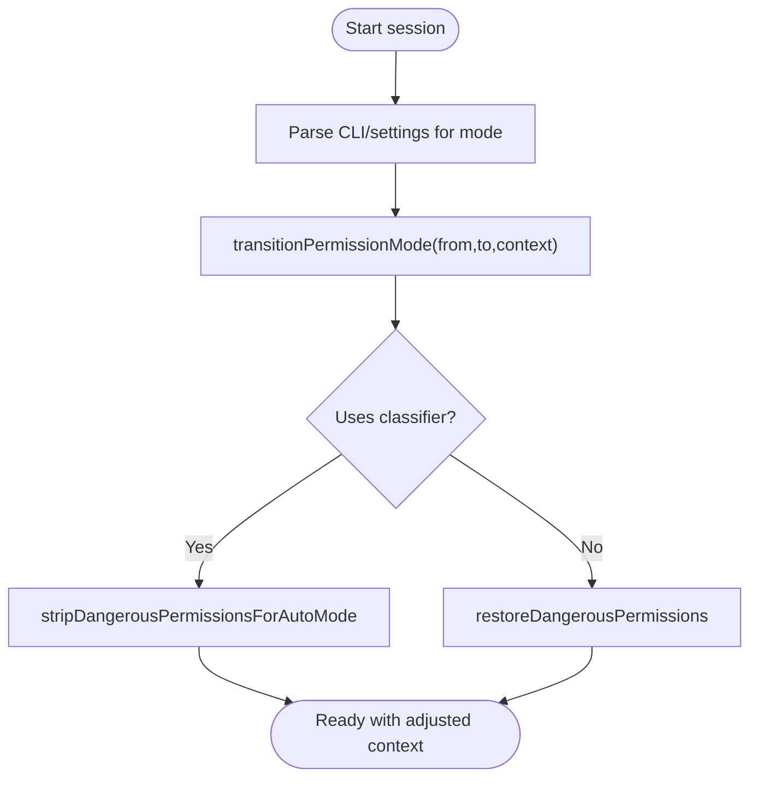
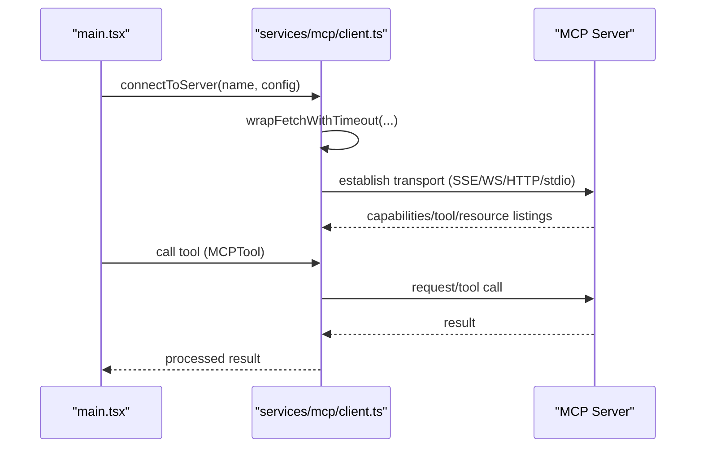
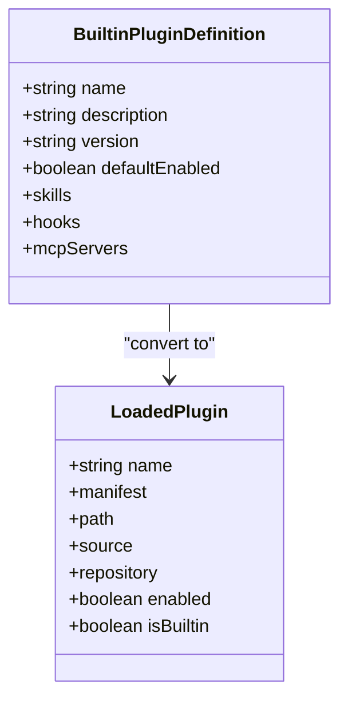
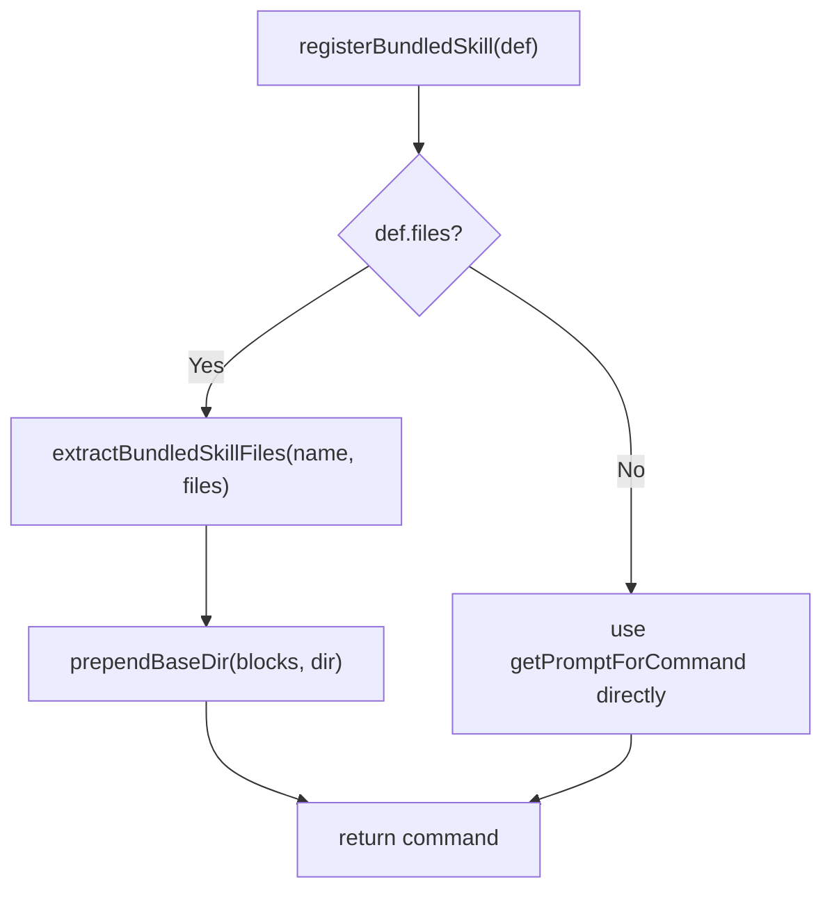
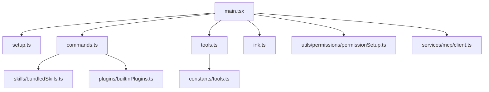

# Core Features

<cite>
**Referenced Files in This Document**
- [README.md](file://README.md)
- [main.tsx](file://restored-src/src/main.tsx)
- [setup.ts](file://restored-src/src/setup.ts)
- [commands.ts](file://restored-src/src/commands.ts)
- [tools.ts](file://restored-src/src/tools.ts)
- [constants/tools.ts](file://restored-src/src/constants/tools.ts)
- [ink.ts](file://restored-src/src/ink.ts)
- [utils/permissions/permissionSetup.ts](file://restored-src/src/utils/permissions/permissionSetup.ts)
- [services/mcp/client.ts](file://restored-src/src/services/mcp/client.ts)
- [plugins/builtinPlugins.ts](file://restored-src/src/plugins/builtinPlugins.ts)
- [skills/bundledSkills.ts](file://restored-src/src/skills/bundledSkills.ts)
</cite>

## Table of Contents
1. [Introduction](#introduction)
2. [Project Structure](#project-structure)
3. [Core Components](#core-components)
4. [Architecture Overview](#architecture-overview)
5. [Detailed Component Analysis](#detailed-component-analysis)
6. [Dependency Analysis](#dependency-analysis)
7. [Performance Considerations](#performance-considerations)
8. [Troubleshooting Guide](#troubleshooting-guide)
9. [Conclusion](#conclusion)

## Introduction
This document explains the core features of the Claude Code Python IDE as reconstructed from the public npm package and source map analysis. It covers the command system (40+ commands), the tool system (30+ specialized tools), the terminal-based UI powered by the Ink framework, and the permission management system. It also documents AI-assisted development capabilities, file editing and navigation, code completion and suggestions, multi-agent coordination, the plugin system architecture, the skill system for customizable commands, and Model Context Protocol (MCP) integration for third-party tools. Practical examples are referenced from the actual codebase to demonstrate common use cases and feature combinations.

## Project Structure
The repository is organized around a CLI entrypoint, a terminal UI built with Ink, a command and tool system, permission management, MCP integration, and plugin/skill extensibility. The README outlines the high-level structure and scope of the reconstruction.

**Diagram sources**
- [main.tsx:585-800](file://restored-src/src/main.tsx#L585-L800)
- [setup.ts:56-120](file://restored-src/src/setup.ts#L56-L120)
- [commands.ts:258-346](file://restored-src/src/commands.ts#L258-L346)
- [tools.ts:193-251](file://restored-src/src/tools.ts#L193-L251)
- [services/mcp/client.ts:595-677](file://restored-src/src/services/mcp/client.ts#L595-L677)
- [plugins/builtinPlugins.ts:21-102](file://restored-src/src/plugins/builtinPlugins.ts#L21-L102)
- [skills/bundledSkills.ts:44-108](file://restored-src/src/skills/bundledSkills.ts#L44-L108)
- [ink.ts:18-31](file://restored-src/src/ink.ts#L18-L31)
- [utils/permissions/permissionSetup.ts:689-800](file://restored-src/src/utils/permissions/permissionSetup.ts#L689-L800)

**Section sources**
- [README.md:24-42](file://README.md#L24-L42)

## Core Components
- Command system: A centralized registry aggregates built-in, bundled, plugin-provided, and dynamic skills into a unified command list. It supports availability gating, enablement checks, and dynamic skill injection.
- Tool system: A registry of specialized tools (Bash, FileRead, FileEdit, WebSearch, MCP tools, etc.) with permission filtering and mode-aware visibility.
- Terminal UI: Ink-based rendering with a theme provider and a curated set of components for building interactive terminal experiences.
- Permission management: A robust system for enforcing safe tool usage across modes (default, plan, auto, bypass), with dangerous rule detection and auto-mode classifier integration.
- MCP integration: A client supporting multiple transports (stdio, SSE, HTTP, WebSocket) with authentication, caching, timeouts, and tool/result handling.
- Plugin and skill systems: Built-in plugins and bundled skills provide extensible capabilities surfaced as commands.

**Section sources**
- [commands.ts:258-517](file://restored-src/src/commands.ts#L258-L517)
- [tools.ts:193-389](file://restored-src/src/tools.ts#L193-L389)
- [ink.ts:18-31](file://restored-src/src/ink.ts#L18-L31)
- [utils/permissions/permissionSetup.ts:597-646](file://restored-src/src/utils/permissions/permissionSetup.ts#L597-L646)
- [services/mcp/client.ts:595-800](file://restored-src/src/services/mcp/client.ts#L595-L800)
- [plugins/builtinPlugins.ts:57-121](file://restored-src/src/plugins/builtinPlugins.ts#L57-L121)
- [skills/bundledSkills.ts:106-140](file://restored-src/src/skills/bundledSkills.ts#L106-L140)

## Architecture Overview
The system initializes via the CLI entrypoint, prepares the session, loads commands and tools, and renders the terminal UI. Permissions and MCP configurations influence which commands and tools are available. Plugins and skills extend functionality dynamically.

**Diagram sources**
- [main.tsx:585-800](file://restored-src/src/main.tsx#L585-L800)
- [setup.ts:322-329](file://restored-src/src/setup.ts#L322-L329)
- [commands.ts:476-517](file://restored-src/src/commands.ts#L476-L517)
- [tools.ts:271-327](file://restored-src/src/tools.ts#L271-L327)
- [utils/permissions/permissionSetup.ts:597-646](file://restored-src/src/utils/permissions/permissionSetup.ts#L597-L646)
- [services/mcp/client.ts:595-677](file://restored-src/src/services/mcp/client.ts#L595-L677)
- [ink.ts:18-31](file://restored-src/src/ink.ts#L18-L31)

## Detailed Component Analysis

### Command System
- Central registry aggregates commands from multiple sources: built-in, bundled skills, plugin skills, and dynamic skills discovered during file operations.
- Availability and enablement checks are applied per-user and per-feature flags.
- Remote-safe and bridge-safe command sets are maintained to constrain execution in remote contexts.
- Example references:
  - Command aggregation and filtering: [commands.ts:449-517](file://restored-src/src/commands.ts#L449-L517)
  - Remote-safe and bridge-safe sets: [commands.ts:619-676](file://restored-src/src/commands.ts#L619-L676)

**Diagram sources**
- [commands.ts:449-517](file://restored-src/src/commands.ts#L449-L517)

**Section sources**
- [commands.ts:258-517](file://restored-src/src/commands.ts#L258-L517)

### Tool System
- Base tool registry includes primitives (Bash, FileRead, FileEdit, WebSearch, etc.) and optional tools gated by features or environment.
- Permission filtering removes tools explicitly denied by rules; REPL mode hides primitive tools from direct use.
- MCP tools are merged with built-in tools, deduplicated by name, and sorted for prompt-cache stability.
- Example references:
  - Base tool list and filtering: [tools.ts:193-327](file://restored-src/src/tools.ts#L193-L327)
  - Tool pool assembly and merging: [tools.ts:345-389](file://restored-src/src/tools.ts#L345-L389)
  - Allowed tool sets by mode: [constants/tools.ts:36-112](file://restored-src/src/constants/tools.ts#L36-L112)

**Diagram sources**
- [tools.ts:193-327](file://restored-src/src/tools.ts#L193-L327)
- [constants/tools.ts:36-112](file://restored-src/src/constants/tools.ts#L36-L112)

**Section sources**
- [tools.ts:193-389](file://restored-src/src/tools.ts#L193-L389)
- [constants/tools.ts:36-112](file://restored-src/src/constants/tools.ts#L36-L112)

### Terminal-Based Interface (Ink)
- The Ink wrapper centralizes rendering and theming, exposing a subset of Ink components and hooks for building the terminal UI.
- Example references:
  - Rendering and root creation: [ink.ts:18-31](file://restored-src/src/ink.ts#L18-L31)

**Diagram sources**
- [ink.ts:18-86](file://restored-src/src/ink.ts#L18-L86)

**Section sources**
- [ink.ts:18-86](file://restored-src/src/ink.ts#L18-L86)

### Permission Management System
- Supports multiple modes: default, plan, auto (classifier), and bypassPermissions (subject to policy gates).
- Dangerous permission detection prevents bypassing the classifier with overly broad tool rules (e.g., Bash(*), PowerShell(*), Agent(*)).
- Mode transitions trigger state updates and permission adjustments.
- Example references:
  - Mode transitions and classifier integration: [utils/permissions/permissionSetup.ts:597-646](file://restored-src/src/utils/permissions/permissionSetup.ts#L597-L646)
  - Dangerous rule detection helpers: [utils/permissions/permissionSetup.ts:94-233](file://restored-src/src/utils/permissions/permissionSetup.ts#L94-L233)
  - Initial mode parsing from CLI/settings: [utils/permissions/permissionSetup.ts:689-800](file://restored-src/src/utils/permissions/permissionSetup.ts#L689-L800)

**Diagram sources**
- [utils/permissions/permissionSetup.ts:597-646](file://restored-src/src/utils/permissions/permissionSetup.ts#L597-L646)
- [utils/permissions/permissionSetup.ts:510-579](file://restored-src/src/utils/permissions/permissionSetup.ts#L510-L579)

**Section sources**
- [utils/permissions/permissionSetup.ts:597-646](file://restored-src/src/utils/permissions/permissionSetup.ts#L597-L646)
- [utils/permissions/permissionSetup.ts:94-233](file://restored-src/src/utils/permissions/permissionSetup.ts#L94-L233)
- [utils/permissions/permissionSetup.ts:689-800](file://restored-src/src/utils/permissions/permissionSetup.ts#L689-L800)

### Model Context Protocol (MCP) Integration
- Client supports multiple transports: stdio, SSE, HTTP, WebSocket, and IDE-specific variants.
- Authentication flows include OAuth token handling, step-up detection, and caching of “needs-auth” states.
- Tool and resource discovery, tool call execution, and result persistence are integrated.
- Example references:
  - Transport initialization and connection: [services/mcp/client.ts:595-800](file://restored-src/src/services/mcp/client.ts#L595-L800)
  - Fetch wrapping with timeouts and Accept headers: [services/mcp/client.ts:492-550](file://restored-src/src/services/mcp/client.ts#L492-L550)
  - Auth failure handling and caching: [services/mcp/client.ts:340-361](file://restored-src/src/services/mcp/client.ts#L340-L361)

**Diagram sources**
- [services/mcp/client.ts:595-800](file://restored-src/src/services/mcp/client.ts#L595-L800)
- [services/mcp/client.ts:492-550](file://restored-src/src/services/mcp/client.ts#L492-L550)
- [services/mcp/client.ts:340-361](file://restored-src/src/services/mcp/client.ts#L340-L361)

**Section sources**
- [services/mcp/client.ts:595-800](file://restored-src/src/services/mcp/client.ts#L595-L800)
- [services/mcp/client.ts:492-550](file://restored-src/src/services/mcp/client.ts#L492-L550)
- [services/mcp/client.ts:340-361](file://restored-src/src/services/mcp/client.ts#L340-L361)

### Plugin System Architecture
- Built-in plugins are registered at startup and exposed in the /plugin UI; users can enable/disable them.
- Skills from built-in plugins are converted into commands and included in the command list.
- Example references:
  - Built-in plugin registry and toggles: [plugins/builtinPlugins.ts:57-121](file://restored-src/src/plugins/builtinPlugins.ts#L57-L121)
  - Conversion to commands: [plugins/builtinPlugins.ts:132-159](file://restored-src/src/plugins/builtinPlugins.ts#L132-L159)

**Diagram sources**
- [plugins/builtinPlugins.ts:57-121](file://restored-src/src/plugins/builtinPlugins.ts#L57-L121)
- [plugins/builtinPlugins.ts:132-159](file://restored-src/src/plugins/builtinPlugins.ts#L132-L159)

**Section sources**
- [plugins/builtinPlugins.ts:57-121](file://restored-src/src/plugins/builtinPlugins.ts#L57-L121)
- [plugins/builtinPlugins.ts:132-159](file://restored-src/src/plugins/builtinPlugins.ts#L132-L159)

### Skill System for Customizable Commands
- Bundled skills are registered at startup and can include reference files extracted to a secure directory.
- Skills are surfaced as commands with metadata (description, allowed tools, context, agent, etc.).
- Example references:
  - Registration and extraction: [skills/bundledSkills.ts:53-100](file://restored-src/src/skills/bundledSkills.ts#L53-L100)
  - Extraction and base directory prefixing: [skills/bundledSkills.ts:131-220](file://restored-src/src/skills/bundledSkills.ts#L131-L220)

**Diagram sources**
- [skills/bundledSkills.ts:53-100](file://restored-src/src/skills/bundledSkills.ts#L53-L100)
- [skills/bundledSkills.ts:131-220](file://restored-src/src/skills/bundledSkills.ts#L131-L220)

**Section sources**
- [skills/bundledSkills.ts:53-100](file://restored-src/src/skills/bundledSkills.ts#L53-L100)
- [skills/bundledSkills.ts:131-220](file://restored-src/src/skills/bundledSkills.ts#L131-L220)

### AI-Assisted Development, File Editing, Navigation, Completion, and Suggestions
- Commands and tools integrate with AI models to provide contextual assistance, file operations, and navigation.
- The command system exposes skills and commands that can be invoked to guide the model’s actions.
- File editing and navigation are supported by tools such as FileReadTool, FileEditTool, and related utilities.
- Suggestions and prompts are managed through skills and commands, with optional MCP-provided skills.

[No sources needed since this section synthesizes functionality without quoting specific code]

### Multi-Agent Coordination
- The system supports agent swarms and coordinator modes with allowed tool sets tailored to orchestration and output management.
- Example references:
  - Allowed tools for agents and coordinator mode: [constants/tools.ts:36-112](file://restored-src/src/constants/tools.ts#L36-L112)

**Section sources**
- [constants/tools.ts:36-112](file://restored-src/src/constants/tools.ts#L36-L112)

## Dependency Analysis
The core modules are loosely coupled and orchestrated by the CLI entrypoint. Commands and tools are assembled from multiple sources and filtered by permissions and environment. MCP integration is optional and layered behind transports and authentication.

**Diagram sources**
- [main.tsx:585-800](file://restored-src/src/main.tsx#L585-L800)
- [setup.ts:322-329](file://restored-src/src/setup.ts#L322-L329)
- [commands.ts:449-517](file://restored-src/src/commands.ts#L449-L517)
- [tools.ts:345-389](file://restored-src/src/tools.ts#L345-L389)
- [constants/tools.ts:36-112](file://restored-src/src/constants/tools.ts#L36-L112)
- [utils/permissions/permissionSetup.ts:597-646](file://restored-src/src/utils/permissions/permissionSetup.ts#L597-L646)
- [services/mcp/client.ts:595-677](file://restored-src/src/services/mcp/client.ts#L595-L677)
- [plugins/builtinPlugins.ts:57-121](file://restored-src/src/plugins/builtinPlugins.ts#L57-L121)
- [skills/bundledSkills.ts:106-140](file://restored-src/src/skills/bundledSkills.ts#L106-L140)

**Section sources**
- [main.tsx:585-800](file://restored-src/src/main.tsx#L585-L800)
- [setup.ts:322-329](file://restored-src/src/setup.ts#L322-L329)
- [commands.ts:449-517](file://restored-src/src/commands.ts#L449-L517)
- [tools.ts:345-389](file://restored-src/src/tools.ts#L345-L389)
- [constants/tools.ts:36-112](file://restored-src/src/constants/tools.ts#L36-L112)
- [utils/permissions/permissionSetup.ts:597-646](file://restored-src/src/utils/permissions/permissionSetup.ts#L597-L646)
- [services/mcp/client.ts:595-677](file://restored-src/src/services/mcp/client.ts#L595-L677)
- [plugins/builtinPlugins.ts:57-121](file://restored-src/src/plugins/builtinPlugins.ts#L57-L121)
- [skills/bundledSkills.ts:106-140](file://restored-src/src/skills/bundledSkills.ts#L106-L140)

## Performance Considerations
- Startup profiling checkpoints and deferred prefetches minimize perceived latency and avoid blocking the first render.
- Memoization is used extensively for command and tool loading to reduce repeated disk I/O and dynamic imports.
- MCP client employs batching, timeouts, and caching to improve reliability and throughput.

[No sources needed since this section provides general guidance]

## Troubleshooting Guide
- Permission mode issues: Review mode parsing and gate checks for bypassPermissions and auto mode. Dangerous rules are stripped and stashed during auto mode transitions.
  - References: [utils/permissions/permissionSetup.ts:689-800](file://restored-src/src/utils/permissions/permissionSetup.ts#L689-L800), [utils/permissions/permissionSetup.ts:597-646](file://restored-src/src/utils/permissions/permissionSetup.ts#L597-L646)
- MCP connectivity problems: Inspect transport initialization, authentication headers, and session expiration handling. Use the “needs-auth” cache and analytics events to diagnose.
  - References: [services/mcp/client.ts:595-800](file://restored-src/src/services/mcp/client.ts#L595-L800), [services/mcp/client.ts:340-361](file://restored-src/src/services/mcp/client.ts#L340-L361)
- Command/tool availability: Verify availability gating, enablement flags, and permission deny rules. Confirm remote-safe and bridge-safe constraints when running remotely.
  - References: [commands.ts:449-517](file://restored-src/src/commands.ts#L449-L517), [tools.ts:262-327](file://restored-src/src/tools.ts#L262-L327)

**Section sources**
- [utils/permissions/permissionSetup.ts:689-800](file://restored-src/src/utils/permissions/permissionSetup.ts#L689-L800)
- [utils/permissions/permissionSetup.ts:597-646](file://restored-src/src/utils/permissions/permissionSetup.ts#L597-L646)
- [services/mcp/client.ts:595-800](file://restored-src/src/services/mcp/client.ts#L595-L800)
- [services/mcp/client.ts:340-361](file://restored-src/src/services/mcp/client.ts#L340-L361)
- [commands.ts:449-517](file://restored-src/src/commands.ts#L449-L517)
- [tools.ts:262-327](file://restored-src/src/tools.ts#L262-L327)

## Conclusion
The Claude Code Python IDE integrates a powerful command and tool system, a permission-aware execution model, an Ink-based terminal UI, and robust MCP support. The plugin and skill systems enable extensibility, while careful design ensures safety and performance. Together, these features deliver AI-assisted development with strong controls, flexible integrations, and a responsive terminal interface.