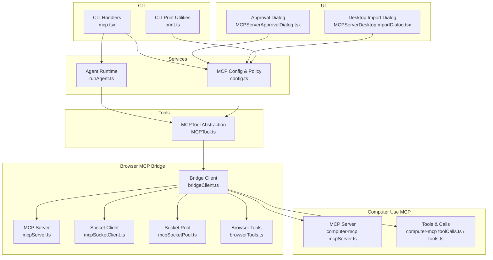
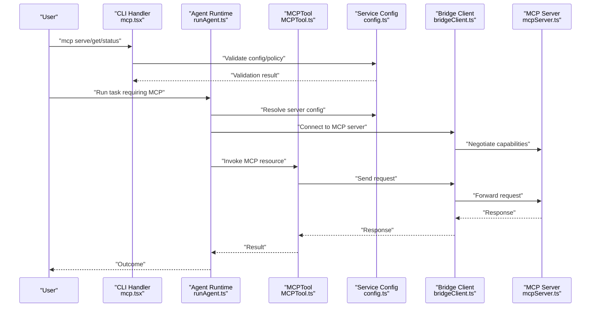
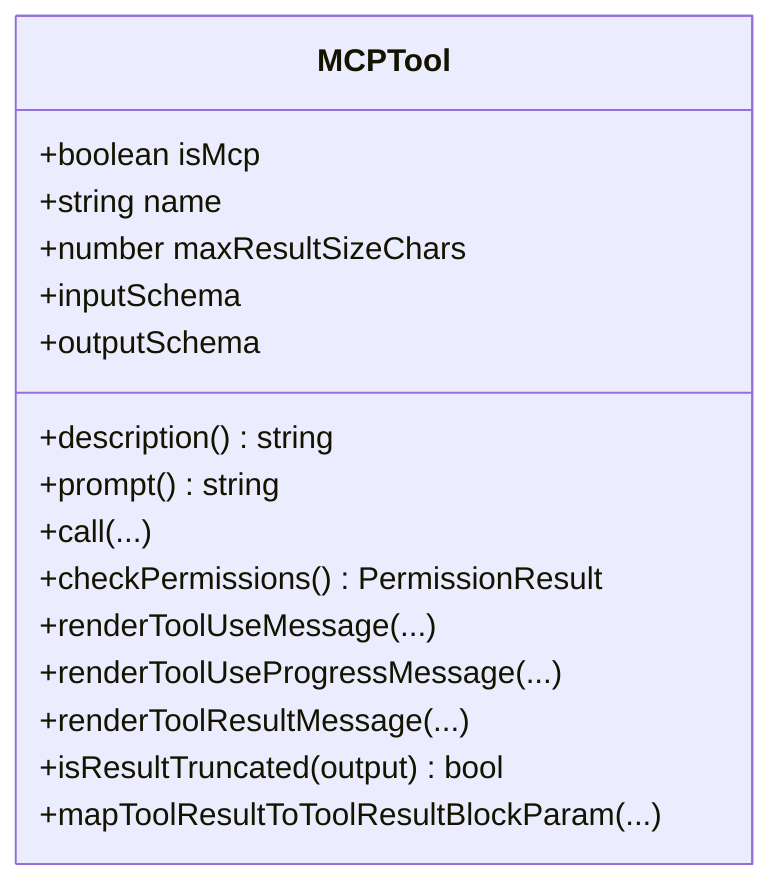
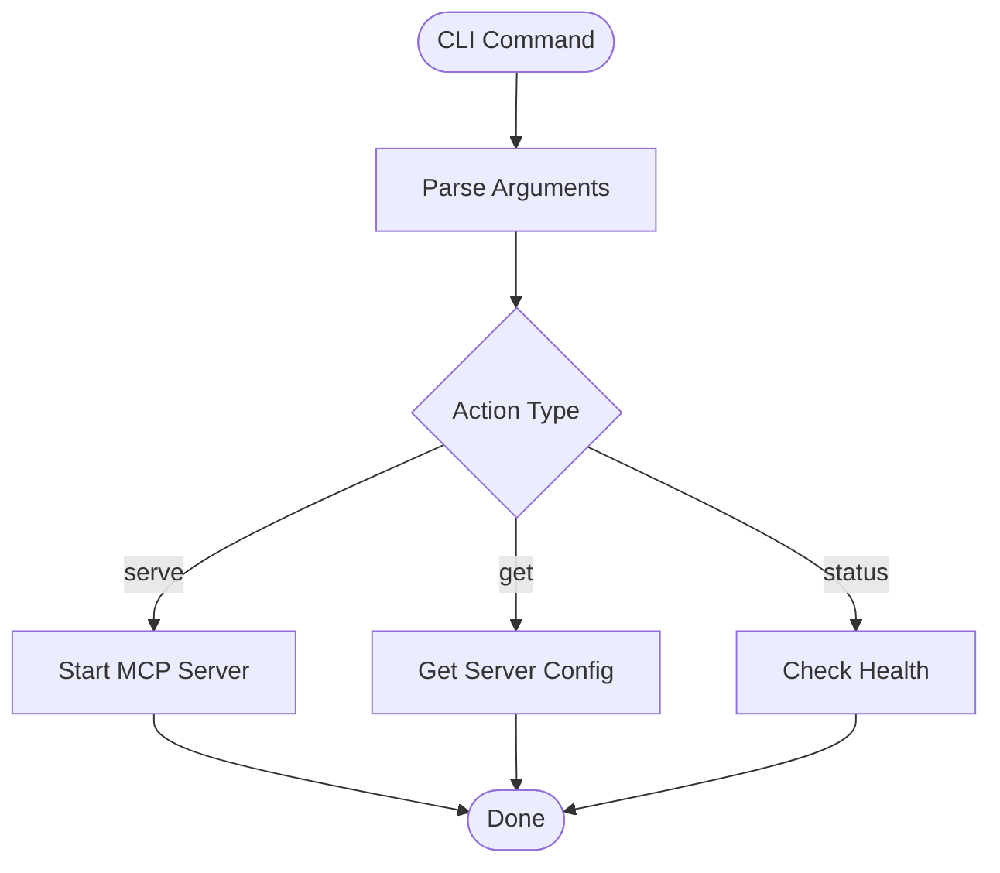
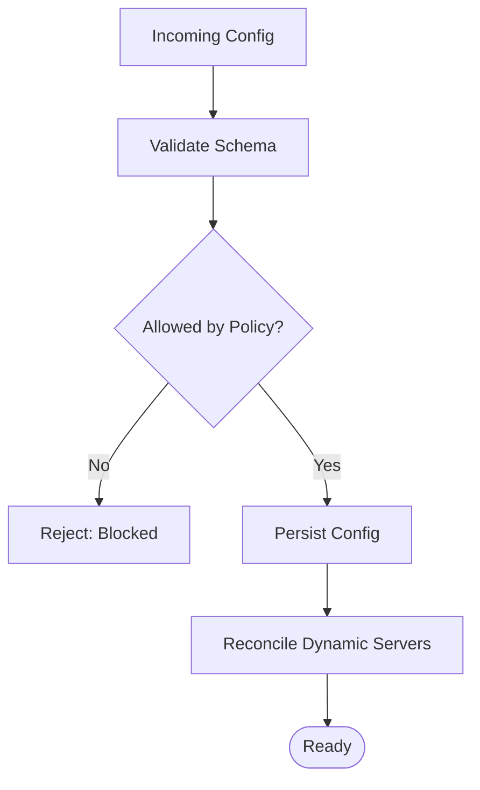
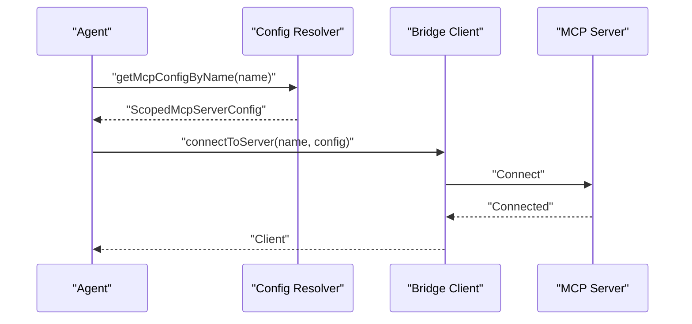
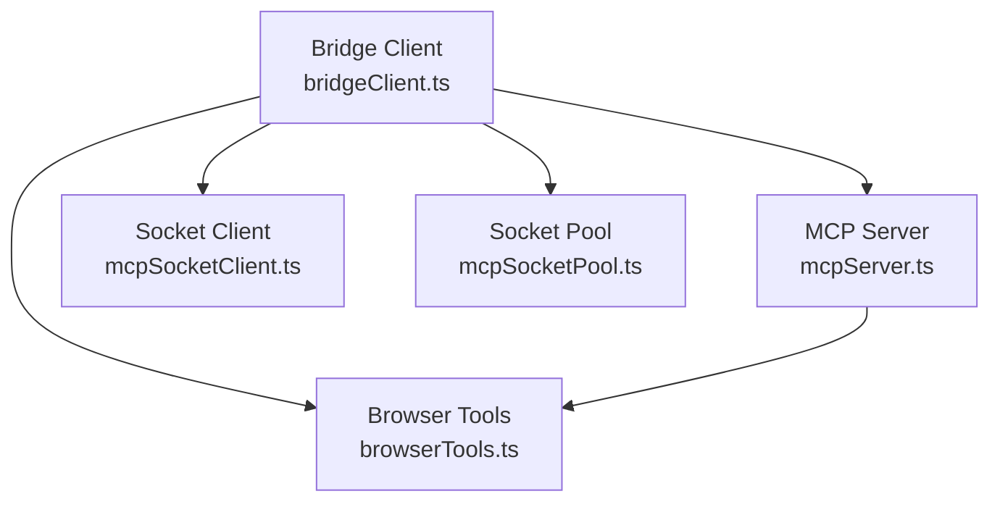
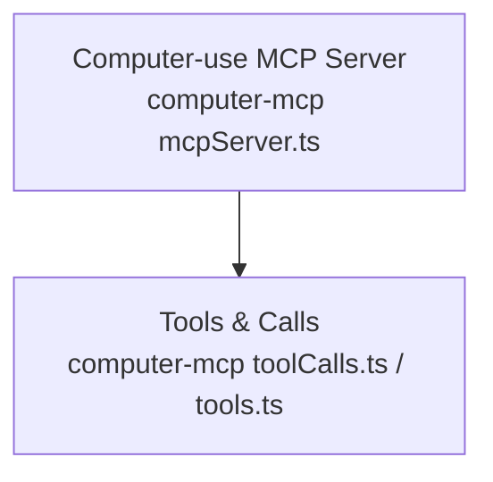
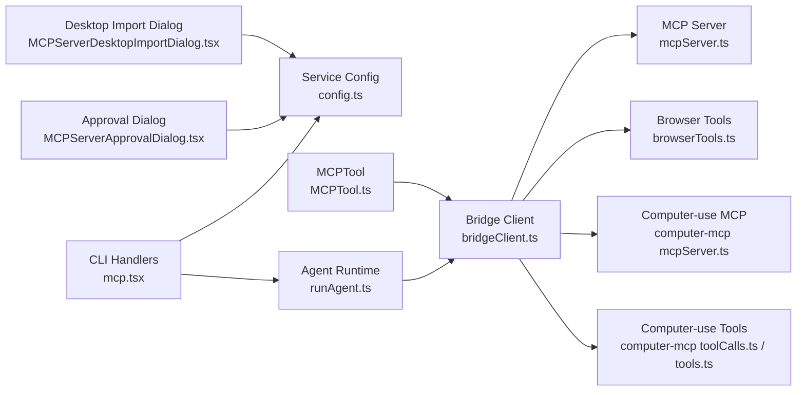

# MCP Architecture Overview

<cite>
**Referenced Files in This Document**
- [README.md](file://README.md)
- [MCPTool.ts](file://restored-src/src/tools/MCPTool/MCPTool.ts)
- [mcp.tsx](file://restored-src/src/cli/handlers/mcp.tsx)
- [print.ts](file://restored-src/src/cli/print.ts)
- [config.ts](file://restored-src/src/services/mcp/config.ts)
- [runAgent.ts](file://restored-src/src/tools/AgentTool/runAgent.ts)
- [MCPServerApprovalDialog.tsx](file://restored-src/src/components/MCPServerApprovalDialog.tsx)
- [MCPServerDesktopImportDialog.tsx](file://restored-src/src/components/MCPServerDesktopImportDialog.tsx)
- [bridgeClient.ts](file://restored-src/node_modules/@ant/claude-for-chrome-mcp/src/bridgeClient.ts)
- [mcpServer.ts](file://restored-src/node_modules/@ant/claude-for-chrome-mcp/src/mcpServer.ts)
- [mcpSocketClient.ts](file://restored-src/node_modules/@ant/claude-for-chrome-mcp/src/mcpSocketClient.ts)
- [mcpSocketPool.ts](file://restored-src/node_modules/@ant/claude-for-chrome-mcp/src/mcpSocketPool.ts)
- [browserTools.ts](file://restored-src/node_modules/@ant/claude-for-chrome-mcp/src/browserTools.ts)
- [computer-mcp mcpServer.ts](file://restored-src/node_modules/@ant/computer-use-mcp/src/mcpServer.ts)
- [computer-mcp toolCalls.ts](file://restored-src/node_modules/@ant/computer-use-mcp/src/toolCalls.ts)
- [computer-mcp tools.ts](file://restored-src/node_modules/@ant/computer-use-mcp/src/tools.ts)
</cite>

## Table of Contents
1. [Introduction](#introduction)
2. [Project Structure](#project-structure)
3. [Core Components](#core-components)
4. [Architecture Overview](#architecture-overview)
5. [Detailed Component Analysis](#detailed-component-analysis)
6. [Dependency Analysis](#dependency-analysis)
7. [Performance Considerations](#performance-considerations)
8. [Troubleshooting Guide](#troubleshooting-guide)
9. [Conclusion](#conclusion)

## Introduction
This document explains the Model Context Protocol (MCP) architecture and implementation within Claude Code. It covers the MCP protocol fundamentals, the server-client relationship, communication patterns, capabilities, resource management, authentication mechanisms, server discovery and connection establishment, capability negotiation, protocol versioning, security considerations, and performance characteristics. The goal is to provide both conceptual understanding for users and practical guidance for developers integrating MCP into Claude Code.

## Project Structure
The MCP implementation spans several areas:
- CLI handlers for managing MCP servers and connectivity
- Service-side configuration and policy enforcement
- Tool abstractions for invoking MCP resources
- UI dialogs for approval and import workflows
- Node-based MCP bridge and socket infrastructure for browser-based MCP servers
- Computer-use MCP extensions for UI automation

**Diagram sources**
- [mcp.tsx:22-210](file://restored-src/src/cli/handlers/mcp.tsx#L22-L210)
- [print.ts:5446-5479](file://restored-src/src/cli/print.ts#L5446-L5479)
- [config.ts:657-679](file://restored-src/src/services/mcp/config.ts#L657-L679)
- [runAgent.ts:140-177](file://restored-src/src/tools/AgentTool/runAgent.ts#L140-L177)
- [MCPTool.ts:1-78](file://restored-src/src/tools/MCPTool/MCPTool.ts#L1-L78)
- [MCPServerApprovalDialog.tsx](file://restored-src/src/components/MCPServerApprovalDialog.tsx)
- [MCPServerDesktopImportDialog.tsx](file://restored-src/src/components/MCPServerDesktopImportDialog.tsx)
- [bridgeClient.ts](file://restored-src/node_modules/@ant/claude-for-chrome-mcp/src/bridgeClient.ts)
- [mcpServer.ts](file://restored-src/node_modules/@ant/claude-for-chrome-mcp/src/mcpServer.ts)
- [mcpSocketClient.ts](file://restored-src/node_modules/@ant/claude-for-chrome-mcp/src/mcpSocketClient.ts)
- [mcpSocketPool.ts](file://restored-src/node_modules/@ant/claude-for-chrome-mcp/src/mcpSocketPool.ts)
- [browserTools.ts](file://restored-src/node_modules/@ant/claude-for-chrome-mcp/src/browserTools.ts)
- [computer-mcp mcpServer.ts](file://restored-src/node_modules/@ant/computer-use-mcp/src/mcpServer.ts)
- [computer-mcp toolCalls.ts](file://restored-src/node_modules/@ant/computer-use-mcp/src/toolCalls.ts)
- [computer-mcp tools.ts](file://restored-src/node_modules/@ant/computer-use-mcp/src/tools.ts)

**Section sources**
- [README.md:13-49](file://README.md#L13-L49)

## Core Components
- MCPTool abstraction: Provides a standardized tool interface for invoking MCP resources, including permission handling, output rendering, and truncation checks.
- CLI MCP handlers: Offer commands to serve, inspect, and manage MCP servers, including health checks and status reporting.
- Service configuration and policy: Enforce allow/deny policies, validate configurations, and reconcile dynamic server states.
- Agent runtime: Resolves named MCP servers, connects to them, and manages lifecycle for agent-specific servers.
- Browser MCP bridge: Implements a WebSocket-based bridge client and server, along with socket pooling and browser automation tools.
- Computer-use MCP: Extends MCP with UI automation capabilities via specialized tools and server logic.

**Section sources**
- [MCPTool.ts:1-78](file://restored-src/src/tools/MCPTool/MCPTool.ts#L1-L78)
- [mcp.tsx:22-210](file://restored-src/src/cli/handlers/mcp.tsx#L22-L210)
- [config.ts:657-679](file://restored-src/src/services/mcp/config.ts#L657-L679)
- [runAgent.ts:140-177](file://restored-src/src/tools/AgentTool/runAgent.ts#L140-L177)
- [bridgeClient.ts](file://restored-src/node_modules/@ant/claude-for-chrome-mcp/src/bridgeClient.ts)
- [mcpServer.ts](file://restored-src/node_modules/@ant/claude-for-chrome-mcp/src/mcpServer.ts)
- [mcpSocketClient.ts](file://restored-src/node_modules/@ant/claude-for-chrome-mcp/src/mcpSocketClient.ts)
- [mcpSocketPool.ts](file://restored-src/node_modules/@ant/claude-for-chrome-mcp/src/mcpSocketPool.ts)
- [browserTools.ts](file://restored-src/node_modules/@ant/claude-for-chrome-mcp/src/browserTools.ts)
- [computer-mcp mcpServer.ts](file://restored-src/node_modules/@ant/computer-use-mcp/src/mcpServer.ts)
- [computer-mcp toolCalls.ts](file://restored-src/node_modules/@ant/computer-use-mcp/src/toolCalls.ts)
- [computer-mcp tools.ts](file://restored-src/node_modules/@ant/computer-use-mcp/src/tools.ts)

## Architecture Overview
The MCP architecture in Claude Code consists of:
- Client-side tooling and agent runtime that discover and connect to MCP servers
- Service-side configuration and policy enforcement
- CLI utilities for server management and diagnostics
- Browser-based MCP bridge for extension-backed MCP servers
- Computer-use MCP for UI automation

**Diagram sources**
- [mcp.tsx:22-210](file://restored-src/src/cli/handlers/mcp.tsx#L22-L210)
- [runAgent.ts:140-177](file://restored-src/src/tools/AgentTool/runAgent.ts#L140-L177)
- [MCPTool.ts:1-78](file://restored-src/src/tools/MCPTool/MCPTool.ts#L1-L78)
- [config.ts:657-679](file://restored-src/src/services/mcp/config.ts#L657-L679)
- [bridgeClient.ts](file://restored-src/node_modules/@ant/claude-for-chrome-mcp/src/bridgeClient.ts)
- [mcpServer.ts](file://restored-src/node_modules/@ant/claude-for-chrome-mcp/src/mcpServer.ts)

## Detailed Component Analysis

### MCPTool Abstraction
MCPTool defines a standardized tool interface for MCP resources:
- Input/output schemas support flexible MCP-defined structures
- Permission handling and user-facing messaging
- Rendering helpers for tool use, progress, and results
- Truncation checks for long outputs

**Diagram sources**
- [MCPTool.ts:27-77](file://restored-src/src/tools/MCPTool/MCPTool.ts#L27-L77)

**Section sources**
- [MCPTool.ts:1-78](file://restored-src/src/tools/MCPTool/MCPTool.ts#L1-L78)

### CLI MCP Management
The CLI provides commands to:
- Serve MCP servers
- Inspect server status and health
- Retrieve server configuration details

**Diagram sources**
- [mcp.tsx:22-210](file://restored-src/src/cli/handlers/mcp.tsx#L22-L210)

**Section sources**
- [mcp.tsx:22-210](file://restored-src/src/cli/handlers/mcp.tsx#L22-L210)

### Service Configuration and Policy
Service-side configuration enforces:
- Schema validation for MCP server configs
- Enterprise allow/deny policies
- Dynamic server reconciliation (add/remove/replace)

**Diagram sources**
- [config.ts:657-679](file://restored-src/src/services/mcp/config.ts#L657-L679)
- [print.ts:5446-5479](file://restored-src/src/cli/print.ts#L5446-L5479)

**Section sources**
- [config.ts:657-679](file://restored-src/src/services/mcp/config.ts#L657-L679)
- [print.ts:5446-5479](file://restored-src/src/cli/print.ts#L5446-L5479)

### Agent Runtime and Server Resolution
Agents resolve named MCP servers, connect, and manage lifecycles:
- Lookup server config by name
- Establish connections via bridge/client
- Support per-agent dynamically created servers

**Diagram sources**
- [runAgent.ts:140-177](file://restored-src/src/tools/AgentTool/runAgent.ts#L140-L177)
- [bridgeClient.ts](file://restored-src/node_modules/@ant/claude-for-chrome-mcp/src/bridgeClient.ts)

**Section sources**
- [runAgent.ts:140-177](file://restored-src/src/tools/AgentTool/runAgent.ts#L140-L177)

### Browser-Based MCP Bridge
The browser MCP bridge enables extension-backed MCP servers:
- WebSocket bridge client
- MCP server implementation
- Socket client and pool for connection management
- Browser automation tools

**Diagram sources**
- [bridgeClient.ts](file://restored-src/node_modules/@ant/claude-for-chrome-mcp/src/bridgeClient.ts)
- [mcpServer.ts](file://restored-src/node_modules/@ant/claude-for-chrome-mcp/src/mcpServer.ts)
- [mcpSocketClient.ts](file://restored-src/node_modules/@ant/claude-for-chrome-mcp/src/mcpSocketClient.ts)
- [mcpSocketPool.ts](file://restored-src/node_modules/@ant/claude-for-chrome-mcp/src/mcpSocketPool.ts)
- [browserTools.ts](file://restored-src/node_modules/@ant/claude-for-chrome-mcp/src/browserTools.ts)

**Section sources**
- [bridgeClient.ts](file://restored-src/node_modules/@ant/claude-for-chrome-mcp/src/bridgeClient.ts)
- [mcpServer.ts](file://restored-src/node_modules/@ant/claude-for-chrome-mcp/src/mcpServer.ts)
- [mcpSocketClient.ts](file://restored-src/node_modules/@ant/claude-for-chrome-mcp/src/mcpSocketClient.ts)
- [mcpSocketPool.ts](file://restored-src/node_modules/@ant/claude-for-chrome-mcp/src/mcpSocketPool.ts)
- [browserTools.ts](file://restored-src/node_modules/@ant/claude-for-chrome-mcp/src/browserTools.ts)

### Computer-Use MCP Extensions
Computer-use MCP adds UI automation capabilities:
- Specialized MCP server
- Tools and tool calls for automation
- Supporting utilities for image comparison and sentinel apps

**Diagram sources**
- [computer-mcp mcpServer.ts](file://restored-src/node_modules/@ant/computer-use-mcp/src/mcpServer.ts)
- [computer-mcp toolCalls.ts](file://restored-src/node_modules/@ant/computer-use-mcp/src/toolCalls.ts)
- [computer-mcp tools.ts](file://restored-src/node_modules/@ant/computer-use-mcp/src/tools.ts)

**Section sources**
- [computer-mcp mcpServer.ts](file://restored-src/node_modules/@ant/computer-use-mcp/src/mcpServer.ts)
- [computer-mcp toolCalls.ts](file://restored-src/node_modules/@ant/computer-use-mcp/src/toolCalls.ts)
- [computer-mcp tools.ts](file://restored-src/node_modules/@ant/computer-use-mcp/src/tools.ts)

## Dependency Analysis
MCP components depend on each other as follows:
- CLI handlers depend on service configuration and agent runtime
- Agent runtime depends on service configuration and bridge client
- MCPTool depends on bridge client for transport
- UI dialogs depend on service configuration for approval/import workflows
- Browser MCP bridge and computer-use MCP are independent extensions that integrate via the bridge client

**Diagram sources**
- [mcp.tsx:22-210](file://restored-src/src/cli/handlers/mcp.tsx#L22-L210)
- [config.ts:657-679](file://restored-src/src/services/mcp/config.ts#L657-L679)
- [runAgent.ts:140-177](file://restored-src/src/tools/AgentTool/runAgent.ts#L140-L177)
- [bridgeClient.ts](file://restored-src/node_modules/@ant/claude-for-chrome-mcp/src/bridgeClient.ts)
- [mcpServer.ts](file://restored-src/node_modules/@ant/claude-for-chrome-mcp/src/mcpServer.ts)
- [MCPTool.ts:1-78](file://restored-src/src/tools/MCPTool/MCPTool.ts#L1-L78)
- [MCPServerApprovalDialog.tsx](file://restored-src/src/components/MCPServerApprovalDialog.tsx)
- [MCPServerDesktopImportDialog.tsx](file://restored-src/src/components/MCPServerDesktopImportDialog.tsx)
- [browserTools.ts](file://restored-src/node_modules/@ant/claude-for-chrome-mcp/src/browserTools.ts)
- [computer-mcp mcpServer.ts](file://restored-src/node_modules/@ant/computer-use-mcp/src/mcpServer.ts)
- [computer-mcp toolCalls.ts](file://restored-src/node_modules/@ant/computer-use-mcp/src/toolCalls.ts)
- [computer-mcp tools.ts](file://restored-src/node_modules/@ant/computer-use-mcp/src/tools.ts)

**Section sources**
- [mcp.tsx:22-210](file://restored-src/src/cli/handlers/mcp.tsx#L22-L210)
- [config.ts:657-679](file://restored-src/src/services/mcp/config.ts#L657-L679)
- [runAgent.ts:140-177](file://restored-src/src/tools/AgentTool/runAgent.ts#L140-L177)
- [bridgeClient.ts](file://restored-src/node_modules/@ant/claude-for-chrome-mcp/src/bridgeClient.ts)
- [mcpServer.ts](file://restored-src/node_modules/@ant/claude-for-chrome-mcp/src/mcpServer.ts)
- [MCPTool.ts:1-78](file://restored-src/src/tools/MCPTool/MCPTool.ts#L1-L78)
- [MCPServerApprovalDialog.tsx](file://restored-src/src/components/MCPServerApprovalDialog.tsx)
- [MCPServerDesktopImportDialog.tsx](file://restored-src/src/components/MCPServerDesktopImportDialog.tsx)
- [browserTools.ts](file://restored-src/node_modules/@ant/claude-for-chrome-mcp/src/browserTools.ts)
- [computer-mcp mcpServer.ts](file://restored-src/node_modules/@ant/computer-use-mcp/src/mcpServer.ts)
- [computer-mcp toolCalls.ts](file://restored-src/node_modules/@ant/computer-use-mcp/src/toolCalls.ts)
- [computer-mcp tools.ts](file://restored-src/node_modules/@ant/computer-use-mcp/src/tools.ts)

## Performance Considerations
- Connection pooling: The bridge client and socket pool reduce overhead for multiple concurrent requests.
- Output truncation: MCPTool applies truncation checks to avoid oversized results.
- Dynamic reconciliation: Efficiently adds/removes/replaces MCP servers to minimize downtime and redundant connections.
- Browser automation: Browser tools impose limits and constraints to balance responsiveness and accuracy.

[No sources needed since this section provides general guidance]

## Troubleshooting Guide
Common issues and resolutions:
- Server health checks: Use CLI status commands to detect connection failures or authentication needs.
- Policy violations: Validate configurations against allow/deny lists before adding servers.
- Dynamic server reconciliation: Ensure desired and current states are aligned to avoid stale or conflicting configurations.
- Authentication needs: When connections report authentication requirements, trigger the appropriate approval or import flows.

**Section sources**
- [mcp.tsx:22-210](file://restored-src/src/cli/handlers/mcp.tsx#L22-L210)
- [config.ts:657-679](file://restored-src/src/services/mcp/config.ts#L657-L679)
- [print.ts:5446-5479](file://restored-src/src/cli/print.ts#L5446-L5479)
- [MCPServerApprovalDialog.tsx](file://restored-src/src/components/MCPServerApprovalDialog.tsx)
- [MCPServerDesktopImportDialog.tsx](file://restored-src/src/components/MCPServerDesktopImportDialog.tsx)

## Conclusion
Claude Code’s MCP architecture integrates client-side tools, agent runtime, service configuration, and browser-based bridges to deliver a robust, policy-enforced, and extensible MCP ecosystem. The CLI, service configuration, and UI dialogs streamline server discovery, connection, and governance, while the bridge and computer-use MCP enable advanced automation scenarios. Understanding these components and their interactions helps both users and developers implement reliable MCP integrations.