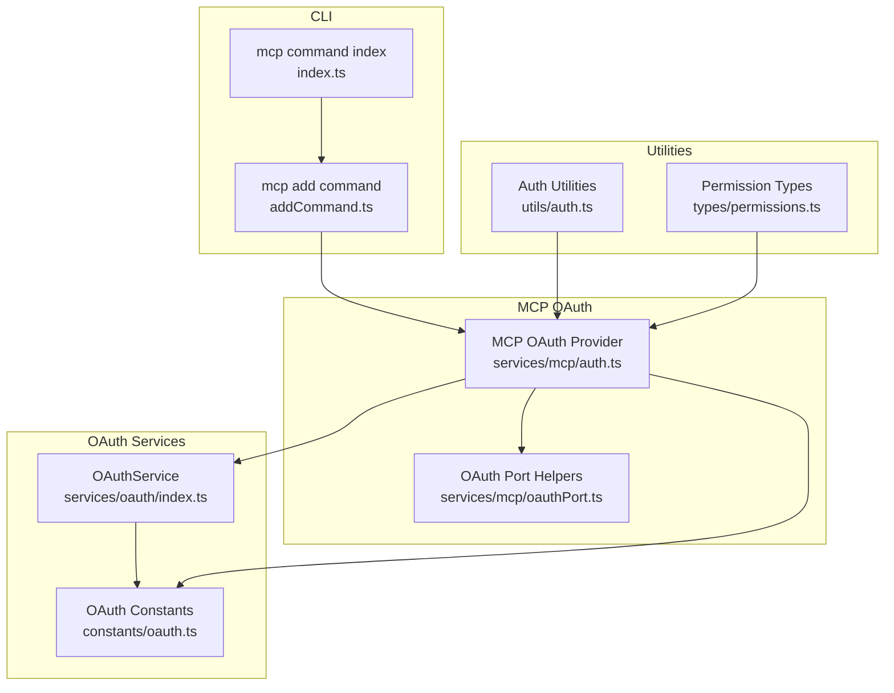
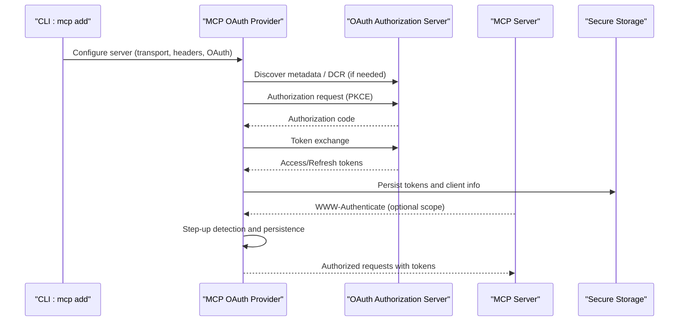
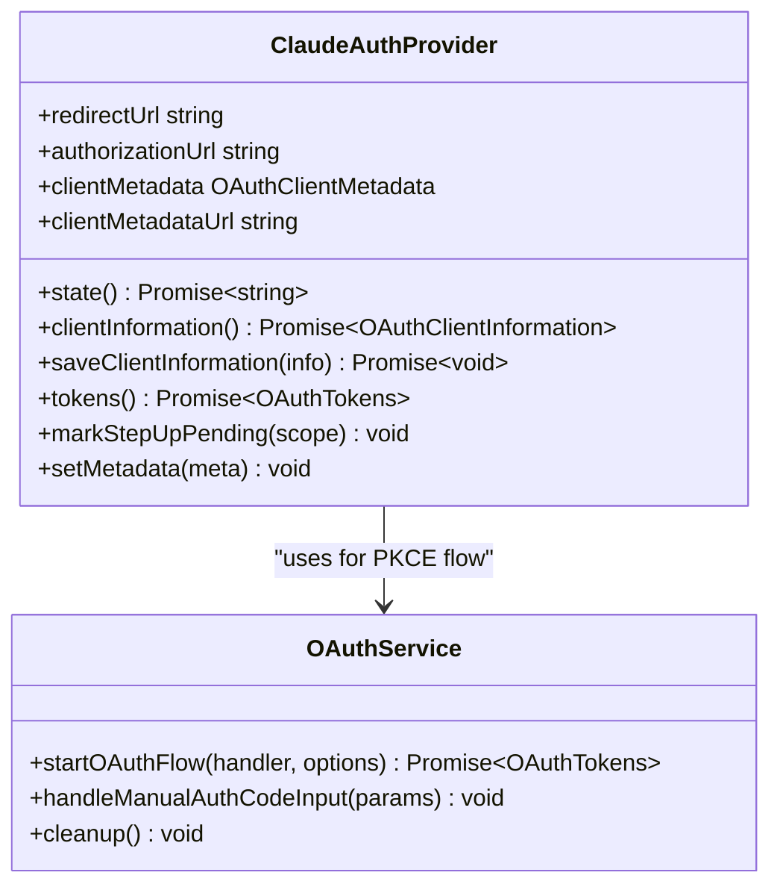
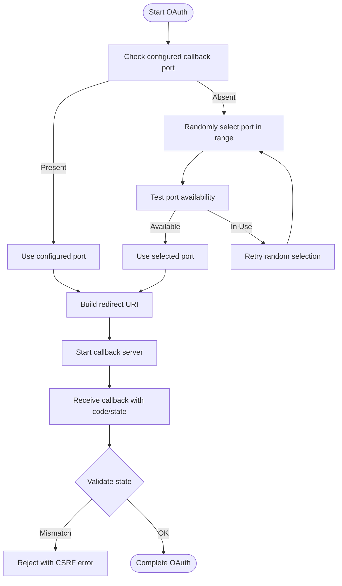
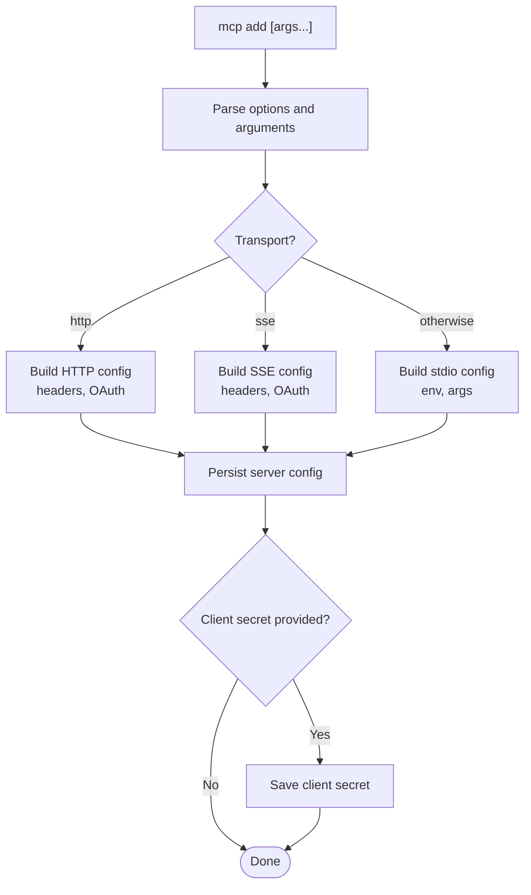
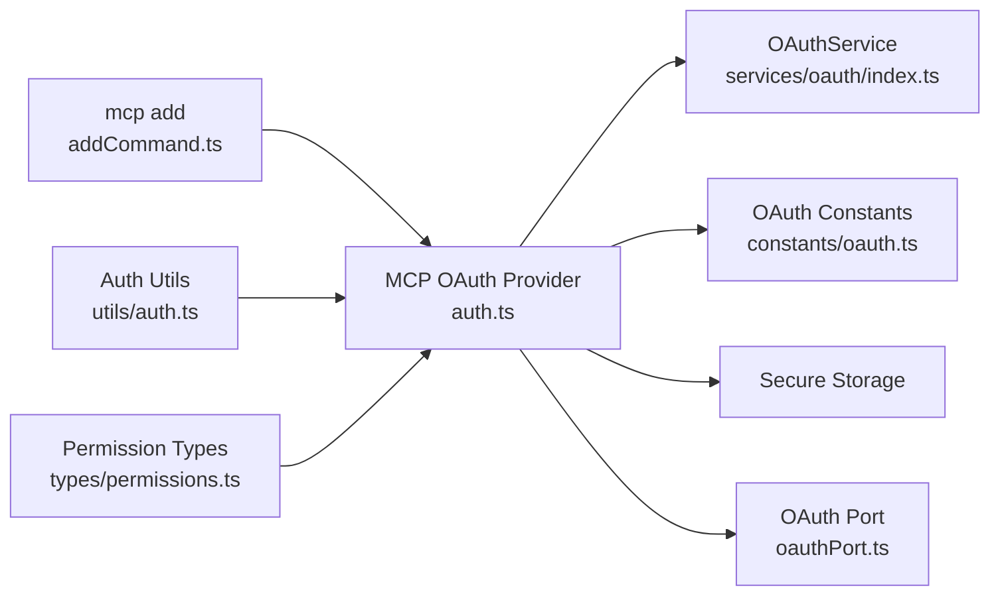

# MCP Authentication and Security

<cite>
**Referenced Files in This Document**
- [auth.ts](file://src/services/mcp/auth.ts)
- [oauthPort.ts](file://src/services/mcp/oauthPort.ts)
- [index.ts](file://src/commands/mcp/addCommand.ts)
- [index.ts](file://src/commands/mcp/index.ts)
- [oauth.ts](file://src/constants/oauth.ts)
- [index.ts](file://src/services/oauth/index.ts)
- [auth.ts](file://src/utils/auth.ts)
- [permissions.ts](file://src/types/permissions.ts)
</cite>

## Table of Contents
1. [Introduction](#introduction)
2. [Project Structure](#project-structure)
3. [Core Components](#core-components)
4. [Architecture Overview](#architecture-overview)
5. [Detailed Component Analysis](#detailed-component-analysis)
6. [Dependency Analysis](#dependency-analysis)
7. [Performance Considerations](#performance-considerations)
8. [Troubleshooting Guide](#troubleshooting-guide)
9. [Conclusion](#conclusion)
10. [Appendices](#appendices)

## Introduction
This document explains MCP authentication and security in the Claude Code repository. It covers authentication mechanisms (OAuth 2.0 with PKCE, XAA cross-application access), authorization patterns (scope-based access and step-up), token management (storage, refresh, revocation), and secure communication channels. It also documents permission models for MCP tool usage, security best practices, and operational guidance for monitoring and incident response.

## Project Structure
The MCP authentication and security functionality spans several modules:
- CLI commands for adding MCP servers and configuring transports and OAuth
- OAuth service for authorization code with PKCE
- MCP OAuth provider and flows for HTTP/SSE/stdio transports
- OAuth port allocation and redirect handling
- Constants for OAuth configuration and scopes
- Utility authentication helpers and secure storage
- Permission types and models governing MCP tool usage

**Diagram sources**
- [addCommand.ts:33-281](file://src/commands/mcp/addCommand.ts#L33-L281)
- [index.ts:1-13](file://src/commands/mcp/index.ts#L1-L13)
- [index.ts:21-199](file://src/services/oauth/index.ts#L21-L199)
- [oauth.ts:107-115](file://src/constants/oauth.ts#L107-L115)
- [auth.ts:1376-1599](file://src/services/mcp/auth.ts#L1376-L1599)
- [oauthPort.ts:1-79](file://src/services/mcp/oauthPort.ts#L1-L79)
- [auth.ts:1-200](file://src/utils/auth.ts#L1-L200)
- [permissions.ts:1-100](file://src/types/permissions.ts#L1-L100)

**Section sources**
- [addCommand.ts:33-281](file://src/commands/mcp/addCommand.ts#L33-L281)
- [index.ts:1-13](file://src/commands/mcp/index.ts#L1-L13)
- [index.ts:21-199](file://src/services/oauth/index.ts#L21-L199)
- [oauth.ts:107-115](file://src/constants/oauth.ts#L107-L115)
- [auth.ts:1376-1599](file://src/services/mcp/auth.ts#L1376-L1599)
- [oauthPort.ts:1-79](file://src/services/mcp/oauthPort.ts#L1-L79)
- [auth.ts:1-200](file://src/utils/auth.ts#L1-L200)
- [permissions.ts:1-100](file://src/types/permissions.ts#L1-L100)

## Core Components
- MCP OAuth provider and flows: Implements OAuth 2.0 with PKCE, dynamic client registration, scope handling, step-up elevation, and XAA cross-application access.
- OAuth port helpers: Allocates secure callback ports and constructs redirect URIs.
- CLI “mcp add” command: Adds HTTP/SSE/stdio MCP servers, parses headers and environment, and configures OAuth client metadata and secrets.
- OAuth service: Provides authorization code with PKCE, manual code handling, and profile retrieval.
- OAuth constants: Defines client metadata URL, scopes, and environment overrides.
- Auth utilities: Centralizes token sourcing, secure storage, and helper execution with trust checks.
- Permission types: Defines permission modes, behaviors, rules, and decision types for MCP tool usage.

**Section sources**
- [auth.ts:1376-1599](file://src/services/mcp/auth.ts#L1376-L1599)
- [oauthPort.ts:1-79](file://src/services/mcp/oauthPort.ts#L1-L79)
- [addCommand.ts:33-281](file://src/commands/mcp/addCommand.ts#L33-L281)
- [index.ts:21-199](file://src/services/oauth/index.ts#L21-L199)
- [oauth.ts:107-115](file://src/constants/oauth.ts#L107-L115)
- [auth.ts:1-200](file://src/utils/auth.ts#L1-L200)
- [permissions.ts:1-100](file://src/types/permissions.ts#L1-L100)

## Architecture Overview
The MCP authentication architecture integrates CLI configuration, OAuth flows, and secure storage. It supports HTTP/SSE transports with optional OAuth and XAA, and stdio transports without OAuth. The provider manages client registration, token storage, refresh, and revocation. Permissions govern MCP tool usage.

**Diagram sources**
- [addCommand.ts:147-274](file://src/commands/mcp/addCommand.ts#L147-L274)
- [auth.ts:847-1342](file://src/services/mcp/auth.ts#L847-L1342)
- [auth.ts:1354-1374](file://src/services/mcp/auth.ts#L1354-L1374)
- [auth.ts:1376-1599](file://src/services/mcp/auth.ts#L1376-L1599)

## Detailed Component Analysis

### MCP OAuth Provider and Flows
- OAuth 2.0 with PKCE: The provider generates state, code verifier, and challenge; constructs authorization and token endpoints; and exchanges authorization code for tokens.
- Dynamic Client Registration: If no stored client info exists, the provider registers a public client and saves client_id/client_secret.
- Scope handling: Reads scopes from metadata or WWW-Authenticate headers; supports step-up elevation by marking pending scope and restarting authorization.
- Token storage and refresh: Persists tokens and client info; refreshes using refresh_token when available; supports XAA silent refresh using cached id_token.
- Revocation: Attempts server-side revocation of refresh token first, then access token; clears local tokens afterward.

**Diagram sources**
- [auth.ts:1376-1599](file://src/services/mcp/auth.ts#L1376-L1599)
- [index.ts:21-199](file://src/services/oauth/index.ts#L21-L199)

**Section sources**
- [auth.ts:1376-1599](file://src/services/mcp/auth.ts#L1376-L1599)
- [index.ts:21-199](file://src/services/oauth/index.ts#L21-L199)

### OAuth Port Allocation and Redirect Handling
- Port allocation: Randomly selects a port within platform-specific ranges; falls back to a fixed port if needed; respects environment overrides.
- Redirect URI construction: Builds loopback redirect URIs with a fixed callback path.
- Callback server: Validates state, handles errors, and extracts authorization codes; supports manual callback submission.

**Diagram sources**
- [oauthPort.ts:36-79](file://src/services/mcp/oauthPort.ts#L36-L79)
- [auth.ts:1029-1214](file://src/services/mcp/auth.ts#L1029-L1214)

**Section sources**
- [oauthPort.ts:1-79](file://src/services/mcp/oauthPort.ts#L1-L79)
- [auth.ts:1029-1214](file://src/services/mcp/auth.ts#L1029-L1214)

### CLI “mcp add” Command and Transport Configuration
- Adds HTTP/SSE servers with headers and optional OAuth client metadata; supports stdio with environment variables.
- Validates transport selection; warns when a URL-like command is provided without explicit transport.
- Supports XAA configuration with client ID/secret and pre-registered callback ports.
- Saves client secrets securely when provided.

**Diagram sources**
- [addCommand.ts:33-281](file://src/commands/mcp/addCommand.ts#L33-L281)

**Section sources**
- [addCommand.ts:33-281](file://src/commands/mcp/addCommand.ts#L33-L281)

### OAuth Constants and Scopes
- Client metadata URL for MCP OAuth (CIMD/SEP-991) enables URL-based client identification without DCR.
- Scopes define capabilities (e.g., user:profile, user:inference, user:mcp_servers).
- Environment overrides allow custom OAuth endpoints and client IDs for controlled deployments.

**Section sources**
- [oauth.ts:107-115](file://src/constants/oauth.ts#L107-L115)
- [oauth.ts:33-51](file://src/constants/oauth.ts#L33-L51)
- [oauth.ts:186-235](file://src/constants/oauth.ts#L186-L235)

### Permission Models for MCP Tools
- Permission modes: acceptEdits, bypassPermissions, default, dontAsk, plan, and optionally auto.
- Permission behaviors: allow, deny, ask.
- Rules and updates: define tool permissions, working directories, and mode changes.
- Decisions: allow, ask, deny with reasons and optional classifier checks.

**Section sources**
- [permissions.ts:16-38](file://src/types/permissions.ts#L16-L38)
- [permissions.ts:44-80](file://src/types/permissions.ts#L44-L80)
- [permissions.ts:98-132](file://src/types/permissions.ts#L98-L132)
- [permissions.ts:174-236](file://src/types/permissions.ts#L174-L236)
- [permissions.ts:241-325](file://src/types/permissions.ts#L241-L325)

## Dependency Analysis
- MCP OAuth provider depends on:
  - OAuth service for PKCE and token exchange
  - OAuth constants for client metadata URL and scopes
  - Secure storage for tokens and client info
  - Platform utilities for port allocation and redirect handling
- CLI “mcp add” depends on MCP OAuth provider configuration and secure storage for secrets.
- Permission types underpin MCP tool usage decisions.

**Diagram sources**
- [addCommand.ts:33-281](file://src/commands/mcp/addCommand.ts#L33-L281)
- [auth.ts:1376-1599](file://src/services/mcp/auth.ts#L1376-L1599)
- [index.ts:21-199](file://src/services/oauth/index.ts#L21-L199)
- [oauth.ts:107-115](file://src/constants/oauth.ts#L107-L115)
- [oauthPort.ts:1-79](file://src/services/mcp/oauthPort.ts#L1-L79)
- [auth.ts:1-200](file://src/utils/auth.ts#L1-L200)
- [permissions.ts:1-100](file://src/types/permissions.ts#L1-L100)

**Section sources**
- [addCommand.ts:33-281](file://src/commands/mcp/addCommand.ts#L33-L281)
- [auth.ts:1376-1599](file://src/services/mcp/auth.ts#L1376-L1599)
- [index.ts:21-199](file://src/services/oauth/index.ts#L21-L199)
- [oauth.ts:107-115](file://src/constants/oauth.ts#L107-L115)
- [oauthPort.ts:1-79](file://src/services/mcp/oauthPort.ts#L1-L79)
- [auth.ts:1-200](file://src/utils/auth.ts#L1-L200)
- [permissions.ts:1-100](file://src/types/permissions.ts#L1-L100)

## Performance Considerations
- Token refresh and revocation: Prefer server-side revocation of refresh tokens first to minimize future access; clear local tokens afterward.
- Port selection: Random selection reduces predictability; bounded attempts prevent excessive retries.
- Fetch timeouts: Individual OAuth requests use a fixed timeout to avoid hanging operations.
- Caching: Secure storage cache avoids frequent keychain lookups; provider tokens() avoids unnecessary keychain misses.

[No sources needed since this section provides general guidance]

## Troubleshooting Guide
Common issues and resolutions:
- Port conflicts: If the OAuth callback port is in use, the provider reports the conflict and suggests platform-specific diagnostics.
- State mismatch: Indicates potential CSRF; the callback server rejects the request and logs an error.
- Provider denial: OAuth error codes surfaced from the SDK guide corrective actions (e.g., clearing client credentials).
- Token exchange failures: The provider attributes failures to specific stages and logs telemetry for diagnosis.
- XAA silent refresh: If id_token is invalid, the provider clears cached tokens and triggers user login.

Operational steps:
- Verify transport and URL correctness when adding servers.
- Confirm OAuth client metadata and callback port configuration.
- Review secure storage entries for client IDs/secrets and tokens.
- Use analytics events to correlate failures and remediation actions.

**Section sources**
- [auth.ts:1153-1170](file://src/services/mcp/auth.ts#L1153-L1170)
- [auth.ts:1274-1341](file://src/services/mcp/auth.ts#L1274-L1341)
- [auth.ts:831-845](file://src/services/mcp/auth.ts#L831-L845)

## Conclusion
The MCP authentication subsystem integrates OAuth 2.0 with PKCE, dynamic client registration, scope-based authorization, and secure token storage. It supports HTTP/SSE transports with optional OAuth/XAA and stdio transports. Permission types govern MCP tool usage. Robust error handling, telemetry, and secure practices ensure reliable and safe integration.

[No sources needed since this section summarizes without analyzing specific files]

## Appendices

### Practical Examples

- Adding an HTTP MCP server with OAuth:
  - Use the CLI to specify transport, headers, and optional client ID/secret and callback port.
  - The provider discovers metadata, starts authorization, and persists tokens.

- Adding an SSE MCP server with XAA:
  - Enable XAA and provide client ID/secret; the provider performs cross-application token exchange using a cached id_token.

- Managing permissions for MCP tools:
  - Define permission rules and modes; decisions are recorded with reasons and optional classifier checks.

**Section sources**
- [addCommand.ts:147-239](file://src/commands/mcp/addCommand.ts#L147-L239)
- [auth.ts:664-845](file://src/services/mcp/auth.ts#L664-L845)
- [permissions.ts:44-80](file://src/types/permissions.ts#L44-L80)

### Security Best Practices
- Use HTTPS for OAuth metadata endpoints and MCP server URLs.
- Prefer server-side revocation of refresh tokens before access tokens.
- Validate OAuth state and sanitize error messages to prevent XSS.
- Limit OAuth scopes to least privilege; use step-up elevation when needed.
- Store client secrets and tokens securely; avoid embedding in logs.
- Enforce trust checks before executing project-local helper scripts.

**Section sources**
- [auth.ts:256-311](file://src/services/mcp/auth.ts#L256-L311)
- [auth.ts:1120-1140](file://src/services/mcp/auth.ts#L1120-L1140)
- [auth.ts:546-556](file://src/utils/auth.ts#L546-L556)