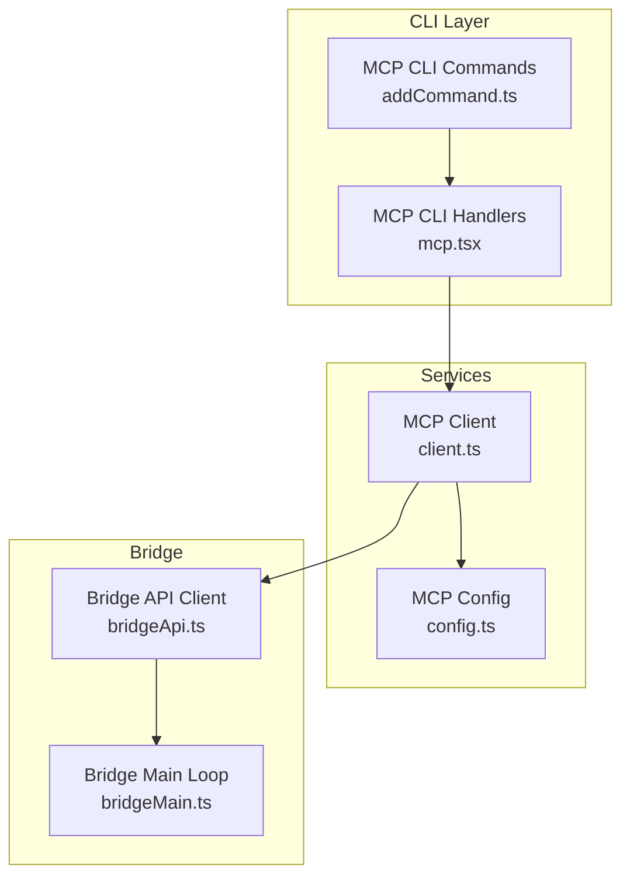
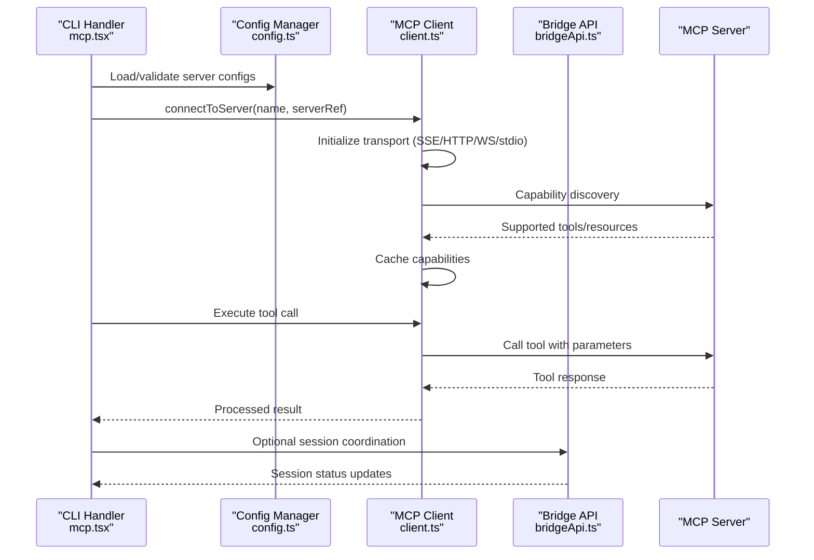
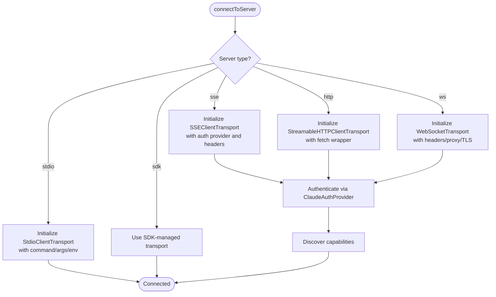
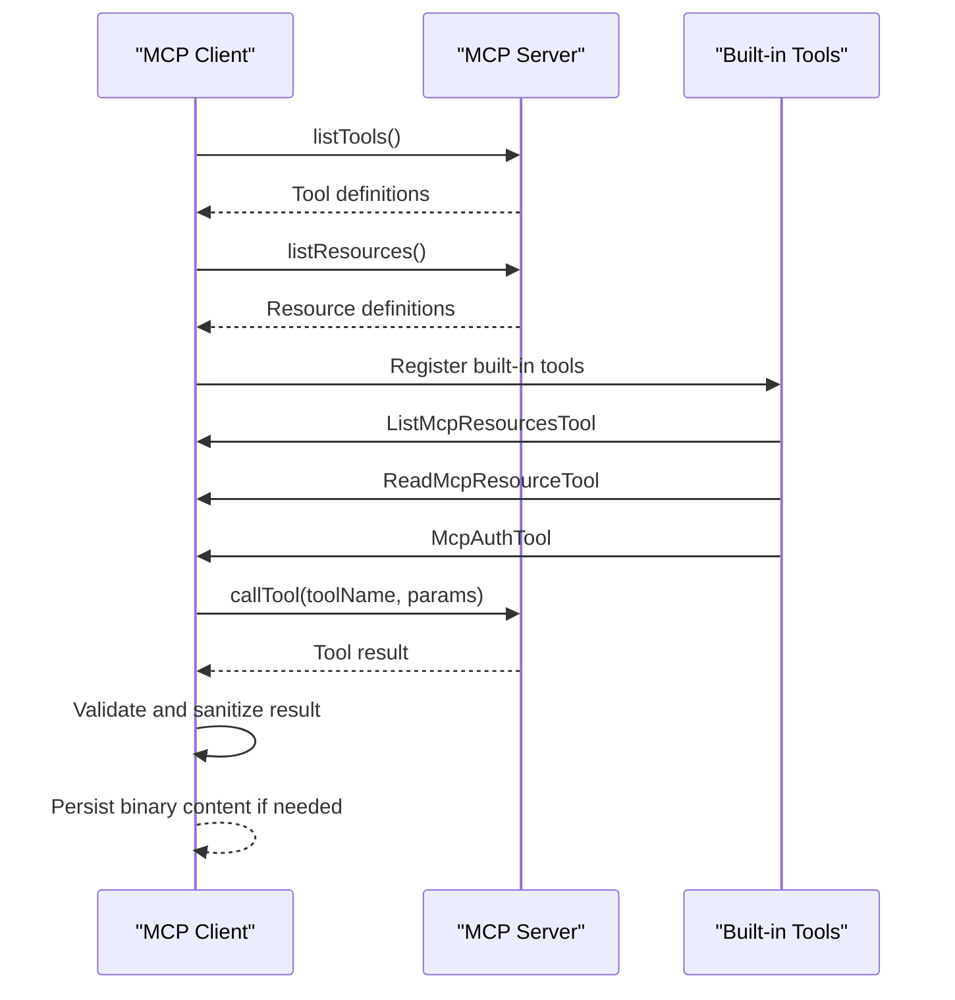
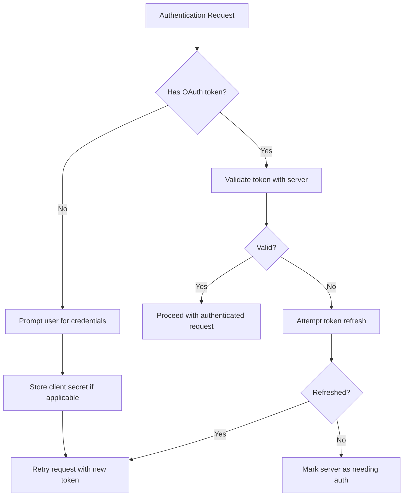
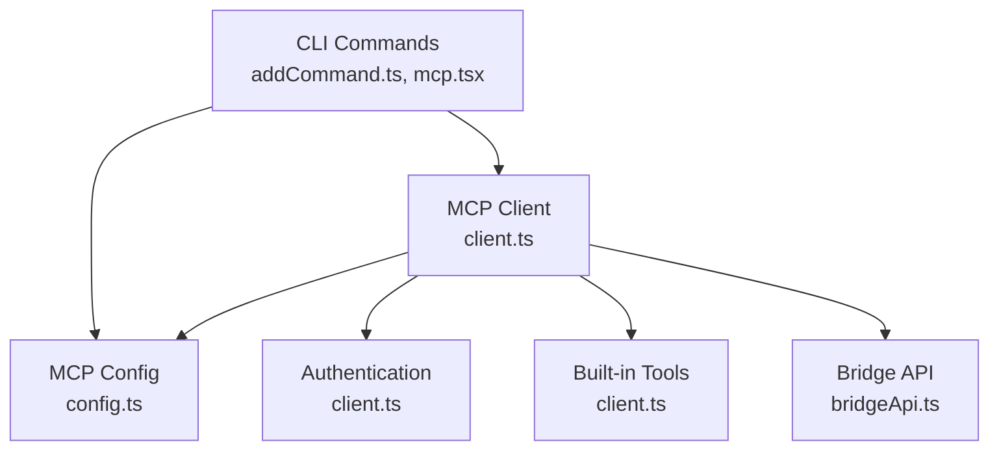

# MCP Client Implementation

<cite>
**Referenced Files in This Document**
- [client.ts](file://src/services/mcp/client.ts)
- [config.ts](file://src/services/mcp/config.ts)
- [addCommand.ts](file://src/commands/mcp/addCommand.ts)
- [mcp.tsx](file://src/cli/handlers/mcp.tsx)
- [bridgeApi.ts](file://src/bridge/bridgeApi.ts)
- [bridgeMain.ts](file://src/bridge/bridgeMain.ts)
</cite>

## Table of Contents
1. [Introduction](#introduction)
2. [Project Structure](#project-structure)
3. [Core Components](#core-components)
4. [Architecture Overview](#architecture-overview)
5. [Detailed Component Analysis](#detailed-component-analysis)
6. [Dependency Analysis](#dependency-analysis)
7. [Performance Considerations](#performance-considerations)
8. [Troubleshooting Guide](#troubleshooting-guide)
9. [Conclusion](#conclusion)

## Introduction
This document provides comprehensive technical documentation for the MCP (Model Context Protocol) client implementation within the Claude Code ecosystem. It covers client-side integration, tool execution, and resource access patterns. The documentation explains MCP client initialization, connection establishment, capability discovery, tool invocation patterns, parameter handling, response processing, authentication and authorization, security considerations, error handling, retry mechanisms, performance optimization, debugging, logging, monitoring, and guidelines for extending functionality and integrating custom tools.

## Project Structure
The MCP client implementation spans several modules:
- Services: MCP client and configuration management
- Commands: CLI subcommands for managing MCP servers
- CLI Handlers: Interactive and programmatic MCP operations
- Bridge: Remote control infrastructure that coordinates MCP sessions
- Tools: Built-in MCP tools for listing resources, reading content, and authentication

**Diagram sources**
- [client.ts:1-800](file://src/services/mcp/client.ts#L1-L800)
- [config.ts:1-800](file://src/services/mcp/config.ts#L1-L800)
- [addCommand.ts:1-281](file://src/commands/mcp/addCommand.ts#L1-L281)
- [mcp.tsx:1-362](file://src/cli/handlers/mcp.tsx#L1-L362)
- [bridgeApi.ts:1-540](file://src/bridge/bridgeApi.ts#L1-L540)
- [bridgeMain.ts:1-800](file://src/bridge/bridgeMain.ts#L1-L800)

**Section sources**
- [client.ts:1-800](file://src/services/mcp/client.ts#L1-L800)
- [config.ts:1-800](file://src/services/mcp/config.ts#L1-L800)
- [addCommand.ts:1-281](file://src/commands/mcp/addCommand.ts#L1-L281)
- [mcp.tsx:1-362](file://src/cli/handlers/mcp.tsx#L1-L362)
- [bridgeApi.ts:1-540](file://src/bridge/bridgeApi.ts#L1-L540)
- [bridgeMain.ts:1-800](file://src/bridge/bridgeMain.ts#L1-L800)

## Core Components
- MCP Client: Establishes connections to MCP servers via SSE, HTTP, WebSocket, stdio, and SDK transports; manages authentication; executes tool calls; discovers capabilities; handles timeouts and retries.
- MCP Config: Manages server configurations across scopes (project, user, local), applies enterprise policies, expands environment variables, and writes configuration files atomically.
- CLI Commands: Provides subcommands to add, remove, list, and inspect MCP servers, including OAuth configuration and desktop integration.
- Bridge: Coordinates remote sessions, manages work items, heartbeats, and session lifecycles, and integrates with MCP clients for remote control scenarios.
- Tools: Built-in tools for listing MCP resources, reading resources, and performing authentication flows.

**Section sources**
- [client.ts:1-800](file://src/services/mcp/client.ts#L1-L800)
- [config.ts:1-800](file://src/services/mcp/config.ts#L1-L800)
- [addCommand.ts:1-281](file://src/commands/mcp/addCommand.ts#L1-L281)
- [mcp.tsx:1-362](file://src/cli/handlers/mcp.tsx#L1-L362)
- [bridgeApi.ts:1-540](file://src/bridge/bridgeApi.ts#L1-L540)
- [bridgeMain.ts:1-800](file://src/bridge/bridgeMain.ts#L1-L800)

## Architecture Overview
The MCP client architecture integrates with the broader Claude Code system:
- CLI layer validates and persists server configurations
- Services layer establishes connections, authenticates, and executes tools
- Bridge layer orchestrates sessions and work items
- Tools layer provides built-in capabilities for resource access and authentication

**Diagram sources**
- [mcp.tsx:1-362](file://src/cli/handlers/mcp.tsx#L1-L362)
- [config.ts:1-800](file://src/services/mcp/config.ts#L1-L800)
- [client.ts:1-800](file://src/services/mcp/client.ts#L1-L800)
- [bridgeApi.ts:1-540](file://src/bridge/bridgeApi.ts#L1-L540)

## Detailed Component Analysis

### MCP Client Initialization and Connection Establishment
The MCP client initializes connections based on server configuration:
- Transport selection: SSE, HTTP, WebSocket, stdio, or SDK transports
- Authentication providers: ClaudeAuthProvider for OAuth flows
- Header management: Combined static and dynamic headers
- Proxy and TLS configuration: Respects environment proxies and TLS options
- Timeout handling: Per-request timeouts to avoid stale signals

**Diagram sources**
- [client.ts:595-800](file://src/services/mcp/client.ts#L595-L800)

**Section sources**
- [client.ts:595-800](file://src/services/mcp/client.ts#L595-L800)

### Capability Discovery and Tool Execution
Capability discovery and tool execution involve:
- Capability negotiation: Clients request supported tools and resources
- Tool invocation: Parameters are validated and truncated if needed
- Response processing: Results are sanitized and persisted when appropriate
- Error handling: Distinction between authentication errors and tool call errors

**Diagram sources**
- [client.ts:1-800](file://src/services/mcp/client.ts#L1-L800)

**Section sources**
- [client.ts:1-800](file://src/services/mcp/client.ts#L1-L800)

### Authentication, Authorization, and Security
Authentication and authorization mechanisms include:
- OAuth token management: Automatic refresh and retry on 401
- ClaudeAuthProvider: Handles server-specific authentication flows
- Session ingress tokens: Used for direct session-based connections
- Proxy and TLS: Secure transport configuration
- Policy enforcement: Enterprise allow/deny lists and managed configuration

**Diagram sources**
- [client.ts:340-422](file://src/services/mcp/client.ts#L340-L422)
- [client.ts:257-316](file://src/services/mcp/client.ts#L257-L316)

**Section sources**
- [client.ts:340-422](file://src/services/mcp/client.ts#L340-L422)
- [client.ts:257-316](file://src/services/mcp/client.ts#L257-L316)

### MCP Tool Invocation Patterns and Parameter Handling
Tool invocation follows standardized patterns:
- Parameter validation: Ensures parameters meet server expectations
- Content truncation: Prevents oversized content from exceeding limits
- Binary content handling: Persists and references binary outputs safely
- Progress reporting: Tracks tool execution progress for user feedback

**Section sources**
- [client.ts:1-800](file://src/services/mcp/client.ts#L1-L800)

### Resource Access Patterns
Resource access involves:
- Listing resources: Enumerates available resources from the server
- Reading resources: Retrieves specific resource content with proper handling
- Persistence: Stores large or binary content to disk with metadata
- Formatting: Applies appropriate formatting for different content types

**Section sources**
- [client.ts:1-800](file://src/services/mcp/client.ts#L1-L800)

### CLI Integration and Management
CLI commands provide comprehensive management:
- Adding servers: Supports stdio, SSE, HTTP transports with headers and OAuth
- Removing servers: Removes configurations and cleans secure storage
- Listing servers: Checks health and displays status across all configured servers
- Getting server details: Shows detailed configuration and status
- Desktop integration: Imports servers from Claude Desktop configuration

**Section sources**
- [addCommand.ts:1-281](file://src/commands/mcp/addCommand.ts#L1-L281)
- [mcp.tsx:1-362](file://src/cli/handlers/mcp.tsx#L1-L362)

### Bridge Integration for Remote Sessions
The bridge coordinates remote sessions:
- Work polling: Periodically polls for new work items
- Session management: Spawns and manages child sessions
- Heartbeat: Maintains session liveness and detects expiration
- Shutdown: Graceful cleanup and deregistration

**Section sources**
- [bridgeApi.ts:1-540](file://src/bridge/bridgeApi.ts#L1-L540)
- [bridgeMain.ts:1-800](file://src/bridge/bridgeMain.ts#L1-L800)

## Dependency Analysis
The MCP client has clear dependencies and modular design:
- Transport abstraction: Supports multiple transport types via SDK transports
- Authentication abstraction: Centralized authentication handling
- Configuration management: Scoped configuration with policy enforcement
- Tool integration: Built-in tools for common operations
- Bridge integration: Optional integration for remote session management

**Diagram sources**
- [client.ts:1-800](file://src/services/mcp/client.ts#L1-L800)
- [config.ts:1-800](file://src/services/mcp/config.ts#L1-L800)
- [addCommand.ts:1-281](file://src/commands/mcp/addCommand.ts#L1-L281)
- [mcp.tsx:1-362](file://src/cli/handlers/mcp.tsx#L1-L362)
- [bridgeApi.ts:1-540](file://src/bridge/bridgeApi.ts#L1-L540)

**Section sources**
- [client.ts:1-800](file://src/services/mcp/client.ts#L1-L800)
- [config.ts:1-800](file://src/services/mcp/config.ts#L1-L800)
- [addCommand.ts:1-281](file://src/commands/mcp/addCommand.ts#L1-L281)
- [mcp.tsx:1-362](file://src/cli/handlers/mcp.tsx#L1-L362)
- [bridgeApi.ts:1-540](file://src/bridge/bridgeApi.ts#L1-L540)

## Performance Considerations
Key performance characteristics and optimizations:
- Connection caching: Memoized connections reduce repeated setup overhead
- Batch processing: Concurrent server connection checks with configurable batch sizes
- Timeout management: Per-request timeouts prevent hanging connections
- Content truncation: Limits prevent excessive memory usage
- Proxy and TLS optimization: Efficient transport configuration reduces latency
- Heartbeat optimization: Non-exclusive heartbeat intervals maintain liveness without heavy polling

**Section sources**
- [client.ts:552-561](file://src/services/mcp/client.ts#L552-L561)
- [client.ts:224-229](file://src/services/mcp/client.ts#L224-L229)
- [client.ts:492-550](file://src/services/mcp/client.ts#L492-L550)

## Troubleshooting Guide
Common issues and resolutions:
- Authentication failures: Trigger needs-auth state and cache entries
- Session expiration: Detect via 404 with specific JSON-RPC code
- Network connectivity: Exponential backoff with sleep detection
- Proxy configuration: Respect environment variables for HTTP/HTTPS/NO_PROXY
- TLS issues: Configure TLS options and certificates appropriately
- Rate limiting: Handle 429 responses with appropriate backoff

**Section sources**
- [client.ts:193-206](file://src/services/mcp/client.ts#L193-L206)
- [client.ts:340-361](file://src/services/mcp/client.ts#L340-L361)
- [client.ts:152-170](file://src/services/mcp/client.ts#L152-L170)
- [bridgeApi.ts:454-500](file://src/bridge/bridgeApi.ts#L454-L500)

## Conclusion
The MCP client implementation provides a robust, secure, and performant foundation for integrating with MCP servers. It supports multiple transport types, comprehensive authentication flows, efficient resource access, and seamless CLI integration. The architecture emphasizes modularity, scalability, and observability, enabling effective debugging, monitoring, and extension through custom tools and transports.