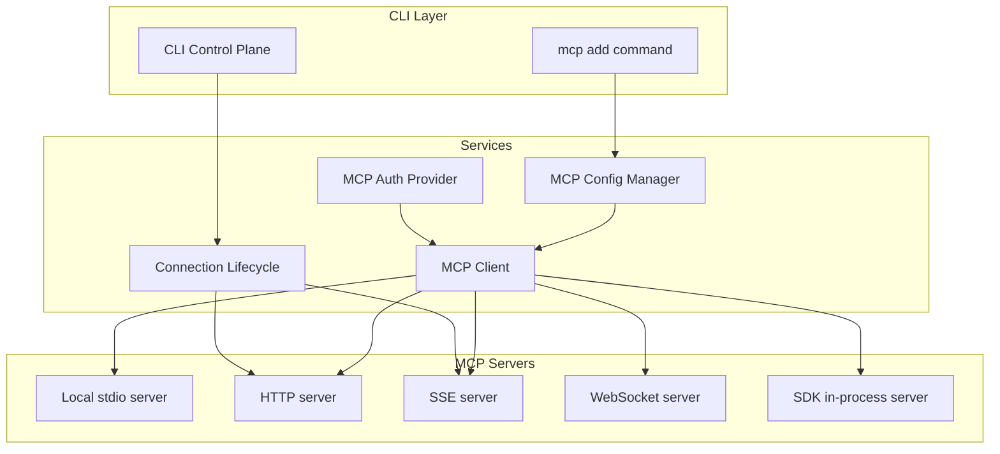
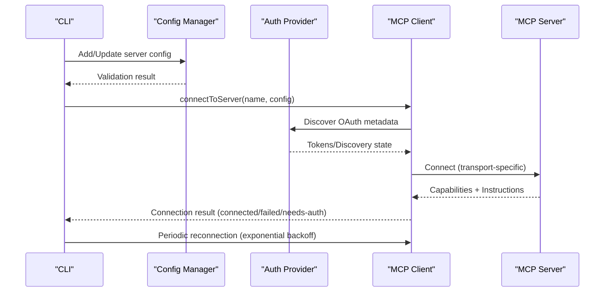
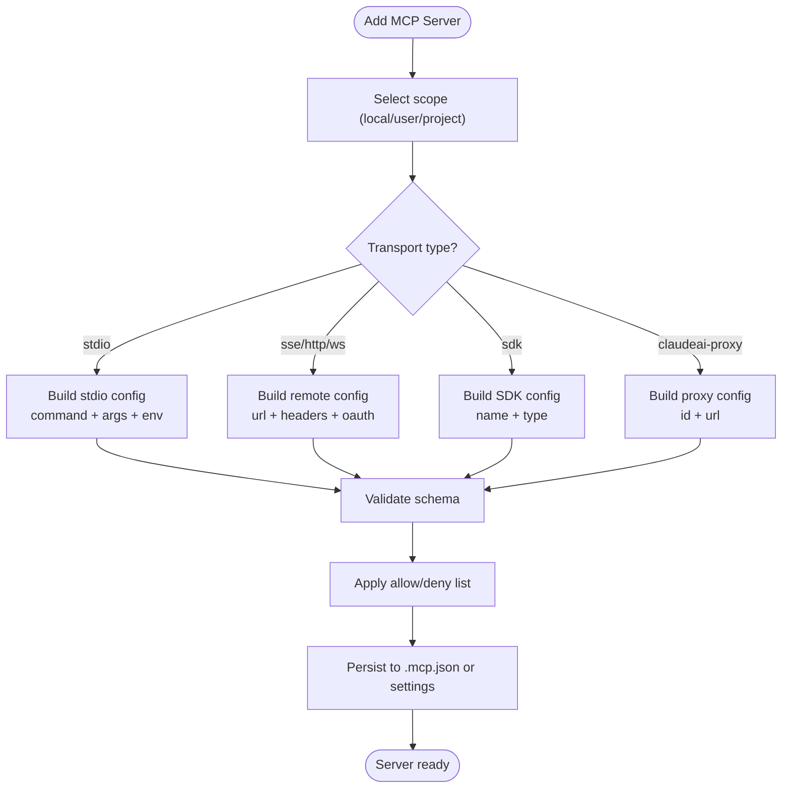
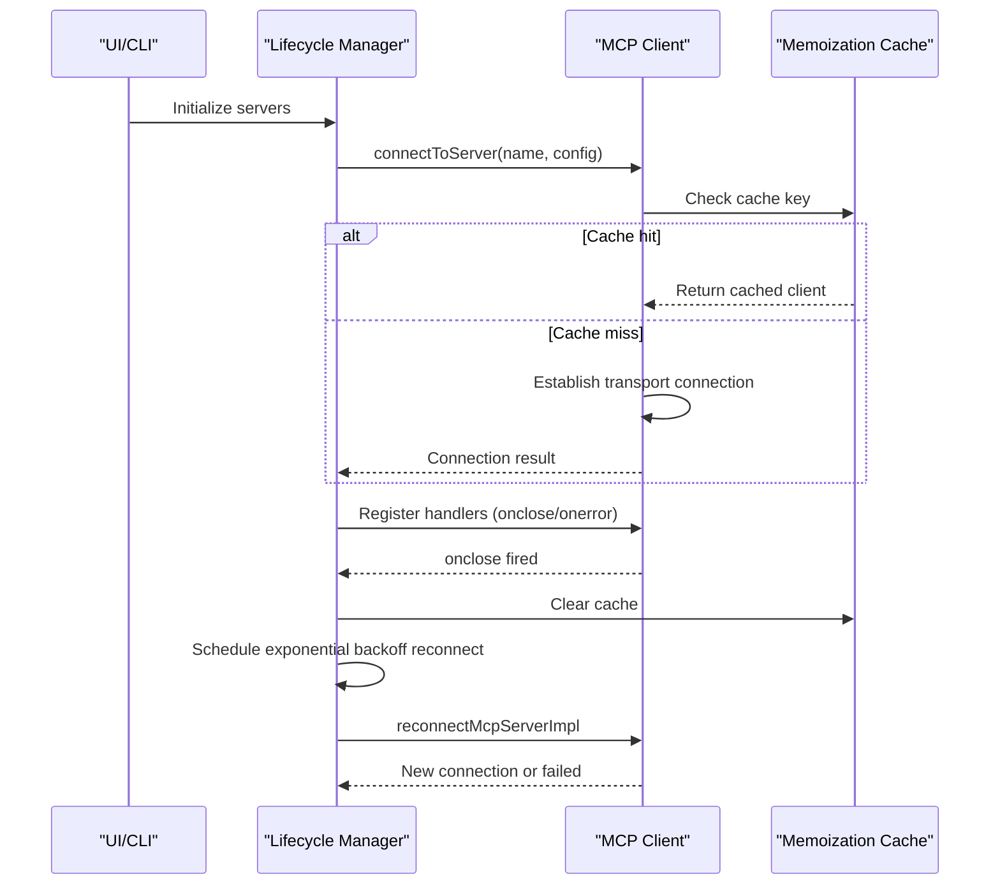
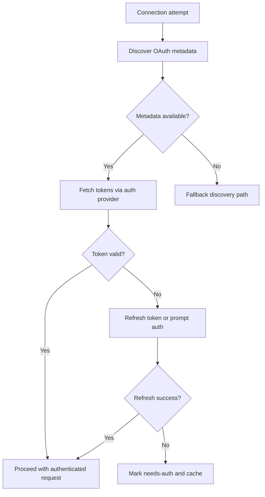
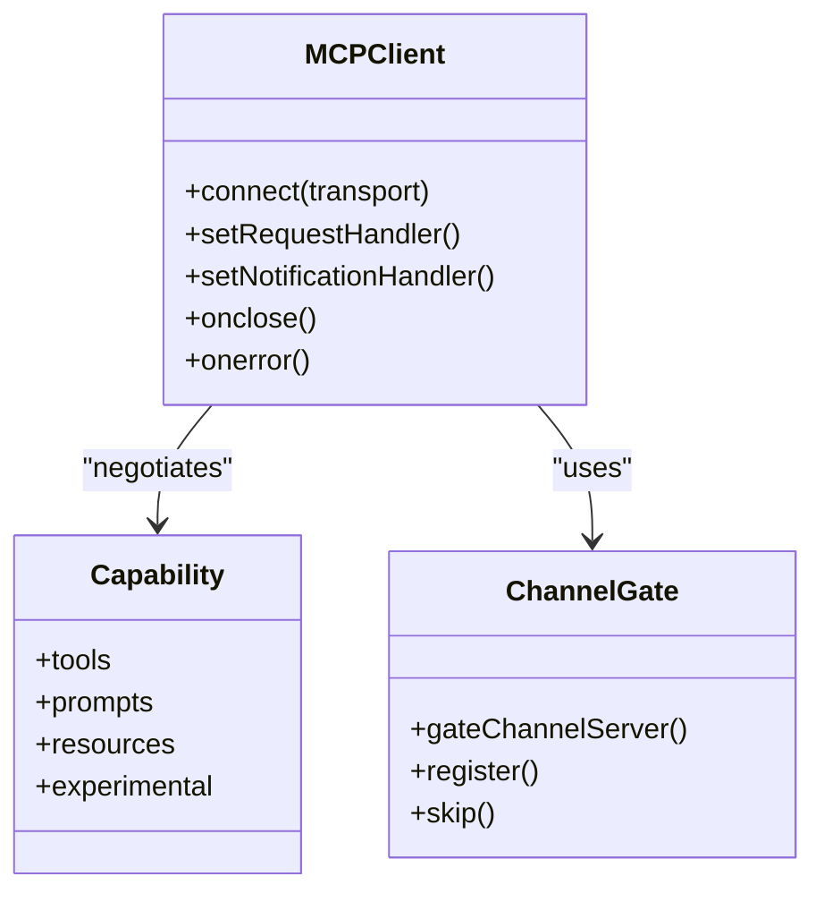
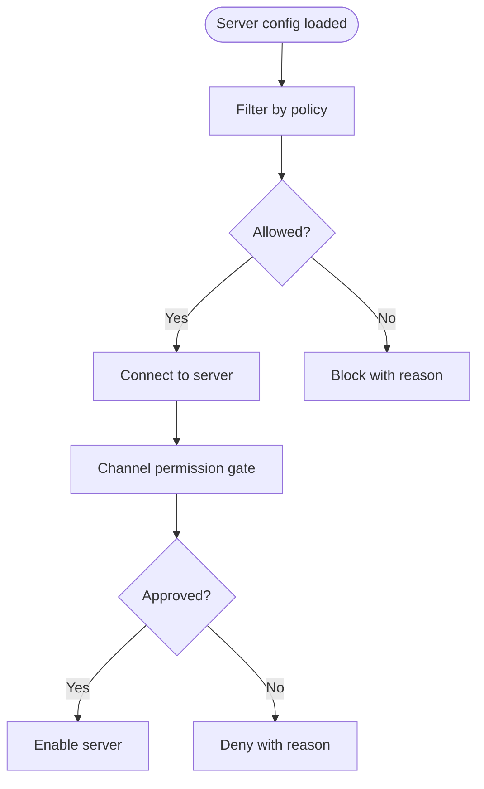
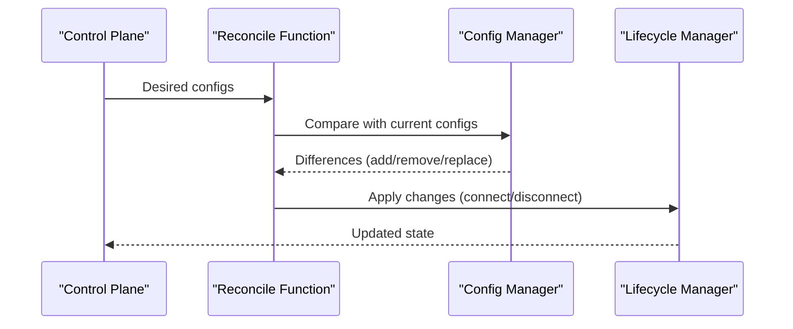
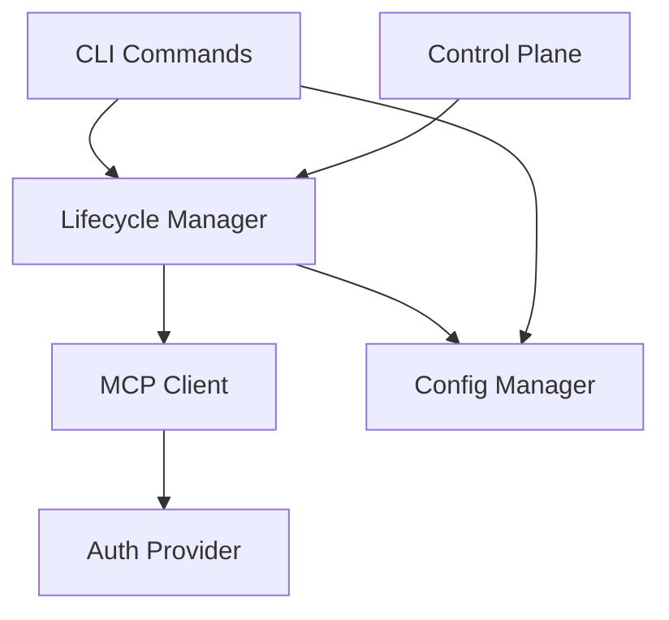

# MCP Server Management

<cite>
**Referenced Files in This Document**
- [client.ts](file://src/services/mcp/client.ts)
- [config.ts](file://src/services/mcp/config.ts)
- [auth.ts](file://src/services/mcp/auth.ts)
- [types.ts](file://src/services/mcp/types.ts)
- [useManageMCPConnections.ts](file://src/services/mcp/useManageMCPConnections.ts)
- [addCommand.ts](file://src/commands/mcp/addCommand.ts)
- [index.ts](file://src/commands/mcp/index.ts)
- [print.ts](file://src/cli/print.ts)
- [main.tsx](file://src/main.tsx)
</cite>

## Table of Contents
1. [Introduction](#introduction)
2. [Project Structure](#project-structure)
3. [Core Components](#core-components)
4. [Architecture Overview](#architecture-overview)
5. [Detailed Component Analysis](#detailed-component-analysis)
6. [Dependency Analysis](#dependency-analysis)
7. [Performance Considerations](#performance-considerations)
8. [Troubleshooting Guide](#troubleshooting-guide)
9. [Conclusion](#conclusion)

## Introduction
This document provides comprehensive guidance for managing MCP (Model Context Protocol) servers within the Claude Code ecosystem. It covers server configuration, connection handling, lifecycle management, authentication, discovery, capability negotiation, channel management, approval workflows, permissions, allowlist configurations, performance optimization, and troubleshooting. The goal is to equip both developers and operators with practical knowledge to deploy, monitor, and maintain MCP servers effectively.

## Project Structure
The MCP server management system spans several modules:
- Services: Core connection logic, configuration parsing, authentication, and UI lifecycle management
- Commands: CLI commands for adding and managing MCP servers
- Types: Strongly typed configuration and connection schemas
- CLI: Control plane integration for dynamic server reconciliation

**Diagram sources**
- [addCommand.ts:1-281](file://src/commands/mcp/addCommand.ts#L1-281)
- [config.ts:1-800](file://src/services/mcp/config.ts#L1-800)
- [client.ts:1-800](file://src/services/mcp/client.ts#L1-800)
- [auth.ts:1-800](file://src/services/mcp/auth.ts#L1-800)
- [useManageMCPConnections.ts:1-800](file://src/services/mcp/useManageMCPConnections.ts#L1-800)

**Section sources**
- [addCommand.ts:1-281](file://src/commands/mcp/addCommand.ts#L1-281)
- [config.ts:1-800](file://src/services/mcp/config.ts#L1-800)
- [client.ts:1-800](file://src/services/mcp/client.ts#L1-800)
- [auth.ts:1-800](file://src/services/mcp/auth.ts#L1-800)
- [useManageMCPConnections.ts:1-800](file://src/services/mcp/useManageMCPConnections.ts#L1-800)

## Core Components
- MCP Client: Establishes and maintains connections across transports (stdio, SSE, HTTP, WebSocket, SDK), manages timeouts, retries, and error handling
- Configuration Manager: Validates, expands environment variables, filters by policy, and persists server configurations
- Authentication Provider: Handles OAuth discovery, token refresh, cross-app access (XAA), and secure token storage
- Connection Lifecycle: Orchestrates connection attempts, automatic reconnection with exponential backoff, capability negotiation, and notification subscriptions
- CLI Integration: Adds servers, reconciles dynamic configurations, and integrates with the control plane

**Section sources**
- [client.ts:595-1641](file://src/services/mcp/client.ts#L595-1641)
- [config.ts:536-761](file://src/services/mcp/config.ts#L536-761)
- [auth.ts:256-311](file://src/services/mcp/auth.ts#L256-311)
- [useManageMCPConnections.ts:310-763](file://src/services/mcp/useManageMCPConnections.ts#L310-763)

## Architecture Overview
The MCP system follows a layered architecture:
- Transport Abstraction: Unified client connects via stdio, SSE, HTTP, WebSocket, or SDK transports
- Capability Negotiation: Clients declare capabilities and react to server capabilities
- Policy Enforcement: Allow/deny lists and enterprise policies govern server availability
- Authentication Pipeline: Discovery, token refresh, and XAA flows
- Lifecycle Management: Automatic reconnection, cache invalidation, and state synchronization

**Diagram sources**
- [client.ts:595-1641](file://src/services/mcp/client.ts#L595-1641)
- [auth.ts:256-311](file://src/services/mcp/auth.ts#L256-311)
- [config.ts:536-761](file://src/services/mcp/config.ts#L536-761)
- [useManageMCPConnections.ts:354-467](file://src/services/mcp/useManageMCPConnections.ts#L354-467)

## Detailed Component Analysis

### Server Configuration and Setup
- Configuration scopes: local, user, project, dynamic, enterprise, claudeai, managed
- Supported transports: stdio, SSE, SSE-IDE, HTTP, WebSocket, SDK, claude.ai proxy
- Schema validation and environment expansion
- Policy filtering: allowlist/denylist enforcement with name/command/URL patterns
- Enterprise MCP configuration precedence

**Diagram sources**
- [addCommand.ts:33-281](file://src/commands/mcp/addCommand.ts#L33-281)
- [config.ts:536-761](file://src/services/mcp/config.ts#L536-761)
- [types.ts:108-175](file://src/services/mcp/types.ts#L108-175)

**Section sources**
- [addCommand.ts:33-281](file://src/commands/mcp/addCommand.ts#L33-281)
- [config.ts:536-761](file://src/services/mcp/config.ts#L536-761)
- [types.ts:108-175](file://src/services/mcp/types.ts#L108-175)

### Connection Handling and Lifecycle Management
- Transport selection and initialization
- Connection timeouts and transport-specific behaviors
- Automatic reconnection with exponential backoff for remote transports
- Cache invalidation and memoization for efficient reconnects
- Capability negotiation and notification subscriptions
- IDE-specific transports and in-process server execution

**Diagram sources**
- [client.ts:595-1641](file://src/services/mcp/client.ts#L595-1641)
- [useManageMCPConnections.ts:333-467](file://src/services/mcp/useManageMCPConnections.ts#L333-467)

**Section sources**
- [client.ts:595-1641](file://src/services/mcp/client.ts#L595-1641)
- [useManageMCPConnections.ts:333-467](file://src/services/mcp/useManageMCPConnections.ts#L333-467)

### Authentication Methods and Discovery
- OAuth metadata discovery via RFC 9728 → RFC 8414
- Token refresh with robust error handling and normalization
- Cross-app access (XAA) for shared identity across servers
- Secure token storage and revocation
- Step-up authentication and discovery state preservation

**Diagram sources**
- [auth.ts:256-311](file://src/services/mcp/auth.ts#L256-311)
- [client.ts:340-361](file://src/services/mcp/client.ts#L340-361)

**Section sources**
- [auth.ts:256-311](file://src/services/mcp/auth.ts#L256-311)
- [client.ts:340-361](file://src/services/mcp/client.ts#L340-361)

### Capability Negotiation and Channel Management
- Capability negotiation during connection
- Notification subscriptions for tools, prompts, and resources
- Channel permission gating and messaging
- Dynamic reconciliation of MCP servers in the control plane

**Diagram sources**
- [client.ts:985-1002](file://src/services/mcp/client.ts#L985-1002)
- [useManageMCPConnections.ts:474-561](file://src/services/mcp/useManageMCPConnections.ts#L474-561)

**Section sources**
- [client.ts:985-1002](file://src/services/mcp/client.ts#L985-1002)
- [useManageMCPConnections.ts:474-561](file://src/services/mcp/useManageMCPConnections.ts#L474-561)

### Server Approval Workflows and Permissions
- Allow/deny list enforcement with name/command/URL patterns
- Enterprise MCP configuration precedence
- Policy filtering for user-controlled and plugin-provided servers
- Permission callbacks for channel interactions

**Diagram sources**
- [config.ts:536-551](file://src/services/mcp/config.ts#L536-551)
- [useManageMCPConnections.ts:474-613](file://src/services/mcp/useManageMCPConnections.ts#L474-613)

**Section sources**
- [config.ts:536-551](file://src/services/mcp/config.ts#L536-551)
- [useManageMCPConnections.ts:474-613](file://src/services/mcp/useManageMCPConnections.ts#L474-613)

### Practical Configuration Examples
- Adding an HTTP server with headers and OAuth client ID
- Adding a stdio server with environment variables
- Enabling XAA for cross-application access
- Managing server scope (local/user/project)

Example paths:
- [Add HTTP server:193-238](file://src/commands/mcp/addCommand.ts#L193-238)
- [Add stdio server:251-274](file://src/commands/mcp/addCommand.ts#L251-274)
- [XAA setup validation:103-122](file://src/commands/mcp/addCommand.ts#L103-122)

**Section sources**
- [addCommand.ts:193-238](file://src/commands/mcp/addCommand.ts#L193-238)
- [addCommand.ts:251-274](file://src/commands/mcp/addCommand.ts#L251-274)
- [addCommand.ts:103-122](file://src/commands/mcp/addCommand.ts#L103-122)

### Dynamic Server Reconciliation
- Control plane integration for dynamic server management
- Reconciliation of desired vs. current state
- Handling additions, removals, and config changes

**Diagram sources**
- [print.ts:5446-5478](file://src/cli/print.ts#L5446-5478)
- [config.ts:536-551](file://src/services/mcp/config.ts#L536-551)

**Section sources**
- [print.ts:5446-5478](file://src/cli/print.ts#L5446-5478)
- [config.ts:536-551](file://src/services/mcp/config.ts#L536-551)

## Dependency Analysis
Key dependencies and relationships:
- Client depends on auth provider for OAuth flows
- Lifecycle manager orchestrates client connections and reconnections
- Config manager validates and filters server configurations
- CLI commands integrate with both config and lifecycle managers

**Diagram sources**
- [client.ts:595-1641](file://src/services/mcp/client.ts#L595-1641)
- [auth.ts:256-311](file://src/services/mcp/auth.ts#L256-311)
- [useManageMCPConnections.ts:310-763](file://src/services/mcp/useManageMCPConnections.ts#L310-763)
- [addCommand.ts:33-281](file://src/commands/mcp/addCommand.ts#L33-281)

**Section sources**
- [client.ts:595-1641](file://src/services/mcp/client.ts#L595-1641)
- [auth.ts:256-311](file://src/services/mcp/auth.ts#L256-311)
- [useManageMCPConnections.ts:310-763](file://src/services/mcp/useManageMCPConnections.ts#L310-763)
- [addCommand.ts:33-281](file://src/commands/mcp/addCommand.ts#L33-281)

## Performance Considerations
- Connection batching: Separate concurrency limits for local (stdio/sdk) and remote transports
- Memoization: Client and fetch caches reduce redundant connections and metadata queries
- Timeout strategies: Transport-specific timeouts and connection timeouts prevent hangs
- Backoff: Exponential backoff for reconnection reduces server load and improves resilience
- Resource limits: LRU caches for fetched tools/prompts/resources bound memory usage

[No sources needed since this section provides general guidance]

## Troubleshooting Guide
Common issues and resolutions:
- Connection timeouts: Verify transport configuration, network connectivity, and proxy settings
- Authentication failures: Check OAuth metadata discovery, token validity, and XAA configuration
- Session expiration: Look for 404 with JSON-RPC -32001 and rely on automatic session recovery
- Policy denials: Review allow/deny list entries and enterprise MCP configuration
- IDE transport issues: Confirm IDE-specific headers and token requirements

Diagnostic references:
- [Connection timeout handling:1048-1080](file://src/services/mcp/client.ts#L1048-1080)
- [Authentication failure handling:1105-1154](file://src/services/mcp/client.ts#L1105-1154)
- [Session expiration detection:1313-1329](file://src/services/mcp/client.ts#L1313-1329)
- [Policy filtering:536-551](file://src/services/mcp/config.ts#L536-551)
- [IDE transport handling:1199-1214](file://src/services/mcp/client.ts#L1199-1214)

**Section sources**
- [client.ts:1048-1080](file://src/services/mcp/client.ts#L1048-1080)
- [client.ts:1105-1154](file://src/services/mcp/client.ts#L1105-1154)
- [client.ts:1313-1329](file://src/services/mcp/client.ts#L1313-1329)
- [config.ts:536-551](file://src/services/mcp/config.ts#L536-551)
- [client.ts:1199-1214](file://src/services/mcp/client.ts#L1199-1214)

## Conclusion
The MCP server management system provides a robust, policy-aware framework for connecting to diverse MCP servers with strong authentication, capability negotiation, and resilient lifecycle management. By leveraging configuration scoping, policy enforcement, and automated reconnection strategies, teams can reliably operate MCP integrations across development and enterprise environments.