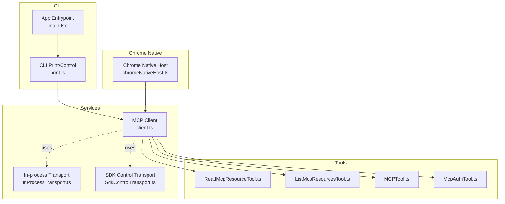
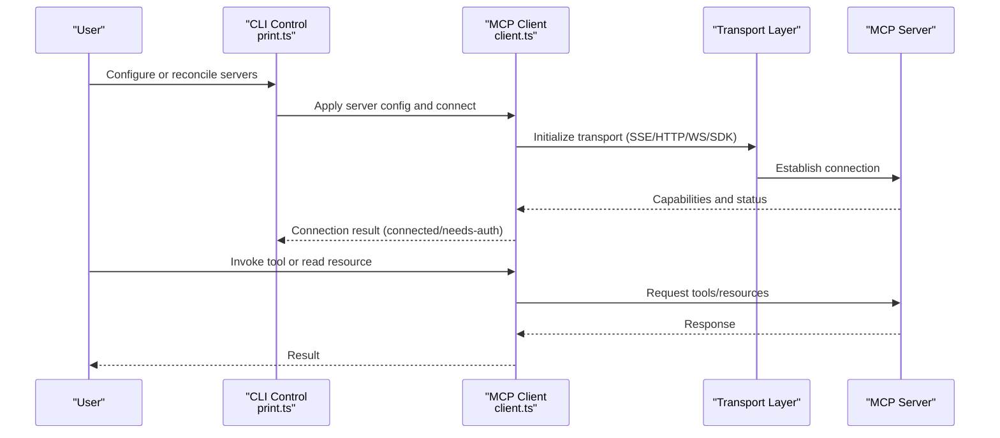
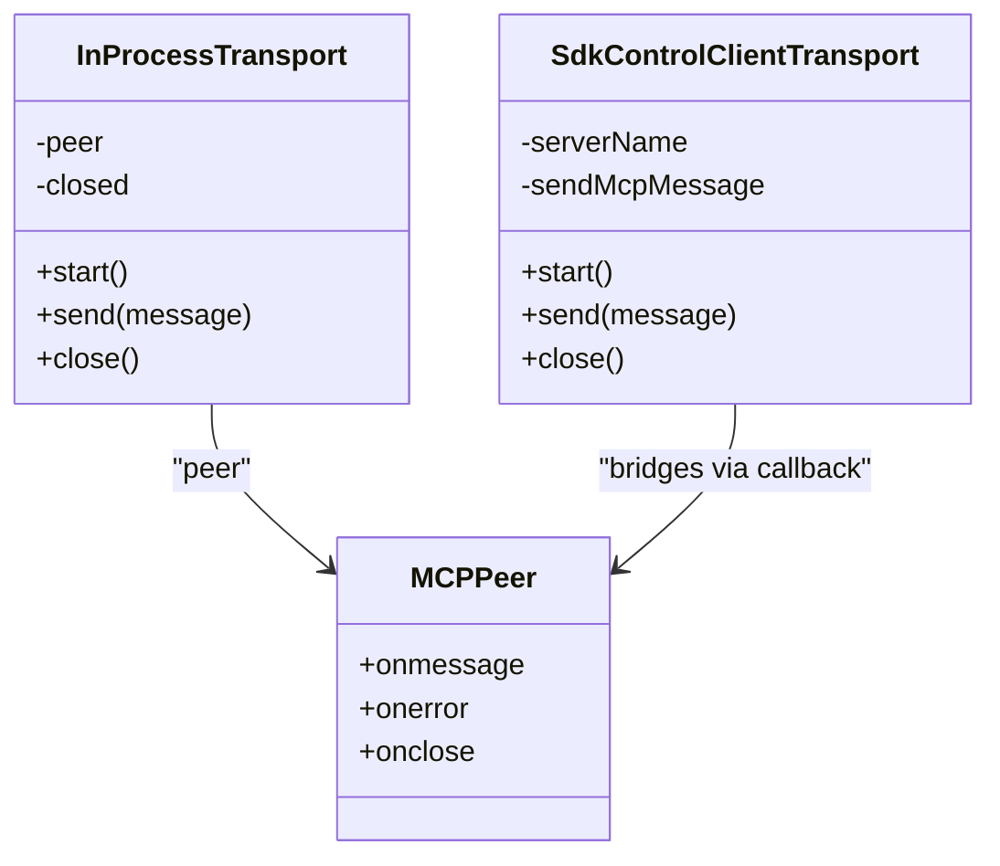
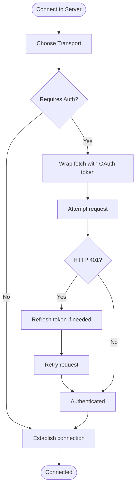
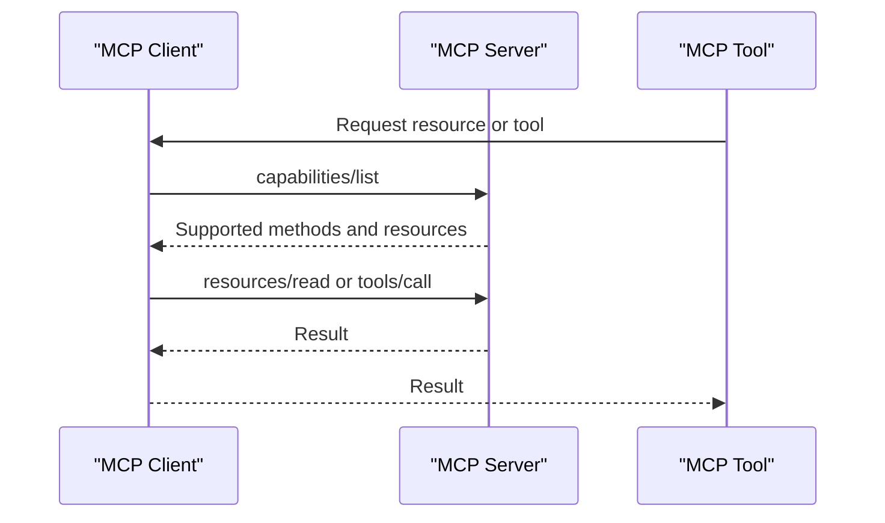
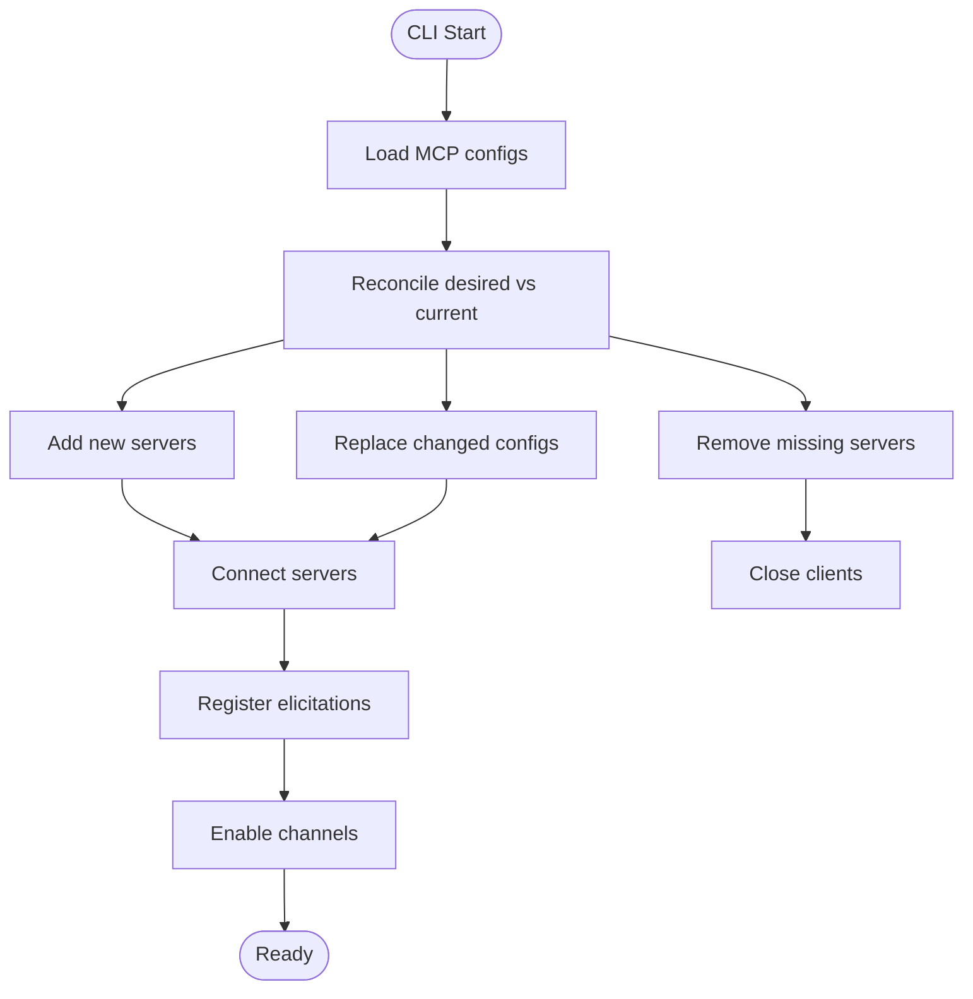
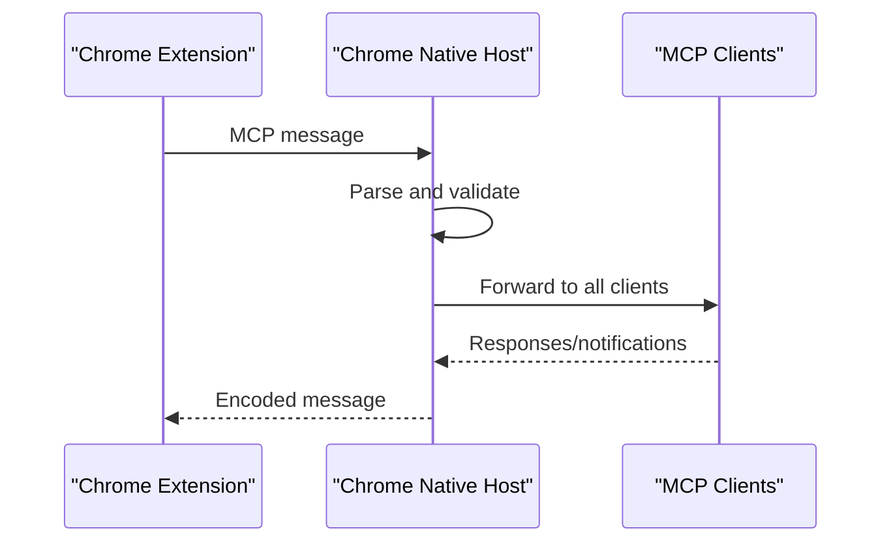
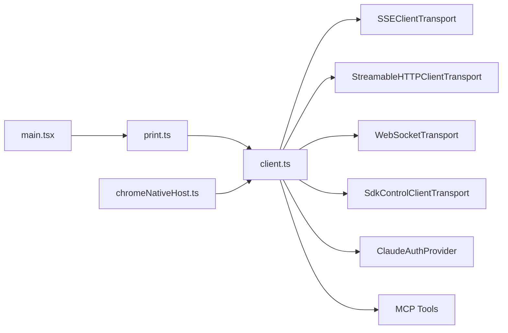

# Model Context Protocol (MCP)

<cite>
**Referenced Files in This Document**
- [client.ts](file://claude_code_src/restored-src/src/services/mcp/client.ts)
- [InProcessTransport.ts](file://claude_code_src/restored-src/src/services/mcp/InProcessTransport.ts)
- [SdkControlTransport.ts](file://claude_code_src/restored-src/src/services/mcp/SdkControlTransport.ts)
- [print.ts](file://claude_code_src/restored-src/src/cli/print.ts)
- [main.tsx](file://claude_code_src/restored-src/src/main.tsx)
- [ReadMcpResourceTool.ts](file://claude_code_src/restored-src/src/tools/ReadMcpResourceTool/ReadMcpResourceTool.ts)
- [ListMcpResourcesTool.ts](file://claude_code_src/restored-src/src/tools/ListMcpResourcesTool/ListMcpResourcesTool.ts)
- [MCPTool.ts](file://claude_code_src/restored-src/src/tools/MCPTool/MCPTool.ts)
- [McpAuthTool.ts](file://claude_code_src/restored-src/src/tools/McpAuthTool/McpAuthTool.ts)
- [chromeNativeHost.ts](file://claude_code_src/restored-src/src/utils/claudeInChrome/chromeNativeHost.ts)
</cite>

## Table of Contents
1. [Introduction](#introduction)
2. [Project Structure](#project-structure)
3. [Core Components](#core-components)
4. [Architecture Overview](#architecture-overview)
5. [Detailed Component Analysis](#detailed-component-analysis)
6. [Dependency Analysis](#dependency-analysis)
7. [Performance Considerations](#performance-considerations)
8. [Troubleshooting Guide](#troubleshooting-guide)
9. [Conclusion](#conclusion)
10. [Appendices](#appendices)

## Introduction
This document explains the Model Context Protocol (MCP) integration in the project, focusing on how third-party tools connect via MCP servers. It covers MCP architecture, server-client communication, resource management, configuration, authentication, capability negotiation, and practical usage patterns. It also provides guidance for both users and developers implementing or extending MCP capabilities.

## Project Structure
The MCP integration spans several areas:
- Services that manage MCP client connections, transports, and authentication
- Tools that expose MCP capabilities to the assistant and UI
- CLI orchestration for dynamic server management and control
- Utilities for Chrome-native MCP bridging and messaging

**Diagram sources**
- [client.ts](file://claude_code_src/restored-src/src/services/mcp/client.ts)
- [InProcessTransport.ts](file://claude_code_src/restored-src/src/services/mcp/InProcessTransport.ts)
- [SdkControlTransport.ts](file://claude_code_src/restored-src/src/services/mcp/SdkControlTransport.ts)
- [ReadMcpResourceTool.ts](file://claude_code_src/restored-src/src/tools/ReadMcpResourceTool/ReadMcpResourceTool.ts)
- [ListMcpResourcesTool.ts](file://claude_code_src/restored-src/src/tools/ListMcpResourcesTool/ListMcpResourcesTool.ts)
- [MCPTool.ts](file://claude_code_src/restored-src/src/tools/MCPTool/MCPTool.ts)
- [McpAuthTool.ts](file://claude_code_src/restored-src/src/tools/McpAuthTool/McpAuthTool.ts)
- [print.ts](file://claude_code_src/restored-src/src/cli/print.ts)
- [main.tsx](file://claude_code_src/restored-src/src/main.tsx)
- [chromeNativeHost.ts](file://claude_code_src/restored-src/src/utils/claudeInChrome/chromeNativeHost.ts)

**Section sources**
- [client.ts](file://claude_code_src/restored-src/src/services/mcp/client.ts)
- [InProcessTransport.ts](file://claude_code_src/restored-src/src/services/mcp/InProcessTransport.ts)
- [SdkControlTransport.ts](file://claude_code_src/restored-src/src/services/mcp/SdkControlTransport.ts)
- [print.ts](file://claude_code_src/restored-src/src/cli/print.ts)
- [main.tsx](file://claude_code_src/restored-src/src/main.tsx)
- [ReadMcpResourceTool.ts](file://claude_code_src/restored-src/src/tools/ReadMcpResourceTool/ReadMcpResourceTool.ts)
- [ListMcpResourcesTool.ts](file://claude_code_src/restored-src/src/tools/ListMcpResourcesTool/ListMcpResourcesTool.ts)
- [MCPTool.ts](file://claude_code_src/restored-src/src/tools/MCPTool/MCPTool.ts)
- [McpAuthTool.ts](file://claude_code_src/restored-src/src/tools/McpAuthTool/McpAuthTool.ts)
- [chromeNativeHost.ts](file://claude_code_src/restored-src/src/utils/claudeInChrome/chromeNativeHost.ts)

## Core Components
- MCP Client: Manages transports, authentication, timeouts, and tool/resource access. It supports SSE, HTTP, WebSocket, and SDK transports and integrates with Claude.ai proxy flows.
- Transports:
  - In-process transport pair for same-process server/client pairing.
  - SDK control transport for bridging MCP messages between CLI and SDK processes.
- Tools:
  - ReadMcpResourceTool: Reads a specific MCP resource by URI.
  - ListMcpResourcesTool: Lists MCP resources exposed by a server.
  - MCPTool: Bridges MCP capabilities into assistant tool calls.
  - McpAuthTool: Handles MCP authentication flows and clearing stored credentials.
- CLI Control: Orchestrates dynamic MCP server reconciliation, channel enablement, and authentication actions.
- Chrome Native Host: Bridges MCP messages to/from the Chrome extension/native host.

**Section sources**
- [client.ts](file://claude_code_src/restored-src/src/services/mcp/client.ts)
- [InProcessTransport.ts](file://claude_code_src/restored-src/src/services/mcp/InProcessTransport.ts)
- [SdkControlTransport.ts](file://claude_code_src/restored-src/src/services/mcp/SdkControlTransport.ts)
- [ReadMcpResourceTool.ts](file://claude_code_src/restored-src/src/tools/ReadMcpResourceTool/ReadMcpResourceTool.ts)
- [ListMcpResourcesTool.ts](file://claude_code_src/restored-src/src/tools/ListMcpResourcesTool/ListMcpResourcesTool.ts)
- [MCPTool.ts](file://claude_code_src/restored-src/src/tools/MCPTool/MCPTool.ts)
- [McpAuthTool.ts](file://claude_code_src/restored-src/src/tools/McpAuthTool/McpAuthTool.ts)
- [print.ts](file://claude_code_src/restored-src/src/cli/print.ts)
- [chromeNativeHost.ts](file://claude_code_src/restored-src/src/utils/claudeInChrome/chromeNativeHost.ts)

## Architecture Overview
MCP client connects to servers via multiple transports. The client handles authentication, capability negotiation, and resource/tool access. The CLI manages dynamic server configurations and control messages. Chrome integration forwards MCP messages to/from the native host.

**Diagram sources**
- [client.ts](file://claude_code_src/restored-src/src/services/mcp/client.ts)
- [print.ts](file://claude_code_src/restored-src/src/cli/print.ts)

## Detailed Component Analysis

### MCP Client and Transports
The MCP client encapsulates connection logic, authentication, and transport selection. It supports SSE, HTTP, WebSocket, and SDK transports. It also normalizes timeouts and headers for Streamable HTTP compliance.

**Diagram sources**
- [InProcessTransport.ts](file://claude_code_src/restored-src/src/services/mcp/InProcessTransport.ts)
- [SdkControlTransport.ts](file://claude_code_src/restored-src/src/services/mcp/SdkControlTransport.ts)

Key behaviors:
- Transport initialization and lifecycle
- Timeout normalization for HTTP requests
- Accept header enforcement for Streamable HTTP
- WebSocket TLS and proxy options
- SSE event source fetch customization

**Section sources**
- [client.ts](file://claude_code_src/restored-src/src/services/mcp/client.ts)
- [InProcessTransport.ts](file://claude_code_src/restored-src/src/services/mcp/InProcessTransport.ts)
- [SdkControlTransport.ts](file://claude_code_src/restored-src/src/services/mcp/SdkControlTransport.ts)

### Authentication and Authorization
The client integrates with Claude.ai proxy flows and handles 401 responses by refreshing tokens and retrying. It caches “needs-auth” entries to avoid repeated prompts and tracks session expiration.

**Diagram sources**
- [client.ts](file://claude_code_src/restored-src/src/services/mcp/client.ts)

**Section sources**
- [client.ts](file://claude_code_src/restored-src/src/services/mcp/client.ts)

### Capability Negotiation and Resource Access
The client discovers server capabilities and exposes tools/resources to the assistant. Tools validate server availability and supported capabilities before invoking requests.

**Diagram sources**
- [client.ts](file://claude_code_src/restored-src/src/services/mcp/client.ts)
- [ReadMcpResourceTool.ts](file://claude_code_src/restored-src/src/tools/ReadMcpResourceTool/ReadMcpResourceTool.ts)
- [ListMcpResourcesTool.ts](file://claude_code_src/restored-src/src/tools/ListMcpResourcesTool/ListMcpResourcesTool.ts)
- [MCPTool.ts](file://claude_code_src/restored-src/src/tools/MCPTool/MCPTool.ts)

**Section sources**
- [client.ts](file://claude_code_src/restored-src/src/services/mcp/client.ts)
- [ReadMcpResourceTool.ts](file://claude_code_src/restored-src/src/tools/ReadMcpResourceTool/ReadMcpResourceTool.ts)
- [ListMcpResourcesTool.ts](file://claude_code_src/restored-src/src/tools/ListMcpResourcesTool/ListMcpResourcesTool.ts)
- [MCPTool.ts](file://claude_code_src/restored-src/src/tools/MCPTool/MCPTool.ts)

### CLI Control and Dynamic Server Management
The CLI reconciles desired MCP server states, registers elicitations, and handles channel enablement and authentication actions.

**Diagram sources**
- [print.ts](file://claude_code_src/restored-src/src/cli/print.ts)

**Section sources**
- [print.ts](file://claude_code_src/restored-src/src/cli/print.ts)
- [main.tsx](file://claude_code_src/restored-src/src/main.tsx)

### Chrome Native Integration
The Chrome native host bridges MCP messages to/from the native environment and forwards tool responses and notifications to connected clients.

**Diagram sources**
- [chromeNativeHost.ts](file://claude_code_src/restored-src/src/utils/claudeInChrome/chromeNativeHost.ts)

**Section sources**
- [chromeNativeHost.ts](file://claude_code_src/restored-src/src/utils/claudeInChrome/chromeNativeHost.ts)

## Dependency Analysis
MCP client depends on:
- Transport implementations (SSE, HTTP, WebSocket, SDK)
- Authentication providers and token refresh logic
- Tool and resource access wrappers
- CLI control for dynamic server management

**Diagram sources**
- [client.ts](file://claude_code_src/restored-src/src/services/mcp/client.ts)
- [SdkControlTransport.ts](file://claude_code_src/restored-src/src/services/mcp/SdkControlTransport.ts)
- [print.ts](file://claude_code_src/restored-src/src/cli/print.ts)
- [main.tsx](file://claude_code_src/restored-src/src/main.tsx)
- [chromeNativeHost.ts](file://claude_code_src/restored-src/src/utils/claudeInChrome/chromeNativeHost.ts)

**Section sources**
- [client.ts](file://claude_code_src/restored-src/src/services/mcp/client.ts)
- [SdkControlTransport.ts](file://claude_code_src/restored-src/src/services/mcp/SdkControlTransport.ts)
- [print.ts](file://claude_code_src/restored-src/src/cli/print.ts)
- [main.tsx](file://claude_code_src/restored-src/src/main.tsx)
- [chromeNativeHost.ts](file://claude_code_src/restored-src/src/utils/claudeInChrome/chromeNativeHost.ts)

## Performance Considerations
- Connection batching: The client supports configurable batch sizes for connecting to multiple servers concurrently.
- Request timeouts: HTTP requests use per-request timeouts to avoid stale signals and improve responsiveness.
- Accept header normalization: Ensures Streamable HTTP compliance to avoid 406 errors.
- Image handling: Validates image MIME types and resizes/downsamples when needed to reduce payload sizes.
- Caching: Authentication cache TTL prevents frequent re-prompts and reduces network churn.

[No sources needed since this section provides general guidance]

## Troubleshooting Guide
Common issues and remedies:
- Authentication failures:
  - Use the MCP authentication tool to clear stored credentials and reconnect.
  - For Claude.ai proxy servers, ensure OAuth tokens are present and refresh as needed.
- Session expiration:
  - Look for “Session not found” errors and reconnect the client.
- Transport-specific problems:
  - SSE/HTTP: Verify headers and accept values; ensure proxy settings are correct.
  - WebSocket: Confirm TLS options, proxy URLs, and user-agent headers.
- Resource access:
  - Ensure the server supports resources and the requested URI is valid.
- Chrome integration:
  - Confirm the native host is forwarding messages and clients are registered.

**Section sources**
- [client.ts](file://claude_code_src/restored-src/src/services/mcp/client.ts)
- [McpAuthTool.ts](file://claude_code_src/restored-src/src/tools/McpAuthTool/McpAuthTool.ts)
- [ReadMcpResourceTool.ts](file://claude_code_src/restored-src/src/tools/ReadMcpResourceTool/ReadMcpResourceTool.ts)
- [chromeNativeHost.ts](file://claude_code_src/restored-src/src/utils/claudeInChrome/chromeNativeHost.ts)

## Conclusion
The MCP integration provides a robust framework for connecting third-party tools and resources through standardized transports and authentication. The client’s transport abstractions, capability negotiation, and CLI-driven dynamic management enable flexible and secure integrations across diverse environments, including Chrome and local processes.

[No sources needed since this section summarizes without analyzing specific files]

## Appendices

### Practical Examples

- MCP server setup (dynamic):
  - Define server configurations and reconcile them via CLI control.
  - The app parses and validates MCP config inputs and applies them to the current state.

- Client integration:
  - Use MCP tools to list resources and read specific URIs.
  - Invoke MCP tools through the assistant tool interface.

- Third-party tool connectivity:
  - Ensure the server advertises capabilities and supports the required methods.
  - Handle authentication and session expiration gracefully.

**Section sources**
- [print.ts](file://claude_code_src/restored-src/src/cli/print.ts)
- [main.tsx](file://claude_code_src/restored-src/src/main.tsx)
- [ReadMcpResourceTool.ts](file://claude_code_src/restored-src/src/tools/ReadMcpResourceTool/ReadMcpResourceTool.ts)
- [ListMcpResourcesTool.ts](file://claude_code_src/restored-src/src/tools/ListMcpResourcesTool/ListMcpResourcesTool.ts)
- [MCPTool.ts](file://claude_code_src/restored-src/src/tools/MCPTool/MCPTool.ts)