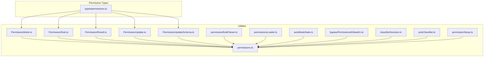
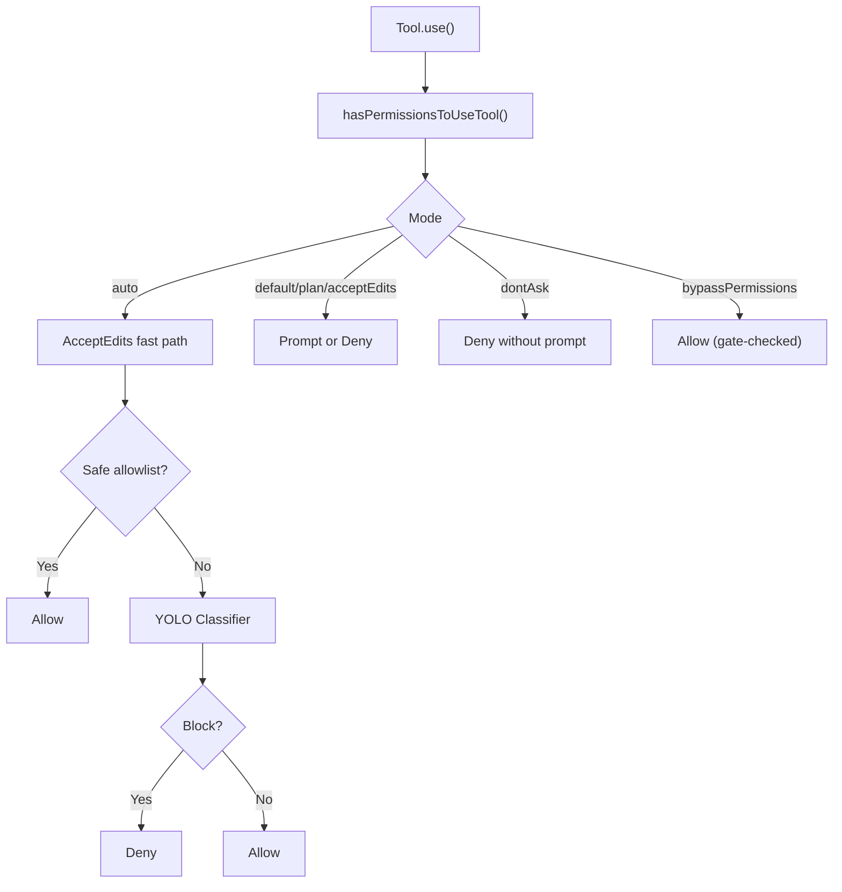
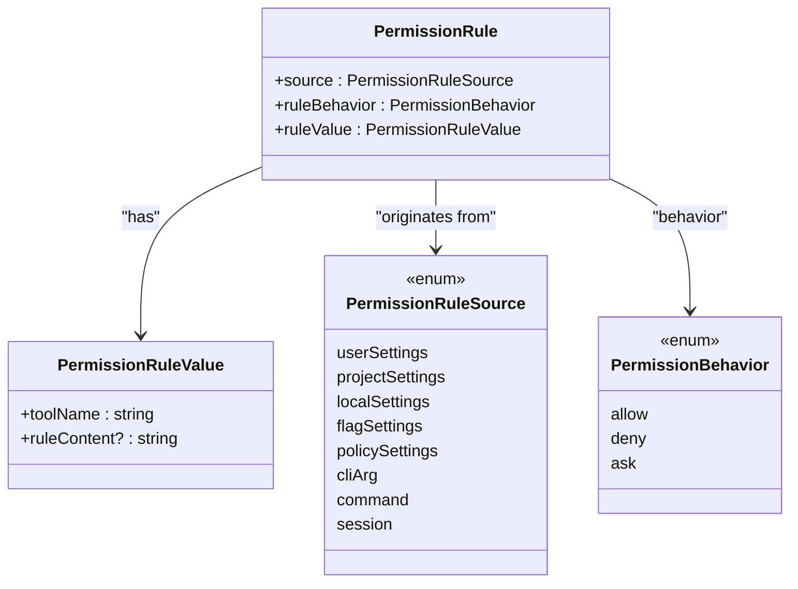
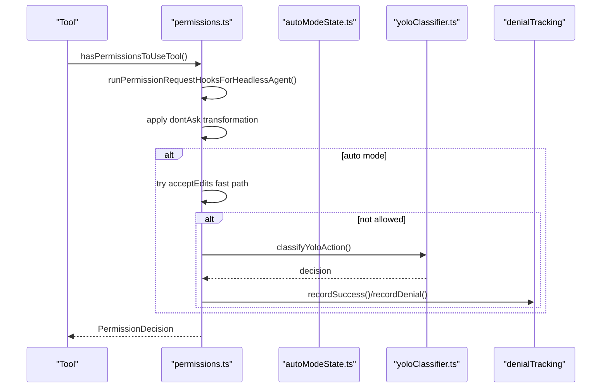
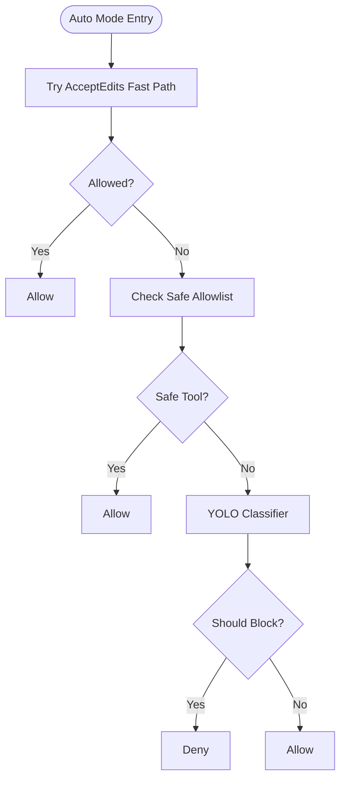
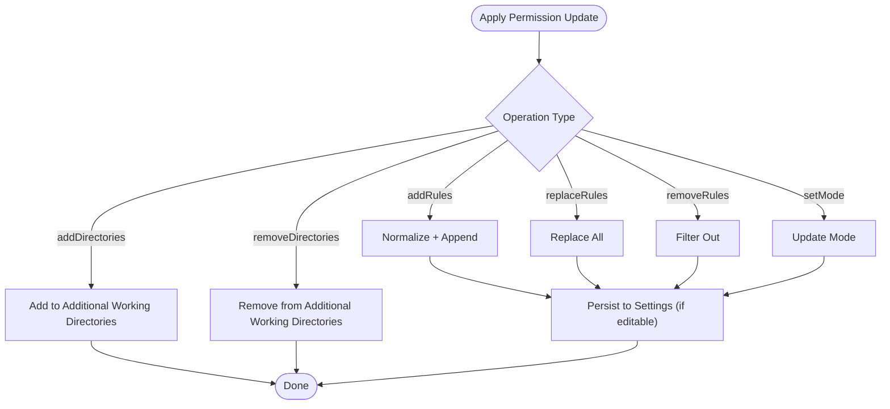
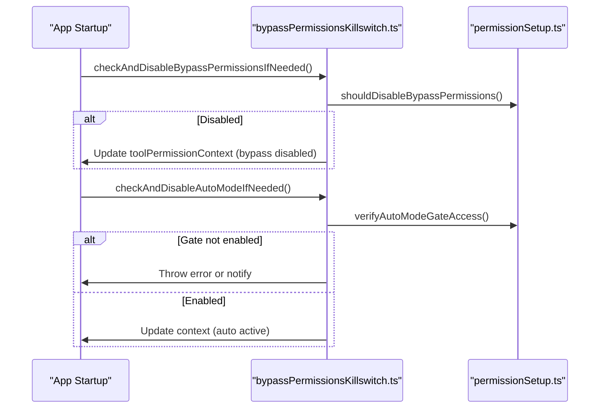
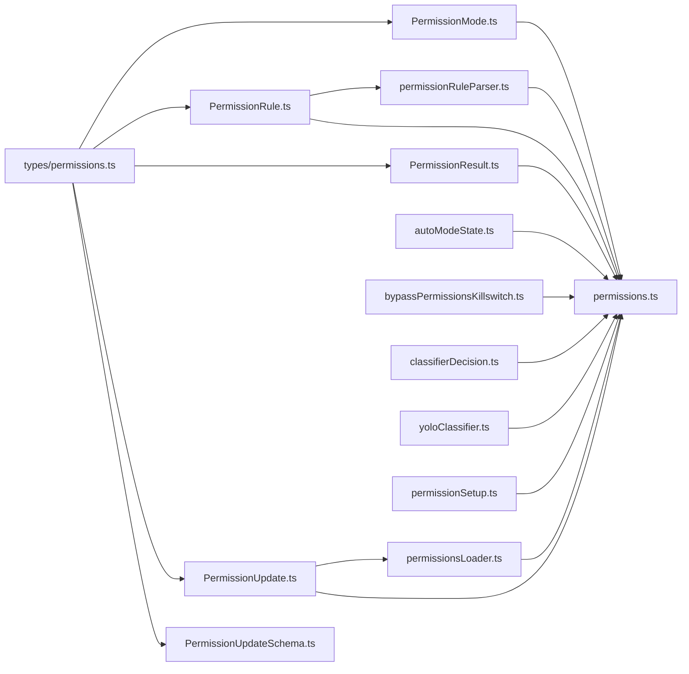

# Permission Architecture

<cite>
**Referenced Files in This Document**
- [PermissionMode.ts](file://src/utils/permissions/PermissionMode.ts)
- [PermissionRule.ts](file://src/utils/permissions/PermissionRule.ts)
- [PermissionResult.ts](file://src/utils/permissions/PermissionResult.ts)
- [PermissionUpdate.ts](file://src/utils/permissions/PermissionUpdate.ts)
- [PermissionUpdateSchema.ts](file://src/utils/permissions/PermissionUpdateSchema.ts)
- [autoModeState.ts](file://src/utils/permissions/autoModeState.ts)
- [bypassPermissionsKillswitch.ts](file://src/utils/permissions/bypassPermissionsKillswitch.ts)
- [classifierDecision.ts](file://src/utils/permissions/classifierDecision.ts)
- [permissions.ts](file://src/utils/permissions/permissions.ts)
- [permissionsLoader.ts](file://src/utils/permissions/permissionsLoader.ts)
- [permissionRuleParser.ts](file://src/utils/permissions/permissionRuleParser.ts)
- [yoloClassifier.ts](file://src/utils/permissions/yoloClassifier.ts)
- [permissions.ts](file://src/types/permissions.ts)
- [permissionSetup.ts](file://src/utils/permissions/permissionSetup.ts)
</cite>

## Table of Contents
1. [Introduction](#introduction)
2. [Project Structure](#project-structure)
3. [Core Components](#core-components)
4. [Architecture Overview](#architecture-overview)
5. [Detailed Component Analysis](#detailed-component-analysis)
6. [Dependency Analysis](#dependency-analysis)
7. [Performance Considerations](#performance-considerations)
8. [Troubleshooting Guide](#troubleshooting-guide)
9. [Conclusion](#conclusion)

## Introduction
This document explains the permission architecture and core permission system. It covers the permission classification system (automatic, interactive, and bypass modes), the permission evaluation engine, rule matching algorithms, decision-making processes, state management, caching mechanisms, performance optimizations, examples of permission flows and inheritance patterns, and security boundary enforcement. It also documents debugging tools, audit trails, and security monitoring capabilities.

## Project Structure
The permission system is implemented primarily under src/utils/permissions with supporting types in src/types/permissions. Key modules include:
- Permission classification and modes
- Rule definition, parsing, and persistence
- Permission evaluation engine
- Auto mode classifier and allowlists
- Bypass permissions killswitch and gates
- Denial tracking and state management
- Permission updates and persistence

**Diagram sources**
- [PermissionMode.ts:1-142](file://src/utils/permissions/PermissionMode.ts#L1-L142)
- [PermissionRule.ts:1-41](file://src/utils/permissions/PermissionRule.ts#L1-L41)
- [PermissionResult.ts:1-36](file://src/utils/permissions/PermissionResult.ts#L1-L36)
- [PermissionUpdate.ts:1-390](file://src/utils/permissions/PermissionUpdate.ts#L1-L390)
- [PermissionUpdateSchema.ts:1-79](file://src/utils/permissions/PermissionUpdateSchema.ts#L1-L79)
- [permissionRuleParser.ts:1-199](file://src/utils/permissions/permissionRuleParser.ts#L1-L199)
- [permissionsLoader.ts:1-297](file://src/utils/permissions/permissionsLoader.ts#L1-L297)
- [autoModeState.ts:1-40](file://src/utils/permissions/autoModeState.ts#L1-L40)
- [bypassPermissionsKillswitch.ts:1-156](file://src/utils/permissions/bypassPermissionsKillswitch.ts#L1-L156)
- [classifierDecision.ts:1-99](file://src/utils/permissions/classifierDecision.ts#L1-L99)
- [yoloClassifier.ts:1-800](file://src/utils/permissions/yoloClassifier.ts#L1-L800)
- [permissions.ts:1-800](file://src/utils/permissions/permissions.ts#L1-L800)
- [permissionSetup.ts:1-800](file://src/utils/permissions/permissionSetup.ts#L1-L800)
- [permissions.ts:1-442](file://src/types/permissions.ts#L1-L442)

**Section sources**
- [PermissionMode.ts:1-142](file://src/utils/permissions/PermissionMode.ts#L1-L142)
- [PermissionRule.ts:1-41](file://src/utils/permissions/PermissionRule.ts#L1-L41)
- [PermissionUpdate.ts:1-390](file://src/utils/permissions/PermissionUpdate.ts#L1-L390)
- [permissions.ts:1-800](file://src/utils/permissions/permissions.ts#L1-L800)
- [permissions.ts:1-442](file://src/types/permissions.ts#L1-L442)

## Core Components
- Permission modes and classification: default, plan, acceptEdits, bypassPermissions, dontAsk, auto (ant-only), bubble (ant-only).
- Permission rules: allow, deny, ask with tool-level and content-level specificity.
- Permission evaluation engine: rule matching, mode-based decisions, hook-driven decisions, and auto mode classifier.
- Permission updates and persistence: add, replace, remove rules and directories; persist to settings.
- Auto mode classifier and allowlists: safe tool allowlist, acceptEdits fast path, and YOLO classifier.
- Bypass permissions killswitch: organization-level gate to disable bypass mode.
- Denial tracking and state management: consecutive denial counters and persistence.
- Security boundary enforcement: dangerous rule detection and stripping for auto mode.

**Section sources**
- [permissions.ts:1-800](file://src/utils/permissions/permissions.ts#L1-L800)
- [permissions.ts:1-442](file://src/types/permissions.ts#L1-L442)
- [PermissionMode.ts:1-142](file://src/utils/permissions/PermissionMode.ts#L1-L142)
- [PermissionRule.ts:1-41](file://src/utils/permissions/PermissionRule.ts#L1-L41)
- [PermissionUpdate.ts:1-390](file://src/utils/permissions/PermissionUpdate.ts#L1-L390)
- [autoModeState.ts:1-40](file://src/utils/permissions/autoModeState.ts#L1-L40)
- [bypassPermissionsKillswitch.ts:1-156](file://src/utils/permissions/bypassPermissionsKillswitch.ts#L1-L156)
- [classifierDecision.ts:1-99](file://src/utils/permissions/classifierDecision.ts#L1-L99)
- [yoloClassifier.ts:1-800](file://src/utils/permissions/yoloClassifier.ts#L1-L800)

## Architecture Overview
The permission system orchestrates decisions across three primary modes:
- Automatic (auto): Uses a YOLO classifier and allowlists to auto-approve safe actions.
- Interactive (default, plan, acceptEdits, dontAsk): Prompts the user or applies mode-specific behavior.
- Bypass (bypassPermissions): Full access mode gated by organization policy.

**Diagram sources**
- [permissions.ts:473-800](file://src/utils/permissions/permissions.ts#L473-L800)
- [PermissionMode.ts:1-142](file://src/utils/permissions/PermissionMode.ts#L1-L142)
- [classifierDecision.ts:1-99](file://src/utils/permissions/classifierDecision.ts#L1-L99)
- [yoloClassifier.ts:1-800](file://src/utils/permissions/yoloClassifier.ts#L1-L800)

## Detailed Component Analysis

### Permission Classification System
- Modes:
  - default: Standard permission prompts.
  - plan: Pause mode with plan mode transitions.
  - acceptEdits: Allows file edits in working directory without prompts.
  - bypassPermissions: Full access gated by organization policy.
  - dontAsk: Deny without prompting.
  - auto: Ant-only; uses classifier and allowlists for approvals.
  - bubble: Ant-only; internal mode signaling.
- External vs internal modes: ExternalPermissionMode excludes auto and bubble for external users.
- Mode configuration includes titles, symbols, and colors for UI.

**Section sources**
- [PermissionMode.ts:1-142](file://src/utils/permissions/PermissionMode.ts#L1-L142)
- [permissions.ts:16-442](file://src/types/permissions.ts#L16-L442)

### Permission Rules and Matching
- Rule types: allow, deny, ask.
- Rule sources: userSettings, projectSettings, localSettings, flagSettings, policySettings, cliArg, command, session.
- Rule values: toolName and optional ruleContent (e.g., Bash(prefix:*)).
- Matching:
  - Tool-wide match: toolName only.
  - Content-level match: toolName + ruleContent.
  - MCP server-level: mcp__server__* matches all tools from server.
- Parser escapes parentheses in ruleContent to support literal content.

**Diagram sources**
- [PermissionRule.ts:1-41](file://src/utils/permissions/PermissionRule.ts#L1-L41)
- [permissions.ts:54-79](file://src/types/permissions.ts#L54-L79)

**Section sources**
- [PermissionRule.ts:1-41](file://src/utils/permissions/PermissionRule.ts#L1-L41)
- [permissionRuleParser.ts:1-199](file://src/utils/permissions/permissionRuleParser.ts#L1-L199)
- [permissions.ts:54-79](file://src/types/permissions.ts#L54-L79)

### Permission Evaluation Engine
- Entry point: hasPermissionsToUseTool().
- Decision pipeline:
  - Hook-based decisions for headless agents.
  - Mode-based transformations (e.g., dontAsk converts ask to deny).
  - Auto mode classifier:
    - AcceptEdits fast path for safe file edits.
    - Safe tool allowlist to skip classifier.
    - YOLO classifier for remaining actions.
  - Safety checks and classifierApprovable gating.
- Decision outcomes: allow, ask, deny, passthrough.
- Metadata and reasons: rule, mode, hook, classifier, sandboxOverride, workingDir, safetyCheck.

**Diagram sources**
- [permissions.ts:473-800](file://src/utils/permissions/permissions.ts#L473-L800)
- [autoModeState.ts:1-40](file://src/utils/permissions/autoModeState.ts#L1-L40)
- [yoloClassifier.ts:1-800](file://src/utils/permissions/yoloClassifier.ts#L1-L800)

**Section sources**
- [permissions.ts:473-800](file://src/utils/permissions/permissions.ts#L473-L800)
- [permissions.ts:152-325](file://src/types/permissions.ts#L152-L325)

### Auto Mode Classifier and Allowlists
- Safe tool allowlist: skips classifier for read-only and low-risk operations.
- AcceptEdits fast path: allows file edits in working directory without prompts.
- YOLO classifier:
  - Builds system prompt with user allow/deny/environment rules.
  - Supports 2-stage XML classifier (fast + thinking).
  - Tracks usage, latency, and analytics.
- Denial tracking: consecutive and total denials with persistence.

**Diagram sources**
- [classifierDecision.ts:1-99](file://src/utils/permissions/classifierDecision.ts#L1-L99)
- [yoloClassifier.ts:1-800](file://src/utils/permissions/yoloClassifier.ts#L1-L800)
- [permissions.ts:593-800](file://src/utils/permissions/permissions.ts#L593-L800)

**Section sources**
- [classifierDecision.ts:1-99](file://src/utils/permissions/classifierDecision.ts#L1-L99)
- [yoloClassifier.ts:1-800](file://src/utils/permissions/yoloClassifier.ts#L1-L800)
- [permissions.ts:593-800](file://src/utils/permissions/permissions.ts#L593-L800)

### Permission Updates and Persistence
- Update operations: addRules, replaceRules, removeRules, setMode, addDirectories, removeDirectories.
- Persistence: to userSettings, projectSettings, localSettings, session, cliArg.
- Deduplication and normalization of rule strings.
- Editable sources: userSettings, projectSettings, localSettings.

**Diagram sources**
- [PermissionUpdate.ts:1-390](file://src/utils/permissions/PermissionUpdate.ts#L1-L390)
- [PermissionUpdateSchema.ts:1-79](file://src/utils/permissions/PermissionUpdateSchema.ts#L1-L79)
- [permissionsLoader.ts:1-297](file://src/utils/permissions/permissionsLoader.ts#L1-L297)

**Section sources**
- [PermissionUpdate.ts:1-390](file://src/utils/permissions/PermissionUpdate.ts#L1-L390)
- [PermissionUpdateSchema.ts:1-79](file://src/utils/permissions/PermissionUpdateSchema.ts#L1-L79)
- [permissionsLoader.ts:1-297](file://src/utils/permissions/permissionsLoader.ts#L1-L297)

### Bypass Permissions Killswitch and Gates
- Organization-level gate to disable bypassPermissions mode.
- Circuit breakers for auto mode entry and operation.
- One-time checks on startup and on login to refresh gates.

**Diagram sources**
- [bypassPermissionsKillswitch.ts:1-156](file://src/utils/permissions/bypassPermissionsKillswitch.ts#L1-L156)
- [permissionSetup.ts:1-800](file://src/utils/permissions/permissionSetup.ts#L1-L800)

**Section sources**
- [bypassPermissionsKillswitch.ts:1-156](file://src/utils/permissions/bypassPermissionsKillswitch.ts#L1-L156)
- [permissionSetup.ts:1-800](file://src/utils/permissions/permissionSetup.ts#L1-L800)

### Permission State Management and Caching
- Auto mode state: active flag, CLI flag, and circuit breaker.
- Denial tracking: consecutive and total denials with persistence.
- Classifier usage and analytics: token usage, latency, and stage breakdown.
- Cached classifier requests and dumps for debugging.

**Section sources**
- [autoModeState.ts:1-40](file://src/utils/permissions/autoModeState.ts#L1-L40)
- [permissions.ts:95-101](file://src/utils/permissions/permissions.ts#L95-L101)
- [yoloClassifier.ts:1-800](file://src/utils/permissions/yoloClassifier.ts#L1-L800)

### Security Boundary Enforcement
- Dangerous permission detection:
  - Bash wildcard/interpreter patterns.
  - PowerShell dangerous cmdlets and patterns.
  - Agent spawn allow rules.
- Stripping and restoration of dangerous rules when entering/leaving auto mode.
- Working directory scope and additional directories management.

**Section sources**
- [permissionSetup.ts:1-800](file://src/utils/permissions/permissionSetup.ts#L1-L800)
- [permissions.ts:1-800](file://src/utils/permissions/permissions.ts#L1-L800)

### Permission Debugging, Audit Trails, and Monitoring
- Debug logging for rule parsing, mode transitions, and classifier decisions.
- Analytics events for auto mode decisions, token usage, and latency.
- Error dump paths for classifier failures and transcript snapshots.
- Notification system for gate changes and classifier availability.

**Section sources**
- [permissions.ts:1-800](file://src/utils/permissions/permissions.ts#L1-L800)
- [yoloClassifier.ts:1-800](file://src/utils/permissions/yoloClassifier.ts#L1-L800)
- [bypassPermissionsKillswitch.ts:1-156](file://src/utils/permissions/bypassPermissionsKillswitch.ts#L1-L156)

## Dependency Analysis
The permission system exhibits clear separation of concerns:
- Types define the contract and enums for modes, behaviors, and decisions.
- Utilities implement rule parsing, matching, updates, and persistence.
- Engine coordinates evaluation, hooks, and classifier decisions.
- Auto mode and bypass components integrate with gates and state.

**Diagram sources**
- [permissions.ts:1-800](file://src/utils/permissions/permissions.ts#L1-L800)
- [permissions.ts:1-442](file://src/types/permissions.ts#L1-L442)
- [PermissionMode.ts:1-142](file://src/utils/permissions/PermissionMode.ts#L1-L142)
- [PermissionRule.ts:1-41](file://src/utils/permissions/PermissionRule.ts#L1-L41)
- [PermissionResult.ts:1-36](file://src/utils/permissions/PermissionResult.ts#L1-L36)
- [PermissionUpdate.ts:1-390](file://src/utils/permissions/PermissionUpdate.ts#L1-L390)
- [PermissionUpdateSchema.ts:1-79](file://src/utils/permissions/PermissionUpdateSchema.ts#L1-L79)
- [permissionRuleParser.ts:1-199](file://src/utils/permissions/permissionRuleParser.ts#L1-L199)
- [permissionsLoader.ts:1-297](file://src/utils/permissions/permissionsLoader.ts#L1-L297)
- [autoModeState.ts:1-40](file://src/utils/permissions/autoModeState.ts#L1-L40)
- [bypassPermissionsKillswitch.ts:1-156](file://src/utils/permissions/bypassPermissionsKillswitch.ts#L1-L156)
- [classifierDecision.ts:1-99](file://src/utils/permissions/classifierDecision.ts#L1-L99)
- [yoloClassifier.ts:1-800](file://src/utils/permissions/yoloClassifier.ts#L1-L800)
- [permissionSetup.ts:1-800](file://src/utils/permissions/permissionSetup.ts#L1-L800)

**Section sources**
- [permissions.ts:1-800](file://src/utils/permissions/permissions.ts#L1-L800)
- [permissions.ts:1-442](file://src/types/permissions.ts#L1-L442)

## Performance Considerations
- Classifier optimization:
  - Safe tool allowlist reduces API calls.
  - AcceptEdits fast path avoids classifier for file edits.
  - Prompt caching and stage breakdown minimize token usage.
- Denial tracking:
  - Resets consecutive denials on allow to reduce classifier churn.
- Rule matching:
  - Normalization and deduplication reduce redundant processing.
- Gate checks:
  - Cached gate values prevent repeated network calls.

[No sources needed since this section provides general guidance]

## Troubleshooting Guide
- Auto mode disabled:
  - Check organization gate and cached state.
  - Review notifications and analytics events.
- Classifier failures:
  - Inspect error dump paths and transcript snapshots.
  - Verify prompt length and token budgets.
- Dangerous rules:
  - Review stripped rules and reapply with safer patterns.
- Permission updates:
  - Confirm persistence to correct destination and deduplicate entries.

**Section sources**
- [bypassPermissionsKillswitch.ts:1-156](file://src/utils/permissions/bypassPermissionsKillswitch.ts#L1-L156)
- [yoloClassifier.ts:1-800](file://src/utils/permissions/yoloClassifier.ts#L1-L800)
- [permissionSetup.ts:1-800](file://src/utils/permissions/permissionSetup.ts#L1-L800)
- [permissionsLoader.ts:1-297](file://src/utils/permissions/permissionsLoader.ts#L1-L297)

## Conclusion
The permission architecture balances security and usability through a layered approach: explicit prompts for risky actions, automatic approvals for safe operations, and strict gates for privileged modes. The system’s modular design enables extensibility, robust rule management, and strong observability for debugging and auditing.