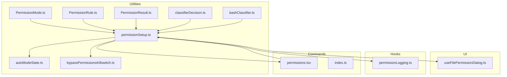
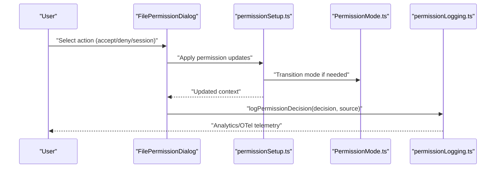
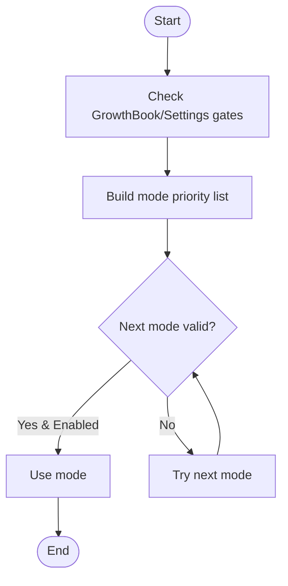
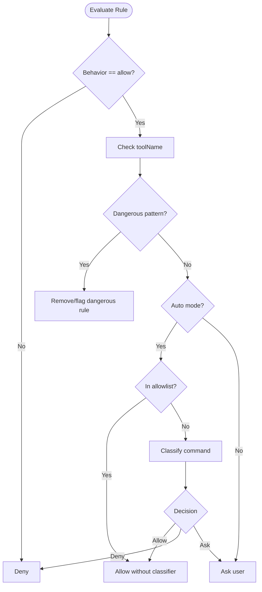
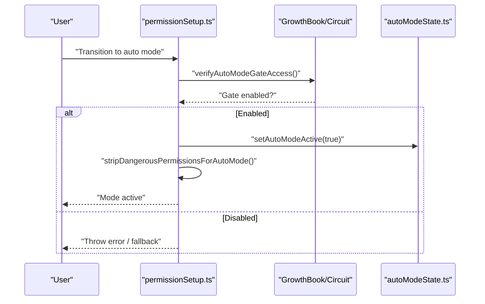
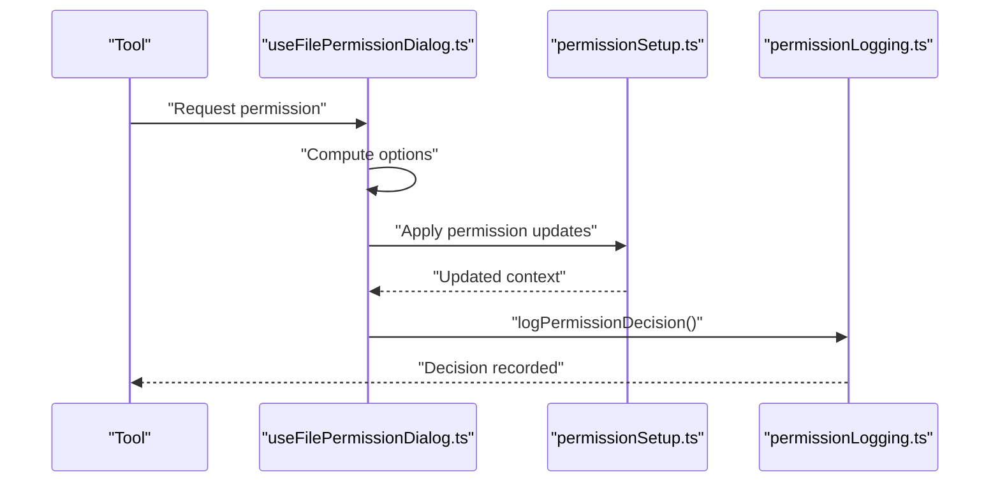
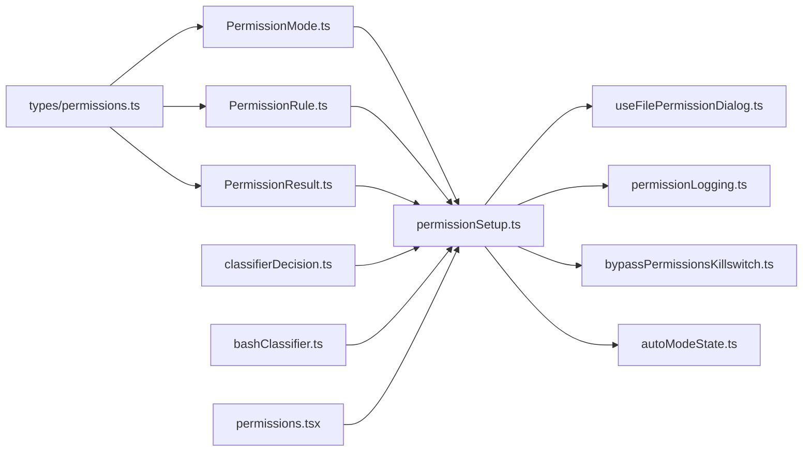

# Permission Management

<cite>
**Referenced Files in This Document**
- [PermissionMode.ts](file://src/utils/permissions/PermissionMode.ts)
- [PermissionRule.ts](file://src/utils/permissions/PermissionRule.ts)
- [PermissionResult.ts](file://src/utils/permissions/PermissionResult.ts)
- [permissionSetup.ts](file://src/utils/permissions/permissionSetup.ts)
- [autoModeState.ts](file://src/utils/permissions/autoModeState.ts)
- [bypassPermissionsKillswitch.ts](file://src/utils/permissions/bypassPermissionsKillswitch.ts)
- [classifierDecision.ts](file://src/utils/permissions/classifierDecision.ts)
- [bashClassifier.ts](file://src/utils/permissions/bashClassifier.ts)
- [useFilePermissionDialog.ts](file://src/components/permissions/FilePermissionDialog/useFilePermissionDialog.ts)
- [permissionLogging.ts](file://src/hooks/toolPermission/permissionLogging.ts)
- [permissions.tsx](file://src/commands/permissions/permissions.tsx)
- [index.ts](file://src/commands/permissions/index.ts)
- [types/permissions.ts](file://src/types/permissions.ts)
</cite>

## Table of Contents
1. [Introduction](#introduction)
2. [Project Structure](#project-structure)
3. [Core Components](#core-components)
4. [Architecture Overview](#architecture-overview)
5. [Detailed Component Analysis](#detailed-component-analysis)
6. [Dependency Analysis](#dependency-analysis)
7. [Performance Considerations](#performance-considerations)
8. [Troubleshooting Guide](#troubleshooting-guide)
9. [Conclusion](#conclusion)
10. [Appendices](#appendices)

## Introduction
This document explains the permission management and security architecture of the system. It covers the permission classification system, rule-based permissions, dynamic permission evaluation, the permission prompt system, user consent handling, and automated permission modes. It also documents permission inheritance, workspace directories, and security policies, with practical examples, debugging guidance, audit logging, and security best practices for both users and developers.

## Project Structure
The permission system spans several layers:
- Utilities define permission modes, rule schemas, and evaluation helpers.
- Setup orchestrates mode transitions, dangerous rule detection, and kill switches.
- UI components manage user prompts for file and tool permissions.
- Hooks centralize analytics and telemetry for permission decisions.
- Commands expose user-facing permission configuration surfaces.

**Diagram sources**
- [PermissionMode.ts:1-142](file://src/utils/permissions/PermissionMode.ts#L1-L142)
- [PermissionRule.ts:1-41](file://src/utils/permissions/PermissionRule.ts#L1-L41)
- [PermissionResult.ts:1-36](file://src/utils/permissions/PermissionResult.ts#L1-L36)
- [permissionSetup.ts:1-800](file://src/utils/permissions/permissionSetup.ts#L1-L800)
- [autoModeState.ts:1-40](file://src/utils/permissions/autoModeState.ts#L1-L40)
- [bypassPermissionsKillswitch.ts:1-156](file://src/utils/permissions/bypassPermissionsKillswitch.ts#L1-L156)
- [classifierDecision.ts:1-99](file://src/utils/permissions/classifierDecision.ts#L1-L99)
- [bashClassifier.ts:1-62](file://src/utils/permissions/bashClassifier.ts#L1-L62)
- [useFilePermissionDialog.ts:1-213](file://src/components/permissions/FilePermissionDialog/useFilePermissionDialog.ts#L1-L213)
- [permissionLogging.ts:1-239](file://src/hooks/toolPermission/permissionLogging.ts#L1-L239)
- [permissions.tsx](file://src/commands/permissions/permissions.tsx)
- [index.ts](file://src/commands/permissions/index.ts)

**Section sources**
- [PermissionMode.ts:1-142](file://src/utils/permissions/PermissionMode.ts#L1-L142)
- [PermissionRule.ts:1-41](file://src/utils/permissions/PermissionRule.ts#L1-L41)
- [PermissionResult.ts:1-36](file://src/utils/permissions/PermissionResult.ts#L1-L36)
- [permissionSetup.ts:1-800](file://src/utils/permissions/permissionSetup.ts#L1-L800)
- [useFilePermissionDialog.ts:1-213](file://src/components/permissions/FilePermissionDialog/useFilePermissionDialog.ts#L1-L213)
- [permissionLogging.ts:1-239](file://src/hooks/toolPermission/permissionLogging.ts#L1-L239)
- [permissions.tsx](file://src/commands/permissions/permissions.tsx)
- [index.ts](file://src/commands/permissions/index.ts)

## Core Components
- Permission modes and classification:
  - Modes include default, plan, acceptEdits, bypassPermissions, dontAsk, and auto (feature-gated).
  - External mode mapping and color/symbol metadata are derived from mode configs.
- Rule-based permissions:
  - Behavior: allow, deny, ask.
  - Rule value: tool name plus optional content (e.g., patterns).
- Dynamic evaluation:
  - Dangerous rule detection for Bash/PowerShell/Agent rules in auto mode.
  - Classifier allowlist for auto mode to minimize API calls.
- Automated modes:
  - Auto mode activation gating and state management.
  - Kill switches to disable bypass permissions and gate auto mode.
- Prompt system:
  - File permission dialog with scoped options (once, session, deny).
  - Feedback capture and analytics for accept/reject flows.
- Logging and auditing:
  - Centralized permission decision logging with analytics, OTel, and tool-use context storage.

**Section sources**
- [PermissionMode.ts:26-142](file://src/utils/permissions/PermissionMode.ts#L26-L142)
- [PermissionRule.ts:19-41](file://src/utils/permissions/PermissionRule.ts#L19-L41)
- [PermissionResult.ts:23-36](file://src/utils/permissions/PermissionResult.ts#L23-L36)
- [permissionSetup.ts:84-503](file://src/utils/permissions/permissionSetup.ts#L84-L503)
- [classifierDecision.ts:50-99](file://src/utils/permissions/classifierDecision.ts#L50-L99)
- [autoModeState.ts:1-40](file://src/utils/permissions/autoModeState.ts#L1-L40)
- [bypassPermissionsKillswitch.ts:19-156](file://src/utils/permissions/bypassPermissionsKillswitch.ts#L19-L156)
- [useFilePermissionDialog.ts:50-213](file://src/components/permissions/FilePermissionDialog/useFilePermissionDialog.ts#L50-L213)
- [permissionLogging.ts:181-239](file://src/hooks/toolPermission/permissionLogging.ts#L181-L239)

## Architecture Overview
The permission system integrates UI prompts, rule evaluation, mode transitions, and telemetry. The setup module coordinates dangerous rule detection, auto mode transitions, and kill-switch enforcement. Classifier utilities support safe auto mode by allowinglist and gating.

**Diagram sources**
- [useFilePermissionDialog.ts:88-136](file://src/components/permissions/FilePermissionDialog/useFilePermissionDialog.ts#L88-L136)
- [permissionSetup.ts:597-646](file://src/utils/permissions/permissionSetup.ts#L597-L646)
- [PermissionMode.ts:117-142](file://src/utils/permissions/PermissionMode.ts#L117-L142)
- [permissionLogging.ts:181-239](file://src/hooks/toolPermission/permissionLogging.ts#L181-L239)

## Detailed Component Analysis

### Permission Modes and Classification
- Modes and metadata:
  - Modes include default, plan, acceptEdits, bypassPermissions, dontAsk, and auto (when feature enabled).
  - External mode mapping excludes auto for external users.
  - Titles, short titles, symbols, and colors are configured per mode.
- Mode selection and validation:
  - Priority order considers CLI flags, settings, and gates.
  - Disabled modes produce user-facing notifications.

**Diagram sources**
- [PermissionMode.ts:117-142](file://src/utils/permissions/PermissionMode.ts#L117-L142)
- [permissionSetup.ts:689-800](file://src/utils/permissions/permissionSetup.ts#L689-L800)

**Section sources**
- [PermissionMode.ts:26-142](file://src/utils/permissions/PermissionMode.ts#L26-L142)
- [permissionSetup.ts:689-800](file://src/utils/permissions/permissionSetup.ts#L689-L800)

### Rule-Based Permissions and Evaluation
- Rule schema:
  - Behavior: allow, deny, ask.
  - Value: toolName and optional ruleContent.
- Dangerous rule detection:
  - Bash: wildcard, interpreter prefixes, and wildcard patterns.
  - PowerShell: cross-platform code exec patterns and nested shells.
  - Agent: any allow rule is dangerous.
- Overly broad allow rules:
  - Tool-level allow without content equals wildcard and is flagged.
- Classifier allowlist:
  - Safe tools that bypass classifier checks in auto mode.

**Diagram sources**
- [PermissionRule.ts:19-41](file://src/utils/permissions/PermissionRule.ts#L19-L41)
- [permissionSetup.ts:84-285](file://src/utils/permissions/permissionSetup.ts#L84-L285)
- [classifierDecision.ts:50-99](file://src/utils/permissions/classifierDecision.ts#L50-L99)

**Section sources**
- [PermissionRule.ts:19-41](file://src/utils/permissions/PermissionRule.ts#L19-L41)
- [permissionSetup.ts:84-285](file://src/utils/permissions/permissionSetup.ts#L84-L285)
- [classifierDecision.ts:50-99](file://src/utils/permissions/classifierDecision.ts#L50-L99)

### Automated Permission Modes (Auto Mode)
- Activation gating:
  - Gate checks via GrowthBook and cached state.
  - Circuit breakers prevent re-entry after being kicked out.
- State management:
  - Tracks active state and CLI flag presence.
- Dangerous rule stripping/restoration:
  - Strips rules that bypass the classifier when entering auto mode.
  - Restores them when exiting auto mode.

**Diagram sources**
- [permissionSetup.ts:597-646](file://src/utils/permissions/permissionSetup.ts#L597-L646)
- [autoModeState.ts:11-33](file://src/utils/permissions/autoModeState.ts#L11-L33)
- [bypassPermissionsKillswitch.ts:74-126](file://src/utils/permissions/bypassPermissionsKillswitch.ts#L74-L126)

**Section sources**
- [permissionSetup.ts:505-580](file://src/utils/permissions/permissionSetup.ts#L505-L580)
- [autoModeState.ts:1-40](file://src/utils/permissions/autoModeState.ts#L1-L40)
- [bypassPermissionsKillswitch.ts:74-126](file://src/utils/permissions/bypassPermissionsKillswitch.ts#L74-L126)

### Permission Prompt System and User Consent
- File permission dialog:
  - Generates options based on context (accept-once, accept-session, deny).
  - Supports feedback capture and analytics for user input modes.
  - Integrates with keybindings for quick cycling and toggling input modes.
- Consent handling:
  - Persists permission updates (add/remove rules) according to destination scope.
  - Tracks user feedback and decision sources for auditability.

**Diagram sources**
- [useFilePermissionDialog.ts:50-136](file://src/components/permissions/FilePermissionDialog/useFilePermissionDialog.ts#L50-L136)
- [permissionSetup.ts:472-503](file://src/utils/permissions/permissionSetup.ts#L472-L503)
- [permissionLogging.ts:181-239](file://src/hooks/toolPermission/permissionLogging.ts#L181-L239)

**Section sources**
- [useFilePermissionDialog.ts:50-213](file://src/components/permissions/FilePermissionDialog/useFilePermissionDialog.ts#L50-L213)
- [permissionSetup.ts:472-503](file://src/utils/permissions/permissionSetup.ts#L472-L503)
- [permissionLogging.ts:181-239](file://src/hooks/toolPermission/permissionLogging.ts#L181-L239)

### Security Policies and Workspace Directories
- Dangerous rule detection:
  - Enforces safety by detecting wildcard and interpreter patterns in Bash/PowerShell.
  - Flags Agent allow rules that could bypass classifier evaluation.
- Overly broad rules:
  - Identifies tool-level allow rules without content as overly broad.
- Workspace and directory validation:
  - Utilities validate directories and enforce workspace boundaries during setup.

**Section sources**
- [permissionSetup.ts:84-285](file://src/utils/permissions/permissionSetup.ts#L84-L285)
- [permissionSetup.ts:344-450](file://src/utils/permissions/permissionSetup.ts#L344-L450)

### Practical Examples
- Configure a rule to allow a specific interpreter pattern in Bash:
  - Use a rule value with toolName "Bash" and ruleContent specifying the interpreter pattern.
  - Avoid wildcard or interpreter prefixes in auto mode contexts.
- Create a PowerShell rule that avoids dangerous patterns:
  - Prefer explicit commands and avoid patterns that spawn nested shells or evaluate strings.
- Enable acceptEdits fast path for file edits:
  - Use acceptEdits mode to allow edits within working directory without classifier prompts.
- Use plan mode for constrained sessions:
  - Plan mode transitions attach additional context and restrict classifier usage until exit.

**Section sources**
- [PermissionRule.ts:29-41](file://src/utils/permissions/PermissionRule.ts#L29-L41)
- [permissionSetup.ts:84-285](file://src/utils/permissions/permissionSetup.ts#L84-L285)
- [PermissionMode.ts:52-72](file://src/utils/permissions/PermissionMode.ts#L52-L72)

### Security Best Practices
- Avoid overly broad allow rules:
  - Do not use wildcard or empty content for Bash/PowerShell allow rules.
- Limit auto mode exposure:
  - Only enable auto mode when gates permit and classifier is active.
- Monitor dangerous rules:
  - Regularly audit settings for wildcard patterns and interpreter prefixes.
- Use acceptEdits for safe edits:
  - Prefer acceptEdits for file edits within the working directory.
- Leverage classifier allowlist:
  - Keep tool lists aligned with the allowlist to reduce classifier overhead.

**Section sources**
- [permissionSetup.ts:344-450](file://src/utils/permissions/permissionSetup.ts#L344-L450)
- [classifierDecision.ts:50-99](file://src/utils/permissions/classifierDecision.ts#L50-L99)
- [PermissionMode.ts:52-72](file://src/utils/permissions/PermissionMode.ts#L52-L72)

## Dependency Analysis
The permission system exhibits clear separation of concerns:
- Utilities depend on types and schemas.
- Setup depends on modes, rules, and security utilities.
- UI components depend on setup and permission handlers.
- Hooks depend on setup and analytics.

**Diagram sources**
- [types/permissions.ts](file://src/types/permissions.ts)
- [PermissionMode.ts:1-142](file://src/utils/permissions/PermissionMode.ts#L1-L142)
- [PermissionRule.ts:1-41](file://src/utils/permissions/PermissionRule.ts#L1-L41)
- [PermissionResult.ts:1-36](file://src/utils/permissions/PermissionResult.ts#L1-L36)
- [permissionSetup.ts:1-800](file://src/utils/permissions/permissionSetup.ts#L1-L800)
- [useFilePermissionDialog.ts:1-213](file://src/components/permissions/FilePermissionDialog/useFilePermissionDialog.ts#L1-L213)
- [permissionLogging.ts:1-239](file://src/hooks/toolPermission/permissionLogging.ts#L1-L239)
- [bypassPermissionsKillswitch.ts:1-156](file://src/utils/permissions/bypassPermissionsKillswitch.ts#L1-L156)
- [autoModeState.ts:1-40](file://src/utils/permissions/autoModeState.ts#L1-L40)
- [classifierDecision.ts:1-99](file://src/utils/permissions/classifierDecision.ts#L1-L99)
- [bashClassifier.ts:1-62](file://src/utils/permissions/bashClassifier.ts#L1-L62)
- [permissions.tsx](file://src/commands/permissions/permissions.tsx)

**Section sources**
- [types/permissions.ts](file://src/types/permissions.ts)
- [permissionSetup.ts:1-800](file://src/utils/permissions/permissionSetup.ts#L1-L800)

## Performance Considerations
- Classifier allowlist reduces unnecessary classifier calls for read-only and metadata operations.
- Auto mode gating prevents expensive classifier evaluations when disabled.
- UI prompt handling minimizes re-renders by memoizing options and using callbacks.

[No sources needed since this section provides general guidance]

## Troubleshooting Guide
- Permission denied unexpectedly:
  - Check for deny rules in settings and CLI arguments.
  - Verify that the tool is not flagged as dangerous in auto mode.
- Auto mode not activating:
  - Confirm gate checks and circuit breaker state.
  - Review cached gate values and environment settings.
- Bypass permissions disabled:
  - Check organization policy gates and local settings.
  - Reset gate checks after login to refresh state.
- File edit prompts appear frequently:
  - Switch to acceptEdits mode for working directory edits.
  - Adjust permission rules to scope allowances appropriately.

**Section sources**
- [permissionSetup.ts:689-800](file://src/utils/permissions/permissionSetup.ts#L689-L800)
- [bypassPermissionsKillswitch.ts:19-70](file://src/utils/permissions/bypassPermissionsKillswitch.ts#L19-L70)
- [autoModeState.ts:27-33](file://src/utils/permissions/autoModeState.ts#L27-L33)
- [useFilePermissionDialog.ts:50-86](file://src/components/permissions/FilePermissionDialog/useFilePermissionDialog.ts#L50-L86)

## Conclusion
The permission management system balances security and usability through a robust mode classification, rule-based evaluation, and dynamic prompt handling. Dangerous rule detection, classifier allowlists, and kill switches protect against unsafe configurations. The UI and logging layers provide transparency and auditability, enabling both users and developers to configure and debug permissions effectively.

[No sources needed since this section summarizes without analyzing specific files]

## Appendices

### User Guidance for Permission Management
- Choose a mode:
  - default for standard operation, plan for constrained sessions, acceptEdits for safe edits, auto for classifier-assisted automation.
- Configure rules:
  - Use allow/deny/ask behaviors with precise toolName and ruleContent.
  - Avoid wildcard and interpreter prefixes in auto mode.
- Manage prompts:
  - Use accept-once or accept-session scopes to tailor consent.
  - Provide feedback for improved future decisions.

**Section sources**
- [PermissionMode.ts:26-142](file://src/utils/permissions/PermissionMode.ts#L26-L142)
- [PermissionRule.ts:19-41](file://src/utils/permissions/PermissionRule.ts#L19-L41)
- [useFilePermissionDialog.ts:50-213](file://src/components/permissions/FilePermissionDialog/useFilePermissionDialog.ts#L50-L213)

### Developer Documentation for Implementation
- Extend rule evaluation:
  - Add new toolName patterns and content parsers in the rule evaluation utilities.
- Integrate prompts:
  - Use the dialog hook to compute options and persist updates.
- Instrument decisions:
  - Call the centralized logging function to record approvals and rejections with metadata.

**Section sources**
- [permissionSetup.ts:472-503](file://src/utils/permissions/permissionSetup.ts#L472-L503)
- [useFilePermissionDialog.ts:88-136](file://src/components/permissions/FilePermissionDialog/useFilePermissionDialog.ts#L88-L136)
- [permissionLogging.ts:181-239](file://src/hooks/toolPermission/permissionLogging.ts#L181-L239)