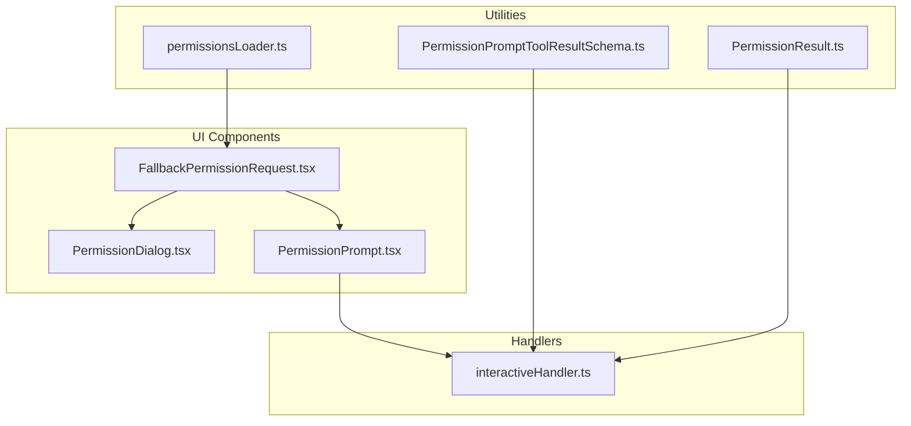
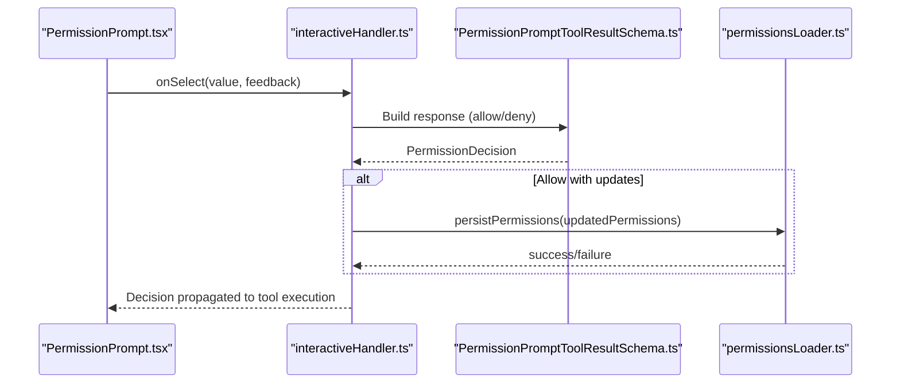
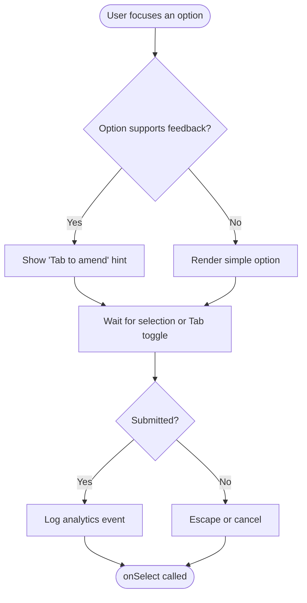
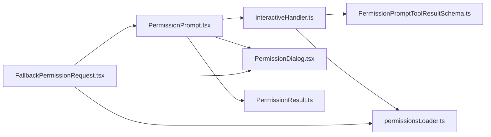

# Permission Prompt System

<cite>
**Referenced Files in This Document**
- [PermissionPrompt.tsx](file://src/components/permissions/PermissionPrompt.tsx)
- [PermissionDialog.tsx](file://src/components/permissions/PermissionDialog.tsx)
- [FallbackPermissionRequest.tsx](file://src/components/permissions/FallbackPermissionRequest.tsx)
- [permissionsLoader.ts](file://src/utils/permissions/permissionsLoader.ts)
- [PermissionPromptToolResultSchema.ts](file://src/utils/permissions/PermissionPromptToolResultSchema.ts)
- [PermissionResult.ts](file://src/utils/permissions/PermissionResult.ts)
- [interactiveHandler.ts](file://src/hooks/toolPermission/handlers/interactiveHandler.ts)
</cite>

## Table of Contents
1. [Introduction](#introduction)
2. [Project Structure](#project-structure)
3. [Core Components](#core-components)
4. [Architecture Overview](#architecture-overview)
5. [Detailed Component Analysis](#detailed-component-analysis)
6. [Dependency Analysis](#dependency-analysis)
7. [Performance Considerations](#performance-considerations)
8. [Troubleshooting Guide](#troubleshooting-guide)
9. [Conclusion](#conclusion)

## Introduction
This document explains the permission prompt system and user interaction flow across the application. It covers the permission request lifecycle, user consent handling, decision propagation, dialog components, UI patterns, automated permission modes, user preference persistence, and bypass mechanisms. It also includes customization examples, UX considerations, accessibility features, debugging approaches, feedback collection, and system integration patterns.

## Project Structure
The permission system is composed of:
- UI components for permission dialogs and prompts
- Utilities for loading and persisting user preferences
- Handlers for integrating permission decisions into tool execution
- Schemas for validating permission prompt tool results

**Diagram sources**
- [PermissionDialog.tsx:1-72](file://src/components/permissions/PermissionDialog.tsx#L1-L72)
- [PermissionPrompt.tsx:1-336](file://src/components/permissions/PermissionPrompt.tsx#L1-L336)
- [FallbackPermissionRequest.tsx:1-333](file://src/components/permissions/FallbackPermissionRequest.tsx#L1-L333)
- [permissionsLoader.ts:1-297](file://src/utils/permissions/permissionsLoader.ts#L1-L297)
- [PermissionResult.ts:1-36](file://src/utils/permissions/PermissionResult.ts#L1-L36)
- [PermissionPromptToolResultSchema.ts:1-128](file://src/utils/permissions/PermissionPromptToolResultSchema.ts#L1-L128)
- [interactiveHandler.ts:162-298](file://src/hooks/toolPermission/handlers/interactiveHandler.ts#L162-L298)

**Section sources**
- [PermissionDialog.tsx:1-72](file://src/components/permissions/PermissionDialog.tsx#L1-L72)
- [PermissionPrompt.tsx:1-336](file://src/components/permissions/PermissionPrompt.tsx#L1-L336)
- [FallbackPermissionRequest.tsx:1-333](file://src/components/permissions/FallbackPermissionRequest.tsx#L1-L333)
- [permissionsLoader.ts:1-297](file://src/utils/permissions/permissionsLoader.ts#L1-L297)
- [PermissionResult.ts:1-36](file://src/utils/permissions/PermissionResult.ts#L1-L36)
- [PermissionPromptToolResultSchema.ts:1-128](file://src/utils/permissions/PermissionPromptToolResultSchema.ts#L1-L128)
- [interactiveHandler.ts:162-298](file://src/hooks/toolPermission/handlers/interactiveHandler.ts#L162-L298)

## Core Components
- PermissionDialog: A reusable container for permission prompts with title, subtitle, and bordered layout.
- PermissionPrompt: A flexible prompt component supporting multiple options, optional feedback input, keybinding actions, and analytics logging.
- FallbackPermissionRequest: A concrete permission request flow that renders tool use details, shows rule explanations, and handles user selections with optional "always allow" persistence.
- permissionsLoader: Loads and persists permission rules from editable sources, respects managed-only mode, and manages rule addition/deletion.
- PermissionResult helpers: Provide descriptions and type exports for permission decisions.
- PermissionPromptToolResultSchema: Validates and normalizes permission prompt tool results into PermissionDecision objects.
- interactiveHandler: Bridges user interactions to tool execution, sending allow/deny responses and persisting decisions.

**Section sources**
- [PermissionDialog.tsx:1-72](file://src/components/permissions/PermissionDialog.tsx#L1-L72)
- [PermissionPrompt.tsx:1-336](file://src/components/permissions/PermissionPrompt.tsx#L1-L336)
- [FallbackPermissionRequest.tsx:1-333](file://src/components/permissions/FallbackPermissionRequest.tsx#L1-L333)
- [permissionsLoader.ts:1-297](file://src/utils/permissions/permissionsLoader.ts#L1-L297)
- [PermissionResult.ts:1-36](file://src/utils/permissions/PermissionResult.ts#L1-L36)
- [PermissionPromptToolResultSchema.ts:1-128](file://src/utils/permissions/PermissionPromptToolResultSchema.ts#L1-L128)
- [interactiveHandler.ts:162-298](file://src/hooks/toolPermission/handlers/interactiveHandler.ts#L162-L298)

## Architecture Overview
The permission system follows a layered architecture:
- Presentation Layer: UI components render prompts and collect user input.
- Interaction Layer: Handlers process user selections and integrate with tool execution contexts.
- Persistence Layer: Utilities manage permission rules stored in settings.
- Validation Layer: Schemas ensure permission prompt tool results conform to expected structures.

**Diagram sources**
- [PermissionPrompt.tsx:138-225](file://src/components/permissions/PermissionPrompt.tsx#L138-L225)
- [interactiveHandler.ts:162-298](file://src/hooks/toolPermission/handlers/interactiveHandler.ts#L162-L298)
- [PermissionPromptToolResultSchema.ts:84-127](file://src/utils/permissions/PermissionPromptToolResultSchema.ts#L84-L127)
- [permissionsLoader.ts:229-296](file://src/utils/permissions/permissionsLoader.ts#L229-L296)

## Detailed Component Analysis

### PermissionPrompt Component
Responsibilities:
- Render a question and a list of options.
- Toggle feedback input mode per option (Tab to expand/collapse).
- Emit analytics events for feedback mode entry/exit and submission.
- Support keybindings for direct option selection.
- Handle cancellation and escape counting for attribution tracking.

Key behaviors:
- Feedback input mode is option-specific and toggled via Tab when an option supports feedback.
- Analytics capture includes tool name, MCP flag, feedback presence, length, and whether feedback mode was entered.
- Escape key logs an event and increments escape count for attribution tracking.

**Diagram sources**
- [PermissionPrompt.tsx:45-326](file://src/components/permissions/PermissionPrompt.tsx#L45-L326)

**Section sources**
- [PermissionPrompt.tsx:1-336](file://src/components/permissions/PermissionPrompt.tsx#L1-L336)

### PermissionDialog Component
Responsibilities:
- Provide a bordered, rounded container for permission prompts.
- Accept title, subtitle, optional right-side content, and worker badge.
- Apply consistent padding and layout.

Usage patterns:
- Used by higher-level permission request components to wrap content.
- Supports theming via color props.

**Section sources**
- [PermissionDialog.tsx:1-72](file://src/components/permissions/PermissionDialog.tsx#L1-L72)

### FallbackPermissionRequest Component
Responsibilities:
- Render tool use details and description.
- Show permission rule explanations derived from the permission result.
- Offer options: Yes, Yes and don't ask again, No.
- Persist "always allow" rules to local settings when requested.
- Log analytics events for accept/reject and feedback submissions.

User preference persistence:
- "Yes and don't ask again" adds a rule to local settings with behavior allow and destination localSettings.
- Managed-only mode hides "always allow" options.

**Section sources**
- [FallbackPermissionRequest.tsx:1-333](file://src/components/permissions/FallbackPermissionRequest.tsx#L1-L333)
- [permissionsLoader.ts:42-44](file://src/utils/permissions/permissionsLoader.ts#L42-L44)

### Permission Result Normalization and Propagation
Responsibilities:
- Validate permission prompt tool results against a schema.
- Convert results to PermissionDecision with decision reason metadata.
- Apply and persist updated permissions when present.
- Abort tool execution on deny with interrupt flag.

Decision propagation:
- Allow decisions may include updated input and permissions.
- Deny decisions may include a message and optional interruption of tool execution.

**Section sources**
- [PermissionPromptToolResultSchema.ts:1-128](file://src/utils/permissions/PermissionPromptToolResultSchema.ts#L1-L128)

### Interactive Handler Integration
Responsibilities:
- Bridge user selections to tool execution context.
- Send allow/deny responses via bridge callbacks when available.
- Persist permissions and log decisions with classification and timing.
- Resolve tool execution with allow or cancel/abort on deny.

**Section sources**
- [interactiveHandler.ts:162-298](file://src/hooks/toolPermission/handlers/interactiveHandler.ts#L162-L298)

### Permission Rule Loading and Persistence
Responsibilities:
- Load permission rules from enabled setting sources.
- Respect managed-only mode to restrict rules to policy settings.
- Add/remove rules to/from editable sources while preserving unrecognized keys.
- Normalize legacy rule names to canonical forms.

Managed-only mode:
- When enabled, only rules from policy settings are considered.
- "Always allow" options are hidden in prompts.

**Section sources**
- [permissionsLoader.ts:1-297](file://src/utils/permissions/permissionsLoader.ts#L1-L297)

## Dependency Analysis
The system exhibits clear separation of concerns:
- UI components depend on shared utilities for analytics and keybindings.
- Handlers depend on schemas for validation and on loaders for persistence.
- Persistence utilities depend on settings infrastructure and file operations.

**Diagram sources**
- [PermissionPrompt.tsx:1-336](file://src/components/permissions/PermissionPrompt.tsx#L1-L336)
- [PermissionDialog.tsx:1-72](file://src/components/permissions/PermissionDialog.tsx#L1-L72)
- [FallbackPermissionRequest.tsx:1-333](file://src/components/permissions/FallbackPermissionRequest.tsx#L1-L333)
- [PermissionPromptToolResultSchema.ts:1-128](file://src/utils/permissions/PermissionPromptToolResultSchema.ts#L1-L128)
- [interactiveHandler.ts:162-298](file://src/hooks/toolPermission/handlers/interactiveHandler.ts#L162-L298)
- [permissionsLoader.ts:1-297](file://src/utils/permissions/permissionsLoader.ts#L1-L297)
- [PermissionResult.ts:1-36](file://src/utils/permissions/PermissionResult.ts#L1-L36)

**Section sources**
- [PermissionPrompt.tsx:1-336](file://src/components/permissions/PermissionPrompt.tsx#L1-L336)
- [PermissionDialog.tsx:1-72](file://src/components/permissions/PermissionDialog.tsx#L1-L72)
- [FallbackPermissionRequest.tsx:1-333](file://src/components/permissions/FallbackPermissionRequest.tsx#L1-L333)
- [PermissionPromptToolResultSchema.ts:1-128](file://src/utils/permissions/PermissionPromptToolResultSchema.ts#L1-L128)
- [interactiveHandler.ts:162-298](file://src/hooks/toolPermission/handlers/interactiveHandler.ts#L162-L298)
- [permissionsLoader.ts:1-297](file://src/utils/permissions/permissionsLoader.ts#L1-L297)
- [PermissionResult.ts:1-36](file://src/utils/permissions/PermissionResult.ts#L1-L36)

## Performance Considerations
- Minimize re-renders by using memoization patterns in UI components (observed in PermissionPrompt and FallbackPermissionRequest).
- Defer analytics logging to avoid blocking user interactions.
- Persist permission updates asynchronously to keep the UI responsive.
- Avoid unnecessary schema validations by leveraging cached results where appropriate.

## Troubleshooting Guide
Common issues and resolutions:
- Permission prompt does not appear:
  - Verify the handler is invoked and the prompt component is rendered.
  - Check that managed-only mode is not hiding "always allow" options unexpectedly.
- Deny with interrupt does not abort tool execution:
  - Confirm the deny result includes the interrupt flag.
  - Ensure the handler aborts the tool execution controller.
- Updated permissions not applied:
  - Validate that updatedPermissions are present and correctly formatted.
  - Confirm persistence succeeds and app state is updated.
- Feedback not recorded:
  - Ensure feedback mode is toggled and submitted.
  - Verify analytics events are logged with correct metadata.

**Section sources**
- [PermissionPromptToolResultSchema.ts:117-127](file://src/utils/permissions/PermissionPromptToolResultSchema.ts#L117-L127)
- [interactiveHandler.ts:266-298](file://src/hooks/toolPermission/handlers/interactiveHandler.ts#L266-L298)

## Conclusion
The permission prompt system integrates UI components, validation, persistence, and execution handlers to provide a robust, extensible framework for managing user consent. It supports flexible feedback collection, analytics, and preference persistence while maintaining clear separation of concerns and strong typing for decisions and results.