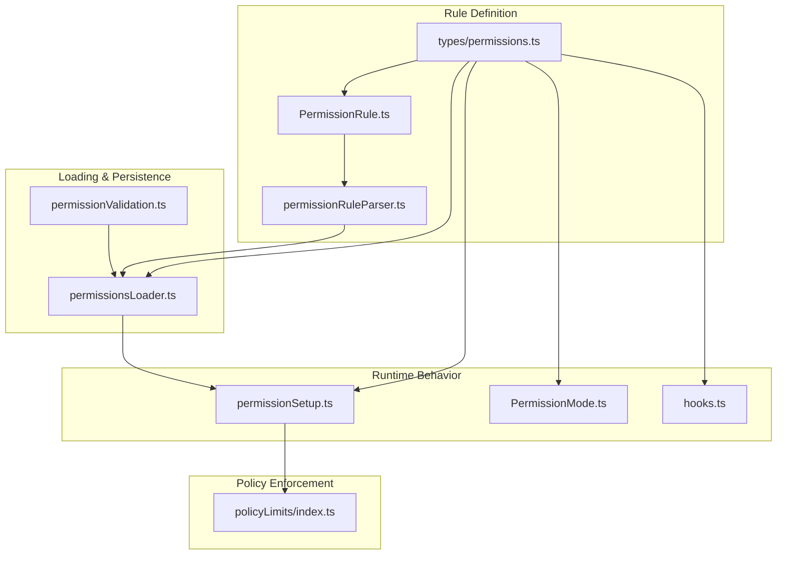
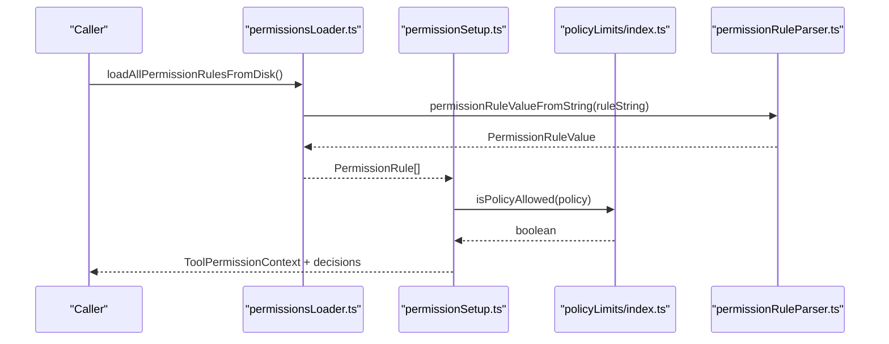
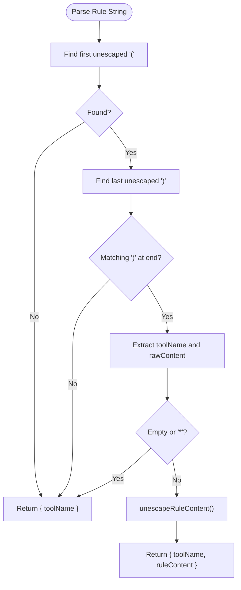
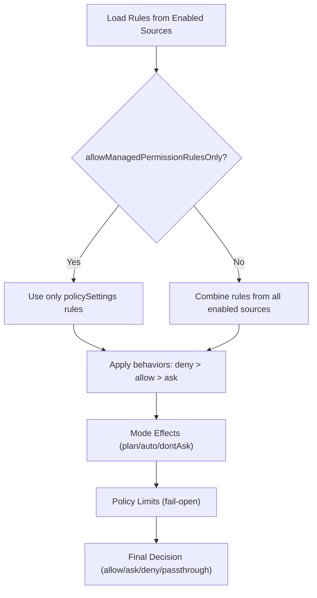
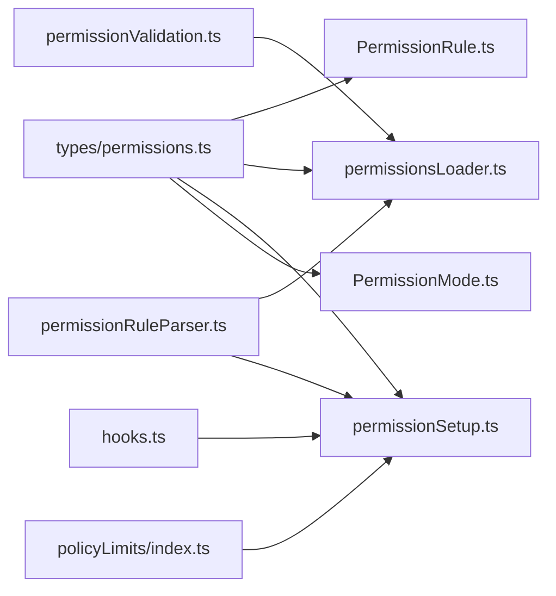

# Permission Rules and Policies

<cite>
**Referenced Files in This Document**
- [PermissionRule.ts](file://src/utils/permissions/PermissionRule.ts)
- [permissionRuleParser.ts](file://src/utils/permissions/permissionRuleParser.ts)
- [permissionsLoader.ts](file://src/utils/permissions/permissionsLoader.ts)
- [types/permissions.ts](file://src/types/permissions.ts)
- [PermissionMode.ts](file://src/utils/permissions/PermissionMode.ts)
- [permissionSetup.ts](file://src/utils/permissions/permissionSetup.ts)
- [hooks.ts](file://src/components/permissions/hooks.ts)
- [index.ts](file://src/services/policyLimits/index.ts)
- [permissionValidation.ts](file://src/utils/settings/permissionValidation.ts)
</cite>

## Table of Contents
1. [Introduction](#introduction)
2. [Project Structure](#project-structure)
3. [Core Components](#core-components)
4. [Architecture Overview](#architecture-overview)
5. [Detailed Component Analysis](#detailed-component-analysis)
6. [Dependency Analysis](#dependency-analysis)
7. [Performance Considerations](#performance-considerations)
8. [Troubleshooting Guide](#troubleshooting-guide)
9. [Conclusion](#conclusion)
10. [Appendices](#appendices)

## Introduction
This document explains the permission rule system and policy framework used to govern tool usage and working directory scopes. It covers rule syntax, parsing, evaluation order, and precedence, along with policy enforcement, conflict resolution, and best practices. It also documents debugging aids, validation, and practical examples for authoring custom rules and templates.

## Project Structure
The permission system spans several modules:
- Rule definition and types
- Rule parsing and serialization
- Rule loading from settings sources
- Permission mode management
- Policy limits service (organization-level restrictions)
- UI hooks for logging and diagnostics
- Validation utilities for rule arrays

**Diagram sources**
- [PermissionRule.ts:1-41](file://src/utils/permissions/PermissionRule.ts#L1-L41)
- [permissionRuleParser.ts:1-199](file://src/utils/permissions/permissionRuleParser.ts#L1-L199)
- [permissionsLoader.ts:1-297](file://src/utils/permissions/permissionsLoader.ts#L1-L297)
- [types/permissions.ts:1-442](file://src/types/permissions.ts#L1-L442)
- [permissionSetup.ts:1-800](file://src/utils/permissions/permissionSetup.ts#L1-L800)
- [PermissionMode.ts:1-142](file://src/utils/permissions/PermissionMode.ts#L1-L142)
- [hooks.ts:1-210](file://src/components/permissions/hooks.ts#L1-L210)
- [index.ts:1-664](file://src/services/policyLimits/index.ts#L1-L664)
- [permissionValidation.ts:238-262](file://src/utils/settings/permissionValidation.ts#L238-L262)

**Section sources**
- [PermissionRule.ts:1-41](file://src/utils/permissions/PermissionRule.ts#L1-L41)
- [permissionRuleParser.ts:1-199](file://src/utils/permissions/permissionRuleParser.ts#L1-L199)
- [permissionsLoader.ts:1-297](file://src/utils/permissions/permissionsLoader.ts#L1-L297)
- [types/permissions.ts:1-442](file://src/types/permissions.ts#L1-L442)
- [PermissionMode.ts:1-142](file://src/utils/permissions/PermissionMode.ts#L1-L142)
- [permissionSetup.ts:1-800](file://src/utils/permissions/permissionSetup.ts#L1-L800)
- [hooks.ts:1-210](file://src/components/permissions/hooks.ts#L1-L210)
- [index.ts:1-664](file://src/services/policyLimits/index.ts#L1-L664)
- [permissionValidation.ts:238-262](file://src/utils/settings/permissionValidation.ts#L238-L262)

## Core Components
- Rule types and behaviors: define tool names, optional content, and three behaviors (allow, deny, ask).
- Parser: converts human-readable rule strings to structured values and escapes/unescape content safely.
- Loader: aggregates rules from enabled settings sources, with managed-only override.
- Mode management: maps runtime modes (default, plan, acceptEdits, bypassPermissions, dontAsk, auto) to behavior.
- Policy limits: fetches organization-level restrictions and enforces them with fail-open semantics.
- Hooks: log permission decisions and reasons for analytics and debugging.

**Section sources**
- [types/permissions.ts:44-146](file://src/types/permissions.ts#L44-L146)
- [PermissionRule.ts:19-41](file://src/utils/permissions/PermissionRule.ts#L19-L41)
- [permissionRuleParser.ts:82-152](file://src/utils/permissions/permissionRuleParser.ts#L82-L152)
- [permissionsLoader.ts:120-133](file://src/utils/permissions/permissionsLoader.ts#L120-L133)
- [PermissionMode.ts:117-142](file://src/utils/permissions/PermissionMode.ts#L117-L142)
- [index.ts:510-526](file://src/services/policyLimits/index.ts#L510-L526)
- [hooks.ts:31-95](file://src/components/permissions/hooks.ts#L31-L95)

## Architecture Overview
The system evaluates permissions in layers:
1. Policy limits (organization-level) applied first (fail-open).
2. Permission rules loaded from enabled settings sources.
3. Permission mode effects and classifier gating.
4. Decision outcomes (allow, ask, deny, passthrough) with rich reasons.

**Diagram sources**
- [permissionsLoader.ts:120-133](file://src/utils/permissions/permissionsLoader.ts#L120-L133)
- [permissionRuleParser.ts:93-133](file://src/utils/permissions/permissionRuleParser.ts#L93-L133)
- [permissionSetup.ts:597-646](file://src/utils/permissions/permissionSetup.ts#L597-L646)
- [index.ts:510-526](file://src/services/policyLimits/index.ts#L510-L526)

## Detailed Component Analysis

### Rule Syntax and Parsing
- Syntax: ToolName or ToolName(content). Content supports escaped parentheses and backslashes.
- Escaping rules ensure parentheses inside content are preserved during round-trip parse/serialize.
- Legacy tool name normalization maps old names to canonical ones.

**Diagram sources**
- [permissionRuleParser.ts:93-133](file://src/utils/permissions/permissionRuleParser.ts#L93-L133)
- [permissionRuleParser.ts:158-198](file://src/utils/permissions/permissionRuleParser.ts#L158-L198)

**Section sources**
- [permissionRuleParser.ts:43-79](file://src/utils/permissions/permissionRuleParser.ts#L43-L79)
- [permissionRuleParser.ts:82-152](file://src/utils/permissions/permissionRuleParser.ts#L82-L152)
- [types/permissions.ts:67-70](file://src/types/permissions.ts#L67-L70)

### Rule Evaluation Order and Precedence
- Sources: userSettings, projectSettings, localSettings, session, cliArg, policySettings, flagSettings, command.
- Managed-only mode: when enabled, only policySettings rules are respected.
- Behavior precedence: deny overrides allow; ask is used when explicit rules require user consent; defaults apply otherwise.
- Classifier gating: auto mode strips dangerous allow rules; policy gates may restrict entering auto mode.

**Diagram sources**
- [permissionsLoader.ts:120-133](file://src/utils/permissions/permissionsLoader.ts#L120-L133)
- [permissionsLoader.ts:46-50](file://src/utils/permissions/permissionsLoader.ts#L46-L50)
- [permissionSetup.ts:597-646](file://src/utils/permissions/permissionSetup.ts#L597-L646)
- [index.ts:510-526](file://src/services/policyLimits/index.ts#L510-L526)

**Section sources**
- [permissionsLoader.ts:120-133](file://src/utils/permissions/permissionsLoader.ts#L120-L133)
- [types/permissions.ts:54-63](file://src/types/permissions.ts#L54-L63)
- [PermissionMode.ts:117-142](file://src/utils/permissions/PermissionMode.ts#L117-L142)
- [index.ts:510-526](file://src/services/policyLimits/index.ts#L510-L526)

### Workspace Directory Rules and Working Directory Scope
- Additional working directories can be recorded and associated with sources.
- The system distinguishes between default CWD and additional directories for permission scoping.
- Validation utilities support directory validation and help messages for adding directories.

**Section sources**
- [types/permissions.ts:143-146](file://src/types/permissions.ts#L143-L146)
- [hooks.ts:41-57](file://src/components/permissions/hooks.ts#L41-L57)

### Pattern-Based Allowances and Path Restrictions
- Pattern matching is used to detect overly broad or dangerous allowances (e.g., wildcard or interpreter prefixes).
- Specialized checks exist for Bash and PowerShell to prevent bypassing the classifier with unrestricted allow rules.
- Policy limits can restrict certain features organization-wide.

**Section sources**
- [permissionSetup.ts:84-147](file://src/utils/permissions/permissionSetup.ts#L84-L147)
- [permissionSetup.ts:157-233](file://src/utils/permissions/permissionSetup.ts#L157-L233)
- [index.ts:510-526](file://src/services/policyLimits/index.ts#L510-L526)

### Conflict Resolution, Shadowed Rules, and Precedence
- Deny beats allow; ask is used when user consent is required.
- Managed-only mode overrides other sources.
- Dangerous or overly broad rules are detected and can be stripped or removed depending on mode.

**Section sources**
- [permissionsLoader.ts:46-50](file://src/utils/permissions/permissionsLoader.ts#L46-L50)
- [permissionSetup.ts:472-503](file://src/utils/permissions/permissionSetup.ts#L472-L503)

### Policy Configuration and Organization-Level Controls
- Policy limits are fetched and cached with background polling.
- Fail-open semantics: missing or invalid responses are treated as allowed unless explicitly restricted.
- Eligibility depends on API provider, scopes, and subscription type.

**Section sources**
- [index.ts:167-211](file://src/services/policyLimits/index.ts#L167-L211)
- [index.ts:510-526](file://src/services/policyLimits/index.ts#L510-L526)
- [index.ts:556-575](file://src/services/policyLimits/index.ts#L556-L575)

### Rule Templates and Authoring Examples
Below are practical templates and examples for authoring rules. Replace placeholders with actual tool names and content. Use escaping rules for parentheses and backslashes in content.

- Tool-wide allow: ToolName
- Specific content allow: ToolName(content)
- Escaped content example: ToolName(escaped\(content\))

Escaping rules:
- Backslashes must be escaped first, then parentheses.
- Unescaping reverses the order.

**Section sources**
- [permissionRuleParser.ts:55-79](file://src/utils/permissions/permissionRuleParser.ts#L55-L79)
- [permissionRuleParser.ts:144-152](file://src/utils/permissions/permissionRuleParser.ts#L144-L152)

### Validation and Debugging
- Zod-based validation for arrays of permission rules with helpful messages, suggestions, and examples.
- Logging hooks capture decision reasons and suggestions for diagnostics.
- Decision reasons include rule, mode, subcommand results, hooks, working directory, safety checks, and classifier outcomes.

**Section sources**
- [permissionValidation.ts:244-262](file://src/utils/settings/permissionValidation.ts#L244-L262)
- [hooks.ts:31-95](file://src/components/permissions/hooks.ts#L31-L95)

## Dependency Analysis

**Diagram sources**
- [types/permissions.ts:1-442](file://src/types/permissions.ts#L1-L442)
- [PermissionRule.ts:1-41](file://src/utils/permissions/PermissionRule.ts#L1-L41)
- [permissionRuleParser.ts:1-199](file://src/utils/permissions/permissionRuleParser.ts#L1-L199)
- [permissionsLoader.ts:1-297](file://src/utils/permissions/permissionsLoader.ts#L1-L297)
- [permissionSetup.ts:1-800](file://src/utils/permissions/permissionSetup.ts#L1-L800)
- [PermissionMode.ts:1-142](file://src/utils/permissions/PermissionMode.ts#L1-L142)
- [hooks.ts:1-210](file://src/components/permissions/hooks.ts#L1-L210)
- [index.ts:1-664](file://src/services/policyLimits/index.ts#L1-L664)
- [permissionValidation.ts:238-262](file://src/utils/settings/permissionValidation.ts#L238-L262)

**Section sources**
- [types/permissions.ts:1-442](file://src/types/permissions.ts#L1-L442)
- [PermissionRule.ts:1-41](file://src/utils/permissions/PermissionRule.ts#L1-L41)
- [permissionRuleParser.ts:1-199](file://src/utils/permissions/permissionRuleParser.ts#L1-L199)
- [permissionsLoader.ts:1-297](file://src/utils/permissions/permissionsLoader.ts#L1-L297)
- [permissionSetup.ts:1-800](file://src/utils/permissions/permissionSetup.ts#L1-L800)
- [PermissionMode.ts:1-142](file://src/utils/permissions/PermissionMode.ts#L1-L142)
- [hooks.ts:1-210](file://src/components/permissions/hooks.ts#L1-L210)
- [index.ts:1-664](file://src/services/policyLimits/index.ts#L1-L664)
- [permissionValidation.ts:238-262](file://src/utils/settings/permissionValidation.ts#L238-L262)

## Performance Considerations
- Parser uses linear scans to locate unescaped delimiters; complexity is O(n) per rule.
- Loader aggregates rules from multiple sources; deduplication normalizes entries via round-trip parse/serialize.
- Policy limits fetching employs caching and background polling to minimize repeated network calls.

[No sources needed since this section provides general guidance]

## Troubleshooting Guide
Common issues and resolutions:
- Malformed rule strings: ensure parentheses are properly escaped and balanced; use the provided escaping helpers.
- Overly broad rules: wildcard or tool-level allow rules can be flagged as dangerous; adjust to specific content or remove.
- Managed-only mode: when enabled, only policy settings are respected; verify policySettings and related flags.
- Classifier gating: auto mode strips dangerous rules; if unexpected, review allow rules for Bash/PowerShell/Agent patterns.
- Policy limits: if features appear unexpectedly enabled, confirm eligibility and that fail-open semantics apply.

**Section sources**
- [permissionRuleParser.ts:55-79](file://src/utils/permissions/permissionRuleParser.ts#L55-L79)
- [permissionSetup.ts:351-450](file://src/utils/permissions/permissionSetup.ts#L351-L450)
- [permissionsLoader.ts:31-44](file://src/utils/permissions/permissionsLoader.ts#L31-L44)
- [index.ts:510-526](file://src/services/policyLimits/index.ts#L510-L526)

## Conclusion
The permission system combines structured rule syntax, robust parsing, layered evaluation, and organization-level policy controls. By following escaping rules, avoiding overly broad patterns, and leveraging managed-only mode and policy limits, teams can author precise, maintainable rules that balance security and usability.

[No sources needed since this section summarizes without analyzing specific files]

## Appendices

### Best Practices for Rule Authoring
- Prefer specific content over wildcards to reduce risk.
- Use escaping for parentheses and backslashes in content.
- Normalize legacy tool names to canonical forms.
- Test with managed-only mode and policy limits to ensure compliance.
- Log and review decision reasons for continuous improvement.

**Section sources**
- [permissionRuleParser.ts:55-79](file://src/utils/permissions/permissionRuleParser.ts#L55-L79)
- [permissionSetup.ts:351-450](file://src/utils/permissions/permissionSetup.ts#L351-L450)
- [hooks.ts:31-95](file://src/components/permissions/hooks.ts#L31-L95)