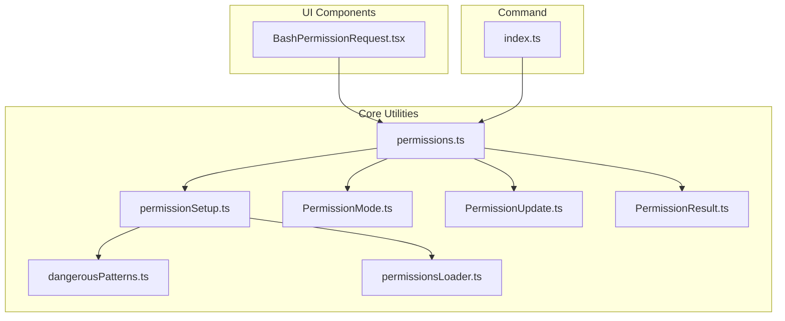
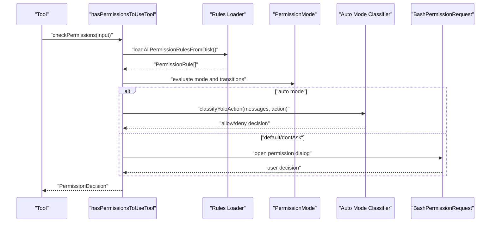
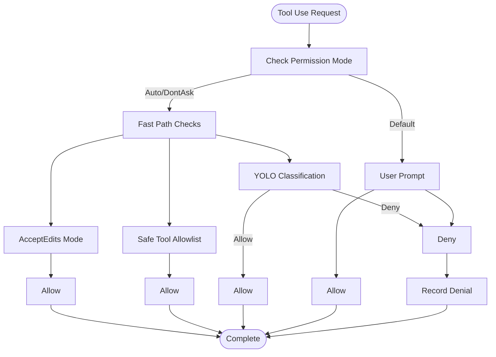
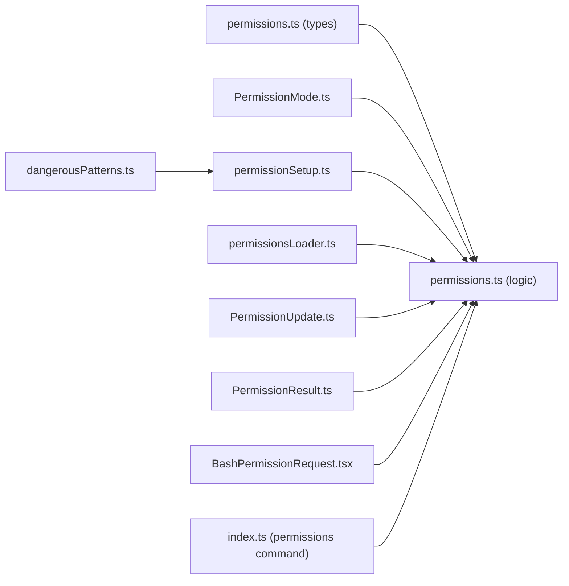

# Permission Types and Categories

<cite>
**Referenced Files in This Document**
- [permissions.ts](file://src/utils/permissions/permissions.ts)
- [permissionSetup.ts](file://src/utils/permissions/permissionSetup.ts)
- [dangerousPatterns.ts](file://src/utils/permissions/dangerousPatterns.ts)
- [permissionsLoader.ts](file://src/utils/permissions/permissionsLoader.ts)
- [permissions.ts](file://src/tokens/permissions.ts)
- [PermissionMode.ts](file://src/utils/permissions/PermissionMode.ts)
- [PermissionUpdate.ts](file://src/utils/permissions/PermissionUpdate.ts)
- [PermissionResult.ts](file://src/utils/permissions/PermissionResult.ts)
- [BashPermissionRequest.tsx](file://src/components/permissions/BashPermissionRequest/BashPermissionRequest.tsx)
- [index.ts](file://src/commands/permissions/index.ts)
</cite>

## Table of Contents
1. [Introduction](#introduction)
2. [Project Structure](#project-structure)
3. [Core Components](#core-components)
4. [Architecture Overview](#architecture-overview)
5. [Detailed Component Analysis](#detailed-component-analysis)
6. [Dependency Analysis](#dependency-analysis)
7. [Performance Considerations](#performance-considerations)
8. [Troubleshooting Guide](#troubleshooting-guide)
9. [Conclusion](#conclusion)

## Introduction
This document explains the permission system used to control tool usage, particularly focusing on filesystem permissions, shell command permissions, web access permissions, and tool-specific permissions. It covers the classification system for dangerous versus safe operations, pattern matching for shell commands, and risk assessment criteria. It also documents permission categories such as file editing, network access, process execution, and external resource access, along with practical examples of permission classification, category-specific rules, and security implications.

## Project Structure
The permission system is implemented primarily in TypeScript utilities and React components:
- Core permission logic and decision-making: `src/utils/permissions/`
- Permission types and schemas: `src/tokens/permissions.ts`
- UI dialogs for permission requests: `src/components/permissions/`
- Permission command: `src/commands/permissions/`

**Diagram sources**
- [permissions.ts](file://src/utils/permissions/permissions.ts)
- [permissionSetup.ts](file://src/utils/permissions/permissionSetup.ts)
- [dangerousPatterns.ts](file://src/utils/permissions/dangerousPatterns.ts)
- [permissionsLoader.ts](file://src/utils/permissions/permissionsLoader.ts)
- [PermissionMode.ts](file://src/utils/permissions/PermissionMode.ts)
- [PermissionUpdate.ts](file://src/utils/permissions/PermissionUpdate.ts)
- [PermissionResult.ts](file://src/utils/permissions/PermissionResult.ts)
- [BashPermissionRequest.tsx](file://src/components/permissions/BashPermissionRequest/BashPermissionRequest.tsx)
- [index.ts](file://src/commands/permissions/index.ts)

**Section sources**
- [permissions.ts](file://src/utils/permissions/permissions.ts)
- [permissionSetup.ts](file://src/utils/permissions/permissionSetup.ts)
- [dangerousPatterns.ts](file://src/utils/permissions/dangerousPatterns.ts)
- [permissionsLoader.ts](file://src/utils/permissions/permissionsLoader.ts)
- [permissions.ts](file://src/tokens/permissions.ts)
- [PermissionMode.ts](file://src/utils/permissions/PermissionMode.ts)
- [PermissionUpdate.ts](file://src/utils/permissions/PermissionUpdate.ts)
- [PermissionResult.ts](file://src/utils/permissions/PermissionResult.ts)
- [BashPermissionRequest.tsx](file://src/components/permissions/BashPermissionRequest/BashPermissionRequest.tsx)
- [index.ts](file://src/commands/permissions/index.ts)

## Core Components
- Permission modes: default, plan, acceptEdits, bypassPermissions, dontAsk, auto (ant-only).
- Permission behaviors: allow, deny, ask.
- Permission rule sources: userSettings, projectSettings, localSettings, flagSettings, policySettings, cliArg, command, session.
- Permission contexts: mode, additional working directories, alwaysAllowRules, alwaysDenyRules, alwaysAskRules, and flags for bypass availability and auto-mode transitions.
- Decision types: allow, ask, deny, plus passthrough for non-blocking classifier checks.

Key responsibilities:
- Evaluate tool usage against rules and modes.
- Classify risky patterns in shell commands.
- Manage auto mode transitions and classifier-driven approvals.
- Persist rule updates and manage working directory scopes.

**Section sources**
- [permissions.ts](file://src/utils/permissions/permissions.ts)
- [permissions.ts](file://src/tokens/permissions.ts)
- [PermissionMode.ts](file://src/utils/permissions/PermissionMode.ts)
- [PermissionUpdate.ts](file://src/utils/permissions/PermissionUpdate.ts)
- [PermissionResult.ts](file://src/utils/permissions/PermissionResult.ts)

## Architecture Overview
The permission system evaluates tool usage through a layered pipeline:
- Load rules from persistent sources and CLI.
- Match tool and command patterns against rules.
- Apply permission modes and auto mode classifier checks.
- Present UI prompts when user consent is required.
- Persist rule updates and manage working directory allowances.

**Diagram sources**
- [permissions.ts](file://src/utils/permissions/permissions.ts)
- [permissionsLoader.ts](file://src/utils/permissions/permissionsLoader.ts)
- [PermissionMode.ts](file://src/utils/permissions/PermissionMode.ts)
- [BashPermissionRequest.tsx](file://src/components/permissions/BashPermissionRequest/BashPermissionRequest.tsx)

## Detailed Component Analysis

### Permission Modes and Transitions
- Modes: default, plan, acceptEdits, bypassPermissions, dontAsk, auto (ant-only).
- External modes exclude auto; internal modes include bubble.
- Transitions handle plan/plan, plan→auto, auto→plan, and auto→default cleanup.
- Auto mode strips dangerous rules and restores them on exit.

Security implications:
- Auto mode requires a classifier gate and strips rules that bypass the classifier.
- BypassPermissions mode can be disabled by policy or settings.

**Section sources**
- [PermissionMode.ts](file://src/utils/permissions/PermissionMode.ts)
- [permissionSetup.ts](file://src/utils/permissions/permissionSetup.ts)

### Permission Rules and Matching
- Rule structure: toolName and optional ruleContent.
- Sources: userSettings, projectSettings, localSettings, flagSettings, policySettings, cliArg, command, session.
- Matching:
  - Tool-level match: toolName equals rule toolName.
  - MCP server-level match: rule "mcp__server" matches tools from that server.
  - Content-based match: prefix syntax (e.g., "python:*"), wildcards (*), or exact interpreter names.
- Behavior collections: alwaysAllowRules, alwaysDenyRules, alwaysAskRules.

Examples:
- Bash: "Bash" allows all Bash commands; "Bash(python:*), "Bash(node*)", "Bash(*)" are dangerous.
- PowerShell: "PowerShell" or wildcard patterns are dangerous; specific cmdlets like iex, Start-Process are flagged.
- Agent: "Agent" allow rules bypass classifier and are dangerous.

**Section sources**
- [permissions.ts](file://src/utils/permissions/permissions.ts)
- [permissionSetup.ts](file://src/utils/permissions/permissionSetup.ts)

### Dangerous Patterns and Risk Assessment
Dangerous patterns:
- Bash: wildcard/interpreter prefixes (python, node, ruby, php, etc.), shell executors (eval, exec), environment manipulation (env), cross-platform code exec (ssh).
- PowerShell: nested shells (pwsh, powershell, cmd, wsl), string/scriptblock evaluators (iex, Invoke-Expression, icm), process spawners (Start-Process, Start-Job), event/session exec (Register-*), .NET escape hatches (Add-Type, New-Object).
- Agent: any Agent allow rule bypasses classifier evaluation.

Risk levels:
- HIGH: wildcard/interpreter allow rules, nested shells, download-and-execute patterns.
- MEDIUM: broad prefixes that can run arbitrary code indirectly.
- LOW: read-only operations or clearly benign commands.

Classification logic:
- Overly broad Bash/PowerShell allow rules are detected and stripped in auto mode.
- Classifier-driven decisions for sensitive-file paths and destructive commands.

**Section sources**
- [dangerousPatterns.ts](file://src/utils/permissions/dangerousPatterns.ts)
- [permissionSetup.ts](file://src/utils/permissions/permissionSetup.ts)
- [permissions.ts](file://src/utils/permissions/permissions.ts)

### Shell Command Permissions and Pattern Matching
- Prefix extraction: simple and compound command prefixes guide rule suggestions.
- Suggestion refinement: tree-sitter analysis for compound commands.
- Destructive command warnings: configurable feature for high-risk commands.
- Sandbox override: run unsandboxed when necessary; classifier may still evaluate.

Examples:
- "cd src && git status && npm test": backend computes per-subcommand suggestions; single-rule cases seed editable prefix; multi-rule cases apply all suggestions atomically.
- sed edit commands: special handling for in-place edits with diff preview.

**Section sources**
- [BashPermissionRequest.tsx](file://src/components/permissions/BashPermissionRequest/BashPermissionRequest.tsx)
- [permissions.ts](file://src/utils/permissions/permissions.ts)

### Filesystem Permissions
Categories:
- File editing: read/write operations, diff previews, in-place edits.
- Directory access: working directory scope, additional directories, sandboxing.
- External resource access: network fetch/search tools.

Rules:
- File editing: "FileRead", "FileWrite", "FileEdit" tools; sandboxing applies to unsandboxed commands.
- Network access: "WebFetch", "WebSearch"; classifier may evaluate sensitive URLs.
- Process execution: "Bash", "PowerShell", "Agent", "Task" tools; dangerous patterns detected and restricted.

Security implications:
- Sandbox enforcement for unsandboxed commands.
- Classifier evaluation for sensitive-file paths and destructive operations.
- Working directory scope controlled via additional directories and CLI flags.

**Section sources**
- [permissions.ts](file://src/utils/permissions/permissions.ts)
- [permissionsLoader.ts](file://src/utils/permissions/permissionsLoader.ts)
- [BashPermissionRequest.tsx](file://src/components/permissions/BashPermissionRequest/BashPermissionRequest.tsx)

### Permission Persistence and Management
- Supported behaviors: allow, deny, ask.
- Editable sources: userSettings, projectSettings, localSettings.
- Operations: addRules, replaceRules, removeRules, setMode, addDirectories, removeDirectories.
- Policy gating: managed settings can restrict rules to policy-only.

Examples:
- Adding a Bash prefix rule: "Bash(python:*)".
- Removing a rule: normalized entry comparison preserves legacy names.
- CLI flags: --allowed-tools and --permission-mode integrate with auto mode transitions.

**Section sources**
- [permissionsLoader.ts](file://src/utils/permissions/permissionsLoader.ts)
- [PermissionUpdate.ts](file://src/utils/permissions/PermissionUpdate.ts)
- [index.ts](file://src/commands/permissions/index.ts)

### Auto Mode Classifier and Decision Flow
- AcceptEdits fast-path: safe file edits in working directory bypass classifier.
- Safe-tool allowlist: known-safe tools skip classifier.
- YOLO classification: classifier evaluates tool use; decisions logged with overhead telemetry.
- Denial tracking: consecutive denials tracked and reset on success.

**Diagram sources**
- [permissions.ts](file://src/utils/permissions/permissions.ts)

**Section sources**
- [permissions.ts](file://src/utils/permissions/permissions.ts)

## Dependency Analysis
- Core utilities depend on:
  - Permission types and schemas.
  - Mode configuration and transitions.
  - Rule loaders and parsers.
  - UI components for prompts.
- UI components depend on:
  - Tool-specific helpers (e.g., Bash prefix extraction).
  - Sandbox manager for unsandboxed commands.
  - Classifier utilities for auto mode.

**Diagram sources**
- [permissions.ts](file://src/utils/permissions/permissions.ts)
- [permissions.ts](file://src/tokens/permissions.ts)
- [PermissionMode.ts](file://src/utils/permissions/PermissionMode.ts)
- [permissionSetup.ts](file://src/utils/permissions/permissionSetup.ts)
- [dangerousPatterns.ts](file://src/utils/permissions/dangerousPatterns.ts)
- [permissionsLoader.ts](file://src/utils/permissions/permissionsLoader.ts)
- [PermissionUpdate.ts](file://src/utils/permissions/PermissionUpdate.ts)
- [PermissionResult.ts](file://src/utils/permissions/PermissionResult.ts)
- [BashPermissionRequest.tsx](file://src/components/permissions/BashPermissionRequest/BashPermissionRequest.tsx)
- [index.ts](file://src/commands/permissions/index.ts)

**Section sources**
- [permissions.ts](file://src/utils/permissions/permissions.ts)
- [permissions.ts](file://src/tokens/permissions.ts)
- [PermissionMode.ts](file://src/utils/permissions/PermissionMode.ts)
- [permissionSetup.ts](file://src/utils/permissions/permissionSetup.ts)
- [dangerousPatterns.ts](file://src/utils/permissions/dangerousPatterns.ts)
- [permissionsLoader.ts](file://src/utils/permissions/permissionsLoader.ts)
- [PermissionUpdate.ts](file://src/utils/permissions/PermissionUpdate.ts)
- [PermissionResult.ts](file://src/utils/permissions/PermissionResult.ts)
- [BashPermissionRequest.tsx](file://src/components/permissions/BashPermissionRequest/BashPermissionRequest.tsx)
- [index.ts](file://src/commands/permissions/index.ts)

## Performance Considerations
- Classifier overhead: token usage and latency telemetry recorded for auto mode decisions.
- Fast-path optimizations: acceptEdits and safe-tool allowlist reduce classifier calls.
- UI rendering: shimmer animations and memoization minimize re-renders during classifier checks.
- Rule parsing and normalization: deduplication and roundtrip parse→serialize for legacy compatibility.

[No sources needed since this section provides general guidance]

## Troubleshooting Guide
Common issues and resolutions:
- Auto mode not entering: gate disabled or cached circuit breaker active; check feature flags and settings.
- Dangerous rules stripped unexpectedly: overly broad Bash/PowerShell allow rules removed; review and refine rules.
- Permission prompts not appearing: dontAsk mode converts ask to deny; switch mode or adjust settings.
- Classifier unavailable: classifier API errors dump prompts; check network and API quotas.
- Working directory restrictions: add directories via permission updates or CLI; verify sandboxing status.

**Section sources**
- [permissionSetup.ts](file://src/utils/permissions/permissionSetup.ts)
- [permissions.ts](file://src/utils/permissions/permissions.ts)
- [permissionsLoader.ts](file://src/utils/permissions/permissionsLoader.ts)

## Conclusion
The permission system provides a robust framework for controlling tool usage across filesystem, shell, network, and process domains. It balances security with usability through modes, rule-based controls, and classifier-driven auto approvals. Dangerous patterns are proactively detected and restricted, especially in auto mode, while safe operations benefit from fast paths and reduced friction. Proper configuration of rules, modes, and working directories ensures secure and efficient development workflows.