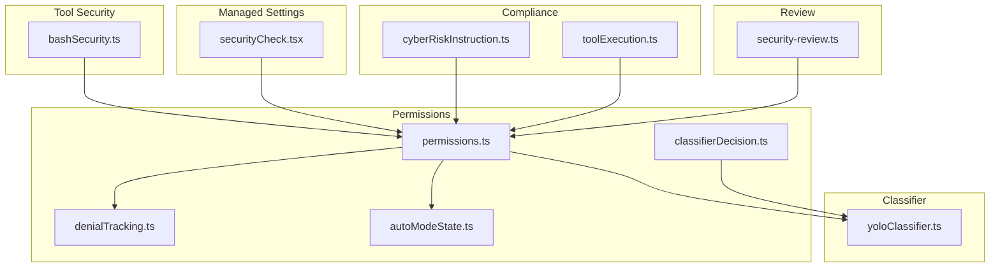
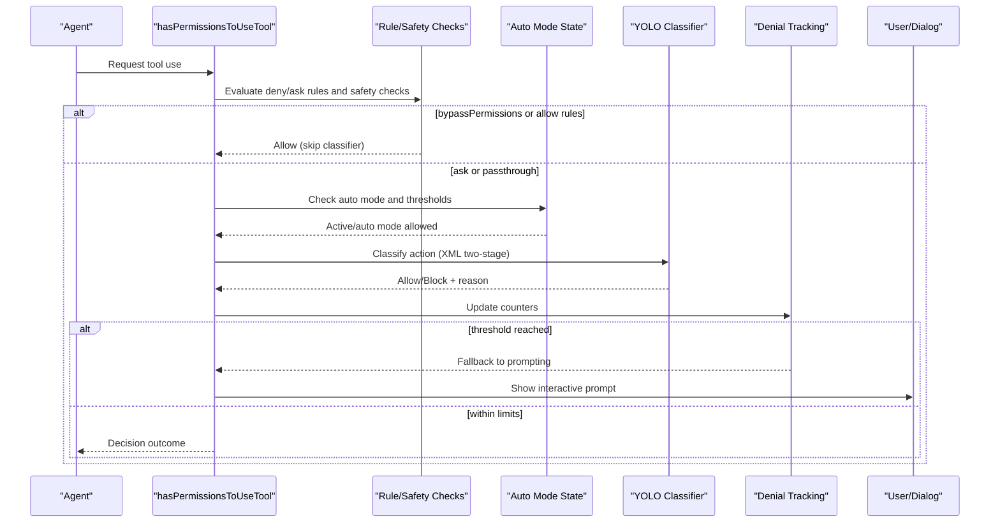
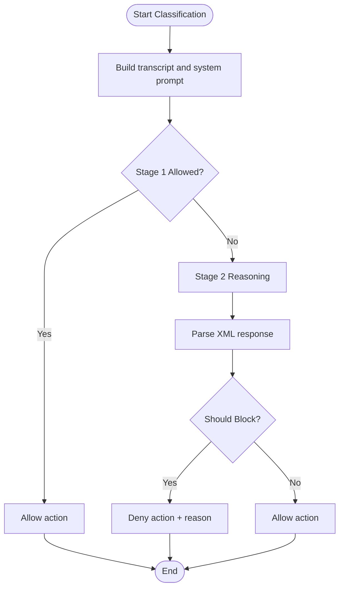
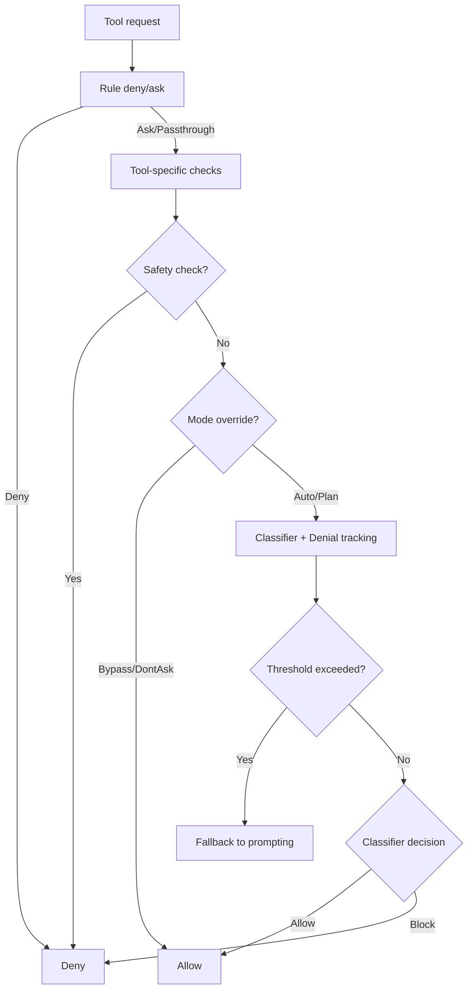
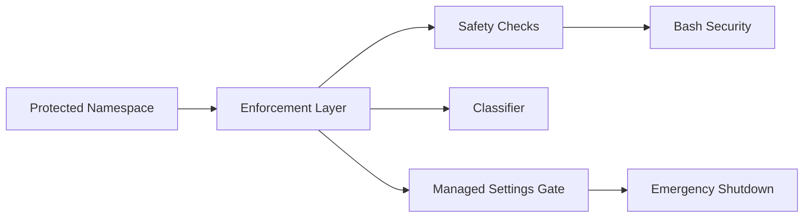
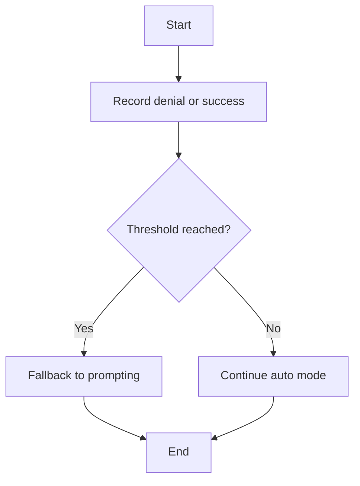
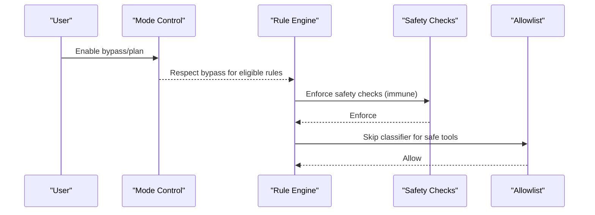
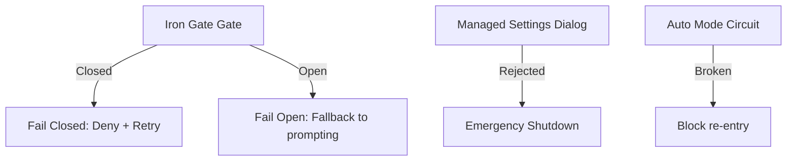
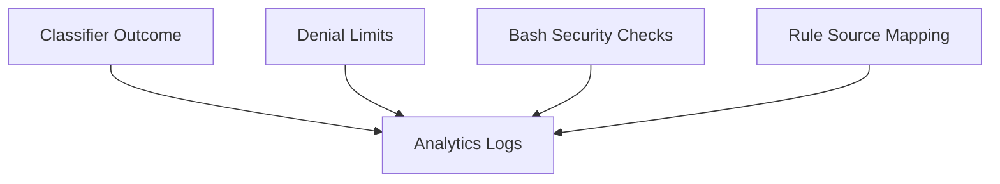
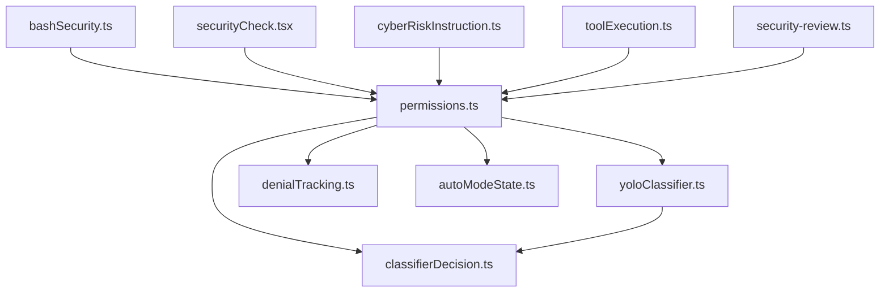

# Security and Enforcement

<cite>
**Referenced Files in This Document**
- [yoloClassifier.ts](file://claude_code_src/restored-src/src/utils/permissions/yoloClassifier.ts)
- [permissions.ts](file://claude_code_src/restored-src/src/utils/permissions/permissions.ts)
- [denialTracking.ts](file://claude_code_src/restored-src/src/utils/permissions/denialTracking.ts)
- [classifierDecision.ts](file://claude_code_src/restored-src/src/utils/permissions/classifierDecision.ts)
- [autoModeState.ts](file://claude_code_src/restored-src/src/utils/permissions/autoModeState.ts)
- [bashSecurity.ts](file://claude_code_src/restored-src/src/tools/BashTool/bashSecurity.ts)
- [cyberRiskInstruction.ts](file://claude_code_src/restored-src/src/constants/cyberRiskInstruction.ts)
- [security-review.ts](file://claude_code_src/restored-src/src/commands/security-review.ts)
- [securityCheck.tsx](file://claude_code_src/restored-src/src/services/remoteManagedSettings/securityCheck.tsx)
- [toolExecution.ts](file://claude_code_src/restored-src/src/services/tools/toolExecution.ts)
</cite>

## Table of Contents
1. [Introduction](#introduction)
2. [Project Structure](#project-structure)
3. [Core Components](#core-components)
4. [Architecture Overview](#architecture-overview)
5. [Detailed Component Analysis](#detailed-component-analysis)
6. [Dependency Analysis](#dependency-analysis)
7. [Performance Considerations](#performance-considerations)
8. [Troubleshooting Guide](#troubleshooting-guide)
9. [Conclusion](#conclusion)
10. [Appendices](#appendices)

## Introduction
This document explains the security enforcement mechanisms and threat protection in the codebase. It focuses on the YOLO classifier used for autonomous security decisions, the decision algorithms that govern permission enforcement, and the security boundaries enforced across tools and environments. It also documents denial tracking, security incident reporting, bypass detection, killswitch and emergency controls, security overrides, configuration examples, threat modeling, incident response procedures, and compliance considerations.

## Project Structure
Security enforcement spans several modules:
- Permission pipeline and decision logic
- YOLO classifier for auto mode
- Denial tracking and limits
- Allowlists and rule-based enforcement
- Bash security validations
- Managed settings security dialog and killswitch
- Security review command and guidelines
- Compliance metadata and analytics

**Diagram sources**
- [permissions.ts:473-956](file://claude_code_src/restored-src/src/utils/permissions/permissions.ts#L473-L956)
- [yoloClassifier.ts:1012-1237](file://claude_code_src/restored-src/src/utils/permissions/yoloClassifier.ts#L1012-L1237)
- [denialTracking.ts:1-46](file://claude_code_src/restored-src/src/utils/permissions/denialTracking.ts#L1-L46)
- [classifierDecision.ts:56-99](file://claude_code_src/restored-src/src/utils/permissions/classifierDecision.ts#L56-L99)
- [autoModeState.ts:1-40](file://claude_code_src/restored-src/src/utils/permissions/autoModeState.ts#L1-L40)
- [bashSecurity.ts:1017-1085](file://claude_code_src/restored-src/src/tools/BashTool/bashSecurity.ts#L1017-L1085)
- [securityCheck.tsx:38-73](file://claude_code_src/restored-src/src/services/remoteManagedSettings/securityCheck.tsx#L38-L73)
- [cyberRiskInstruction.ts:1-24](file://claude_code_src/restored-src/src/constants/cyberRiskInstruction.ts#L1-L24)
- [toolExecution.ts:173-194](file://claude_code_src/restored-src/src/services/tools/toolExecution.ts#L173-L194)
- [security-review.ts:1-244](file://claude_code_src/restored-src/src/commands/security-review.ts#L1-L244)

**Section sources**
- [permissions.ts:473-956](file://claude_code_src/restored-src/src/utils/permissions/permissions.ts#L473-L956)
- [yoloClassifier.ts:1012-1237](file://claude_code_src/restored-src/src/utils/permissions/yoloClassifier.ts#L1012-L1237)
- [denialTracking.ts:1-46](file://claude_code_src/restored-src/src/utils/permissions/denialTracking.ts#L1-L46)
- [classifierDecision.ts:56-99](file://claude_code_src/restored-src/src/utils/permissions/classifierDecision.ts#L56-L99)
- [autoModeState.ts:1-40](file://claude_code_src/restored-src/src/utils/permissions/autoModeState.ts#L1-L40)
- [bashSecurity.ts:1017-1085](file://claude_code_src/restored-src/src/tools/BashTool/bashSecurity.ts#L1017-L1085)
- [securityCheck.tsx:38-73](file://claude_code_src/restored-src/src/services/remoteManagedSettings/securityCheck.tsx#L38-L73)
- [cyberRiskInstruction.ts:1-24](file://claude_code_src/restored-src/src/constants/cyberRiskInstruction.ts#L1-L24)
- [toolExecution.ts:173-194](file://claude_code_src/restored-src/src/services/tools/toolExecution.ts#L173-L194)
- [security-review.ts:1-244](file://claude_code_src/restored-src/src/commands/security-review.ts#L1-L244)

## Core Components
- YOLO classifier: An autonomous security classifier that evaluates agent actions and decides allow/block, with XML-based two-stage reasoning and robust error handling.
- Decision pipeline: A layered permission system combining rule-based enforcement, safety checks, mode-based overrides, and classifier-driven decisions.
- Denial tracking: Consecutive and total denial counters that trigger fallback prompting under thresholds.
- Allowlist: A curated set of safe tools that bypass classifier checks.
- Auto mode state: Circuit breaker and activation flags for controlled classifier operation.
- Bash security validations: Injection and environment exposure checks for shell commands.
- Managed settings security dialog: Interactive security gate with emergency shutdown on rejection.
- Security review command: Automated security review prompt with strict filtering and confidence thresholds.
- Compliance metadata: Analytics metadata mapping for auditable permission decisions.

**Section sources**
- [yoloClassifier.ts:1012-1237](file://claude_code_src/restored-src/src/utils/permissions/yoloClassifier.ts#L1012-L1237)
- [permissions.ts:473-956](file://claude_code_src/restored-src/src/utils/permissions/permissions.ts#L473-L956)
- [denialTracking.ts:1-46](file://claude_code_src/restored-src/src/utils/permissions/denialTracking.ts#L1-L46)
- [classifierDecision.ts:56-99](file://claude_code_src/restored-src/src/utils/permissions/classifierDecision.ts#L56-L99)
- [autoModeState.ts:1-40](file://claude_code_src/restored-src/src/utils/permissions/autoModeState.ts#L1-L40)
- [bashSecurity.ts:1017-1085](file://claude_code_src/restored-src/src/tools/BashTool/bashSecurity.ts#L1017-L1085)
- [securityCheck.tsx:38-73](file://claude_code_src/restored-src/src/services/remoteManagedSettings/securityCheck.tsx#L38-L73)
- [security-review.ts:1-244](file://claude_code_src/restored-src/src/commands/security-review.ts#L1-L244)
- [toolExecution.ts:173-194](file://claude_code_src/restored-src/src/services/tools/toolExecution.ts#L173-L194)

## Architecture Overview
The security architecture enforces a layered approach:
- Rule-based checks and safety gates
- Mode-based overrides (bypass, dontAsk, auto, plan)
- Classifier-based decisions for auto mode
- Denial tracking and fallback prompting
- Killswitch and emergency controls
- Audit logging and compliance metadata

**Diagram sources**
- [permissions.ts:473-956](file://claude_code_src/restored-src/src/utils/permissions/permissions.ts#L473-L956)
- [yoloClassifier.ts:711-800](file://claude_code_src/restored-src/src/utils/permissions/yoloClassifier.ts#L711-L800)
- [denialTracking.ts:40-46](file://claude_code_src/restored-src/src/utils/permissions/denialTracking.ts#L40-L46)
- [autoModeState.ts:11-33](file://claude_code_src/restored-src/src/utils/permissions/autoModeState.ts#L11-L33)

## Detailed Component Analysis

### YOLO Classifier
The YOLO classifier evaluates agent actions in auto mode using a two-stage XML-based process:
- Stage 1 (fast): Immediate yes/no decision with minimal tokens and stop sequences.
- Stage 2 (thinking): Chain-of-thought reasoning when blocked by stage 1.
- Output format: XML tags (<block>, <reason>, <thinking>) to ensure structured parsing.
- Error handling: Graceful degradation to block or fallback depending on availability and configuration.

**Diagram sources**
- [yoloClassifier.ts:711-800](file://claude_code_src/restored-src/src/utils/permissions/yoloClassifier.ts#L711-L800)
- [yoloClassifier.ts:1012-1237](file://claude_code_src/restored-src/src/utils/permissions/yoloClassifier.ts#L1012-L1237)

**Section sources**
- [yoloClassifier.ts:711-800](file://claude_code_src/restored-src/src/utils/permissions/yoloClassifier.ts#L711-L800)
- [yoloClassifier.ts:1012-1237](file://claude_code_src/restored-src/src/utils/permissions/yoloClassifier.ts#L1012-L1237)

### Decision Algorithms
The permission pipeline follows a strict order:
- Rule-based deny/ask and tool-specific checks
- Safety checks (e.g., protected paths) are bypass-immune
- Mode-based overrides (bypassPermissions, dontAsk, auto, plan)
- Auto mode classifier with acceptEdits fast path and allowlist shortcuts
- Denial tracking thresholds trigger fallback prompting
- Headless contexts invoke hooks before auto-deny

**Diagram sources**
- [permissions.ts:1071-1156](file://claude_code_src/restored-src/src/utils/permissions/permissions.ts#L1071-L1156)
- [permissions.ts:1158-1319](file://claude_code_src/restored-src/src/utils/permissions/permissions.ts#L1158-L1319)
- [permissions.ts:518-724](file://claude_code_src/restored-src/src/utils/permissions/permissions.ts#L518-L724)

**Section sources**
- [permissions.ts:1071-1156](file://claude_code_src/restored-src/src/utils/permissions/permissions.ts#L1071-L1156)
- [permissions.ts:1158-1319](file://claude_code_src/restored-src/src/utils/permissions/permissions.ts#L1158-L1319)
- [permissions.ts:518-724](file://claude_code_src/restored-src/src/utils/permissions/permissions.ts#L518-L724)

### Security Boundary Enforcement
- Protected namespace detection and analytics tagging
- Safety checks for sensitive paths and configurations
- Auto mode classifier system prompt includes environment and permission rules
- Bash security validations detect IFS injection and proc environ access
- Managed settings security dialog enforces user consent and emergency shutdown

**Diagram sources**
- [permissions.ts:733-750](file://claude_code_src/restored-src/src/utils/permissions/permissions.ts#L733-L750)
- [bashSecurity.ts:1017-1085](file://claude_code_src/restored-src/src/tools/BashTool/bashSecurity.ts#L1017-L1085)
- [securityCheck.tsx:38-73](file://claude_code_src/restored-src/src/services/remoteManagedSettings/securityCheck.tsx#L38-L73)

**Section sources**
- [permissions.ts:733-750](file://claude_code_src/restored-src/src/utils/permissions/permissions.ts#L733-L750)
- [bashSecurity.ts:1017-1085](file://claude_code_src/restored-src/src/tools/BashTool/bashSecurity.ts#L1017-L1085)
- [securityCheck.tsx:38-73](file://claude_code_src/restored-src/src/services/remoteManagedSettings/securityCheck.tsx#L38-L73)

### Denial Tracking and Fallback
- Consecutive and total denial counters
- Thresholds trigger fallback prompting to user
- Resets on allowed actions; persists across async subagents

**Diagram sources**
- [denialTracking.ts:12-46](file://claude_code_src/restored-src/src/utils/permissions/denialTracking.ts#L12-L46)
- [permissions.ts:984-1058](file://claude_code_src/restored-src/src/utils/permissions/permissions.ts#L984-L1058)

**Section sources**
- [denialTracking.ts:12-46](file://claude_code_src/restored-src/src/utils/permissions/denialTracking.ts#L12-L46)
- [permissions.ts:984-1058](file://claude_code_src/restored-src/src/utils/permissions/permissions.ts#L984-L1058)

### Bypass Detection and Overrides
- Bypass permissions mode and plan-mode availability
- Rule-based bypass-immune safety checks
- AcceptEdits fast path for safe operations
- Allowlisted tools shortcut classifier checks

**Diagram sources**
- [permissions.ts:1268-1281](file://claude_code_src/restored-src/src/utils/permissions/permissions.ts#L1268-L1281)
- [permissions.ts:1252-1261](file://claude_code_src/restored-src/src/utils/permissions/permissions.ts#L1252-L1261)
- [permissions.ts:600-656](file://claude_code_src/restored-src/src/utils/permissions/permissions.ts#L600-L656)
- [classifierDecision.ts:96-99](file://claude_code_src/restored-src/src/utils/permissions/classifierDecision.ts#L96-L99)

**Section sources**
- [permissions.ts:1268-1281](file://claude_code_src/restored-src/src/utils/permissions/permissions.ts#L1268-L1281)
- [permissions.ts:1252-1261](file://claude_code_src/restored-src/src/utils/permissions/permissions.ts#L1252-L1261)
- [permissions.ts:600-656](file://claude_code_src/restored-src/src/utils/permissions/permissions.ts#L600-L656)
- [classifierDecision.ts:96-99](file://claude_code_src/restored-src/src/utils/permissions/classifierDecision.ts#L96-L99)

### Killswitch Mechanisms and Emergency Controls
- Iron gate classifier availability gate with fail-closed/fail-open behavior
- Managed settings security dialog with emergency shutdown on rejection
- Auto mode circuit breaker to prevent re-entry after enforced removal

**Diagram sources**
- [permissions.ts:843-876](file://claude_code_src/restored-src/src/utils/permissions/permissions.ts#L843-L876)
- [securityCheck.tsx:38-73](file://claude_code_src/restored-src/src/services/remoteManagedSettings/securityCheck.tsx#L38-L73)
- [autoModeState.ts:27-33](file://claude_code_src/restored-src/src/utils/permissions/autoModeState.ts#L27-L33)

**Section sources**
- [permissions.ts:843-876](file://claude_code_src/restored-src/src/utils/permissions/permissions.ts#L843-L876)
- [securityCheck.tsx:38-73](file://claude_code_src/restored-src/src/services/remoteManagedSettings/securityCheck.tsx#L38-L73)
- [autoModeState.ts:27-33](file://claude_code_src/restored-src/src/utils/permissions/autoModeState.ts#L27-L33)

### Security Incident Reporting and Monitoring
- Classifier outcomes logged with detailed telemetry (tokens, latency, reasons)
- Denial limit exceeded events with counts and mode
- Security check triggers for Bash validations
- Analytics metadata mapping for rule sources and user overrides

**Diagram sources**
- [permissions.ts:733-812](file://claude_code_src/restored-src/src/utils/permissions/permissions.ts#L733-L812)
- [permissions.ts:1009-1021](file://claude_code_src/restored-src/src/utils/permissions/permissions.ts#L1009-L1021)
- [bashSecurity.ts:1024-1065](file://claude_code_src/restored-src/src/tools/BashTool/bashSecurity.ts#L1024-L1065)
- [toolExecution.ts:181-194](file://claude_code_src/restored-src/src/services/tools/toolExecution.ts#L181-L194)

**Section sources**
- [permissions.ts:733-812](file://claude_code_src/restored-src/src/utils/permissions/permissions.ts#L733-L812)
- [permissions.ts:1009-1021](file://claude_code_src/restored-src/src/utils/permissions/permissions.ts#L1009-L1021)
- [bashSecurity.ts:1024-1065](file://claude_code_src/restored-src/src/tools/BashTool/bashSecurity.ts#L1024-L1065)
- [toolExecution.ts:181-194](file://claude_code_src/restored-src/src/services/tools/toolExecution.ts#L181-L194)

### Security Review and Threat Modeling
- Automated security review command with allowed tools and filtering rules
- Confidence scoring and false-positive filtering
- Exclusions for non-exploitable or low-impact issues

**Section sources**
- [security-review.ts:1-244](file://claude_code_src/restored-src/src/commands/security-review.ts#L1-L244)

### Compliance Considerations
- CYBER_RISK_INSTRUCTION defines boundaries for security assistance
- Analytics metadata mapping aligns with observability and auditability
- Managed settings dialog ensures user consent and compliance with emergency controls

**Section sources**
- [cyberRiskInstruction.ts:1-24](file://claude_code_src/restored-src/src/constants/cyberRiskInstruction.ts#L1-L24)
- [toolExecution.ts:181-194](file://claude_code_src/restored-src/src/services/tools/toolExecution.ts#L181-L194)
- [securityCheck.tsx:38-73](file://claude_code_src/restored-src/src/services/remoteManagedSettings/securityCheck.tsx#L38-L73)

## Dependency Analysis

**Diagram sources**
- [permissions.ts:58-64](file://claude_code_src/restored-src/src/utils/permissions/permissions.ts#L58-L64)
- [yoloClassifier.ts:39-44](file://claude_code_src/restored-src/src/utils/permissions/yoloClassifier.ts#L39-L44)
- [denialTracking.ts:1-46](file://claude_code_src/restored-src/src/utils/permissions/denialTracking.ts#L1-L46)
- [autoModeState.ts:1-40](file://claude_code_src/restored-src/src/utils/permissions/autoModeState.ts#L1-L40)
- [classifierDecision.ts:1-99](file://claude_code_src/restored-src/src/utils/permissions/classifierDecision.ts#L1-L99)
- [bashSecurity.ts:1017-1085](file://claude_code_src/restored-src/src/tools/BashTool/bashSecurity.ts#L1017-L1085)
- [securityCheck.tsx:38-73](file://claude_code_src/restored-src/src/services/remoteManagedSettings/securityCheck.tsx#L38-L73)
- [cyberRiskInstruction.ts:1-24](file://claude_code_src/restored-src/src/constants/cyberRiskInstruction.ts#L1-L24)
- [toolExecution.ts:173-194](file://claude_code_src/restored-src/src/services/tools/toolExecution.ts#L173-L194)
- [security-review.ts:1-244](file://claude_code_src/restored-src/src/commands/security-review.ts#L1-L244)

**Section sources**
- [permissions.ts:58-64](file://claude_code_src/restored-src/src/utils/permissions/permissions.ts#L58-L64)
- [yoloClassifier.ts:39-44](file://claude_code_src/restored-src/src/utils/permissions/yoloClassifier.ts#L39-L44)
- [denialTracking.ts:1-46](file://claude_code_src/restored-src/src/utils/permissions/denialTracking.ts#L1-L46)
- [autoModeState.ts:1-40](file://claude_code_src/restored-src/src/utils/permissions/autoModeState.ts#L1-L40)
- [classifierDecision.ts:1-99](file://claude_code_src/restored-src/src/utils/permissions/classifierDecision.ts#L1-L99)
- [bashSecurity.ts:1017-1085](file://claude_code_src/restored-src/src/tools/BashTool/bashSecurity.ts#L1017-L1085)
- [securityCheck.tsx:38-73](file://claude_code_src/restored-src/src/services/remoteManagedSettings/securityCheck.tsx#L38-L73)
- [cyberRiskInstruction.ts:1-24](file://claude_code_src/restored-src/src/constants/cyberRiskInstruction.ts#L1-L24)
- [toolExecution.ts:173-194](file://claude_code_src/restored-src/src/services/tools/toolExecution.ts#L173-L194)
- [security-review.ts:1-244](file://claude_code_src/restored-src/src/commands/security-review.ts#L1-L244)

## Performance Considerations
- Classifier cost estimation and token usage telemetry enable overhead analysis.
- Prompt caching and shared system prompts improve efficiency across calls.
- Two-stage XML classification balances speed and accuracy.
- Denial tracking prevents excessive classifier calls and reduces latency.

[No sources needed since this section provides general guidance]

## Troubleshooting Guide
Common issues and resolutions:
- Classifier unavailable: Fail-closed vs fail-open behavior depends on the iron gate gate; review gate configuration and retry guidance.
- Transcript too long: Falls back to normal prompting; reduce transcript length or split actions.
- Too many denials: Denial limits trigger fallback prompting; review classifier reasons and adjust rules.
- Headless mode limitations: Automatic deny with abort error; add PermissionRequest hooks or adjust mode.
- Managed settings rejection: Triggers emergency shutdown; confirm settings and retry with accepted dialog.

**Section sources**
- [permissions.ts:843-876](file://claude_code_src/restored-src/src/utils/permissions/permissions.ts#L843-L876)
- [permissions.ts:819-842](file://claude_code_src/restored-src/src/utils/permissions/permissions.ts#L819-L842)
- [permissions.ts:890-901](file://claude_code_src/restored-src/src/utils/permissions/permissions.ts#L890-L901)
- [permissions.ts:929-952](file://claude_code_src/restored-src/src/utils/permissions/permissions.ts#L929-L952)
- [securityCheck.tsx:67-73](file://claude_code_src/restored-src/src/services/remoteManagedSettings/securityCheck.tsx#L67-L73)

## Conclusion
The system employs a robust, layered security architecture combining rule-based enforcement, safety checks, classifier-driven decisions, and strict denial tracking. It includes emergency controls, interactive security gates, and comprehensive monitoring to ensure safe operation while maintaining usability. Adhering to the configured policies, threat model, and incident response procedures helps maintain strong security posture.

[No sources needed since this section summarizes without analyzing specific files]

## Appendices

### Security Configuration Examples
- Auto mode rules allow/deny/environment sections
- Managed settings security dialog acceptance/rejection
- CYBER_RISK_INSTRUCTION boundaries for security assistance

**Section sources**
- [yoloClassifier.ts:484-540](file://claude_code_src/restored-src/src/utils/permissions/yoloClassifier.ts#L484-L540)
- [securityCheck.tsx:42-60](file://claude_code_src/restored-src/src/services/remoteManagedSettings/securityCheck.tsx#L42-L60)
- [cyberRiskInstruction.ts:1-24](file://claude_code_src/restored-src/src/constants/cyberRiskInstruction.ts#L1-L24)

### Threat Modeling and Incident Response
- Automated security review with confidence thresholds and exclusions
- Denial limit exceeded events for triage
- Classifier error dumps and analytics for forensic analysis

**Section sources**
- [security-review.ts:140-187](file://claude_code_src/restored-src/src/commands/security-review.ts#L140-L187)
- [permissions.ts:1009-1021](file://claude_code_src/restored-src/src/utils/permissions/permissions.ts#L1009-L1021)
- [yoloClassifier.ts:213-250](file://claude_code_src/restored-src/src/utils/permissions/yoloClassifier.ts#L213-L250)