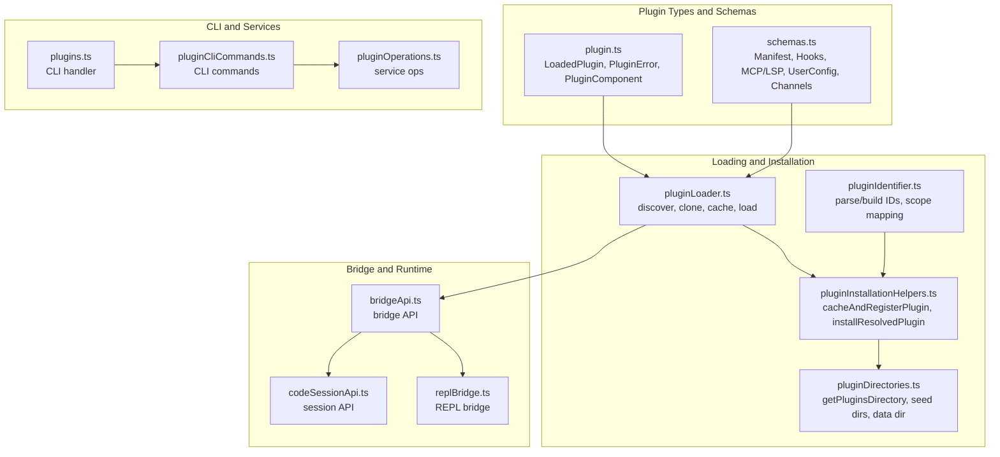
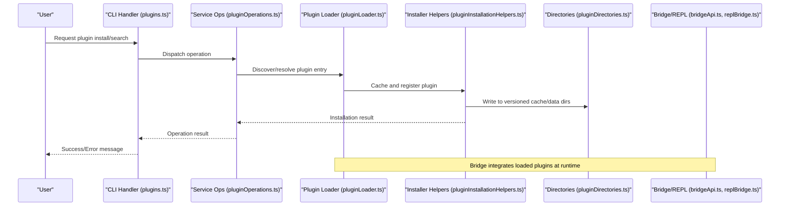
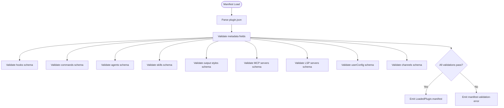
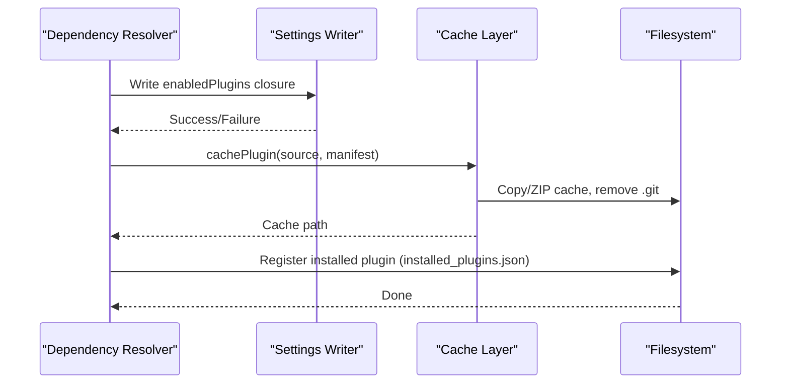
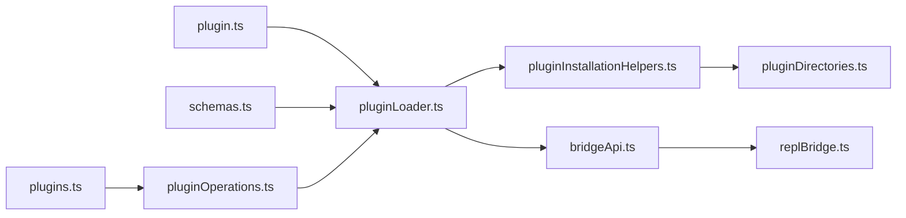
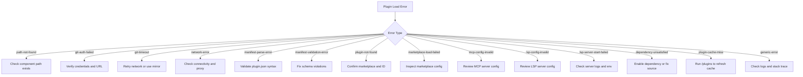

# Plugin Development Guide

<cite>
**Referenced Files in This Document**
- [builtinPlugins.ts](file://claude_code_src/restored-src/src/plugins/builtinPlugins.ts)
- [plugin.ts](file://claude_code_src/restored-src/src/types/plugin.ts)
- [pluginLoader.ts](file://claude_code_src/restored-src/src/utils/plugins/pluginLoader.ts)
- [pluginDirectories.ts](file://claude_code_src/restored-src/src/utils/plugins/pluginDirectories.ts)
- [schemas.ts](file://claude_code_src/restored-src/src/utils/plugins/schemas.ts)
- [pluginInstallationHelpers.ts](file://claude_code_src/restored-src/src/utils/plugins/pluginInstallationHelpers.ts)
- [pluginIdentifier.ts](file://claude_code_src/restored-src/src/utils/plugins/pluginIdentifier.ts)
- [pluginAutoupdate.ts](file://claude_code_src/restored-src/src/utils/plugins/pluginAutoupdate.ts)
- [pluginBlocklist.ts](file://claude_code_src/restored-src/src/utils/plugins/pluginBlocklist.ts)
- [pluginFlagging.ts](file://claude_code_src/restored-src/src/utils/plugins/pluginFlagging.ts)
- [pluginOptionsStorage.ts](file://claude_code_src/restored-src/src/utils/plugins/pluginOptionsStorage.ts)
- [pluginPolicy.ts](file://claude_code_src/restored-src/src/utils/plugins/pluginPolicy.ts)
- [pluginStartupCheck.ts](file://claude_code_src/restored-src/src/utils/plugins/pluginStartupCheck.ts)
- [pluginVersioning.ts](file://claude_code_src/restored-src/src/utils/plugins/pluginVersioning.ts)
- [pluginOnlyPolicy.ts](file://claude_code_src/restored-src/src/utils/settings/pluginOnlyPolicy.ts)
- [pluginTelemetry.ts](file://claude_code_src/restored-src/src/utils/telemetry/pluginTelemetry.ts)
- [pluginCliCommands.ts](file://claude_code_src/restored-src/src/services/plugins/pluginCliCommands.ts)
- [pluginOperations.ts](file://claude_code_src/restored-src/src/services/plugins/pluginOperations.ts)
- [plugins.ts](file://claude_code_src/restored-src/src/cli/handlers/plugins.ts)
- [bridgeApi.ts](file://claude_code_src/restored-src/src/bridge/bridgeApi.ts)
- [bridgeMessaging.ts](file://claude_code_src/restored-src/src/bridge/bridgeMessaging.ts)
- [replBridge.ts](file://claude_code_src/restored-src/src/bridge/replBridge.ts)
- [codeSessionApi.ts](file://claude_code_src/restored-src/src/bridge/codeSessionApi.ts)
- [createSession.ts](file://claude_code_src/restored-src/src/bridge/createSession.ts)
- [initReplBridge.ts](file://claude_code_src/restored-src/src/bridge/initReplBridge.ts)
- [replBridgeTransport.ts](file://claude_code_src/restored-src/src/bridge/replBridgeTransport.ts)
- [replBridgeHandle.ts](file://claude_code_src/restored-src/src/bridge/replBridgeHandle.ts)
- [remoteBridgeCore.ts](file://claude_code_src/restored-src/src/bridge/remoteBridgeCore.ts)
- [trustedDevice.ts](file://claude_code_src/restored-src/src/bridge/trustedDevice.ts)
- [workSecret.ts](file://claude_code_src/restored-src/src/bridge/workSecret.ts)
- [types.ts](file://claude_code_src/restored-src/src/bridge/types.ts)
- [sessionRunner.ts](file://claude_code_src/restored-src/src/bridge/sessionRunner.ts)
- [inboundMessages.ts](file://claude_code_src/restored-src/src/bridge/inboundMessages.ts)
- [inboundAttachments.ts](file://claude_code_src/restored-src/src/bridge/inboundAttachments.ts)
- [sessionIdCompat.ts](file://claude_code_src/restored-src/src/bridge/sessionIdCompat.ts)
- [bridgeEnabled.ts](file://claude_code_src/restored-src/src/bridge/bridgeEnabled.ts)
- [bridgeUI.ts](file://claude_code_src/restored-src/src/bridge/bridgeUI.ts)
- [bridgeStatusUtil.ts](file://claude_code_src/restored-src/src/bridge/bridgeStatusUtil.ts)
- [bridgePermissionCallbacks.ts](file://claude_code_src/restored-src/src/bridge/bridgePermissionCallbacks.ts)
- [bridgePointer.ts](file://claude_code_src/restored-src/src/bridge/bridgePointer.ts)
- [bridgeConfig.ts](file://claude_code_src/restored-src/src/bridge/bridgeConfig.ts)
- [bridgeDebug.ts](file://claude_code_src/restored-src/src/bridge/bridgeDebug.ts)
- [envLessBridgeConfig.ts](file://claude_code_src/restored-src/src/bridge/envLessBridgeConfig.ts)
- [pollConfig.ts](file://claude_code_src/restored-src/src/bridge/pollConfig.ts)
- [pollConfigDefaults.ts](file://claude_code_src/restored-src/src/bridge/pollConfigDefaults.ts)
- [flushGate.ts](file://claude_code_src/restored-src/src/bridge/flushGate.ts)
- [capacityWake.ts](file://claude_code_src/restored-src/src/bridge/capacityWake.ts)
- [jwtUtils.ts](file://claude_code_src/restored-src/src/bridge/jwtUtils.ts)
- [debugUtils.ts](file://claude_code_src/restored-src/src/bridge/debugUtils.ts)
- [mcp.ts](file://claude_code_src/restored-src/src/entrypoints/mcp.ts)
- [sdk/index.ts](file://claude_code_src/restored-src/src/entrypoints/sdk/index.ts)
- [agentSdkTypes.ts](file://claude_code_src/restored-src/src/entrypoints/agentSdkTypes.ts)
- [sandboxTypes.ts](file://claude_code_src/restored-src/src/entrypoints/sandboxTypes.ts)
- [useManagePlugins.ts](file://claude_code_src/restored-src/src/hooks/useManagePlugins.ts)
- [usePluginRecommendationBase.tsx](file://claude_code_src/restored-src/src/hooks/usePluginRecommendationBase.tsx)
- [useIDEIntegration.tsx](file://claude_code_src/restored-src/src/hooks/useIDEIntegration.tsx)
- [useReplBridge.tsx](file://claude_code_src/restored-src/src/hooks/useReplBridge.tsx)
- [useMergedClients.ts](file://claude_code_src/restored-src/src/hooks/useMergedClients.ts)
- [useMergedCommands.ts](file://claude_code_src/restored-src/src/hooks/useMergedCommands.ts)
- [useMergedTools.ts](file://claude_code_src/restored-src/src/hooks/useMergedTools.ts)
- [usePluginRecommendationBase.tsx](file://claude_code_src/restored-src/src/hooks/usePluginRecommendationBase.tsx)
- [usePluginRecommendationBase.tsx](file://claude_code_src/restored-src/src/hooks/usePluginRecommendationBase.tsx)
- [usePluginRecommendationBase.tsx](file://claude_code_src/restored-src/src/hooks/usePluginRecommendationBase.tsx)
</cite>

## Table of Contents
1. [Introduction](#introduction)
2. [Project Structure](#project-structure)
3. [Core Components](#core-components)
4. [Architecture Overview](#architecture-overview)
5. [Detailed Component Analysis](#detailed-component-analysis)
6. [Dependency Analysis](#dependency-analysis)
7. [Performance Considerations](#performance-considerations)
8. [Troubleshooting Guide](#troubleshooting-guide)
9. [Conclusion](#conclusion)
10. [Appendices](#appendices)

## Introduction
This guide explains how to develop, implement, validate, and distribute plugins for the Claude Code system. It covers plugin manifest requirements, schema validation, directory conventions, plugin APIs, callback mechanisms, integration patterns with the Claude Code bridge and REPL, testing strategies, debugging techniques, performance optimization, packaging, distribution, and best practices for security and user experience.

## Project Structure
The plugin system spans several modules:
- Manifest and schema validation for plugin metadata, commands, agents, hooks, MCP/LSP servers, and user-configurable options
- Plugin loader and installer that discovers, clones/fetches, caches, and loads plugins
- Directory management for plugin roots, seeds, and data directories
- Identifier parsing and scoping helpers for installable plugin scopes
- CLI and service integrations for plugin operations
- Bridge and REPL integration for live plugin interactions
- Telemetry, policies, blocklists, and autoupdate utilities

**Diagram sources**
- [plugin.ts:48-70](file://claude_code_src/restored-src/src/types/plugin.ts#L48-L70)
- [schemas.ts:274-320](file://claude_code_src/restored-src/src/utils/plugins/schemas.ts#L274-L320)
- [pluginLoader.ts:10-33](file://claude_code_src/restored-src/src/utils/plugins/pluginLoader.ts#L10-L33)
- [pluginInstallationHelpers.ts:128-226](file://claude_code_src/restored-src/src/utils/plugins/pluginInstallationHelpers.ts#L128-L226)
- [pluginDirectories.ts:53-63](file://claude_code_src/restored-src/src/utils/plugins/pluginDirectories.ts#L53-L63)
- [pluginIdentifier.ts:51-67](file://claude_code_src/restored-src/src/utils/plugins/pluginIdentifier.ts#L51-L67)
- [plugins.ts](file://claude_code_src/restored-src/src/cli/handlers/plugins.ts)
- [pluginCliCommands.ts](file://claude_code_src/restored-src/src/services/plugins/pluginCliCommands.ts)
- [pluginOperations.ts](file://claude_code_src/restored-src/src/services/plugins/pluginOperations.ts)
- [bridgeApi.ts](file://claude_code_src/restored-src/src/bridge/bridgeApi.ts)
- [replBridge.ts](file://claude_code_src/restored-src/src/bridge/replBridge.ts)
- [codeSessionApi.ts](file://claude_code_src/restored-src/src/bridge/codeSessionApi.ts)

**Section sources**
- [plugin.ts:48-70](file://claude_code_src/restored-src/src/types/plugin.ts#L48-L70)
- [schemas.ts:274-320](file://claude_code_src/restored-src/src/utils/plugins/schemas.ts#L274-L320)
- [pluginLoader.ts:10-33](file://claude_code_src/restored-src/src/utils/plugins/pluginLoader.ts#L10-L33)
- [pluginInstallationHelpers.ts:128-226](file://claude_code_src/restored-src/src/utils/plugins/pluginInstallationHelpers.ts#L128-L226)
- [pluginDirectories.ts:53-63](file://claude_code_src/restored-src/src/utils/plugins/pluginDirectories.ts#L53-L63)
- [pluginIdentifier.ts:51-67](file://claude_code_src/restored-src/src/utils/plugins/pluginIdentifier.ts#L51-L67)
- [plugins.ts](file://claude_code_src/restored-src/src/cli/handlers/plugins.ts)
- [pluginCliCommands.ts](file://claude_code_src/restored-src/src/services/plugins/pluginCliCommands.ts)
- [pluginOperations.ts](file://claude_code_src/restored-src/src/services/plugins/pluginOperations.ts)
- [bridgeApi.ts](file://claude_code_src/restored-src/src/bridge/bridgeApi.ts)
- [replBridge.ts](file://claude_code_src/restored-src/src/bridge/replBridge.ts)
- [codeSessionApi.ts](file://claude_code_src/restored-src/src/bridge/codeSessionApi.ts)

## Core Components
- Plugin manifest and types define metadata, components, and error handling contracts.
- Schema validation enforces manifest, hooks, MCP/LSP, and user-config schemas.
- Loader resolves sources, clones/fetches, caches, and loads plugins.
- Installation helpers manage dependency resolution, settings updates, and caching.
- Directory utilities centralize plugin root, seed, and data directory management.
- Identifier utilities parse and build plugin IDs and map scopes to setting sources.
- CLI and service modules expose plugin operations to users and automation.
- Bridge and REPL modules integrate plugins into runtime sessions.

**Section sources**
- [plugin.ts:48-70](file://claude_code_src/restored-src/src/types/plugin.ts#L48-L70)
- [schemas.ts:274-320](file://claude_code_src/restored-src/src/utils/plugins/schemas.ts#L274-L320)
- [pluginLoader.ts:10-33](file://claude_code_src/restored-src/src/utils/plugins/pluginLoader.ts#L10-L33)
- [pluginInstallationHelpers.ts:128-226](file://claude_code_src/restored-src/src/utils/plugins/pluginInstallationHelpers.ts#L128-L226)
- [pluginDirectories.ts:53-63](file://claude_code_src/restored-src/src/utils/plugins/pluginDirectories.ts#L53-L63)
- [pluginIdentifier.ts:51-67](file://claude_code_src/restored-src/src/utils/plugins/pluginIdentifier.ts#L51-L67)
- [plugins.ts](file://claude_code_src/restored-src/src/cli/handlers/plugins.ts)
- [pluginCliCommands.ts](file://claude_code_src/restored-src/src/services/plugins/pluginCliCommands.ts)
- [pluginOperations.ts](file://claude_code_src/restored-src/src/services/plugins/pluginOperations.ts)
- [bridgeApi.ts](file://claude_code_src/restored-src/src/bridge/bridgeApi.ts)
- [replBridge.ts](file://claude_code_src/restored-src/src/bridge/replBridge.ts)
- [codeSessionApi.ts](file://claude_code_src/restored-src/src/bridge/codeSessionApi.ts)

## Architecture Overview
The plugin architecture consists of:
- Manifest-driven plugin definition with optional components (commands, agents, skills, hooks, output styles, MCP servers, LSP servers).
- Validation pipeline ensuring manifests and configurations conform to schemas.
- Installation pipeline resolving dependencies, writing settings, caching, and registering plugins.
- Runtime integration via bridge and REPL for live interactions and tool use.

**Diagram sources**
- [plugins.ts](file://claude_code_src/restored-src/src/cli/handlers/plugins.ts)
- [pluginOperations.ts](file://claude_code_src/restored-src/src/services/plugins/pluginOperations.ts)
- [pluginLoader.ts:10-33](file://claude_code_src/restored-src/src/utils/plugins/pluginLoader.ts#L10-L33)
- [pluginInstallationHelpers.ts:128-226](file://claude_code_src/restored-src/src/utils/plugins/pluginInstallationHelpers.ts#L128-L226)
- [pluginDirectories.ts:53-63](file://claude_code_src/restored-src/src/utils/plugins/pluginDirectories.ts#L53-L63)
- [bridgeApi.ts](file://claude_code_src/restored-src/src/bridge/bridgeApi.ts)
- [replBridge.ts](file://claude_code_src/restored-src/src/bridge/replBridge.ts)

## Detailed Component Analysis

### Plugin Manifest and Schema Validation
- Manifest metadata includes name, version, description, author, homepage, repository, license, keywords, and dependencies.
- Hooks, commands, agents, skills, output styles, MCP servers, LSP servers, and user-configurable options are validated by dedicated schemas.
- Channels schema supports MCP-based notification channels with user-config prompts.
- Official marketplace name validation and source verification protect against impersonation.

**Diagram sources**
- [schemas.ts:274-320](file://claude_code_src/restored-src/src/utils/plugins/schemas.ts#L274-L320)
- [schemas.ts:328-340](file://claude_code_src/restored-src/src/utils/plugins/schemas.ts#L328-L340)
- [schemas.ts:429-452](file://claude_code_src/restored-src/src/utils/plugins/schemas.ts#L429-L452)
- [schemas.ts:460-476](file://claude_code_src/restored-src/src/utils/plugins/schemas.ts#L460-L476)
- [schemas.ts:484-499](file://claude_code_src/restored-src/src/utils/plugins/schemas.ts#L484-L499)
- [schemas.ts:507-524](file://claude_code_src/restored-src/src/utils/plugins/schemas.ts#L507-L524)
- [schemas.ts:543-572](file://claude_code_src/restored-src/src/utils/plugins/schemas.ts#L543-L572)
- [schemas.ts:708-788](file://claude_code_src/restored-src/src/utils/plugins/schemas.ts#L708-L788)
- [schemas.ts:632-654](file://claude_code_src/restored-src/src/utils/plugins/schemas.ts#L632-L654)
- [schemas.ts:670-703](file://claude_code_src/restored-src/src/utils/plugins/schemas.ts#L670-L703)

**Section sources**
- [schemas.ts:274-320](file://claude_code_src/restored-src/src/utils/plugins/schemas.ts#L274-L320)
- [schemas.ts:328-340](file://claude_code_src/restored-src/src/utils/plugins/schemas.ts#L328-L340)
- [schemas.ts:429-452](file://claude_code_src/restored-src/src/utils/plugins/schemas.ts#L429-L452)
- [schemas.ts:460-476](file://claude_code_src/restored-src/src/utils/plugins/schemas.ts#L460-L476)
- [schemas.ts:484-499](file://claude_code_src/restored-src/src/utils/plugins/schemas.ts#L484-L499)
- [schemas.ts:507-524](file://claude_code_src/restored-src/src/utils/plugins/schemas.ts#L507-L524)
- [schemas.ts:543-572](file://claude_code_src/restored-src/src/utils/plugins/schemas.ts#L543-L572)
- [schemas.ts:708-788](file://claude_code_src/restored-src/src/utils/plugins/schemas.ts#L708-L788)
- [schemas.ts:632-654](file://claude_code_src/restored-src/src/utils/plugins/schemas.ts#L632-L654)
- [schemas.ts:670-703](file://claude_code_src/restored-src/src/utils/plugins/schemas.ts#L670-L703)

### Plugin Loader and Installation Pipeline
- Sources: marketplace-based plugins, git repositories, git subdirectories, NPM packages, and session-only plugins.
- Directory structure: plugin.json (optional), commands/, agents/, hooks/.
- Loader handles manifest validation, hooks configuration, duplicates, enable/disable state, and error collection.
- Installation helpers resolve dependencies, update settings, cache plugins, and register installs.

**Diagram sources**
- [pluginLoader.ts:10-33](file://claude_code_src/restored-src/src/utils/plugins/pluginLoader.ts#L10-L33)
- [pluginInstallationHelpers.ts:348-481](file://claude_code_src/restored-src/src/utils/plugins/pluginInstallationHelpers.ts#L348-L481)
- [pluginDirectories.ts:53-63](file://claude_code_src/restored-src/src/utils/plugins/pluginDirectories.ts#L53-L63)

**Section sources**
- [pluginLoader.ts:10-33](file://claude_code_src/restored-src/src/utils/plugins/pluginLoader.ts#L10-L33)
- [pluginInstallationHelpers.ts:348-481](file://claude_code_src/restored-src/src/utils/plugins/pluginInstallationHelpers.ts#L348-L481)
- [pluginDirectories.ts:53-63](file://claude_code_src/restored-src/src/utils/plugins/pluginDirectories.ts#L53-L63)

### Plugin Directory Management
- Centralized plugin directory with support for cowork mode and seed directories.
- Data directory per plugin persists across updates; size estimation and cleanup utilities included.

**Section sources**
- [pluginDirectories.ts:53-63](file://claude_code_src/restored-src/src/utils/plugins/pluginDirectories.ts#L53-L63)
- [pluginDirectories.ts:119-123](file://claude_code_src/restored-src/src/utils/plugins/pluginDirectories.ts#L119-L123)
- [pluginDirectories.ts:130-160](file://claude_code_src/restored-src/src/utils/plugins/pluginDirectories.ts#L130-L160)

### Plugin Identifier and Scoping
- Parse and build plugin IDs; map scopes to setting sources; enforce managed scope restrictions.

**Section sources**
- [pluginIdentifier.ts:51-67](file://claude_code_src/restored-src/src/utils/plugins/pluginIdentifier.ts#L51-L67)
- [pluginIdentifier.ts:104-111](file://claude_code_src/restored-src/src/utils/plugins/pluginIdentifier.ts#L104-L111)
- [pluginIdentifier.ts:119-123](file://claude_code_src/restored-src/src/utils/plugins/pluginIdentifier.ts#L119-L123)

### Built-in Plugins Registry
- Built-in plugins ship with the CLI, appear in the /plugin UI, and can be toggled by users.
- IDs use the format {name}@builtin; availability checks and default enabled states are supported.

**Section sources**
- [builtinPlugins.ts:21-102](file://claude_code_src/restored-src/src/plugins/builtinPlugins.ts#L21-L102)
- [builtinPlugins.ts:108-121](file://claude_code_src/restored-src/src/plugins/builtinPlugins.ts#L108-L121)

### Bridge and REPL Integration
- Bridge modules connect plugin runtime to Claude Code sessions and REPL.
- Integration points include session creation, messaging, permission callbacks, and trusted device handling.

**Section sources**
- [bridgeApi.ts](file://claude_code_src/restored-src/src/bridge/bridgeApi.ts)
- [replBridge.ts](file://claude_code_src/restored-src/src/bridge/replBridge.ts)
- [codeSessionApi.ts](file://claude_code_src/restored-src/src/bridge/codeSessionApi.ts)
- [createSession.ts](file://claude_code_src/restored-src/src/bridge/createSession.ts)
- [initReplBridge.ts](file://claude_code_src/restored-src/src/bridge/initReplBridge.ts)
- [replBridgeTransport.ts](file://claude_code_src/restored-src/src/bridge/replBridgeTransport.ts)
- [replBridgeHandle.ts](file://claude_code_src/restored-src/src/bridge/replBridgeHandle.ts)
- [remoteBridgeCore.ts](file://claude_code_src/restored-src/src/bridge/remoteBridgeCore.ts)
- [trustedDevice.ts](file://claude_code_src/restored-src/src/bridge/trustedDevice.ts)
- [workSecret.ts](file://claude_code_src/restored-src/src/bridge/workSecret.ts)
- [types.ts](file://claude_code_src/restored-src/src/bridge/types.ts)
- [sessionRunner.ts](file://claude_code_src/restored-src/src/bridge/sessionRunner.ts)
- [inboundMessages.ts](file://claude_code_src/restored-src/src/bridge/inboundMessages.ts)
- [inboundAttachments.ts](file://claude_code_src/restored-src/src/bridge/inboundAttachments.ts)
- [sessionIdCompat.ts](file://claude_code_src/restored-src/src/bridge/sessionIdCompat.ts)
- [bridgeEnabled.ts](file://claude_code_src/restored-src/src/bridge/bridgeEnabled.ts)
- [bridgeUI.ts](file://claude_code_src/restored-src/src/bridge/bridgeUI.ts)
- [bridgeStatusUtil.ts](file://claude_code_src/restored-src/src/bridge/bridgeStatusUtil.ts)
- [bridgePermissionCallbacks.ts](file://claude_code_src/restored-src/src/bridge/bridgePermissionCallbacks.ts)
- [bridgePointer.ts](file://claude_code_src/restored-src/src/bridge/bridgePointer.ts)
- [bridgeConfig.ts](file://claude_code_src/restored-src/src/bridge/bridgeConfig.ts)
- [bridgeDebug.ts](file://claude_code_src/restored-src/src/bridge/bridgeDebug.ts)
- [envLessBridgeConfig.ts](file://claude_code_src/restored-src/src/bridge/envLessBridgeConfig.ts)
- [pollConfig.ts](file://claude_code_src/restored-src/src/bridge/pollConfig.ts)
- [pollConfigDefaults.ts](file://claude_code_src/restored-src/src/bridge/pollConfigDefaults.ts)
- [flushGate.ts](file://claude_code_src/restored-src/src/bridge/flushGate.ts)
- [capacityWake.ts](file://claude_code_src/restored-src/src/bridge/capacityWake.ts)
- [jwtUtils.ts](file://claude_code_src/restored-src/src/bridge/jwtUtils.ts)
- [debugUtils.ts](file://claude_code_src/restored-src/src/bridge/debugUtils.ts)

### CLI and Service Operations
- CLI handler for plugin commands.
- Service commands and operations for plugin management.

**Section sources**
- [plugins.ts](file://claude_code_src/restored-src/src/cli/handlers/plugins.ts)
- [pluginCliCommands.ts](file://claude_code_src/restored-src/src/services/plugins/pluginCliCommands.ts)
- [pluginOperations.ts](file://claude_code_src/restored-src/src/services/plugins/pluginOperations.ts)

### Entry Points and SDK Integration
- MCP entrypoint, agent SDK types, sandbox types, and SDK index for plugin development.

**Section sources**
- [mcp.ts](file://claude_code_src/restored-src/src/entrypoints/mcp.ts)
- [agentSdkTypes.ts](file://claude_code_src/restored-src/src/entrypoints/agentSdkTypes.ts)
- [sandboxTypes.ts](file://claude_code_src/restored-src/src/entrypoints/sandboxTypes.ts)
- [sdk/index.ts](file://claude_code_src/restored-src/src/entrypoints/sdk/index.ts)

### Hooks and Integration Utilities
- Manage plugins, merge clients/commands/tools, and integrate with IDE and REPL bridges.

**Section sources**
- [useManagePlugins.ts](file://claude_code_src/restored-src/src/hooks/useManagePlugins.ts)
- [usePluginRecommendationBase.tsx](file://claude_code_src/restored-src/src/hooks/usePluginRecommendationBase.tsx)
- [useIDEIntegration.tsx](file://claude_code_src/restored-src/src/hooks/useIDEIntegration.tsx)
- [useReplBridge.tsx](file://claude_code_src/restored-src/src/hooks/useReplBridge.tsx)
- [useMergedClients.ts](file://claude_code_src/restored-src/src/hooks/useMergedClients.ts)
- [useMergedCommands.ts](file://claude_code_src/restored-src/src/hooks/useMergedCommands.ts)
- [useMergedTools.ts](file://claude_code_src/restored-src/src/hooks/useMergedTools.ts)

### Plugin Lifecycle Utilities
- Autoupdate, blocklist, flagging, options storage, policy enforcement, startup checks, versioning, and telemetry.

**Section sources**
- [pluginAutoupdate.ts](file://claude_code_src/restored-src/src/utils/plugins/pluginAutoupdate.ts)
- [pluginBlocklist.ts](file://claude_code_src/restored-src/src/utils/plugins/pluginBlocklist.ts)
- [pluginFlagging.ts](file://claude_code_src/restored-src/src/utils/plugins/pluginFlagging.ts)
- [pluginOptionsStorage.ts](file://claude_code_src/restored-src/src/utils/plugins/pluginOptionsStorage.ts)
- [pluginPolicy.ts](file://claude_code_src/restored-src/src/utils/plugins/pluginPolicy.ts)
- [pluginStartupCheck.ts](file://claude_code_src/restored-src/src/utils/plugins/pluginStartupCheck.ts)
- [pluginVersioning.ts](file://claude_code_src/restored-src/src/utils/plugins/pluginVersioning.ts)
- [pluginOnlyPolicy.ts](file://claude_code_src/restored-src/src/utils/settings/pluginOnlyPolicy.ts)
- [pluginTelemetry.ts](file://claude_code_src/restored-src/src/utils/telemetry/pluginTelemetry.ts)

## Dependency Analysis
- Plugin types and schemas form the contract for manifests and configurations.
- Loader depends on schemas, directories, and installation helpers.
- CLI and services depend on loader and installation helpers.
- Bridge and REPL depend on loaded plugins and runtime integration points.

**Diagram sources**
- [plugin.ts:48-70](file://claude_code_src/restored-src/src/types/plugin.ts#L48-L70)
- [schemas.ts:274-320](file://claude_code_src/restored-src/src/utils/plugins/schemas.ts#L274-L320)
- [pluginLoader.ts:10-33](file://claude_code_src/restored-src/src/utils/plugins/pluginLoader.ts#L10-L33)
- [pluginInstallationHelpers.ts:128-226](file://claude_code_src/restored-src/src/utils/plugins/pluginInstallationHelpers.ts#L128-L226)
- [pluginDirectories.ts:53-63](file://claude_code_src/restored-src/src/utils/plugins/pluginDirectories.ts#L53-L63)
- [plugins.ts](file://claude_code_src/restored-src/src/cli/handlers/plugins.ts)
- [pluginOperations.ts](file://claude_code_src/restored-src/src/services/plugins/pluginOperations.ts)
- [bridgeApi.ts](file://claude_code_src/restored-src/src/bridge/bridgeApi.ts)
- [replBridge.ts](file://claude_code_src/restored-src/src/bridge/replBridge.ts)

**Section sources**
- [plugin.ts:48-70](file://claude_code_src/restored-src/src/types/plugin.ts#L48-L70)
- [schemas.ts:274-320](file://claude_code_src/restored-src/src/utils/plugins/schemas.ts#L274-L320)
- [pluginLoader.ts:10-33](file://claude_code_src/restored-src/src/utils/plugins/pluginLoader.ts#L10-L33)
- [pluginInstallationHelpers.ts:128-226](file://claude_code_src/restored-src/src/utils/plugins/pluginInstallationHelpers.ts#L128-L226)
- [pluginDirectories.ts:53-63](file://claude_code_src/restored-src/src/utils/plugins/pluginDirectories.ts#L53-L63)
- [plugins.ts](file://claude_code_src/restored-src/src/cli/handlers/plugins.ts)
- [pluginOperations.ts](file://claude_code_src/restored-src/src/services/plugins/pluginOperations.ts)
- [bridgeApi.ts](file://claude_code_src/restored-src/src/bridge/bridgeApi.ts)
- [replBridge.ts](file://claude_code_src/restored-src/src/bridge/replBridge.ts)

## Performance Considerations
- Prefer shallow clones and sparse-checkout for git-subdir sources to minimize bandwidth and disk usage.
- Use versioned cache directories and optional ZIP cache mode to reduce IO overhead.
- Memoization and lazy schema loading reduce repeated computation costs.
- Avoid unnecessary filesystem operations; batch settings updates and cache writes.

[No sources needed since this section provides general guidance]

## Troubleshooting Guide
Common plugin errors and diagnostics:
- Path not found, git authentication/timeout/network errors, manifest parse/validation failures, plugin not found, marketplace errors, MCP/LSP configuration and startup failures, dependency unsatisfied, plugin cache miss, and generic errors.
- Error messages are mapped to user-friendly strings for logging and UI display.

**Diagram sources**
- [plugin.ts:101-283](file://claude_code_src/restored-src/src/types/plugin.ts#L101-L283)
- [plugin.ts:295-363](file://claude_code_src/restored-src/src/types/plugin.ts#L295-L363)

**Section sources**
- [plugin.ts:101-283](file://claude_code_src/restored-src/src/types/plugin.ts#L101-L283)
- [plugin.ts:295-363](file://claude_code_src/restored-src/src/types/plugin.ts#L295-L363)

## Conclusion
This guide outlined the Claude Code plugin system’s manifest requirements, validation, directory conventions, loader/installation pipeline, runtime integration, and operational best practices. By following the schema contracts, leveraging the loader and installation helpers, and integrating via bridge/REPL, developers can build robust, secure, and user-friendly plugins.

[No sources needed since this section summarizes without analyzing specific files]

## Appendices

### Plugin Manifest Requirements
- Metadata: name, version, description, author, homepage, repository, license, keywords, dependencies.
- Components: commands, agents, skills, hooks, output styles, MCP servers, LSP servers, userConfig, channels.
- Validation ensures correctness and security.

**Section sources**
- [schemas.ts:274-320](file://claude_code_src/restored-src/src/utils/plugins/schemas.ts#L274-L320)
- [schemas.ts:429-452](file://claude_code_src/restored-src/src/utils/plugins/schemas.ts#L429-L452)
- [schemas.ts:460-476](file://claude_code_src/restored-src/src/utils/plugins/schemas.ts#L460-L476)
- [schemas.ts:484-499](file://claude_code_src/restored-src/src/utils/plugins/schemas.ts#L484-L499)
- [schemas.ts:507-524](file://claude_code_src/restored-src/src/utils/plugins/schemas.ts#L507-L524)
- [schemas.ts:543-572](file://claude_code_src/restored-src/src/utils/plugins/schemas.ts#L543-L572)
- [schemas.ts:708-788](file://claude_code_src/restored-src/src/utils/plugins/schemas.ts#L708-L788)
- [schemas.ts:632-654](file://claude_code_src/restored-src/src/utils/plugins/schemas.ts#L632-L654)
- [schemas.ts:670-703](file://claude_code_src/restored-src/src/utils/plugins/schemas.ts#L670-L703)

### Plugin Structure Conventions
- Directory layout: plugin.json (optional), commands/, agents/, hooks/.
- Versioned cache and seed directories for efficient distribution and offline environments.

**Section sources**
- [pluginLoader.ts:14-25](file://claude_code_src/restored-src/src/utils/plugins/pluginLoader.ts#L14-L25)
- [pluginDirectories.ts:85-90](file://claude_code_src/restored-src/src/utils/plugins/pluginDirectories.ts#L85-L90)

### Plugin API Interfaces and Callbacks
- Hooks schema defines interception points; MCP/LSP server configurations define runtime services.
- Bridge and REPL modules provide integration points for live plugin interactions.

**Section sources**
- [schemas.ts:328-340](file://claude_code_src/restored-src/src/utils/plugins/schemas.ts#L328-L340)
- [schemas.ts:543-572](file://claude_code_src/restored-src/src/utils/plugins/schemas.ts#L543-L572)
- [schemas.ts:708-788](file://claude_code_src/restored-src/src/utils/plugins/schemas.ts#L708-L788)
- [bridgeApi.ts](file://claude_code_src/restored-src/src/bridge/bridgeApi.ts)
- [replBridge.ts](file://claude_code_src/restored-src/src/bridge/replBridge.ts)

### Testing Strategies and Debugging
- Use error enums and mapped messages for deterministic diagnostics.
- Leverage telemetry and debug utilities for observability.
- Validate manifests and configurations early; test installation and caching flows.

**Section sources**
- [plugin.ts:101-283](file://claude_code_src/restored-src/src/types/plugin.ts#L101-L283)
- [plugin.ts:295-363](file://claude_code_src/restored-src/src/types/plugin.ts#L295-L363)
- [pluginTelemetry.ts](file://claude_code_src/restored-src/src/utils/telemetry/pluginTelemetry.ts)
- [bridgeDebug.ts](file://claude_code_src/restored-src/src/bridge/bridgeDebug.ts)

### Packaging, Distribution, and Marketplaces
- Support git repositories, git subdirectories, NPM packages, and local sources.
- Enforce marketplace name and source validation to prevent impersonation.
- Use versioned cache and ZIP cache modes for efficient distribution.

**Section sources**
- [pluginLoader.ts:492-524](file://claude_code_src/restored-src/src/utils/plugins/pluginLoader.ts#L492-L524)
- [pluginLoader.ts:645-657](file://claude_code_src/restored-src/src/utils/plugins/pluginLoader.ts#L645-L657)
- [pluginLoader.ts:718-800](file://claude_code_src/restored-src/src/utils/plugins/pluginLoader.ts#L718-L800)
- [schemas.ts:19-28](file://claude_code_src/restored-src/src/utils/plugins/schemas.ts#L19-L28)
- [schemas.ts:119-157](file://claude_code_src/restored-src/src/utils/plugins/schemas.ts#L119-L157)
- [pluginDirectories.ts:85-90](file://claude_code_src/restored-src/src/utils/plugins/pluginDirectories.ts#L85-L90)

### Security Best Practices
- Validate marketplace names and sources; enforce official name rules.
- Sanitize paths and prevent path traversal.
- Use managed settings and policy enforcement to restrict installations.
- Mask sensitive user-config values and store securely.

**Section sources**
- [schemas.ts:87-101](file://claude_code_src/restored-src/src/utils/plugins/schemas.ts#L87-L101)
- [schemas.ts:119-157](file://claude_code_src/restored-src/src/utils/plugins/schemas.ts#L119-L157)
- [pluginInstallationHelpers.ts:87-107](file://claude_code_src/restored-src/src/utils/plugins/pluginInstallationHelpers.ts#L87-L107)
- [pluginPolicy.ts](file://claude_code_src/restored-src/src/utils/plugins/pluginPolicy.ts)
- [pluginOptionsStorage.ts](file://claude_code_src/restored-src/src/utils/plugins/pluginOptionsStorage.ts)

### User Experience Design
- Provide clear error messages and actionable hints.
- Offer user-configurable options with sensible defaults.
- Integrate with IDE and REPL seamlessly for smooth workflows.

**Section sources**
- [plugin.ts:295-363](file://claude_code_src/restored-src/src/types/plugin.ts#L295-L363)
- [schemas.ts:632-654](file://claude_code_src/restored-src/src/utils/plugins/schemas.ts#L632-L654)
- [useIDEIntegration.tsx](file://claude_code_src/restored-src/src/hooks/useIDEIntegration.tsx)
- [useReplBridge.tsx](file://claude_code_src/restored-src/src/hooks/useReplBridge.tsx)