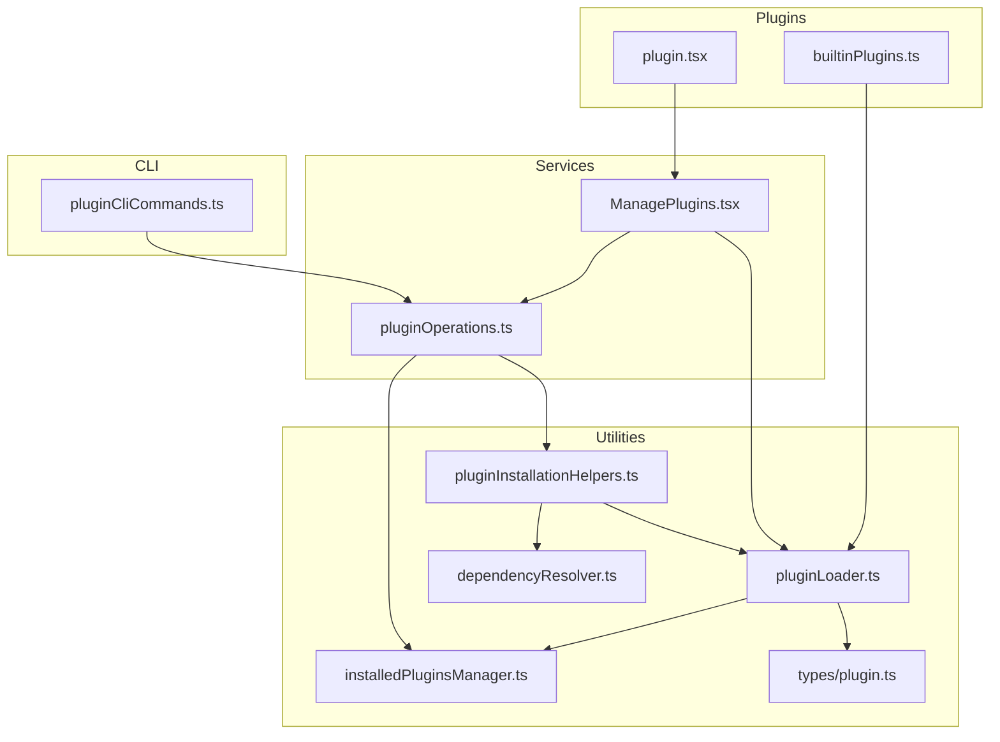
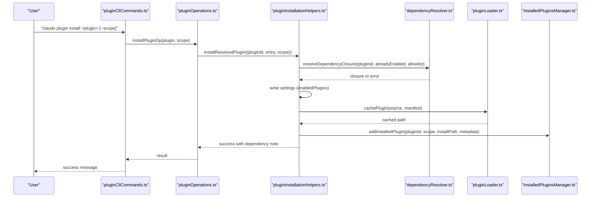
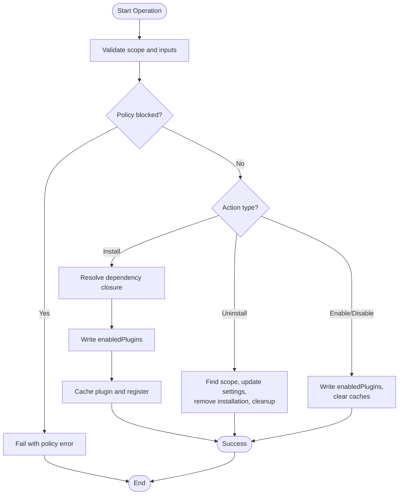
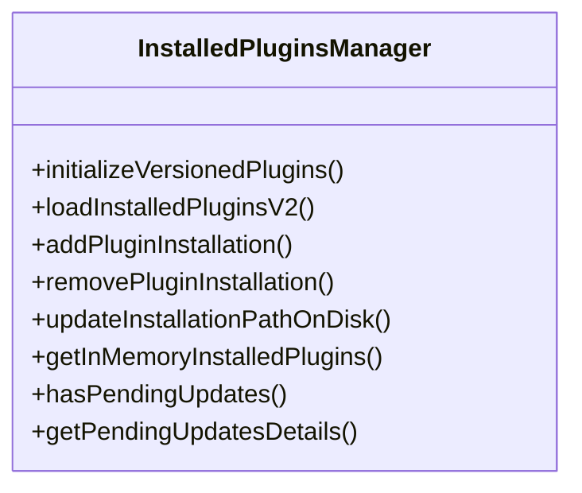
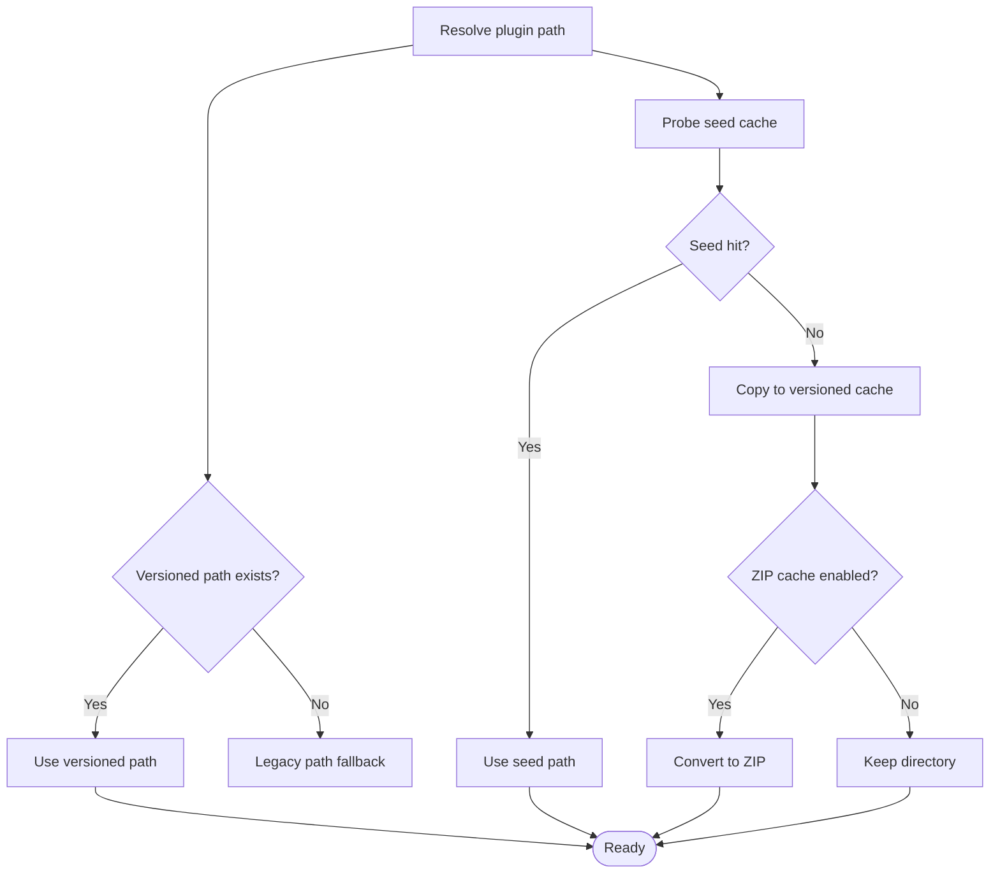
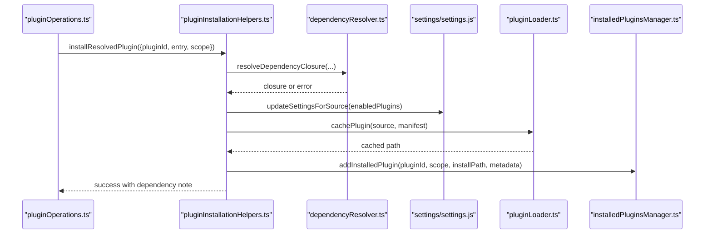
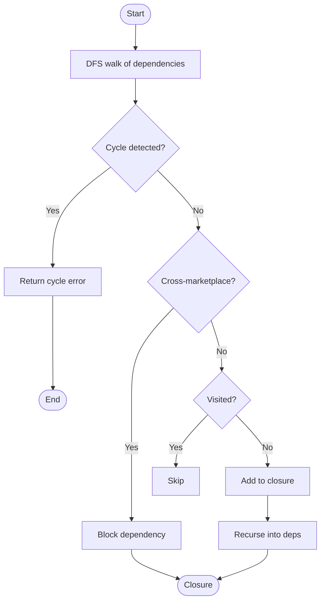
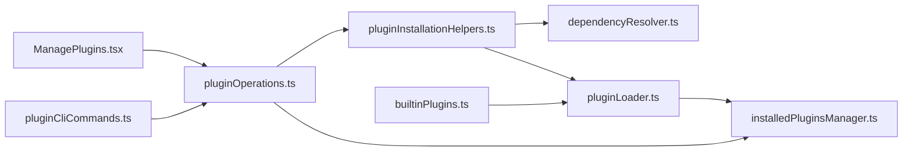

# Plugin Lifecycle Management

<cite>
**Referenced Files in This Document**
- [builtinPlugins.ts](file://src/plugins/builtinPlugins.ts)
- [pluginOperations.ts](file://src/services/plugins/pluginOperations.ts)
- [installedPluginsManager.ts](file://src/utils/plugins/installedPluginsManager.ts)
- [pluginLoader.ts](file://src/utils/plugins/pluginLoader.ts)
- [pluginInstallationHelpers.ts](file://src/utils/plugins/pluginInstallationHelpers.ts)
- [dependencyResolver.ts](file://src/utils/plugins/dependencyResolver.ts)
- [plugin.tsx](file://src/commands/plugin/plugin.tsx)
- [ManagePlugins.tsx](file://src/commands/plugin/ManagePlugins.tsx)
- [pluginCliCommands.ts](file://src/services/plugins/pluginCliCommands.ts)
- [plugin.ts](file://src/types/plugin.ts)
</cite>

## Table of Contents
1. [Introduction](#introduction)
2. [Project Structure](#project-structure)
3. [Core Components](#core-components)
4. [Architecture Overview](#architecture-overview)
5. [Detailed Component Analysis](#detailed-component-analysis)
6. [Dependency Analysis](#dependency-analysis)
7. [Performance Considerations](#performance-considerations)
8. [Troubleshooting Guide](#troubleshooting-guide)
9. [Conclusion](#conclusion)

## Introduction
This document explains the plugin lifecycle management system, covering installation, activation, deactivation, removal, loading, dependency resolution, conflict handling, state management, persistence, configuration synchronization, startup sequences, initialization hooks, shutdown procedures, versioning and upgrades, compatibility checks, and sandboxing/security boundaries. It synthesizes the implementation across the CLI, interactive UI, and core plugin utilities to provide a comprehensive, actionable guide for developers and operators.

## Project Structure
The plugin lifecycle spans several layers:
- CLI commands: user-facing operations (install, uninstall, enable, disable, update)
- Service layer: core operations and result formatting
- Utilities: plugin loader, installer helpers, dependency resolver, installed plugins manager
- UI: interactive plugin management interface
- Types: shared plugin types and error definitions

**Diagram sources**
- [pluginCliCommands.ts:1-345](file://src/services/plugins/pluginCliCommands.ts#L1-L345)
- [pluginOperations.ts:1-1089](file://src/services/plugins/pluginOperations.ts#L1-L1089)
- [pluginLoader.ts:1-3303](file://src/utils/plugins/pluginLoader.ts#L1-L3303)
- [pluginInstallationHelpers.ts:1-596](file://src/utils/plugins/pluginInstallationHelpers.ts#L1-L596)
- [dependencyResolver.ts:1-306](file://src/utils/plugins/dependencyResolver.ts#L1-L306)
- [installedPluginsManager.ts:1-1269](file://src/utils/plugins/installedPluginsManager.ts#L1-L1269)
- [builtinPlugins.ts:1-160](file://src/plugins/builtinPlugins.ts#L1-L160)
- [plugin.tsx:1-7](file://src/commands/plugin/plugin.tsx#L1-L7)
- [ManagePlugins.tsx:1-2215](file://src/commands/plugin/ManagePlugins.tsx#L1-L2215)
- [plugin.ts:1-364](file://src/types/plugin.ts#L1-L364)

**Section sources**
- [pluginCliCommands.ts:1-345](file://src/services/plugins/pluginCliCommands.ts#L1-L345)
- [pluginOperations.ts:1-1089](file://src/services/plugins/pluginOperations.ts#L1-L1089)
- [pluginLoader.ts:1-3303](file://src/utils/plugins/pluginLoader.ts#L1-L3303)
- [pluginInstallationHelpers.ts:1-596](file://src/utils/plugins/pluginInstallationHelpers.ts#L1-L596)
- [dependencyResolver.ts:1-306](file://src/utils/plugins/dependencyResolver.ts#L1-L306)
- [installedPluginsManager.ts:1-1269](file://src/utils/plugins/installedPluginsManager.ts#L1-L1269)
- [builtinPlugins.ts:1-160](file://src/plugins/builtinPlugins.ts#L1-L160)
- [plugin.tsx:1-7](file://src/commands/plugin/plugin.tsx#L1-L7)
- [ManagePlugins.tsx:1-2215](file://src/commands/plugin/ManagePlugins.tsx#L1-L2215)
- [plugin.ts:1-364](file://src/types/plugin.ts#L1-L364)

## Core Components
- Plugin operations service: install, uninstall, enable/disable, update, scope handling, policy checks, dependency warnings, and result formatting.
- Installed plugins manager: V2 single-file format, migration, in-memory session snapshot, pending updates detection, and cache management.
- Plugin loader: discovery, caching, versioned cache paths, seed cache probing, git/npm sources, component loading, and error collection.
- Installation helpers: dependency closure resolution, settings-first installation, policy guards, and analytics/logging.
- Dependency resolver: apt-style dependency semantics, cross-marketplace blocking, cycle detection, and load-time verification.
- Built-in plugins registry: built-in plugin registration, availability gating, and user-controlled enable/disable.
- CLI commands: thin wrappers around operations with console output, telemetry, and graceful shutdown.
- UI management: interactive plugin list, details, configuration, MCP server integration, and error presentation.

**Section sources**
- [pluginOperations.ts:1-1089](file://src/services/plugins/pluginOperations.ts#L1-L1089)
- [installedPluginsManager.ts:1-1269](file://src/utils/plugins/installedPluginsManager.ts#L1-L1269)
- [pluginLoader.ts:1-3303](file://src/utils/plugins/pluginLoader.ts#L1-L3303)
- [pluginInstallationHelpers.ts:1-596](file://src/utils/plugins/pluginInstallationHelpers.ts#L1-L596)
- [dependencyResolver.ts:1-306](file://src/utils/plugins/dependencyResolver.ts#L1-L306)
- [builtinPlugins.ts:1-160](file://src/plugins/builtinPlugins.ts#L1-L160)
- [pluginCliCommands.ts:1-345](file://src/services/plugins/pluginCliCommands.ts#L1-L345)
- [ManagePlugins.tsx:1-2215](file://src/commands/plugin/ManagePlugins.tsx#L1-L2215)

## Architecture Overview
The lifecycle follows a settings-first model: operations update user/project/local settings to declare intent, then materialize by caching and registering plugins. Dependencies are resolved before installation, and load-time verification demotes broken plugins. Persistence is centralized in a single installed_plugins.json (V2) with scope-aware entries and in-memory session snapshots.

**Diagram sources**
- [pluginCliCommands.ts:103-146](file://src/services/plugins/pluginCliCommands.ts#L103-L146)
- [pluginOperations.ts:321-418](file://src/services/plugins/pluginOperations.ts#L321-L418)
- [pluginInstallationHelpers.ts:348-481](file://src/utils/plugins/pluginInstallationHelpers.ts#L348-L481)
- [dependencyResolver.ts:95-159](file://src/utils/plugins/dependencyResolver.ts#L95-L159)
- [pluginLoader.ts:128-465](file://src/utils/plugins/pluginLoader.ts#L128-L465)
- [installedPluginsManager.ts:406-443](file://src/utils/plugins/installedPluginsManager.ts#L406-L443)

## Detailed Component Analysis

### Plugin Operations (install, uninstall, enable, disable, update)
- Install: resolves marketplace entry, validates policy, computes dependency closure, writes settings, caches, registers, clears caches, and formats success messages with dependency counts.
- Uninstall: finds plugin across scopes, updates settings, removes installation entry, marks orphaned cache, clears options/data if last scope, warns about reverse dependents.
- Enable/Disable: settings-first, supports auto-detection of scope, policy checks, cross-scope hints, and load-time demotion warnings.
- Update: integrates with background updater and telemetry; handled in CLI wrapper.

**Diagram sources**
- [pluginOperations.ts:321-558](file://src/services/plugins/pluginOperations.ts#L321-L558)
- [pluginInstallationHelpers.ts:348-481](file://src/utils/plugins/pluginInstallationHelpers.ts#L348-L481)
- [installedPluginsManager.ts:406-587](file://src/utils/plugins/installedPluginsManager.ts#L406-L587)

**Section sources**
- [pluginOperations.ts:321-800](file://src/services/plugins/pluginOperations.ts#L321-L800)
- [pluginCliCommands.ts:103-344](file://src/services/plugins/pluginCliCommands.ts#L103-L344)

### Installed Plugins Manager (Persistence and State)
- Single-file consolidation: migrates V1/V2 to a unified installed_plugins.json, cleans legacy cache directories.
- In-memory session snapshot: loaded at startup and used for the session lifetime; separate from disk updates.
- Pending updates: detects differences between in-memory and disk state to surface update readiness.
- Scoped installations: per-plugin arrays track user/project/local/managed scopes with project paths.

**Diagram sources**
- [installedPluginsManager.ts:714-734](file://src/utils/plugins/installedPluginsManager.ts#L714-L734)
- [installedPluginsManager.ts:315-364](file://src/utils/plugins/installedPluginsManager.ts#L315-L364)
- [installedPluginsManager.ts:406-475](file://src/utils/plugins/installedPluginsManager.ts#L406-L475)
- [installedPluginsManager.ts:537-587](file://src/utils/plugins/installedPluginsManager.ts#L537-L587)
- [installedPluginsManager.ts:595-696](file://src/utils/plugins/installedPluginsManager.ts#L595-L696)

**Section sources**
- [installedPluginsManager.ts:115-182](file://src/utils/plugins/installedPluginsManager.ts#L115-L182)
- [installedPluginsManager.ts:315-364](file://src/utils/plugins/installedPluginsManager.ts#L315-L364)
- [installedPluginsManager.ts:406-587](file://src/utils/plugins/installedPluginsManager.ts#L406-L587)
- [installedPluginsManager.ts:595-696](file://src/utils/plugins/installedPluginsManager.ts#L595-L696)

### Plugin Loader (Discovery, Caching, and Loading)
- Discovery sources: marketplace-based plugins and inline/session-only plugins.
- Caching: versioned cache under ~/.claude/plugins/cache/{marketplace}/{plugin}/{version}/; supports seed cache probing and ZIP cache mode.
- Git/npm sources: supports git clone, sparse-checkout for subdirectories, npm package caching, and .git removal post-copy.
- Component loading: commands, agents, skills, hooks, MCP/LSP servers; error collection and display.
- Path validation: sanitization and traversal protection.

**Diagram sources**
- [pluginLoader.ts:266-287](file://src/utils/plugins/pluginLoader.ts#L266-L287)
- [pluginLoader.ts:195-238](file://src/utils/plugins/pluginLoader.ts#L195-L238)
- [pluginLoader.ts:365-465](file://src/utils/plugins/pluginLoader.ts#L365-L465)
- [pluginLoader.ts:492-524](file://src/utils/plugins/pluginLoader.ts#L492-L524)
- [pluginLoader.ts:534-640](file://src/utils/plugins/pluginLoader.ts#L534-L640)

**Section sources**
- [pluginLoader.ts:126-188](file://src/utils/plugins/pluginLoader.ts#L126-L188)
- [pluginLoader.ts:195-238](file://src/utils/plugins/pluginLoader.ts#L195-L238)
- [pluginLoader.ts:365-465](file://src/utils/plugins/pluginLoader.ts#L365-L465)
- [pluginLoader.ts:492-640](file://src/utils/plugins/pluginLoader.ts#L492-L640)

### Installation Helpers (Dependency Resolution and Settings-First Install)
- Dependency closure: DFS walk with cycle detection, cross-marketplace blocking, and already-enabled skipping.
- Settings-first install: writes enabledPlugins atomically, then caches and registers; supports local-source validation and marketplace install location.
- Policy guards: root and transitive dependency policy checks.
- Telemetry and analytics: event logging with plugin metadata.

**Diagram sources**
- [pluginOperations.ts:321-418](file://src/services/plugins/pluginOperations.ts#L321-L418)
- [pluginInstallationHelpers.ts:348-481](file://src/utils/plugins/pluginInstallationHelpers.ts#L348-L481)
- [dependencyResolver.ts:95-159](file://src/utils/plugins/dependencyResolver.ts#L95-L159)
- [installedPluginsManager.ts:406-443](file://src/utils/plugins/installedPluginsManager.ts#L406-L443)

**Section sources**
- [pluginInstallationHelpers.ts:348-481](file://src/utils/plugins/pluginInstallationHelpers.ts#L348-L481)
- [dependencyResolver.ts:95-159](file://src/utils/plugins/dependencyResolver.ts#L95-L159)

### Dependency Resolution (APT-Style Semantics)
- Presence guarantees: enabling A requires B’s namespaced components to be available when A runs.
- Cross-marketplace dependencies are blocked by default; root marketplace can allowlist subsets.
- Load-time verification: fixed-point loop demotes plugins with unsatisfied dependencies and records errors.

**Diagram sources**
- [dependencyResolver.ts:95-159](file://src/utils/plugins/dependencyResolver.ts#L95-L159)
- [dependencyResolver.ts:177-234](file://src/utils/plugins/dependencyResolver.ts#L177-L234)

**Section sources**
- [dependencyResolver.ts:1-306](file://src/utils/plugins/dependencyResolver.ts#L1-306)

### Built-in Plugins Registry
- Built-in plugins ship with the CLI and appear in the plugin UI under a “Built-in” section.
- Users can enable/disable them; persisted to user settings.
- IDs use the format `{name}@builtin`; availability gating and default enabled state supported.

**Section sources**
- [builtinPlugins.ts:25-102](file://src/plugins/builtinPlugins.ts#L25-L102)

### CLI Commands and UI Integration
- CLI wrappers: install/uninstall/enable/disable/update with console output, telemetry, and graceful shutdown.
- Interactive UI: ManagePlugins.tsx lists plugins, shows details/components, handles configuration, MCP server integration, and error presentation.
- Settings-first UX: operations update settings first, then materialize; UI surfaces pending updates and warnings.

**Section sources**
- [pluginCliCommands.ts:103-344](file://src/services/plugins/pluginCliCommands.ts#L103-L344)
- [ManagePlugins.tsx:397-782](file://src/commands/plugin/ManagePlugins.tsx#L397-L782)
- [plugin.tsx:1-7](file://src/commands/plugin/plugin.tsx#L1-L7)

### Plugin Types and Errors
- LoadedPlugin: unified representation of a plugin with manifest, paths, components, and settings.
- PluginError: discriminated union of error types for robust error handling and user guidance.
- Error messages: helper to format user-friendly messages from typed errors.

**Section sources**
- [plugin.ts:48-290](file://src/types/plugin.ts#L48-L290)
- [plugin.ts:101-364](file://src/types/plugin.ts#L101-L364)

## Dependency Analysis
- Coupling: pluginOperations depends on installation helpers, dependency resolver, installed plugins manager, and plugin loader.
- Cohesion: each module encapsulates a distinct concern—operations, persistence, loading, and resolution.
- External dependencies: git, npm, filesystem APIs, marketplace and settings systems.
- Potential circular dependencies: none observed among the analyzed modules; loader and manager are foundational and referenced by others.

**Diagram sources**
- [pluginOperations.ts:1-1089](file://src/services/plugins/pluginOperations.ts#L1-L1089)
- [pluginInstallationHelpers.ts:1-596](file://src/utils/plugins/pluginInstallationHelpers.ts#L1-L596)
- [dependencyResolver.ts:1-306](file://src/utils/plugins/dependencyResolver.ts#L1-L306)
- [pluginLoader.ts:1-3303](file://src/utils/plugins/pluginLoader.ts#L1-L3303)
- [installedPluginsManager.ts:1-1269](file://src/utils/plugins/installedPluginsManager.ts#L1-L1269)
- [ManagePlugins.tsx:1-2215](file://src/commands/plugin/ManagePlugins.tsx#L1-L2215)
- [pluginCliCommands.ts:1-345](file://src/services/plugins/pluginCliCommands.ts#L1-L345)
- [builtinPlugins.ts:1-160](file://src/plugins/builtinPlugins.ts#L1-L160)

**Section sources**
- [pluginOperations.ts:1-1089](file://src/services/plugins/pluginOperations.ts#L1-L1089)
- [pluginInstallationHelpers.ts:1-596](file://src/utils/plugins/pluginInstallationHelpers.ts#L1-L596)
- [pluginLoader.ts:1-3303](file://src/utils/plugins/pluginLoader.ts#L1-L3303)
- [installedPluginsManager.ts:1-1269](file://src/utils/plugins/installedPluginsManager.ts#L1-L1269)
- [ManagePlugins.tsx:1-2215](file://src/commands/plugin/ManagePlugins.tsx#L1-L2215)
- [pluginCliCommands.ts:1-345](file://src/services/plugins/pluginCliCommands.ts#L1-L345)
- [builtinPlugins.ts:1-160](file://src/plugins/builtinPlugins.ts#L1-L160)

## Performance Considerations
- Versioned cache: reduces I/O by storing plugins under deterministic versioned paths; ZIP cache mode further optimizes storage and transfer.
- Seed cache: allows immediate reuse of pre-populated caches across environments.
- Memoization and caching: plugin loader and installed plugins manager use memoized caches to minimize filesystem reads.
- Partial clone and sparse-checkout: git-subdir sources minimize bandwidth and disk usage for large repositories.
- Batch settings writes: dependency closure is written in a single enabledPlugins update to avoid churn.

[No sources needed since this section provides general guidance]

## Troubleshooting Guide
Common scenarios and recovery strategies:
- Dependency cycle or cross-marketplace dependency: resolve by installing dependencies manually or adjusting marketplace allowlists; the resolver reports the chain and suggests fixes.
- Policy-blocked plugin: organization policy prevents installation/enabling; consult admin or use managed settings.
- Uninstall warnings about reverse dependents: disabling/removing a plugin may break others; the system warns with a list of affected plugins.
- Cache miss or corrupted cache: run plugin reload or clear caches; ensure versioned cache paths exist and are readable.
- Local plugin cannot be updated: local plugins are not remotely updatable; modify the source path or switch to a marketplace-hosted version.
- Load-time demotion: unsatisfied dependencies cause automatic demotion; enable the missing dependency or remove the dependent plugin.

**Section sources**
- [pluginInstallationHelpers.ts:304-327](file://src/utils/plugins/pluginInstallationHelpers.ts#L304-L327)
- [dependencyResolver.ts:177-234](file://src/utils/plugins/dependencyResolver.ts#L177-L234)
- [pluginOperations.ts:543-557](file://src/services/plugins/pluginOperations.ts#L543-L557)
- [installedPluginsManager.ts:595-696](file://src/utils/plugins/installedPluginsManager.ts#L595-L696)

## Conclusion
The plugin lifecycle system is designed around a settings-first, dependency-aware, and policy-enforced model. It provides robust installation, activation/deactivation, removal, and persistence with strong safeguards against conflicts and policy violations. The architecture cleanly separates concerns across CLI, services, utilities, and UI, enabling reliable upgrades, sandboxing via scoped installations, and clear error reporting.