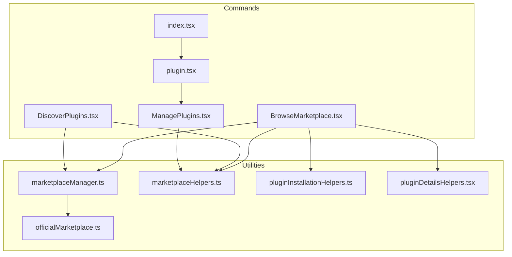
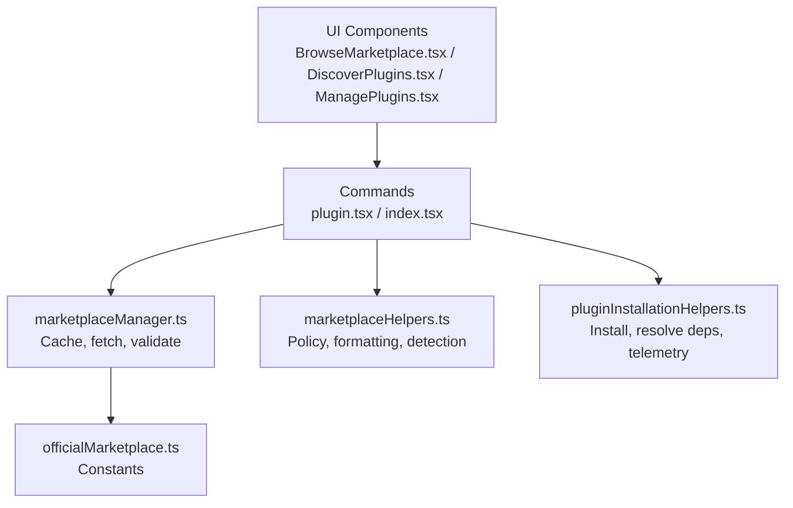
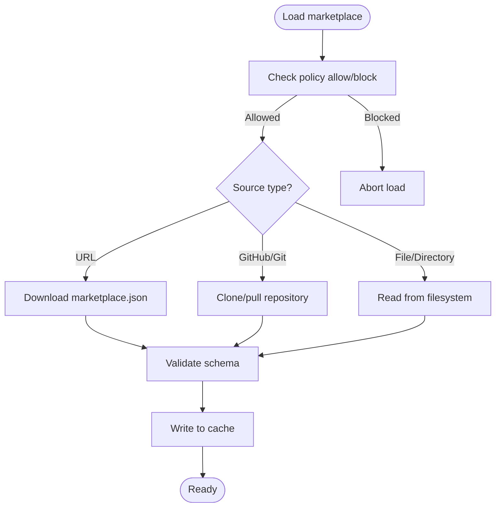
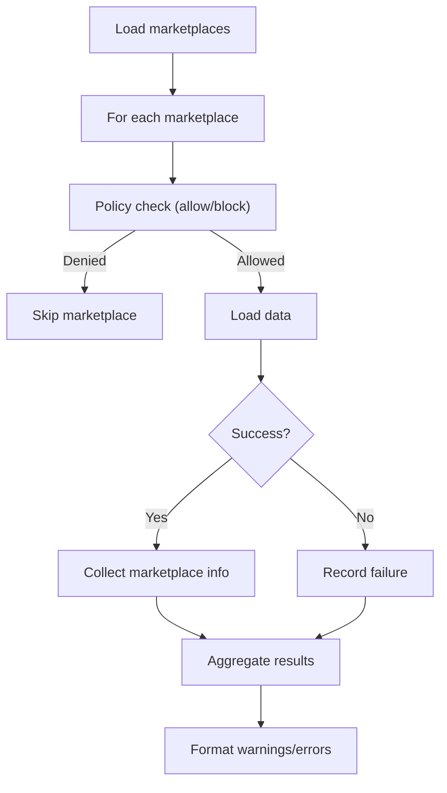
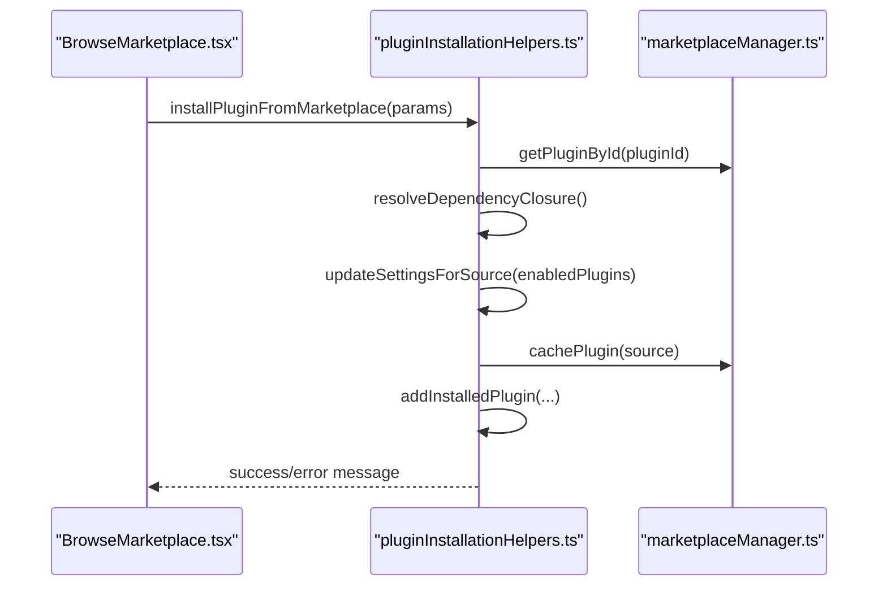
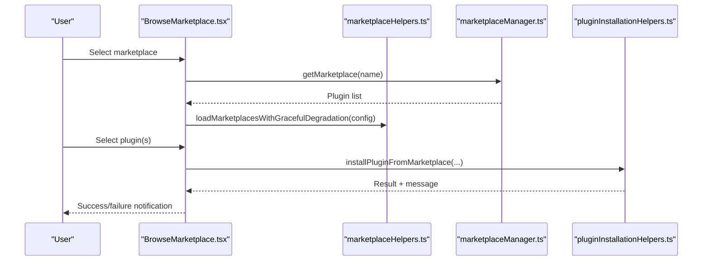
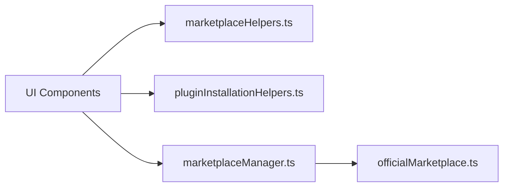

# Plugin Marketplace Integration

<cite>
**Referenced Files in This Document**
- [marketplaceManager.ts](file://src/utils/plugins/marketplaceManager.ts)
- [marketplaceHelpers.ts](file://src/utils/plugins/marketplaceHelpers.ts)
- [officialMarketplace.ts](file://src/utils/plugins/officialMarketplace.ts)
- [pluginInstallationHelpers.ts](file://src/utils/plugins/pluginInstallationHelpers.ts)
- [BrowseMarketplace.tsx](file://src/commands/plugin/BrowseMarketplace.tsx)
- [DiscoverPlugins.tsx](file://src/commands/plugin/DiscoverPlugins.tsx)
- [ManagePlugins.tsx](file://src/commands/plugin/ManagePlugins.tsx)
- [pluginDetailsHelpers.tsx](file://src/commands/plugin/pluginDetailsHelpers.tsx)
- [index.tsx](file://src/commands/plugin/index.tsx)
- [plugin.tsx](file://src/commands/plugin/plugin.tsx)
</cite>

## Table of Contents
1. [Introduction](#introduction)
2. [Project Structure](#project-structure)
3. [Core Components](#core-components)
4. [Architecture Overview](#architecture-overview)
5. [Detailed Component Analysis](#detailed-component-analysis)
6. [Dependency Analysis](#dependency-analysis)
7. [Performance Considerations](#performance-considerations)
8. [Troubleshooting Guide](#troubleshooting-guide)
9. [Conclusion](#conclusion)

## Introduction
This document explains how the plugin marketplace integration works in the IDE. It covers plugin discovery, installation, and management across multiple marketplace sources, including official and third-party catalogs. It documents the marketplace APIs and catalog systems, automated installation processes, policy enforcement, and UI flows for browsing, searching, and updating plugins. Practical examples demonstrate authentication, search, and update notifications. Community governance and safety measures are addressed through policy controls and moderation signals.

## Project Structure
The marketplace integration spans several modules:
- UI commands for browsing, discovering, and managing plugins
- Utilities for marketplace caching, policy enforcement, and installation
- Official marketplace constants and helper functions

**Diagram sources**
- [BrowseMarketplace.tsx:1-800](file://src/commands/plugin/BrowseMarketplace.tsx#L1-L800)
- [DiscoverPlugins.tsx:623-646](file://src/commands/plugin/DiscoverPlugins.tsx#L623-L646)
- [ManagePlugins.tsx:385-421](file://src/commands/plugin/ManagePlugins.tsx#L385-L421)
- [plugin.tsx:1-7](file://src/commands/plugin/plugin.tsx#L1-L7)
- [index.tsx:1-11](file://src/commands/plugin/index.tsx#L1-L11)
- [marketplaceManager.ts:1-2644](file://src/utils/plugins/marketplaceManager.ts#L1-L2644)
- [marketplaceHelpers.ts:1-593](file://src/utils/plugins/marketplaceHelpers.ts#L1-L593)
- [officialMarketplace.ts:1-26](file://src/utils/plugins/officialMarketplace.ts#L1-L26)
- [pluginInstallationHelpers.ts:1-596](file://src/utils/plugins/pluginInstallationHelpers.ts#L1-L596)
- [pluginDetailsHelpers.tsx:1-117](file://src/commands/plugin/pluginDetailsHelpers.tsx#L1-L117)

**Section sources**
- [index.tsx:1-11](file://src/commands/plugin/index.tsx#L1-L11)
- [plugin.tsx:1-7](file://src/commands/plugin/plugin.tsx#L1-L7)

## Core Components
- Marketplace Manager: Loads, caches, and refreshes marketplace catalogs from multiple sources (URL, GitHub, Git, file, directory). Handles authentication, sparse checkout, and error messaging.
- Marketplace Helpers: Formats errors, enforces policy (allow/block lists), detects empty states, and extracts source metadata.
- Official Marketplace: Defines constants for the official marketplace source and name.
- Plugin Installation Helpers: Centralizes installation logic, dependency resolution, caching, and telemetry.
- UI Components: Provide browsing, discovery, and management experiences with keyboard navigation, pagination, and scoped installation.

**Section sources**
- [marketplaceManager.ts:1-2644](file://src/utils/plugins/marketplaceManager.ts#L1-L2644)
- [marketplaceHelpers.ts:1-593](file://src/utils/plugins/marketplaceHelpers.ts#L1-L593)
- [officialMarketplace.ts:1-26](file://src/utils/plugins/officialMarketplace.ts#L1-L26)
- [pluginInstallationHelpers.ts:1-596](file://src/utils/plugins/pluginInstallationHelpers.ts#L1-L596)
- [BrowseMarketplace.tsx:1-800](file://src/commands/plugin/BrowseMarketplace.tsx#L1-L800)
- [DiscoverPlugins.tsx:623-646](file://src/commands/plugin/DiscoverPlugins.tsx#L623-L646)
- [ManagePlugins.tsx:385-421](file://src/commands/plugin/ManagePlugins.tsx#L385-L421)

## Architecture Overview
The marketplace system follows a layered architecture:
- UI Layer: Interactive components for browsing, filtering, and installing plugins
- Control Layer: Commands orchestrate UI state and delegate to utilities
- Utility Layer: Marketplace manager and helpers handle caching, validation, and policy
- Persistence Layer: Known marketplaces configuration and installed plugins registry

**Diagram sources**
- [BrowseMarketplace.tsx:1-800](file://src/commands/plugin/BrowseMarketplace.tsx#L1-L800)
- [DiscoverPlugins.tsx:623-646](file://src/commands/plugin/DiscoverPlugins.tsx#L623-L646)
- [ManagePlugins.tsx:385-421](file://src/commands/plugin/ManagePlugins.tsx#L385-L421)
- [plugin.tsx:1-7](file://src/commands/plugin/plugin.tsx#L1-L7)
- [index.tsx:1-11](file://src/commands/plugin/index.tsx#L1-L11)
- [marketplaceManager.ts:1-2644](file://src/utils/plugins/marketplaceManager.ts#L1-L2644)
- [marketplaceHelpers.ts:1-593](file://src/utils/plugins/marketplaceHelpers.ts#L1-L593)
- [pluginInstallationHelpers.ts:1-596](file://src/utils/plugins/pluginInstallationHelpers.ts#L1-L596)
- [officialMarketplace.ts:1-26](file://src/utils/plugins/officialMarketplace.ts#L1-L26)

## Detailed Component Analysis

### Marketplace Manager
Responsibilities:
- Load known marketplaces from configuration
- Cache marketplaces from URL, GitHub, Git, file, or directory sources
- Handle authentication and sparse checkout
- Provide progress callbacks and robust error handling
- Enforce policy constraints before downloading

Key capabilities:
- Git operations with timeouts, credential handling, and enhanced error messages
- URL downloads with schema validation and telemetry
- Sparse checkout reconciliation and fallback re-clone logic
- Redaction of credentials in logs and progress messages

**Diagram sources**
- [marketplaceManager.ts:1084-1599](file://src/utils/plugins/marketplaceManager.ts#L1084-L1599)
- [marketplaceManager.ts:1256-1350](file://src/utils/plugins/marketplaceManager.ts#L1256-L1350)
- [marketplaceManager.ts:803-985](file://src/utils/plugins/marketplaceManager.ts#L803-L985)

**Section sources**
- [marketplaceManager.ts:1-2644](file://src/utils/plugins/marketplaceManager.ts#L1-L2644)

### Marketplace Helpers
Responsibilities:
- Format user-facing error messages for marketplace loading failures
- Enforce enterprise policy via allowlists and blocklists
- Detect reasons for empty marketplace states
- Extract hosts and patterns for policy matching

**Diagram sources**
- [marketplaceHelpers.ts:71-141](file://src/utils/plugins/marketplaceHelpers.ts#L71-L141)

**Section sources**
- [marketplaceHelpers.ts:1-593](file://src/utils/plugins/marketplaceHelpers.ts#L1-L593)

### Official Marketplace
Defines the official marketplace source and name used for auto-installation and identification.

**Section sources**
- [officialMarketplace.ts:1-26](file://src/utils/plugins/officialMarketplace.ts#L1-L26)

### Plugin Installation Helpers
Responsibilities:
- Resolve dependency closures and enforce policy
- Cache plugins and register installations
- Handle scoped installs (user, project, local)
- Emit telemetry and format user-facing messages

**Diagram sources**
- [pluginInstallationHelpers.ts:506-596](file://src/utils/plugins/pluginInstallationHelpers.ts#L506-L596)
- [pluginInstallationHelpers.ts:348-481](file://src/utils/plugins/pluginInstallationHelpers.ts#L348-L481)
- [marketplaceManager.ts:1433-1599](file://src/utils/plugins/marketplaceManager.ts#L1433-L1599)

**Section sources**
- [pluginInstallationHelpers.ts:1-596](file://src/utils/plugins/pluginInstallationHelpers.ts#L1-L596)

### UI Components: Browse, Discover, Manage
- BrowseMarketplace: Multi-view UI for selecting marketplaces, listing plugins, viewing details, and installing with scoped options
- DiscoverPlugins: Similar discovery flow with sorting and pagination
- ManagePlugins: Filtering and management of installed plugins, including policy filtering

**Diagram sources**
- [BrowseMarketplace.tsx:124-368](file://src/commands/plugin/BrowseMarketplace.tsx#L124-L368)
- [marketplaceHelpers.ts:71-114](file://src/utils/plugins/marketplaceHelpers.ts#L71-L114)
- [marketplaceManager.ts:1433-1599](file://src/utils/plugins/marketplaceManager.ts#L1433-L1599)
- [pluginInstallationHelpers.ts:506-596](file://src/utils/plugins/pluginInstallationHelpers.ts#L506-L596)

**Section sources**
- [BrowseMarketplace.tsx:1-800](file://src/commands/plugin/BrowseMarketplace.tsx#L1-L800)
- [DiscoverPlugins.tsx:623-646](file://src/commands/plugin/DiscoverPlugins.tsx#L623-L646)
- [ManagePlugins.tsx:385-421](file://src/commands/plugin/ManagePlugins.tsx#L385-L421)
- [pluginDetailsHelpers.tsx:1-117](file://src/commands/plugin/pluginDetailsHelpers.tsx#L1-L117)

## Dependency Analysis
- UI depends on helpers for policy and formatting, on manager for marketplace data, and on installer for actions
- Manager encapsulates IO and policy concerns, exposing a stable interface to UI and helpers
- Installer coordinates settings updates, caching, and telemetry
- Official marketplace constants guide auto-installation and identification

**Diagram sources**
- [BrowseMarketplace.tsx:1-800](file://src/commands/plugin/BrowseMarketplace.tsx#L1-L800)
- [marketplaceHelpers.ts:1-593](file://src/utils/plugins/marketplaceHelpers.ts#L1-L593)
- [marketplaceManager.ts:1-2644](file://src/utils/plugins/marketplaceManager.ts#L1-L2644)
- [pluginInstallationHelpers.ts:1-596](file://src/utils/plugins/pluginInstallationHelpers.ts#L1-L596)
- [officialMarketplace.ts:1-26](file://src/utils/plugins/officialMarketplace.ts#L1-L26)

**Section sources**
- [marketplaceManager.ts:1-2644](file://src/utils/plugins/marketplaceManager.ts#L1-L2644)
- [marketplaceHelpers.ts:1-593](file://src/utils/plugins/marketplaceHelpers.ts#L1-L593)
- [pluginInstallationHelpers.ts:1-596](file://src/utils/plugins/pluginInstallationHelpers.ts#L1-L596)

## Performance Considerations
- Git operations use timeouts and sparse checkout to minimize bandwidth and time for large repositories
- Caching reduces repeated downloads and clones; cache paths are versioned to avoid conflicts
- Pagination and continuous scrolling optimize rendering for large plugin lists
- Schema validation and telemetry provide observability without impacting UX

[No sources needed since this section provides general guidance]

## Troubleshooting Guide
Common issues and remedies:
- Authentication failures (SSH or HTTPS): The manager enhances error messages and suggests corrective actions (e.g., configuring SSH keys or using HTTPS)
- Network timeouts or host resolution failures: Increase timeout via environment variable or check connectivity
- Host key verification failures: Provide instructions to remove stale entries or connect once to accept new keys
- Policy restrictions: Allow/block lists can prevent loading certain sources; adjust policy settings accordingly
- Sparse checkout transitions: The system reconciles sparse vs full checkout states and falls back to re-clone when necessary

**Section sources**
- [marketplaceManager.ts:917-984](file://src/utils/plugins/marketplaceManager.ts#L917-L984)
- [marketplaceManager.ts:649-709](file://src/utils/plugins/marketplaceManager.ts#L649-L709)
- [marketplaceHelpers.ts:550-593](file://src/utils/plugins/marketplaceHelpers.ts#L550-L593)

## Conclusion
The marketplace integration provides a robust, policy-aware system for discovering, installing, and managing plugins from multiple sources. It balances automation with safety through policy enforcement, credential redaction, and enhanced error messaging. The UI enables efficient browsing, searching, and updating, while the underlying utilities ensure reliable caching, dependency resolution, and telemetry.