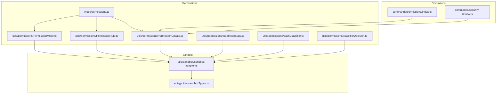
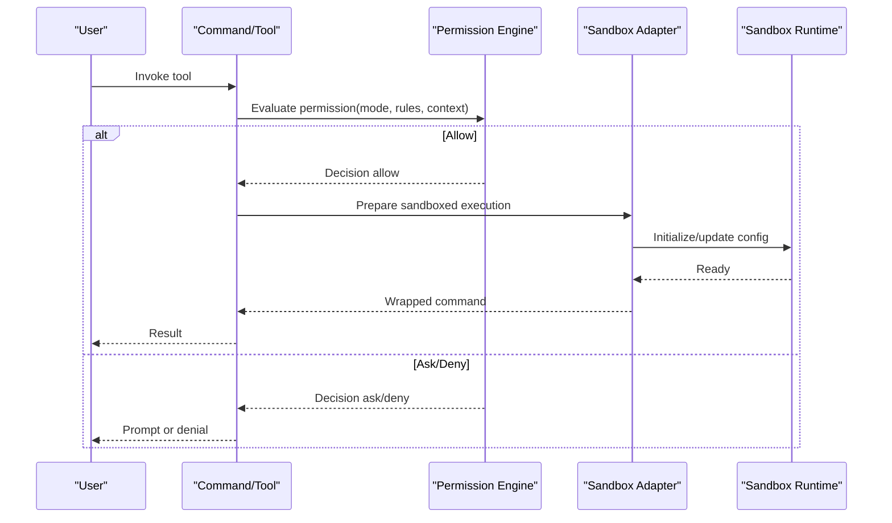
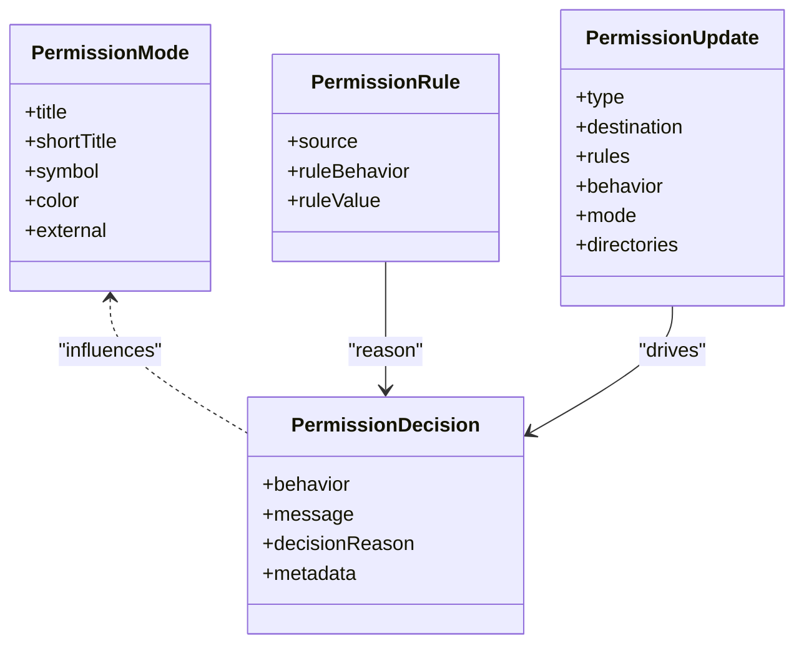
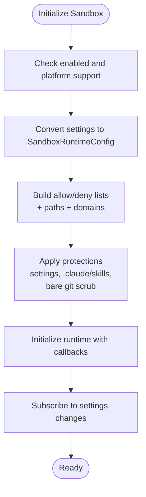
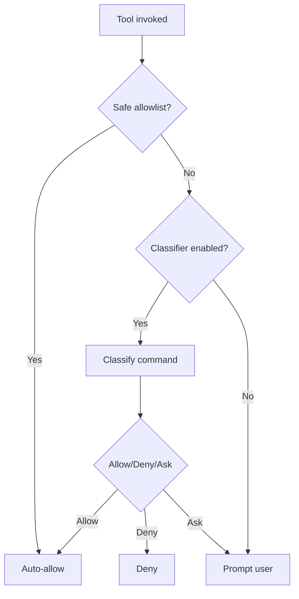
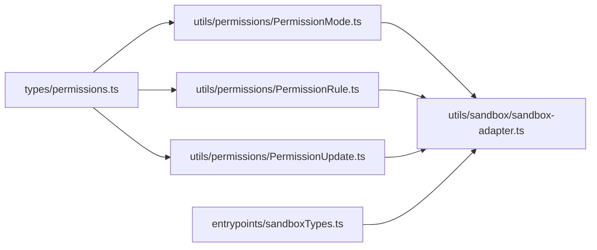

# Plugin Security and Sandboxing

<cite>
**Referenced Files in This Document**
- [permissions.ts](file://src/types/permissions.ts)
- [PermissionMode.ts](file://src/utils/permissions/PermissionMode.ts)
- [PermissionRule.ts](file://src/utils/permissions/PermissionRule.ts)
- [PermissionResult.ts](file://src/utils/permissions/PermissionResult.ts)
- [PermissionUpdate.ts](file://src/utils/permissions/PermissionUpdate.ts)
- [autoModeState.ts](file://src/utils/permissions/autoModeState.ts)
- [bashClassifier.ts](file://src/utils/permissions/bashClassifier.ts)
- [classifierDecision.ts](file://src/utils/permissions/classifierDecision.ts)
- [sandbox-adapter.ts](file://src/utils/sandbox/sandbox-adapter.ts)
- [sandboxTypes.ts](file://src/entrypoints/sandboxTypes.ts)
- [security-review.ts](file://src/commands/security-review.ts)
- [index.ts](file://src/commands/permissions/index.ts)
</cite>

## Table of Contents
1. [Introduction](#introduction)
2. [Project Structure](#project-structure)
3. [Core Components](#core-components)
4. [Architecture Overview](#architecture-overview)
5. [Detailed Component Analysis](#detailed-component-analysis)
6. [Dependency Analysis](#dependency-analysis)
7. [Performance Considerations](#performance-considerations)
8. [Troubleshooting Guide](#troubleshooting-guide)
9. [Conclusion](#conclusion)
10. [Appendices](#appendices)

## Introduction
This document explains the plugin security model and sandboxing mechanisms in the codebase. It covers permission systems, capability-based access control, security boundary enforcement, sandbox implementation, resource limitations, isolation strategies, code signing and integrity verification, trust establishment, security policies, threat modeling, vulnerability mitigation, audit trails, monitoring, and incident response. It also highlights the balance between enabling powerful plugin functionality while maintaining strong security constraints.

## Project Structure
The security and sandboxing features are implemented across several modules:
- Permission types and decision-making logic
- Permission modes and rule persistence
- Sandbox adapter integrating with the external sandbox runtime
- Sandbox configuration schemas and settings
- Security review command leveraging permission contexts
- Commands for managing permissions

**Diagram sources**
- [permissions.ts:1-442](file://src/types/permissions.ts#L1-L442)
- [PermissionMode.ts:1-142](file://src/utils/permissions/PermissionMode.ts#L1-L142)
- [PermissionRule.ts:1-41](file://src/utils/permissions/PermissionRule.ts#L1-L41)
- [PermissionUpdate.ts:1-390](file://src/utils/permissions/PermissionUpdate.ts#L1-L390)
- [autoModeState.ts:1-40](file://src/utils/permissions/autoModeState.ts#L1-L40)
- [bashClassifier.ts:1-62](file://src/utils/permissions/bashClassifier.ts#L1-L62)
- [classifierDecision.ts:1-99](file://src/utils/permissions/classifierDecision.ts#L1-L99)
- [sandbox-adapter.ts:1-986](file://src/utils/sandbox/sandbox-adapter.ts#L1-L986)
- [sandboxTypes.ts:1-157](file://src/entrypoints/sandboxTypes.ts#L1-L157)
- [index.ts:1-12](file://src/commands/permissions/index.ts#L1-L12)
- [security-review.ts:1-244](file://src/commands/security-review.ts#L1-L244)

**Section sources**
- [permissions.ts:1-442](file://src/types/permissions.ts#L1-L442)
- [sandbox-adapter.ts:1-986](file://src/utils/sandbox/sandbox-adapter.ts#L1-L986)
- [sandboxTypes.ts:1-157](file://src/entrypoints/sandboxTypes.ts#L1-L157)
- [index.ts:1-12](file://src/commands/permissions/index.ts#L1-L12)
- [security-review.ts:1-244](file://src/commands/security-review.ts#L1-L244)

## Core Components
- Permission types and decision model define modes, rules, and outcomes for tool use.
- Permission mode management controls user-facing behavior (default, plan, accept edits, bypass, dont ask, auto).
- Permission rule persistence and updates manage allow/deny/ask rules and additional working directories.
- Sandbox adapter integrates with the external sandbox runtime, converting settings into sandbox configuration, enforcing filesystem and network restrictions, and handling initialization and updates.
- Sandbox configuration schemas define network and filesystem policies, violation handling, and optional relaxations with security trade-offs.
- Security review command demonstrates how permission contexts are applied to constrain tool usage during specialized operations.

**Section sources**
- [permissions.ts:15-442](file://src/types/permissions.ts#L15-L442)
- [PermissionMode.ts:1-142](file://src/utils/permissions/PermissionMode.ts#L1-L142)
- [PermissionUpdate.ts:1-390](file://src/utils/permissions/PermissionUpdate.ts#L1-L390)
- [sandbox-adapter.ts:1-986](file://src/utils/sandbox/sandbox-adapter.ts#L1-L986)
- [sandboxTypes.ts:1-157](file://src/entrypoints/sandboxTypes.ts#L1-L157)
- [security-review.ts:1-244](file://src/commands/security-review.ts#L1-L244)

## Architecture Overview
The system enforces capability-based access control by combining:
- Permission modes and rule sets to determine whether a tool invocation should be allowed, asked, or denied.
- Optional classifier-based auto mode to reduce friction for low-risk operations.
- A sandbox adapter that translates permission and policy settings into runtime restrictions enforced by an external sandbox runtime.

**Diagram sources**
- [permissions.ts:152-325](file://src/types/permissions.ts#L152-L325)
- [PermissionMode.ts:1-142](file://src/utils/permissions/PermissionMode.ts#L1-L142)
- [sandbox-adapter.ts:704-792](file://src/utils/sandbox/sandbox-adapter.ts#L704-L792)

## Detailed Component Analysis

### Permission System and Capability-Based Access Control
- Permission modes:
  - Modes include default, plan, accept edits, bypass permissions, dont ask, and auto (ANT-only).
  - External modes exclude auto/bubble for external users.
- Permission rules:
  - Rules specify toolName and optional ruleContent; behaviors are allow, deny, or ask.
  - Rules are grouped by source (user, project, local, flag, policy) and mode.
- Permission decisions:
  - Outcomes include allow, ask, deny, and passthrough; each decision carries a reason and optional metadata.
  - Classifier-based decisions can auto-approve or auto-deny based on contextual analysis.
- Permission updates:
  - Operations include adding/removing rules, replacing rules, setting mode, and managing additional working directories.
  - Persistence targets editable setting sources (user, project, local).

**Diagram sources**
- [permissions.ts:16-138](file://src/types/permissions.ts#L16-L138)
- [PermissionMode.ts:42-91](file://src/utils/permissions/PermissionMode.ts#L42-L91)
- [PermissionRule.ts:19-41](file://src/utils/permissions/PermissionRule.ts#L19-L41)
- [PermissionResult.ts:23-35](file://src/utils/permissions/PermissionResult.ts#L23-L35)
- [PermissionUpdate.ts:97-188](file://src/utils/permissions/PermissionUpdate.ts#L97-L188)

**Section sources**
- [permissions.ts:15-442](file://src/types/permissions.ts#L15-L442)
- [PermissionMode.ts:1-142](file://src/utils/permissions/PermissionMode.ts#L1-L142)
- [PermissionRule.ts:1-41](file://src/utils/permissions/PermissionRule.ts#L1-L41)
- [PermissionResult.ts:1-36](file://src/utils/permissions/PermissionResult.ts#L1-L36)
- [PermissionUpdate.ts:1-390](file://src/utils/permissions/PermissionUpdate.ts#L1-L390)

### Sandbox Implementation and Security Boundaries
- Sandbox adapter:
  - Converts merged settings into SandboxRuntimeConfig, including network domains, filesystem allow/deny lists, and ripgrep configuration.
  - Enforces protections such as blocking writes to settings files and .claude/skills, scrubbing bare git repo artifacts, and resolving CC-specific path patterns.
  - Initializes and updates sandbox configuration, subscribes to settings changes, and wraps commands with sandbox when enabled.
- Sandbox configuration schemas:
  - Network: allowed domains, managed-only mode, unix sockets, local binding, proxies.
  - Filesystem: allow/deny read/write, managed-read-only mode, allow/deny lists.
  - Operational toggles: ignore violations, nested sandbox weakening, network isolation weakening, excluded commands, ripgrep override.

**Diagram sources**
- [sandbox-adapter.ts:172-381](file://src/utils/sandbox/sandbox-adapter.ts#L172-L381)
- [sandbox-adapter.ts:730-792](file://src/utils/sandbox/sandbox-adapter.ts#L730-L792)
- [sandboxTypes.ts:14-144](file://src/entrypoints/sandboxTypes.ts#L14-L144)

**Section sources**
- [sandbox-adapter.ts:1-986](file://src/utils/sandbox/sandbox-adapter.ts#L1-L986)
- [sandboxTypes.ts:1-157](file://src/entrypoints/sandboxTypes.ts#L1-L157)

### Auto Mode Classifier and Risk-Based Approvals
- Auto mode allowlist defines tools considered safe enough to auto-approve without user prompts.
- Classifier utilities provide stubs for external builds; in ANT builds, classifier-based decisions can auto-approve/deny based on prompt analysis.
- Auto mode state tracks activation and circuit-breaking to prevent re-entry after policy-driven kick-out.

**Diagram sources**
- [classifierDecision.ts:56-94](file://src/utils/permissions/classifierDecision.ts#L56-L94)
- [bashClassifier.ts:24-53](file://src/utils/permissions/bashClassifier.ts#L24-L53)
- [autoModeState.ts:1-40](file://src/utils/permissions/autoModeState.ts#L1-L40)

**Section sources**
- [classifierDecision.ts:1-99](file://src/utils/permissions/classifierDecision.ts#L1-L99)
- [bashClassifier.ts:1-62](file://src/utils/permissions/bashClassifier.ts#L1-L62)
- [autoModeState.ts:1-40](file://src/utils/permissions/autoModeState.ts#L1-L40)

### Permission Management Command
- The permissions command exposes a UI to manage allow/deny rules and additional working directories, backed by the permission update utilities.

**Section sources**
- [index.ts:1-12](file://src/commands/permissions/index.ts#L1-L12)
- [PermissionUpdate.ts:1-390](file://src/utils/permissions/PermissionUpdate.ts#L1-L390)

### Security Review Command and Policy Application
- The security-review command constructs a constrained prompt with allowed tools configured via permission context, demonstrating how permission rules can be applied to specialized workflows.

**Section sources**
- [security-review.ts:1-244](file://src/commands/security-review.ts#L1-L244)

## Dependency Analysis
- Permission engine depends on:
  - Permission types for decision structures
  - Permission mode utilities for mode resolution and presentation
  - Rule and update utilities for persistence and context mutation
  - Optional classifier utilities for auto mode
- Sandbox adapter depends on:
  - Permission engine for rule-derived filesystem/network constraints
  - Sandbox configuration schemas for validation and defaults
  - Settings subsystem for dynamic updates and policy enforcement

**Diagram sources**
- [permissions.ts:1-442](file://src/types/permissions.ts#L1-L442)
- [PermissionMode.ts:1-142](file://src/utils/permissions/PermissionMode.ts#L1-L142)
- [PermissionRule.ts:1-41](file://src/utils/permissions/PermissionRule.ts#L1-L41)
- [PermissionUpdate.ts:1-390](file://src/utils/permissions/PermissionUpdate.ts#L1-L390)
- [sandbox-adapter.ts:1-986](file://src/utils/sandbox/sandbox-adapter.ts#L1-L986)
- [sandboxTypes.ts:1-157](file://src/entrypoints/sandboxTypes.ts#L1-L157)

**Section sources**
- [permissions.ts:1-442](file://src/types/permissions.ts#L1-L442)
- [sandbox-adapter.ts:1-986](file://src/utils/sandbox/sandbox-adapter.ts#L1-L986)
- [sandboxTypes.ts:1-157](file://src/entrypoints/sandboxTypes.ts#L1-L157)

## Performance Considerations
- Permission evaluation:
  - Mode and rule lookups are O(1) per source; rule normalization avoids redundant comparisons.
  - Classifier-based decisions can reduce prompt latency for low-risk operations when enabled.
- Sandbox:
  - Initialization and settings subscription introduce minimal overhead; memoized dependency checks reduce repeated computation.
  - Linux/WSL environments may warn about glob patterns unsupported by the underlying sandbox runtime.

[No sources needed since this section provides general guidance]

## Troubleshooting Guide
- Sandbox unavailable:
  - If sandbox.enabled is explicitly set but platform is unsupported or dependencies are missing, a reason is surfaced at startup.
  - Check platform support and installed tools; adjust enabledPlatforms or install required dependencies.
- Permission prompts:
  - Use the permissions command to add/remove rules or adjust mode.
  - For additional working directories, persist via permission updates to ensure tools can access required paths.
- Classifier auto mode:
  - Verify auto mode is enabled and not circuit-broken; confirm classifier availability in the build.

**Section sources**
- [sandbox-adapter.ts:562-592](file://src/utils/sandbox/sandbox-adapter.ts#L562-L592)
- [sandbox-adapter.ts:505-526](file://src/utils/sandbox/sandbox-adapter.ts#L505-L526)
- [PermissionUpdate.ts:222-353](file://src/utils/permissions/PermissionUpdate.ts#L222-L353)
- [autoModeState.ts:27-33](file://src/utils/permissions/autoModeState.ts#L27-L33)

## Conclusion
The system combines a robust permission framework with a configurable sandbox to enforce capability-based access control. Permission modes, rules, and classifier-based auto approvals balance usability and security. The sandbox adapter translates policy into runtime restrictions, with careful protections against settings tampering and artifact planting. Together, these mechanisms establish strong security boundaries while preserving essential plugin functionality.

[No sources needed since this section summarizes without analyzing specific files]

## Appendices

### Security Policies and Threat Modeling
- Policies:
  - Network: allow/deny domains, managed-only mode, proxy ports, unix sockets.
  - Filesystem: allow/deny read/write, managed-read-only mode, exclusion of sensitive directories.
  - Operational: ignore violations mapping, nested sandbox weakening, network isolation weakening, excluded commands, ripgrep override.
- Threats mitigated:
  - Unauthorized file writes to settings and skill directories.
  - Bare git repository escape vectors.
  - Unintentional exposure of sensitive configuration.
  - Classifier misuse in external builds (disabled).
- Mitigations:
  - Strict deny-write lists for settings and .claude/skills.
  - Pre/post-command scrubbing of bare git artifacts.
  - Classifier gating for auto mode in supported builds.
  - Managed settings enforcement for domains and read paths.

**Section sources**
- [sandbox-adapter.ts:222-281](file://src/utils/sandbox/sandbox-adapter.ts#L222-L281)
- [sandbox-adapter.ts:404-414](file://src/utils/sandbox/sandbox-adapter.ts#L404-L414)
- [sandboxTypes.ts:14-144](file://src/entrypoints/sandboxTypes.ts#L14-L144)
- [bashClassifier.ts:24-26](file://src/utils/permissions/bashClassifier.ts#L24-L26)

### Audit Trails, Monitoring, and Incident Response
- Audit and monitoring:
  - Sandbox violation events and ask callbacks can be logged and monitored.
  - Settings change detector triggers sandbox config refresh, ensuring policies stay current.
- Incident response:
  - Investigate sandbox violation events and blocked network requests.
  - Review permission decisions and rule changes; adjust rules or modes accordingly.
  - For auto mode incidents, disable or tighten classifier thresholds and re-evaluate allowlist.

**Section sources**
- [sandbox-adapter.ts:744-755](file://src/utils/sandbox/sandbox-adapter.ts#L744-L755)
- [sandbox-adapter.ts:776-781](file://src/utils/sandbox/sandbox-adapter.ts#L776-L781)