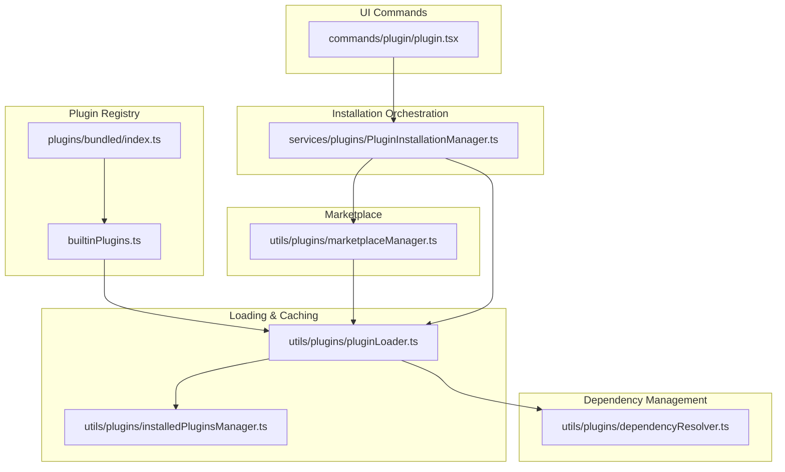
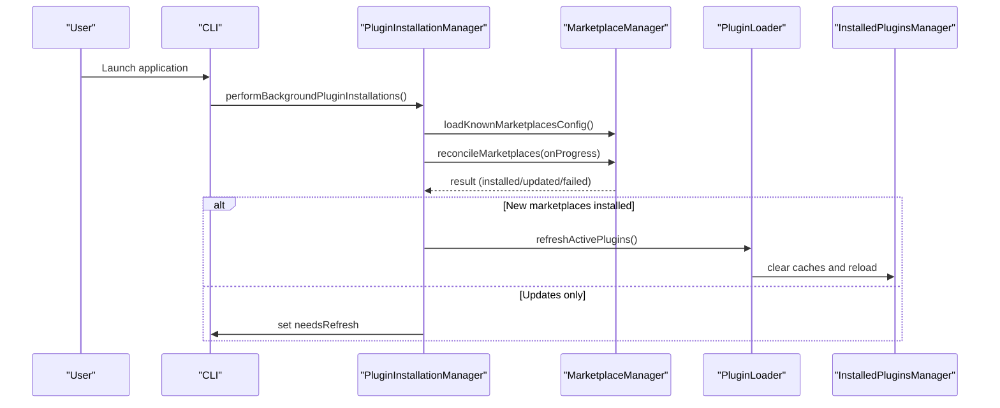
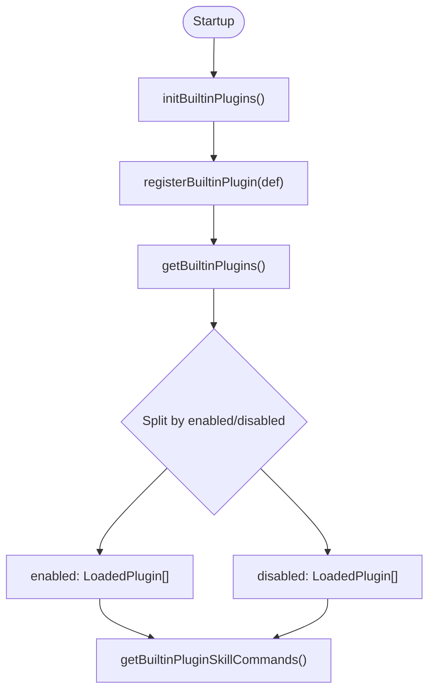
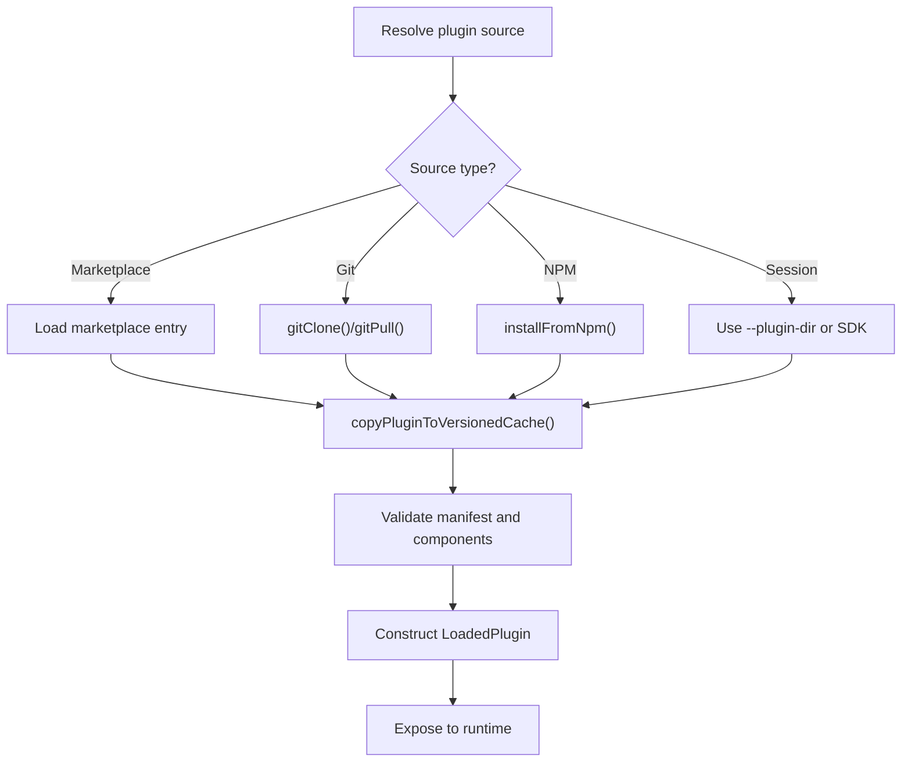
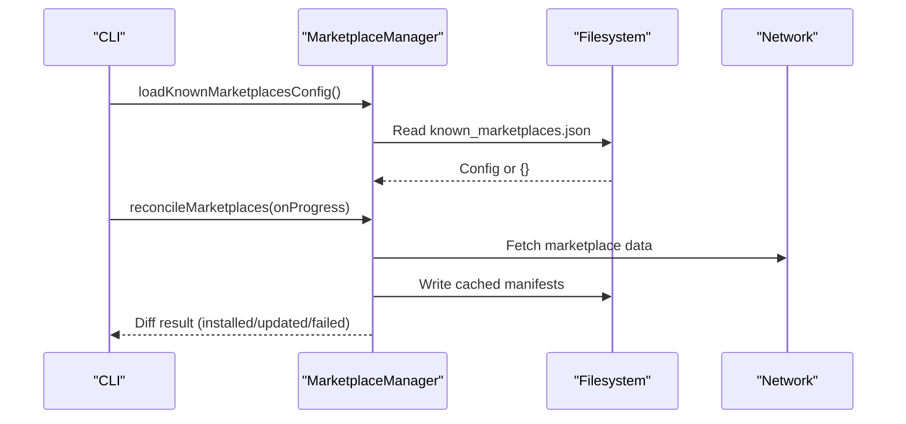
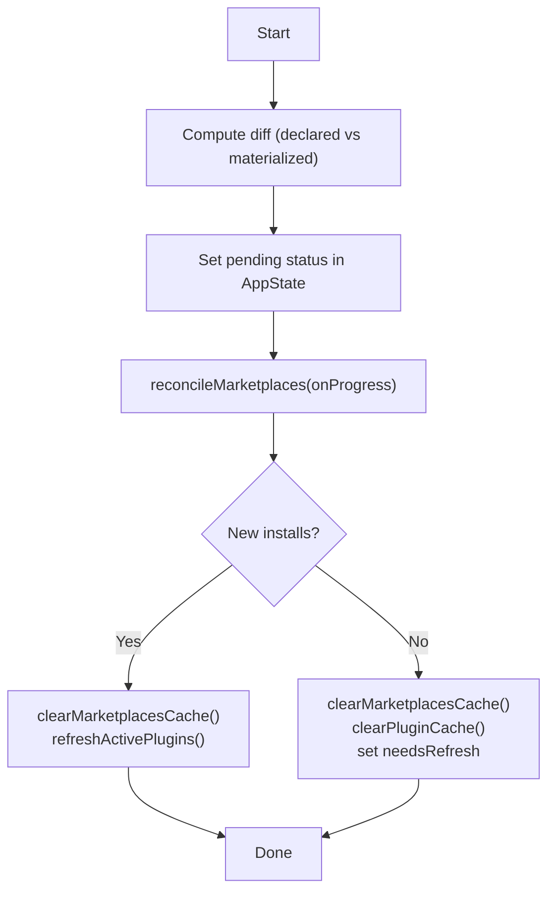
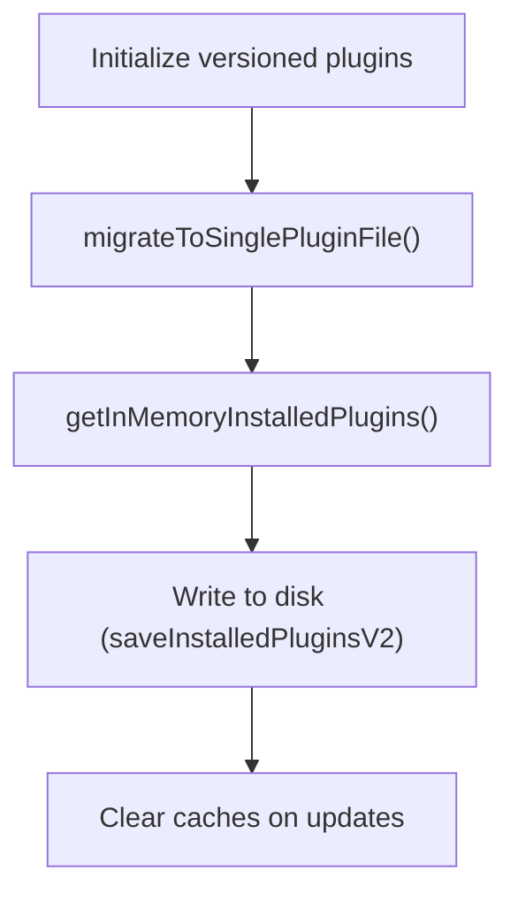
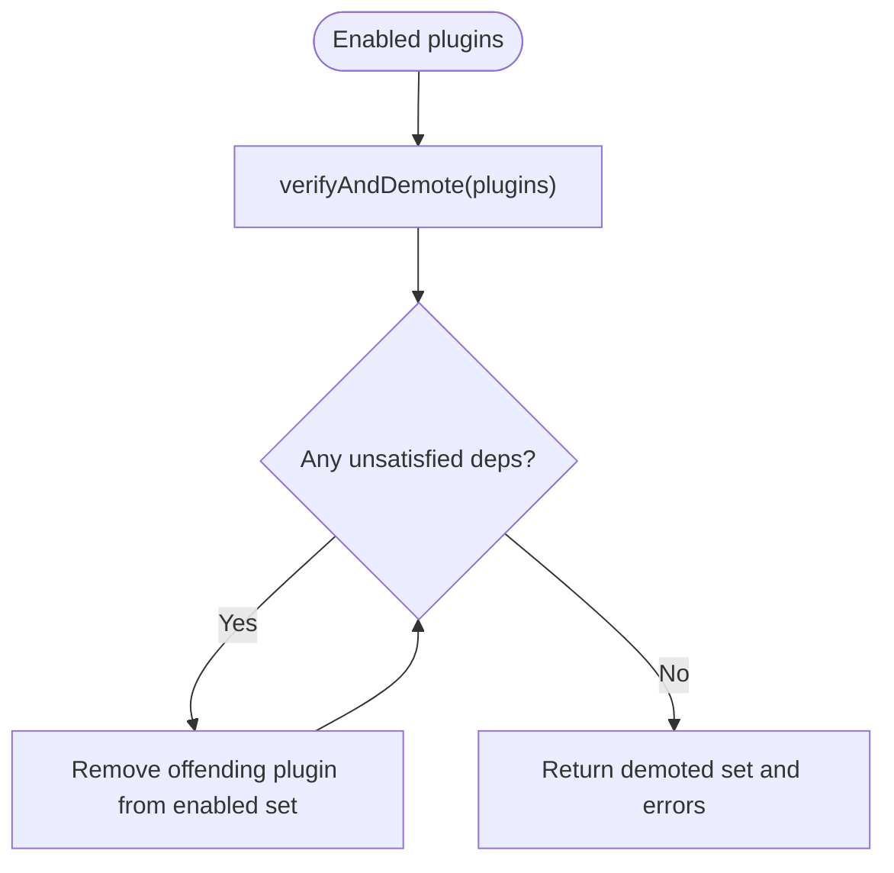
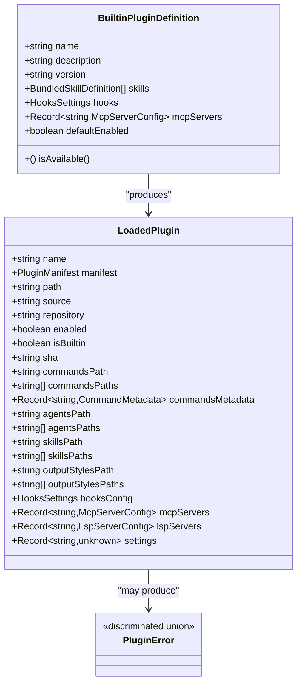
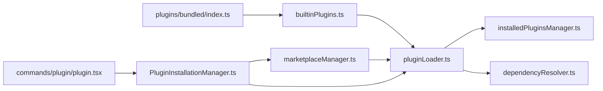

# Plugin System

<cite>
**Referenced Files in This Document**
- [builtinPlugins.ts](file://src/plugins/builtinPlugins.ts)
- [index.ts](file://src/plugins/bundled/index.ts)
- [plugin.ts](file://src/types/plugin.ts)
- [PluginInstallationManager.ts](file://src/services/plugins/PluginInstallationManager.ts)
- [installedPluginsManager.ts](file://src/utils/plugins/installedPluginsManager.ts)
- [pluginLoader.ts](file://src/utils/plugins/pluginLoader.ts)
- [marketplaceManager.ts](file://src/utils/plugins/marketplaceManager.ts)
- [dependencyResolver.ts](file://src/utils/plugins/dependencyResolver.ts)
- [plugin.tsx](file://src/commands/plugin/plugin.tsx)
</cite>

## Table of Contents
1. [Introduction](#introduction)
2. [Project Structure](#project-structure)
3. [Core Components](#core-components)
4. [Architecture Overview](#architecture-overview)
5. [Detailed Component Analysis](#detailed-component-analysis)
6. [Dependency Analysis](#dependency-analysis)
7. [Performance Considerations](#performance-considerations)
8. [Troubleshooting Guide](#troubleshooting-guide)
9. [Conclusion](#conclusion)
10. [Appendices](#appendices)

## Introduction
This document explains the plugin system architecture and extensibility framework. It covers how plugins are discovered, loaded, validated, and integrated into the application, including built-in plugins, marketplace-driven plugins, and session-scoped plugins. It documents plugin lifecycle management, installation and configuration, dependency management, and the plugin API surface. Practical guidance is included for both users and developers, with emphasis on security, sandboxing, and performance.

## Project Structure
The plugin system spans several modules:
- Plugin registry and built-in plugin management
- Plugin loading and caching
- Marketplace configuration and synchronization
- Installation orchestration and background reconciliation
- Dependency resolution and enforcement
- UI command entry points for plugin management

**Diagram sources**
- [builtinPlugins.ts:1-160](file://src/plugins/builtinPlugins.ts#L1-L160)
- [index.ts:1-24](file://src/plugins/bundled/index.ts#L1-L24)
- [pluginLoader.ts:1-800](file://src/utils/plugins/pluginLoader.ts#L1-L800)
- [installedPluginsManager.ts:1-800](file://src/utils/plugins/installedPluginsManager.ts#L1-L800)
- [marketplaceManager.ts:1-800](file://src/utils/plugins/marketplaceManager.ts#L1-L800)
- [PluginInstallationManager.ts:1-185](file://src/services/plugins/PluginInstallationManager.ts#L1-L185)
- [dependencyResolver.ts:1-306](file://src/utils/plugins/dependencyResolver.ts#L1-L306)
- [plugin.tsx:1-7](file://src/commands/plugin/plugin.tsx#L1-L7)

**Section sources**
- [builtinPlugins.ts:1-160](file://src/plugins/builtinPlugins.ts#L1-L160)
- [index.ts:1-24](file://src/plugins/bundled/index.ts#L1-L24)
- [pluginLoader.ts:1-800](file://src/utils/plugins/pluginLoader.ts#L1-L800)
- [marketplaceManager.ts:1-800](file://src/utils/plugins/marketplaceManager.ts#L1-L800)
- [PluginInstallationManager.ts:1-185](file://src/services/plugins/PluginInstallationManager.ts#L1-L185)
- [installedPluginsManager.ts:1-800](file://src/utils/plugins/installedPluginsManager.ts#L1-L800)
- [dependencyResolver.ts:1-306](file://src/utils/plugins/dependencyResolver.ts#L1-L306)
- [plugin.tsx:1-7](file://src/commands/plugin/plugin.tsx#L1-L7)

## Core Components
- Built-in plugin registry: Registers and exposes built-in plugins with toggleable enablement and availability checks.
- Plugin loader: Discovers, validates, and loads plugins from marketplaces, git repositories, and session-scoped sources. Handles caching, zipping, and versioned paths.
- Marketplace manager: Manages known marketplaces, caches manifests, pulls updates, and enforces policies.
- Installation manager: Performs background installation and reconciliation of marketplaces and plugins without blocking startup.
- Installed plugins manager: Tracks installation metadata globally and synchronizes with per-repository enablement settings.
- Dependency resolver: Resolves transitive dependencies, detects cycles, enforces cross-marketplace restrictions, and verifies dependencies at load time.
- Types and error model: Defines plugin types, component categories, and a rich error model for diagnostics.

**Section sources**
- [builtinPlugins.ts:18-102](file://src/plugins/builtinPlugins.ts#L18-L102)
- [pluginLoader.ts:10-33](file://src/utils/plugins/pluginLoader.ts#L10-L33)
- [marketplaceManager.ts:1-20](file://src/utils/plugins/marketplaceManager.ts#L1-L20)
- [PluginInstallationManager.ts:50-185](file://src/services/plugins/PluginInstallationManager.ts#L50-L185)
- [installedPluginsManager.ts:1-14](file://src/utils/plugins/installedPluginsManager.ts#L1-L14)
- [dependencyResolver.ts:1-12](file://src/utils/plugins/dependencyResolver.ts#L1-L12)
- [plugin.ts:13-364](file://src/types/plugin.ts#L13-L364)

## Architecture Overview
The plugin system integrates multiple subsystems:
- Discovery and loading: Marketplaces and git sources feed into the loader, which validates manifests, copies to versioned cache, and constructs LoadedPlugin objects.
- Lifecycle: Built-in plugins are registered at startup; marketplace plugins are reconciled in the background; installed plugins are tracked globally while enablement is controlled per repository.
- Dependencies: Transitive dependency resolution ensures only satisfiable sets are enabled; load-time verification demotes broken sets.
- UI: A command entry renders the plugin settings UI.

**Diagram sources**
- [PluginInstallationManager.ts:60-185](file://src/services/plugins/PluginInstallationManager.ts#L60-L185)
- [marketplaceManager.ts:264-298](file://src/utils/plugins/marketplaceManager.ts#L264-L298)
- [pluginLoader.ts:1-800](file://src/utils/plugins/pluginLoader.ts#L1-L800)
- [installedPluginsManager.ts:1-800](file://src/utils/plugins/installedPluginsManager.ts#L1-L800)

## Detailed Component Analysis

### Built-in Plugin Registry
Built-in plugins are shipped with the CLI and appear in the plugin UI. They can be enabled/disabled by users and may provide skills, hooks, and MCP servers. The registry:
- Registers definitions at startup
- Computes enabled/disabled lists based on user settings and defaults
- Exposes definitions for UI rendering and command conversion

**Diagram sources**
- [index.ts:20-24](file://src/plugins/bundled/index.ts#L20-L24)
- [builtinPlugins.ts:28-102](file://src/plugins/builtinPlugins.ts#L28-L102)

**Section sources**
- [builtinPlugins.ts:18-102](file://src/plugins/builtinPlugins.ts#L18-L102)
- [index.ts:17-24](file://src/plugins/bundled/index.ts#L17-L24)

### Plugin Loading and Caching
The loader discovers plugins from multiple sources, validates manifests, and manages caches:
- Sources: Marketplaces, git repositories, npm packages (via marketplace entries), and session-scoped directories
- Caching: Versioned cache paths under ~/.claude/plugins/cache/{marketplace}/{plugin}/{version}/; optional ZIP cache
- Installation: Git clone/pull, sparse-checkout for subdirectories, npm install from cache
- Validation: Manifest parsing, schema validation, duplicate detection, and error telemetry

**Diagram sources**
- [pluginLoader.ts:10-33](file://src/utils/plugins/pluginLoader.ts#L10-L33)
- [pluginLoader.ts:365-465](file://src/utils/plugins/pluginLoader.ts#L365-L465)
- [pluginLoader.ts:534-640](file://src/utils/plugins/pluginLoader.ts#L534-L640)
- [pluginLoader.ts:645-800](file://src/utils/plugins/pluginLoader.ts#L645-L800)

**Section sources**
- [pluginLoader.ts:10-33](file://src/utils/plugins/pluginLoader.ts#L10-L33)
- [pluginLoader.ts:365-465](file://src/utils/plugins/pluginLoader.ts#L365-L465)
- [pluginLoader.ts:534-640](file://src/utils/plugins/pluginLoader.ts#L534-L640)
- [pluginLoader.ts:645-800](file://src/utils/plugins/pluginLoader.ts#L645-L800)

### Marketplace Management
Marketplace manager:
- Maintains known marketplaces in ~/.claude/plugins/known_marketplaces.json
- Caches marketplace manifests and data
- Pulls updates, handles sparse-checkout and submodules
- Enforces allow/blocklists and policy constraints

**Diagram sources**
- [marketplaceManager.ts:264-298](file://src/utils/plugins/marketplaceManager.ts#L264-L298)
- [marketplaceManager.ts:508-582](file://src/utils/plugins/marketplaceManager.ts#L508-L582)
- [marketplaceManager.ts:786-800](file://src/utils/plugins/marketplaceManager.ts#L786-L800)

**Section sources**
- [marketplaceManager.ts:1-20](file://src/utils/plugins/marketplaceManager.ts#L1-L20)
- [marketplaceManager.ts:264-298](file://src/utils/plugins/marketplaceManager.ts#L264-L298)
- [marketplaceManager.ts:508-582](file://src/utils/plugins/marketplaceManager.ts#L508-L582)
- [marketplaceManager.ts:786-800](file://src/utils/plugins/marketplaceManager.ts#L786-L800)

### Installation Orchestration
Background installation manager:
- Computes diffs between declared and materialized marketplaces
- Updates UI state with pending/installing/installed/failed statuses
- Auto-refreshes plugins when new marketplaces are installed
- Clears caches and sets needsRefresh when updates occur

**Diagram sources**
- [PluginInstallationManager.ts:60-185](file://src/services/plugins/PluginInstallationManager.ts#L60-L185)

**Section sources**
- [PluginInstallationManager.ts:50-185](file://src/services/plugins/PluginInstallationManager.ts#L50-L185)

### Installed Plugins Tracking
Installed plugins manager:
- Global installation state stored in installed_plugins.json (versioned format)
- Supports migration from legacy formats and consolidates into a single file
- Tracks installation metadata (scope, version, timestamps, git commit SHA)
- Preserves session-level snapshot separate from disk state for background updates

**Diagram sources**
- [installedPluginsManager.ts:714-734](file://src/utils/plugins/installedPluginsManager.ts#L714-L734)
- [installedPluginsManager.ts:315-364](file://src/utils/plugins/installedPluginsManager.ts#L315-L364)

**Section sources**
- [installedPluginsManager.ts:1-14](file://src/utils/plugins/installedPluginsManager.ts#L1-L14)
- [installedPluginsManager.ts:315-364](file://src/utils/plugins/installedPluginsManager.ts#L315-L364)
- [installedPluginsManager.ts:714-734](file://src/utils/plugins/installedPluginsManager.ts#L714-L734)

### Dependency Management
Dependency resolver:
- Normalizes bare dependency names to fully-qualified plugin IDs
- Resolves transitive closures with cycle detection and cross-marketplace restrictions
- Enforces load-time verification and demotion of unsatisfied dependencies
- Provides reverse-dependency queries for uninstall/disable warnings

**Diagram sources**
- [dependencyResolver.ts:177-234](file://src/utils/plugins/dependencyResolver.ts#L177-L234)

**Section sources**
- [dependencyResolver.ts:1-12](file://src/utils/plugins/dependencyResolver.ts#L1-L12)
- [dependencyResolver.ts:177-234](file://src/utils/plugins/dependencyResolver.ts#L177-L234)

### Plugin API Design and Types
The plugin API defines:
- Plugin types: Built-in plugin definitions, loaded plugin objects, plugin components (commands, agents, skills, hooks, output-styles)
- Error model: Rich, discriminated error types for robust diagnostics
- Manifest and metadata: Command metadata, author, and repository information

**Diagram sources**
- [plugin.ts:18-70](file://src/types/plugin.ts#L18-L70)
- [plugin.ts:48-70](file://src/types/plugin.ts#L48-L70)
- [plugin.ts:101-283](file://src/types/plugin.ts#L101-L283)

**Section sources**
- [plugin.ts:18-70](file://src/types/plugin.ts#L18-L70)
- [plugin.ts:101-283](file://src/types/plugin.ts#L101-L283)

### Plugin UI Command Entry
The plugin command renders the plugin settings UI, delegating to dedicated components for managing plugins and marketplaces.

**Section sources**
- [plugin.tsx:1-7](file://src/commands/plugin/plugin.tsx#L1-L7)

## Dependency Analysis
The plugin system exhibits low coupling and high cohesion:
- Built-in plugins are decoupled from marketplace logic via the registry abstraction
- Loading and caching are centralized in the loader, with clear separation of concerns for git/npm/npm-from-marketplace sources
- Marketplace management is isolated and provides a stable interface for discovery and updates
- Installation orchestration coordinates marketplace reconciliation and plugin refresh without tightly coupling to loaders
- Dependency resolution is a pure function that operates on loaded plugin metadata

**Diagram sources**
- [builtinPlugins.ts:1-160](file://src/plugins/builtinPlugins.ts#L1-L160)
- [index.ts:1-24](file://src/plugins/bundled/index.ts#L1-L24)
- [pluginLoader.ts:1-800](file://src/utils/plugins/pluginLoader.ts#L1-L800)
- [marketplaceManager.ts:1-800](file://src/utils/plugins/marketplaceManager.ts#L1-L800)
- [PluginInstallationManager.ts:1-185](file://src/services/plugins/PluginInstallationManager.ts#L1-L185)
- [installedPluginsManager.ts:1-800](file://src/utils/plugins/installedPluginsManager.ts#L1-L800)
- [dependencyResolver.ts:1-306](file://src/utils/plugins/dependencyResolver.ts#L1-L306)
- [plugin.tsx:1-7](file://src/commands/plugin/plugin.tsx#L1-L7)

**Section sources**
- [builtinPlugins.ts:1-160](file://src/plugins/builtinPlugins.ts#L1-L160)
- [index.ts:1-24](file://src/plugins/bundled/index.ts#L1-L24)
- [pluginLoader.ts:1-800](file://src/utils/plugins/pluginLoader.ts#L1-L800)
- [marketplaceManager.ts:1-800](file://src/utils/plugins/marketplaceManager.ts#L1-L800)
- [PluginInstallationManager.ts:1-185](file://src/services/plugins/PluginInstallationManager.ts#L1-L185)
- [installedPluginsManager.ts:1-800](file://src/utils/plugins/installedPluginsManager.ts#L1-L800)
- [dependencyResolver.ts:1-306](file://src/utils/plugins/dependencyResolver.ts#L1-L306)
- [plugin.tsx:1-7](file://src/commands/plugin/plugin.tsx#L1-L7)

## Performance Considerations
- Caching: Versioned cache paths and optional ZIP cache reduce redundant downloads and speed up load times.
- Partial clones: Sparse-checkout and shallow clones minimize bandwidth and disk usage for large repositories.
- Background reconciliation: Marketplaces are installed asynchronously to avoid blocking startup.
- Memoization: Internal memoized functions reduce repeated filesystem/network operations.
- Telemetry: Network operations are instrumented to track success/failure and improve reliability.

[No sources needed since this section provides general guidance]

## Troubleshooting Guide
Common issues and remedies:
- Plugin not found in marketplace: Trigger a refresh or ensure the marketplace is installed and up to date.
- Git authentication or timeouts: Review SSH configuration or switch to HTTPS; increase timeout via environment variable.
- Dependency unsatisfied: Enable the required plugin or remove the dependency; verify marketplace trust for cross-marketplace dependencies.
- Marketplace blocked by policy: Adjust enterprise policy settings or use allowed marketplaces.
- LSP/MCP server errors: Validate server configuration and ensure uniqueness; check for duplicates or invalid manifests.

**Section sources**
- [plugin.ts:101-283](file://src/types/plugin.ts#L101-L283)
- [marketplaceManager.ts:508-582](file://src/utils/plugins/marketplaceManager.ts#L508-L582)
- [dependencyResolver.ts:177-234](file://src/utils/plugins/dependencyResolver.ts#L177-L234)

## Conclusion
The plugin system provides a robust, secure, and extensible framework for integrating third-party and built-in functionality. Its layered design separates discovery, loading, caching, dependency management, and marketplace operations, enabling reliable updates, strong security boundaries, and excellent performance through caching and partial cloning.

[No sources needed since this section summarizes without analyzing specific files]

## Appendices

### Plugin Types and Components
- Built-in plugins: Registered at startup, toggleable via user settings, may provide skills, hooks, and MCP servers.
- Marketplace plugins: Installed from known marketplaces, cached under versioned paths, and refreshed on updates.
- Session-scoped plugins: Loaded from --plugin-dir or SDK options for ephemeral sessions.

**Section sources**
- [builtinPlugins.ts:18-35](file://src/plugins/builtinPlugins.ts#L18-L35)
- [pluginLoader.ts:10-33](file://src/utils/plugins/pluginLoader.ts#L10-L33)

### Plugin Installation and Configuration
- Installation: From git, npm (via marketplace), or session directories; cached under versioned paths.
- Configuration: Global installation state in installed_plugins.json; enablement per repository in settings.
- Reconciliation: Background updates reconcile declared marketplaces with materialized state.

**Section sources**
- [pluginLoader.ts:365-465](file://src/utils/plugins/pluginLoader.ts#L365-L465)
- [installedPluginsManager.ts:315-364](file://src/utils/plugins/installedPluginsManager.ts#L315-L364)
- [PluginInstallationManager.ts:60-185](file://src/services/plugins/PluginInstallationManager.ts#L60-L185)

### Plugin Security and Sandboxing
- Cross-marketplace dependency restrictions prevent automatic installation from untrusted sources.
- Policy enforcement blocks marketplaces by allow/blocklists.
- Git operations use strict host key checking and credential helpers to avoid unsafe prompts.
- Load-time dependency verification demotes broken sets to maintain system stability.

**Section sources**
- [dependencyResolver.ts:95-159](file://src/utils/plugins/dependencyResolver.ts#L95-L159)
- [marketplaceManager.ts:508-582](file://src/utils/plugins/marketplaceManager.ts#L508-L582)
- [pluginLoader.ts:534-640](file://src/utils/plugins/pluginLoader.ts#L534-L640)

### Developer and User Guides
- Developer guide: Create a plugin with a manifest, expose commands/agents/skills/hooks, publish via a marketplace, and manage dependencies.
- User guide: Browse and install plugins from marketplaces, enable/disable built-in plugins, and manage plugin settings.

[No sources needed since this section provides general guidance]