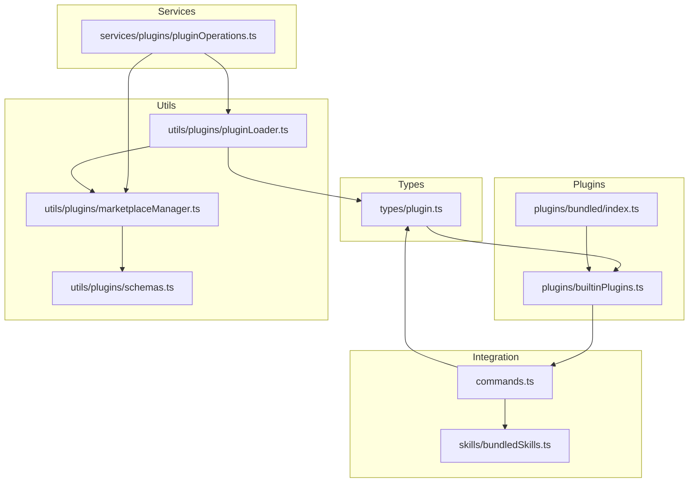
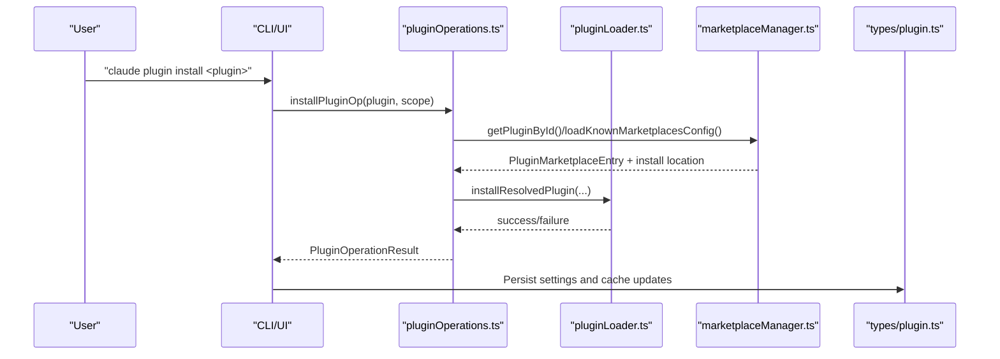
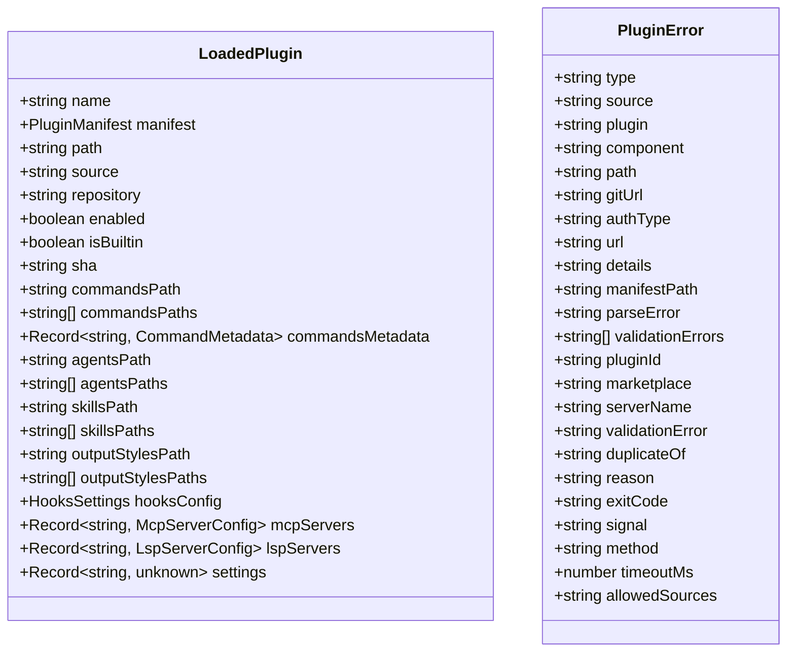
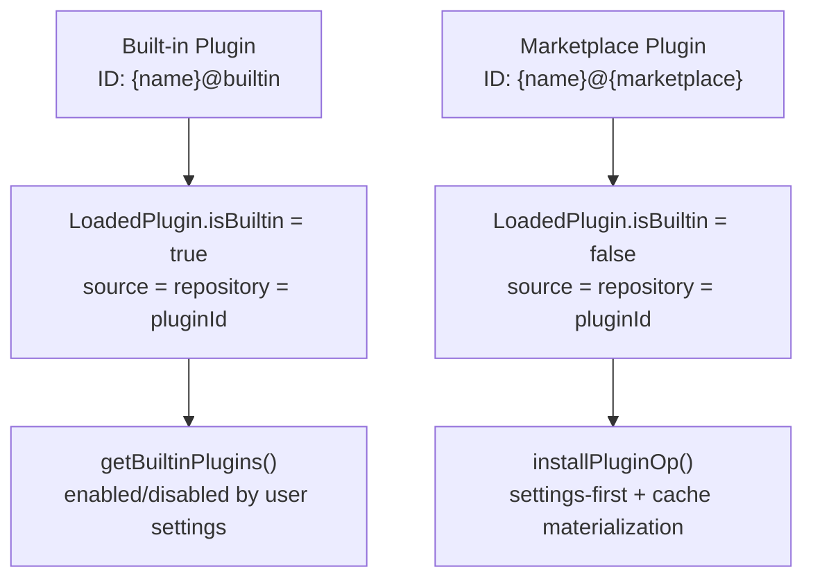
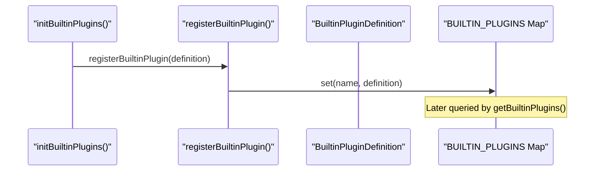
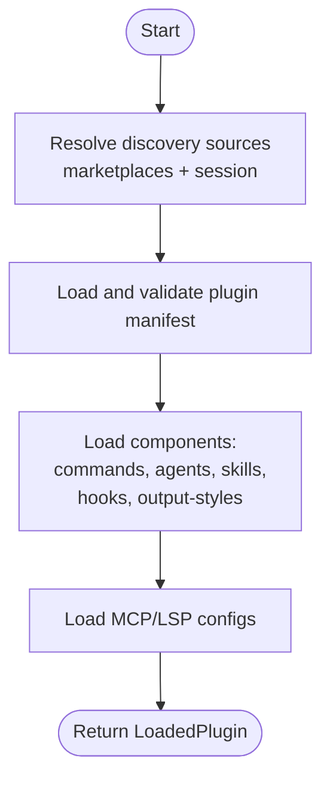
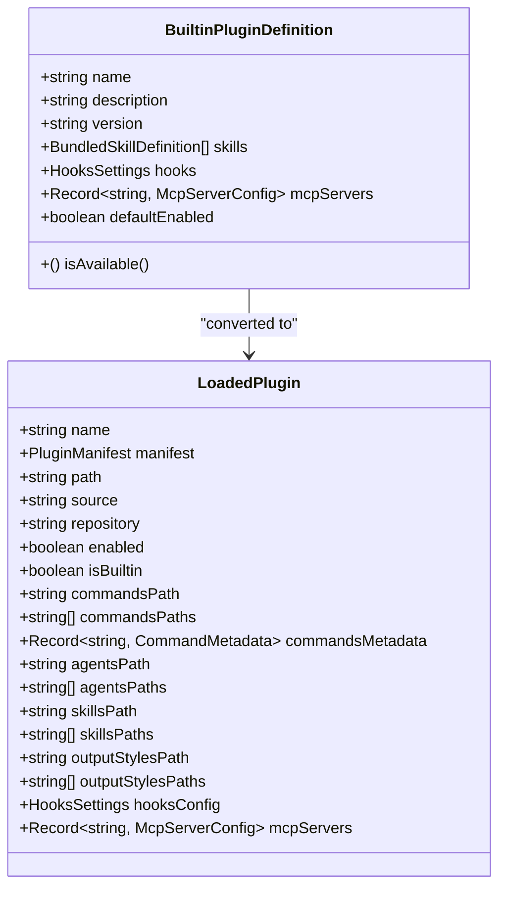
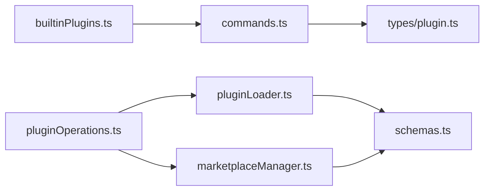

# Plugin Types and Categories

<cite>
**Referenced Files in This Document**
- [plugin.ts](file://restored-src/src/types/plugin.ts)
- [builtinPlugins.ts](file://restored-src/src/plugins/builtinPlugins.ts)
- [index.ts](file://restored-src/src/plugins/bundled/index.ts)
- [pluginOperations.ts](file://restored-src/src/services/plugins/pluginOperations.ts)
- [pluginLoader.ts](file://restored-src/src/utils/plugins/pluginLoader.ts)
- [marketplaceManager.ts](file://restored-src/src/utils/plugins/marketplaceManager.ts)
- [schemas.ts](file://restored-src/src/utils/plugins/schemas.ts)
- [commands.ts](file://restored-src/src/commands.ts)
- [bundledSkills.ts](file://restored-src/src/skills/bundledSkills.ts)
</cite>

## Table of Contents
1. [Introduction](#introduction)
2. [Project Structure](#project-structure)
3. [Core Components](#core-components)
4. [Architecture Overview](#architecture-overview)
5. [Detailed Component Analysis](#detailed-component-analysis)
6. [Dependency Analysis](#dependency-analysis)
7. [Performance Considerations](#performance-considerations)
8. [Troubleshooting Guide](#troubleshooting-guide)
9. [Conclusion](#conclusion)

## Introduction
This document explains the Claude Code plugin system’s types and categories, focusing on how plugins are defined, identified, categorized, and integrated into the broader system. It covers built-in plugins versus marketplace plugins, plugin metadata and identification schemes, plugin registration and discovery mechanisms, and the integration points for commands, skills, hooks, and MCP servers. It also provides implementation patterns and diagrams to illustrate how the system works end-to-end.

## Project Structure
The plugin system spans several modules:
- Type definitions and plugin metadata live in the types module.
- Built-in plugin registry and initialization are in the plugins module.
- Plugin operations (install, enable, disable, uninstall) are handled by service modules.
- Discovery and loading are implemented in utility modules for plugin loader and marketplace manager.
- Commands and skills integration is wired through the commands module and bundled skills definitions.

**Diagram sources**
- [plugin.ts:1-364](file://restored-src/src/types/plugin.ts#L1-L364)
- [builtinPlugins.ts:1-160](file://restored-src/src/plugins/builtinPlugins.ts#L1-L160)
- [index.ts:1-24](file://restored-src/src/plugins/bundled/index.ts#L1-L24)
- [pluginOperations.ts:1-800](file://restored-src/src/services/plugins/pluginOperations.ts#L1-L800)
- [pluginLoader.ts:1-200](file://restored-src/src/utils/plugins/pluginLoader.ts#L1-L200)
- [marketplaceManager.ts:1-200](file://restored-src/src/utils/plugins/marketplaceManager.ts#L1-L200)
- [schemas.ts:1-200](file://restored-src/src/utils/plugins/schemas.ts#L1-L200)
- [commands.ts:1-200](file://restored-src/src/commands.ts#L1-L200)
- [bundledSkills.ts:1-221](file://restored-src/src/skills/bundledSkills.ts#L1-L221)

**Section sources**
- [plugin.ts:1-364](file://restored-src/src/types/plugin.ts#L1-L364)
- [builtinPlugins.ts:1-160](file://restored-src/src/plugins/builtinPlugins.ts#L1-L160)
- [index.ts:1-24](file://restored-src/src/plugins/bundled/index.ts#L1-L24)
- [pluginOperations.ts:1-800](file://restored-src/src/services/plugins/pluginOperations.ts#L1-L800)
- [pluginLoader.ts:1-200](file://restored-src/src/utils/plugins/pluginLoader.ts#L1-L200)
- [marketplaceManager.ts:1-200](file://restored-src/src/utils/plugins/marketplaceManager.ts#L1-L200)
- [schemas.ts:1-200](file://restored-src/src/utils/plugins/schemas.ts#L1-L200)
- [commands.ts:1-200](file://restored-src/src/commands.ts#L1-L200)
- [bundledSkills.ts:1-221](file://restored-src/src/skills/bundledSkills.ts#L1-L221)

## Core Components
- Plugin metadata and identity: The plugin type definitions describe how plugins are represented, including identification schemes, component lists, and error types. See [plugin.ts:48-70](file://restored-src/src/types/plugin.ts#L48-L70) for the LoadedPlugin structure and [plugin.ts:101-283](file://restored-src/src/types/plugin.ts#L101-L283) for the discriminated PluginError union.
- Built-in plugins: The built-in plugin registry manages plugins shipped with the CLI, allowing user toggling and exposing skills, hooks, and MCP servers. See [builtinPlugins.ts:21-102](file://restored-src/src/plugins/builtinPlugins.ts#L21-L102).
- Plugin operations: Core operations (install, uninstall, enable, disable, update) are implemented as pure functions with clear result types and policy checks. See [pluginOperations.ts:321-775](file://restored-src/src/services/plugins/pluginOperations.ts#L321-L775).
- Discovery and loading: The plugin loader discovers plugins from marketplaces and session contexts, validates manifests, and aggregates components. See [pluginLoader.ts:1-200](file://restored-src/src/utils/plugins/pluginLoader.ts#L1-L200).
- Marketplace management: Marketplaces are configured, cached, and reconciled, including policy enforcement and official marketplace validation. See [marketplaceManager.ts:1-200](file://restored-src/src/utils/plugins/marketplaceManager.ts#L1-L200) and [schemas.ts:1-200](file://restored-src/src/utils/plugins/schemas.ts#L1-L200).
- Integration points: Commands and skills are integrated through the commands module and bundled skills definitions. See [commands.ts:157-168](file://restored-src/src/commands.ts#L157-L168) and [bundledSkills.ts:53-100](file://restored-src/src/skills/bundledSkills.ts#L53-L100).

**Section sources**
- [plugin.ts:48-70](file://restored-src/src/types/plugin.ts#L48-L70)
- [plugin.ts:101-283](file://restored-src/src/types/plugin.ts#L101-L283)
- [builtinPlugins.ts:21-102](file://restored-src/src/plugins/builtinPlugins.ts#L21-L102)
- [pluginOperations.ts:321-775](file://restored-src/src/services/plugins/pluginOperations.ts#L321-L775)
- [pluginLoader.ts:1-200](file://restored-src/src/utils/plugins/pluginLoader.ts#L1-L200)
- [marketplaceManager.ts:1-200](file://restored-src/src/utils/plugins/marketplaceManager.ts#L1-L200)
- [schemas.ts:1-200](file://restored-src/src/utils/plugins/schemas.ts#L1-L200)
- [commands.ts:157-168](file://restored-src/src/commands.ts#L157-L168)
- [bundledSkills.ts:53-100](file://restored-src/src/skills/bundledSkills.ts#L53-L100)

## Architecture Overview
The plugin system separates concerns across discovery, configuration, lifecycle management, and integration:
- Discovery: Marketplaces and session-scoped plugins are probed and validated.
- Configuration: Plugin manifests define components (commands, agents, skills, hooks, output-styles) and metadata.
- Lifecycle: Install, enable/disable, update, and uninstall operations are enforced with policy checks and settings-first semantics.
- Integration: Commands and skills are surfaced to the CLI and UI; hooks and MCP servers are integrated into runtime services.

**Diagram sources**
- [pluginOperations.ts:321-418](file://restored-src/src/services/plugins/pluginOperations.ts#L321-L418)
- [pluginLoader.ts:1-200](file://restored-src/src/utils/plugins/pluginLoader.ts#L1-L200)
- [marketplaceManager.ts:1-200](file://restored-src/src/utils/plugins/marketplaceManager.ts#L1-L200)
- [plugin.ts:48-70](file://restored-src/src/types/plugin.ts#L48-L70)

## Detailed Component Analysis

### Plugin Types and Metadata
- LoadedPlugin: Represents a loaded plugin with its manifest, source, and component paths. Fields include name, manifest, path, source, repository, enabled flag, isBuiltin, and optional component collections (commands, agents, skills, outputStyles, hooks, mcpServers, lspServers, settings). See [plugin.ts:48-70](file://restored-src/src/types/plugin.ts#L48-L70).
- PluginComponent: Enumerated component categories used for discovery and loading. See [plugin.ts:72-78](file://restored-src/src/types/plugin.ts#L72-L78).
- PluginError: Discriminated union of error types covering path issues, git/network problems, manifest parsing/validation, marketplace availability, MCP/LSP server issues, dependency unsatisfied, and cache misses. See [plugin.ts:101-283](file://restored-src/src/types/plugin.ts#L101-L283).

**Diagram sources**
- [plugin.ts:48-70](file://restored-src/src/types/plugin.ts#L48-L70)
- [plugin.ts:101-283](file://restored-src/src/types/plugin.ts#L101-L283)

**Section sources**
- [plugin.ts:48-70](file://restored-src/src/types/plugin.ts#L48-L70)
- [plugin.ts:72-78](file://restored-src/src/types/plugin.ts#L72-L78)
- [plugin.ts:101-283](file://restored-src/src/types/plugin.ts#L101-L283)

### Built-in Plugins vs. Marketplace Plugins
- Built-in plugins: Registered at startup, appear in the /plugin UI, and can be enabled/disabled by users. Their IDs use the format `{name}@builtin`. They expose skills, hooks, and MCP servers without requiring installation. See [builtinPlugins.ts:21-102](file://restored-src/src/plugins/builtinPlugins.ts#L21-L102).
- Marketplace plugins: Installed from configured marketplaces, identified by `{name}@{marketplace}`, and managed via settings-first operations. See [pluginOperations.ts:372-379](file://restored-src/src/services/plugins/pluginOperations.ts#L372-L379) and [plugin.ts:37-46](file://restored-src/src/types/plugin.ts#L37-L46).

**Diagram sources**
- [builtinPlugins.ts:21-102](file://restored-src/src/plugins/builtinPlugins.ts#L21-L102)
- [pluginOperations.ts:321-418](file://restored-src/src/services/plugins/pluginOperations.ts#L321-L418)
- [plugin.ts:37-46](file://restored-src/src/types/plugin.ts#L37-L46)

**Section sources**
- [builtinPlugins.ts:21-102](file://restored-src/src/plugins/builtinPlugins.ts#L21-L102)
- [pluginOperations.ts:321-418](file://restored-src/src/services/plugins/pluginOperations.ts#L321-L418)
- [plugin.ts:37-46](file://restored-src/src/types/plugin.ts#L37-L46)

### Plugin Registration Mechanisms
- Built-in plugin registry: Plugins are registered at startup via a dedicated initializer. See [index.ts:20-23](file://restored-src/src/plugins/bundled/index.ts#L20-L23) and [builtinPlugins.ts:28-32](file://restored-src/src/plugins/builtinPlugins.ts#L28-L32).
- Built-in plugin definition: Provides metadata (name, description, version), optional availability predicate, default enabled state, and component exposure (skills, hooks, MCP servers). See [builtinPlugins.ts:18-35](file://restored-src/src/plugins/builtinPlugins.ts#L18-L35).
- Bundled skills: Programmatic registration of skills that ship with the CLI. See [bundledSkills.ts:53-100](file://restored-src/src/skills/bundledSkills.ts#L53-L100).

**Diagram sources**
- [index.ts:20-23](file://restored-src/src/plugins/bundled/index.ts#L20-L23)
- [builtinPlugins.ts:28-32](file://restored-src/src/plugins/builtinPlugins.ts#L28-L32)

**Section sources**
- [index.ts:20-23](file://restored-src/src/plugins/bundled/index.ts#L20-L23)
- [builtinPlugins.ts:18-35](file://restored-src/src/plugins/builtinPlugins.ts#L18-L35)
- [bundledSkills.ts:53-100](file://restored-src/src/skills/bundledSkills.ts#L53-L100)

### Plugin Discovery and Loading
- Sources: Marketplaces (settings-based plugin IDs), session-only plugins (CLI flag or SDK options). See [pluginLoader.ts:10-13](file://restored-src/src/utils/plugins/pluginLoader.ts#L10-L13).
- Manifest validation: Uses schemas to validate plugin manifests and component paths. See [schemas.ts:161-200](file://restored-src/src/utils/plugins/schemas.ts#L161-L200).
- Component aggregation: Loads commands, agents, skills, output styles, hooks, MCP/LSP servers from plugin directories. See [pluginLoader.ts:1-200](file://restored-src/src/utils/plugins/pluginLoader.ts#L1-L200).

**Diagram sources**
- [pluginLoader.ts:1-200](file://restored-src/src/utils/plugins/pluginLoader.ts#L1-L200)
- [schemas.ts:161-200](file://restored-src/src/utils/plugins/schemas.ts#L161-L200)

**Section sources**
- [pluginLoader.ts:10-33](file://restored-src/src/utils/plugins/pluginLoader.ts#L10-L33)
- [schemas.ts:161-200](file://restored-src/src/utils/plugins/schemas.ts#L161-L200)

### Plugin Categorization Logic
- Component categories: commands, agents, skills, hooks, output-styles. See [plugin.ts:72-78](file://restored-src/src/types/plugin.ts#L72-L78).
- Built-in plugin exposure: Skills from built-in plugins are converted to Command objects for integration. See [builtinPlugins.ts:108-121](file://restored-src/src/plugins/builtinPlugins.ts#L108-L121) and [builtinPlugins.ts:132-159](file://restored-src/src/plugins/builtinPlugins.ts#L132-L159).
- Commands integration: Commands module aggregates built-in plugin skill commands and dynamic plugin commands. See [commands.ts:157-168](file://restored-src/src/commands.ts#L157-L168).

**Diagram sources**
- [builtinPlugins.ts:18-35](file://restored-src/src/plugins/builtinPlugins.ts#L18-L35)
- [builtinPlugins.ts:78-92](file://restored-src/src/plugins/builtinPlugins.ts#L78-L92)
- [plugin.ts:72-78](file://restored-src/src/types/plugin.ts#L72-L78)

**Section sources**
- [plugin.ts:72-78](file://restored-src/src/types/plugin.ts#L72-L78)
- [builtinPlugins.ts:108-121](file://restored-src/src/plugins/builtinPlugins.ts#L108-L121)
- [builtinPlugins.ts:132-159](file://restored-src/src/plugins/builtinPlugins.ts#L132-L159)
- [commands.ts:157-168](file://restored-src/src/commands.ts#L157-L168)

### Examples of Plugin Types and Implementation Patterns
- Built-in plugin definition: Define metadata and components; register at startup; expose skills as commands. See [builtinPlugins.ts:18-35](file://restored-src/src/plugins/builtinPlugins.ts#L18-L35) and [index.ts:20-23](file://restored-src/src/plugins/bundled/index.ts#L20-L23).
- Marketplace plugin installation: Use installResolvedPlugin after resolving marketplace entry; update settings and cache. See [pluginOperations.ts:374-379](file://restored-src/src/services/plugins/pluginOperations.ts#L374-L379) and [pluginOperations.ts:411-417](file://restored-src/src/services/plugins/pluginOperations.ts#L411-L417).
- Enabling/disabling built-in plugins: Update user settings and clear caches; no installation required. See [pluginOperations.ts:582-603](file://restored-src/src/services/plugins/pluginOperations.ts#L582-L603).
- Bundled skills registration: Register skills programmatically; lazy extraction of reference files; integration as commands. See [bundledSkills.ts:53-100](file://restored-src/src/skills/bundledSkills.ts#L53-L100) and [bundledSkills.ts:131-145](file://restored-src/src/skills/bundledSkills.ts#L131-L145).

**Section sources**
- [builtinPlugins.ts:18-35](file://restored-src/src/plugins/builtinPlugins.ts#L18-L35)
- [index.ts:20-23](file://restored-src/src/plugins/bundled/index.ts#L20-L23)
- [pluginOperations.ts:374-379](file://restored-src/src/services/plugins/pluginOperations.ts#L374-L379)
- [pluginOperations.ts:582-603](file://restored-src/src/services/plugins/pluginOperations.ts#L582-L603)
- [bundledSkills.ts:53-100](file://restored-src/src/skills/bundledSkills.ts#L53-L100)
- [bundledSkills.ts:131-145](file://restored-src/src/skills/bundledSkills.ts#L131-L145)

## Dependency Analysis
- Built-in plugins depend on the built-in registry and are converted into Command objects for integration. See [builtinPlugins.ts:108-121](file://restored-src/src/plugins/builtinPlugins.ts#L108-L121) and [commands.ts:162-168](file://restored-src/src/commands.ts#L162-L168).
- Plugin operations depend on marketplace manager and plugin loader for discovery and caching. See [pluginOperations.ts:321-418](file://restored-src/src/services/plugins/pluginOperations.ts#L321-L418).
- Marketplace manager depends on schemas for validation and policies. See [marketplaceManager.ts:1-200](file://restored-src/src/utils/plugins/marketplaceManager.ts#L1-L200) and [schemas.ts:1-200](file://restored-src/src/utils/plugins/schemas.ts#L1-L200).

**Diagram sources**
- [builtinPlugins.ts:108-121](file://restored-src/src/plugins/builtinPlugins.ts#L108-L121)
- [commands.ts:162-168](file://restored-src/src/commands.ts#L162-L168)
- [pluginOperations.ts:321-418](file://restored-src/src/services/plugins/pluginOperations.ts#L321-L418)
- [pluginLoader.ts:1-200](file://restored-src/src/utils/plugins/pluginLoader.ts#L1-L200)
- [marketplaceManager.ts:1-200](file://restored-src/src/utils/plugins/marketplaceManager.ts#L1-L200)
- [schemas.ts:1-200](file://restored-src/src/utils/plugins/schemas.ts#L1-L200)
- [plugin.ts:48-70](file://restored-src/src/types/plugin.ts#L48-L70)

**Section sources**
- [builtinPlugins.ts:108-121](file://restored-src/src/plugins/builtinPlugins.ts#L108-L121)
- [commands.ts:162-168](file://restored-src/src/commands.ts#L162-L168)
- [pluginOperations.ts:321-418](file://restored-src/src/services/plugins/pluginOperations.ts#L321-L418)
- [pluginLoader.ts:1-200](file://restored-src/src/utils/plugins/pluginLoader.ts#L1-L200)
- [marketplaceManager.ts:1-200](file://restored-src/src/utils/plugins/marketplaceManager.ts#L1-L200)
- [schemas.ts:1-200](file://restored-src/src/utils/plugins/schemas.ts#L1-L200)
- [plugin.ts:48-70](file://restored-src/src/types/plugin.ts#L48-L70)

## Performance Considerations
- Caching: Plugin loader computes versioned cache paths and probes seed caches to reduce network and IO overhead. See [pluginLoader.ts:139-188](file://restored-src/src/utils/plugins/pluginLoader.ts#L139-L188).
- Zip cache: Optional ZIP cache for plugins improves distribution and extraction performance. See [pluginLoader.ts:183-187](file://restored-src/src/utils/plugins/pluginLoader.ts#L183-L187).
- Memoization: Marketplaces and marketplace entries are memoized to avoid repeated network calls. See [marketplaceManager.ts:118-124](file://restored-src/src/utils/plugins/marketplaceManager.ts#L118-L124).

[No sources needed since this section provides general guidance]

## Troubleshooting Guide
Common plugin errors and their meanings:
- Path not found: Indicates missing component paths during loading. See [plugin.ts:103-108](file://restored-src/src/types/plugin.ts#L103-L108).
- Git authentication/timeout: Network or Git issues during clone/pull. See [plugin.ts:110-122](file://restored-src/src/types/plugin.ts#L110-L122).
- Manifest parse/validation: Issues with plugin.json parsing or schema validation. See [plugin.ts:131-143](file://restored-src/src/types/plugin.ts#L131-L143).
- Plugin not found: Requested plugin not available in marketplace. See [plugin.ts:145-149](file://restored-src/src/types/plugin.ts#L145-L149).
- Marketplace not found/failed: Configured marketplace unavailable or load failure. See [plugin.ts:151-161](file://restored-src/src/types/plugin.ts#L151-L161).
- MCP/LSP server invalid/crashed: Configuration or runtime issues with MCP/LSP servers. See [plugin.ts:163-256](file://restored-src/src/types/plugin.ts#L163-L256).
- Dependency unsatisfied: Missing or disabled dependency plugin. See [plugin.ts:266-271](file://restored-src/src/types/plugin.ts#L266-L271).
- Plugin cache miss: Cached version not found; requires refresh. See [plugin.ts:273-277](file://restored-src/src/types/plugin.ts#L273-L277).

Operational checks:
- Policy blocking: Built-in plugin enable/disable respects policy; marketplace installs may be blocked. See [pluginOperations.ts:653-658](file://restored-src/src/services/plugins/pluginOperations.ts#L653-L658).
- Scope resolution: Settings-first semantics determine effective enablement across scopes. See [pluginOperations.ts:616-648](file://restored-src/src/services/plugins/pluginOperations.ts#L616-L648).

**Section sources**
- [plugin.ts:101-283](file://restored-src/src/types/plugin.ts#L101-L283)
- [pluginOperations.ts:653-658](file://restored-src/src/services/plugins/pluginOperations.ts#L653-L658)
- [pluginOperations.ts:616-648](file://restored-src/src/services/plugins/pluginOperations.ts#L616-L648)

## Conclusion
Claude Code’s plugin system provides a robust framework for defining, discovering, and integrating plugins across multiple categories (commands, skills, hooks, MCP servers). Built-in plugins offer user-togglable functionality with a consistent interface, while marketplace plugins extend the system through curated distributions with strong validation and policy controls. The architecture emphasizes separation of concerns, settings-first operations, and comprehensive error modeling to ensure reliability and maintainability.