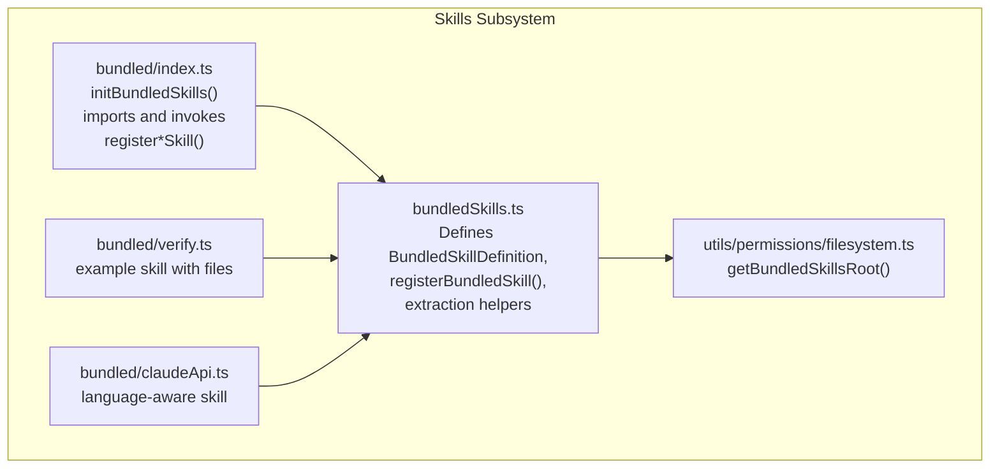
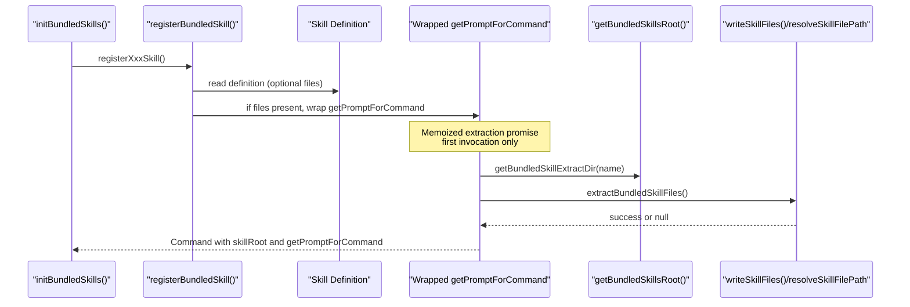
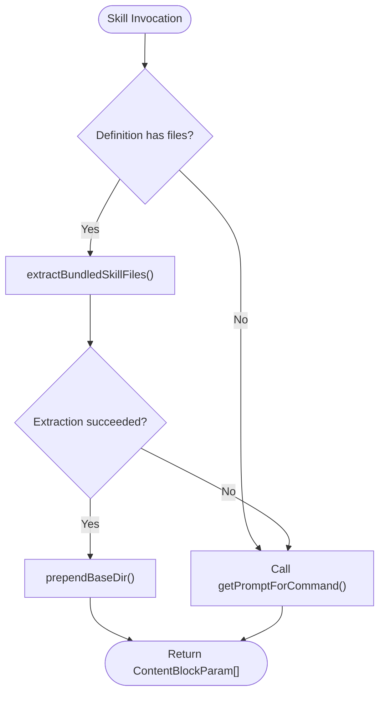
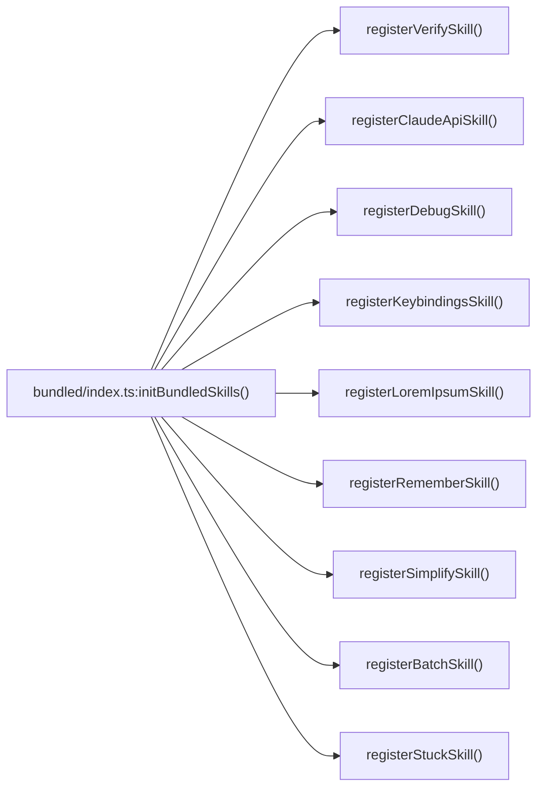
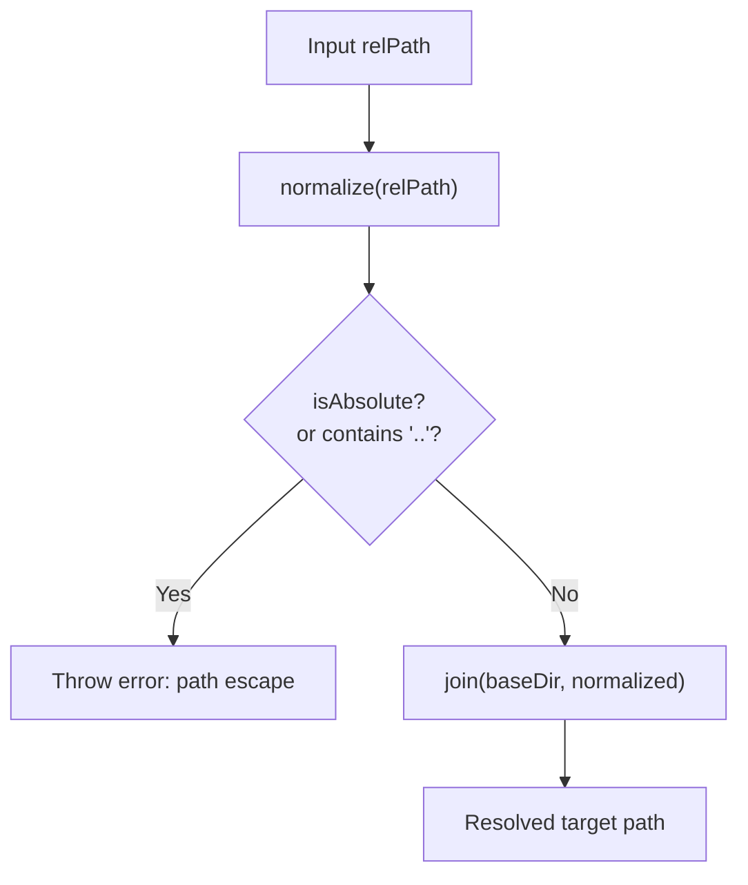
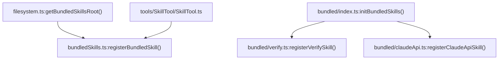

# Bundled Skills

<cite>
**Referenced Files in This Document**
- [bundledSkills.ts](file://src/skills/bundledSkills.ts)
- [index.ts](file://src/skills/bundled/index.ts)
- [filesystem.ts](file://src/utils/permissions/filesystem.ts)
- [loadSkillsDir.ts](file://src/skills/loadSkillsDir.ts)
- [verify.ts](file://src/skills/bundled/verify.ts)
- [claudeApi.ts](file://src/skills/bundled/claudeApi.ts)
- [SkillTool.ts](file://src/tools/SkillTool/SkillTool.ts)
- [prompt.ts](file://src/tools/SkillTool/prompt.ts)
</cite>

## Table of Contents
1. [Introduction](#introduction)
2. [Project Structure](#project-structure)
3. [Core Components](#core-components)
4. [Architecture Overview](#architecture-overview)
5. [Detailed Component Analysis](#detailed-component-analysis)
6. [Dependency Analysis](#dependency-analysis)
7. [Performance Considerations](#performance-considerations)
8. [Troubleshooting Guide](#troubleshooting-guide)
9. [Conclusion](#conclusion)

## Introduction
This document explains how bundled skills are defined, registered, and executed in the Claude Code CLI. It covers the bundled skills directory structure, built-in skills, the skill extraction process, path validation and security measures, and performance considerations. It also provides examples of common bundled skills and their use cases.

## Project Structure
Bundled skills are implemented under the skills subsystem:
- Registration and extraction logic live in a central module.
- A dedicated initializer registers all bundled skills at startup.
- Individual skills are grouped under a bundled directory and exported via registration functions.
- Extraction targets a per-process, version-scoped temporary directory with strict permissions.

**Diagram sources**
- [bundledSkills.ts:11-122](file://src/skills/bundledSkills.ts#L11-L122)
- [index.ts:15-80](file://src/skills/bundled/index.ts#L15-L80)
- [filesystem.ts:349-370](file://src/utils/permissions/filesystem.ts#L349-L370)
- [verify.ts:12-31](file://src/skills/bundled/verify.ts#L12-L31)
- [claudeApi.ts:180-197](file://src/skills/bundled/claudeApi.ts#L180-L197)

**Section sources**
- [bundledSkills.ts:11-122](file://src/skills/bundledSkills.ts#L11-L122)
- [index.ts:15-80](file://src/skills/bundled/index.ts#L15-L80)
- [filesystem.ts:349-370](file://src/utils/permissions/filesystem.ts#L349-L370)

## Core Components
- BundledSkillDefinition: A typed interface describing a skill’s metadata, optional reference files, and prompt generation function.
- registerBundledSkill: Registers a skill and optionally wraps its prompt function to lazily extract reference files to disk.
- getBundledSkills: Returns the in-memory registry of bundled skills.
- getBundledSkillExtractDir: Computes a deterministic extraction directory under a per-process, version-scoped root.
- extractBundledSkillFiles and writeSkillFiles: Writes reference files to disk with secure permissions and validates paths to prevent traversal.
- resolveSkillFilePath: Enforces safe path handling by rejecting absolute or traversing paths.
- getBundledSkillsRoot: Provides the root directory for extraction, secured by a per-process random nonce.

**Section sources**
- [bundledSkills.ts:15-41](file://src/skills/bundledSkills.ts#L15-L41)
- [bundledSkills.ts:53-100](file://src/skills/bundledSkills.ts#L53-L100)
- [bundledSkills.ts:106-122](file://src/skills/bundledSkills.ts#L106-L122)
- [bundledSkills.ts:131-145](file://src/skills/bundledSkills.ts#L131-L145)
- [bundledSkills.ts:147-167](file://src/skills/bundledSkills.ts#L147-L167)
- [bundledSkills.ts:195-206](file://src/skills/bundledSkills.ts#L195-L206)
- [filesystem.ts:349-370](file://src/utils/permissions/filesystem.ts#L349-L370)

## Architecture Overview
The lifecycle of a bundled skill:
1. At startup, the initializer imports and invokes individual registration functions.
2. Each registration calls registerBundledSkill with a definition that may include reference files.
3. When a skill is first invoked, its prompt function is wrapped to extract reference files to disk if configured.
4. The prompt is augmented with a base directory prefix so the model can reference the files.
5. The resulting Command is available alongside other skills for selection and execution.

**Diagram sources**
- [index.ts:24-80](file://src/skills/bundled/index.ts#L24-L80)
- [bundledSkills.ts:53-100](file://src/skills/bundledSkills.ts#L53-L100)
- [bundledSkills.ts:131-145](file://src/skills/bundledSkills.ts#L131-L145)
- [bundledSkills.ts:147-167](file://src/skills/bundledSkills.ts#L147-L167)
- [filesystem.ts:349-370](file://src/utils/permissions/filesystem.ts#L349-L370)

## Detailed Component Analysis

### Bundled Skills Registry and Extraction
- Registration: registerBundledSkill constructs a Command with source and loadedFrom set to bundled, and optionally sets skillRoot and a wrapped getPromptForCommand.
- First-invocation extraction: If the definition includes files, the wrapper ensures extraction happens once per process using a memoized promise. On success, the prompt is prefixed with a base directory line for model access.
- Failure handling: If extraction fails, the wrapper falls back to the raw prompt without the base directory prefix.

**Diagram sources**
- [bundledSkills.ts:59-73](file://src/skills/bundledSkills.ts#L59-L73)
- [bundledSkills.ts:131-145](file://src/skills/bundledSkills.ts#L131-L145)
- [bundledSkills.ts:208-220](file://src/skills/bundledSkills.ts#L208-L220)

**Section sources**
- [bundledSkills.ts:53-100](file://src/skills/bundledSkills.ts#L53-L100)
- [bundledSkills.ts:131-145](file://src/skills/bundledSkills.ts#L131-L145)
- [bundledSkills.ts:208-220](file://src/skills/bundledSkills.ts#L208-L220)

### Directory Structure and Initialization
- The initializer imports and invokes registration functions for each bundled skill. Feature flags conditionally enable certain skills.
- The initializer documents how to add a new bundled skill: create a registration file exporting a register function that calls registerBundledSkill, then import and call it from the initializer.

**Diagram sources**
- [index.ts:24-80](file://src/skills/bundled/index.ts#L24-L80)

**Section sources**
- [index.ts:15-80](file://src/skills/bundled/index.ts#L15-L80)

### Example Skills

#### Verify Skill
- Purpose: Verify a code change does what it should by running the app.
- Behavior: Conditionally registers based on environment, exposes user-invocable skill, and includes reference files to be extracted on first use.
- Prompt: Composes a base prompt from parsed frontmatter and optional user arguments.

**Section sources**
- [verify.ts:12-31](file://src/skills/bundled/verify.ts#L12-L31)

#### Claude API Skill
- Purpose: Guides building apps with the Claude API or Anthropic SDKs.
- Behavior: Detects project language by scanning files, selects relevant reference files, and builds a prompt with inline documentation and quick-task guidance.
- Tools: Allows Read, Grep, Glob, WebFetch for model-driven discovery.

**Section sources**
- [claudeApi.ts:180-197](file://src/skills/bundled/claudeApi.ts#L180-L197)

### Path Validation and Security
- Path normalization and rejection: resolveSkillFilePath normalizes the input path and rejects absolute paths or any segment containing traversal components.
- Safe extraction: writeSkillFiles groups writes by parent directory and uses mkdir with restrictive permissions, then writes files with exclusive, no-follow flags and restrictive file modes.
- Root isolation: getBundledSkillsRoot returns a per-process, version-scoped directory under a secure temporary location, preventing symlink-based injection and ensuring owner-only access.

**Diagram sources**
- [bundledSkills.ts:195-206](file://src/skills/bundledSkills.ts#L195-L206)

**Section sources**
- [bundledSkills.ts:147-167](file://src/skills/bundledSkills.ts#L147-L167)
- [bundledSkills.ts:195-206](file://src/skills/bundledSkills.ts#L195-L206)
- [filesystem.ts:349-370](file://src/utils/permissions/filesystem.ts#L349-L370)

### Integration with SkillTool
- SkillTool needs access to bundled skills because getCommands() normally excludes them from the default list. The tool computes space used by bundled skills and includes them when building prompts.

**Section sources**
- [SkillTool.ts:78-78](file://src/tools/SkillTool/SkillTool.ts#L78-L78)
- [prompt.ts:103-103](file://src/tools/SkillTool/prompt.ts#L103-L103)
- [prompt.ts:157-157](file://src/tools/SkillTool/prompt.ts#L157-L157)

## Dependency Analysis
- bundledSkills.ts depends on:
  - getBundledSkillsRoot from filesystem.ts for the extraction root.
  - Path utilities for normalization and joining.
- bundled/index.ts depends on:
  - Individual registration modules for each skill.
  - Feature gates to conditionally enable certain skills.
- SkillTool integrates with the skills subsystem to include bundled skills in selection and prompting.

**Diagram sources**
- [filesystem.ts:349-370](file://src/utils/permissions/filesystem.ts#L349-L370)
- [bundledSkills.ts:53-100](file://src/skills/bundledSkills.ts#L53-L100)
- [index.ts:24-80](file://src/skills/bundled/index.ts#L24-L80)
- [verify.ts:12-31](file://src/skills/bundled/verify.ts#L12-L31)
- [claudeApi.ts:180-197](file://src/skills/bundled/claudeApi.ts#L180-L197)
- [SkillTool.ts:78-78](file://src/tools/SkillTool/SkillTool.ts#L78-L78)

**Section sources**
- [bundledSkills.ts:53-100](file://src/skills/bundledSkills.ts#L53-L100)
- [index.ts:24-80](file://src/skills/bundled/index.ts#L24-L80)
- [filesystem.ts:349-370](file://src/utils/permissions/filesystem.ts#L349-L370)
- [SkillTool.ts:78-78](file://src/tools/SkillTool/SkillTool.ts#L78-L78)

## Performance Considerations
- Lazy extraction: Reference files are written only on first invocation, avoiding upfront I/O overhead.
- Memoization: The extraction promise is memoized per skill within a process to prevent concurrent races and redundant writes.
- Batched writes: writeSkillFiles groups writes by parent directory and uses Promise.all to reduce syscall overhead.
- Token estimation: For disk-based skills, token counts are estimated from frontmatter alone to avoid loading full content until needed.

**Section sources**
- [bundledSkills.ts:61-73](file://src/skills/bundledSkills.ts#L61-L73)
- [bundledSkills.ts:161-167](file://src/skills/bundledSkills.ts#L161-L167)
- [loadSkillsDir.ts:100-105](file://src/skills/loadSkillsDir.ts#L100-L105)

## Troubleshooting Guide
- Extraction failures: If extraction fails, the wrapper logs a debugging message and proceeds without the base directory prefix. Check permissions and available disk space in the temporary directory returned by getBundledSkillsRoot.
- Path errors: If a bundled skill’s relative path is absolute or attempts traversal, extraction will throw. Ensure all keys in the files map are relative and do not contain “..” segments.
- Access to bundled skills in UI: If a skill does not appear in the default list, confirm that SkillTool includes bundled skills when building prompts.

**Section sources**
- [bundledSkills.ts:140-144](file://src/skills/bundledSkills.ts#L140-L144)
- [bundledSkills.ts:198-204](file://src/skills/bundledSkills.ts#L198-L204)
- [SkillTool.ts:78-78](file://src/tools/SkillTool/SkillTool.ts#L78-L78)

## Conclusion
Bundled skills are a powerful mechanism to ship ready-to-use capabilities with the CLI. They are registered at startup, lazily extract reference files on first use, and enforce strong security via path validation and per-process isolated directories. The system balances performance with safety, enabling skills like verification and API guidance to be immediately useful while protecting the host environment.