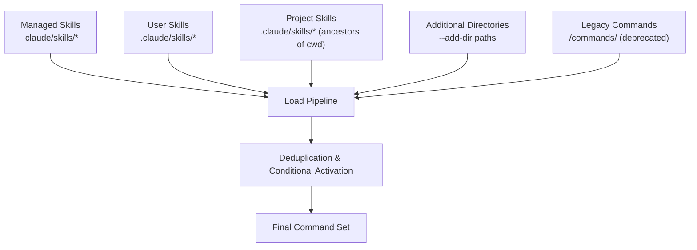
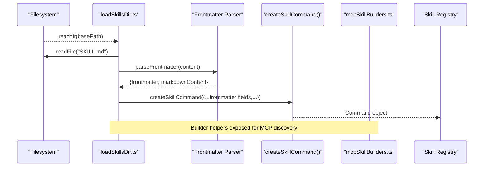
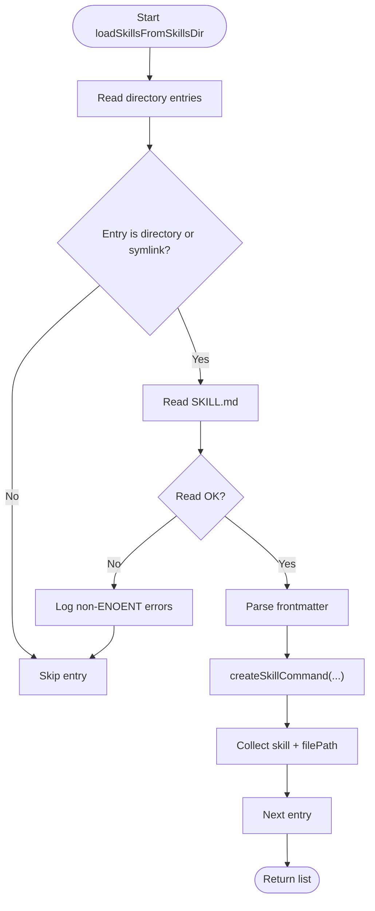
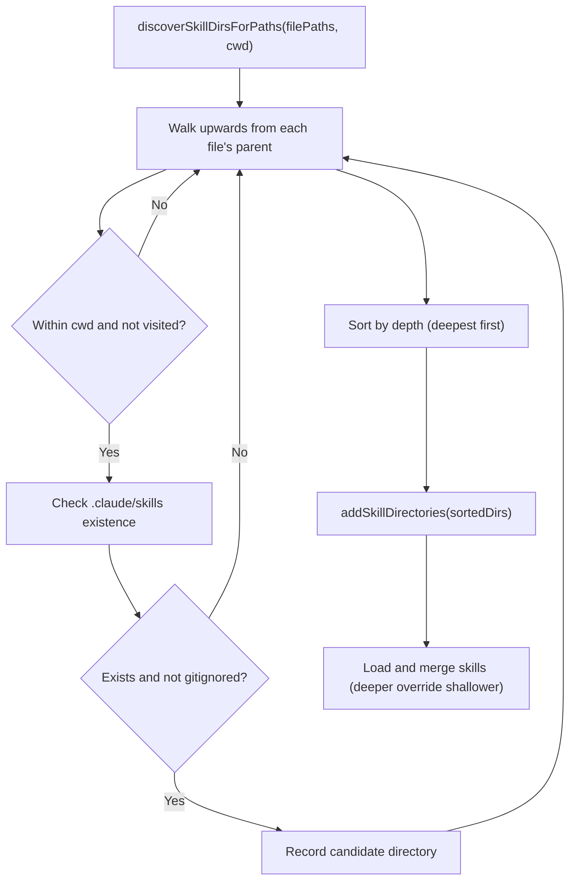
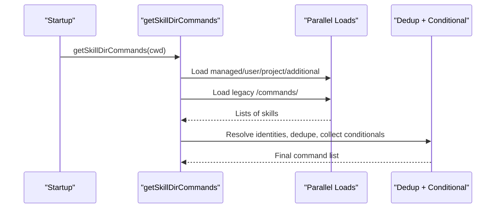
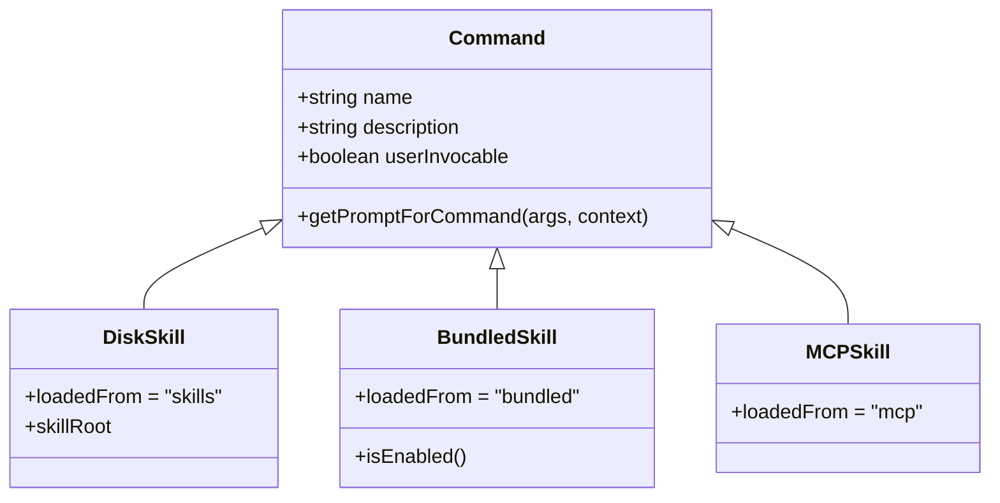
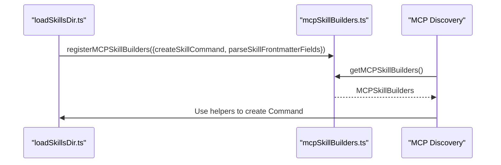
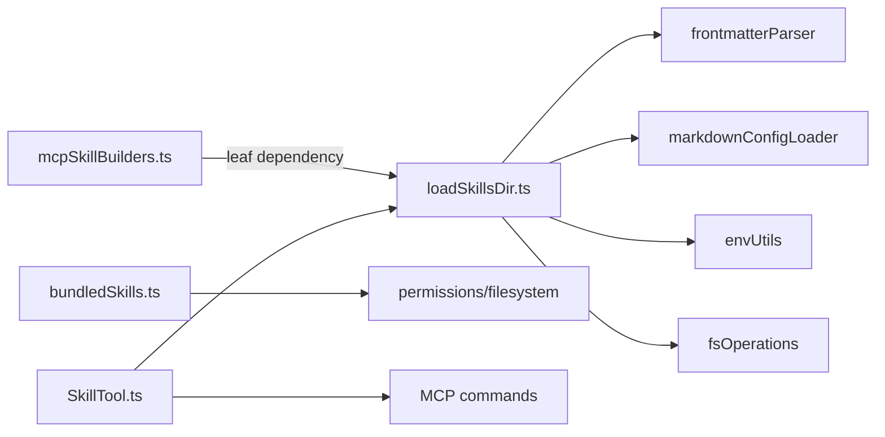

# Disk-Based Skills

<cite>
**Referenced Files in This Document**
- [loadSkillsDir.ts](file://restored-src/src/skills/loadSkillsDir.ts)
- [mcpSkillBuilders.ts](file://restored-src/src/skills/mcpSkillBuilders.ts)
- [bundledSkills.ts](file://restored-src/src/skills/bundledSkills.ts)
- [SkillTool.ts](file://restored-src/src/tools/SkillTool/SkillTool.ts)
- [init.ts](file://restored-src/src/commands/init.ts)
- [init-verifiers.ts](file://restored-src/src/commands/init-verifiers.ts)
- [schemas.ts](file://restored-src/src/utils/plugins/schemas.ts)
</cite>

## Table of Contents
1. [Introduction](#introduction)
2. [Project Structure](#project-structure)
3. [Core Components](#core-components)
4. [Architecture Overview](#architecture-overview)
5. [Detailed Component Analysis](#detailed-component-analysis)
6. [Dependency Analysis](#dependency-analysis)
7. [Performance Considerations](#performance-considerations)
8. [Troubleshooting Guide](#troubleshooting-guide)
9. [Conclusion](#conclusion)
10. [Appendices](#appendices)

## Introduction
This document explains how disk-based skills are discovered, loaded, validated, and integrated into the broader skill system. It covers the skill directory scanning and discovery process, the file structure and naming conventions, metadata requirements via frontmatter, validation and error handling, and the relationship with bundled and MCP-based skills. It also documents the MCP skill builder registry and how it integrates with the skill architecture, and provides practical guidance for creating, organizing, and distributing custom disk-based skills.

## Project Structure
Disk-based skills are organized under a standardized directory structure and loaded from multiple sources:
- Managed skills: installed under a managed configuration path
- User skills: located under the user’s Claude configuration directory
- Project skills: placed under project directories along the path hierarchy
- Additional directories: explicitly added via a command-line option
- Legacy commands: support for older directory and file formats

**Diagram sources**
- [loadSkillsDir.ts:638-804](file://restored-src/src/skills/loadSkillsDir.ts#L638-L804)

**Section sources**
- [loadSkillsDir.ts:638-804](file://restored-src/src/skills/loadSkillsDir.ts#L638-L804)

## Core Components
- Skill loader: scans directories, reads SKILL.md, parses frontmatter, constructs Command objects, and deduplicates by canonical file identity
- Conditional skill activation: activates skills whose path patterns match edited files
- Dynamic discovery: discovers and loads skills from directories near touched files during a session
- MCP skill builder registry: exposes creation and parsing helpers to MCP discovery without introducing import cycles
- Bundled skills: built-in skills packaged with the CLI that follow the same Command interface

**Section sources**
- [loadSkillsDir.ts:407-480](file://restored-src/src/skills/loadSkillsDir.ts#L407-L480)
- [loadSkillsDir.ts:818-1058](file://restored-src/src/skills/loadSkillsDir.ts#L818-L1058)
- [mcpSkillBuilders.ts:26-44](file://restored-src/src/skills/mcpSkillBuilders.ts#L26-L44)
- [bundledSkills.ts:15-100](file://restored-src/src/skills/bundledSkills.ts#L15-L100)

## Architecture Overview
The skill loading pipeline is designed to be robust, secure, and extensible. It supports:
- Multiple discovery sources with precedence
- Safe file identity resolution to avoid duplicates
- Git-ignored path filtering for dynamic discovery
- Conditional skills activated by file path patterns
- Integration with MCP skills via a builder registry

**Diagram sources**
- [loadSkillsDir.ts:407-480](file://restored-src/src/skills/loadSkillsDir.ts#L407-L480)
- [mcpSkillBuilders.ts:26-44](file://restored-src/src/skills/mcpSkillBuilders.ts#L26-L44)

## Detailed Component Analysis

### Skill Loading Mechanism
- Directory scanning: Reads entries from a base path and expects each entry to be a directory named after the skill, containing a SKILL.md file
- File reading: Reads SKILL.md with UTF-8 encoding; missing files are ignored except for non-ENOENT errors which are logged
- Frontmatter parsing: Extracts metadata fields and content; defaults and validations are applied
- Command construction: Builds a Command object with prompt behavior, argument substitution, and optional shell execution
- Deduplication: Resolves real paths to detect symlinks and overlapping directories; first-wins precedence

**Diagram sources**
- [loadSkillsDir.ts:407-480](file://restored-src/src/skills/loadSkillsDir.ts#L407-L480)

**Section sources**
- [loadSkillsDir.ts:407-480](file://restored-src/src/skills/loadSkillsDir.ts#L407-L480)

### Directory Scanning and Discovery
- Static discovery: Loads from managed, user, project, and additional directories at startup
- Dynamic discovery: Walks up from file paths to locate nearest .claude/skills directories, respecting gitignore rules
- Conditional skills: Skills with path patterns are stored until a matching file is touched, then activated and merged into the active set

**Diagram sources**
- [loadSkillsDir.ts:861-915](file://restored-src/src/skills/loadSkillsDir.ts#L861-L915)
- [loadSkillsDir.ts:923-975](file://restored-src/src/skills/loadSkillsDir.ts#L923-L975)

**Section sources**
- [loadSkillsDir.ts:861-915](file://restored-src/src/skills/loadSkillsDir.ts#L861-L915)
- [loadSkillsDir.ts:923-975](file://restored-src/src/skills/loadSkillsDir.ts#L923-L975)

### Skill Discovery Process
- Static sources: Managed, user, project, and additional directories are scanned in parallel
- Policy and gating: Respect environment toggles and plugin-only restrictions
- Legacy commands: Deprecated /commands/ support remains for backward compatibility
- Final assembly: Deduplicate by canonical file identity, separate conditional skills, and emit signals to notify dependents

**Diagram sources**
- [loadSkillsDir.ts:638-804](file://restored-src/src/skills/loadSkillsDir.ts#L638-L804)

**Section sources**
- [loadSkillsDir.ts:638-804](file://restored-src/src/skills/loadSkillsDir.ts#L638-L804)

### Skill File Structure, Naming Conventions, and Metadata
- File structure: Each skill resides in a directory named after the skill; the instruction file is SKILL.md
- Naming convention: The directory name becomes the skill name; legacy support allows SKILL.md inside any directory or single .md files in /commands/
- Frontmatter fields: Supported fields include display name, description fallback, allowed tools, arguments, when-to-use, version, model, disable-model-invocation, user-invocable, hooks, execution context, agent, effort, and shell execution settings
- Paths frontmatter: Optional path patterns enable conditional activation based on edited files

**Section sources**
- [loadSkillsDir.ts:407-480](file://restored-src/src/skills/loadSkillsDir.ts#L407-L480)
- [loadSkillsDir.ts:159-178](file://restored-src/src/skills/loadSkillsDir.ts#L159-L178)
- [loadSkillsDir.ts:185-265](file://restored-src/src/skills/loadSkillsDir.ts#L185-L265)

### Validation, Error Handling, and Loading Failures
- Filesystem errors: Non-ENOENT errors during read are logged; inaccessible filesystems are handled gracefully
- Identity resolution: Uses realpath to detect duplicates across symlinks and overlapping parents
- Git-ignored filtering: Dynamic discovery checks gitignore to avoid loading from ignored subtrees
- Frontmatter validation: Hooks schema is validated; invalid effort values are logged with allowed options
- Conditional activation: Ignores invalid or out-of-scope paths and continues processing

**Section sources**
- [loadSkillsDir.ts:413-458](file://restored-src/src/skills/loadSkillsDir.ts#L413-L458)
- [loadSkillsDir.ts:118-124](file://restored-src/src/skills/loadSkillsDir.ts#L118-L124)
- [loadSkillsDir.ts:882-902](file://restored-src/src/skills/loadSkillsDir.ts#L882-L902)
- [loadSkillsDir.ts:228-236](file://restored-src/src/skills/loadSkillsDir.ts#L228-L236)

### Relationship Between Disk-Based Skills and the Broader Skill System
- Unified Command interface: Both disk-based and bundled skills conform to the same Command type and are merged into the active command set
- MCP integration: MCP skills are treated as prompts with loadedFrom='mcp'; they are filtered out of general discovery but included in tool lists when available
- Tool integration: SkillTool aggregates local and MCP skills, deduplicating by name

**Diagram sources**
- [loadSkillsDir.ts:316-401](file://restored-src/src/skills/loadSkillsDir.ts#L316-L401)
- [bundledSkills.ts:75-99](file://restored-src/src/skills/bundledSkills.ts#L75-L99)
- [SkillTool.ts:81-94](file://restored-src/src/tools/SkillTool/SkillTool.ts#L81-L94)

**Section sources**
- [bundledSkills.ts:75-99](file://restored-src/src/skills/bundledSkills.ts#L75-L99)
- [SkillTool.ts:81-94](file://restored-src/src/tools/SkillTool/SkillTool.ts#L81-L94)

### MCP Skill Builders and Integration
- Builder registry: Exposes createSkillCommand and parseSkillFrontmatterFields to MCP discovery via a leaf module to avoid circular dependencies
- Registration timing: Happens at module initialization of loadSkillsDir.ts, ensuring availability before any MCP server connects
- Usage: MCP discovery uses these helpers to construct Command objects consistently with disk-based skills

**Diagram sources**
- [loadSkillsDir.ts:1077-1086](file://restored-src/src/skills/loadSkillsDir.ts#L1077-L1086)
- [mcpSkillBuilders.ts:26-44](file://restored-src/src/skills/mcpSkillBuilders.ts#L26-L44)

**Section sources**
- [mcpSkillBuilders.ts:26-44](file://restored-src/src/skills/mcpSkillBuilders.ts#L26-L44)
- [loadSkillsDir.ts:1077-1086](file://restored-src/src/skills/loadSkillsDir.ts#L1077-L1086)

### Practical Examples and Best Practices
- Creating a custom disk-based skill:
  - Place instructions in .claude/skills/<skill-name>/SKILL.md
  - Use frontmatter to define behavior, arguments, and optional paths for conditional activation
  - Keep SKILL.md readable and scoped to the skill’s purpose
- Organization patterns:
  - Use descriptive directory names that reflect the skill’s intent
  - Group related skills under subdirectories when appropriate
  - Prefer declarative frontmatter for tool permissions, models, and effort
- Distribution and management:
  - Share SKILL.md content across environments; rely on frontmatter for environment-specific behavior
  - Use conditional paths to tailor skills to specific file types or locations
  - Leverage dynamic discovery by placing skills near the files they operate on

**Section sources**
- [init.ts:157-170](file://restored-src/src/commands/init.ts#L157-L170)
- [init-verifiers.ts:166-206](file://restored-src/src/commands/init-verifiers.ts#L166-L206)

## Dependency Analysis
- Coupling:
  - loadSkillsDir.ts depends on frontmatter parsing, markdown loaders, environment utilities, and filesystem abstraction
  - mcpSkillBuilders.ts is a leaf dependency graph node that depends only on types
  - bundledSkills.ts encapsulates bundled skill extraction and safety
- Cohesion:
  - Each module focuses on a single responsibility: discovery, building, bundling, or tool integration
- External dependencies:
  - ignore for path pattern matching
  - lodash-es memoize for caching
  - fs promises and path utilities

**Diagram sources**
- [loadSkillsDir.ts:1-66](file://restored-src/src/skills/loadSkillsDir.ts#L1-L66)
- [mcpSkillBuilders.ts:1-44](file://restored-src/src/skills/mcpSkillBuilders.ts#L1-L44)
- [bundledSkills.ts:1-10](file://restored-src/src/skills/bundledSkills.ts#L1-L10)
- [SkillTool.ts:77-94](file://restored-src/src/tools/SkillTool/SkillTool.ts#L77-L94)

**Section sources**
- [loadSkillsDir.ts:1-66](file://restored-src/src/skills/loadSkillsDir.ts#L1-L66)
- [mcpSkillBuilders.ts:1-44](file://restored-src/src/skills/mcpSkillBuilders.ts#L1-L44)
- [bundledSkills.ts:1-10](file://restored-src/src/skills/bundledSkills.ts#L1-L10)
- [SkillTool.ts:77-94](file://restored-src/src/tools/SkillTool/SkillTool.ts#L77-L94)

## Performance Considerations
- Caching: The main discovery function is memoized to avoid repeated filesystem scans
- Parallelism: Multiple discovery sources are loaded concurrently
- Conditional skills: Stored separately and activated only when needed, reducing runtime overhead
- Safe writes: Bundled skills extract files with atomic flags to minimize contention and retries

[No sources needed since this section provides general guidance]

## Troubleshooting Guide
- Missing SKILL.md: The loader ignores entries without a SKILL.md; ensure the file exists and is readable
- Permission errors: Non-ENOENT filesystem errors are logged; verify file permissions and accessibility
- Duplicate skills: Symlinked or overlapping directories are deduplicated by canonical path; check for identical files under different names
- Git-ignored directories: Dynamic discovery skips directories that are gitignored; adjust .gitignore rules if skills are not appearing
- Conditional skills not activating: Verify path patterns and that the files being edited fall within the configured paths
- MCP builder not registered: Ensure loadSkillsDir.ts is initialized before MCP discovery attempts to use the builder helpers

**Section sources**
- [loadSkillsDir.ts:433-445](file://restored-src/src/skills/loadSkillsDir.ts#L433-L445)
- [loadSkillsDir.ts:882-902](file://restored-src/src/skills/loadSkillsDir.ts#L882-L902)
- [loadSkillsDir.ts:1077-1086](file://restored-src/src/skills/loadSkillsDir.ts#L1077-L1086)

## Conclusion
Disk-based skills provide a flexible, secure, and scalable way to define reusable instructions backed by frontmatter-driven metadata. The loader’s design emphasizes correctness (deduplication, gitignore filtering), performance (memoization, parallelism), and extensibility (conditional skills, dynamic discovery, MCP integration). By following the naming conventions and metadata patterns outlined here, developers can create robust, distributable skills that integrate seamlessly with the broader skill system.

## Appendices

### Appendix A: Frontmatter Fields Reference
- name: Display name for the skill
- description: Human-readable description; fallback to markdown extraction if omitted
- allowed-tools: Tools permitted in the skill prompt
- arguments: Argument names for dynamic substitution
- argument-hint: Optional hint for argument usage
- when_to_use: Guidance on when to invoke the skill
- version: Optional semantic version
- model: Model specification or “inherit”
- disable_model_invocation: Prevent model invocation from the skill prompt
- user_invocable: Whether the skill can be invoked by the user
- hooks: Hook configuration validated by schema
- context: Execution context (“fork”)
- agent: Agent identifier
- effort: Effort value (level or integer)
- shell: Shell execution settings
- paths: Path patterns enabling conditional activation

**Section sources**
- [loadSkillsDir.ts:185-265](file://restored-src/src/skills/loadSkillsDir.ts#L185-L265)

### Appendix B: File Path Validation for Bundled Skills
- Ensures safe extraction by rejecting absolute or traversing paths
- Writes files with restrictive permissions and atomic flags to prevent race conditions

**Section sources**
- [bundledSkills.ts:195-206](file://restored-src/src/skills/bundledSkills.ts#L195-L206)
- [bundledSkills.ts:176-193](file://restored-src/src/skills/bundledSkills.ts#L176-L193)