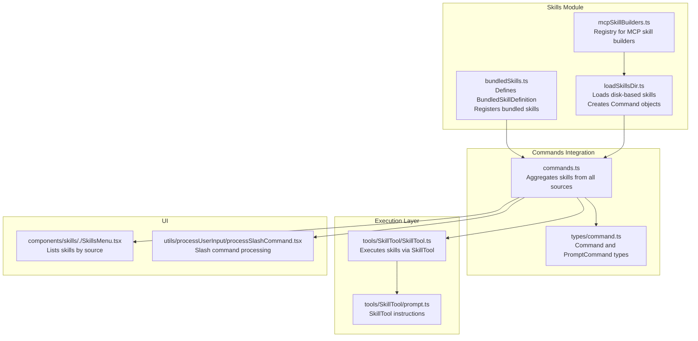
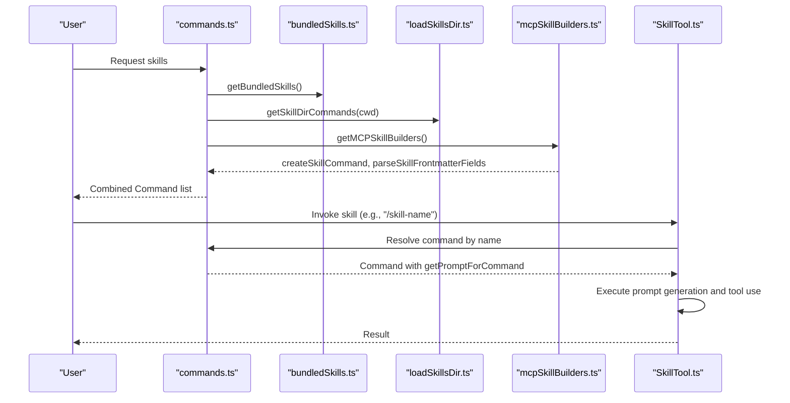
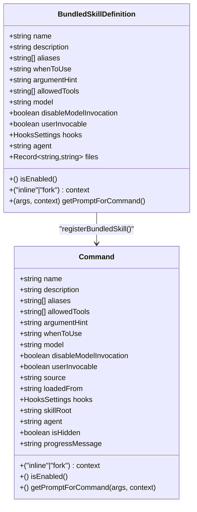
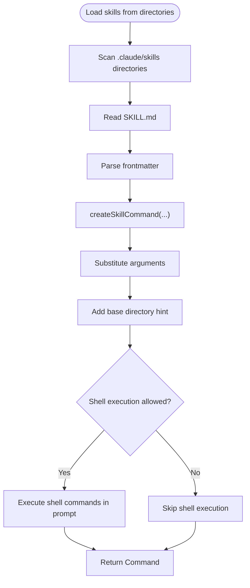
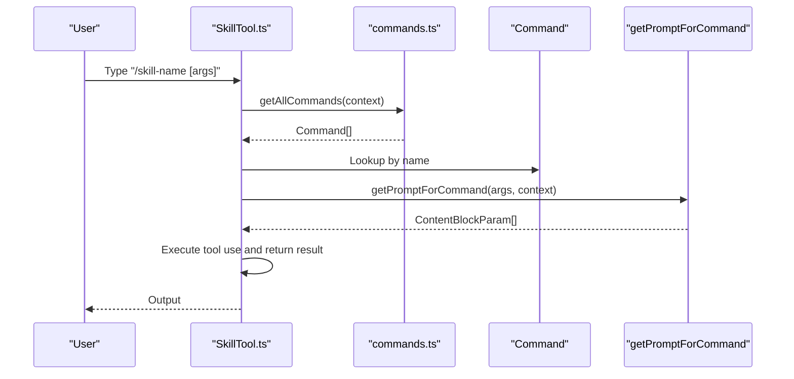
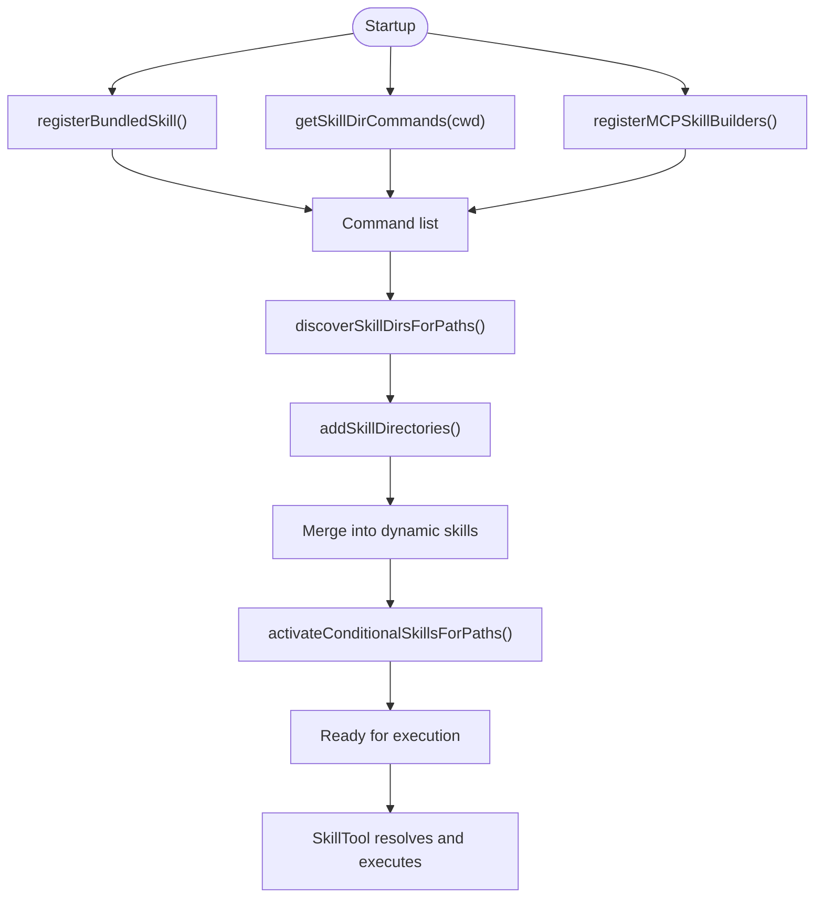
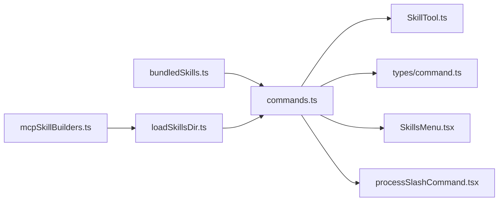

# Skill Architecture

<cite>
**Referenced Files in This Document**
- [bundledSkills.ts](file://claude_code_src/restored-src/src/skills/bundledSkills.ts)
- [loadSkillsDir.ts](file://claude_code_src/restored-src/src/skills/loadSkillsDir.ts)
- [mcpSkillBuilders.ts](file://claude_code_src/restored-src/src/skills/mcpSkillBuilders.ts)
- [command.ts](file://claude_code_src/restored-src/src/types/command.ts)
- [commands.ts](file://claude_code_src/restored-src/src/commands.ts)
- [SkillTool.ts](file://claude_code_src/restored-src/src/tools/SkillTool/SkillTool.ts)
- [prompt.ts](file://claude_code_src/restored-src/src/tools/SkillTool/prompt.ts)
- [SkillsMenu.tsx](file://claude_code_src/restored-src/src/components/skills/./SkillsMenu.tsx)
- [processSlashCommand.tsx](file://claude_code_src/restored-src/src/utils/processUserInput/processSlashCommand.tsx)
</cite>

## Table of Contents
1. [Introduction](#introduction)
2. [Project Structure](#project-structure)
3. [Core Components](#core-components)
4. [Architecture Overview](#architecture-overview)
5. [Detailed Component Analysis](#detailed-component-analysis)
6. [Dependency Analysis](#dependency-analysis)
7. [Performance Considerations](#performance-considerations)
8. [Troubleshooting Guide](#troubleshooting-guide)
9. [Conclusion](#conclusion)

## Introduction
This document explains the skill architecture used by the Claude Code system. It covers how skills are defined, registered, and executed; how bundled skills differ from disk-based skills; and how skills relate to commands. It also documents skill metadata, lifecycle, extraction and security mechanisms, and the command wrapper that turns skills into executable commands.

## Project Structure
Skills are defined and managed primarily in the skills module, with integration points across commands, tools, and UI components:
- Skills definition and bundled skill registration live in the skills module.
- Disk-based skills are loaded from filesystem directories and transformed into commands.
- The SkillTool and related UI surfaces expose skills to users and orchestrate execution.

**Diagram sources**
- [bundledSkills.ts](file://claude_code_src/restored-src/src/skills/bundledSkills.ts)
- [loadSkillsDir.ts](file://claude_code_src/restored-src/src/skills/loadSkillsDir.ts)
- [mcpSkillBuilders.ts](file://claude_code_src/restored-src/src/skills/mcpSkillBuilders.ts)
- [commands.ts](file://claude_code_src/restored-src/src/commands.ts)
- [command.ts](file://claude_code_src/restored-src/src/types/command.ts)
- [SkillTool.ts](file://claude_code_src/restored-src/src/tools/SkillTool/SkillTool.ts)
- [prompt.ts](file://claude_code_src/restored-src/src/tools/SkillTool/prompt.ts)
- [SkillsMenu.tsx](file://claude_code_src/restored-src/src/components/skills/./SkillsMenu.tsx)
- [processSlashCommand.tsx](file://claude_code_src/restored-src/src/utils/processUserInput/processSlashCommand.tsx)

**Section sources**
- [bundledSkills.ts](file://claude_code_src/restored-src/src/skills/bundledSkills.ts)
- [loadSkillsDir.ts](file://claude_code_src/restored-src/src/skills/loadSkillsDir.ts)
- [mcpSkillBuilders.ts](file://claude_code_src/restored-src/src/skills/mcpSkillBuilders.ts)
- [commands.ts](file://claude_code_src/restored-src/src/commands.ts)
- [command.ts](file://claude_code_src/restored-src/src/types/command.ts)
- [SkillTool.ts](file://claude_code_src/restored-src/src/tools/SkillTool/SkillTool.ts)
- [prompt.ts](file://claude_code_src/restored-src/src/tools/SkillTool/prompt.ts)
- [SkillsMenu.tsx](file://claude_code_src/restored-src/src/components/skills/./SkillsMenu.tsx)
- [processSlashCommand.tsx](file://claude_code_src/restored-src/src/utils/processUserInput/processSlashCommand.tsx)

## Core Components
- BundledSkillDefinition: Defines the shape of a skill compiled into the CLI, including metadata, optional file extraction, and prompt generation hook.
- registerBundledSkill: Registers a bundled skill and converts it into a Command with lazy extraction of reference files.
- getBundledSkills: Retrieves the list of bundled skills.
- loadSkillsDir: Loads disk-based skills from filesystem directories, parses frontmatter, and creates Command objects.
- createSkillCommand: Factory that produces a Command from parsed skill data.
- parseSkillFrontmatterFields: Shared parsing of frontmatter fields across file-based and MCP skills.
- mcpSkillBuilders: Registry for builder functions used by MCP skill discovery to avoid circular dependencies.
- Command type: Unified representation of skills and commands, including metadata, permissions, and prompt generation.

**Section sources**
- [bundledSkills.ts](file://claude_code_src/restored-src/src/skills/bundledSkills.ts)
- [loadSkillsDir.ts](file://claude_code_src/restored-src/src/skills/loadSkillsDir.ts)
- [mcpSkillBuilders.ts](file://claude_code_src/restored-src/src/skills/mcpSkillBuilders.ts)
- [command.ts](file://claude_code_src/restored-src/src/types/command.ts)

## Architecture Overview
The skill architecture integrates three sources:
- Bundled skills: Compiled into the CLI and registered at startup.
- Disk-based skills: Loaded from filesystem directories (.claude/skills) with frontmatter parsing and optional path-based activation.
- MCP skills: Discovered dynamically via MCP servers and integrated through a builder registry.

**Diagram sources**
- [commands.ts](file://claude_code_src/restored-src/src/commands.ts)
- [bundledSkills.ts](file://claude_code_src/restored-src/src/skills/bundledSkills.ts)
- [loadSkillsDir.ts](file://claude_code_src/restored-src/src/skills/loadSkillsDir.ts)
- [mcpSkillBuilders.ts](file://claude_code_src/restored-src/src/skills/mcpSkillBuilders.ts)
- [SkillTool.ts](file://claude_code_src/restored-src/src/tools/SkillTool/SkillTool.ts)

## Detailed Component Analysis

### BundledSkillDefinition and Registration
Bundled skills are defined by a typed interface and registered at startup. The registration process:
- Accepts a definition with metadata (name, description, aliases, allowedTools, etc.) and a prompt-generation hook.
- Optionally extracts reference files to a deterministic directory on first invocation.
- Wraps the definition into a Command with appropriate fields and a memoized prompt generator.

**Diagram sources**
- [bundledSkills.ts](file://claude_code_src/restored-src/src/skills/bundledSkills.ts)
- [command.ts](file://claude_code_src/restored-src/src/types/command.ts)

Key behaviors:
- Lazy extraction: If files are provided, extraction is performed once per process and the prompt is prefixed with a base directory hint.
- Safe file writing: Uses secure flags and modes to avoid symlink traversal and ensure restrictive permissions.
- Deterministic extraction directory: Based on a per-process nonce to mitigate symlink attacks.

**Section sources**
- [bundledSkills.ts](file://claude_code_src/restored-src/src/skills/bundledSkills.ts)

### Disk-Based Skills Loading and Command Creation
Disk-based skills are loaded from .claude/skills directories. The loader:
- Scans directories and reads SKILL.md files.
- Parses frontmatter and constructs a Command with prompt generation that supports argument substitution, shell execution, and base directory hints.
- Handles legacy /commands/ directory format and deduplicates by canonical file identity.

**Diagram sources**
- [loadSkillsDir.ts](file://claude_code_src/restored-src/src/skills/loadSkillsDir.ts)

**Section sources**
- [loadSkillsDir.ts](file://claude_code_src/restored-src/src/skills/loadSkillsDir.ts)

### MCP Skill Builders Registry
To avoid circular dependencies, builder functions used by MCP discovery are exposed through a leaf module that depends only on types. Registration occurs at module initialization, ensuring availability before any MCP server connects.

**Section sources**
- [mcpSkillBuilders.ts](file://claude_code_src/restored-src/src/skills/mcpSkillBuilders.ts)

### Command Wrapper and Execution
Skills are represented as Command objects with a getPromptForCommand method. The SkillTool orchestrates invocation:
- Normalizes skill names (removes leading slash).
- Resolves commands from all sources (bundled, disk-based, MCP, plugins).
- Generates the prompt via getPromptForCommand and executes tool use.

**Diagram sources**
- [SkillTool.ts](file://claude_code_src/restored-src/src/tools/SkillTool/SkillTool.ts)
- [commands.ts](file://claude_code_src/restored-src/src/commands.ts)

**Section sources**
- [SkillTool.ts](file://claude_code_src/restored-src/src/tools/SkillTool/SkillTool.ts)
- [commands.ts](file://claude_code_src/restored-src/src/commands.ts)

### Skill Metadata Fields
Common metadata fields supported across bundled and disk-based skills include:
- name, description, aliases, whenToUse, argumentHint, allowedTools, model, disableModelInvocation, userInvocable, hooks, context, agent, version, effort, shell, paths (conditional skills), and source/loadedFrom.

These fields are parsed and applied consistently across createSkillCommand and the Command type.

**Section sources**
- [loadSkillsDir.ts](file://claude_code_src/restored-src/src/skills/loadSkillsDir.ts)
- [command.ts](file://claude_code_src/restored-src/src/types/command.ts)

### Relationship Between Skills and Commands
- Skills are a specialization of Command with a prompt-producing getPromptForCommand method.
- Both bundled and disk-based skills are unified under the Command type and surfaced through the same command resolution and execution pipeline.
- UI surfaces (SkillsMenu) and user input processors (processSlashCommand) treat skills as Commands.

**Section sources**
- [command.ts](file://claude_code_src/restored-src/src/types/command.ts)
- [SkillsMenu.tsx](file://claude_code_src/restored-src/src/components/skills/./SkillsMenu.tsx)
- [processSlashCommand.tsx](file://claude_code_src/restored-src/src/utils/processUserInput/processSlashCommand.tsx)

### Lifecycle: Registration to Execution
- Registration: Bundled skills are registered at startup; disk-based and MCP skills are loaded on demand.
- Discovery: getSkillDirCommands aggregates skills from managed, user, project, and additional directories; legacy /commands/ support is included.
- Deduplication: Canonical file identity prevents duplicates from symlinks or overlapping directories.
- Dynamic discovery: New skill directories discovered during a session are merged with precedence based on proximity to files.
- Conditional skills: Skills with path filters are stored and activated when matching files are touched.
- Execution: SkillTool resolves the command and invokes getPromptForCommand to generate the prompt.

**Diagram sources**
- [bundledSkills.ts](file://claude_code_src/restored-src/src/skills/bundledSkills.ts)
- [loadSkillsDir.ts](file://claude_code_src/restored-src/src/skills/loadSkillsDir.ts)
- [mcpSkillBuilders.ts](file://claude_code_src/restored-src/src/skills/mcpSkillBuilders.ts)
- [SkillTool.ts](file://claude_code_src/restored-src/src/tools/SkillTool/SkillTool.ts)

**Section sources**
- [bundledSkills.ts](file://claude_code_src/restored-src/src/skills/bundledSkills.ts)
- [loadSkillsDir.ts](file://claude_code_src/restored-src/src/skills/loadSkillsDir.ts)
- [SkillTool.ts](file://claude_code_src/restored-src/src/tools/SkillTool/SkillTool.ts)

### Difference Between Bundled and Disk-Based Skills
- Bundled skills: Compiled into the CLI, registered at startup, optionally extract files on first invocation, and are always available.
- Disk-based skills: Loaded from filesystem directories, support frontmatter-driven configuration, conditional activation by path patterns, and can be affected by permissions and gitignore rules.

**Section sources**
- [bundledSkills.ts](file://claude_code_src/restored-src/src/skills/bundledSkills.ts)
- [loadSkillsDir.ts](file://claude_code_src/restored-src/src/skills/loadSkillsDir.ts)

### Skill Extraction, File Management, and Security
- Extraction: Reference files are written once per process to a deterministic directory derived from a per-process nonce. A closure memoizes the extraction promise to avoid races.
- Path safety: Relative paths are normalized and validated to prevent traversal; absolute paths and parent directory escapes are rejected.
- Secure writes: Uses platform-specific safe flags and exclusive open modes with restrictive permissions to prevent symlink-based attacks and ensure ownership.
- Base directory hint: When files are extracted, the prompt is prefixed with a base directory hint so the model can reference them via Read/Grep.

**Section sources**
- [bundledSkills.ts](file://claude_code_src/restored-src/src/skills/bundledSkills.ts)

## Dependency Analysis
- bundledSkills.ts depends on Command type and utility modules for permissions and logging.
- loadSkillsDir.ts depends on frontmatter parsing, markdown loaders, filesystem utilities, and settings; it exposes builder functions via mcpSkillBuilders.ts.
- commands.ts aggregates skills from all sources and serves as the central registry for command resolution.
- SkillTool.ts depends on the unified command registry to resolve and execute skills.

**Diagram sources**
- [bundledSkills.ts](file://claude_code_src/restored-src/src/skills/bundledSkills.ts)
- [loadSkillsDir.ts](file://claude_code_src/restored-src/src/skills/loadSkillsDir.ts)
- [mcpSkillBuilders.ts](file://claude_code_src/restored-src/src/skills/mcpSkillBuilders.ts)
- [commands.ts](file://claude_code_src/restored-src/src/commands.ts)
- [command.ts](file://claude_code_src/restored-src/src/types/command.ts)
- [SkillTool.ts](file://claude_code_src/restored-src/src/tools/SkillTool/SkillTool.ts)
- [SkillsMenu.tsx](file://claude_code_src/restored-src/src/components/skills/./SkillsMenu.tsx)
- [processSlashCommand.tsx](file://claude_code_src/restored-src/src/utils/processUserInput/processSlashCommand.tsx)

**Section sources**
- [bundledSkills.ts](file://claude_code_src/restored-src/src/skills/bundledSkills.ts)
- [loadSkillsDir.ts](file://claude_code_src/restored-src/src/skills/loadSkillsDir.ts)
- [mcpSkillBuilders.ts](file://claude_code_src/restored-src/src/skills/mcpSkillBuilders.ts)
- [commands.ts](file://claude_code_src/restored-src/src/commands.ts)
- [command.ts](file://claude_code_src/restored-src/src/types/command.ts)
- [SkillTool.ts](file://claude_code_src/restored-src/src/tools/SkillTool/SkillTool.ts)
- [SkillsMenu.tsx](file://claude_code_src/restored-src/src/components/skills/./SkillsMenu.tsx)
- [processSlashCommand.tsx](file://claude_code_src/restored-src/src/utils/processUserInput/processSlashCommand.tsx)

## Performance Considerations
- Memoization: Bundled skill extraction is memoized per process to avoid redundant disk writes.
- Parallelism: Directory scanning and filesystem operations are parallelized where possible.
- Caching: Skill directory commands are cached and cleared selectively to balance freshness and performance.
- Conditional skills: Stored separately and activated only when matching files are touched, reducing overhead when not needed.

[No sources needed since this section provides general guidance]

## Troubleshooting Guide
- Skills not appearing:
  - Verify directory layout (.claude/skills/<skill>/SKILL.md) and frontmatter validity.
  - Check for duplicates via canonical file identity and deduplication logs.
  - Confirm policy restrictions or plugin-only mode are not blocking discovery.
- Permission or IO errors:
  - Review logs for ENOENT, EACCES, or EIO errors when reading SKILL.md.
- Conditional skills not activating:
  - Ensure paths frontmatter patterns match the relative paths of touched files.
  - Confirm cwd-relative matching and that files are within the project scope.
- Dynamic discovery not triggering:
  - Confirm projectSettings is enabled and not restricted to plugin-only.
  - Verify that the skill directories exist and are not gitignored.

**Section sources**
- [loadSkillsDir.ts](file://claude_code_src/restored-src/src/skills/loadSkillsDir.ts)

## Conclusion
The skill architecture in Claude Code unifies bundled and disk-based skills behind a single Command abstraction. Bundled skills offer immediate availability with optional file extraction and strong security defaults. Disk-based skills provide flexibility through frontmatter-driven configuration, conditional activation, and dynamic discovery. The SkillTool and UI surfaces integrate these capabilities into a cohesive user experience, enabling precise, permission-aware skill invocation.