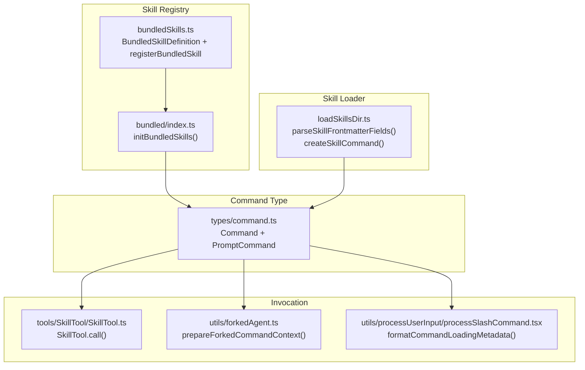
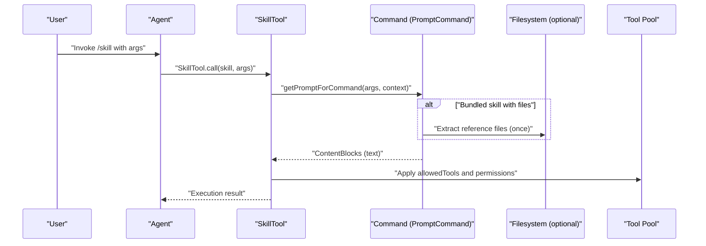
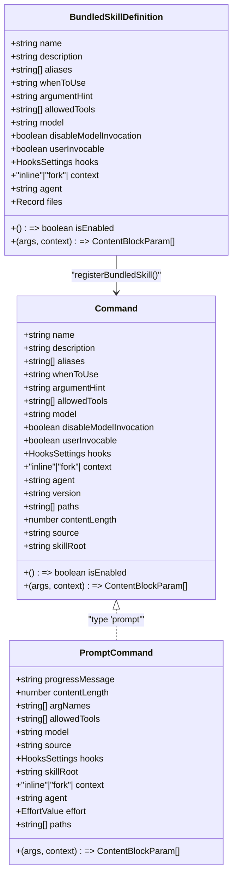
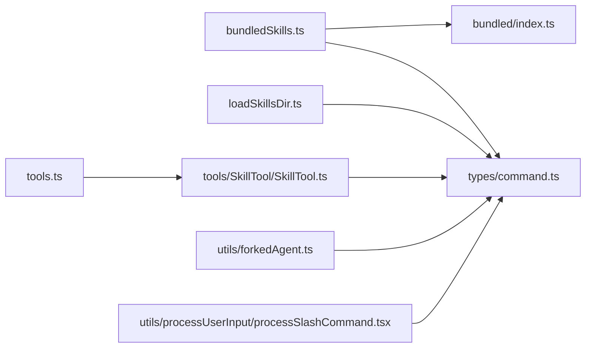

# Skill Development Guide

<cite>
**Referenced Files in This Document**
- [bundledSkills.ts](file://restored-src/src/skills/bundledSkills.ts)
- [loadSkillsDir.ts](file://restored-src/src/skills/loadSkillsDir.ts)
- [index.ts](file://restored-src/src/skills/bundled/index.ts)
- [command.ts](file://restored-src/src/types/command.ts)
- [SkillTool.ts](file://restored-src/src/tools/SkillTool/SkillTool.ts)
- [SkillTool prompt.ts](file://restored-src/src/tools/SkillTool/prompt.ts)
- [forkedAgent.ts](file://restored-src/src/utils/forkedAgent.ts)
- [processSlashCommand.tsx](file://restored-src/src/utils/processUserInput/processSlashCommand.tsx)
- [skillify.ts](file://restored-src/src/skills/bundled/skillify.ts)
- [remember.ts](file://restored-src/src/skills/bundled/remember.ts)
- [batch.ts](file://restored-src/src/skills/bundled/batch.ts)
- [verify.ts](file://restored-src/src/skills/bundled/verify.ts)
- [verifyContent.ts](file://restored-src/src/skills/bundled/verifyContent.ts)
- [tools.ts](file://restored-src/src/tools.ts)
</cite>

## Table of Contents
1. [Introduction](#introduction)
2. [Project Structure](#project-structure)
3. [Core Components](#core-components)
4. [Architecture Overview](#architecture-overview)
5. [Detailed Component Analysis](#detailed-component-analysis)
6. [Dependency Analysis](#dependency-analysis)
7. [Performance Considerations](#performance-considerations)
8. [Troubleshooting Guide](#troubleshooting-guide)
9. [Conclusion](#conclusion)
10. [Appendices](#appendices)

## Introduction
This guide explains how to develop custom skills from concept to implementation. It covers the skill lifecycle, the BundledSkillDefinition interface, prompt construction, argument handling, context management, metadata, tool integration, permissions, and model configuration. It includes step-by-step tutorials for simple utility skills and complex multi-step workflows, plus debugging, testing, and performance optimization strategies.

## Project Structure
Skills are defined and loaded through a combination of:
- A registry and builder for bundled skills
- A loader for user-defined skills from disk
- A command type that defines the skill contract
- Tool integration and permission gating
- Invocation mechanisms (SkillTool and slash commands)

**Diagram sources**
- [bundledSkills.ts:15-108](file://restored-src/src/skills/bundledSkills.ts#L15-L108)
- [index.ts:24-80](file://restored-src/src/skills/bundled/index.ts#L24-L80)
- [loadSkillsDir.ts:185-401](file://restored-src/src/skills/loadSkillsDir.ts#L185-L401)
- [command.ts:25-57](file://restored-src/src/types/command.ts#L25-L57)
- [SkillTool.ts:580-592](file://restored-src/src/tools/SkillTool/SkillTool.ts#L580-L592)
- [forkedAgent.ts:191-232](file://restored-src/src/utils/forkedAgent.ts#L191-L232)
- [processSlashCommand.tsx:838-869](file://restored-src/src/utils/processUserInput/processSlashCommand.tsx#L838-L869)

**Section sources**
- [bundledSkills.ts:15-108](file://restored-src/src/skills/bundledSkills.ts#L15-L108)
- [loadSkillsDir.ts:185-401](file://restored-src/src/skills/loadSkillsDir.ts#L185-L401)
- [command.ts:25-57](file://restored-src/src/types/command.ts#L25-L57)

## Core Components
- BundledSkillDefinition: The schema for bundled skills, including metadata, tool permissions, model configuration, and prompt generation.
- Command: The runtime representation of a skill, including flags for invocation, context, agent, and hooks.
- Loader: Parses frontmatter, substitutes arguments, injects environment variables, and optionally executes shell commands embedded in the skill content.
- Invocation: SkillTool and slash commands route to the skill’s getPromptForCommand and enforce permissions and context.

Key responsibilities:
- Metadata: name, description, aliases, whenToUse, argumentHint, version.
- Permissions: allowedTools, userInvocable, disableModelInvocation, isEnabled.
- Model: model, effort, hooks, context (inline vs fork), agent.
- Resources: files for bundled skills (extracted on first use).
- Prompt pipeline: argument substitution, environment variable replacement, optional shell execution, and base directory prefixing.

**Section sources**
- [bundledSkills.ts:15-108](file://restored-src/src/skills/bundledSkills.ts#L15-L108)
- [command.ts:25-57](file://restored-src/src/types/command.ts#L25-L57)
- [loadSkillsDir.ts:185-401](file://restored-src/src/skills/loadSkillsDir.ts#L185-L401)

## Architecture Overview
The skill system centers on a unified Command type. Skills can be:
- Bundled: compiled into the CLI and registered at startup.
- Disk-based: loaded from user/project/managed directories.
- MCP-based: loaded via MCP skill builders (registered separately).

**Diagram sources**
- [SkillTool.ts:580-592](file://restored-src/src/tools/SkillTool/SkillTool.ts#L580-L592)
- [bundledSkills.ts:53-108](file://restored-src/src/skills/bundledSkills.ts#L53-L108)
- [loadSkillsDir.ts:344-401](file://restored-src/src/skills/loadSkillsDir.ts#L344-L401)

## Detailed Component Analysis

### BundledSkillDefinition Interface
BundledSkillDefinition defines the contract for bundled skills. Properties:
- name: Unique skill identifier.
- description: Human-readable description.
- aliases?: Alternate names.
- whenToUse?: Guidance for when to use the skill.
- argumentHint?: Suggested argument format for UX.
- allowedTools?: Tool permission patterns granted to workers.
- model?: Override model for the skill.
- disableModelInvocation?: Prevent model-triggered invocation.
- userInvocable?: Allow user invocation via slash commands.
- isEnabled?(): Conditional visibility.
- hooks?: Hook settings for the skill.
- context?: 'inline' | 'fork'.
- agent?: Agent type when context is 'fork'.
- files?: Reference files to extract on first invocation.
- getPromptForCommand(args, context): Async function returning ContentBlockParam[].

Behavior:
- registerBundledSkill transforms a definition into a Command with source 'bundled', sets defaults, and optionally wraps getPromptForCommand to extract files and prepend a base directory prefix.

**Section sources**
- [bundledSkills.ts:15-108](file://restored-src/src/skills/bundledSkills.ts#L15-L108)
- [bundledSkills.ts:53-108](file://restored-src/src/skills/bundledSkills.ts#L53-L108)

### Command Type and Runtime Behavior
Command extends CommandBase with PromptCommand for skills:
- type: 'prompt'
- progressMessage, contentLength
- argNames, allowedTools, model, source, hooks, skillRoot, context, agent, effort, paths
- getPromptForCommand(args, context): returns ContentBlockParam[]

Disk-based skills:
- parseSkillFrontmatterFields extracts metadata and flags from frontmatter.
- createSkillCommand builds a Command with argument substitution, environment variable replacement, and optional shell execution.

Forked execution:
- prepareForkedCommandContext prepares agent, allowed tools, and messages for context='fork'.

**Section sources**
- [command.ts:25-57](file://restored-src/src/types/command.ts#L25-L57)
- [loadSkillsDir.ts:185-401](file://restored-src/src/skills/loadSkillsDir.ts#L185-L401)
- [forkedAgent.ts:191-232](file://restored-src/src/utils/forkedAgent.ts#L191-L232)

### Prompt Construction and Argument Handling
- Argument substitution: Arguments are substituted into the skill content before shell execution.
- Environment variables:
  - ${CLAUDE_SKILL_DIR} replaced with the skill’s base directory (normalized on Windows).
  - ${CLAUDE_SESSION_ID} replaced with the current session ID.
- Shell execution: Optional inline shell commands are executed in a controlled context, respecting allowedTools and permission context.
- Base directory prefix: For disk-based and bundled skills, a base directory line is prepended to enable model-driven file reads.

**Section sources**
- [loadSkillsDir.ts:344-401](file://restored-src/src/skills/loadSkillsDir.ts#L344-L401)
- [bundledSkills.ts:208-221](file://restored-src/src/skills/bundledSkills.ts#L208-L221)

### Context Management
- context: 'inline' (default) or 'fork'.
- agent: Agent type when forked.
- skillRoot: Base directory for resource access.
- getPromptForCommand returns ContentBlockParam[] suitable for embedding in messages.

**Section sources**
- [command.ts:42-48](file://restored-src/src/types/command.ts#L42-L48)
- [forkedAgent.ts:191-232](file://restored-src/src/utils/forkedAgent.ts#L191-L232)

### Tool Integration and Permission Management
- allowedTools: Minimum tool permission patterns granted to workers.
- assembleToolPool and getMergedTools: Combine built-in and MCP tools, applying deny rules and deduplicating by name.
- SkillTool permission flow: Proposes allow rules and asks for user permission when needed.

**Section sources**
- [tools.ts:345-367](file://restored-src/src/tools.ts#L345-L367)
- [SkillTool.ts:540-592](file://restored-src/src/tools/SkillTool/SkillTool.ts#L540-L592)

### Model Configuration
- model: Optional model override for a skill.
- effort: Effort level for token/time budgeting.
- hooks: Hook settings for the skill.

**Section sources**
- [command.ts:31-39](file://restored-src/src/types/command.ts#L31-L39)
- [loadSkillsDir.ts:207-265](file://restored-src/src/skills/loadSkillsDir.ts#L207-L265)

### Example Skills
- skillify: Guides capturing a session into a reusable skill, with interview prompts and file generation.
- remember: Reviews auto-memory and proposes promotions/cleanup across memory layers.
- batch: Orchestrates parallel work across agents with plan mode and e2e verification.
- verify: Verifies a code change using a bundled skill with reference files.

**Section sources**
- [skillify.ts:158-198](file://restored-src/src/skills/bundled/skillify.ts#L158-L198)
- [remember.ts:64-83](file://restored-src/src/skills/bundled/remember.ts#L64-L83)
- [batch.ts:100-125](file://restored-src/src/skills/bundled/batch.ts#L100-L125)
- [verify.ts:12-31](file://restored-src/src/skills/bundled/verify.ts#L12-L31)
- [verifyContent.ts](file://restored-src/src/skills/bundled/verifyContent.ts)

## Architecture Overview

**Diagram sources**
- [bundledSkills.ts:15-108](file://restored-src/src/skills/bundledSkills.ts#L15-L108)
- [command.ts:25-57](file://restored-src/src/types/command.ts#L25-L57)

## Detailed Component Analysis

### Step-by-Step Tutorial: Simple Utility Skill
Goal: Build a skill that reads a file and summarizes it.

Steps:
1. Define metadata
- name: choose a unique identifier
- description: concise explanation
- argumentHint: optional hint for arguments
- allowedTools: include FileReadTool and BashTool if needed
- userInvocable: true to allow slash command invocation
- disableModelInvocation: default false

2. Construct the prompt
- Use placeholders for arguments and environment variables
- Optionally include ${CLAUDE_SKILL_DIR} for script access

3. Implement getPromptForCommand
- Substitute arguments and environment variables
- Return ContentBlockParam[] with type 'text'

4. Register the skill
- For bundled skills, call registerBundledSkill in initBundledSkills
- For disk-based skills, place SKILL.md under a skills directory and add frontmatter

5. Test
- Invoke via /<name> [args]
- Verify argument substitution and environment variable replacement

**Section sources**
- [bundledSkills.ts:53-108](file://restored-src/src/skills/bundledSkills.ts#L53-L108)
- [loadSkillsDir.ts:344-401](file://restored-src/src/skills/loadSkillsDir.ts#L344-L401)
- [index.ts:24-80](file://restored-src/src/skills/bundled/index.ts#L24-L80)

### Step-by-Step Tutorial: Multi-Step Workflow with Forked Execution
Goal: Decompose a large change into parallel units and track progress.

Steps:
1. Define metadata
- name, description, whenToUse, argumentHint
- allowedTools: AgentTool, Enter/Exit Plan Mode tools, SkillTool
- context: 'fork'
- agent: specify agent type for workers

2. Build the orchestration prompt
- Phase 1: Research and plan (enter plan mode, decompose work)
- Phase 2: Spawn workers (launch background agents)
- Phase 3: Track progress (render status table)

3. Enforce constraints
- Validate prerequisites (e.g., git repository)
- Provide clear success criteria for each step

4. Implement getPromptForCommand
- Return the orchestration prompt with instruction and constraints

5. Test
- Run the skill and observe worker execution and PR creation
- Adjust agent types and tool permissions as needed

**Section sources**
- [batch.ts:100-125](file://restored-src/src/skills/bundled/batch.ts#L100-L125)
- [forkedAgent.ts:191-232](file://restored-src/src/utils/forkedAgent.ts#L191-L232)

### Step-by-Step Tutorial: Skill Discovery and Permission Flow
Goal: Understand how skills appear and how permissions are enforced.

Steps:
1. Skill discovery
- Bundled skills: initialized at startup
- Disk-based skills: loaded from managed/user/project/additional directories
- Conditional skills: activated when matching files are touched

2. Permission flow
- allowedTools: minimum permissions granted to workers
- SkillTool suggests allow rules and asks for permission when needed
- Slash commands show skill metadata and permissions

3. Test
- Verify skill listing and metadata display
- Confirm permission prompts and allow rules

**Section sources**
- [index.ts:24-80](file://restored-src/src/skills/bundled/index.ts#L24-L80)
- [loadSkillsDir.ts:638-800](file://restored-src/src/skills/loadSkillsDir.ts#L638-L800)
- [SkillTool.ts:540-592](file://restored-src/src/tools/SkillTool/SkillTool.ts#L540-L592)
- [processSlashCommand.tsx:838-869](file://restored-src/src/utils/processUserInput/processSlashCommand.tsx#L838-L869)

## Dependency Analysis

**Diagram sources**
- [bundledSkills.ts:15-108](file://restored-src/src/skills/bundledSkills.ts#L15-L108)
- [index.ts:24-80](file://restored-src/src/skills/bundled/index.ts#L24-L80)
- [loadSkillsDir.ts:185-401](file://restored-src/src/skills/loadSkillsDir.ts#L185-L401)
- [SkillTool.ts:580-592](file://restored-src/src/tools/SkillTool/SkillTool.ts#L580-L592)
- [forkedAgent.ts:191-232](file://restored-src/src/utils/forkedAgent.ts#L191-L232)
- [processSlashCommand.tsx:838-869](file://restored-src/src/utils/processUserInput/processSlashCommand.tsx#L838-L869)
- [tools.ts:345-367](file://restored-src/src/tools.ts#L345-L367)

**Section sources**
- [bundledSkills.ts:15-108](file://restored-src/src/skills/bundledSkills.ts#L15-L108)
- [loadSkillsDir.ts:185-401](file://restored-src/src/skills/loadSkillsDir.ts#L185-L401)
- [SkillTool.ts:580-592](file://restored-src/src/tools/SkillTool/SkillTool.ts#L580-L592)
- [tools.ts:345-367](file://restored-src/src/tools.ts#L345-L367)

## Performance Considerations
- Token budgeting: Use effort levels and model overrides judiciously; avoid overly verbose prompts.
- Argument substitution: Keep argument names concise and limit repeated substitutions.
- Shell execution: Prefer lightweight commands and avoid heavy I/O in prompts.
- Forked execution: Use 'fork' for self-contained tasks to isolate context and reduce overhead.
- Bundled files: Extract once per process to minimize repeated disk writes.

[No sources needed since this section provides general guidance]

## Troubleshooting Guide
Common issues and resolutions:
- Missing SKILL.md: Ensure the skill directory contains a SKILL.md file.
- Permission denials: Add allow rules for the SkillTool and required tools.
- Environment variables not replacing: Verify ${CLAUDE_SKILL_DIR} and ${CLAUDE_SESSION_ID} usage.
- Shell commands not executing: Confirm allowedTools and permission context.
- Duplicate skills: Deduplication occurs by resolved file identity; check for symlinks or overlapping directories.

**Section sources**
- [loadSkillsDir.ts:407-480](file://restored-src/src/skills/loadSkillsDir.ts#L407-L480)
- [SkillTool.ts:540-592](file://restored-src/src/tools/SkillTool/SkillTool.ts#L540-L592)
- [loadSkillsDir.ts:725-796](file://restored-src/src/skills/loadSkillsDir.ts#L725-L796)

## Conclusion
This guide outlined the skill development lifecycle, the BundledSkillDefinition interface, prompt construction, argument handling, context management, metadata, tool integration, permissions, and model configuration. By following the step-by-step tutorials and leveraging the provided patterns, you can build robust, secure, and efficient skills ranging from simple utilities to complex multi-step workflows.

[No sources needed since this section summarizes without analyzing specific files]

## Appendices

### Appendix A: BundledSkillDefinition Property Reference
- name: Unique skill identifier.
- description: Human-readable description.
- aliases: Alternate names.
- whenToUse: Usage guidance for the model.
- argumentHint: UX hint for arguments.
- allowedTools: Tool permission patterns.
- model: Model override.
- disableModelInvocation: Prevent model-triggered invocation.
- userInvocable: Enable slash command invocation.
- isEnabled: Conditional visibility.
- hooks: Hook settings.
- context: 'inline' or 'fork'.
- agent: Agent type when forked.
- files: Reference files to extract on first use.
- getPromptForCommand: Prompt generator returning ContentBlockParam[].

**Section sources**
- [bundledSkills.ts:15-41](file://restored-src/src/skills/bundledSkills.ts#L15-L41)

### Appendix B: Disk-Based Skill Frontmatter Fields
- name: Display name override.
- description: Description fallback label.
- allowed-tools: Tool permission patterns.
- argument-hint: Argument hint.
- arguments: Argument names.
- when_to_use: Usage guidance.
- version: Skill version.
- model: Model override.
- disable-model-invocation: Disable model invocation.
- user-invocable: Enable user invocation.
- hooks: Hook settings.
- context: 'fork' for forked execution.
- agent: Agent type when forked.
- effort: Effort level.
- shell: Shell execution rules.

**Section sources**
- [loadSkillsDir.ts:185-265](file://restored-src/src/skills/loadSkillsDir.ts#L185-L265)