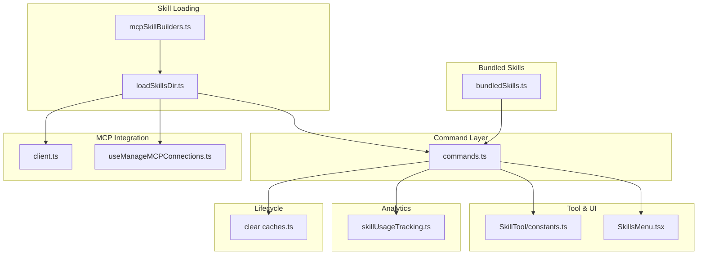
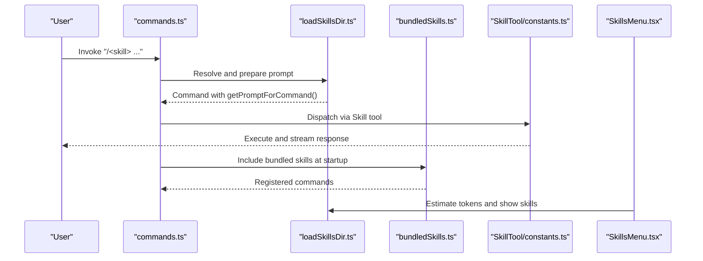
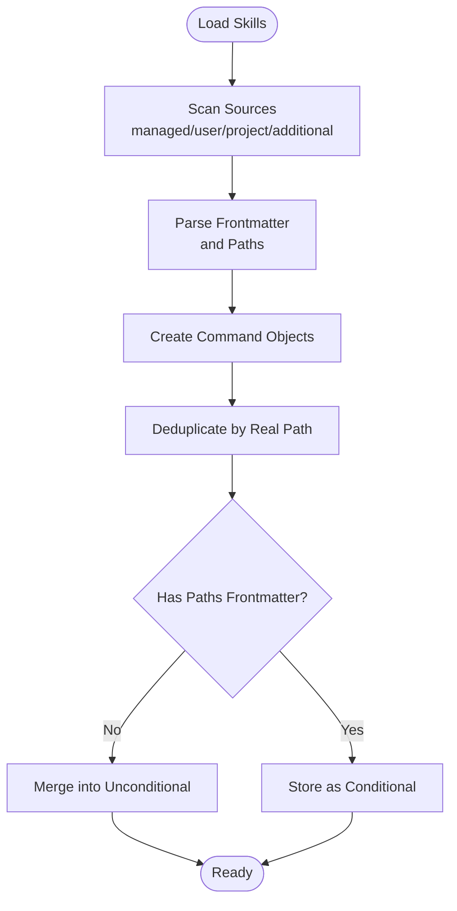
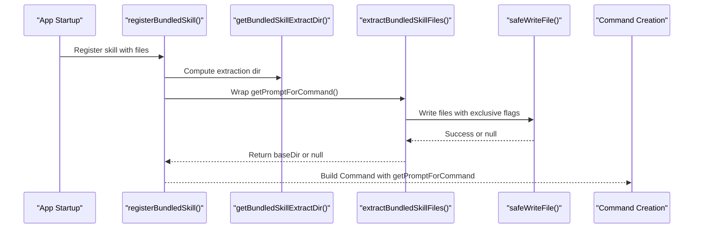
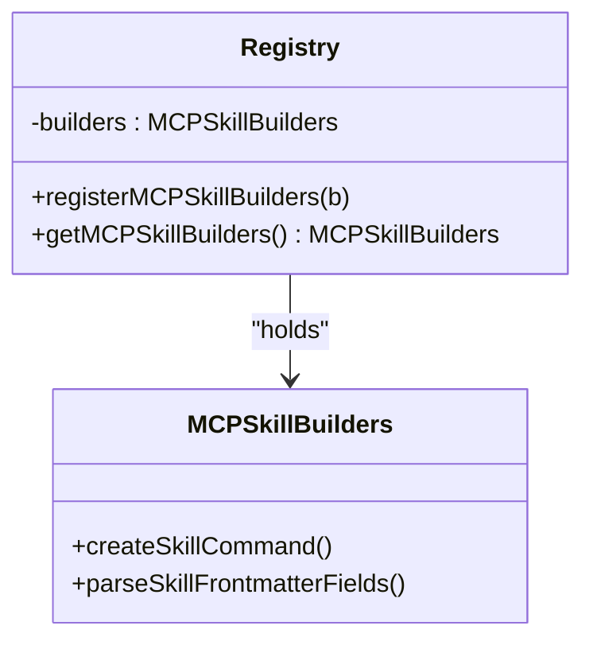
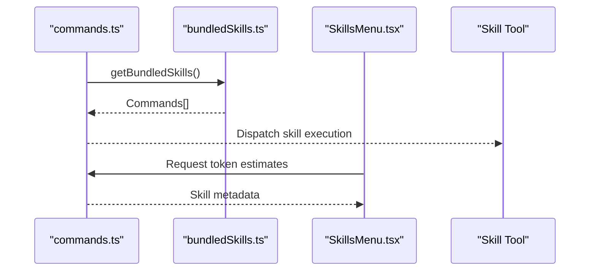
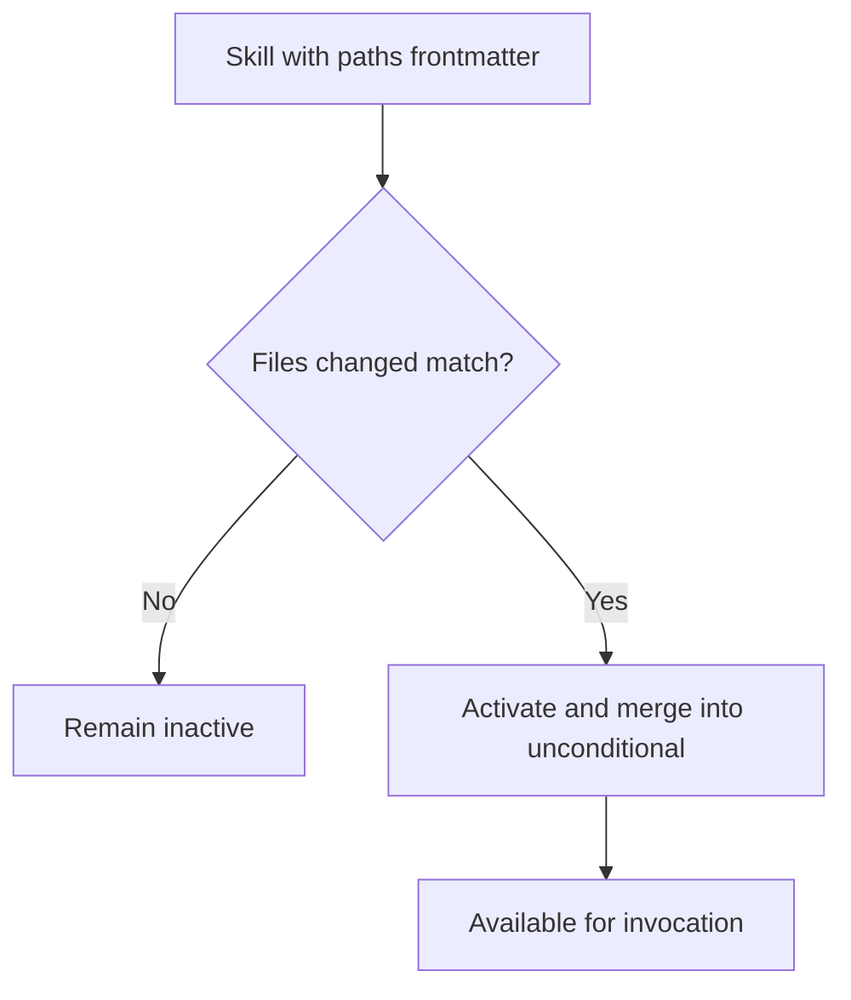
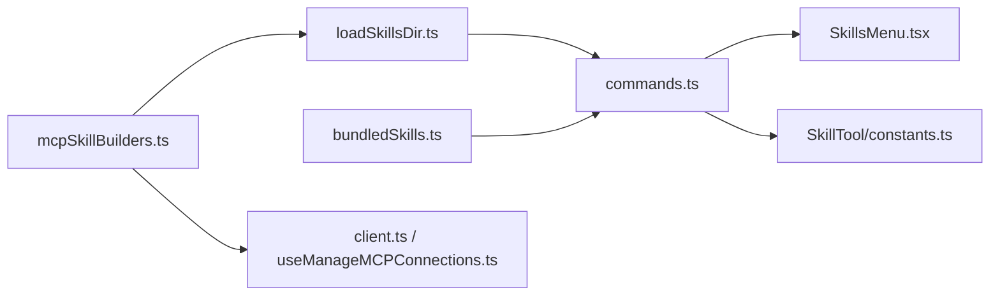

# Skill System

<cite>
**Referenced Files in This Document**
- [bundledSkills.ts](file://restored-src/src/skills/bundledSkills.ts)
- [loadSkillsDir.ts](file://restored-src/src/skills/loadSkillsDir.ts)
- [mcpSkillBuilders.ts](file://restored-src/src/skills/mcpSkillBuilders.ts)
- [commands.ts](file://restored-src/src/commands.ts)
- [SkillTool/constants.ts](file://restored-src/src/tools/SkillTool/constants.ts)
- [SkillsMenu.tsx](file://restored-src/src/components/skills/SkillsMenu.tsx)
- [builtinPlugins.ts](file://restored-src/src/plugins/builtinPlugins.ts)
- [client.ts](file://restored-src/src/services/mcp/client.ts)
- [useManageMCPConnections.ts](file://restored-src/src/services/mcp/useManageMCPConnections.ts)
- [skillUsageTracking.ts](file://restored-src/src/utils/suggestions/skillUsageTracking.ts)
- [clear caches.ts](file://restored-src/src/commands/clear/caches.ts)
</cite>

## Table of Contents
1. [Introduction](#introduction)
2. [Project Structure](#project-structure)
3. [Core Components](#core-components)
4. [Architecture Overview](#architecture-overview)
5. [Detailed Component Analysis](#detailed-component-analysis)
6. [Dependency Analysis](#dependency-analysis)
7. [Performance Considerations](#performance-considerations)
8. [Troubleshooting Guide](#troubleshooting-guide)
9. [Conclusion](#conclusion)
10. [Appendices](#appendices)

## Introduction
This document explains the skill system that powers customizable command functionality in the application. It covers the skill architecture, development patterns, composition mechanisms, bundled skills, configuration, and the execution pipeline. It also provides practical guidance for creating, customizing, and integrating skills, along with performance optimization, debugging, and maintenance considerations.

## Project Structure
The skill system spans several modules:
- Skill loading and parsing: loadSkillsDir.ts
- Bundled skills registry and extraction: bundledSkills.ts
- MCP skill builder registration: mcpSkillBuilders.ts
- Command integration and orchestration: commands.ts
- UI for skill management: SkillsMenu.tsx
- Tool integration: SkillTool/constants.ts
- Plugin integration: builtinPlugins.ts
- MCP service integration: client.ts, useManageMCPConnections.ts
- Usage analytics: skillUsageTracking.ts
- Lifecycle operations: clear caches.ts

**Diagram sources**
- [loadSkillsDir.ts:625-800](file://restored-src/src/skills/loadSkillsDir.ts#L625-L800)
- [mcpSkillBuilders.ts:1-45](file://restored-src/src/skills/mcpSkillBuilders.ts#L1-L45)
- [bundledSkills.ts:43-108](file://restored-src/src/skills/bundledSkills.ts#L43-L108)
- [commands.ts:159-160](file://restored-src/src/commands.ts#L159-L160)
- [SkillTool/constants.ts:1-1](file://restored-src/src/tools/SkillTool/constants.ts#L1-L1)
- [SkillsMenu.tsx:1-10](file://restored-src/src/components/skills/SkillsMenu.tsx#L1-L10)
- [client.ts:118-118](file://restored-src/src/services/mcp/client.ts#L118-L118)
- [useManageMCPConnections.ts:20-26](file://restored-src/src/services/mcp/useManageMCPConnections.ts#L20-L26)
- [skillUsageTracking.ts:37-55](file://restored-src/src/utils/suggestions/skillUsageTracking.ts#L37-L55)
- [clear caches.ts:20-30](file://restored-src/src/commands/clear/caches.ts#L20-L30)

**Section sources**
- [loadSkillsDir.ts:625-800](file://restored-src/src/skills/loadSkillsDir.ts#L625-L800)
- [bundledSkills.ts:43-108](file://restored-src/src/skills/bundledSkills.ts#L43-L108)
- [commands.ts:159-160](file://restored-src/src/commands.ts#L159-L160)

## Core Components
- Skill definition and loading
  - Skills are loaded from directories under managed, user, project, and additional locations. Legacy commands directory format is also supported.
  - Frontmatter fields define metadata, tool allowances, execution context, agent binding, effort, and optional shell execution rules.
- Bundled skills
  - Compiled-in skills registered at startup with optional embedded reference files. First invocation extracts files securely and prefixes prompts with a base directory hint.
- MCP skill builders
  - A write-once registry enabling MCP discovery to reuse the same parsing and command creation logic without cyclic imports.
- Command integration
  - Skills are integrated into the command system and surfaced to workers and UI. Bundled skills are always included alongside dynamic skills.
- Tool and UI
  - The Skill tool name is standardized, and the Skills menu exposes skill discovery and token estimation.
- Plugins and MCP
  - Built-in plugins distinguish themselves from bundled skills; MCP connections trigger skill discovery and registration via the builder registry.

**Section sources**
- [loadSkillsDir.ts:625-800](file://restored-src/src/skills/loadSkillsDir.ts#L625-L800)
- [bundledSkills.ts:11-41](file://restored-src/src/skills/bundledSkills.ts#L11-L41)
- [mcpSkillBuilders.ts:25-44](file://restored-src/src/skills/mcpSkillBuilders.ts#L25-L44)
- [commands.ts:374-374](file://restored-src/src/commands.ts#L374-L374)
- [builtinPlugins.ts:1-20](file://restored-src/src/plugins/builtinPlugins.ts#L1-L20)
- [client.ts:118-118](file://restored-src/src/services/mcp/client.ts#L118-L118)
- [useManageMCPConnections.ts:20-26](file://restored-src/src/services/mcp/useManageMCPConnections.ts#L20-L26)

## Architecture Overview
The skill system is composed of three layers:
- Discovery and parsing: loadSkillsDir.ts discovers skills from multiple sources, parses frontmatter, substitutes arguments, executes shell commands in prompts (when allowed), and constructs Command objects.
- Bundled skill lifecycle: bundledSkills.ts registers built-in skills and handles first-use extraction of embedded files with secure file writing and path normalization.
- Orchestration and integration: commands.ts integrates skills into the command registry, while UI and tools surface skills to users and workers.

**Diagram sources**
- [commands.ts:374-374](file://restored-src/src/commands.ts#L374-L374)
- [loadSkillsDir.ts:344-401](file://restored-src/src/skills/loadSkillsDir.ts#L344-L401)
- [bundledSkills.ts:53-100](file://restored-src/src/skills/bundledSkills.ts#L53-L100)
- [SkillTool/constants.ts:1-1](file://restored-src/src/tools/SkillTool/constants.ts#L1-L1)
- [SkillsMenu.tsx:1-10](file://restored-src/src/components/skills/SkillsMenu.tsx#L1-L10)

## Detailed Component Analysis

### Skill Loading Pipeline
- Sources and precedence
  - Managed, user, project, and additional directories are scanned in parallel. Legacy commands directory format is supported with special handling for SKILL.md.
- Deduplication
  - Files are deduplicated by canonical path resolution to avoid duplicates from symlinks or overlapping directories.
- Conditional skills
  - Skills with paths frontmatter are stored separately and activated when matching files change.
- Frontmatter parsing
  - Fields include name, description, allowed tools, argument names, when-to-use hints, model, disable-model-invocation, user-invocable flag, hooks, execution context, agent, effort, and shell rules.
- Prompt construction
  - Base directory hint is prepended when a skill has a baseDir. Arguments are substituted, placeholders like session ID and skill directory are replaced, and shell commands are executed (subject to safety rules).

**Diagram sources**
- [loadSkillsDir.ts:625-800](file://restored-src/src/skills/loadSkillsDir.ts#L625-L800)
- [loadSkillsDir.ts:185-265](file://restored-src/src/skills/loadSkillsDir.ts#L185-L265)
- [loadSkillsDir.ts:344-401](file://restored-src/src/skills/loadSkillsDir.ts#L344-L401)

**Section sources**
- [loadSkillsDir.ts:625-800](file://restored-src/src/skills/loadSkillsDir.ts#L625-L800)
- [loadSkillsDir.ts:185-265](file://restored-src/src/skills/loadSkillsDir.ts#L185-L265)
- [loadSkillsDir.ts:344-401](file://restored-src/src/skills/loadSkillsDir.ts#L344-L401)

### Bundled Skills Registry and Extraction
- Registration
  - Bundled skills are registered at module initialization with a definition interface supporting metadata, allowed tools, model override, invocation flags, hooks, context, agent, and optional embedded files.
- First-use extraction
  - Embedded files are extracted once per process to a deterministic directory under a secured root. Extraction is memoized to avoid races.
- Safety
  - Safe file writing uses exclusive open flags and strict path normalization to prevent directory traversal and symlink attacks. Directory modes are restricted to owner-only.
- Prompt augmentation
  - Extracted directory is advertised in the prompt via a base directory hint for model-driven file operations.

**Diagram sources**
- [bundledSkills.ts:53-100](file://restored-src/src/skills/bundledSkills.ts#L53-L100)
- [bundledSkills.ts:120-145](file://restored-src/src/skills/bundledSkills.ts#L120-L145)
- [bundledSkills.ts:186-193](file://restored-src/src/skills/bundledSkills.ts#L186-L193)
- [bundledSkills.ts:208-220](file://restored-src/src/skills/bundledSkills.ts#L208-L220)

**Section sources**
- [bundledSkills.ts:11-41](file://restored-src/src/skills/bundledSkills.ts#L11-L41)
- [bundledSkills.ts:53-100](file://restored-src/src/skills/bundledSkills.ts#L53-L100)
- [bundledSkills.ts:120-145](file://restored-src/src/skills/bundledSkills.ts#L120-L145)
- [bundledSkills.ts:186-193](file://restored-src/src/skills/bundledSkills.ts#L186-L193)
- [bundledSkills.ts:208-220](file://restored-src/src/skills/bundledSkills.ts#L208-L220)

### MCP Skill Builders Registry
- Purpose
  - Provides a dependency-graph leaf module exporting functions needed by MCP discovery to construct skills without introducing cycles.
- Registration and retrieval
  - Builders are registered once during module initialization and retrieved later by MCP modules.

**Diagram sources**
- [mcpSkillBuilders.ts:25-44](file://restored-src/src/skills/mcpSkillBuilders.ts#L25-L44)

**Section sources**
- [mcpSkillBuilders.ts:25-44](file://restored-src/src/skills/mcpSkillBuilders.ts#L25-L44)

### Command Integration and Execution
- Integration
  - Skills are merged into the command registry alongside bundled skills and legacy commands. Workers receive access to skills via the Skill tool.
- Tool dispatch
  - Skills are invoked through a standardized tool name, enabling consistent execution across UI and workers.
- UI exposure
  - The Skills menu estimates token counts and lists skills for selection.

**Diagram sources**
- [commands.ts:374-374](file://restored-src/src/commands.ts#L374-L374)
- [bundledSkills.ts:106-108](file://restored-src/src/skills/bundledSkills.ts#L106-L108)
- [SkillsMenu.tsx:1-10](file://restored-src/src/components/skills/SkillsMenu.tsx#L1-L10)
- [SkillTool/constants.ts:1-1](file://restored-src/src/tools/SkillTool/constants.ts#L1-L1)

**Section sources**
- [commands.ts:374-374](file://restored-src/src/commands.ts#L374-L374)
- [SkillsMenu.tsx:1-10](file://restored-src/src/components/skills/SkillsMenu.tsx#L1-L10)
- [SkillTool/constants.ts:1-1](file://restored-src/src/tools/SkillTool/constants.ts#L1-L1)

### Conceptual Overview
- Skill composition
  - Skills can reference local files via a base directory hint and can embed auxiliary files for model-driven operations.
- Conditional activation
  - Skills gated by paths frontmatter are held until relevant files change, reducing unnecessary prompt size and computation.
- Security
  - Strict path normalization and safe file writing protect against traversal and symlink-based attacks. Shell execution is restricted for MCP skills.

[No sources needed since this diagram shows conceptual workflow, not actual code structure]

[No sources needed since this section doesn't analyze specific source files]

## Dependency Analysis
- Coupling
  - loadSkillsDir.ts depends on frontmatter parsing, markdown loading, argument substitution, and shell execution utilities. It is consumed by commands.ts and UI components.
  - bundledSkills.ts depends on filesystem utilities and permissions helpers for secure extraction.
  - mcpSkillBuilders.ts is a leaf dependency enabling MCP discovery to reuse loader logic without cycles.
- Cohesion
  - Each module focuses on a single responsibility: discovery, bundling, or orchestration.
- External integrations
  - MCP client and connection management integrate with skill discovery via the builder registry.
  - Plugins distinguish bundled skills from built-in plugins.

**Diagram sources**
- [loadSkillsDir.ts:625-800](file://restored-src/src/skills/loadSkillsDir.ts#L625-L800)
- [bundledSkills.ts:43-108](file://restored-src/src/skills/bundledSkills.ts#L43-L108)
- [mcpSkillBuilders.ts:25-44](file://restored-src/src/skills/mcpSkillBuilders.ts#L25-L44)
- [client.ts:118-118](file://restored-src/src/services/mcp/client.ts#L118-L118)
- [useManageMCPConnections.ts:20-26](file://restored-src/src/services/mcp/useManageMCPConnections.ts#L20-L26)
- [commands.ts:159-160](file://restored-src/src/commands.ts#L159-L160)
- [SkillsMenu.tsx:1-10](file://restored-src/src/components/skills/SkillsMenu.tsx#L1-L10)
- [SkillTool/constants.ts:1-1](file://restored-src/src/tools/SkillTool/constants.ts#L1-L1)

**Section sources**
- [loadSkillsDir.ts:625-800](file://restored-src/src/skills/loadSkillsDir.ts#L625-L800)
- [bundledSkills.ts:43-108](file://restored-src/src/skills/bundledSkills.ts#L43-L108)
- [mcpSkillBuilders.ts:25-44](file://restored-src/src/skills/mcpSkillBuilders.ts#L25-L44)
- [client.ts:118-118](file://restored-src/src/services/mcp/client.ts#L118-L118)
- [useManageMCPConnections.ts:20-26](file://restored-src/src/services/mcp/useManageMCPConnections.ts#L20-L26)
- [commands.ts:159-160](file://restored-src/src/commands.ts#L159-L160)
- [SkillsMenu.tsx:1-10](file://restored-src/src/components/skills/SkillsMenu.tsx#L1-L10)
- [SkillTool/constants.ts:1-1](file://restored-src/src/tools/SkillTool/constants.ts#L1-L1)

## Performance Considerations
- Token estimation
  - Frontmatter-only estimation helps avoid loading full skill content until invocation.
- Parallel discovery
  - Multiple sources are scanned concurrently to reduce startup latency.
- Deduplication
  - Canonical path resolution prevents redundant work and reduces memory footprint.
- Conditional skills
  - Postponing activation of conditional skills reduces prompt size and computation overhead until needed.
- Safe extraction
  - One-time extraction with memoization minimizes repeated disk writes.

**Section sources**
- [loadSkillsDir.ts:100-105](file://restored-src/src/skills/loadSkillsDir.ts#L100-L105)
- [loadSkillsDir.ts:677-714](file://restored-src/src/skills/loadSkillsDir.ts#L677-L714)
- [loadSkillsDir.ts:725-769](file://restored-src/src/skills/loadSkillsDir.ts#L725-L769)
- [loadSkillsDir.ts:771-796](file://restored-src/src/skills/loadSkillsDir.ts#L771-L796)

## Troubleshooting Guide
- Duplicate skills
  - If the same file is reachable via different paths, deduplication ensures only the first encountered is loaded. Verify file identity and path resolution.
- Permission and IO errors
  - Non-ENOENT errors during file reads are logged for diagnosis. Check filesystem permissions and accessibility.
- MCP shell execution
  - Shell commands are not executed for MCP skills to mitigate risk; ensure shell frontmatter is not relied upon for MCP-provided skills.
- Clearing dynamic skills
  - Use the cache-clear command to refresh dynamic skills after changes.

**Section sources**
- [loadSkillsDir.ts:436-444](file://restored-src/src/skills/loadSkillsDir.ts#L436-L444)
- [loadSkillsDir.ts:416-419](file://restored-src/src/skills/loadSkillsDir.ts#L416-L419)
- [loadSkillsDir.ts:374-396](file://restored-src/src/skills/loadSkillsDir.ts#L374-L396)
- [clear caches.ts:20-30](file://restored-src/src/commands/clear/caches.ts#L20-L30)

## Conclusion
The skill system provides a robust, secure, and extensible framework for customizable command functionality. It supports multiple discovery sources, conditional activation, bundled assets, and MCP integration, while maintaining strong safety and performance characteristics. Developers can create reusable skills with clear frontmatter-driven configuration, and users can discover and execute skills through the UI and worker tooling.

## Appendices

### Practical Examples and Patterns
- Creating a skill
  - Place a directory with a SKILL.md file under a skills location. Define frontmatter fields such as description, allowed tools, and optional paths to gate activation.
- Using bundled skills
  - Bundled skills are registered automatically at startup. They can embed reference files and are available immediately.
- Integrating with MCP
  - Use the MCP skill builders registry to enable MCP servers to contribute skills consistently with the loader logic.
- Managing lifecycle
  - Refresh dynamic skills after edits using the cache-clear command.

**Section sources**
- [loadSkillsDir.ts:407-480](file://restored-src/src/skills/loadSkillsDir.ts#L407-L480)
- [bundledSkills.ts:53-100](file://restored-src/src/skills/bundledSkills.ts#L53-L100)
- [mcpSkillBuilders.ts:25-44](file://restored-src/src/skills/mcpSkillBuilders.ts#L25-L44)
- [clear caches.ts:20-30](file://restored-src/src/commands/clear/caches.ts#L20-L30)

### Developer Reference
- Key APIs and types
  - Bundled skill definition and registration
  - Skill loading and command creation
  - MCP skill builders registry
- Integration points
  - commands.ts for merging skills into the command registry
  - SkillsMenu.tsx for UI exposure and token estimation
  - SkillTool/constants.ts for standardized tool name

**Section sources**
- [bundledSkills.ts:11-41](file://restored-src/src/skills/bundledSkills.ts#L11-L41)
- [loadSkillsDir.ts:269-401](file://restored-src/src/skills/loadSkillsDir.ts#L269-L401)
- [mcpSkillBuilders.ts:25-44](file://restored-src/src/skills/mcpSkillBuilders.ts#L25-L44)
- [commands.ts:374-374](file://restored-src/src/commands.ts#L374-L374)
- [SkillsMenu.tsx:1-10](file://restored-src/src/components/skills/SkillsMenu.tsx#L1-L10)
- [SkillTool/constants.ts:1-1](file://restored-src/src/tools/SkillTool/constants.ts#L1-L1)