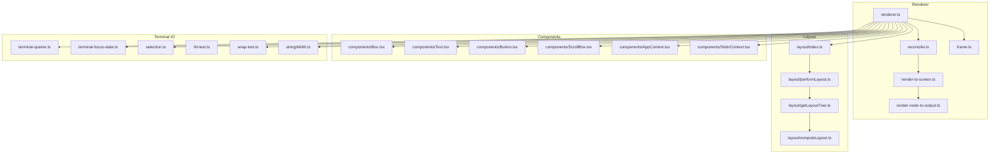
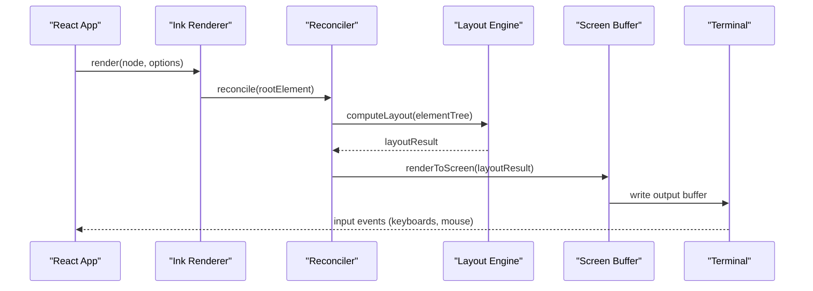
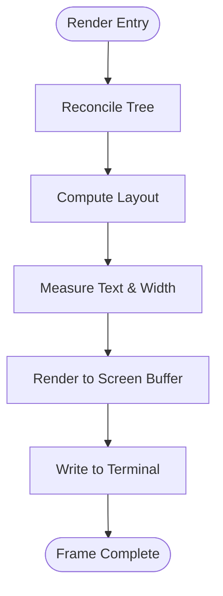
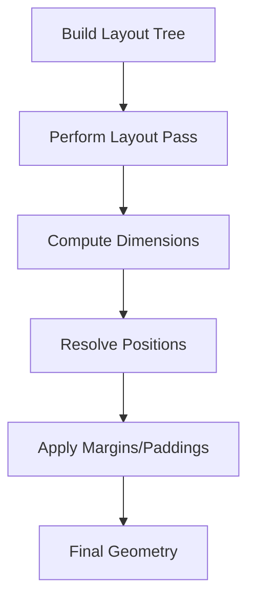
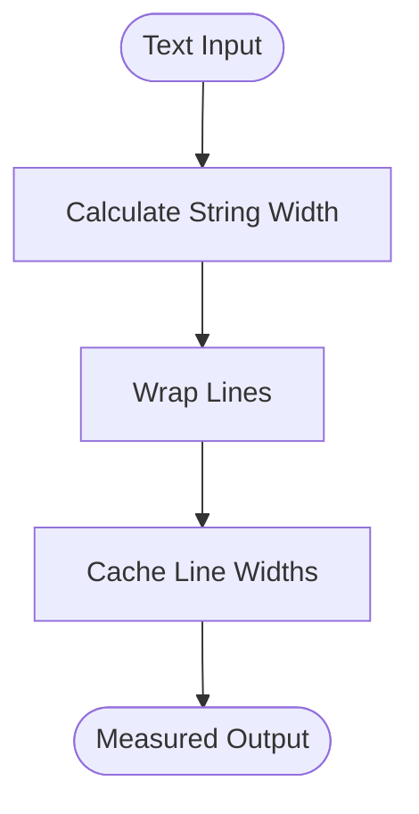
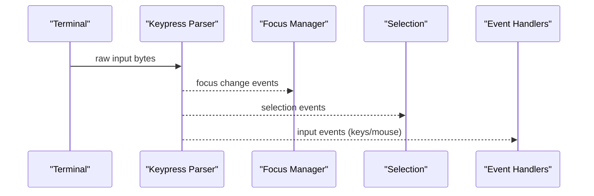
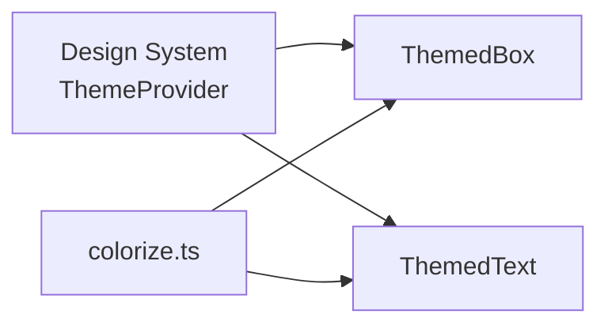
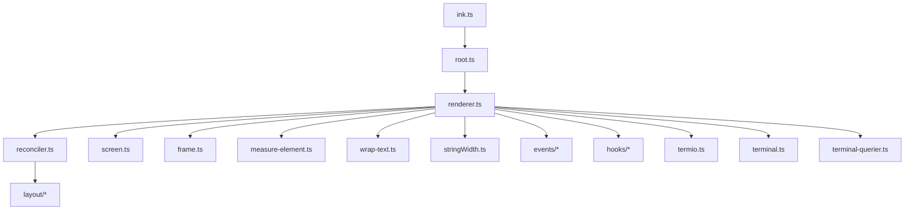

# Ink Framework Components

<cite>
**Referenced Files in This Document**
- [ink.ts](file://restored-src/src/ink.ts)
- [root.ts](file://restored-src/src/ink/root.ts)
- [renderer.ts](file://restored-src/src/ink/renderer.ts)
- [reconciler.ts](file://restored-src/src/ink/reconciler.ts)
- [render-to-screen.ts](file://restored-src/src/ink/render-to-screen.ts)
- [render-node-to-output.ts](file://restored-src/src/ink/render-node-to-output.ts)
- [screen.ts](file://restored-src/src/ink/screen.ts)
- [frame.ts](file://restored-src/src/ink/frame.ts)
- [measure-element.ts](file://restored-src/src/ink/measure-element.ts)
- [wrap-text.ts](file://restored-src/src/ink/wrap-text.ts)
- [stringWidth.ts](file://restored-src/src/ink/stringWidth.ts)
- [widest-line.ts](file://restored-src/src/ink/widest-line.ts)
- [line-width-cache.ts](file://restored-src/src/ink/line-width-cache.ts)
- [Ansi.tsx](file://restored-src/src/ink/Ansi.tsx)
- [colorize.ts](file://restored-src/src/ink/colorize.ts)
- [clearTerminal.ts](file://restored-src/src/ink/clearTerminal.ts)
- [parse-keypress.ts](file://restored-src/src/ink/parse-keypress.ts)
- [focus.ts](file://restored-src/src/ink/focus.ts)
- [terminal-focus-state.ts](file://restored-src/src/ink/terminal-focus-state.ts)
- [selection.ts](file://restored-src/src/ink/selection.ts)
- [hit-test.ts](file://restored-src/src/ink/hit-test.ts)
- [dom.ts](file://restored-src/src/ink/dom.ts)
- [squash-text-nodes.ts](file://restored-src/src/ink/squash-text-nodes.ts)
- [layout/index.ts](file://restored-src/src/ink/layout/index.ts)
- [layout/performLayout.ts](file://restored-src/src/ink/layout/performLayout.ts)
- [layout/getLayoutTree.ts](file://restored-src/src/ink/layout/getLayoutTree.ts)
- [layout/computeLayout.ts](file://restored-src/src/ink/layout/computeLayout.ts)
- [events/input-event.ts](file://restored-src/src/ink/events/input-event.ts)
- [events/click-event.ts](file://restored-src/src/ink/events/click-event.ts)
- [events/terminal-focus-event.ts](file://restored-src/src/ink/events/terminal-focus-event.ts)
- [hooks/use-input.ts](file://restored-src/src/ink/hooks/use-input.ts)
- [hooks/use-stdin.ts](file://restored-src/src/ink/hooks/use-stdin.ts)
- [hooks/use-terminal-focus.ts](file://restored-src/src/ink/hooks/use-terminal-focus.ts)
- [hooks/use-terminal-viewport.ts](file://restored-src/src/ink/hooks/use-terminal-viewport.ts)
- [hooks/use-animation-frame.ts](file://restored-src/src/ink/hooks/use-animation-frame.ts)
- [hooks/use-interval.ts](file://restored-src/src/ink/hooks/use-interval.ts)
- [hooks/use-selection.ts](file://restored-src/src/ink/hooks/use-selection.ts)
- [hooks/use-tab-status.ts](file://restored-src/src/ink/hooks/use-tab-status.ts)
- [hooks/use-terminal-title.ts](file://restored-src/src/ink/hooks/use-terminal-title.ts)
- [components/Box.tsx](file://restored-src/src/ink/components/Box.tsx)
- [components/Text.tsx](file://restored-src/src/ink/components/Text.tsx)
- [components/Button.tsx](file://restored-src/src/ink/components/Button.tsx)
- [components/ScrollBox.tsx](file://restored-src/src/ink/components/ScrollBox.tsx)
- [components/AppContext.tsx](file://restored-src/src/ink/components/AppContext.tsx)
- [components/StdinContext.tsx](file://restored-src/src/ink/components/StdinContext.tsx)
- [components/Link.tsx](file://restored-src/src/ink/components/Link.tsx)
- [components/Newline.tsx](file://restored-src/src/ink/components/Newline.tsx)
- [components/NoSelect.tsx](file://restored-src/src/ink/components/NoSelect.tsx)
- [components/RawAnsi.tsx](file://restored-src/src/ink/components/RawAnsi.tsx)
- [components/Spacer.tsx](file://restored-src/src/ink/components/Spacer.tsx)
- [termio.ts](file://restored-src/src/ink/termio.ts)
- [terminal.ts](file://restored-src/src/ink/terminal.ts)
- [terminal-querier.ts](file://restored-src/src/ink/terminal-querier.ts)
- [terminal-focus-state.ts](file://restored-src/src/ink/terminal-focus-state.ts)
- [styles.ts](file://restored-src/src/ink/styles.ts)
- [optimizer.ts](file://restored-src/src/ink/optimizer.ts)
- [instances.ts](file://restored-src/src/ink/instances.ts)
- [log-update.ts](file://restored-src/src/ink/log-update.ts)
- [supports-hyperlinks.ts](file://restored-src/src/ink/supports-hyperlinks.ts)
- [bidi.ts](file://restored-src/src/ink/bidi.ts)
- [tabstops.ts](file://restored-src/src/ink/tabstops.ts)
- [useTerminalNotification.ts](file://restored-src/src/ink/useTerminalNotification.ts)
- [warn.ts](file://restored-src/src/ink/warn.ts)
- [wrapAnsi.ts](file://restored-src/src/ink/wrapAnsi.ts)
- [get-max-width.ts](file://restored-src/src/ink/get-max-width.ts)
- [output.ts](file://restored-src/src/ink/output.ts)
- [searchHighlight.ts](file://restored-src/src/ink/searchHighlight.ts)
- [components/design-system/ThemedBox.tsx](file://restored-src/src/components/design-system/ThemedBox.tsx)
- [components/design-system/ThemedText.tsx](file://restored-src/src/components/design-system/ThemedText.tsx)
- [components/design-system/ThemeProvider.tsx](file://restored-src/src/components/design-system/ThemeProvider.tsx)
- [components/design-system/color.ts](file://restored-src/src/components/design-system/color.ts)
</cite>

## Table of Contents
1. [Introduction](#introduction)
2. [Project Structure](#project-structure)
3. [Core Components](#core-components)
4. [Architecture Overview](#architecture-overview)
5. [Detailed Component Analysis](#detailed-component-analysis)
6. [Dependency Analysis](#dependency-analysis)
7. [Performance Considerations](#performance-considerations)
8. [Troubleshooting Guide](#troubleshooting-guide)
9. [Conclusion](#conclusion)
10. [Appendices](#appendices)

## Introduction
This document explains the Ink framework components that power the terminal UI in the Claude codebase. It covers the React renderer, component lifecycle, layout engine, geometry calculations, rendering pipeline, and terminal-specific optimizations. It documents core components such as Box, Text, Button, and ScrollBox, along with their props, styling options, and usage patterns. Practical guidance is included for composing components, developing custom components, and optimizing performance in terminal environments, alongside considerations for ANSI escape sequences, cursor management, and responsive layouts.

## Project Structure
The Ink subsystem is organized around a React renderer tailored for terminal output. Key areas include:
- Renderer and reconciliation: orchestrate rendering and updates
- Layout engine: compute element geometry and positioning
- Terminal I/O and events: handle input, focus, viewport, and OSC/CSI sequences
- Components: primitive UI elements (Box, Text, Button, ScrollBox) and higher-level utilities
- Styling and theming: design system wrappers and color utilities
- Text measurement and wrapping: width calculation, line wrapping, and cache

**Diagram sources**
- [renderer.ts](file://restored-src/src/ink/renderer.ts)
- [reconciler.ts](file://restored-src/src/ink/reconciler.ts)
- [render-to-screen.ts](file://restored-src/src/ink/render-to-screen.ts)
- [render-node-to-output.ts](file://restored-src/src/ink/render-node-to-output.ts)
- [frame.ts](file://restored-src/src/ink/frame.ts)
- [layout/index.ts](file://restored-src/src/ink/layout/index.ts)
- [layout/performLayout.ts](file://restored-src/src/ink/layout/performLayout.ts)
- [layout/getLayoutTree.ts](file://restored-src/src/ink/layout/getLayoutTree.ts)
- [layout/computeLayout.ts](file://restored-src/src/ink/layout/computeLayout.ts)
- [components/Box.tsx](file://restored-src/src/ink/components/Box.tsx)
- [components/Text.tsx](file://restored-src/src/ink/components/Text.tsx)
- [components/Button.tsx](file://restored-src/src/ink/components/Button.tsx)
- [components/ScrollBox.tsx](file://restored-src/src/ink/components/ScrollBox.tsx)
- [components/AppContext.tsx](file://restored-src/src/ink/components/AppContext.tsx)
- [components/StdinContext.tsx](file://restored-src/src/ink/components/StdinContext.tsx)
- [terminal-querier.ts](file://restored-src/src/ink/terminal-querier.ts)
- [terminal-focus-state.ts](file://restored-src/src/ink/terminal-focus-state.ts)
- [selection.ts](file://restored-src/src/ink/selection.ts)
- [hit-test.ts](file://restored-src/src/ink/hit-test.ts)
- [wrap-text.ts](file://restored-src/src/ink/wrap-text.ts)
- [stringWidth.ts](file://restored-src/src/ink/stringWidth.ts)

**Section sources**
- [ink.ts:1-86](file://restored-src/src/ink.ts#L1-L86)

## Core Components
This section documents the primary UI primitives and their roles in the terminal UI.

- Box
  - Purpose: Container for layout and styling; applies padding, margin, border, and background.
  - Props: Includes layout and style props compatible with the design system; integrates with ThemedBox for theme-aware rendering.
  - Usage: Nest inside other Box or Text elements; use for grouping and applying borders/backgrounds.
  - Related exports: [BoxProps:34-35](file://restored-src/src/ink.ts#L34-L35), [ThemedBox](file://restored-src/src/components/design-system/ThemedBox.tsx)

- Text
  - Purpose: Renders styled text with color, weight, and wrapping behavior.
  - Props: Inherits from BaseText; supports foreground/background colors, bold/italic, and word wrapping.
  - Usage: Combine with Box for bordered text blocks; use for labels and content.
  - Related exports: [TextProps:36-37](file://restored-src/src/ink.ts#L36-L37), [ThemedText](file://restored-src/src/components/design-system/ThemedText.tsx)

- Button
  - Purpose: Interactive element with hover, selection, and click states.
  - Props: Includes label, disabled state, selection state, and callbacks; exposes ButtonState for programmatic control.
  - Usage: Place within layouts; wire up input handlers via useInput/useStdin to capture keyboard events.
  - Related exports: [ButtonProps:48-52](file://restored-src/src/ink.ts#L48-L52)

- ScrollBox
  - Purpose: Scrollable container for long content; manages viewport and scroll position.
  - Props: Controls height, scroll behavior, and visibility of scrollbar indicators.
  - Usage: Wrap long lists or logs; pair with dynamic content updates for smooth scrolling.
  - Related exports: [ScrollBox.tsx](file://restored-src/src/ink/components/ScrollBox.tsx)

- Additional Utilities
  - AppContext and StdinContext: Provide global app state and stdin configuration to components.
  - Link, Newline, NoSelect, RawAnsi, Spacer: Specialized helpers for hyperlinks, line breaks, selection control, raw ANSI output, and spacing.

**Section sources**
- [ink.ts:33-86](file://restored-src/src/ink.ts#L33-L86)
- [components/Box.tsx](file://restored-src/src/ink/components/Box.tsx)
- [components/Text.tsx](file://restored-src/src/ink/components/Text.tsx)
- [components/Button.tsx](file://restored-src/src/ink/components/Button.tsx)
- [components/ScrollBox.tsx](file://restored-src/src/ink/components/ScrollBox.tsx)
- [components/AppContext.tsx](file://restored-src/src/ink/components/AppContext.tsx)
- [components/StdinContext.tsx](file://restored-src/src/ink/components/StdinContext.tsx)
- [components/Link.tsx](file://restored-src/src/ink/components/Link.tsx)
- [components/Newline.tsx](file://restored-src/src/ink/components/Newline.tsx)
- [components/NoSelect.tsx](file://restored-src/src/ink/components/NoSelect.tsx)
- [components/RawAnsi.tsx](file://restored-src/src/ink/components/RawAnsi.tsx)
- [components/Spacer.tsx](file://restored-src/src/ink/components/Spacer.tsx)

## Architecture Overview
The Ink renderer adapts React’s reconciliation to terminal output. It computes layout, measures text, and writes optimized updates to the terminal screen buffer while managing focus, input, and viewport.

**Diagram sources**
- [renderer.ts](file://restored-src/src/ink/renderer.ts)
- [reconciler.ts](file://restored-src/src/ink/reconciler.ts)
- [layout/performLayout.ts](file://restored-src/src/ink/layout/performLayout.ts)
- [render-to-screen.ts](file://restored-src/src/ink/render-to-screen.ts)
- [screen.ts](file://restored-src/src/ink/screen.ts)
- [terminal.ts](file://restored-src/src/ink/terminal.ts)

## Detailed Component Analysis

### Rendering Pipeline
The rendering pipeline transforms React elements into terminal output with minimal flicker and efficient updates.

**Diagram sources**
- [reconciler.ts](file://restored-src/src/ink/reconciler.ts)
- [layout/computeLayout.ts](file://restored-src/src/ink/layout/computeLayout.ts)
- [measure-element.ts](file://restored-src/src/ink/measure-element.ts)
- [render-to-screen.ts](file://restored-src/src/ink/render-to-screen.ts)
- [screen.ts](file://restored-src/src/ink/screen.ts)

**Section sources**
- [renderer.ts](file://restored-src/src/ink/renderer.ts)
- [reconciler.ts](file://restored-src/src/ink/reconciler.ts)
- [render-to-screen.ts](file://restored-src/src/ink/render-to-screen.ts)
- [screen.ts](file://restored-src/src/ink/screen.ts)

### Layout Engine and Geometry Calculations
The layout engine computes positions and sizes for elements, handling flex-like properties and constraints.

**Diagram sources**
- [layout/getLayoutTree.ts](file://restored-src/src/ink/layout/getLayoutTree.ts)
- [layout/performLayout.ts](file://restored-src/src/ink/layout/performLayout.ts)
- [layout/computeLayout.ts](file://restored-src/src/ink/layout/computeLayout.ts)

**Section sources**
- [layout/index.ts](file://restored-src/src/ink/layout/index.ts)
- [layout/getLayoutTree.ts](file://restored-src/src/ink/layout/getLayoutTree.ts)
- [layout/performLayout.ts](file://restored-src/src/ink/layout/performLayout.ts)
- [layout/computeLayout.ts](file://restored-src/src/ink/layout/computeLayout.ts)

### Text Measurement and Wrapping
Text measurement and wrapping ensure accurate layout and responsive line breaks.

**Diagram sources**
- [stringWidth.ts](file://restored-src/src/ink/stringWidth.ts)
- [widest-line.ts](file://restored-src/src/ink/widest-line.ts)
- [line-width-cache.ts](file://restored-src/src/ink/line-width-cache.ts)
- [wrap-text.ts](file://restored-src/src/ink/wrap-text.ts)

**Section sources**
- [stringWidth.ts](file://restored-src/src/ink/stringWidth.ts)
- [widest-line.ts](file://restored-src/src/ink/widest-line.ts)
- [line-width-cache.ts](file://restored-src/src/ink/line-width-cache.ts)
- [wrap-text.ts](file://restored-src/src/ink/wrap-text.ts)

### Terminal I/O and Events
Terminal input, focus, and viewport management are central to interactivity.

**Diagram sources**
- [parse-keypress.ts](file://restored-src/src/ink/parse-keypress.ts)
- [focus.ts](file://restored-src/src/ink/focus.ts)
- [selection.ts](file://restored-src/src/ink/selection.ts)
- [hit-test.ts](file://restored-src/src/ink/hit-test.ts)
- [events/input-event.ts](file://restored-src/src/ink/events/input-event.ts)
- [events/click-event.ts](file://restored-src/src/ink/events/click-event.ts)
- [events/terminal-focus-event.ts](file://restored-src/src/ink/events/terminal-focus-event.ts)

**Section sources**
- [parse-keypress.ts](file://restored-src/src/ink/parse-keypress.ts)
- [focus.ts](file://restored-src/src/ink/focus.ts)
- [selection.ts](file://restored-src/src/ink/selection.ts)
- [hit-test.ts](file://restored-src/src/ink/hit-test.ts)
- [events/input-event.ts](file://restored-src/src/ink/events/input-event.ts)
- [events/click-event.ts](file://restored-src/src/ink/events/click-event.ts)
- [events/terminal-focus-event.ts](file://restored-src/src/ink/events/terminal-focus-event.ts)

### Styling and Theming
Ink integrates with the design system for theme-aware components and color utilities.

**Diagram sources**
- [components/design-system/ThemeProvider.tsx](file://restored-src/src/components/design-system/ThemeProvider.tsx)
- [components/design-system/ThemedBox.tsx](file://restored-src/src/components/design-system/ThemedBox.tsx)
- [components/design-system/ThemedText.tsx](file://restored-src/src/components/design-system/ThemedText.tsx)
- [colorize.ts](file://restored-src/src/ink/colorize.ts)

**Section sources**
- [ink.ts:33-43](file://restored-src/src/ink.ts#L33-L43)
- [components/design-system/ThemedBox.tsx](file://restored-src/src/components/design-system/ThemedBox.tsx)
- [components/design-system/ThemedText.tsx](file://restored-src/src/components/design-system/ThemedText.tsx)
- [components/design-system/ThemeProvider.tsx](file://restored-src/src/components/design-system/ThemeProvider.tsx)
- [colorize.ts](file://restored-src/src/ink/colorize.ts)

### Component Composition Patterns
- Nesting: Compose Box and Text to build labeled panels and cards.
- Lists: Use ScrollBox to manage long lists; combine with dynamic updates.
- Interactions: Pair Button with input hooks to handle keyboard navigation and actions.
- Responsive: Use wrap-text and stringWidth utilities to adapt to terminal width.

[No sources needed since this section provides general guidance]

## Dependency Analysis
The Ink renderer depends on a cohesive set of modules for rendering, layout, measurement, and terminal I/O.

**Diagram sources**
- [ink.ts:1-86](file://restored-src/src/ink.ts#L1-L86)
- [root.ts](file://restored-src/src/ink/root.ts)
- [renderer.ts](file://restored-src/src/ink/renderer.ts)
- [reconciler.ts](file://restored-src/src/ink/reconciler.ts)
- [layout/index.ts](file://restored-src/src/ink/layout/index.ts)
- [screen.ts](file://restored-src/src/ink/screen.ts)
- [frame.ts](file://restored-src/src/ink/frame.ts)
- [measure-element.ts](file://restored-src/src/ink/measure-element.ts)
- [wrap-text.ts](file://restored-src/src/ink/wrap-text.ts)
- [stringWidth.ts](file://restored-src/src/ink/stringWidth.ts)
- [events/input-event.ts](file://restored-src/src/ink/events/input-event.ts)
- [hooks/use-input.ts](file://restored-src/src/ink/hooks/use-input.ts)
- [termio.ts](file://restored-src/src/ink/termio.ts)
- [terminal.ts](file://restored-src/src/ink/terminal.ts)
- [terminal-querier.ts](file://restored-src/src/ink/terminal-querier.ts)

**Section sources**
- [ink.ts:1-86](file://restored-src/src/ink.ts#L1-L86)

## Performance Considerations
- Minimize re-renders: Use memoization and stable prop references to avoid unnecessary reconciliation.
- Efficient layout: Prefer fixed-size containers when possible; avoid deep nesting that triggers repeated measurements.
- Text caching: Leverage line-width caches and precomputed widths for static content.
- Frame optimization: Use animation frames and intervals judiciously; batch updates to reduce flicker.
- Cursor management: Avoid frequent cursor moves; write only changed regions when feasible.
- Responsive updates: Clamp content width to terminal width to prevent excessive reflows.

[No sources needed since this section provides general guidance]

## Troubleshooting Guide
- Input not recognized: Verify stdin is configured and useInput/useStdin are wired correctly.
- Focus issues: Confirm focus manager and terminal focus state are initialized and updated.
- Rendering artifacts: Check layout computations and ensure proper clearing between frames.
- Hyperlinks and ANSI: Validate support and wrapping behavior for hyperlinks and colored text.
- Selection problems: Review hit-testing and selection logic for clickable regions.

**Section sources**
- [hooks/use-input.ts](file://restored-src/src/ink/hooks/use-input.ts)
- [hooks/use-stdin.ts](file://restored-src/src/ink/hooks/use-stdin.ts)
- [hooks/use-terminal-focus.ts](file://restored-src/src/ink/hooks/use-terminal-focus.ts)
- [focus.ts](file://restored-src/src/ink/focus.ts)
- [terminal-focus-state.ts](file://restored-src/src/ink/terminal-focus-state.ts)
- [selection.ts](file://restored-src/src/ink/selection.ts)
- [hit-test.ts](file://restored-src/src/ink/hit-test.ts)
- [supports-hyperlinks.ts](file://restored-src/src/ink/supports-hyperlinks.ts)
- [wrapAnsi.ts](file://restored-src/src/ink/wrapAnsi.ts)

## Conclusion
The Ink framework provides a robust, React-based terminal UI system. Its renderer, layout engine, and terminal I/O modules work together to deliver responsive, interactive experiences. By leveraging the documented components and patterns—Box, Text, Button, ScrollBox—and following the performance and troubleshooting guidance, developers can build efficient and maintainable terminal applications.

[No sources needed since this section summarizes without analyzing specific files]

## Appendices

### Component Lifecycle
- Mount: Ink creates a root and mounts the React tree.
- Reconcile: The reconciler compares previous and current trees.
- Layout: The layout engine computes geometry.
- Render: The screen buffer is updated with minimal writes.
- Frame: The terminal is refreshed; input and focus states are processed.

**Section sources**
- [root.ts](file://restored-src/src/ink/root.ts)
- [renderer.ts](file://restored-src/src/ink/renderer.ts)
- [reconciler.ts](file://restored-src/src/ink/reconciler.ts)
- [frame.ts](file://restored-src/src/ink/frame.ts)

### Terminal-Specific Optimizations
- ANSI escape sequences: Used for colors, cursor movement, and screen clearing.
- Cursor management: Hide/show cursor, move to coordinates, and save/restore positions.
- Responsive layouts: Adapt content width to terminal size; wrap text appropriately.
- Hyperlinks: Detect support and render links with appropriate escape sequences.

**Section sources**
- [Ansi.tsx](file://restored-src/src/ink/Ansi.tsx)
- [colorize.ts](file://restored-src/src/ink/colorize.ts)
- [clearTerminal.ts](file://restored-src/src/ink/clearTerminal.ts)
- [wrapAnsi.ts](file://restored-src/src/ink/wrapAnsi.ts)
- [get-max-width.ts](file://restored-src/src/ink/get-max-width.ts)
- [termio.ts](file://restored-src/src/ink/termio.ts)
- [terminal.ts](file://restored-src/src/ink/terminal.ts)
- [terminal-querier.ts](file://restored-src/src/ink/terminal-querier.ts)