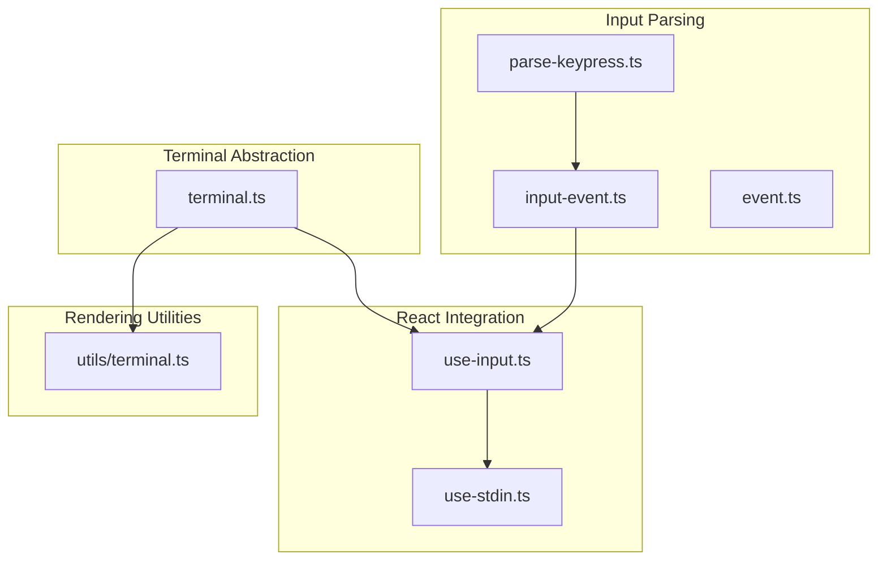
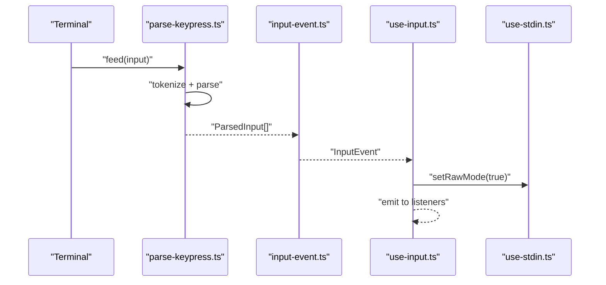
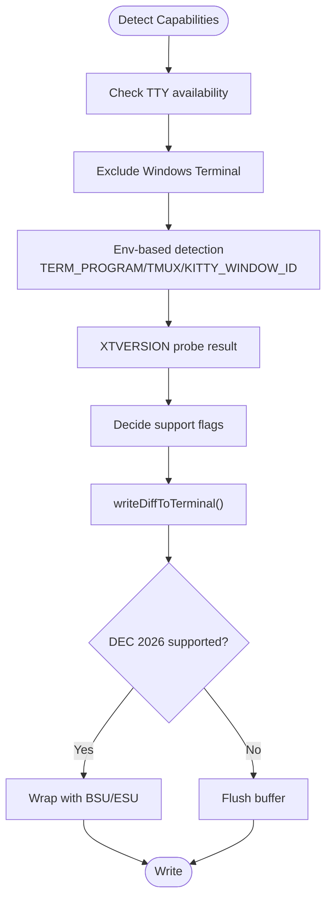
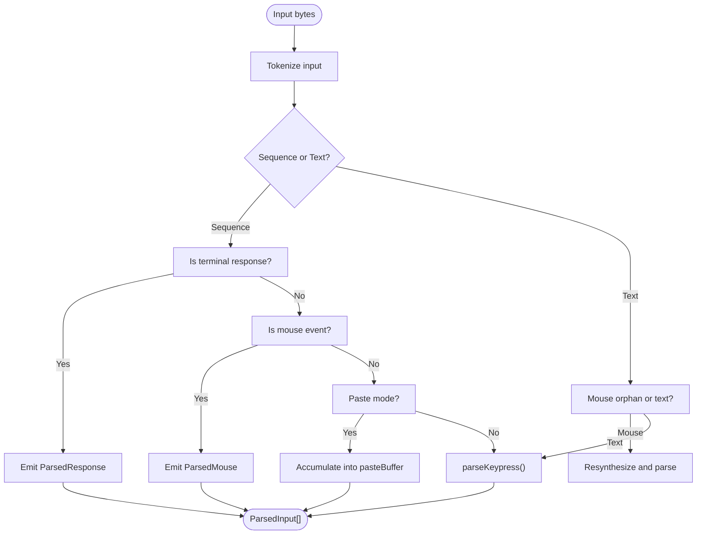
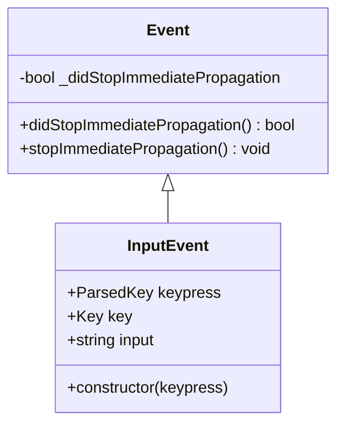
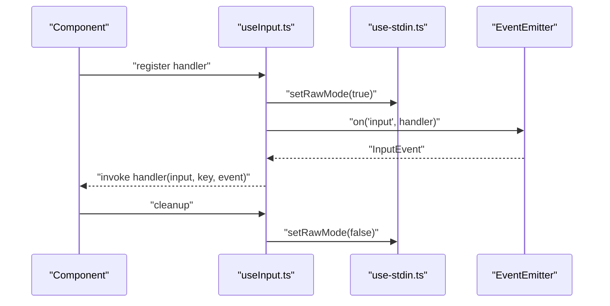
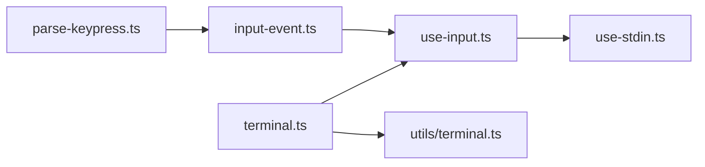

# Input and Output Handling

<cite>
**Referenced Files in This Document**
- [terminal.ts](file://claude_code_src/restored-src/src/ink/terminal.ts)
- [parse-keypress.ts](file://claude_code_src/restored-src/src/ink/parse-keypress.ts)
- [input-event.ts](file://claude_code_src/restored-src/src/ink/events/input-event.ts)
- [use-input.ts](file://claude_code_src/restored-src/src/ink/hooks/use-input.ts)
- [use-stdin.ts](file://claude_code_src/restored-src/src/ink/hooks/use-stdin.ts)
- [event.ts](file://claude_code_src/restored-src/src/ink/events/event.ts)
- [terminal.ts](file://claude_code_src/restored-src/src/utils/terminal.ts)
</cite>

## Table of Contents
1. [Introduction](#introduction)
2. [Project Structure](#project-structure)
3. [Core Components](#core-components)
4. [Architecture Overview](#architecture-overview)
5. [Detailed Component Analysis](#detailed-component-analysis)
6. [Dependency Analysis](#dependency-analysis)
7. [Performance Considerations](#performance-considerations)
8. [Troubleshooting Guide](#troubleshooting-guide)
9. [Conclusion](#conclusion)
10. [Appendices](#appendices)

## Introduction
This document explains the terminal input and output handling mechanisms in the codebase. It covers keyboard event processing, key binding resolution, terminal input parsing, stdin/stdout handling, event dispatching, input buffering, mouse input support, terminal resize handling, cross-platform compatibility, and performance considerations for high-frequency input processing. Practical examples are provided as code snippet paths to guide customization and validation.

## Project Structure
The terminal input/output stack centers around a React-based rendering engine with a dedicated terminal abstraction and a robust keypress parser. Key areas:
- Terminal capability detection and output optimization
- Keypress parsing with support for modern protocols and mouse
- Event model for input dispatching
- React hooks to integrate input handling into components
- Utilities for terminal-aware text rendering

**Diagram sources**
- [terminal.ts:185-249](file://claude_code_src/restored-src/src/ink/terminal.ts#L185-L249)
- [parse-keypress.ts:213-302](file://claude_code_src/restored-src/src/ink/parse-keypress.ts#L213-L302)
- [input-event.ts:192-206](file://claude_code_src/restored-src/src/ink/events/input-event.ts#L192-L206)
- [use-input.ts:42-93](file://claude_code_src/restored-src/src/ink/hooks/use-input.ts#L42-L93)
- [use-stdin.ts:1-9](file://claude_code_src/restored-src/src/ink/hooks/use-stdin.ts#L1-L9)
- [utils/terminal.ts:1-132](file://claude_code_src/restored-src/src/utils/terminal.ts#L1-L132)

**Section sources**
- [terminal.ts:185-249](file://claude_code_src/restored-src/src/ink/terminal.ts#L185-L249)
- [parse-keypress.ts:213-302](file://claude_code_src/restored-src/src/ink/parse-keypress.ts#L213-L302)
- [input-event.ts:192-206](file://claude_code_src/restored-src/src/ink/events/input-event.ts#L192-L206)
- [use-input.ts:42-93](file://claude_code_src/restored-src/src/ink/hooks/use-input.ts#L42-L93)
- [use-stdin.ts:1-9](file://claude_code_src/restored-src/src/ink/hooks/use-stdin.ts#L1-L9)
- [utils/terminal.ts:1-132](file://claude_code_src/restored-src/src/utils/terminal.ts#L1-L132)

## Core Components
- Terminal capability detection and output optimization:
  - Progress reporting availability and synchronized output support
  - Terminal identification (XTVERSION) and extended keys support
  - Cursor behavior bugs and platform-specific handling
  - Buffered, atomic terminal writes for efficient updates
- Keypress parsing:
  - Tokenization of raw input streams
  - Recognition of terminal responses, mouse events, and paste mode
  - Support for Kitty keyboard protocol, xterm modifyOtherKeys, and application keypad mode
- Event model:
  - Event base class with propagation control
  - InputEvent construction from parsed keys
- React integration:
  - useInput hook to register input handlers with controlled raw mode
  - useStdin to access stdin context and event emitter
- Rendering utilities:
  - Terminal-aware text wrapping and truncation for large outputs

**Section sources**
- [terminal.ts:16-249](file://claude_code_src/restored-src/src/ink/terminal.ts#L16-L249)
- [parse-keypress.ts:1-802](file://claude_code_src/restored-src/src/ink/parse-keypress.ts#L1-L802)
- [input-event.ts:1-206](file://claude_code_src/restored-src/src/ink/events/input-event.ts#L1-L206)
- [use-input.ts:1-93](file://claude_code_src/restored-src/src/ink/hooks/use-input.ts#L1-L93)
- [use-stdin.ts:1-9](file://claude_code_src/restored-src/src/ink/hooks/use-stdin.ts#L1-L9)
- [utils/terminal.ts:1-132](file://claude_code_src/restored-src/src/utils/terminal.ts#L1-L132)

## Architecture Overview
The input pipeline transforms raw terminal bytes into structured events and dispatches them to React components. The output pipeline optimizes terminal writes for performance and correctness.

**Diagram sources**
- [parse-keypress.ts:213-302](file://claude_code_src/restored-src/src/ink/parse-keypress.ts#L213-L302)
- [input-event.ts:192-206](file://claude_code_src/restored-src/src/ink/events/input-event.ts#L192-L206)
- [use-input.ts:42-93](file://claude_code_src/restored-src/src/ink/hooks/use-input.ts#L42-L93)
- [use-stdin.ts:1-9](file://claude_code_src/restored-src/src/ink/hooks/use-stdin.ts#L1-L9)

## Detailed Component Analysis

### Terminal Capability Detection and Output Optimization
- Detects progress reporting support and synchronized output capability based on environment and terminal identifiers.
- Supports XTVERSION probing for terminal name/version detection, especially useful over SSH.
- Provides helpers for extended keys and platform-specific cursor behavior.
- Exposes a buffered write function that can wrap updates with synchronized output markers when supported.

**Diagram sources**
- [terminal.ts:25-118](file://claude_code_src/restored-src/src/ink/terminal.ts#L25-L118)
- [terminal.ts:130-146](file://claude_code_src/restored-src/src/ink/terminal.ts#L130-L146)
- [terminal.ts:190-249](file://claude_code_src/restored-src/src/ink/terminal.ts#L190-L249)

**Section sources**
- [terminal.ts:16-249](file://claude_code_src/restored-src/src/ink/terminal.ts#L16-L249)

### Keypress Parsing and Mouse Input Support
- Tokenizes raw input into sequences and text tokens.
- Recognizes terminal responses (DECRPM, DA1/DA2, XTVERSION, OSC), mouse events, and paste mode.
- Parses modern keyboard protocols:
  - Kitty keyboard protocol (CSI u)
  - xterm modifyOtherKeys
  - Application keypad mode (Ox)
- Handles paste mode with start/end markers and emits a single paste key with accumulated content.
- Mouse wheel events remain as key events for routing to scroll handlers; click/drag are emitted as mouse events.

**Diagram sources**
- [parse-keypress.ts:213-302](file://claude_code_src/restored-src/src/ink/parse-keypress.ts#L213-L302)
- [parse-keypress.ts:594-609](file://claude_code_src/restored-src/src/ink/parse-keypress.ts#L594-L609)
- [parse-keypress.ts:611-785](file://claude_code_src/restored-src/src/ink/parse-keypress.ts#L611-L785)

**Section sources**
- [parse-keypress.ts:1-802](file://claude_code_src/restored-src/src/ink/parse-keypress.ts#L1-L802)

### Input Event Construction and Normalization
- Converts parsed keys into normalized InputEvent objects.
- Normalizes input strings by suppressing non-printable sequences, handling special sequences (CSI u, modifyOtherKeys, application keypad), and ensuring consistent casing and whitespace.
- Tracks modifiers (ctrl/meta/shift/super) and special keys (arrows, function keys, wheel).

**Diagram sources**
- [event.ts:1-12](file://claude_code_src/restored-src/src/ink/events/event.ts#L1-L12)
- [input-event.ts:192-206](file://claude_code_src/restored-src/src/ink/events/input-event.ts#L192-L206)

**Section sources**
- [input-event.ts:1-206](file://claude_code_src/restored-src/src/ink/events/input-event.ts#L1-L206)
- [event.ts:1-12](file://claude_code_src/restored-src/src/ink/events/event.ts#L1-L12)

### React Integration: useInput and useStdin
- useInput registers a handler that receives normalized input strings and key descriptors.
- Enables raw mode during React’s commit phase to minimize echoing and cursor visibility during input capture.
- Integrates with stdin context and event emitter to receive InputEvent instances.
- Honors exit-on-Ctrl+C behavior and avoids double-handling when multiple input handlers are present.

**Diagram sources**
- [use-input.ts:42-93](file://claude_code_src/restored-src/src/ink/hooks/use-input.ts#L42-L93)
- [use-stdin.ts:1-9](file://claude_code_src/restored-src/src/ink/hooks/use-stdin.ts#L1-L9)

**Section sources**
- [use-input.ts:1-93](file://claude_code_src/restored-src/src/ink/hooks/use-input.ts#L1-L93)
- [use-stdin.ts:1-9](file://claude_code_src/restored-src/src/ink/hooks/use-stdin.ts#L1-L9)

### Terminal-Aware Text Rendering Utilities
- Wraps and truncates content to fit terminal width while preserving ANSI escape sequences.
- Limits processing for very large outputs to avoid excessive CPU usage.
- Provides a fast check to estimate truncation without full wrapping.

**Section sources**
- [utils/terminal.ts:1-132](file://claude_code_src/restored-src/src/utils/terminal.ts#L1-L132)

## Dependency Analysis
- terminal.ts depends on termio helpers for cursor movement and sequences, and on environment detection for capability checks.
- parse-keypress.ts depends on termio tokenization and regex-based parsers for escape sequences and mouse events.
- input-event.ts depends on parse-keypress output and normalizes it into a stable interface for downstream consumers.
- use-input.ts depends on use-stdin for stdin context and event emitter, and integrates with React lifecycle for raw mode management.
- utils/terminal.ts depends on string width and ANSI-aware slicing utilities to render content efficiently.

**Diagram sources**
- [parse-keypress.ts:1-802](file://claude_code_src/restored-src/src/ink/parse-keypress.ts#L1-L802)
- [input-event.ts:1-206](file://claude_code_src/restored-src/src/ink/events/input-event.ts#L1-L206)
- [use-input.ts:1-93](file://claude_code_src/restored-src/src/ink/hooks/use-input.ts#L1-L93)
- [use-stdin.ts:1-9](file://claude_code_src/restored-src/src/ink/hooks/use-stdin.ts#L1-L9)
- [terminal.ts:1-249](file://claude_code_src/restored-src/src/ink/terminal.ts#L1-L249)
- [utils/terminal.ts:1-132](file://claude_code_src/restored-src/src/utils/terminal.ts#L1-L132)

**Section sources**
- [parse-keypress.ts:1-802](file://claude_code_src/restored-src/src/ink/parse-keypress.ts#L1-L802)
- [input-event.ts:1-206](file://claude_code_src/restored-src/src/ink/events/input-event.ts#L1-L206)
- [use-input.ts:1-93](file://claude_code_src/restored-src/src/ink/hooks/use-input.ts#L1-L93)
- [use-stdin.ts:1-9](file://claude_code_src/restored-src/src/ink/hooks/use-stdin.ts#L1-L9)
- [terminal.ts:1-249](file://claude_code_src/restored-src/src/ink/terminal.ts#L1-L249)
- [utils/terminal.ts:1-132](file://claude_code_src/restored-src/src/utils/terminal.ts#L1-L132)

## Performance Considerations
- Minimize write calls by buffering terminal diffs and flushing once per update cycle.
- Prefer synchronized output markers (DEC 2026) when supported to reduce flicker and improve redraw atomicity.
- Limit expensive operations on large outputs by pre-truncating content and avoiding full wrapping when not necessary.
- Keep raw mode enabled only during critical rendering frames to reduce overhead.
- Avoid redundant parsing by using a persistent tokenizer state and flushing incomplete sequences when needed.

[No sources needed since this section provides general guidance]

## Troubleshooting Guide
- Input appears as raw escape sequences:
  - Verify paste mode boundaries and ensure paste start/end markers are properly recognized.
  - Confirm that Kitty keyboard protocol and xterm modifyOtherKeys are supported by the terminal.
- Mouse wheel not scrolling:
  - Ensure mouse tracking is enabled in alt-screen contexts; wheel events are intentionally kept as key events for routing.
- Ctrl+C not exiting:
  - Check exit-on-Ctrl-C flag and ensure the handler does not intercept it unintentionally.
- Garbage mouse fragments on slow renders:
  - The parser resynthesizes orphaned mouse sequences when the event loop is blocked; confirm that the application remains responsive to avoid partial sequences.

**Section sources**
- [parse-keypress.ts:233-291](file://claude_code_src/restored-src/src/ink/parse-keypress.ts#L233-L291)
- [parse-keypress.ts:594-609](file://claude_code_src/restored-src/src/ink/parse-keypress.ts#L594-L609)
- [input-event.ts:73-92](file://claude_code_src/restored-src/src/ink/events/input-event.ts#L73-L92)
- [use-input.ts:75-81](file://claude_code_src/restored-src/src/ink/hooks/use-input.ts#L75-L81)

## Conclusion
The terminal input/output subsystem combines precise escape sequence parsing, robust event modeling, and efficient output rendering to deliver a responsive and cross-platform terminal experience. By leveraging capability detection, modern keyboard protocols, and careful buffering, it supports high-frequency input processing while maintaining correctness and performance.

[No sources needed since this section summarizes without analyzing specific files]

## Appendices

### Practical Examples (as code snippet paths)
- Custom input handler registration:
  - [useInput.ts:42-93](file://claude_code_src/restored-src/src/ink/hooks/use-input.ts#L42-L93)
- Key binding normalization and suppression of non-printable sequences:
  - [input-event.ts:27-190](file://claude_code_src/restored-src/src/ink/events/input-event.ts#L27-L190)
- Terminal capability checks and buffered writes:
  - [terminal.ts:16-118](file://claude_code_src/restored-src/src/ink/terminal.ts#L16-L118)
  - [terminal.ts:190-249](file://claude_code_src/restored-src/src/ink/terminal.ts#L190-L249)
- Terminal-aware text wrapping and truncation:
  - [utils/terminal.ts:19-113](file://claude_code_src/restored-src/src/utils/terminal.ts#L19-L113)

[No sources needed since this section lists paths without analyzing specific files]