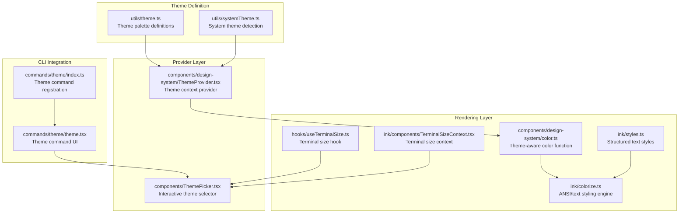
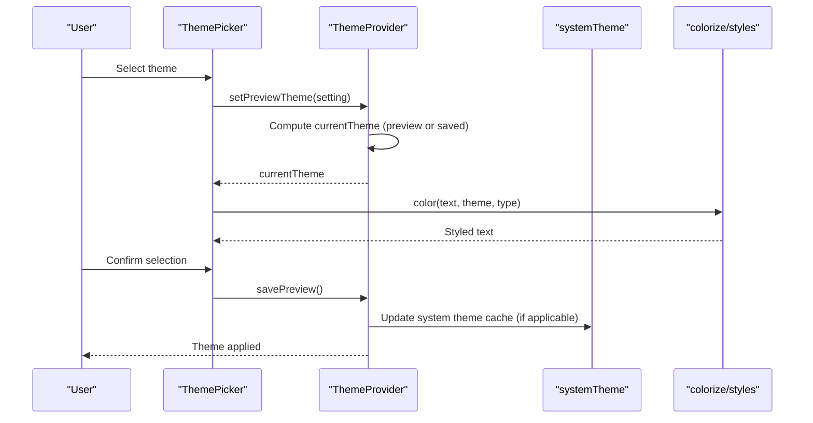
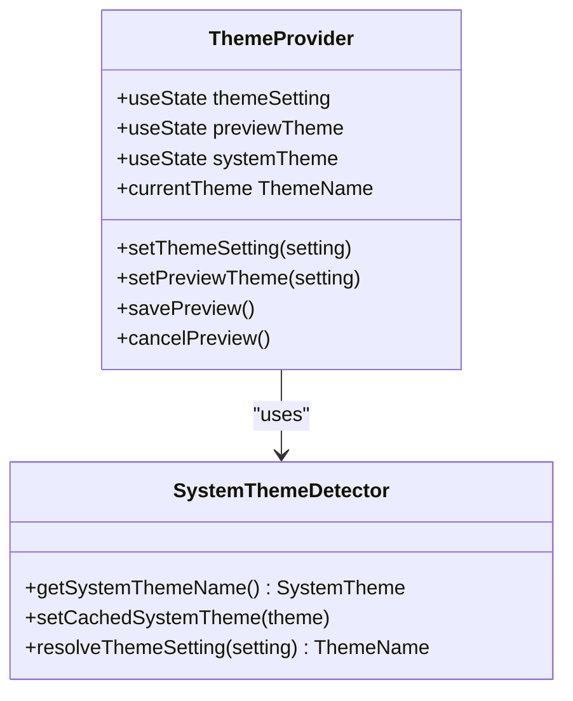
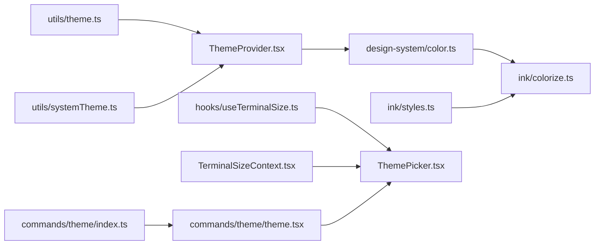

# Styling and Theming System

<cite>
**Referenced Files in This Document**
- [theme.ts](file://src/utils/theme.ts)
- [ThemeProvider.tsx](file://src/components/design-system/ThemeProvider.tsx)
- [color.ts](file://src/components/design-system/color.ts)
- [styles.ts](file://src/ink/styles.ts)
- [colorize.ts](file://src/ink/colorize.ts)
- [systemTheme.ts](file://src/utils/systemTheme.ts)
- [ThemePicker.tsx](file://src/components/ThemePicker.tsx)
- [useTerminalSize.ts](file://src/hooks/useTerminalSize.ts)
- [TerminalSizeContext.tsx](file://src/ink/components/TerminalSizeContext.tsx)
- [theme.tsx](file://src/commands/theme/theme.tsx)
- [index.ts](file://src/commands/theme/index.ts)
- [utils.ts](file://src/components/Spinner/utils.ts)
</cite>

## Table of Contents
1. [Introduction](#introduction)
2. [Project Structure](#project-structure)
3. [Core Components](#core-components)
4. [Architecture Overview](#architecture-overview)
5. [Detailed Component Analysis](#detailed-component-analysis)
6. [Dependency Analysis](#dependency-analysis)
7. [Performance Considerations](#performance-considerations)
8. [Troubleshooting Guide](#troubleshooting-guide)
9. [Conclusion](#conclusion)

## Introduction
This document explains the styling and theming system for the terminal interface. It covers the color palette architecture, theme provider mechanics, terminal-specific styling considerations, design system components, typography scaling, responsive patterns, customization capabilities, dynamic styling, and accessibility compliance. The system ensures consistent visuals across platforms while adapting to terminal capabilities and user preferences.

## Project Structure
The styling system spans several layers:
- Theme definition and resolution in utilities
- Theme provider and context for React components
- Terminal-aware color application and text styling
- Terminal size awareness for responsive layouts
- Theme picker UI and CLI integration



**Diagram sources**
- [theme.ts:1-640](file://src/utils/theme.ts#L1-L640)
- [systemTheme.ts:1-119](file://src/utils/systemTheme.ts#L1-L119)
- [ThemeProvider.tsx:1-170](file://src/components/design-system/ThemeProvider.tsx#L1-L170)
- [ThemePicker.tsx:1-333](file://src/components/ThemePicker.tsx#L1-L333)
- [useTerminalSize.ts:1-15](file://src/hooks/useTerminalSize.ts#L1-L15)
- [TerminalSizeContext.tsx:1-7](file://src/ink/components/TerminalSizeContext.tsx#L1-L7)
- [color.ts:1-31](file://src/components/design-system/color.ts#L1-L31)
- [colorize.ts:1-232](file://src/ink/colorize.ts#L1-L232)
- [styles.ts:1-772](file://src/ink/styles.ts#L1-L772)
- [theme.tsx:1-57](file://src/commands/theme/theme.tsx#L1-L57)
- [index.ts:1-11](file://src/commands/theme/index.ts#L1-L11)

**Section sources**
- [theme.ts:1-640](file://src/utils/theme.ts#L1-L640)
- [ThemeProvider.tsx:1-170](file://src/components/design-system/ThemeProvider.tsx#L1-L170)
- [color.ts:1-31](file://src/components/design-system/color.ts#L1-L31)
- [styles.ts:1-772](file://src/ink/styles.ts#L1-L772)
- [colorize.ts:1-232](file://src/ink/colorize.ts#L1-L232)
- [systemTheme.ts:1-119](file://src/utils/systemTheme.ts#L1-L119)
- [ThemePicker.tsx:1-333](file://src/components/ThemePicker.tsx#L1-L333)
- [useTerminalSize.ts:1-15](file://src/hooks/useTerminalSize.ts#L1-L15)
- [TerminalSizeContext.tsx:1-7](file://src/ink/components/TerminalSizeContext.tsx#L1-L7)
- [theme.tsx:1-57](file://src/commands/theme/theme.tsx#L1-L57)
- [index.ts:1-11](file://src/commands/theme/index.ts#L1-L11)

## Core Components
- Theme palette definitions: A comprehensive set of semantic and functional colors for light/dark modes, ANSI fallbacks, and colorblind-friendly variants.
- Theme provider: Centralized theme state with live system theme detection and preview mode for interactive selection.
- Color application: Theme-aware color function that resolves theme keys to raw color values and delegates to the terminal renderer.
- Terminal styling engine: Structured text styling with support for foreground/background colors, attributes, and border rendering.
- Terminal size awareness: Hook and context for responsive layouts based on terminal dimensions.
- Theme picker: Interactive UI for selecting themes, toggling syntax highlighting, and previewing changes.
- CLI integration: Command wrapper around the theme picker for terminal-based theme switching.

**Section sources**
- [theme.ts:1-640](file://src/utils/theme.ts#L1-L640)
- [ThemeProvider.tsx:1-170](file://src/components/design-system/ThemeProvider.tsx#L1-L170)
- [color.ts:1-31](file://src/components/design-system/color.ts#L1-L31)
- [styles.ts:1-772](file://src/ink/styles.ts#L1-L772)
- [colorize.ts:1-232](file://src/ink/colorize.ts#L1-L232)
- [ThemePicker.tsx:1-333](file://src/components/ThemePicker.tsx#L1-L333)
- [useTerminalSize.ts:1-15](file://src/hooks/useTerminalSize.ts#L1-L15)
- [TerminalSizeContext.tsx:1-7](file://src/ink/components/TerminalSizeContext.tsx#L1-L7)
- [theme.tsx:1-57](file://src/commands/theme/theme.tsx#L1-L57)

## Architecture Overview
The theming system integrates theme resolution, terminal detection, and rendering:



**Diagram sources**
- [ThemePicker.tsx:113-134](file://src/components/ThemePicker.tsx#L113-L134)
- [ThemeProvider.tsx:43-116](file://src/components/design-system/ThemeProvider.tsx#L43-L116)
- [systemTheme.ts:24-47](file://src/utils/systemTheme.ts#L24-L47)
- [colorize.ts:69-169](file://src/ink/colorize.ts#L69-L169)

## Detailed Component Analysis

### Theme Palette System
The palette defines semantic and functional colors for multiple themes:
- Light and dark palettes with explicit RGB values to avoid terminal ANSI inconsistencies
- ANSI fallback palettes for terminals without true color support
- Colorblind-friendly variants with carefully chosen hues and contrasts
- Special-purpose colors for UI elements, diffs, agent branding, and selection highlights

Key characteristics:
- Semantic naming (success, error, warning, permission)
- Shimmer variants for animated effects
- Selection backgrounds optimized for readability
- Consistent brand colors across themes

**Section sources**
- [theme.ts:4-89](file://src/utils/theme.ts#L4-L89)
- [theme.ts:115-191](file://src/utils/theme.ts#L115-L191)
- [theme.ts:197-353](file://src/utils/theme.ts#L197-L353)
- [theme.ts:440-515](file://src/utils/theme.ts#L440-L515)
- [theme.ts:521-596](file://src/utils/theme.ts#L521-L596)

### Theme Provider Architecture
The provider manages theme state and live system detection:
- Stores user preference and preview state
- Resolves 'auto' to current system theme using terminal background detection
- Watches for live terminal theme changes via OSC queries
- Persists theme selections to global configuration



**Diagram sources**
- [ThemeProvider.tsx:43-116](file://src/components/design-system/ThemeProvider.tsx#L43-L116)
- [systemTheme.ts:24-47](file://src/utils/systemTheme.ts#L24-L47)

**Section sources**
- [ThemeProvider.tsx:1-170](file://src/components/design-system/ThemeProvider.tsx#L1-L170)
- [systemTheme.ts:1-119](file://src/utils/systemTheme.ts#L1-L119)

### Terminal-Specific Styling Engine
The rendering pipeline converts theme colors to terminal-safe output:
- Automatic chalk level boosting for xterm.js environments
- tmux-aware color clamping to preserve visual fidelity
- Support for RGB, hex, ANSI256, and named ANSI colors
- Structured text styling with attributes and background application

```mermaid
flowchart TD
Start(["Apply color"]) --> CheckType{"Color type?"}
CheckType --> |ansi:| Ansi["Map to chalk ANSI"]
CheckType --> |#| Hex["chalk.hex()"]
CheckType --> |ansi256(| Ansi256["chalk.ansi256()"]
CheckType --> |rgb(| Rgb["chalk.rgb()"]
CheckType --> |Other| Fallback["No change"]
Ansi --> Attrs["Apply attributes"]
Hex --> Attrs
Ansi256 --> Attrs
Rgb --> Attrs
Fallback --> End(["Return text"])
Attrs --> End
```

**Diagram sources**
- [colorize.ts:69-169](file://src/ink/colorize.ts#L69-L169)
- [styles.ts:15-37](file://src/ink/styles.ts#L15-L37)

**Section sources**
- [colorize.ts:1-232](file://src/ink/colorize.ts#L1-L232)
- [styles.ts:1-772](file://src/ink/styles.ts#L1-L772)

### Design System Components
Theme-aware color function:
- Curried function that resolves theme keys to raw colors
- Delegates to renderer for terminal-safe output
- Supports both theme keys and raw color values

Terminal size awareness:
- Context provides columns/rows for responsive layouts
- Hook throws if used outside Ink app context
- Used by theme picker to render previews at terminal width

**Section sources**
- [color.ts:1-31](file://src/components/design-system/color.ts#L1-L31)
- [useTerminalSize.ts:1-15](file://src/hooks/useTerminalSize.ts#L1-L15)
- [TerminalSizeContext.tsx:1-7](file://src/ink/components/TerminalSizeContext.tsx#L1-L7)

### Typography Scaling and Responsive Patterns
The system uses structured text styles and terminal dimensions:
- Percentage-based widths and heights for flexible layouts
- Gap and margin utilities for spacing
- Border rendering with configurable styles and colors
- Terminal-aware text wrapping and truncation options

Responsive patterns:
- Width in percentage of parent container
- Dynamic preview rendering based on terminal width
- Adaptive spacing using gap/margin utilities

**Section sources**
- [styles.ts:55-404](file://src/ink/styles.ts#L55-L404)
- [ThemePicker.tsx:246-247](file://src/components/ThemePicker.tsx#L246-L247)

### Theme Customization and Dynamic Styling
Interactive theme selection:
- Preview mode allows testing before committing
- Live system theme detection for 'auto' mode
- Toggle for syntax highlighting with persistent settings
- Cross-platform visual consistency through ANSI fallbacks

Dynamic styling patterns:
- Theme keys resolve to appropriate colors per theme variant
- Attribute stacking (bold, italic, underline) applied in correct order
- Background and foreground colors applied with proper precedence

**Section sources**
- [ThemePicker.tsx:73-109](file://src/components/ThemePicker.tsx#L73-L109)
- [ThemeProvider.tsx:64-80](file://src/components/design-system/ThemeProvider.tsx#L64-L80)
- [color.ts:9-30](file://src/components/design-system/color.ts#L9-L30)

### Accessibility Compliance
The system includes built-in accessibility features:
- Colorblind-friendly palettes with improved contrast
- Selection backgrounds optimized for readability
- Attribute-based emphasis (bold, italic) instead of color alone
- Reduced reliance on color for conveying meaning

**Section sources**
- [theme.ts:359-434](file://src/utils/theme.ts#L359-L434)
- [theme.ts:521-596](file://src/utils/theme.ts#L521-L596)

### Examples and Integration Patterns

#### Creating a Custom Theme
- Define a new theme variant with semantic color assignments
- Provide ANSI fallbacks for compatibility
- Register the theme name and ensure resolution logic includes it

#### Component Styling Pattern
- Use theme-aware color function with theme keys
- Apply structured text styles for consistent attributes
- Respect terminal size constraints for responsive layouts

#### Cross-Platform Visual Consistency
- Prefer explicit RGB values over terminal-dependent ANSI
- Test with tmux and various terminal emulators
- Validate color contrast and readability across themes

**Section sources**
- [theme.ts:91-108](file://src/utils/theme.ts#L91-L108)
- [color.ts:9-30](file://src/components/design-system/color.ts#L9-L30)
- [styles.ts:40-53](file://src/ink/styles.ts#L40-L53)

## Dependency Analysis
The theming system exhibits low coupling and clear separation of concerns:
- Utilities define immutable theme data
- Provider manages state and system detection
- Rendering layer handles terminal-specific output
- UI components consume context and provide interactivity



**Diagram sources**
- [theme.ts:1-640](file://src/utils/theme.ts#L1-L640)
- [systemTheme.ts:1-119](file://src/utils/systemTheme.ts#L1-L119)
- [ThemeProvider.tsx:1-170](file://src/components/design-system/ThemeProvider.tsx#L1-L170)
- [color.ts:1-31](file://src/components/design-system/color.ts#L1-L31)
- [colorize.ts:1-232](file://src/ink/colorize.ts#L1-L232)
- [styles.ts:1-772](file://src/ink/styles.ts#L1-L772)
- [useTerminalSize.ts:1-15](file://src/hooks/useTerminalSize.ts#L1-L15)
- [TerminalSizeContext.tsx:1-7](file://src/ink/components/TerminalSizeContext.tsx#L1-L7)
- [ThemePicker.tsx:1-333](file://src/components/ThemePicker.tsx#L1-L333)
- [theme.tsx:1-57](file://src/commands/theme/theme.tsx#L1-L57)
- [index.ts:1-11](file://src/commands/theme/index.ts#L1-L11)

**Section sources**
- [theme.ts:1-640](file://src/utils/theme.ts#L1-L640)
- [ThemeProvider.tsx:1-170](file://src/components/design-system/ThemeProvider.tsx#L1-L170)
- [colorize.ts:1-232](file://src/ink/colorize.ts#L1-L232)
- [styles.ts:1-772](file://src/ink/styles.ts#L1-L772)
- [ThemePicker.tsx:1-333](file://src/components/ThemePicker.tsx#L1-L333)

## Performance Considerations
- Theme resolution is cached and computed efficiently
- System theme detection uses memoization and background polling
- Color conversion leverages chalk's optimized escape sequence generation
- Terminal size queries are lightweight and context-bound
- ANSI fallbacks minimize color computation overhead

## Troubleshooting Guide
Common issues and resolutions:
- Colors appear washed out in containers: Verify tmux environment and chalk level settings
- 'Auto' theme not updating: Check OSC query responses and system theme watcher initialization
- Syntax highlighting conflicts: Disable via theme picker or environment variable
- Terminal size mismatches: Ensure TerminalSizeContext is properly initialized within Ink app

**Section sources**
- [colorize.ts:20-62](file://src/ink/colorize.ts#L20-L62)
- [systemTheme.ts:24-47](file://src/utils/systemTheme.ts#L24-L47)
- [ThemePicker.tsx:73-109](file://src/components/ThemePicker.tsx#L73-L109)

## Conclusion
The styling and theming system provides a robust, terminal-first approach to visual design. It balances flexibility with consistency, supports dynamic adaptation to terminal environments, and maintains accessibility standards across diverse platforms and configurations.