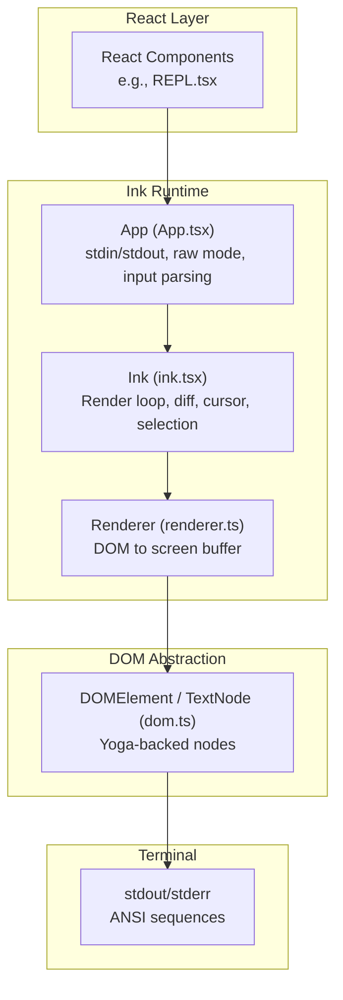
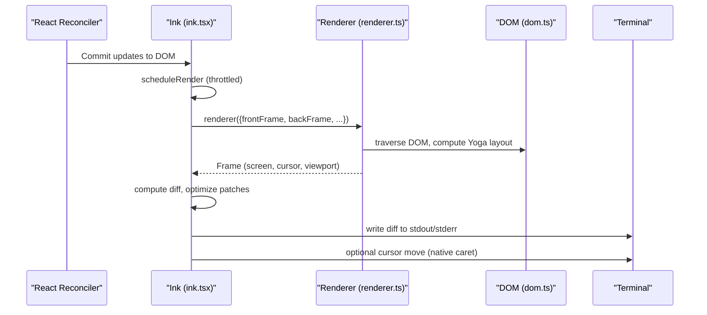
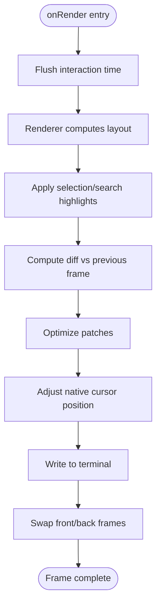
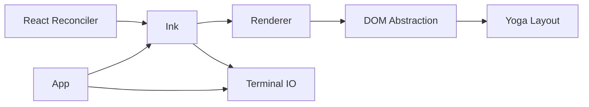

# Terminal Interface

<cite>
**Referenced Files in This Document**
- [ink.tsx](file://src/ink/ink.tsx)
- [renderer.ts](file://src/ink/renderer.ts)
- [root.ts](file://src/ink/root.ts)
- [App.tsx](file://src/ink/components/App.tsx)
- [dom.ts](file://src/ink/dom.ts)
- [REPL.tsx](file://src/screens/REPL.tsx)
</cite>

## Table of Contents
1. [Introduction](#introduction)
2. [Project Structure](#project-structure)
3. [Core Components](#core-components)
4. [Architecture Overview](#architecture-overview)
5. [Detailed Component Analysis](#detailed-component-analysis)
6. [Dependency Analysis](#dependency-analysis)
7. [Performance Considerations](#performance-considerations)
8. [Troubleshooting Guide](#troubleshooting-guide)
9. [Conclusion](#conclusion)

## Introduction
This document explains the terminal-based user interface built with the Ink framework. It describes the React-based terminal UI architecture, component hierarchy, rendering pipeline, input/output handling, styling system, and responsive design patterns. It also covers the REPL interface, message rendering, interactive components, accessibility, performance, and cross-platform compatibility. Practical guidance is included for both users and developers who want to understand or extend the terminal UI.

## Project Structure
The terminal UI is implemented as a layered system:
- Ink runtime: orchestrates rendering, input handling, and terminal output
- React reconciler integration: renders Ink components into a virtual DOM with Yoga layout
- DOM abstraction: Ink nodes backed by Yoga for layout and measurement
- Renderer: converts the DOM tree into a terminal screen buffer with diff optimization
- App wrapper: manages stdin/stdout lifecycle, raw mode, and terminal capabilities

**Diagram sources**
- [ink.tsx:76-800](file://src/ink/ink.tsx#L76-800)
- [renderer.ts:31-179](file://src/ink/renderer.ts#L31-179)
- [App.tsx:101-440](file://src/ink/components/App.tsx#L101-440)
- [dom.ts:110-132](file://src/ink/dom.ts#L110-132)

**Section sources**
- [ink.tsx:76-800](file://src/ink/ink.tsx#L76-800)
- [renderer.ts:31-179](file://src/ink/renderer.ts#L31-179)
- [App.tsx:101-440](file://src/ink/components/App.tsx#L101-440)
- [dom.ts:110-132](file://src/ink/dom.ts#L110-132)

## Core Components
- Ink: main runtime that coordinates rendering, input processing, diff computation, and terminal output. It maintains front/back frame buffers, selection state, search highlighting, cursor positioning, and handles resize/suspend/resume.
- Renderer: transforms the DOM tree into a screen buffer, computes layout via Yoga, and returns a frame with cursor and viewport metadata.
- App: wraps the React tree, manages stdin/stdout, raw mode, terminal capability probing, and input parsing. It also handles suspend/resume and focus events.
- DOM abstraction: Ink nodes (DOMElement/TextNode) backed by Yoga layout nodes, with attributes, styles, and scroll state.

Key responsibilities:
- Rendering: React reconciler commits to Ink DOM; Ink renderer produces a frame; Ink writes minimal diffs to terminal.
- Input: App parses stdin, handles raw mode, mouse/keyboard events, and terminal focus.
- Layout: Yoga computes sizes/positions; Ink uses them to render efficiently.
- Accessibility: cursor visibility and native cursor parking for screen readers.

**Section sources**
- [ink.tsx:76-800](file://src/ink/ink.tsx#L76-800)
- [renderer.ts:31-179](file://src/ink/renderer.ts#L31-179)
- [App.tsx:101-440](file://src/ink/components/App.tsx#L101-440)
- [dom.ts:110-132](file://src/ink/dom.ts#L110-132)

## Architecture Overview
The runtime follows a render-diff-write cycle:
1. React reconciler commits updates to Ink DOM
2. Ink schedules a render via throttled scheduler
3. Renderer computes layout and builds a frame
4. Ink computes diffs against the previous frame and optimizes patches
5. Ink writes minimal ANSI sequences to stdout/stderr
6. Ink optionally parks the native cursor at the caret for IME/screen readers

**Diagram sources**
- [ink.tsx:420-789](file://src/ink/ink.tsx#L420-789)
- [renderer.ts:38-177](file://src/ink/renderer.ts#L38-177)
- [dom.ts:393-423](file://src/ink/dom.ts#L393-423)

## Detailed Component Analysis

### Ink Runtime
Responsibilities:
- Manage frame buffers and swap them after diff
- Compute and apply selection/search highlights
- Optimize and write minimal patches to terminal
- Park native cursor at declared caret position
- Handle resize, suspend/resume, and alternate screen transitions

Highlights:
- Uses a throttle to batch render requests and avoid excessive redraws
- Maintains selection and search highlight state for alt-screen mode
- Writes cursor movement sequences to anchor physical cursor and reduce drift
- Supports full-screen and alternate-screen modes with proper mouse tracking and focus reporting

**Diagram sources**
- [ink.tsx:420-789](file://src/ink/ink.tsx#L420-789)

**Section sources**
- [ink.tsx:76-800](file://src/ink/ink.tsx#L76-800)

### Renderer
Responsibilities:
- Convert DOM tree to screen buffer
- Compute Yoga layout and handle invalid dimensions
- Support scroll hints and drain nodes for smooth scrolling
- Respect contamination flags to avoid blitting stale data

Behavior:
- Returns empty frame if Yoga dimensions are invalid
- Clamps alt-screen height to terminal rows
- Resets layout-shifted and scroll flags before traversal
- Drains scroll nodes to maintain smoothness

**Section sources**
- [renderer.ts:31-179](file://src/ink/renderer.ts#L31-179)

### App Component
Responsibilities:
- Manage stdin/stdout lifecycle and raw mode
- Parse input, handle Ctrl+C, suspend/resume, focus events
- Probe terminal capabilities (XTVERSION) and set extended key reporting
- Provide contexts for size, stdin, cursor declaration, and focus

Key behaviors:
- Enables/disables bracketed paste, focus reporting, and extended key reporting
- Handles long stdin gaps to reassert terminal modes
- Supports suspend/resume with proper restoration of raw mode and cursor state

**Section sources**
- [App.tsx:101-440](file://src/ink/components/App.tsx#L101-440)

### DOM Abstraction
Responsibilities:
- Define Ink nodes (elements and text) backed by Yoga
- Track dirty state and propagate to ancestors
- Measure text nodes and raw ANSI nodes
- Maintain scroll state for overflow containers

Features:
- Dirty propagation to ancestors for efficient re-rendering
- Text measurement with wrapping and tab expansion
- Scroll clamping and sticky scroll for virtualized lists
- Owner chain tracing for debugging repaints

**Section sources**
- [dom.ts:110-132](file://src/ink/dom.ts#L110-132)
- [dom.ts:332-387](file://src/ink/dom.ts#L332-387)
- [dom.ts:393-423](file://src/ink/dom.ts#L393-423)

### REPL Interface
The REPL screen integrates with the Ink runtime to provide:
- Persistent input area at the bottom
- Scrollable message history
- Real-time streaming output
- Interactive controls and status indicators

Typical flow:
- REPL renders messages and input area
- Ink handles input parsing and dispatch
- Renderer lays out the DOM and produces a frame
- Ink writes diffs and parks the cursor at the input caret

Note: The REPL component is located at [REPL.tsx](file://src/screens/REPL.tsx).

**Section sources**
- [REPL.tsx](file://src/screens/REPL.tsx)

## Dependency Analysis
The system exhibits clear layering:
- React reconciler depends on Ink DOM APIs
- Ink depends on Renderer and DOM abstractions
- Renderer depends on DOM and Yoga layout
- App depends on terminal capabilities and stdin/stdout streams
- Terminal output depends on Ink patches and cursor management

**Diagram sources**
- [ink.tsx:236-269](file://src/ink/ink.tsx#L236-269)
- [renderer.ts:34-46](file://src/ink/renderer.ts#L34-46)
- [dom.ts:1-10](file://src/ink/dom.ts#L1-10)
- [App.tsx:209-280](file://src/ink/components/App.tsx#L209-280)

**Section sources**
- [ink.tsx:236-269](file://src/ink/ink.tsx#L236-269)
- [renderer.ts:34-46](file://src/ink/renderer.ts#L34-46)
- [dom.ts:1-10](file://src/ink/dom.ts#L1-10)
- [App.tsx:209-280](file://src/ink/components/App.tsx#L209-280)

## Performance Considerations
- Throttled rendering: Ink uses a throttle to batch render requests and avoid frequent redraws
- Diff optimization: Ink computes minimal patches and writes only changed regions
- Yoga layout caching: Yoga nodes are reused across frames to minimize recomputation
- Pool resets: Character and hyperlink pools are periodically reset to prevent unbounded growth
- Scroll smoothing: Pending scroll deltas are drained at higher frequency for smooth scrolling
- Dirty propagation: Efficiently marks only affected subtrees to reduce layout work

Recommendations:
- Minimize unnecessary re-renders by memoizing props and avoiding deep object churn
- Prefer stable style objects to leverage shallow equality checks
- Use virtual scrolling for large lists to limit DOM size
- Avoid excessive use of raw ANSI nodes; prefer structured text when possible

[No sources needed since this section provides general guidance]

## Troubleshooting Guide
Common issues and remedies:
- Terminal flicker on resize: Ink prepends erase and cursor-home patches inside a synchronized block to keep content atomic
- Cursor drift: Ink anchors the physical cursor at (0,0) in alt-screen and parks at the bottom row to prevent drift
- Mouse tracking lost after suspend/wake: Ink reasserts terminal modes after stdin resumes
- Selection artifacts: Ink applies selection overlays directly to the screen buffer and flags contamination to force full damage on next frame
- Accessibility: Ink hides the native cursor except in accessibility mode; ensure environment variable is set if needed

Operational hooks:
- onFrame callback provides timing metrics for renderer, diff, optimize, and write phases
- Debug repaints: Owner chain tracing helps attribute full resets to specific components

**Section sources**
- [ink.tsx:309-346](file://src/ink/ink.tsx#L309-346)
- [ink.tsx:624-651](file://src/ink/ink.tsx#L624-651)
- [ink.tsx:280-301](file://src/ink/ink.tsx#L280-301)
- [ink.tsx:554-566](file://src/ink/ink.tsx#L554-566)
- [App.tsx:182-190](file://src/ink/components/App.tsx#L182-190)

## Conclusion
The Ink-based terminal UI combines React’s declarative model with a high-performance terminal rendering pipeline. Its architecture separates concerns across DOM abstraction, Yoga layout, renderer, and terminal IO, enabling efficient diffs, responsive input handling, and robust accessibility. By leveraging throttling, diff optimization, and careful cursor management, it delivers a smooth, cross-platform terminal experience suitable for REPLs, chat interfaces, and interactive tools.