# Terminal Rendering System

<cite>
**Referenced Files in This Document**
- [ink.tsx](file://claude_code_src/restored-src/src/ink/ink.tsx)
- [renderer.ts](file://claude_code_src/restored-src/src/ink/renderer.ts)
- [render-node-to-output.ts](file://claude_code_src/restored-src/src/ink/render-node-to-output.ts)
- [render-to-screen.ts](file://claude_code_src/restored-src/src/ink/render-to-screen.ts)
- [output.ts](file://claude_code_src/restored-src/src/ink/output.ts)
- [screen.ts](file://claude_code_src/restored-src/src/ink/screen.ts)
- [dom.ts](file://claude_code_src/restored-src/src/ink/dom.ts)
- [frame.ts](file://claude_code_src/restored-src/src/ink/frame.ts)
- [log-update.ts](file://claude_code_src/restored-src/src/ink/log-update.ts)
- [terminal.ts](file://claude_code_src/restored-src/src/ink/terminal.ts)
</cite>

## Table of Contents
1. [Introduction](#introduction)
2. [System Architecture](#system-architecture)
3. [Core Components](#core-components)
4. [Rendering Pipeline](#rendering-pipeline)
5. [Screen Buffer Management](#screen-buffer-management)
6. [ANSI Styling System](#ansi-styling-system)
7. [Performance Optimizations](#performance-optimizations)
8. [Terminal Compatibility](#terminal-compatibility)
9. [Custom Rendering Behaviors](#custom-rendering-behaviors)
10. [Debugging Techniques](#debugging-techniques)
11. [Troubleshooting Guide](#troubleshooting-guide)
12. [Conclusion](#conclusion)

## Introduction

The terminal rendering system in this codebase is a sophisticated React-compatible rendering engine that converts JSX components into terminal output. Built around the Ink framework, it provides a complete solution for creating interactive terminal applications with modern web development paradigms.

The system bridges the gap between React's declarative component model and terminal output by implementing a custom rendering pipeline that handles layout calculation, text measurement, character encoding, and ANSI styling. It manages complex scenarios like text selection, search highlighting, scrolling, and terminal compatibility across different environments.

## System Architecture

The terminal rendering system follows a layered architecture with clear separation of concerns:

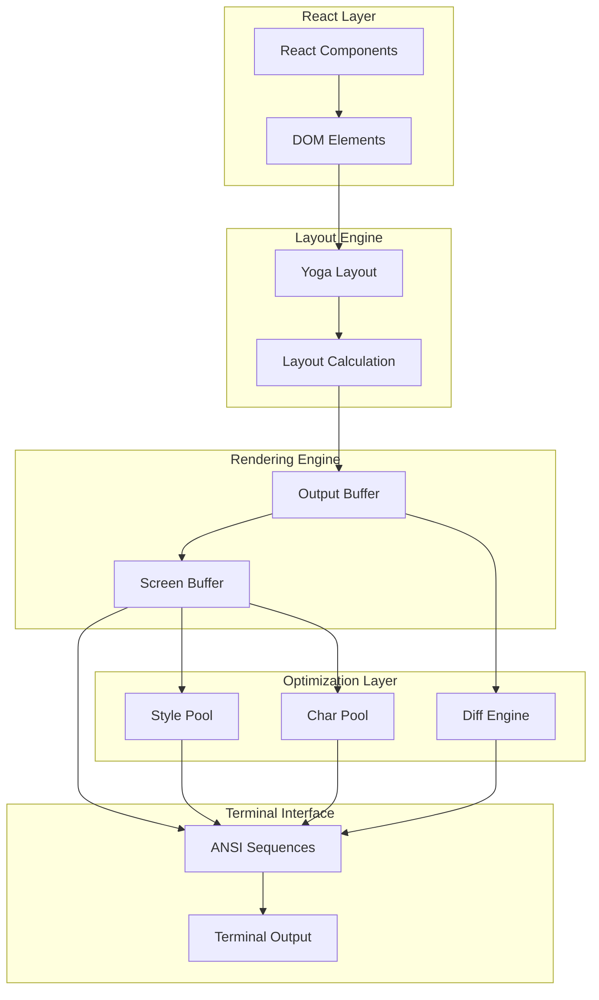

**Diagram sources**
- [ink.tsx:420-789](file://claude_code_src/restored-src/src/ink/ink.tsx#L420-L789)
- [renderer.ts:31-178](file://claude_code_src/restored-src/src/ink/renderer.ts#L31-L178)
- [output.ts:170-532](file://claude_code_src/restored-src/src/ink/output.ts#L170-L532)

The architecture consists of several key layers:

1. **React Integration Layer**: Converts React components to DOM elements with Yoga layout nodes
2. **Layout Calculation Engine**: Uses Facebook's Yoga for precise text and layout measurement
3. **Rendering Pipeline**: Transforms layout data into screen buffers with optimized memory management
4. **Terminal Interface**: Generates ANSI escape sequences for actual terminal output
5. **Optimization Layer**: Implements diffing algorithms and resource pooling for performance

**Section sources**
- [ink.tsx:180-279](file://claude_code_src/restored-src/src/ink/ink.tsx#L180-L279)
- [renderer.ts:31-178](file://claude_code_src/restored-src/src/ink/renderer.ts#L31-L178)

## Core Components

### Ink Renderer Class

The central orchestrator that manages the entire rendering lifecycle:

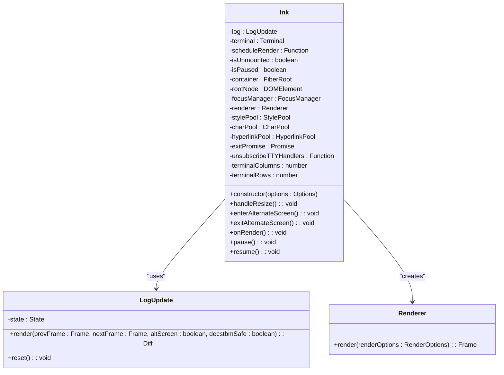

**Diagram sources**
- [ink.tsx:76-800](file://claude_code_src/restored-src/src/ink/ink.tsx#L76-L800)
- [log-update.ts:43-468](file://claude_code_src/restored-src/src/ink/log-update.ts#L43-L468)

### Screen Buffer System

The screen buffer manages the terminal state with efficient memory usage:

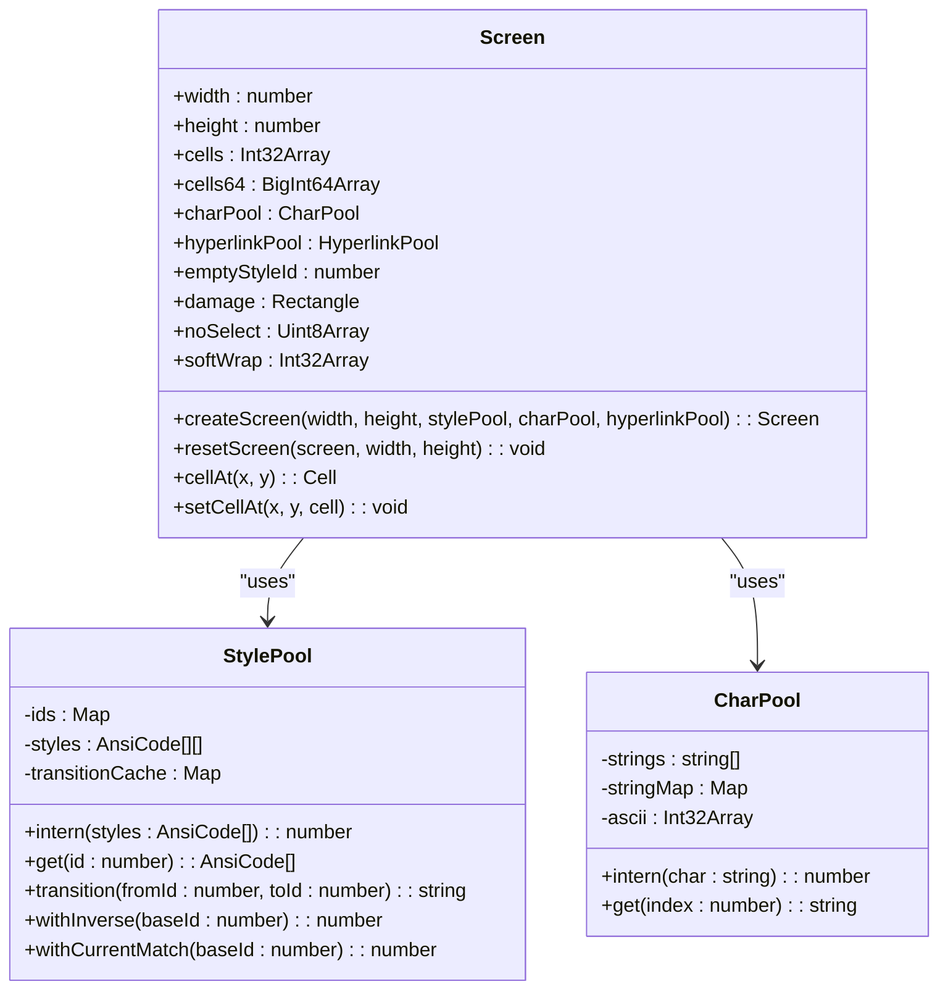

**Diagram sources**
- [screen.ts:451-544](file://claude_code_src/restored-src/src/ink/screen.ts#L451-L544)
- [screen.ts:112-260](file://claude_code_src/restored-src/src/ink/screen.ts#L112-L260)
- [screen.ts:21-53](file://claude_code_src/restored-src/src/ink/screen.ts#L21-L53)

**Section sources**
- [ink.tsx:96-198](file://claude_code_src/restored-src/src/ink/ink.tsx#L96-L198)
- [screen.ts:451-544](file://claude_code_src/restored-src/src/ink/screen.ts#L451-L544)

## Rendering Pipeline

The rendering pipeline transforms React components through multiple stages:

### Stage 1: React to DOM Conversion

The system converts React components into a custom DOM representation with Yoga layout capabilities:

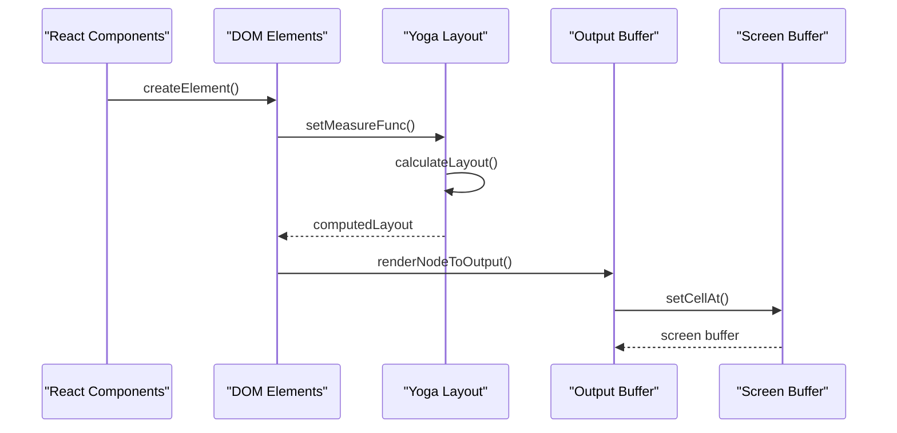

**Diagram sources**
- [dom.ts:110-132](file://claude_code_src/restored-src/src/ink/dom.ts#L110-L132)
- [render-node-to-output.ts:387-408](file://claude_code_src/restored-src/src/ink/render-node-to-output.ts#L387-L408)
- [output.ts:268-532](file://claude_code_src/restored-src/src/ink/output.ts#L268-L532)

### Stage 2: Layout Calculation

The layout engine calculates precise dimensions and positions:

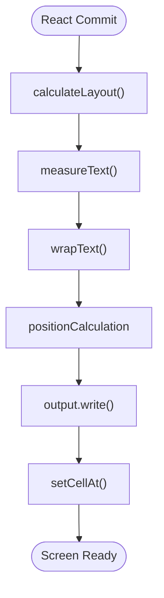

**Diagram sources**
- [dom.ts:332-374](file://claude_code_src/restored-src/src/ink/dom.ts#L332-L374)
- [render-node-to-output.ts:549-627](file://claude_code_src/restored-src/src/ink/render-node-to-output.ts#L549-L627)

### Stage 3: Diff Generation

The diff engine identifies minimal changes between frames:

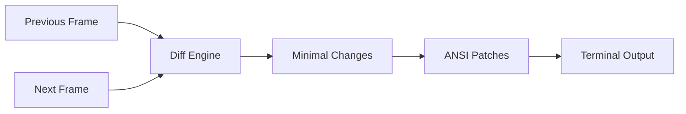

**Diagram sources**
- [log-update.ts:123-468](file://claude_code_src/restored-src/src/ink/log-update.ts#L123-L468)

**Section sources**
- [dom.ts:110-132](file://claude_code_src/restored-src/src/ink/dom.ts#L110-L132)
- [render-node-to-output.ts:387-408](file://claude_code_src/restored-src/src/ink/render-node-to-output.ts#L387-L408)
- [log-update.ts:123-468](file://claude_code_src/restored-src/src/ink/log-update.ts#L123-L468)

## Screen Buffer Management

The screen buffer system implements advanced memory management and optimization techniques:

### Memory Layout Optimization

The system uses a packed array structure to minimize memory footprint:

| Field | Type | Description |
|-------|------|-------------|
| `cells` | `Int32Array` | Packed cell data (2 ints per cell) |
| `cells64` | `BigInt64Array` | Bulk operations view |
| `charPool` | `CharPool` | Character string interning |
| `hyperlinkPool` | `HyperlinkPool` | Hyperlink string interning |
| `noSelect` | `Uint8Array` | Selection exclusion bitmap |
| `softWrap` | `Int32Array` | Soft wrap continuation markers |

### Cell Structure

Each cell is represented as two 32-bit integers packed into one 64-bit value:

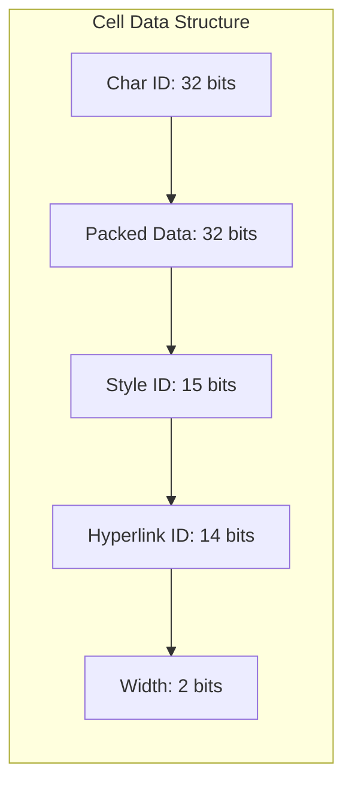

**Diagram sources**
- [screen.ts:332-354](file://claude_code_src/restored-src/src/ink/screen.ts#L332-L354)

### Damage Tracking

The system implements intelligent damage tracking to minimize redraw operations:

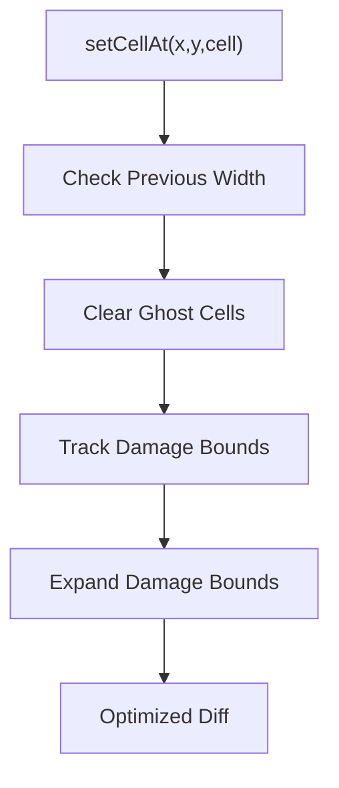

**Diagram sources**
- [screen.ts:693-794](file://claude_code_src/restored-src/src/ink/screen.ts#L693-L794)

**Section sources**
- [screen.ts:332-354](file://claude_code_src/restored-src/src/ink/screen.ts#L332-L354)
- [screen.ts:693-794](file://claude_code_src/restored-src/src/ink/screen.ts#L693-L794)

## ANSI Styling System

The styling system provides comprehensive ANSI support with performance optimizations:

### Style Pool Implementation

The StylePool class manages efficient style interning and transitions:

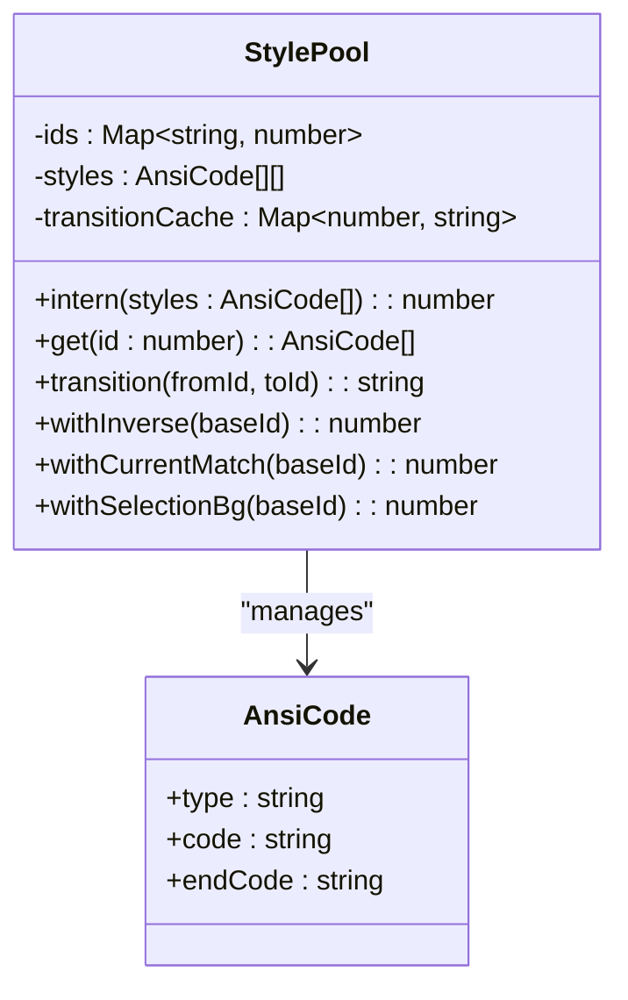

**Diagram sources**
- [screen.ts:112-260](file://claude_code_src/restored-src/src/ink/screen.ts#L112-L260)

### Style Transitions

The system caches style transitions to avoid repeated ANSI code generation:

| Style Type | Purpose | Example |
|------------|---------|---------|
| `withInverse` | Selection highlighting | `SGR 7` inversion |
| `withCurrentMatch` | Search highlighting | `FG yellow + underline` |
| `withSelectionBg` | Custom selection backgrounds | Solid color backgrounds |

### Hyperlink Support

The system implements OSC 8 hyperlink protocol with automatic URL detection:

```mermaid
sequenceDiagram
participant Text as "Styled Text"
participant Parser as "Hyperlink Parser"
participant OSC8 as "OSC 8 Generator"
participant Terminal as "Terminal"
Text->>Parser : extractHyperlinkFromStyles()
Parser->>OSC8 : generateOSC8Sequence(url)
OSC8->>Terminal : ESC]8;;urlBEL
OSC8->>Terminal : text
OSC8->>Terminal : ESC]8;;BEL
```

**Diagram sources**
- [output.ts:586-620](file://claude_code_src/restored-src/src/ink/output.ts#L586-L620)

**Section sources**
- [screen.ts:112-260](file://claude_code_src/restored-src/src/ink/screen.ts#L112-L260)
- [output.ts:586-620](file://claude_code_src/restored-src/src/ink/output.ts#L586-L620)

## Performance Optimizations

The system implements multiple layers of performance optimizations:

### 1. Resource Pooling

Memory-efficient pooling reduces garbage collection pressure:

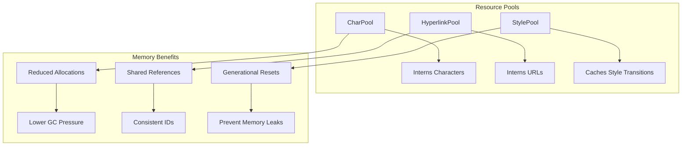

**Diagram sources**
- [screen.ts:21-75](file://claude_code_src/restored-src/src/ink/screen.ts#L21-L75)

### 2. Incremental Rendering

The system minimizes work through intelligent caching and diffing:

| Optimization | Benefit | Implementation |
|--------------|---------|----------------|
| `markDirty` | Prevents unnecessary re-renders | DOM-level dirty flag propagation |
| `nodeCache` | Stores layout rectangles | Cache layout bounds per node |
| `charCache` | Reuses tokenized text | Map of pre-clustered characters |
| `transitionCache` | Caches style transitions | Map of (fromId,toId) → string |

### 3. Frame Throttling

The rendering system uses throttling to balance responsiveness and performance:

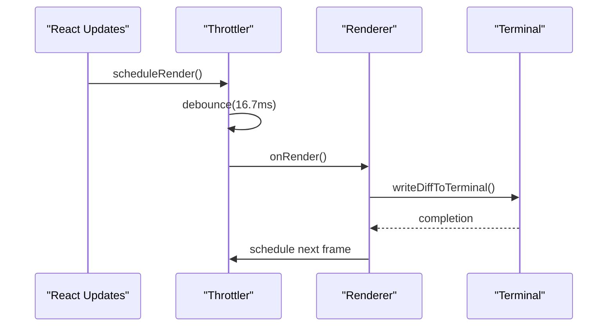

**Diagram sources**
- [ink.tsx:212-216](file://claude_code_src/restored-src/src/ink/ink.tsx#L212-L216)

### 4. Scroll Optimization

Hardware-accelerated scrolling for smooth user experience:

| Technique | Description | Performance Impact |
|-----------|-------------|-------------------|
| `DECSTBM` | Hardware scroll regions | ~50% reduction in bytes |
| `blitRegion` | Direct memory copy | ~95% reduction in CPU |
| `shiftRows` | In-place row shifting | ~80% reduction in writes |

**Section sources**
- [screen.ts:21-75](file://claude_code_src/restored-src/src/ink/screen.ts#L21-L75)
- [ink.tsx:212-216](file://claude_code_src/restored-src/src/ink/ink.tsx#L212-L216)

## Terminal Compatibility

The system handles various terminal environments and protocols:

### Terminal Capability Detection

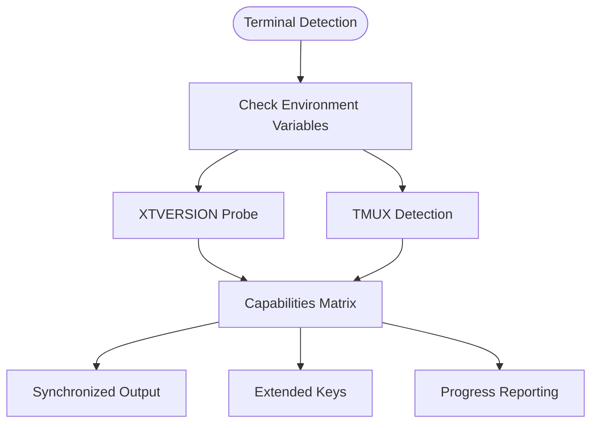

**Diagram sources**
- [terminal.ts:120-183](file://claude_code_src/restored-src/src/ink/terminal.ts#L120-L183)

### Supported Features Matrix

| Feature | iTerm2 | WezTerm | Alacritty | VS Code | Windows Terminal |
|---------|--------|---------|-----------|---------|------------------|
| DEC 2026 | ✓ | ✓ | ✓ | ✓ | ✓ |
| Kitty Keyboard | ✓ | ✓ | ✓ | ✓ | ✓ |
| OSC 9;4 Progress | ✓ | ✓ | ✗ | ✗ | ✗ |
| Extended Keys | ✓ | ✓ | ✓ | ✓ | ✓ |

### Escape Sequence Management

The system generates appropriate escape sequences for each terminal type:

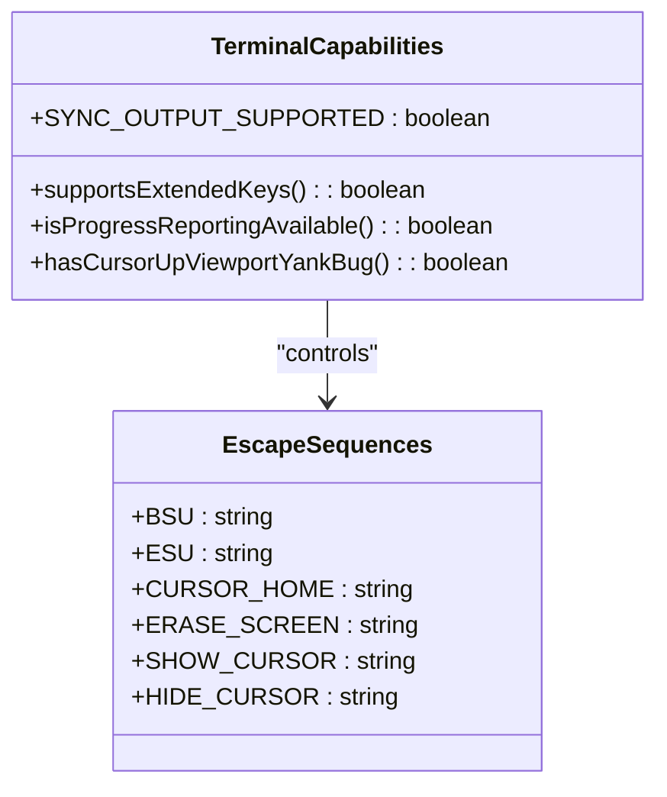

**Diagram sources**
- [terminal.ts:185-248](file://claude_code_src/restored-src/src/ink/terminal.ts#L185-L248)

**Section sources**
- [terminal.ts:120-183](file://claude_code_src/restored-src/src/ink/terminal.ts#L120-L183)
- [terminal.ts:185-248](file://claude_code_src/restored-src/src/ink/terminal.ts#L185-L248)

## Custom Rendering Behaviors

### Alternate Screen Mode

The system supports alternate screen buffer for full-screen applications:

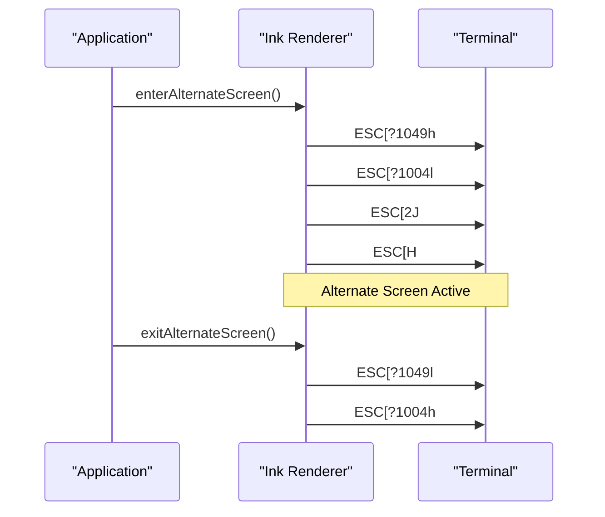

**Diagram sources**
- [ink.tsx:357-419](file://claude_code_src/restored-src/src/ink/ink.tsx#L357-L419)

### Custom Component Types

The system supports specialized component types:

| Component | Purpose | Special Handling |
|-----------|---------|------------------|
| `ink-text` | Text rendering with wrapping | Style application, hyperlink support |
| `ink-box` | Container with overflow handling | Clipping, scrolling, no-select regions |
| `ink-raw-ansi` | Pre-formatted ANSI content | Direct output, no processing |
| `ink-link` | Interactive hyperlinks | OSC 8 protocol, click handling |
| `ink-progress` | Progress indicators | OSC 9;4 protocol |

### Scroll Behavior Customization

Advanced scrolling with smooth animations and sticky behavior:

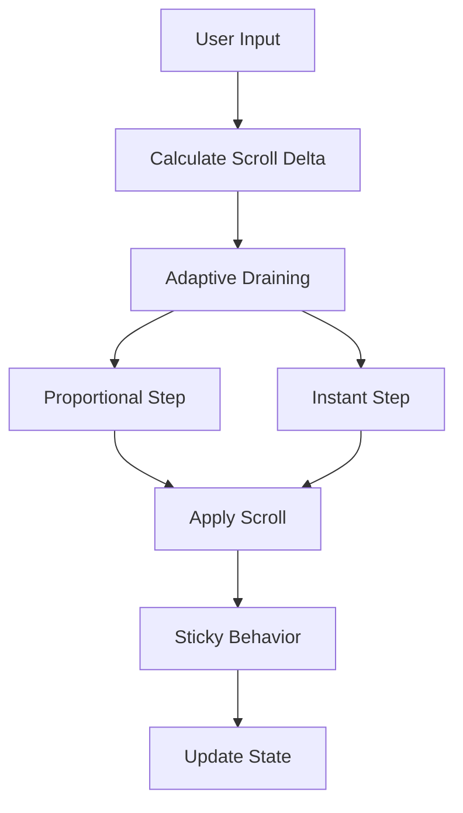

**Diagram sources**
- [render-node-to-output.ts:124-176](file://claude_code_src/restored-src/src/ink/render-node-to-output.ts#L124-L176)

**Section sources**
- [ink.tsx:357-419](file://claude_code_src/restored-src/src/ink/ink.tsx#L357-L419)
- [render-node-to-output.ts:124-176](file://claude_code_src/restored-src/src/ink/render-node-to-output.ts#L124-L176)

## Debugging Techniques

### Performance Profiling

The system provides comprehensive performance metrics:

| Metric | Description | Collection Method |
|--------|-------------|-------------------|
| `renderer` | Layout + rendering time | Frame timing |
| `diff` | Diff generation time | LogUpdate profiling |
| `optimize` | Patch optimization time | Optimization timing |
| `write` | Terminal write time | Write function |
| `yoga` | Layout calculation time | Yoga counters |
| `commit` | React commit time | React reconciliation |

### Debug Modes

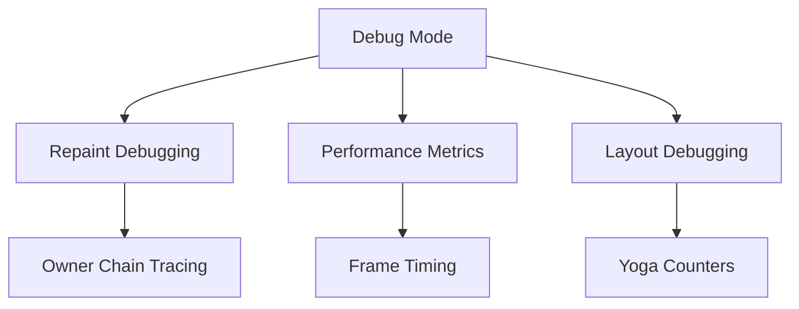

**Diagram sources**
- [ink.tsx:103-115](file://claude_code_src/restored-src/src/ink/ink.tsx#L103-L115)

### Common Issues and Solutions

| Issue | Symptoms | Solution |
|-------|----------|----------|
| Stuttering Scrolling | Choppy scroll animations | Enable adaptive draining |
| Blinking Content | Screen flicker on resize | Use synchronized output |
| Wrong Cursor Position | Incorrect input location | Check cursor declaration |
| Memory Leaks | Growing memory usage | Monitor pool resets |

**Section sources**
- [ink.tsx:103-115](file://claude_code_src/restored-src/src/ink/ink.tsx#L103-L115)

## Troubleshooting Guide

### Common Rendering Issues

**Issue: Screen Flicker During Resize**
- **Cause**: Missing synchronized output support
- **Solution**: Check `SYNC_OUTPUT_SUPPORTED` and use appropriate fallback

**Issue: Incorrect Text Wrapping**
- **Cause**: Wide character handling problems
- **Solution**: Verify `CellWidth` classification and `stringWidth` calculations

**Issue: Style Transition Artifacts**
- **Cause**: Incomplete style state synchronization
- **Solution**: Ensure proper style pool usage and transition caching

### Performance Issues

**High Memory Usage**
- Monitor pool sizes and implement manual resets
- Check for excessive node creation/destruction
- Verify proper cleanup of Yoga nodes

**Slow Rendering**
- Profile frame timing to identify bottlenecks
- Check for unnecessary re-renders with `markDirty`
- Optimize text wrapping and style application

### Terminal-Specific Problems

**Windows Terminal Issues**
- Disable progress reporting for OSC 9;4
- Handle cursor up viewport yank bug
- Verify Kitty keyboard protocol support

**VS Code Integration**
- Handle XTVERSION probing delays
- Manage xterm.js-specific scroll behavior
- Configure proper hyperlink support

**Section sources**
- [terminal.ts:171-179](file://claude_code_src/restored-src/src/ink/terminal.ts#L171-L179)
- [log-update.ts:503-513](file://claude_code_src/restored-src/src/ink/log-update.ts#L503-L513)

## Conclusion

The terminal rendering system represents a sophisticated solution for bridging modern web development paradigms with terminal output. Its architecture demonstrates several key strengths:

**Technical Excellence**
- Efficient memory management through resource pooling
- Intelligent diffing algorithms for minimal terminal updates
- Comprehensive ANSI styling support with performance optimizations
- Robust terminal compatibility across diverse environments

**Architectural Strengths**
- Clear separation of concerns between layout, rendering, and terminal interface
- Extensible component system supporting custom rendering behaviors
- Comprehensive performance monitoring and optimization
- Flexible escape sequence generation for different terminal types

**Practical Benefits**
- Seamless React integration with custom DOM elements
- Advanced features like text selection, search highlighting, and scrolling
- Production-ready performance with throttling and optimization
- Comprehensive debugging and profiling capabilities

The system successfully transforms the complexity of terminal rendering into a developer-friendly API while maintaining high performance and broad compatibility. Its modular design allows for easy extension and customization while preserving the reliability needed for production terminal applications.