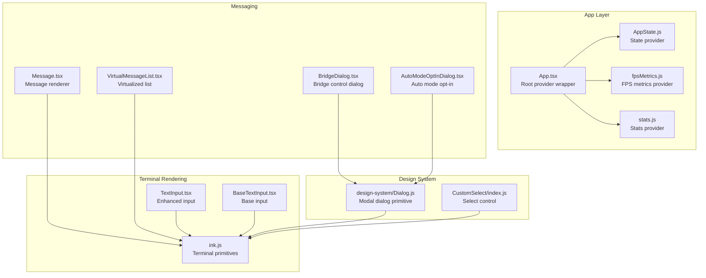
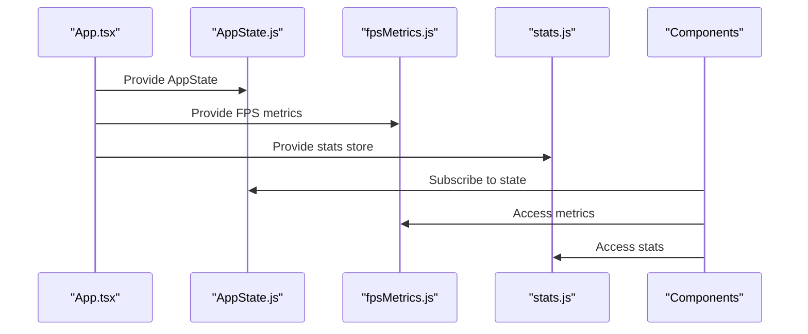
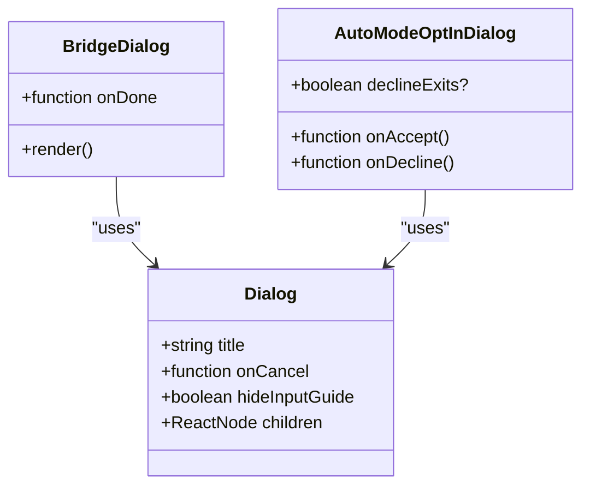
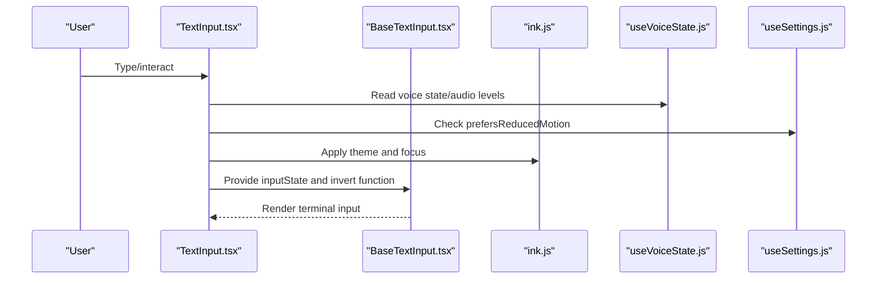
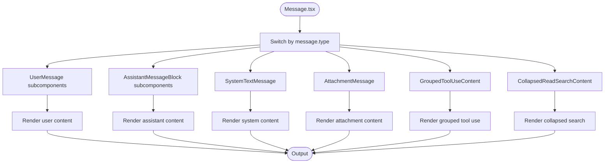
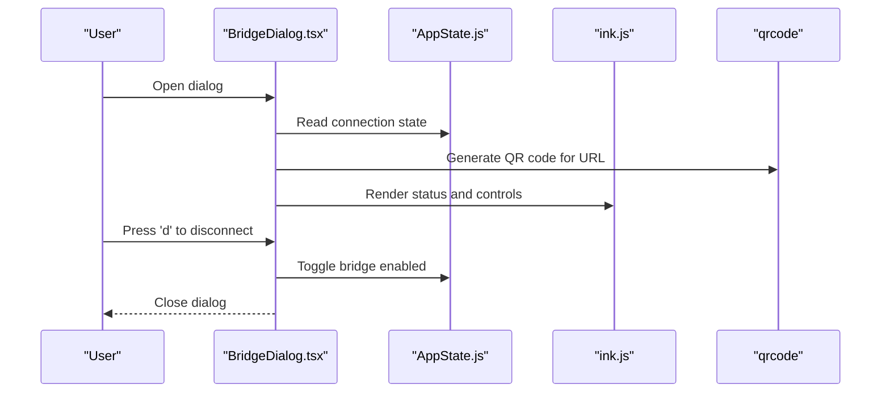
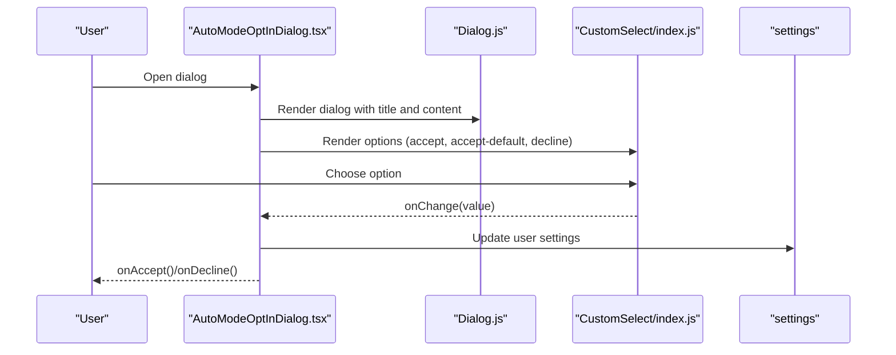
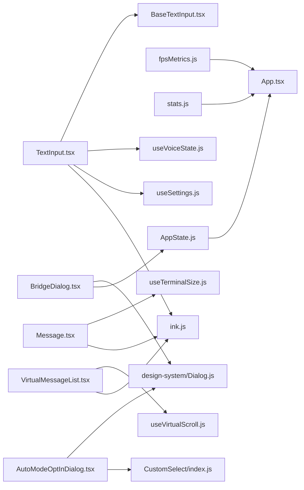

# UI Component Library

<cite>
**Referenced Files in This Document**
- [App.tsx](file://src/components/App.tsx)
- [AutoModeOptInDialog.tsx](file://src/components/AutoModeOptInDialog.tsx)
- [BridgeDialog.tsx](file://src/components/BridgeDialog.tsx)
- [VirtualMessageList.tsx](file://src/components/VirtualMessageList.tsx)
- [Message.tsx](file://src/components/Message.tsx)
- [TextInput.tsx](file://src/components/TextInput.tsx)
- [design-system/Dialog.js](file://src/components/design-system/Dialog.js)
- [CustomSelect/index.js](file://src/components/CustomSelect/index.js)
- [ink.js](file://src/ink.js)
- [AppState.js](file://src/state/AppState.js)
- [onChangeAppState.js](file://src/state/onChangeAppState.js)
- [fpsMetrics.js](file://src/context/fpsMetrics.js)
- [stats.js](file://src/context/stats.js)
- [useTerminalSize.js](file://src/hooks/useTerminalSize.js)
- [useTextInput.js](file://src/hooks/useTextInput.js)
- [useVirtualScroll.js](file://src/hooks/useVirtualScroll.js)
- [useVoiceState.js](file://src/context/voice.js)
- [useClipboardImageHint.js](file://src/hooks/useClipboardImageHint.js)
- [useSettings.js](file://src/hooks/useSettings.js)
- [envUtils.js](file://src/utils/envUtils.js)
- [textHighlighting.js](file://src/utils/textHighlighting.js)
- [BaseTextInput.tsx](file://src/components/BaseTextInput.tsx)
- [Spinner/utils.js](file://src/components/Spinner/utils.js)
</cite>

## Table of Contents
1. [Introduction](#introduction)
2. [Project Structure](#project-structure)
3. [Core Components](#core-components)
4. [Architecture Overview](#architecture-overview)
5. [Detailed Component Analysis](#detailed-component-analysis)
6. [Dependency Analysis](#dependency-analysis)
7. [Performance Considerations](#performance-considerations)
8. [Troubleshooting Guide](#troubleshooting-guide)
9. [Conclusion](#conclusion)

## Introduction
This document describes the UI component library used in the terminal interface. It covers the design system components (dialogs, forms, lists), the message rendering system, chat interface elements, and interactive controls. It explains component props, styling and theming options, customization capabilities, composition patterns, state management integration, and performance optimizations tailored for terminal rendering.

## Project Structure
The UI library is organized around reusable components, a terminal-focused rendering engine (Ink), and state management utilities. Key areas:
- Design system: base UI primitives and composite components (e.g., Dialog, Select)
- Terminal rendering: Ink-based components and utilities for terminal output
- Chat and messaging: specialized components for transcripts, virtualized lists, and message rendering
- Forms and inputs: text input with advanced features (voice, highlighting, accessibility)
- State and context: application state provider, FPS metrics, and stats providers

**Diagram sources**
- [App.tsx:19-55](file://src/components/App.tsx#L19-L55)
- [AppState.js](file://src/state/AppState.js)
- [fpsMetrics.js](file://src/context/fpsMetrics.js)
- [stats.js](file://src/context/stats.js)
- [design-system/Dialog.js](file://src/components/design-system/Dialog.js)
- [CustomSelect/index.js](file://src/components/CustomSelect/index.js)
- [ink.js](file://src/ink.js)
- [BaseTextInput.tsx](file://src/components/BaseTextInput.tsx)
- [TextInput.tsx:37-123](file://src/components/TextInput.tsx#L37-L123)
- [Message.tsx:58-355](file://src/components/Message.tsx#L58-L355)
- [VirtualMessageList.tsx:289-800](file://src/components/VirtualMessageList.tsx#L289-L800)
- [BridgeDialog.tsx:20-401](file://src/components/BridgeDialog.tsx#L20-L401)
- [AutoModeOptInDialog.tsx:17-142](file://src/components/AutoModeOptInDialog.tsx#L17-L142)

**Section sources**
- [App.tsx:1-56](file://src/components/App.tsx#L1-L56)
- [AppState.js](file://src/state/AppState.js)
- [fpsMetrics.js](file://src/context/fpsMetrics.js)
- [stats.js](file://src/context/stats.js)

## Core Components
This section outlines the primary UI building blocks and their roles.

- Dialog (design-system/Dialog.js)
  - Purpose: Modal dialog primitive with title, cancel handler, and optional input guide hiding.
  - Props: title, onCancel, hideInputGuide, children.
  - Usage: Wraps content in a consistent dialog surface.

- Select (CustomSelect/index.js)
  - Purpose: Dropdown-like selection control.
  - Props: options, onChange, onCancel.
  - Usage: Integrated into dialogs for user choices.

- TextInput (TextInput.tsx)
  - Purpose: Enhanced terminal text input with optional voice recording visualization, accessibility, and highlighting.
  - Props: value, onChange, onSubmit, onExit, onHistory*, onClearInput, focus, mask, multiline, showCursor, highlightPastedText, cursorOffset, onChangeCursorOffset, inputFilter, inlineGhostText, highlights.
  - Features: Voice recording waveform cursor, reduced motion support, accessibility toggle, clipboard image hint integration.

- BaseTextInput (BaseTextInput.tsx)
  - Purpose: Low-level terminal input implementation used by TextInput.
  - Props: inputState, terminalFocus, highlights, invert, hidePlaceholderText.

- Message (Message.tsx)
  - Purpose: Renders individual messages with content-specific subcomponents (user, assistant, system, attachments, grouped tool use, collapsed search).
  - Props: message, lookups, containerWidth, addMargin, tools, commands, verbose, inProgressToolUseIDs, progressMessagesForMessage, shouldAnimate, shouldShowDot, style, width, isTranscriptMode, isStatic, onOpenRateLimitOptions, isActiveCollapsedGroup, isUserContinuation, lastThinkingBlockId, latestBashOutputUUID.

- VirtualMessageList (VirtualMessageList.tsx)
  - Purpose: Virtualized, high-performance message list for fullscreen transcripts with search, navigation, and sticky prompt tracking.
  - Props: messages, scrollRef, columns, itemKey, renderItem, onItemClick, isItemClickable, isItemExpanded, extractSearchText, trackStickyPrompt, selectedIndex, cursorNavRef, setCursor, jumpRef, onSearchMatchesChange, scanElement, setPositions.

- BridgeDialog (BridgeDialog.tsx)
  - Purpose: Terminal bridge connection dialog with QR code generation, status indicators, and quick actions.
  - Props: onDone.
  - Features: Dynamic QR code, status display, keybindings, and explicit disconnect option.

- AutoModeOptInDialog (AutoModeOptInDialog.tsx)
  - Purpose: Opt-in dialog for auto permission mode with analytics logging and settings updates.
  - Props: onAccept, onDecline, declineExits.
  - Features: Options for accepting with default mode, accepting only, or declining.

**Section sources**
- [design-system/Dialog.js](file://src/components/design-system/Dialog.js)
- [CustomSelect/index.js](file://src/components/CustomSelect/index.js)
- [TextInput.tsx:34-123](file://src/components/TextInput.tsx#L34-L123)
- [BaseTextInput.tsx](file://src/components/BaseTextInput.tsx)
- [Message.tsx:32-627](file://src/components/Message.tsx#L32-L627)
- [VirtualMessageList.tsx:69-113](file://src/components/VirtualMessageList.tsx#L69-L113)
- [BridgeDialog.tsx:17-401](file://src/components/BridgeDialog.tsx#L17-L401)
- [AutoModeOptInDialog.tsx:11-142](file://src/components/AutoModeOptInDialog.tsx#L11-L142)

## Architecture Overview
The UI layer integrates state providers, terminal rendering primitives, and specialized components. The root App component wires FPS metrics, stats, and app state providers. Terminal rendering is handled by Ink primitives, while dialogs and forms rely on the design system and input components.

**Diagram sources**
- [App.tsx:19-55](file://src/components/App.tsx#L19-L55)
- [AppState.js](file://src/state/AppState.js)
- [fpsMetrics.js](file://src/context/fpsMetrics.js)
- [stats.js](file://src/context/stats.js)

## Detailed Component Analysis

### Dialog System
The design system provides a base Dialog component used by higher-level dialogs such as BridgeDialog and AutoModeOptInDialog. Dialog composes Ink primitives and exposes a simple contract for title, cancellation, and content.

**Diagram sources**
- [design-system/Dialog.js](file://src/components/design-system/Dialog.js)
- [BridgeDialog.tsx:16-34](file://src/components/BridgeDialog.tsx#L16-L34)
- [AutoModeOptInDialog.tsx:7-16](file://src/components/AutoModeOptInDialog.tsx#L7-L16)

**Section sources**
- [design-system/Dialog.js](file://src/components/design-system/Dialog.js)
- [BridgeDialog.tsx:16-34](file://src/components/BridgeDialog.tsx#L16-L34)
- [AutoModeOptInDialog.tsx:7-16](file://src/components/AutoModeOptInDialog.tsx#L7-L16)

### Text Input and Accessibility
TextInput augments BaseTextInput with terminal-specific features: voice recording visualization, accessibility toggles, reduced motion support, and clipboard image hints. It integrates with Ink for terminal focus and theming.

**Diagram sources**
- [TextInput.tsx:37-123](file://src/components/TextInput.tsx#L37-L123)
- [BaseTextInput.tsx](file://src/components/BaseTextInput.tsx)
- [useVoiceState.js](file://src/context/voice.js)
- [useSettings.js](file://src/hooks/useSettings.js)
- [ink.js](file://src/ink.js)

**Section sources**
- [TextInput.tsx:34-123](file://src/components/TextInput.tsx#L34-L123)
- [BaseTextInput.tsx](file://src/components/BaseTextInput.tsx)
- [useVoiceState.js](file://src/context/voice.js)
- [useSettings.js](file://src/hooks/useSettings.js)
- [envUtils.js](file://src/utils/envUtils.js)
- [textHighlighting.js](file://src/utils/textHighlighting.js)
- [Spinner/utils.js](file://src/components/Spinner/utils.js)

### Message Rendering Pipeline
Message.tsx routes rendering to content-specific subcomponents based on message type. It coordinates with terminal sizing, tools, commands, and progress messages. VirtualMessageList.tsx provides a virtualized, searchable, and navigable transcript view.

**Diagram sources**
- [Message.tsx:58-355](file://src/components/Message.tsx#L58-L355)

**Section sources**
- [Message.tsx:32-627](file://src/components/Message.tsx#L32-L627)
- [VirtualMessageList.tsx:289-800](file://src/components/VirtualMessageList.tsx#L289-L800)
- [useTerminalSize.js](file://src/hooks/useTerminalSize.js)
- [useVirtualScroll.js](file://src/hooks/useVirtualScroll.js)

### Bridge Control Dialog
BridgeDialog manages remote bridge connectivity with dynamic QR code generation, status display, and keyboard shortcuts. It integrates with AppState for connection state and uses Ink for terminal rendering.

**Diagram sources**
- [BridgeDialog.tsx:20-401](file://src/components/BridgeDialog.tsx#L20-L401)
- [AppState.js](file://src/state/AppState.js)
- [ink.js](file://src/ink.js)

**Section sources**
- [BridgeDialog.tsx:17-401](file://src/components/BridgeDialog.tsx#L17-L401)

### Auto Mode Opt-In Dialog
AutoModeOptInDialog presents options for enabling auto permission mode, logs analytics, and updates settings. It uses Dialog and Select for user interaction.

**Diagram sources**
- [AutoModeOptInDialog.tsx:17-142](file://src/components/AutoModeOptInDialog.tsx#L17-L142)
- [design-system/Dialog.js](file://src/components/design-system/Dialog.js)
- [CustomSelect/index.js](file://src/components/CustomSelect/index.js)

**Section sources**
- [AutoModeOptInDialog.tsx:11-142](file://src/components/AutoModeOptInDialog.tsx#L11-L142)

## Dependency Analysis
The UI components depend on shared utilities and state management. The following diagram shows key dependencies among major components.

**Diagram sources**
- [App.tsx:1-56](file://src/components/App.tsx#L1-L56)
- [AppState.js](file://src/state/AppState.js)
- [fpsMetrics.js](file://src/context/fpsMetrics.js)
- [stats.js](file://src/context/stats.js)
- [TextInput.tsx:34-123](file://src/components/TextInput.tsx#L34-L123)
- [BaseTextInput.tsx](file://src/components/BaseTextInput.tsx)
- [useVoiceState.js](file://src/context/voice.js)
- [useSettings.js](file://src/hooks/useSettings.js)
- [ink.js](file://src/ink.js)
- [Message.tsx:32-627](file://src/components/Message.tsx#L32-L627)
- [useTerminalSize.js](file://src/hooks/useTerminalSize.js)
- [VirtualMessageList.tsx:69-113](file://src/components/VirtualMessageList.tsx#L69-L113)
- [useVirtualScroll.js](file://src/hooks/useVirtualScroll.js)
- [BridgeDialog.tsx:17-401](file://src/components/BridgeDialog.tsx#L17-L401)
- [design-system/Dialog.js](file://src/components/design-system/Dialog.js)
- [AutoModeOptInDialog.tsx:11-142](file://src/components/AutoModeOptInDialog.tsx#L11-L142)
- [CustomSelect/index.js](file://src/components/CustomSelect/index.js)

**Section sources**
- [App.tsx:1-56](file://src/components/App.tsx#L1-L56)
- [AppState.js](file://src/state/AppState.js)
- [fpsMetrics.js](file://src/context/fpsMetrics.js)
- [stats.js](file://src/context/stats.js)
- [TextInput.tsx:34-123](file://src/components/TextInput.tsx#L34-L123)
- [Message.tsx:32-627](file://src/components/Message.tsx#L32-L627)
- [VirtualMessageList.tsx:69-113](file://src/components/VirtualMessageList.tsx#L69-L113)
- [BridgeDialog.tsx:17-401](file://src/components/BridgeDialog.tsx#L17-L401)
- [AutoModeOptInDialog.tsx:11-142](file://src/components/AutoModeOptInDialog.tsx#L11-L142)

## Performance Considerations
- Virtualization: VirtualMessageList uses a virtual scrolling engine to render large transcripts efficiently, minimizing DOM nodes and reflows.
- Memoization: Message employs React.memo with a custom equality function to avoid unnecessary re-renders when only non-essential props change.
- Terminal-aware rendering: Components leverage Ink’s optimized terminal rendering pipeline to reduce overhead.
- Accessibility and motion: TextInput respects reduced motion preferences and accessibility flags to avoid heavy animations.
- Search indexing: VirtualMessageList supports warming the search index to accelerate incremental search.

[No sources needed since this section provides general guidance]

## Troubleshooting Guide
- Dialog not closing or responding to cancel:
  - Verify onCancel prop is passed to Dialog and that child components do not intercept events unexpectedly.
  - Check that higher-level dialogs (BridgeDialog, AutoModeOptInDialog) wire onCancel correctly.

- Text input not focused or cursor not visible:
  - Confirm terminal focus state and accessibility flags. TextInput hides cursor when accessibility is enabled.
  - Ensure invert function is applied correctly and theme text color is set.

- Voice recording visualization not updating:
  - Validate voice state hook and audio levels array. Ensure reduced motion is disabled for animation.

- Message list not scrolling or jumping:
  - Confirm scrollRef is attached to a ScrollBox and that scrollToIndex is invoked with correct indices.
  - Verify itemKey uniqueness and stable keys for virtualization.

- Bridge dialog QR not generating:
  - Ensure display URL is present and QR code generation is triggered when showQR is true.

**Section sources**
- [design-system/Dialog.js](file://src/components/design-system/Dialog.js)
- [TextInput.tsx:65-123](file://src/components/TextInput.tsx#L65-L123)
- [VirtualMessageList.tsx:406-605](file://src/components/VirtualMessageList.tsx#L406-L605)
- [BridgeDialog.tsx:62-86](file://src/components/BridgeDialog.tsx#L62-L86)

## Conclusion
The UI component library combines a robust design system, terminal-optimized rendering, and specialized messaging and input components. It emphasizes performance (virtualization, memoization), accessibility (reduced motion, accessibility flags), and composability (providers, hooks, and primitives). The architecture cleanly separates concerns between state, rendering, and domain-specific dialogs and lists, enabling maintainable and scalable terminal interfaces.